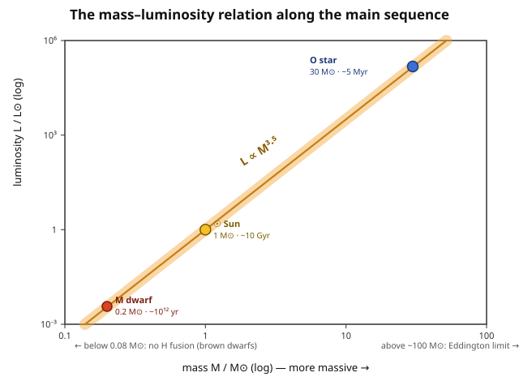

# Astrophysics · Lesson 2.5: The main sequence

> ⏱ ~15 min · Module 2: Stellar structure · Builds on: [2.1 The equations of stellar structure](#/lesson/astrophysics/02-01-equations-stellar-structure.md), [2.2 Energy transport and opacity](#/lesson/astrophysics/02-02-energy-transport-opacity.md), [2.4 Polytropes and Lane–Emden](#/lesson/astrophysics/02-04-polytropes-lane-emden.md) · Unlocks: Module 3 (star formation, evolution, and death)

## Why this matters

Look at the HR diagram from [1.2](#/lesson/astrophysics/01-02-blackbody-spectra-hr-diagram.md) and one feature dominates: a diagonal ridge running from hot-and-luminous to cool-and-dim where **roughly 90% of all stars sit**. That's the main sequence — not a type of star but a *phase*, the long era of steady hydrogen fusion in the core. The astonishing fact this lesson earns is that this whole ridge is a **one-parameter family**: fix a star's birth mass and you have essentially fixed its luminosity, radius, temperature, color, position on the diagram, and how long it will live. One number writes the entire biography. We'll derive the mass–luminosity relation, turn it into a lifetime, and find the two masses that bracket what a "star" can even be.

## The idea

A main-sequence star is a hydrogen furnace held in balance: gravity squeezing in, gas and radiation pressure pushing out ([2.1](#/lesson/astrophysics/02-01-equations-stellar-structure.md)), with fusion in the core replacing exactly the energy that leaks out the surface. Nothing about that balance is free to be chosen once you set the mass — a heavier star must run a hotter, denser core to hold itself up, a hotter core fuses far faster, so a heavier star is *drastically* more luminous. That single chain, "more mass → hotter core → more light," is the mass–luminosity relation, and it's brutally steep: double the mass and the luminosity jumps roughly tenfold.

Now the twist that makes stellar lifetimes so lopsided. A star's fuel tank scales with its mass. Its burn rate is its luminosity. So lifetime $\sim$ fuel $/$ rate $\sim M/L$ — and because $L$ climbs so much faster than $M$, **the biggest stars are the most wasteful**. A massive O star has a hundred times the fuel of the Sun but burns it a *million* times faster, and dies in a few million years. A red dwarf sips its fuel over *trillions* of years — longer than the current age of the universe, which is why not a single red dwarf has ever finished its main-sequence life.

## The formal version

**Mass–luminosity relation.** Combine two results you already have. Radiative diffusion ([2.2](#/lesson/astrophysics/02-02-energy-transport-opacity.md)) carries a luminosity

$$L \sim \frac{4\pi r^2 c}{3\kappa\rho}\,\frac{d(aT^4)}{dr} \;\sim\; \frac{c\,a\,T^4 R^4}{\kappa M},$$

where I used $\rho \sim M/R^3$, replaced $dr$ by $R$ and $r$ by $R$ (order-of-magnitude), $\kappa$ is the opacity (cm²/g), $c$ the speed of light, $a$ the radiation constant, and $R,M,T$ the star's radius, mass, and a characteristic interior temperature. From hydrostatic equilibrium plus the ideal-gas law ([2.1](#/lesson/astrophysics/02-01-equations-stellar-structure.md)), the interior temperature scales as

$$k_B T \sim \frac{G M \mu m_H}{R} \quad\Longrightarrow\quad T \propto \frac{M}{R},$$

with $k_B$ Boltzmann's constant, $G$ the gravitational constant, $\mu$ the mean molecular weight, $m_H$ the hydrogen mass. Substitute $T^4 \propto M^4/R^4$ into $L$:

$$\boxed{\,L \;\propto\; \frac{R^4}{M}\cdot\frac{M^4}{R^4} \;=\; M^3\,}\qquad(\kappa \text{ constant}).$$

In words: the radius cancels completely, and luminosity depends on **mass alone**. The clean scaling is $L\propto M^3$; because opacity isn't really constant (Kramers opacity $\kappa\propto\rho T^{-3.5}$ steepens it at low mass, electron-scattering and radiation pressure flatten it at high mass), the observed relation across the whole sequence averages to

$$L \approx L_\odot \left(\frac{M}{M_\odot}\right)^{\alpha}, \qquad \alpha \approx 3.5 \;\; (\text{steeper},\ \sim 4,\ \text{for } M\lesssim M_\odot;\ \text{flatter},\ \to 1,\ \text{for } M\gtrsim 20\,M_\odot).$$

**Mass–radius and mass–temperature trends.** Along the sequence $R\propto M^{0.6\text{–}0.8}$ — a *weak* dependence, so radius varies far less than luminosity. Feeding $R\propto M^{0.7}$ and $L\propto M^{3.5}$ into $L = 4\pi R^2\sigma T_{\rm eff}^4$ ([1.2](#/lesson/astrophysics/01-02-blackbody-spectra-hr-diagram.md), $\sigma$ = Stefan–Boltzmann constant) gives $T_{\rm eff}\propto M^{0.5}$: **massive stars are hot, blue, luminous (O/B); low-mass stars are cool, red, dim (M dwarfs).** That ordering *is* the main-sequence ridge.

**Main-sequence lifetime.** The star lives on its core hydrogen; fuel energy $E\propto M$ and burn rate $L\propto M^{3.5}$, so

$$\boxed{\,t_{\rm MS} \;\sim\; \frac{E}{L} \;\propto\; \frac{M}{M^{3.5}} \;=\; M^{-2.5}\,}.$$

In words: **lifetime falls off as roughly the 2.5 power of mass.** Normalizing to the Sun ($t_\odot \approx 10\,\mathrm{Gyr}$, $M_\odot$), $\;t_{\rm MS}\approx 10\,\mathrm{Gyr}\,(M/M_\odot)^{-2.5}$. (With the clean $L\propto M^3$ you'd get $t\propto M^{-2}$; the truth sits near $-2.5$.)

**The two mass limits.**
- **Upper, $\sim 100\text{–}150\,M_\odot$:** as $L\propto M^{3.5}$ races upward it approaches the **Eddington luminosity** $L_{\rm Edd}\propto M$ — the point where radiation pressure on the gas equals gravity ([Problem 3](#problems); revisited in [4.3](#/lesson/astrophysics/04-03-black-holes-astrophysics.md)). Beyond it a star cannot hold itself together and sheds mass violently.
- **Lower, $\sim 0.08\,M_\odot$:** below this the core never reaches the $\sim 10^7\,\mathrm{K}$ that hydrogen fusion needs, because **electron degeneracy pressure** (the [`stat-mech`](#/course/stat-mech) Fermi gas, [4.4](#/lesson/stat-mech/04-04-ideal-fermi-gas.md)) halts the collapse before ignition. The result is a **brown dwarf** — a failed star that glows only from leftover contraction heat.

## Picture

The line is steep: three decades in mass span nine decades in luminosity. The lifetimes printed at each point run *backward* — the luminous end burns out first.

## Worked examples

**Example 1 (mechanical — reading lifetime off mass).** A B star has $M = 5\,M_\odot$. Its main-sequence life is

$$t_{\rm MS} \approx 10\,\mathrm{Gyr}\times 5^{-2.5} = 10\,\mathrm{Gyr}\times \frac{1}{55.9} \approx 0.18\,\mathrm{Gyr} = 1.8\times10^{8}\,\mathrm{yr}.$$

Eighteen hundred times shorter than the Sun's, from just five times the mass — the steepness in one line. A cluster containing this star must be younger than $\sim$180 Myr, or the star would already be gone; **the most massive surviving star in a cluster is a clock.**

**Example 2 (why you'd care — how much fuel is actually spent).** The Sun's luminosity is $L_\odot = 3.8\times10^{26}\,\mathrm{W}$; over a $10\,\mathrm{Gyr}\approx 3.2\times10^{17}\,\mathrm{s}$ life it radiates

$$E = L_\odot\, t_\odot \approx 3.8\times10^{26}\times 3.2\times10^{17} \approx 1.2\times10^{44}\,\mathrm{J}.$$

Fusing hydrogen to helium releases $0.7\%$ of the rest energy, i.e. $0.007c^2 = 6.3\times10^{14}\,\mathrm{J}$ per kg of hydrogen. So the hydrogen consumed is $E/(6.3\times10^{14}) \approx 2\times10^{29}\,\mathrm{kg} \approx 0.1\,M_\odot$. The Sun is $\sim70\%$ hydrogen, yet only about a **tenth of its mass** ever fuses — just the hot central core reaches ignition temperature. That "$\sim$10% of the fuel is actually burned" factor is exactly what turns the naive "if *all* the mass fused" lifetime of $\sim$100 Gyr into the real $\sim$10 Gyr.

## Watch out

- You might think the main sequence is a *stage of aging* a star climbs along, like a track. It isn't — a star sits at essentially **one spot** on the sequence (set by its mass) for its whole hydrogen-burning life, then leaves the sequence entirely ([3.2](#/lesson/astrophysics/03-02-post-main-sequence.md)). The ridge is a snapshot of many stars of different masses, not one star's path.
- You might think "more massive = longer-lived," as bigger things usually last longer. The opposite is true and dramatically so: more mass means a *far* higher burn rate, so **massive stars die youngest**. Fuel scales as $M$, burn rate as $M^{3.5}$ — the tank grows linearly, the engine grows cubically-and-then-some.
- You might use $L\propto M^{3.5}$ right up to $150\,M_\odot$. The exponent isn't universal: it steepens toward 4 for low-mass stars and *flattens toward 1* at the top, where electron scattering fixes the opacity and radiation pressure dominates — which is also why the Eddington limit is reachable at all.

## One-liner

> A main-sequence star is a one-parameter object: its birth mass sets its luminosity ($L\propto M^{3.5}$), and thus its lifetime ($t\propto M^{-2.5}$) — massive stars blaze and die in millions of years, red dwarfs smolder for trillions.

## Problems

**P1 (🟢)** Using $t_{\rm MS}\approx 10\,\mathrm{Gyr}\,(M/M_\odot)^{-2.5}$ (normalized to the Sun), find the main-sequence lifetime of (a) a $10\,M_\odot$ star and (b) a $0.5\,M_\odot$ red dwarf. Compare each to the age of the universe, $\approx 13.8\,\mathrm{Gyr}$.

**P2 (🟡)** (a) From the mass–luminosity relation $L\propto M^{3.5}$ and the fact that fuel energy scales as $E\propto M$, show that $t_{\rm MS}\propto M^{-2.5}$. (b) Compute the Sun's main-sequence lifetime *from scratch*: take the hydrogen actually available as $\approx 0.1\,M_\odot$ ($M_\odot = 1.99\times10^{30}\,\mathrm{kg}$), fusion efficiency $0.7\%$, and $L_\odot = 3.8\times10^{26}\,\mathrm{W}$.

**P3 (🔴, optional)** The **Eddington luminosity** is where radiation pressure (via electron scattering, Thomson cross-section $\sigma_T = 6.65\times10^{-29}\,\mathrm{m^2}$) balances gravity on the ionized-hydrogen gas. (a) By balancing the radiative force on an electron, $\sigma_T L/(4\pi r^2 c)$, against gravity on its partner proton, $GMm_p/r^2$, derive $L_{\rm Edd} = 4\pi G M m_p c/\sigma_T$ and show it scales as $L_{\rm Edd}\propto M$. Evaluate it in solar units. (b) Setting the star's own $L\approx L_\odot (M/M_\odot)^{3.5}$ equal to $L_{\rm Edd}$, estimate the mass at which a star hits its own Eddington limit.

Solutions

**P1** (a) $t = 10\,\mathrm{Gyr}\times 10^{-2.5} = 10\times 10^{-2.5}\,\mathrm{Gyr} = 10^{-1.5}\,\mathrm{Gyr} \approx 0.032\,\mathrm{Gyr} = 32\,\mathrm{Myr}$. Far shorter than the universe's age — a $10\,M_\odot$ star born with the Sun would have died over 13 billion years ago.

(b) $t = 10\,\mathrm{Gyr}\times 0.5^{-2.5}$. Since $0.5^{-2.5} = 2^{2.5} = 2^2\sqrt{2} = 5.66$, we get $t \approx 57\,\mathrm{Gyr}$ — about **four times the current age of the universe**. Every $0.5\,M_\odot$ red dwarf ever formed is still on the main sequence; none has had time to finish. (Real models give even longer, $\sim$100 Gyr, because low-mass stars mix and use their fuel more thoroughly.)

**P2** (a) Lifetime is fuel divided by burn rate: $t_{\rm MS}\sim E/L$. With $E\propto M$ and $L\propto M^{3.5}$,
$$t_{\rm MS}\propto \frac{M}{M^{3.5}} = M^{1-3.5} = M^{-2.5}.\ \checkmark$$

(b) Available fuel mass: $0.1\,M_\odot = 0.1\times 1.99\times10^{30} = 1.99\times10^{29}\,\mathrm{kg}$. Energy released at $0.7\%$ efficiency:
$$E = 0.007\,(1.99\times10^{29})\,c^2 = 0.007\times 1.99\times10^{29}\times (3.0\times10^{8})^2 \approx 1.25\times10^{44}\,\mathrm{J}.$$
Divide by luminosity:
$$t = \frac{E}{L_\odot} = \frac{1.25\times10^{44}}{3.8\times10^{26}} \approx 3.3\times10^{17}\,\mathrm{s} \approx 1.0\times10^{10}\,\mathrm{yr} = 10\,\mathrm{Gyr}.\ \checkmark$$
The $0.1\,M_\odot$ (not the full $\sim0.7\,M_\odot$ of hydrogen) is the crucial input — only the core burns, so $\sim$10% of the star's mass is spent, and that is what lands the answer at 10 Gyr rather than $\sim$70 Gyr.

**P3** (a) Radiation carries momentum: a flux $L/(4\pi r^2)$ deposits force $\sigma_T L/(4\pi r^2 c)$ on each electron (momentum flux = energy flux $/c$, times the cross-section it intercepts). The gas is ionized hydrogen, so each electron is tied electrostatically to a proton carrying nearly all the mass; gravity pulls the pair inward with $GM m_p/r^2$. Balance:
$$\frac{\sigma_T L_{\rm Edd}}{4\pi r^2 c} = \frac{G M m_p}{r^2} \quad\Longrightarrow\quad L_{\rm Edd} = \frac{4\pi G M m_p c}{\sigma_T}.$$
The $r^{-2}$ cancels, so the balance holds at every radius, and $L_{\rm Edd}\propto M$. Numerically, per kilogram of star:
$$\frac{L_{\rm Edd}}{M} = \frac{4\pi G m_p c}{\sigma_T} = \frac{4\pi (6.67\times10^{-11})(1.67\times10^{-27})(3.0\times10^{8})}{6.65\times10^{-29}} \approx 6.3\ \mathrm{W/kg}.$$
Times $M_\odot = 1.99\times10^{30}\,\mathrm{kg}$: $L_{\rm Edd}(M_\odot) \approx 1.3\times10^{31}\,\mathrm{W} \approx 3.3\times10^{4}\,L_\odot$. So $L_{\rm Edd}\approx 3.3\times10^{4}\,(M/M_\odot)\,L_\odot$.

(b) Set the star's luminosity equal to its Eddington limit:
$$L_\odot\left(\frac{M}{M_\odot}\right)^{3.5} = 3.3\times10^{4}\,L_\odot\left(\frac{M}{M_\odot}\right) \;\Longrightarrow\; \left(\frac{M}{M_\odot}\right)^{2.5} = 3.3\times10^{4},$$
$$\frac{M}{M_\odot} = (3.3\times10^{4})^{1/2.5} = (3.3\times10^{4})^{0.4} \approx 64.$$
So somewhere around $M\sim 60\text{–}100\,M_\odot$ a star's own radiation begins to overwhelm its gravity — the physical origin of the upper mass limit. The estimate lands *below* the observed $\sim$150 $M_\odot$ precisely because $L\propto M^{3.5}$ overstates the luminosity of the heaviest stars, where the exponent flattens toward 1; use the true flatter slope and the crossing moves higher. Order of magnitude, though, the ceiling is set right here.

## Flashback

**From Lesson 1.2 (Blackbody spectra and the HR diagram):** A main-sequence O star has luminosity $L = 10^{5}\,L_\odot$ and effective temperature $T_{\rm eff} = 30{,}000\,\mathrm{K}$. Using $L = 4\pi R^2\sigma T_{\rm eff}^4$ and the Sun's $T_\odot = 5{,}770\,\mathrm{K}$, find the star's radius in solar radii.

Solution

Take the ratio to the Sun so the constants $4\pi\sigma$ drop out:
$$\frac{L}{L_\odot} = \left(\frac{R}{R_\odot}\right)^2\left(\frac{T_{\rm eff}}{T_\odot}\right)^4 \;\Longrightarrow\; \left(\frac{R}{R_\odot}\right)^2 = \frac{L/L_\odot}{(T_{\rm eff}/T_\odot)^4}.$$
The temperature ratio is $30{,}000/5{,}770 = 5.20$, so $(T_{\rm eff}/T_\odot)^4 = 5.20^4 \approx 730$. Then
$$\left(\frac{R}{R_\odot}\right)^2 = \frac{10^5}{730} \approx 137 \;\Longrightarrow\; \frac{R}{R_\odot} \approx 12.$$
About $12\,R_\odot$ — a hot, luminous O star is big, but only by a factor $\sim$10, consistent with the weak mass–radius trend in this lesson: its enormous luminosity comes overwhelmingly from temperature ($T^4$), not size.

## Connections

- **Backward:** this lesson *assembles* Module 2. The mass–luminosity relation is [2.2](#/lesson/astrophysics/02-02-energy-transport-opacity.md)'s radiative diffusion married to [2.1](#/lesson/astrophysics/02-01-equations-stellar-structure.md)'s hydrostatic-equilibrium temperature; the $\sim10^7\,\mathrm{K}$ ignition threshold behind the lower mass limit is the fusion condition from [2.3](#/lesson/astrophysics/02-03-nuclear-energy-generation.md) (the Gamow peak); the weak mass–radius trend is the empirical face of [2.4](#/lesson/astrophysics/02-04-polytropes-lane-emden.md)'s polytropic relation.
- **Forward:** the finite lifetime $t\propto M^{-2.5}$ is the starting gun for [Module 3](#/lesson/astrophysics/03-02-post-main-sequence.md) — when core hydrogen runs out, the star leaves the sequence. The lifetime-vs-mass law also underlies stellar populations and the initial mass function ([3.5](#/lesson/astrophysics/03-05-imf-stellar-populations.md)): why the light of an old galaxy is dominated by low-mass survivors.
- **Sideways (`stat-mech`):** the lower mass limit is electron degeneracy pressure ([4.4 ideal Fermi gas](#/lesson/stat-mech/04-04-ideal-fermi-gas.md)) stopping contraction before ignition — the *same* physics that supports a white dwarf ([4.1](#/lesson/astrophysics/04-01-white-dwarfs-chandrasekhar.md)), just on the failed-star side of the line. The Eddington limit reappears as the ceiling on accretion luminosity for black holes ([4.3](#/lesson/astrophysics/04-03-black-holes-astrophysics.md)).
