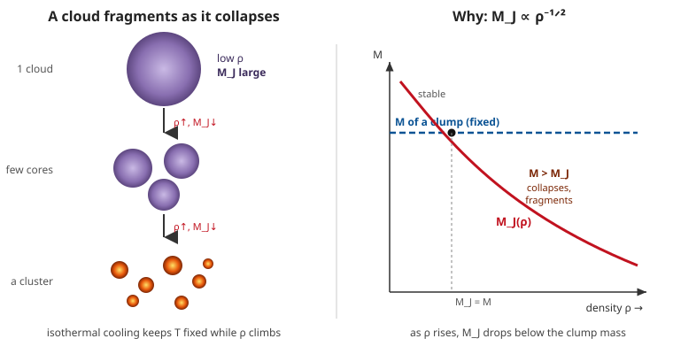

# Astrophysics · Lesson 3.1: Star formation and the Jeans instability

> ⏱ ~15 min · Module 3: Stellar evolution and death · Builds on: [1.4 Gravitational dynamics: the virial theorem](#/lesson/astrophysics/01-04-gravitational-dynamics-virial.md), [1.2 Blackbody radiation and the HR diagram](#/lesson/astrophysics/01-02-blackbody-spectra-hr-diagram.md) · Unlocks: post-main-sequence evolution (3.2), the initial mass function (3.5), the interstellar medium (5.1)

## Why this matters

Every star you've studied so far arrived on the main sequence fully formed. But the main sequence has an on-ramp: stars condense out of cold gas. The physics is a single competition — **self-gravity trying to crush a cloud versus thermal pressure holding it up** — and the threshold where gravity wins has a name, the *Jeans mass*. Get it, and you can estimate whether any patch of interstellar gas will become a star, why a cloud never collapses into one giant sun but shatters into a whole cluster, and why the sky is full of stars of wildly different masses (the seed of the initial mass function, 3.5). It is also the cleanest possible payoff for the virial theorem you built in [1.4](#/lesson/astrophysics/01-04-gravitational-dynamics-virial.md): one energy inequality decides the fate of a cloud.

## The idea

Take a cold clump of interstellar gas. Two things fight over it. **Gravity** pulls every bit toward every other bit, trying to shrink the clump — the deeper you squeeze, the more gravitational energy is released. **Thermal pressure** pushes back: the gas particles are jiggling, and squeezing them raises the pressure that resists. 

Which wins depends on size. Gravitational binding energy scales like $GM^2/R$ — it grows fast as you pile on mass. Thermal energy scales like the number of particles times temperature, $\sim N k_B T$ — it grows only linearly with mass. So **make a clump big enough (or cold enough, or dense enough) and gravity inevitably overwhelms pressure.** Below that critical size, pressure wins and the clump just sits there, breathing. Above it — the **Jeans mass** — there is no equilibrium, and it collapses.

That's the whole story in one sentence: a cloud collapses when it is more massive than the Jeans mass. Everything else is putting numbers on "big enough."

## The formal version

Model the clump as a uniform sphere of mass $M$, radius $R$, temperature $T$, mass density $\rho$, made of particles of mean mass $\mu m_H$ (here $m_H = 1.67\times10^{-27}$ kg is the hydrogen mass and $\mu$ is the **mean molecular weight** — the average particle mass in units of $m_H$; for molecular hydrogen $\text{H}_2$, $\mu\approx 2$).

**Gravitational potential energy** of the uniform sphere (from `mechanics-refresher`'s [gravitation lesson](#/lesson/mechanics-refresher/05-01-gravitation-kepler.md), integrating shell by shell):
$$U = -\frac{3}{5}\frac{GM^2}{R}.$$
*In words:* the energy you'd have to supply to blow the sphere apart to infinity — negative because it's bound.

**Thermal (kinetic) energy** of $N = M/(\mu m_H)$ free particles at temperature $T$, from equipartition ($\tfrac{3}{2}k_B T$ per particle — see `stat-mech` [equipartition](#/lesson/stat-mech/03-04-equipartition-theorem.md)):
$$K = \frac{3}{2}N k_B T = \frac{3}{2}\frac{M}{\mu m_H}k_B T.$$

**The Jeans criterion (via the virial theorem).** A self-gravitating cloud is in equilibrium when $2K + U = 0$ (your [1.4](#/lesson/astrophysics/01-04-gravitational-dynamics-virial.md) result). If thermal support falls short — $2K < |U|$ — there is nothing to balance gravity and the cloud collapses:
$$2K < |U| \quad\Longleftrightarrow\quad 3\frac{M k_B T}{\mu m_H} < \frac{3}{5}\frac{GM^2}{R}.$$
*In words:* collapse when the gravitational pull outweighs twice the thermal push. Cancel and solve for mass, using $R = \left(3M/4\pi\rho\right)^{1/3}$ to trade radius for density:
$$\boxed{\,M > M_J \equiv \left(\frac{5 k_B T}{G\,\mu m_H}\right)^{3/2}\left(\frac{3}{4\pi\rho}\right)^{1/2}\,}$$
This is the **Jeans mass**. *In words:* the smallest cloud that gravity can collapse at this temperature and density. Hotter → larger $M_J$ (pressure is stronger); denser → smaller $M_J$ (gravity is closer-range and stronger). The prefactors ($3/5$, the factor $2$) shift with the model; the *scalings* $M_J\propto T^{3/2}\rho^{-1/2}$ are robust and are what you should remember.

**The Jeans length and free-fall time.** The same criterion phrased as a size is the **Jeans length** $\lambda_J \sim c_s/\sqrt{G\rho}$, where $c_s = \sqrt{k_B T/\mu m_H}$ is the (isothermal) sound speed — *clumps larger than $\lambda_J$ collapse*. And once collapse starts, pressure is irrelevant, so the clump falls together on the **free-fall time**
$$t_{ff} = \sqrt{\frac{3\pi}{32\,G\rho}}\ \sim\ \frac{1}{\sqrt{G\rho}}.$$
*In words:* the collapse clock is set by density alone — denser clouds collapse faster.

**Why cooling is the hidden hero.** Collapse *releases* gravitational energy. If that energy stayed in the gas, $T$ would rise, $M_J$ would grow, and the collapse would stall itself. Collapse continues only if the cloud can **radiate the energy away** — dust grains re-emitting in the infrared, and molecular rotational/vibrational lines (the same emission physics as `quantum-mechanics`' [rigid rotor](#/lesson/quantum-mechanics/04-03-spherical-harmonics-rigid-rotor.md) and [radiative transitions](#/lesson/quantum-mechanics/06-06-fermi-golden-rule-radiation.md)). Efficient cooling keeps the cloud roughly **isothermal**, and that is exactly what makes star formation runaway.

## Picture

The left column is the fragmentation cascade; the right panel is the reason for it — with $T$ pinned by cooling, $M_J$ slides down the $\rho^{-1/2}$ curve until it dips below the mass of ever-smaller sub-clumps, each of which then collapses on its own.

## Worked examples

**Example 1 (the number — is a molecular cloud unstable?).** Typical cold cloud: $T = 10$ K, number density $n = 10^4\ \text{cm}^{-3} = 10^{10}\ \text{m}^{-3}$, $\mu = 2$. First the mass density:
$$\rho = \mu m_H n = 2(1.67\times10^{-27})(10^{10}) = 3.3\times10^{-17}\ \text{kg/m}^3.$$
Now $M_J$. The first factor: $\dfrac{5k_BT}{G\mu m_H} = \dfrac{5(1.38\times10^{-23})(10)}{(6.67\times10^{-11})(2)(1.67\times10^{-27})} = 3.1\times10^{15}\ \text{kg/m}$, so its $3/2$ power is $1.7\times10^{23}$. The second factor: $\left(\dfrac{3}{4\pi\rho}\right)^{1/2} = 8.4\times10^{7}$. Multiply:
$$M_J \approx 1.5\times10^{31}\ \text{kg} \approx 7\,M_\odot.$$
So a clump of this cloud exceeding $\sim7$ solar masses is doomed to collapse — and molecular clouds hold thousands of $M_\odot$, so they're wildly unstable. The free-fall time is $t_{ff}=\sqrt{3\pi/32G\rho}\approx 1.1\times10^{13}\ \text{s}\approx 4\times10^{5}$ yr — fast, astronomically speaking.

**Example 2 (why cooling decides it).** Suppose that cloud could *not* radiate — collapse would be adiabatic. Gravitational energy released, $\Delta|U|\sim GM^2/R$, dumps straight into heat, raising $T$. Since $M_J\propto T^{3/2}$, a rising temperature *inflates* the Jeans mass; the clump that was above threshold can suddenly find itself below it, and collapse halts — the gas has re-inflated its own pressure support. This is precisely what stops a fully-formed **protostar** from collapsing further: once it's dense and opaque, trapped heat builds a pressure-supported core. Real clouds avoid this early on because dust and molecules radiate efficiently at 10–20 K, keeping $T$ nearly fixed. *Cooling is the permission slip for collapse.*

## Watch out

- You might think "$M_J$ is the mass of the star that forms." It isn't — it's the mass of the *smallest unstable region*. A cloud thousands of times $M_J$ doesn't make one huge star; it fragments (next section) and makes a cluster.
- You might think a hotter cloud collapses more easily. Opposite: heat is pressure. $M_J\propto T^{3/2}$, so warming a cloud *raises* the bar for collapse. Cold clouds are the fertile ones — which is why star formation happens in the coldest, densest gas.
- You might think gravity alone drives everything. Gravity supplies the *energy*, but **cooling supplies the permission**. Without a way to radiate that energy, released gravitational energy becomes pressure and self-arrests the collapse.
- Don't over-trust the prefactor. Different books put $\pi$'s and factors of 2 in different places (energy argument vs. full linear stability analysis). Trust $M_J\propto T^{3/2}\rho^{-1/2}$; treat the leading number as order-of-magnitude.

## One-liner

> A cloud collapses when it outweighs its Jeans mass $M_J\propto T^{3/2}\rho^{-1/2}$ — and because cooling holds $T$ fixed while collapse raises $\rho$, $M_J$ keeps dropping and the cloud shatters into a cluster of stars.

## Problems

**P1 (🟢)** A denser cloud core has $T = 10$ K, $n = 10^{6}\ \text{cm}^{-3}$, $\mu = 2$. Using $M_J\propto T^{3/2}\rho^{-1/2}$ and the Example 1 result ($M_J\approx7\,M_\odot$ at $n=10^4\ \text{cm}^{-3}$), find this core's Jeans mass — no need to redo the full constant. What kind of star could such a core seed?

**P2 (🟡)** Derive the Jeans mass from scratch by setting $|U| = 2K$ (the virial marginal-stability condition) for a uniform sphere with $U = -\tfrac{3}{5}GM^2/R$ and $K = \tfrac{3}{2}(M/\mu m_H)k_B T$. Solve for the critical mass $M(\rho,T)$, eliminating $R$ with $M = \tfrac{4}{3}\pi R^3\rho$.

**P3 (🔴, optional)** Show that if a cloud collapses **isothermally** (cooling holds $T$ fixed while $\rho$ rises), the Jeans mass falls as $M_J\propto\rho^{-1/2}$. Then argue this drives **fragmentation**: if the density increases by a factor $10^6$ during collapse, by what factor does $M_J$ drop, and roughly how many pieces can a cloud that started at $M\approx M_J$ break into? What eventually stops the fragmentation? (Forward link: this sets the low-mass end of the IMF, 3.5.)

Solutions

**P1** Only $\rho$ (hence $n$) changes, and $M_J\propto\rho^{-1/2}\propto n^{-1/2}$ at fixed $T,\mu$. Density is up by a factor $10^{6}/10^{4} = 10^{2}$, so $M_J$ drops by $\sqrt{10^{2}} = 10$:
$$M_J \approx \frac{7\,M_\odot}{10} \approx 0.7\,M_\odot.$$
A core of that mass could seed a roughly Sun-like star. (Denser gas → smaller Jeans mass → lower-mass stars: exactly the trend that populates the IMF with far more small stars than large ones.)

**P2** Set $|U| = 2K$:
$$\frac{3}{5}\frac{GM^2}{R} = 2\cdot\frac{3}{2}\frac{M k_B T}{\mu m_H} = \frac{3 M k_B T}{\mu m_H}.$$
Cancel one factor of $M$ and the $3$'s:
$$\frac{GM}{5R} = \frac{k_B T}{\mu m_H}\ \Longrightarrow\ \frac{M}{R} = \frac{5 k_B T}{G\mu m_H}.$$
Now eliminate $R$. From $M = \tfrac{4}{3}\pi R^3\rho$, $R = \left(\tfrac{3M}{4\pi\rho}\right)^{1/3}$, so
$$\frac{M}{R} = M\left(\frac{4\pi\rho}{3M}\right)^{1/3} = M^{2/3}\left(\frac{4\pi\rho}{3}\right)^{1/3}.$$
Set equal to $5k_BT/G\mu m_H$ and solve for $M$:
$$M^{2/3} = \frac{5k_BT}{G\mu m_H}\left(\frac{3}{4\pi\rho}\right)^{1/3}\ \Longrightarrow\ M_J = \left(\frac{5k_BT}{G\mu m_H}\right)^{3/2}\left(\frac{3}{4\pi\rho}\right)^{1/2}.$$
Exactly the boxed Jeans mass. ✓ (The $\tfrac35$ and the virial factor $2$ together produced the clean $5$.)

**P3** In $M_J = \left(\dfrac{5k_BT}{G\mu m_H}\right)^{3/2}\left(\dfrac{3}{4\pi\rho}\right)^{1/2}$, hold $T$ (and $\mu$) fixed. The first bracket is then constant; only the second depends on $\rho$, and it carries $\rho^{-1/2}$. Hence
$$M_J \propto \rho^{-1/2}. \checkmark$$
**Fragmentation.** Efficient cooling keeps $T$ nearly constant as the cloud collapses, so $\rho$ climbs while $M_J\propto\rho^{-1/2}$ *falls*. A region that began marginally unstable at mass $M\approx M_J$ now finds $M_J$ has dropped below $M$ — so *sub-regions*, each with mass a fraction of $M$ but still exceeding the new smaller $M_J$, independently exceed the threshold and collapse on their own. The cloud shatters into a hierarchy of ever-smaller cores instead of one monolithic star. Quantitatively, a density rise of $10^{6}$ drops $M_J$ by $\sqrt{10^{6}} = 10^{3}$, so the original cloud (mass $\sim M_J^{\text{initial}}$) can fragment into of order $10^{3}$ pieces — a young star cluster, not a single sun. Fragmentation halts when the collapsing gas becomes dense enough to be **optically thick**: trapped radiation can no longer escape, the gas heats, becomes adiabatic, $M_J$ stops falling and turns back up. This "opacity limit" sets a minimum fragment mass of order $0.01$–$0.1\,M_\odot$ — the low-mass floor of the stellar population you'll meet in the IMF ([3.5](#/lesson/astrophysics/03-05-imf-stellar-populations.md)).

## Flashback

**From Lesson 1.4 (Gravitational dynamics: the virial theorem):** For a self-gravitating gas sphere in equilibrium, $2K + U = 0$. Use this to estimate the **mean internal temperature of the Sun** ($M_\odot = 2.0\times10^{30}$ kg, $R_\odot = 7.0\times10^{8}$ m), treating it as a uniform ionized-hydrogen sphere with $\mu\approx0.6$. (Same machinery as this lesson — but now the cloud has already become a star and you're reading its temperature off gravity.)

Solution

Virial equilibrium: $2K = |U|$, with $U = -\tfrac{3}{5}GM^2/R$ and $K = \tfrac{3}{2}(M/\mu m_H)k_B T$:
$$2\cdot\frac{3}{2}\frac{M k_B T}{\mu m_H} = \frac{3}{5}\frac{GM^2}{R}\ \Longrightarrow\ T = \frac{G M \mu m_H}{5\,k_B R}.$$
Plug in:
$$T = \frac{(6.67\times10^{-11})(2.0\times10^{30})(0.6)(1.67\times10^{-27})}{5(1.38\times10^{-23})(7.0\times10^{8})} \approx 2.8\times10^{6}\ \text{K}.$$
A few million kelvin — the right order of magnitude for the solar interior (the true central value is $\sim1.5\times10^{7}$ K; our uniform-sphere average understandably runs low). The virial theorem gives you a star's internal temperature from nothing but its mass and radius. ✓

## Connections

- **Backward:** this is the virial theorem of [1.4](#/lesson/astrophysics/01-04-gravitational-dynamics-virial.md) applied to a cloud — $2K+U=0$ at the margin, collapse when $|U|$ wins. The gravitational energy $-\tfrac35 GM^2/R$ is the uniform-sphere result from `mechanics-refresher` [gravitation](#/lesson/mechanics-refresher/05-01-gravitation-kepler.md); the thermal energy is `stat-mech` [equipartition](#/lesson/stat-mech/03-04-equipartition-theorem.md).
- **Forward:** the collapsed, opaque core becomes a **protostar** that contracts down the Hayashi and Henyey tracks (nearly vertical then leftward on the HR diagram of [1.2](#/lesson/astrophysics/01-02-blackbody-spectra-hr-diagram.md)) until its center ignites hydrogen — the arrival on the main sequence, after which [3.2](#/lesson/astrophysics/03-02-post-main-sequence.md) takes over. Fragmentation is the origin of the **initial mass function** ([3.5](#/lesson/astrophysics/03-05-imf-stellar-populations.md)), and the cold molecular clouds this all happens in are the subject of the [interstellar medium](#/lesson/astrophysics/05-01-interstellar-medium.md) (5.1).
- **Sideways (stat-mech / quantum):** "cooling" here is molecular and dust **radiation** — infrared dust emission plus molecular rotational/vibrational lines, the same emission-absorption physics as the `quantum-mechanics` [rigid rotor](#/lesson/quantum-mechanics/04-03-spherical-harmonics-rigid-rotor.md) and [radiative transitions](#/lesson/quantum-mechanics/06-06-fermi-golden-rule-radiation.md), radiating into the [blackbody photon field](#/lesson/stat-mech/04-03-photon-gas-blackbody.md). The self-arrest of adiabatic collapse is thermodynamics (`stat-mech` [laws of thermo](#/lesson/stat-mech/02-01-laws-of-thermodynamics.md)): no heat out, temperature up.
