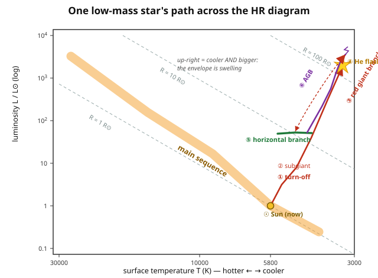

# Astrophysics · Lesson 3.2: Post-main-sequence evolution

> ⏱ ~15 min · Module 3: Stellar evolution and death · Builds on: [2.5 The main sequence](#/lesson/astrophysics/02-05-main-sequence.md), [1.4 Gravitational dynamics and the virial theorem](#/lesson/astrophysics/01-04-gravitational-dynamics-virial.md), [3.1 Star formation](#/lesson/astrophysics/03-01-star-formation-jeans.md) · Unlocks: 3.3 Nucleosynthesis, 3.4 Stellar death

## Why this matters

A star spends ~90% of its life on the main sequence doing one boring thing: fusing hydrogen to helium in its core. This lesson is about the other 10% — the loud, geometric, structurally violent phase that begins the moment the core runs out of fuel. It's where the Sun becomes a red giant that may swallow the inner planets, where the elements heavier than helium first get cooked (setting up [3.3](#/lesson/astrophysics/03-03-nucleosynthesis-elements.md)), and where a star's *mass* decides whether it will die quietly as a white dwarf or catastrophically as a supernova ([3.4](#/lesson/astrophysics/03-04-stellar-death-supernovae.md)). The single most counterintuitive fact in stellar physics lives here: **when a star's core runs out of fuel, the core shrinks and heats up while the outer envelope balloons and cools.** Get that paradox and the whole red-giant story falls into place.

## The idea

Hydrogen fusion in the core is not just an energy source — it's a *thermostat*. On the main sequence, if the core gets a little too hot, the gas expands, cools, and the reaction slows; a little too cool, it contracts, heats, and the reaction speeds up. Fusion holds the core at exactly the temperature where energy generation balances energy leaking out. The whole star is stable because an **ideal gas responds to heating by expanding and cooling** (the virial thermostat from [1.4](#/lesson/astrophysics/01-04-gravitational-dynamics-virial.md)).

Now burn all the core hydrogen to helium. The furnace goes out. The helium core, too cool to fuse (helium needs ~$10^8$ K, ten times hotter than hydrogen), just sits there — inert, still leaking heat from its surface, but generating none. With no pressure support being replenished, **gravity wins and the core contracts.**

Here's the twist. A self-gravitating gas has *negative heat capacity*: losing energy makes it hotter, not colder. As the inert core contracts, it releases gravitational energy, and half of that goes into heating the gas (the virial theorem again — we'll pin the sign below). So the core gets **smaller and hotter** as it radiates. Two things follow. First, the layer of hydrogen *just outside* the shrinking core gets dragged inward and heated until it crosses the fusion threshold: a **hydrogen-burning shell** ignites around the dead core. Second — the paradox — the shell dumps so much energy into the overlying material that the **envelope expands enormously and cools**, and the star swells into a red giant. Core in, envelope out.

## The formal version

**Negative heat capacity (why the core heats as it shrinks).** For a star of ideal gas in virial equilibrium, $2K + U = 0$, where $K$ is total thermal (kinetic) energy and $U<0$ is gravitational potential energy. The total energy is

$$E = K + U = -K = \tfrac{1}{2}U < 0.$$

*In words:* the star is bound, and its total energy is *minus* its thermal energy. So if the star loses energy to space ($E$ drops, becomes more negative), then $K = -E$ must **rise** — the gas heats up. Radiating makes it hotter. That is negative heat capacity, and it is the engine of all post-main-sequence evolution: an inert core that leaks heat has no choice but to contract and heat until *something* reignites. (Full derivation in [1.4](#/lesson/astrophysics/01-04-gravitational-dynamics-virial.md).)

**The mirror principle (why the envelope does the opposite).** Once a burning *shell* separates the core from the envelope, the two regions behave like a see-saw pivoted at the shell:

$$\text{core contracts} \;\Longleftrightarrow\; \text{envelope expands.}$$

*In words:* the shell acts as a mirror — whatever the interior does, the exterior does the reverse. It's not an exact theorem, but it's a robust structural tendency (the shell's fixed mass and steep pressure gradient force the layers outside it outward when the layers inside move in). This is why the red-giant envelope inflates to hundreds of $R_\odot$ while the core is collapsing to the size of the Earth.

**Where the star goes on the HR diagram.** Recall from [1.2](#/lesson/astrophysics/01-02-blackbody-spectra-hr-diagram.md) that luminosity, radius, and surface temperature are locked together by the star being a blackbody of radius $R$:

$$L = 4\pi R^2 \sigma T^4,$$

with $\sigma = 5.67\times 10^{-8}\ \mathrm{W\,m^{-2}\,K^{-4}}$ the Stefan–Boltzmann constant. *In words:* a star's luminosity is its surface area times how hard each patch radiates. As the envelope swells ($R\uparrow$) and cools ($T\downarrow$), the two effects fight in $L$ — but $R$ grows fast enough that $L$ climbs while $T$ falls. On the HR diagram (hot on the left, luminous at the top) the star marches **up and to the right**: the red giant branch (RGB).

## Picture

The dashed diagonals are lines of **constant radius** ($L\propto R^2T^4$, so fixed $R$ means $L\propto T^4$). Watch the track climb across them: from $R\approx 1\,R_\odot$ on the main sequence up past $R\approx 100\,R_\odot$ at the tip of the red giant branch. Moving up-and-right *is* the envelope swelling. The star retraces a compressed version of this after the helium flash (horizontal branch) and again, bigger, on the AGB.

## Worked examples

**Example 1 (the red giant branch, low-mass stars: contract, ignite a shell, swell).**

Take a Sun-like star that has just exhausted core hydrogen. Sequence of events:

1. **Inert He core contracts and heats** (negative heat capacity). For a star below $\sim 2\,M_\odot$, the core is not yet hot enough to fuse helium *before* it becomes dense enough for electron degeneracy to set in.
2. **H-burning shell ignites** around the core and supplies the star's luminosity. The shell is thin, dense, and hot — and its energy output actually *rises* as the core underneath keeps contracting.
3. **Envelope expands and cools** (mirror principle): $R$ grows from $\sim R_\odot$ toward $\sim 100\,R_\odot$, $T_{\rm surface}$ drops to $\sim 3000$–$3500$ K (hence *red*), and $L$ climbs by a factor of hundreds. The star ascends the RGB.
4. **Degenerate helium core.** In these low-mass stars the He core is supported not by heat but by **electron degeneracy pressure** — the Pauli-exclusion push that exists even at $T=0$ (see `stat-mech` [4.4 Ideal Fermi gas](#/lesson/stat-mech/04-04-ideal-fermi-gas.md), rooted in the antisymmetry of identical fermions, `quantum-mechanics` [5.1 Identical particles](#/lesson/quantum-mechanics/05-01-identical-particles.md)). This sets up the fireworks in Example 2.

**Example 2 (the helium flash: why a degenerate core ignites explosively).**

Helium fuses via the triple-alpha reaction ($3\,{}^4\mathrm{He}\to{}^{12}\mathrm{C}$), whose rate is ferociously temperature-sensitive near $10^8$ K — roughly $\varepsilon \propto T^{40}$. Now compare two ways a core can reach that ignition temperature.

*Normal (ideal-gas) core.* Ignition releases heat → $T\uparrow$ → **pressure rises** ($P\propto \rho T$) → core **expands and cools** → rate drops back. The virial thermostat catches the runaway before it starts. Fusion turns on gently.

*Degenerate core.* Degeneracy pressure is set by density alone — it is **independent of temperature** ($P \propto \rho^{5/3}$, no $T$; see `stat-mech` [4.4](#/lesson/stat-mech/04-04-ideal-fermi-gas.md)). So when helium ignites, $T\uparrow$ but the pressure does **not** respond, the core does **not** expand, and it does **not** cool. The extra heat just raises $T$ further, which — via $\varepsilon\propto T^{40}$ — multiplies the reaction rate, which raises $T$ more… a **thermonuclear runaway**: the **helium flash**. For a few seconds the core's helium burns at a luminosity comparable to an entire galaxy ($\sim 10^{11}\,L_\odot$), though almost none of it escapes — the energy goes into heating the core.

The runaway ends only when the core gets so hot ($k_B T$ comparable to the Fermi energy) that ordinary thermal pressure finally exceeds the degeneracy pressure — **degeneracy lifts** — and the now-ideal-gas core can at last expand, cool, and settle into stable helium burning. The thermostat is restored. (In stars above $\sim 2\,M_\odot$ the core ignites helium *before* going degenerate, so they skip the flash entirely and light helium quietly.)

**After the flash — the rest of the road (low-mass stars):**

- **Horizontal branch (HB):** stable, quiescent helium burning in a now-expanded, non-degenerate core, fusing He → C, O. The core-He furnace is a fresh thermostat; the star shrinks and heats a little, landing on a roughly horizontal band on the HR diagram (nearly constant $L$, hence the name).
- **Asymptotic giant branch (AGB):** when core helium runs out, history repeats one level up. Now an inert C/O core contracts and heats, and the star burns in **two shells** — an inner helium-burning shell and an outer hydrogen-burning shell around it. The onion is: C/O core, He-burning shell, He layer, H-burning shell, huge convective envelope. These shells burn unstably, producing **thermal pulses** (periodic flashes of the He shell), and the star climbs back up toward high luminosity — even brighter and cooler than the RGB.
- **Strong mass loss.** The AGB envelope is so loosely bound (enormous radius → weak surface gravity) that radiation pressure on dust drives powerful **stellar winds**, stripping off the envelope at up to $\sim 10^{-4}\,M_\odot$/yr. A low-mass star sheds much of its mass this way, exposing the hot C/O core — the future white dwarf — and lighting up the ejected shell as a planetary nebula ([3.4](#/lesson/astrophysics/03-04-stellar-death-supernovae.md)).

**The great divergence by mass.** Everything above is the low-mass ($\lesssim 8\,M_\odot$) story, and **degeneracy is what caps it**: the C/O core becomes electron-degenerate and never gets hot enough to fuse carbon, so fusion stops at C/O and the star ends as a cooling white dwarf. A **massive** star ($\gtrsim 8\,M_\odot$) is heavy enough that its core stays non-degenerate and keeps contracting and heating through carbon, neon, oxygen, silicon burning — building an onion of ever-heavier shells all the way to an **iron core**, which cannot yield energy by fusing. That core collapses, and the star dies as a core-collapse supernova ([3.4](#/lesson/astrophysics/03-04-stellar-death-supernovae.md)). Same opening move (inert core contracts and heats); whether degeneracy intervenes decides the ending.

## Watch out

- **You might think the whole star contracts when fusion stops — it doesn't.** Only the *core* contracts. The envelope does the *opposite* (mirror principle), which is exactly why the star becomes a giant. Core and envelope are decoupled by the burning shell.
- **You might think a red giant is more luminous because it's hotter — it's cooler.** Its surface is only ~3000–3500 K (redder than the Sun's 5800 K). It's luminous purely because it's *enormous*: $L=4\pi R^2\sigma T^4$ with a huge $R$ beats the drop in $T^4$.
- **You might think the helium flash blows the star apart — it doesn't.** The runaway is buried in the core and is spent lifting the degeneracy, not the envelope; from the outside the star barely flinches. "Flash" refers to the internal energy-generation spike, not an explosion.
- **You might conflate "degenerate" with "dense but normal."** The special thing about a degenerate gas is that its pressure ignores temperature. That single property — no expand-and-cool response — is the entire reason the ignition runs away.

## One-liner

> When a star's core runs dry it contracts *and heats* (self-gravity has negative heat capacity), a shell ignites and swells the envelope into a red giant, and if the core is degenerate its temperature-blind pressure removes the safety valve — so helium lights in a flash.

## Problems

**P1 (🟢)** A red giant on the RGB has luminosity $L = 100\,L_\odot$ and surface temperature $T = 3500$ K. Using $L = 4\pi R^2\sigma T^4$ (and $T_\odot = 5800$ K), find its radius in units of $R_\odot$ — no need to plug in $\sigma$ if you work with ratios. Confirm it's "tens of $R_\odot$," and say in one line which effect (bigger vs. cooler) wins in setting $L$.

**P2 (🟡)** Explain the helium flash from the equation of state. A degenerate electron gas has $P \propto \rho^{5/3}$ with **no** temperature dependence; an ideal gas has $P \propto \rho T$. Suppose helium ignition suddenly deposits heat in each core. Trace what happens to $T$, $P$, the radius, and the reaction rate in each case, and explain why one core self-regulates while the other runs away. (Use that the triple-alpha rate goes like $\varepsilon\propto T^{40}$.)

**P3 (🔴, optional)** When the Sun reaches the tip of the red giant branch it will have roughly $L\sim 1000\,L_\odot$ and $T\sim 3000$ K. Estimate its radius in $R_\odot$ and in AU, given $1\ \mathrm{AU} = 215\,R_\odot$. Compare to Earth's orbit at $1$ AU and to Mercury (0.39 AU) and Venus (0.72 AU), and comment on Earth's fate — including one reason the answer is genuinely uncertain.

Solutions

**P1** Take the ratio to the Sun to kill the constants. Since $L\propto R^2T^4$,

$$\frac{L}{L_\odot} = \left(\frac{R}{R_\odot}\right)^2\left(\frac{T}{T_\odot}\right)^4 \;\Longrightarrow\; \frac{R}{R_\odot} = \sqrt{\frac{L}{L_\odot}}\left(\frac{T_\odot}{T}\right)^2.$$

Plug in $L/L_\odot = 100$ and $T_\odot/T = 5800/3500 = 1.657$:

$$\frac{R}{R_\odot} = \sqrt{100}\times(1.657)^2 = 10 \times 2.75 = 27.5.$$

So $R \approx 28\,R_\odot$ — tens of solar radii, as claimed. The star is 28× the Sun's size but only 60% of its surface temperature; the size increase (a factor of $\sim 750$ in area, $R^2$) overwhelms the drop in $T^4$ (a factor of $\sim 7.5$), netting $100\times$ the luminosity. **Bigness wins.** (Note: at the Sun's *current* luminosity $L=L_\odot$ with $T=3500$ K you'd only get $R\approx 2.7\,R_\odot$ — a subgiant. Reaching tens of $R_\odot$ requires the shell-burning luminosity boost.)

**P2** Ignition deposits heat, so in both cores $T$ rises initially. The equation of state decides everything after that.

*Ideal-gas core* ($P\propto\rho T$): $T\uparrow \Rightarrow P\uparrow$. The raised pressure exceeds the weight it must support, so the core **expands**. Expansion drops $\rho$ and $T$ (does work against gravity, and by negative heat capacity cooling accompanies the readjustment), so $\varepsilon\propto T^{40}$ **falls**. Net effect: a small overshoot in $T$ is damped out. Stable ignition — a thermostat.

*Degenerate core* ($P\propto\rho^{5/3}$, no $T$): $T\uparrow$ leaves $P$ **unchanged** (pressure is blind to temperature). With no pressure increase the core does **not** expand and does **not** cool. The deposited heat simply raises $T$ further; because $\varepsilon\propto T^{40}$, a modest rise in $T$ multiplies the burning rate enormously, depositing yet more heat, raising $T$ again — a **runaway (the helium flash)**. There is no expansion valve to catch it. It halts only when $T$ climbs so high that thermal pressure overtakes degeneracy pressure — degeneracy lifts, the core becomes an ideal gas again, and *now* it can finally expand, cool, and settle into stable He burning. The missing "expand-and-cool" response is the whole difference.

**P3** Same ratio formula:

$$\frac{R}{R_\odot} = \sqrt{\frac{L}{L_\odot}}\left(\frac{T_\odot}{T}\right)^2 = \sqrt{1000}\times\left(\frac{5800}{3000}\right)^2 = 31.6 \times (1.933)^2 = 31.6\times 3.74 \approx 118.$$

So $R\approx 118\,R_\odot$. Converting: $118/215 \approx 0.55$ AU. That's well beyond Mercury (0.39 AU) — Mercury is engulfed — and close to Venus (0.72 AU). At this RGB-tip estimate the Sun reaches about **half of Earth's orbit**, so Earth escapes *this* phase. But the story isn't over: on the later AGB the Sun becomes far more luminous (thousands of $L_\odot$) and swells further, to $\sim 1$ AU or beyond, putting Earth right at the boundary. Whether Earth is actually swallowed is **genuinely uncertain** because the Sun loses substantial mass as a giant (strong winds), which *weakens its gravity and lets the planets' orbits drift outward* — a race between the swelling Sun and the receding Earth. Detailed models mostly conclude Earth is engulfed or, at best, left a scorched cinder; either way, not a good place to be.

## Flashback

**From Lesson 2.5 (The main sequence):** A star of $9\,M_\odot$ has luminosity $L \approx 4000\,L_\odot$. Using the rough scaling that main-sequence lifetime is $t \propto M/L$ and the Sun's lifetime is $\sim 10^{10}$ yr, estimate this star's main-sequence lifetime. In one sentence, connect the answer to why *this* lesson (post-main-sequence evolution) matters far sooner for massive stars.

Solution

Lifetime scales as fuel over burn rate: $t \propto M/L$. Relative to the Sun,

$$t \approx t_\odot \cdot \frac{M/M_\odot}{L/L_\odot} = 10^{10}\ \mathrm{yr}\times\frac{9}{4000} = 10^{10}\times 2.25\times 10^{-3} \approx 2.3\times 10^{7}\ \mathrm{yr}.$$

About **23 million years** — roughly 400× shorter than the Sun's. Massive stars are prodigal: they hold more fuel but burn it so much faster ($L$ rises far steeper than $M$) that they blow through the main sequence in a geological eyeblink, reaching the post-main-sequence phases — and their supernova deaths ([3.4](#/lesson/astrophysics/03-04-stellar-death-supernovae.md)) — while low-mass stars are still placidly burning hydrogen.

## Connections

- **Backward:** the whole story runs on the **virial theorem's negative heat capacity** from [1.4](#/lesson/astrophysics/01-04-gravitational-dynamics-virial.md) (contract → heat) and on $L=4\pi R^2\sigma T^4$ from [1.2](#/lesson/astrophysics/01-02-blackbody-spectra-hr-diagram.md) (read the giant's size off its light). The shell furnace is just the [2.3](#/lesson/astrophysics/02-03-nuclear-energy-generation.md) energy generation relocated to a thin layer.
- **Forward:** helium and shell burning cook carbon and oxygen — the launch point for [3.3 Nucleosynthesis](#/lesson/astrophysics/03-03-nucleosynthesis-elements.md). The degenerate C/O core exposed by AGB winds *is* the white dwarf of [3.4](#/lesson/astrophysics/03-04-stellar-death-supernovae.md) and [4.1](#/lesson/astrophysics/04-01-white-dwarfs-chandrasekhar.md); the massive-star branch runs to core collapse in [3.4](#/lesson/astrophysics/03-04-stellar-death-supernovae.md).
- **Sideways (stat mech + quantum):** the helium flash is a physics lesson about **temperature-independent degeneracy pressure** — the same equation of state, $P\propto\rho^{5/3}$ with no $T$, that supports white dwarfs, from `stat-mech` [4.4 The ideal Fermi gas](#/lesson/stat-mech/04-04-ideal-fermi-gas.md); it exists because electrons are identical fermions obeying Pauli exclusion, `quantum-mechanics` [5.1 Identical particles](#/lesson/quantum-mechanics/05-01-identical-particles.md). Degeneracy is the hinge on which a star's entire fate turns.
