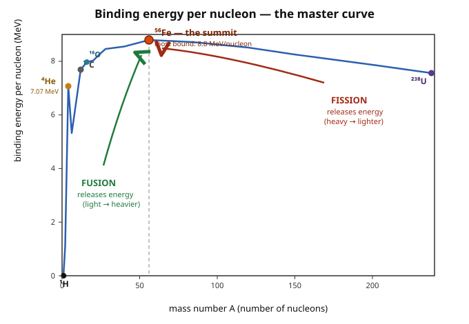

# Astrophysics · Lesson 3.3: Nucleosynthesis and the origin of the elements

> ⏱ ~15 min · Module 3: Stellar evolution and death · Builds on: [3.2 Post-main-sequence evolution](#/lesson/astrophysics/03-02-post-main-sequence.md), [2.3 Nuclear energy generation](#/lesson/astrophysics/02-03-nuclear-energy-generation.md), [1.2 Blackbody spectra & the HR diagram](#/lesson/astrophysics/01-02-blackbody-spectra-hr-diagram.md) · Unlocks: 3.4 Stellar death & supernovae, 4.5 Gravitational waves & mergers

## Why this matters

The Big Bang made hydrogen, helium, and a trace of lithium — and stopped. Every carbon atom in your cells, every oxygen molecule you breathe, the calcium in your bones, the iron in your blood, the gold on a finger: none existed until stars made it. This lesson is where the periodic table comes from. And astonishingly, almost the entire story is read off **one curve** — binding energy per nucleon — which explains in a single stroke why stars shine, why they fuse up to iron and no further, why iron is the seed of catastrophe, and why the heaviest elements demand a different mechanism entirely.

## The idea

A nucleus is a bag of protons and neutrons (nucleons) held together by the strong force. Pulling that bag apart costs energy — the **binding energy**. Divide it by the number of nucleons and you get *how tightly bound each nucleon is, on average*. Plot that against nuclear mass and you get a curve that rises steeply from hydrogen, peaks sharply at **iron-56**, and then declines gently all the way to uranium.

That shape is the whole game. Nature always rolls **downhill in energy**, which here means **uphill on the binding curve** — toward more tightly bound nuclei:

- **Below iron:** *fusing* light nuclei climbs the curve → releases energy. This is why stars shine.
- **Above iron:** *splitting* heavy nuclei (fission) also climbs toward iron → releases energy. This is why uranium powers reactors.
- **At iron:** you're at the summit. Fuse two iron nuclei and you'd go *downhill* — it **costs** energy. There is no fuel beyond iron.

So a massive star burns its way up the curve — H → He → C → O → ... → Fe — building an onion of shells, each stage hotter and briefer than the last, until it hits the iron summit and the furnace dies. Everything past iron has to be built a completely different way: not by fusion, but by dripping **neutrons** onto seed nuclei one at a time.

## The formal version

**Binding energy.** For a nucleus with $Z$ protons and $N$ neutrons (mass number $A=Z+N$),

$$B(Z,N) = \big[\,Z\,m_p + N\,m_n - m(Z,N)\,\big]\,c^2 .$$

*In words:* the assembled nucleus weighs **less** than its loose parts; that missing mass, times $c^2$, is the energy that was released when it formed — and the energy you'd need to take it apart. The quantity that matters is $B/A$, the binding **per nucleon**.

**When does a reaction release energy?** For nuclei fusing or splitting, the energy released is the $Q$-value,

$$Q = \Big(\textstyle\sum m_{\text{initial}} - \sum m_{\text{final}}\Big)c^2 ,$$

and the reaction is **exothermic** ($Q>0$) exactly when the products sit **higher** on the $B/A$ curve than the reactants. *In words:* you only get energy out by moving toward iron. Iron-56 (with nickel-62) sits at the top, $B/A \approx 8.8$ MeV/nucleon — the most tightly bound matter there is.

**The alpha ladder and triple-alpha.** Helium-4 nuclei are alpha particles — unusually tightly bound ($B/A = 7.07$ MeV), so they're the natural building block. But there's a wall: no stable nucleus has mass 5 or 8. You can't add protons one at a time. Stars leap the **mass-8 gap** with the **triple-alpha** reaction,

$$3\,{}^4\mathrm{He} \;\longrightarrow\; {}^{12}\mathrm{C} + \gamma, \qquad Q \approx 7.27\ \text{MeV},$$

which proceeds in two steps: ${}^4\mathrm{He}+{}^4\mathrm{He}\rightleftharpoons {}^8\mathrm{Be}$ (beryllium-8 is unstable, living $\sim 10^{-16}$ s), and then ${}^8\mathrm{Be}+{}^4\mathrm{He}\rightarrow{}^{12}\mathrm{C}$. *In words:* three heliums must effectively collide at once, through a fleeting beryllium way-station. It works only because of a **resonance** — an excited state of carbon-12 (the Hoyle state) sitting right at the reaction energy, which Fred Hoyle predicted *must* exist because carbon-based observers do. From carbon, adding successive alphas builds the **alpha elements**: ${}^{16}\mathrm{O}, {}^{20}\mathrm{Ne}, {}^{24}\mathrm{Mg}, {}^{28}\mathrm{Si}, \ldots, {}^{56}\mathrm{Ni}\to{}^{56}\mathrm{Fe}$.

**Beyond iron: neutron capture.** Fusion past iron is a dead end — the Coulomb barrier between two highly charged heavy nuclei is enormous *and* the reaction is endothermic. The trick is to use a particle with **no charge**: a neutron feels no Coulomb barrier and can be absorbed at any energy.

$$(Z,A)\;\xrightarrow{\ +n\ }\;(Z,A+1)\;\xrightarrow{\ \beta^-\ }\;(Z+1,A+1).$$

*In words:* capture a neutron to make a heavier isotope; if that isotope is unstable it $\beta$-decays, turning a neutron into a proton and stepping **up** the periodic table. Two regimes, set by how the neutron-capture rate compares to the $\beta$-decay rate:

- **s-process** (slow): captures are *rarer* than decays, so an unstable nucleus decays before the next neutron arrives. The path hugs the valley of stability. Site: **AGB stars** (the thermally pulsing giants of [3.2](#/lesson/astrophysics/03-02-post-main-sequence.md)), building up to lead/bismuth over thousands of years. Makes ~half the elements heavier than iron: strontium, barium, lead.
- **r-process** (rapid): a torrential neutron flux ($\gtrsim 10^{22}\,\mathrm{cm^{-3}}$) — captures pile on *faster* than decay, dragging nuclei far out to the neutron-rich edge before they cascade back to stability. Site: **neutron-star mergers** and some **core-collapse supernovae**. Makes the heaviest and most neutron-rich nuclei — gold, platinum, the whole lanthanide row, thorium, uranium.

## Picture

The single most important curve in nuclear astrophysics. Read it left to right: hydrogen at the bottom, the sharp helium-4 spike, the steep climb through carbon and oxygen to the **iron-56 summit** at 8.8 MeV/nucleon, then a long gentle slope down to uranium. Fusion (green) releases energy climbing toward iron from the light side; fission (red) releases energy descending toward iron from the heavy side. Everything meets — and stops — at iron.

## Worked examples

**Example 1 (why hydrogen burning dwarfs everything after).** The jump in $B/A$ *is* the energy yield per nucleon. Read it off the curve:

| Stage | $B/A$ climb | Energy per nucleon |
|---|---|---|
| H → He | $0 \to 7.07$ | $\approx 7.1$ MeV |
| He → C | $7.07 \to 7.68$ | $\approx 0.6$ MeV |
| C → O | $7.68 \to 7.98$ | $\approx 0.3$ MeV |
| O → Si | $7.98 \to 8.45$ | $\approx 0.5$ MeV |
| Si → Fe | $8.45 \to 8.79$ | $\approx 0.3$ MeV |

Hydrogen fusion releases *ten times more energy per nucleon than any later stage*, because it climbs the steepest part of the curve. That single fact is why a star spends ~90% of its life on the main sequence and rips through everything after in a geological blink.

**Example 2 (the onion, and why the clock speeds up).** In a $\sim 25\,M_\odot$ star, each burning stage ignites in the ash of the last, building concentric shells — H outside, then He, C, O, Ne, Si, and an inert Fe core (see [3.4](#/lesson/astrophysics/03-04-stellar-death-supernovae.md) for what happens next):

| Shell | Burns | $T$ (K) | Duration |
|---|---|---|---|
| H | H → He | $3\times10^{7}$ | ~7 Myr |
| He | He → C, O | $2\times10^{8}$ | ~0.7 Myr |
| C | C → Ne, Mg | $8\times10^{8}$ | ~600 yr |
| Ne | Ne → O, Mg | $1.5\times10^{9}$ | ~1 yr |
| O | O → Si, S | $2\times10^{9}$ | ~6 months |
| Si | Si → Fe | $3\times10^{9}$ | ~1 day |

Two effects compound: heavier nuclei have larger charge, so overcoming their Coulomb repulsion (the Gamow physics of [2.3](#/lesson/astrophysics/02-03-nuclear-energy-generation.md)) needs ever-higher $T$; and the curve flattens toward iron, so each stage yields less energy. Worse, at these temperatures the core hemorrhages energy as **neutrinos** (thermal pair production) that stream straight out — so the fuel must burn furiously fast just to hold the star up. Silicon burning to iron takes about a *day*.

## Watch out

- You might think "iron is the end because it's too heavy to fuse." It's not weight — it's the **peak of the $B/A$ curve**. Fusing iron is forbidden because the products would be *less* bound (downhill), so it absorbs energy instead of releasing it. Fission of uranium, a much heavier nucleus, releases energy for exactly the mirror reason.
- You might think supernovae forge the bulk of the heavy elements in one blast. Most **s-process** elements are made slowly and quietly in AGB stars over thousands of years; the explosive **r-process** makes the neutron-rich extremes. And the abundant elements of life — C, N, O — are made by ordinary fusion, not explosions.
- You might think adding alphas can march smoothly from He to C. The **mass-5 and mass-8 gaps** (no stable nucleus there) block the simple path — carbon exists only thanks to the resonant triple-alpha detour. Without the Hoyle resonance, there'd be almost no carbon, and no us.

## One-liner

> One curve rules the elements: fusion climbs it and fission descends it, both stopping dead at the iron summit — and everything heavier is dripped on afterward, neutron by neutron.

## Problems

**P1 (🟢)** Using only the binding-energy-per-nucleon curve, explain (a) why fusing hydrogen into helium releases far more energy *per nucleon* than any later fusion stage, and (b) why fusion releases no energy once the core has built up iron.

**P2 (🟡)** Estimate the energy released by the triple-alpha reaction $3\,{}^4\mathrm{He}\to{}^{12}\mathrm{C}$ from the mass defect. Use $m({}^4\mathrm{He})=4.002602\ \mathrm{u}$, $m({}^{12}\mathrm{C})=12.000000\ \mathrm{u}$ (exact, by definition), and $1\ \mathrm{u} = 931.5\ \mathrm{MeV}/c^2$. How does the yield *per nucleon* compare to hydrogen burning (~7 MeV/nucleon)?

**P3 (🔴, optional)** Explain why elements heavier than iron — gold, uranium — cannot be manufactured by fusion in a normal stellar core. Give *two* independent reasons rooted in this lesson, then name the two neutron-capture environments that actually make them and state the physical difference between them.

Solutions

**P1** (a) The energy released per nucleon in a fusion step equals the *rise* in $B/A$ across it. Hydrogen starts at the very bottom of the curve ($B/A = 0$ for a lone proton) and helium-4 sits at $7.07$ MeV/nucleon — that first step scales the single **steepest** part of the entire curve, a climb of ~7 MeV/nucleon. Every later stage happens on the increasingly **flat** upper portion (He→C→O→...→Fe), where each step gains only a few tenths of an MeV/nucleon. So H→He outyields any subsequent stage by roughly an order of magnitude. (b) Iron-56 sits at the **maximum** of $B/A$. Any fusion starting from iron would produce a nucleus that is *less* tightly bound — lower on the curve — so $Q<0$: the reaction absorbs energy rather than releasing it. With no energy return, iron fusion cannot sustain the star; the furnace stops, and the iron core is left to collapse (→ [3.4](#/lesson/astrophysics/03-04-stellar-death-supernovae.md)).

**P2** Mass defect:

$$\Delta m = 3\,m({}^4\mathrm{He}) - m({}^{12}\mathrm{C}) = 3(4.002602) - 12.000000 = 12.007806 - 12 = 0.007806\ \mathrm{u}.$$

Energy released:

$$Q = \Delta m\, c^2 = 0.007806 \times 931.5\ \mathrm{MeV} \approx 7.27\ \mathrm{MeV}.$$

Per nucleon: $7.27/12 \approx 0.61$ MeV/nucleon. That is more than **ten times smaller** than hydrogen burning's ~7 MeV/nucleon — consistent with helium burning living on the flat upper stretch of the curve while hydrogen burning scales the steep bottom. (This is also why helium burning, though hotter, is a much shorter chapter than the main sequence.)

**P3** *Two reasons fusion can't build past iron:*
1. **Energetics.** Iron is the peak of $B/A$. Fusing iron (or anything heavier) yields *less*-bound products, so $Q<0$ — it consumes energy. A core that has reached iron has no energy source left to drive further fusion; it is contracting and, if anything, cooling relative to its needs.
2. **Coulomb barrier.** Fusion rate is throttled by tunneling through the Coulomb barrier, whose height $\propto Z_1 Z_2$. For two heavy, highly charged nuclei (iron has $Z=26$, gold $Z=79$) the barrier is astronomically higher than for protons, requiring temperatures a normal core never reaches — even setting the energetics aside.

*The way around both is a neutral particle.* A **neutron** feels no Coulomb barrier, so it can be absorbed at any temperature, and successive captures + $\beta^-$ decays walk nuclei up the periodic table. Two environments:
- **s-process (slow), in AGB stars:** modest neutron flux; captures are slower than $\beta$-decay, so the path stays near the valley of stability, building elements up to lead/bismuth over ~$10^3$–$10^4$ yr.
- **r-process (rapid), in neutron-star mergers and core-collapse supernovae:** enormous neutron flux; captures outrun $\beta$-decay, driving nuclei to the neutron-rich extreme and then back, producing the heaviest and most neutron-rich elements — gold, uranium, the lanthanides. The r-process site was confirmed by the kilonova of the 2017 neutron-star merger GW170817 (→ [4.5](#/lesson/astrophysics/04-05-gravitational-waves-mergers.md)).

## Flashback

**From Lesson 2.3 (Nuclear energy generation):** The Coulomb barrier two nuclei must tunnel through scales as $Z_1 Z_2 / (A_1^{1/3}+A_2^{1/3})$ (charge product over the sum of nuclear radii, since $r_{\text{nuc}}\propto A^{1/3}$). Estimate how much higher the barrier is for carbon–carbon fusion ($Z=6, A=12$) than for proton–proton fusion ($Z=1, A=1$), and use it to explain why carbon burning needs a far higher temperature than hydrogen burning.

Solution

Form the ratio of $Z_1 Z_2 / (A_1^{1/3}+A_2^{1/3})$ for the two reactions.

- p–p: $\dfrac{1\cdot 1}{1^{1/3}+1^{1/3}} = \dfrac{1}{2} = 0.5.$
- C–C: $\dfrac{6\cdot 6}{12^{1/3}+12^{1/3}} = \dfrac{36}{2(2.289)} = \dfrac{36}{4.58} \approx 7.9.$

Ratio $\approx 7.9/0.5 \approx 16$. The carbon–carbon Coulomb barrier is roughly **16 times higher** than proton–proton. Since the fusion rate depends exponentially (via Gamow tunneling) on the barrier relative to the thermal energy $k_B T$, clearing a barrier ~16× taller demands a dramatically higher temperature — which is exactly why hydrogen ignites near $10^7$ K but carbon needs $\sim 8\times10^8$ K. This is the quantitative engine behind the "each shell hotter" onion structure.

## Connections

- **Backward:** this is the payoff of [2.3](#/lesson/astrophysics/02-03-nuclear-energy-generation.md)'s fusion physics — the same Gamow/Coulomb-barrier reasoning that lit the main sequence now dictates the *order* and *temperature* of every burning stage. The alpha elements are built in the shell-burning giants of [3.2](#/lesson/astrophysics/03-02-post-main-sequence.md); AGB stars are the s-process factories.
- **Forward:** the inert iron core is the trigger of [3.4](#/lesson/astrophysics/03-04-stellar-death-supernovae.md) — with no fusion to hold it up, it collapses, and the explosion both disperses the newly made elements and (in some cases) drives the r-process. [3.5](#/lesson/astrophysics/03-05-imf-stellar-populations.md) turns this into galactic chemical enrichment across stellar generations. The r-process site links directly to [4.5](#/lesson/astrophysics/04-05-gravitational-waves-mergers.md)'s neutron-star mergers.
- **Sideways (stat-mech / quantum):** the mass-defect energetics are $E=mc^2$ bookkeeping, while whether fusion actually *happens* is the tunneling-through-a-barrier problem of [`quantum-mechanics` 2.5](#/lesson/quantum-mechanics/02-05-scattering-barriers-tunneling.md). The runaway neutrino cooling of the final stages is thermal pair production from the same statistical physics that governs the [`stat-mech` photon gas](#/lesson/stat-mech/04-03-photon-gas-blackbody.md).
