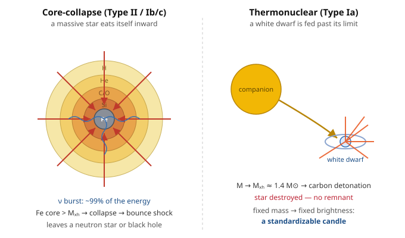

# Astrophysics · Lesson 3.4: Stellar death — white dwarfs and supernovae

> ⏱ ~15 min · Module 3: Stellar evolution and death · Builds on: [3.2 Post-main-sequence evolution](#/lesson/astrophysics/03-02-post-main-sequence.md), [3.3 Nucleosynthesis and the elements](#/lesson/astrophysics/03-03-nucleosynthesis-elements.md) · Unlocks: white-dwarf structure (4.1), neutron stars & black holes (4.2–4.3), Type Ia as cosmological rulers (6.5)

## Why this matters

A star spends its whole life as a truce between gravity pulling in and pressure pushing out. Death is what happens when the fuel that sourced the pressure runs out — and the *mass* of the star decides which of two utterly different endings it gets. Below about $8\,M_\odot$ a star exhales quietly and leaves a cooling ember. Above it, the star detonates in a **supernova** so bright it briefly outshines its entire host galaxy, forges and scatters the heavy elements you're made of, and leaves behind a neutron star or a black hole. And one flavor of supernova explodes at such a reliably fixed brightness that we use it as a yardstick to measure the universe — the measurement that discovered dark energy. ($M_\odot = 1.99\times10^{30}$ kg is one solar mass.)

## The idea

Everything follows from one fact you already have from [3.3](#/lesson/astrophysics/03-03-nucleosynthesis-elements.md): **fusion releases energy only up to iron.** Iron sits at the peak of the binding-energy-per-nucleon curve, so fusing iron *costs* energy rather than releasing it. Iron is the ash the fire cannot burn.

So a star's fate is a question of whether it can ever build an iron core:

- **Low mass ($\lesssim 8\,M_\odot$, including the Sun).** The core never gets hot enough to fuse past carbon and oxygen. On the [asymptotic giant branch (3.2)](#/lesson/astrophysics/03-02-post-main-sequence.md) the bloated envelope is only weakly bound, and gentle pulsations and radiation pressure blow it off entirely — a glowing shell called a **planetary nebula** (nothing to do with planets; a 19th-century misnomer). What's left is the naked, degenerate carbon–oxygen core: a **white dwarf**, held up not by heat but by electron *degeneracy pressure* — the quantum refusal of electrons to share a state. It has no fuel; it just cools forever. (Its detailed structure and mass limit are [Lesson 4.1](#/lesson/astrophysics/04-01-white-dwarfs-chandrasekhar.md).)

- **High mass ($\gtrsim 8\,M_\odot$).** These stars *do* climb the ladder, fusing carbon, neon, oxygen, silicon in nested shells (the "onion" of [3.3](#/lesson/astrophysics/03-03-nucleosynthesis-elements.md)) until an **iron core** grows at the center. Now the furnace is dead: iron can't fuse to hold the core up. The core is supported only by electron degeneracy — and once it grows past the **Chandrasekhar mass**, $M_{\rm Ch}\approx 1.4\,M_\odot$, even degeneracy pressure fails. The core **collapses** in about a second, and the star dies as a **core-collapse supernova**.

There's also a sneaky third route: a white dwarf that *isn't* left alone. Feed it mass from a companion star until it too reaches $M_{\rm Ch}$, and it explodes — a **Type Ia supernova** — by a completely different mechanism (runaway fusion, not collapse). That distinction is the heart of this lesson.

## The formal version

**Core-collapse (Type II / Ib/c).** When the iron core exceeds $M_{\rm Ch}$, electron degeneracy can no longer support it and it collapses from a radius of order $10^4$ km to $\sim 10$ km — nuclear density — in seconds. Two things quench the collapse: nuclei touch and the strong force turns repulsive, and the newborn neutron core is incompressible. The infalling outer core hits this wall and rebounds — the **core bounce** — launching a shock wave outward.

The energy budget is staggering. The gravitational binding energy released is

$$\Delta U \sim \frac{GM^2}{R} \sim 3\times10^{46}\ \text{J},$$

where $G=6.67\times10^{-11}\ \mathrm{N\,m^2/kg^2}$, $M\approx 1.4\,M_\odot$, $R\approx 10$ km. **In words: collapsing to a neutron star releases more energy than the Sun will emit in its entire 10-billion-year life — in one second.** But almost none of it comes out as light. At these densities the core is opaque even to neutrinos, yet **$\sim 99\%$ of that energy escapes as a burst of neutrinos** ($\sim 3\times10^{46}$ J), a fact confirmed when 24 neutrinos from SN 1987A were caught hours before the light arrived. Only $\sim 10^{44}$ J ($\sim 10^{51}$ erg, one "foe") goes into the kinetic energy of the ejecta, and a mere $\sim 10^{42}$–$10^{43}$ J into visible light. The remnant is a **neutron star** (if $M \lesssim 2$–$3\,M_\odot$) or a **black hole** (forward to [4.2](#/lesson/astrophysics/04-02-neutron-stars-pulsars.md)–[4.3](#/lesson/astrophysics/04-03-black-holes-astrophysics.md)).

**Thermonuclear (Type Ia).** A carbon–oxygen white dwarf in a binary accretes matter from its companion. As its mass creeps toward $M_{\rm Ch}$, the central density and temperature rise until carbon ignites. But a white dwarf is *degenerate*: its pressure barely depends on temperature (that's [stat-mech's Fermi gas](#/lesson/stat-mech/04-04-ideal-fermi-gas.md)). So the ignition doesn't expand and cool the star the way a normal flame would — the temperature just runs away, fusion accelerates, and in a couple of seconds a **thermonuclear detonation** burns much of the star to iron-group elements and **unbinds it completely**. No remnant survives. The energy released, roughly $1$ MeV per nucleon over $\sim 1.4\,M_\odot$, is

$$E \sim (1\ \text{MeV})\times\frac{1.4\,M_\odot}{m_p} \sim 3\times10^{44}\ \text{J},$$

comfortably more than the white dwarf's gravitational binding ($\sim 5\times10^{43}$ J), so the star is blown apart. **In words: a Type Ia burns a whole degenerate star at once, because degenerate matter can't cool itself by expanding.**

**Why Type Ia are standard candles.** Every Type Ia detonates a white dwarf at *the same* mass, $M_{\rm Ch}\approx 1.4\,M_\odot$ — so it burns nearly the same amount of fuel and releases nearly the same energy each time. Peak brightness is powered by the radioactive decay chain $^{56}\text{Ni}\to{}^{56}\text{Co}\to{}^{56}\text{Fe}$, and the mass of $^{56}$Ni synthesized is nearly fixed. The result: a nearly **standard peak luminosity** ($M_B\approx-19.3$, i.e. $\sim 4\times10^9\,L_\odot$). Measure a Type Ia's apparent brightness, compare to the known intrinsic brightness, and the inverse-square law hands you the distance — out to billions of light-years. This is the top rung of the distance ladder from [1.1](#/lesson/astrophysics/01-01-scales-luminosity-distance-ladder.md), and the tool that revealed the accelerating universe ([6.5](#/lesson/astrophysics/06-05-dark-energy-acceleration.md)). Core-collapse supernovae, by contrast, come from progenitors of *many* different masses and envelopes, so their luminosities scatter widely — poor candles.

**The classification (spectra came first, physics second).** The historical labels are observational and don't line up cleanly with the physics:

| Type | Observation | Mechanism |
|------|-------------|-----------|
| I  | **no** hydrogen lines | (split below) |
| &nbsp;&nbsp;Ia | no H, has Si | **thermonuclear** (white dwarf) |
| &nbsp;&nbsp;Ib/c | no H (lost envelope) | **core-collapse** |
| II | **has** hydrogen lines | **core-collapse** |

**In words: the deep divide is thermonuclear (Ia only) vs. core-collapse (Ib, Ic, II) — the presence of hydrogen just tells you whether the massive star kept its outer envelope.**

**Feedback and enrichment.** Supernovae are how the elements heavier than iron ([r-process, 3.3](#/lesson/astrophysics/03-03-nucleosynthesis-elements.md)) and the iron-group itself get *out* of stars and into the gas that forms the next generation. The $\sim 10^{44}$ J of kinetic energy also stirs and heats the interstellar medium, driving turbulence and triggering (or halting) further star formation — the "stellar feedback" of [3.5](#/lesson/astrophysics/03-05-imf-stellar-populations.md) and [5.1](#/lesson/astrophysics/05-01-interstellar-medium.md).

## Picture

## Worked examples

**Example 1 (mechanical — the neutrino sink).** How much gravitational energy is freed when a $1.4\,M_\odot$ core collapses to a $10$-km neutron star, and how does that compare to the light we see?

The final state's binding dominates (it's far more compact than the start), so

$$\Delta U \sim \frac{GM^2}{R} = \frac{(6.67\times10^{-11})(1.4\times1.99\times10^{30})^2}{10^4\ \text{m}}.$$

Compute the mass: $M = 2.79\times10^{30}$ kg, so $M^2 = 7.8\times10^{60}\ \mathrm{kg^2}$. Then

$$\Delta U \sim \frac{(6.67\times10^{-11})(7.8\times10^{60})}{10^4} \approx 5\times10^{46}\ \text{J}.$$

The visible light of the explosion totals only $\sim 10^{43}$ J. The ratio is $\sim 10^{46}/10^{43} \sim 10^3$ — the light is a **thousandth of a percent** of the energy budget. The overwhelming remainder streams out as neutrinos. **A core-collapse supernova is, energetically, a neutrino event that happens to also make a little light.**

**Example 2 (why you'd care — a candle at cosmic distance).** A Type Ia peaks at absolute magnitude $M\approx-19.3$; the Sun's is $M_\odot\approx +4.8$. In luminosity that's

$$\frac{L}{L_\odot} = 10^{(M_\odot - M)/2.5} = 10^{(4.8+19.3)/2.5} = 10^{9.6} \approx 4\times10^9.$$

Four billion Suns. Because *every* Type Ia hits this same peak (they all detonate at $1.4\,M_\odot$), a Type Ia observed at apparent magnitude $m$ sits at a distance fixed by the distance modulus $m-M = 5\log_{10}(d/10\,\text{pc})$ — no other information needed. That is exactly why these explosions, and not the messier core-collapse ones, became the ruler that measured the expansion history of the universe.

## Watch out

- You might think a "planetary nebula" involves planets, or that a supernova is just a really big planetary nebula. Neither: the name is a historical accident (they looked like planets in small telescopes), and the two are physically unrelated — one is a gently shed envelope, the other a violent explosion or detonation.
- You might think Type I vs. Type II is thermonuclear vs. core-collapse. It isn't — the I/II split is only *"has hydrogen lines or not."* Types Ib and Ic are core-collapse explosions of massive stars that *lost* their hydrogen envelopes. The real physical divide is **Ia (thermonuclear) vs. everything else (core-collapse).**
- You might think the light we see carries the supernova's energy. For core-collapse it carries $\lesssim 0.01\%$; $\sim 99\%$ leaves invisibly as neutrinos. The dazzling display is the tiny leftover.
- You might think white dwarfs quietly cool forever no matter what. A *solitary* one does. But a white dwarf fed by a binary companion up to $M_{\rm Ch}$ is a Type Ia waiting to happen — the same object, a completely different fate.

## One-liner

> Iron can't burn: light stars shed a nebula and leave a white-dwarf ember, heavy stars collapse into a neutron star or black hole in a neutrino flood, and a white dwarf fed to $1.4\,M_\odot$ detonates as a standard candle that measures the cosmos.

## Problems

**P1 (🟢)** Estimate the gravitational energy released when a $1.4\,M_\odot$ stellar core collapses from an initial radius $R_i \approx 10^4$ km (an Earth-sized iron core) to a final radius $R_f \approx 10$ km (a neutron star), using $\Delta U \sim GM^2(1/R_f - 1/R_i)$. Compare your answer to the $\sim 10^{44}$ J that emerges as light and kinetic energy of the ejecta, and state what fraction of the total the neutrinos must carry.

**P2 (🟡)** In two or three sentences, explain *why* Type Ia supernovae make good standard candles while core-collapse supernovae do not. Your answer should turn on what is the same from one Type Ia to the next, and what varies from one core-collapse event to the next.

**P3 (🔴, optional)** Estimate a supernova's peak luminosity directly from a blackbody photosphere: about 20 days after explosion the ejecta have expanded to radius $R\sim 10^4\ \mathrm{km/s}\times 20\ \text{days}$, radiating as a blackbody at $T\approx 10^4$ K. Use $L = 4\pi R^2 \sigma T^4$ with $\sigma = 5.67\times10^{-8}\ \mathrm{W\,m^{-2}\,K^{-4}}$. Convert to $L_\odot$ ($L_\odot = 3.83\times10^{26}$ W) and compare to a whole galaxy like the Milky Way ($L \sim 2\times10^{10}\,L_\odot$). Why are supernovae visible across the observable universe?

Solutions

**P1** With $M = 1.4\times1.99\times10^{30} = 2.79\times10^{30}$ kg, $M^2 = 7.8\times10^{60}\ \mathrm{kg^2}$, and $GM^2 = (6.67\times10^{-11})(7.8\times10^{60}) = 5.2\times10^{50}\ \mathrm{J\,m}$.

The two radii, in metres: $R_f = 10^4$ m, $R_i = 10^7$ m, so

$$\frac{1}{R_f}-\frac{1}{R_i} = 10^{-4} - 10^{-7} \approx 10^{-4}\ \mathrm{m^{-1}}$$

(the initial term is a thousand times smaller — the final compactness dominates, which is the whole point). Thus

$$\Delta U \sim (5.2\times10^{50})(10^{-4}) \approx 5\times10^{46}\ \text{J}.$$

The observed light + kinetic energy is $\sim10^{44}$ J, so the neutrinos carry $\Delta U - 10^{44} \approx 5\times10^{46}$ J — a fraction

$$\frac{5\times10^{46}-10^{44}}{5\times10^{46}} \approx 0.998,$$

i.e. **about 99.8%**. Almost the entire energy of the most violent explosion since the Big Bang leaves as neutrinos we cannot see.

**P2** *Type Ia:* every one detonates a white dwarf at the **same** mass, the Chandrasekhar mass $\approx 1.4\,M_\odot$. Same fuel mass burned $\Rightarrow$ same energy $\Rightarrow$ same nickel-56 mass $\Rightarrow$ nearly the **same peak luminosity** every time. Knowing the intrinsic brightness, apparent brightness gives distance. *Core-collapse:* the exploding stars span a wide range of progenitor masses, radii, and envelope masses (from $\sim 8\,M_\odot$ to tens of $M_\odot$, with or without a hydrogen envelope), so their luminosities scatter over orders of magnitude — there is no single "standard" brightness to calibrate against.

**P3** Radius: $R = (10^4\ \mathrm{km/s})(20\ \text{days}) = (10^7\ \mathrm{m/s})(20\times86400\ \text{s}) = (10^7)(1.73\times10^6) = 1.7\times10^{13}$ m.

Then $R^2 = 2.9\times10^{26}\ \mathrm{m^2}$ and $\sigma T^4 = (5.67\times10^{-8})(10^4)^4 = (5.67\times10^{-8})(10^{16}) = 5.67\times10^{8}\ \mathrm{W/m^2}$. So

$$L = 4\pi R^2 \sigma T^4 = 4\pi(2.9\times10^{26})(5.67\times10^8) \approx 2\times10^{36}\ \text{W}.$$

In solar units, $L/L_\odot = 2\times10^{36}/3.83\times10^{26} \approx 5\times10^{9}\,L_\odot$ — a few billion Suns, matching the $\sim 4\times10^9\,L_\odot$ from the observed absolute magnitude. Compared to the Milky Way's $\sim 2\times10^{10}\,L_\odot$, a single supernova reaches $\sim 25\%$ of the light of an entire galaxy of a hundred billion stars — it briefly rivals its host. That is why supernovae are visible across the observable universe: at a fixed, enormous luminosity they remain detectable even when their light is spread over the surface of a sphere billions of light-years in radius.

## Flashback

**From Lesson 1.1 (Scales, luminosity, flux, and the distance ladder):** A Type Ia supernova is observed at peak apparent magnitude $m = 16.3$. Taking its (standard-candle) absolute magnitude as $M = -19.3$, use the distance modulus $m - M = 5\log_{10}(d/10\,\text{pc})$ to find its distance in megaparsecs. (1 Mpc $= 10^6$ pc.)

Solution

The distance modulus is $m - M = 16.3 - (-19.3) = 35.6$. Solve for $d$:

$$5\log_{10}\!\left(\frac{d}{10\,\text{pc}}\right) = 35.6 \;\Rightarrow\; \log_{10}\!\left(\frac{d}{10\,\text{pc}}\right) = 7.12 \;\Rightarrow\; \frac{d}{10\,\text{pc}} = 10^{7.12} = 1.3\times10^{7}.$$

So $d = 1.3\times10^{8}$ pc $= 130$ Mpc — a few hundred million light-years. The whole method works *only* because $M$ is known in advance; that's the payoff of a standard candle, and exactly why Type Ia (fixed detonation mass) beat core-collapse events for measuring the universe.

## Connections

- **Backward:** the trigger is the [iron peak of 3.3](#/lesson/astrophysics/03-03-nucleosynthesis-elements.md) — fusion stops releasing energy at iron, so a massive star's core has no way to hold itself up. The envelope-shedding channel picks up the AGB star of [3.2](#/lesson/astrophysics/03-02-post-main-sequence.md). Degeneracy pressure and the Chandrasekhar limit are the [stat-mech Fermi gas](#/lesson/stat-mech/04-04-ideal-fermi-gas.md) applied to electrons.
- **Forward:** the white dwarf's structure and its $1.4\,M_\odot$ ceiling are derived in [4.1](#/lesson/astrophysics/04-01-white-dwarfs-chandrasekhar.md); the core-collapse remnants are the neutron stars of [4.2](#/lesson/astrophysics/04-02-neutron-stars-pulsars.md) and black holes of [4.3](#/lesson/astrophysics/04-03-black-holes-astrophysics.md). Type Ia as standard candles are the observational engine of [dark energy (6.5)](#/lesson/astrophysics/06-05-dark-energy-acceleration.md).
- **Sideways (stat-mech):** the runaway that destroys a Type Ia is a direct consequence of degenerate pressure being nearly temperature-independent — heating doesn't relieve it, so a thermal instability can't self-correct. The same physics ($P$ set by density, not $T$) is what powers the helium flash in [3.2](#/lesson/astrophysics/03-02-post-main-sequence.md) and is codified in the [ideal Fermi gas](#/lesson/stat-mech/04-04-ideal-fermi-gas.md).
- **Sideways (particle physics):** the neutrino burst makes core-collapse supernovae the brightest neutrino sources in the sky — the birth of multi-messenger astronomy, later joined by the gravitational waves of [4.5](#/lesson/astrophysics/04-05-gravitational-waves-mergers.md).
