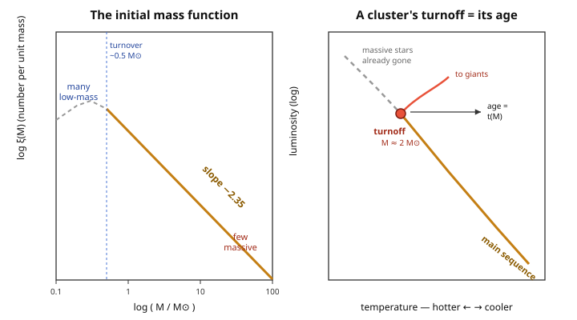

# Astrophysics · Lesson 3.5: The initial mass function and stellar populations

> ⏱ ~15 min · Module 3: Stellar evolution and death · Builds on: [3.1 Star formation](#/lesson/astrophysics/03-01-star-formation-jeans.md), [2.5 The main sequence](#/lesson/astrophysics/02-05-main-sequence.md), [3.3 Nucleosynthesis](#/lesson/astrophysics/03-03-nucleosynthesis-elements.md), [3.4 Stellar death](#/lesson/astrophysics/03-04-stellar-death-supernovae.md) · Unlocks: Module 4 (compact objects) and Module 5 (galaxies) — populations are what galaxies are made of

## Why this matters

For four lessons we followed *one* star from cradle to grave. But a galaxy doesn't make one star — it makes billions, all at once, spanning a huge range of masses. Two numbers then decide almost everything you can observe about that galaxy: **how many stars of each mass are born** (the initial mass function), and **how the mix has changed over cosmic time** (stellar populations). Together they explain a paradox you can check with your own eyes: nearly every star is a dim red dwarf you've never noticed, yet the light of a galaxy — and its chemical enrichment, and its energy budget — is set by a rare handful of giants. Get these two numbers and you can read a galaxy's age and history off its integrated light.

## The idea

Picture the census of a newborn star cluster. Line the stars up by birth mass. You find a *lot* of little ones and very few big ones — and not just "somewhat" few. The count falls off as a steep power of mass: drop the mass tenfold and you get a couple hundred times *more* stars. Low-mass stars win the population by a landslide.

Now flip the question from "who's most numerous?" to "who do you actually *see*?" A massive star is preposterously luminous — luminosity climbs like $M^{3.5}$, so a $10\,M_\odot$ star outshines the Sun three-thousand-fold. Rarity ($\sim M^{-2.35}$) fights brightness ($\sim M^{3.5}$), and brightness wins: the light, the heavy-element factory, and the supernova feedback all come from the massive minority. **Most stars are M dwarfs; almost all the action is O and B stars.**

That's a snapshot at birth. Run the clock forward and the massive stars — living fast — die first. So an old population is *missing its bright end*, and how much is missing is a clock. That clock, plus the fact that each generation of dying stars seeds the next with metals, lets you sort stars into **populations** and reconstruct the history of a galaxy from starlight alone.

## The formal version

**The initial mass function (IMF).** Define $\xi(M)$ so that $\xi(M)\,dM$ is the number of stars born with mass in $[M, M+dM]$ per unit volume. Salpeter (1955) found that above roughly $0.5\,M_\odot$ it is a power law,

$$\xi(M) \;=\; \xi_0\, M^{-\alpha}, \qquad \alpha \approx 2.35.$$

In words: stellar births are drawn from a steeply falling distribution — many low-mass stars, exponentially fewer massive ones, with no preferred mass in the power-law range. Below $\sim 0.5\,M_\odot$ the function flattens and turns over (a characteristic mass of a few tenths of $M_\odot$); above, the Salpeter slope holds up to $\sim 100\,M_\odot$.

**Three budgets from one function.** Weight the IMF three ways and integrate:

$$\underbrace{\int \xi\,dM}_{\text{number}\,\propto\, M^{-2.35}}, \qquad \underbrace{\int M\,\xi\,dM}_{\text{mass}\,\propto\, M^{-1.35}}, \qquad \underbrace{\int L(M)\,\xi\,dM}_{\text{light}\,\propto\, M^{+1.15}}\quad (L\propto M^{3.5}).$$

In words: because the exponents flip sign, the *number* and most of the stellar *mass* sit at the low-mass end, but the *luminosity* is dominated by the high-mass end. Same population, three different "typical" stars depending on what you weight by.

**Why roughly this shape?** From [3.1](#/lesson/astrophysics/03-01-star-formation-jeans.md): a molecular cloud doesn't collapse into one object — as it contracts and cools, its Jeans mass keeps dropping, so it fragments hierarchically into ever-smaller clumps. Scale-free, turbulent fragmentation naturally produces a power-law spectrum of clump masses; the Jeans mass at the end of fragmentation sets the turnover scale ($\sim 0.5\,M_\odot$). The exact slope is not fully derived from first principles, but the power-law tail is a fingerprint of self-similar fragmentation.

**Stellar populations** (mixes of stars with a shared origin and metallicity $Z$, the mass fraction in elements heavier than helium):

- **Population I** — young, metal-rich ($Z\sim 0.01$–$0.02$), found in the galactic *disk* and spiral arms. The Sun ($Z\approx 0.014$) is Pop I.
- **Population II** — old, metal-poor ($Z\sim 10^{-4}$–$10^{-3}$), found in the *halo* and *globular clusters*. Formed early, before much enrichment.
- **Population III** — hypothetical *first* stars, metal-free ($Z=0$), forming from pristine H/He. Never yet observed; likely very massive and short-lived, and responsible for the *first* metals.

**Metallicity as a clock.** Since (from [3.3](#/lesson/astrophysics/03-03-nucleosynthesis-elements.md)) metals are forged *inside* prior generations of stars and dispersed by their deaths, a star's metal content records how many generations came before it. Low $Z$ = early = few ancestors; high $Z$ = late = many. This drives **galactic chemical evolution**: each generation enriches the gas the next is born from.

**The main-sequence turnoff clock.** A star cluster is *coeval* — all its stars ignited together. Using main-sequence lifetime $t \propto M^{-2.5}$ (from [2.5](#/lesson/astrophysics/02-05-main-sequence.md)), the most massive stars leave the main sequence first. At any age, the **turnoff mass** — the most massive star *still* on the main sequence — satisfies $t(M_{\rm to}) = $ (cluster age). Read the turnoff mass off the cluster's HR diagram and you have read its age.

## Picture

## Worked examples

**Example 1 (mechanical — the three budgets).** Take the Salpeter IMF $\xi \propto M^{-2.35}$ over $0.5$–$100\,M_\odot$ and evaluate each weighted integral (dropping the common constant $\xi_0$). The antiderivative of $M^{p}$ is $M^{p+1}/(p+1)$:

$$\text{Number} \propto \int_{0.5}^{100} M^{-2.35}dM = \frac{M^{-1.35}}{-1.35}\Big|_{0.5}^{100} = \frac{1}{1.35}\left(0.5^{-1.35} - 100^{-1.35}\right)=\frac{2.55 - 0.002}{1.35}\approx 1.89.$$

Almost all of that $1.89$ comes from the $0.5^{-1.35}=2.55$ term — the **low-mass** end.

$$\text{Mass} \propto \int_{0.5}^{100} M^{-1.35}dM = \frac{1}{0.35}\left(0.5^{-0.35}-100^{-0.35}\right)=\frac{1.27-0.20}{0.35}\approx 3.07.$$

Still low-mass-dominated (the $0.5$ term is $1.27$ vs $0.20$ at the top): **low-mass stars hold most of the mass**, though less lopsidedly.

$$\text{Light} \propto \int_{0.5}^{100} M^{3.5}\,M^{-2.35}dM = \int_{0.5}^{100} M^{1.15}dM = \frac{1}{2.15}\left(100^{2.15}-0.5^{2.15}\right)=\frac{1.99\times10^{4}-0.23}{2.15}\approx 9.3\times10^{3}.$$

Now the $100^{2.15}\approx 2\times10^4$ **upper** limit dominates completely: **the light comes from the massive stars.** One IMF, three answers to "what's a typical star?" — depending entirely on the weighting.

**Example 2 (why you'd care — dating a globular cluster).** You image a globular cluster, build its HR diagram, and find the main-sequence turnoff at $M_{\rm to}\approx 0.9\,M_\odot$. With $t\propto M^{-2.5}$ normalized to the Sun ($1\,M_\odot \to 10\ \mathrm{Gyr}$):

$$t_{\rm cluster} = 10\ \mathrm{Gyr}\times (0.9)^{-2.5} = 10\times 1.30 \approx 13\ \mathrm{Gyr}.$$

Every star more massive than $0.9\,M_\odot$ has already died; the survivors are $\lesssim 0.9\,M_\odot$. A $\sim 13$-Gyr age places this cluster among the *oldest* objects in the Galaxy — nearly as old as the universe. Combined with its low metallicity, that's the signature of a **Population II** object: it formed in the first Gyr, from barely-enriched gas, and has been quietly aging ever since. This is how the ages of the oldest globulars set a hard *lower bound* on the age of the universe — an astrophysical clock that had to be reconciled with cosmology.

## Watch out

- You might think "most stars are like the Sun." Not by number — the Sun sits well above the median. **Most stars are M dwarfs** ($<0.5\,M_\odot$); the Sun is brighter than perhaps 90% of stars. Our sky is a survivor's bias: we see the rare bright ones.
- You might think a steeply falling IMF means massive stars are astrophysically negligible. The *opposite* — because light, metals, ionizing radiation, and supernova feedback all scale steeply *up* with mass, the rare massive stars dominate a young population's energy and chemistry despite being $\sim 10^{-3}$ of the count.
- You might read "Population I / II" as "first / second generation." It's backwards, and it's a spectrum, not two bins: the numbering is historical (Pop I = disk stars catalogued first). Physically, **Pop I is the metal-rich late-comers, Pop II the metal-poor old-timers.**
- You might treat metallicity as a perfect clock. It's a good *tracer* of how much enrichment preceded a star, but enrichment is patchy in space and time, so $Z$ orders generations only statistically — the *turnoff* age is the sharper clock.

## One-liner

> The IMF is a steep power law $\xi\propto M^{-2.35}$ — so by number stars are overwhelmingly low-mass, but the light, metals, and feedback belong to the rare massive minority; and a cluster's main-sequence turnoff reads its age straight off the sky.

## Problems

**P1 (🟢)** Using the Salpeter IMF $\xi(M)\propto M^{-2.35}$, compute the ratio of the number of $1\,M_\odot$ stars to $10\,M_\odot$ stars formed (per equal mass interval).

**P2 (🟡)** Massive stars are rare by number but bright by luminosity. Using number $\propto M^{-2.35}$ and $L\propto M^{3.5}$, compare the *total light* emitted by stars in a narrow bin near $10\,M_\odot$ to that from an equal bin near $1\,M_\odot$. What does the sign of the resulting exponent tell you about which stars dominate a young population's luminosity?

**P3 (🔴, optional)** A cluster's main-sequence turnoff is at $2\,M_\odot$. Using $t\propto M^{-2.5}$ with the Sun ($1\,M_\odot$) living $10\ \mathrm{Gyr}$, estimate the cluster's age — and explain *why* the turnoff mass equals the age this way.

Solutions

**P1** The number per unit mass at fixed bin width is just $\xi$, so the ratio is

$$\frac{\xi(1)}{\xi(10)} = \frac{1^{-2.35}}{10^{-2.35}} = 10^{2.35} = 10^{2}\cdot 10^{0.35} \approx 100\times 2.24 \approx 224.$$

About **224 times more** $1\,M_\odot$ stars than $10\,M_\odot$ stars are born. The steep slope makes solar-mass stars vastly more common than their ten-times-heavier cousins.

**P2** The light from a bin is (number) $\times$ (luminosity per star) $\propto M^{-2.35}\cdot M^{3.5} = M^{1.15}$. Comparing the $10\,M_\odot$ bin to the $1\,M_\odot$ bin of equal width:

$$\frac{L_{\rm bin}(10)}{L_{\rm bin}(1)} = \frac{10^{1.15}}{1^{1.15}} = 10^{1.15} \approx 14.$$

So even though the massive bin has $\sim 224\times$ *fewer* stars (P1), each is $10^{3.5}\approx 3200\times$ brighter, and the net light is $\sim 14\times$ *larger*. The **positive** exponent ($+1.15$) means the luminosity-weighted mass function *rises* with mass — the total light of a young population is dominated by its most massive stars, right up to the upper mass cutoff. (This is exactly the "light $\propto M^{+1.15}$" budget of Example 1.)

**P3** Solve for the lifetime of a $2\,M_\odot$ star:

$$t = 10\ \mathrm{Gyr}\times (2)^{-2.5} = \frac{10}{2^{2.5}} = \frac{10}{2^{2}\cdot 2^{0.5}} = \frac{10}{4\times 1.414} = \frac{10}{5.66} \approx 1.8\ \mathrm{Gyr}.$$

**Method:** the cluster is coeval — every star ignited at essentially the same moment. Main-sequence lifetime falls steeply with mass ($t\propto M^{-2.5}$), so stars burn out top-down: the most massive die first. At the present moment, every star more massive than $2\,M_\odot$ has *already* left the main sequence (it's now a giant or a remnant), while everything lighter is still burning hydrogen. The turnoff mass is therefore the mass whose main-sequence lifetime *equals the elapsed time* — so $t(2\,M_\odot)\approx 1.8\ \mathrm{Gyr}$ is the cluster's age. Read the turnoff off the HR diagram, plug into the lifetime law, and the cluster tells you when it was born.

## Flashback

**From Lesson 1.2 (Blackbody radiation and the HR diagram):** A massive main-sequence O star has surface temperature $T\approx 30{,}000\ \mathrm{K}$ and radius $R\approx 10\,R_\odot$. Using $L\propto R^2 T^4$ and the Sun ($T_\odot \approx 5800\ \mathrm{K}$, $R_\odot$), estimate its luminosity in solar units — and connect the answer to why this lesson says massive stars dominate the light.

Solution

$$\frac{L}{L_\odot} = \left(\frac{R}{R_\odot}\right)^2\left(\frac{T}{T_\odot}\right)^4 = (10)^2\left(\frac{30{,}000}{5800}\right)^4 = 100\times (5.17)^4.$$

$(5.17)^2 \approx 26.7$, so $(5.17)^4 \approx 716$, giving

$$\frac{L}{L_\odot}\approx 100\times 716 \approx 7\times 10^{4}.$$

A single O star shines like $\sim 70{,}000$ Suns. Even though (by the IMF) such stars are outnumbered thousands-to-one, one of them outshines a whole crowd of red dwarfs — the blackbody law ($L\propto R^2T^4$) is *why* the mass–luminosity relation is so steep, and hence why the rare massive stars run away with a population's total light.

## Connections

- **Backward:** the IMF's shape traces to hierarchical fragmentation and the falling Jeans mass of [3.1](#/lesson/astrophysics/03-01-star-formation-jeans.md); the turnoff clock is the lifetime law $t\propto M^{-2.5}$ from [2.5](#/lesson/astrophysics/02-05-main-sequence.md); the "massive stars make the metals" premise is [3.3](#/lesson/astrophysics/03-03-nucleosynthesis-elements.md), and their explosive delivery is [3.4](#/lesson/astrophysics/03-04-stellar-death-supernovae.md).
- **Forward:** populations are the atoms of everything ahead — the light and colors of galaxies (Module 5) are IMF-weighted sums of stellar spectra; chemical evolution sets the metallicities you'll use to trace the [Milky Way](#/lesson/astrophysics/05-02-milky-way.md)'s assembly; and the massive-star feedback flagged here (radiation, winds, supernovae) is the engine that regulates star formation across cosmic time.
- **Sideways (statistics):** the IMF is a power-law (Pareto) distribution — the same heavy-tailed math where the *count* and the *contribution* peak at opposite ends. "Most stars are dwarfs but most light is from giants" is the astrophysical twin of "most events are small but most impact is from the rare large one."
- **Sideways (cosmology):** the oldest globular-cluster turnoff ages (Example 2, $\sim 13\ \mathrm{Gyr}$) are an independent lower bound on the age of the universe — a stellar clock that any cosmological model (Module 6) must accommodate.
