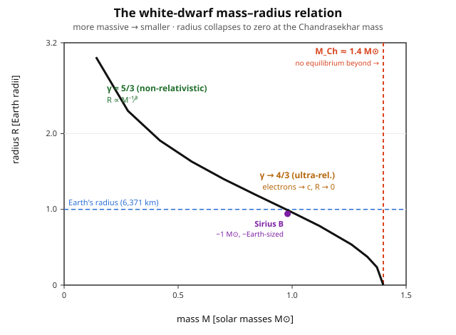

# Astrophysics · Lesson 4.1: White dwarfs and the Chandrasekhar mass

> ⏱ ~15 min · Module 4: Compact objects · Builds on: [2.4 Polytropes and the Lane–Emden equation](#/lesson/astrophysics/02-04-polytropes-lane-emden.md), [3.4 Stellar death](#/lesson/astrophysics/03-04-stellar-death-supernovae.md), the stat-mech [ideal Fermi gas](#/lesson/stat-mech/04-04-ideal-fermi-gas.md), QM [identical particles](#/lesson/quantum-mechanics/05-01-identical-particles.md) · Unlocks: 4.2 Neutron stars and pulsars

## Why this matters

When a star like the Sun runs out of fuel, it does not simply wink out. It sheds its envelope and leaves behind its bare, spent core — a ball of carbon and oxygen with **no fusion anywhere inside it**. Nothing is burning, so nothing thermal holds it up. And yet it does not collapse. It is held against its own gravity by a purely quantum effect: the refusal of electrons to occupy the same state, the **degeneracy pressure** you built in stat-mech. This lesson turns that one fact into two of the most beautiful results in astrophysics — a star that gets *smaller* as you add mass, and a hard **maximum mass** (about $1.4\,M_\odot$) above which no amount of quantum stubbornness can win. That ceiling is the trigger for Type Ia supernovae and the doorway to neutron stars and black holes. It is the astrophysical payoff of the whole Fermi-gas calculation.

## The idea

A white dwarf is what is left when a low-mass star dies: the exposed **degenerate core**, roughly one solar mass of C/O packed into an Earth-sized sphere. Gravity is trying to crush it. What pushes back?

Not heat — the core is inert. The answer is Pauli exclusion. Compress the electrons and you force them into ever-higher momentum states (there is nowhere else to go; the low states are full). Fast electrons carry momentum, momentum flux *is* pressure, and this pressure survives even at $T=0$. That is **electron degeneracy pressure**, and in stat-mech you found it scales as $P \propto n^{5/3} \propto \rho^{5/3}$ — a stiff, purely quantum stiffness.

Now do the balance. Gravity's inward squeeze scales one way with radius; degeneracy's outward push scales another. Setting them equal gives the star's size — and out drops something startling: $R \propto M^{-1/3}$. **A heavier white dwarf is a smaller white dwarf.** Add mass and it shrinks. (Contrast an ordinary star or a rock, which gets bigger when you add mass.) The reason is that degeneracy pressure has no thermostat: the only way to generate more support is to raise the density, which means squeezing to a smaller radius.

But shrinking has a cost. Squeeze harder and the electrons at the top of the Fermi sea move faster — eventually approaching the speed of light. Once they are **ultrarelativistic**, the pressure law *softens*: the exponent drops from $5/3$ to $4/3$. And $4/3$ is exactly the exponent at which the mass–radius balance stops working — gravity and pressure both scale as $R^{-4}$, the radius cancels, and equilibrium is possible only at **one special mass**. Push past it and there is no radius, large or small, where the electrons can hold the star up. That mass is the **Chandrasekhar mass**, $M_{\rm Ch}\approx 1.4\,M_\odot$.

## The formal version

**Setup and notation.** Let $\rho$ be mass density, $M$ the total mass, $R$ the radius, and $n_e$ the electron number density. The gas is fully ionized, so its mass is carried by baryons but its pressure by electrons. Write

$$n_e = \frac{\rho}{\mu_e m_H},$$

where $m_H\approx 1.67\times10^{-27}$ kg is the nucleon mass and $\mu_e$ is the **mass per electron in nucleon units** — the number of baryons per electron. For a carbon/oxygen white dwarf every nucleus has equal protons and neutrons, so $\mu_e = 2$. *In words:* there is one electron for every two nucleons, so the electron density is half the nucleon density.

**The two degeneracy-pressure laws (from stat-mech).** The zero-temperature Fermi gas gives

$$P_{\rm NR} = \frac{(3\pi^2)^{2/3}}{5}\frac{\hbar^2}{m_e}\,n_e^{5/3}\;\propto\;\rho^{5/3}\quad(\text{non-relativistic},\ \gamma=\tfrac53),$$

$$P_{\rm UR} = \frac{(3\pi^2)^{1/3}}{4}\,\hbar c\,\,n_e^{4/3}\;\propto\;\rho^{4/3}\quad(\text{ultra-relativistic},\ \gamma=\tfrac43).$$

*In words:* slow electrons push back stiffly ($5/3$); when they hit relativistic speeds the same squeeze buys you less pressure ($4/3$). Each is a **polytrope** $P = K\rho^{\gamma}$ with $\gamma = 1 + 1/n$: the $5/3$ law is the $n = 3/2$ polytrope, the $4/3$ law is the $n = 3$ polytrope of [2.4](#/lesson/astrophysics/02-04-polytropes-lane-emden.md).

**Hydrostatic equilibrium, order of magnitude.** Balancing the pressure gradient against gravity, $dP/dr = -G\,m(r)\rho/r^2$, gives at order of magnitude a **central pressure**

$$P_c \sim \frac{GM^2}{R^4}.$$

*In words:* the weight the core must support scales as $GM^2/R^4$; the smaller the star, the more crushing the gravity.

**The mass–radius relation.** Set the non-relativistic degeneracy pressure equal to what gravity demands, using $\rho\sim M/R^3$:

$$\frac{\hbar^2}{m_e (\mu_e m_H)^{5/3}}\frac{M^{5/3}}{R^5}\;\sim\;\frac{GM^2}{R^4} \quad\Longrightarrow\quad \boxed{\,R \sim \frac{\hbar^2}{G\,m_e (\mu_e m_H)^{5/3}}\,M^{-1/3}\,}\;\propto\;M^{-1/3}.$$

*In words:* the equilibrium radius **falls** as mass rises — the signature backwards behavior of degenerate matter. For $M = 1\,M_\odot$ this evaluates to a few thousand kilometers (Worked example 1): a white dwarf is **Earth-sized**.

**The Chandrasekhar mass.** Now use the *ultrarelativistic* law instead. With $\rho\sim M/R^3$, the pressure scales as $M^{4/3}/R^4$ — the **same** $R^{-4}$ as gravity:

$$\frac{\hbar c}{(\mu_e m_H)^{4/3}}\frac{M^{4/3}}{R^4}\;\sim\;\frac{GM^2}{R^4}.$$

$R^4$ cancels on both sides. The radius drops out entirely and the equation fixes a single mass:

$$\boxed{\,M_{\rm Ch}\;\sim\;\frac{1}{\mu_e^2\, m_H^2}\left(\frac{\hbar c}{G}\right)^{3/2}\;=\;\frac{1}{\mu_e^2}\,\frac{M_{\rm Pl}^3}{m_H^2},\qquad M_{\rm Pl}\equiv\sqrt{\frac{\hbar c}{G}}.\,}$$

*In words:* the maximum mass is built entirely from fundamental constants — $\hbar$, $c$, $G$ — and the proton mass, with a factor of the electron fraction squared. Put in the numbers (Worked example 2) and it lands near $1.4\,M_\odot$. Above $M_{\rm Ch}$ **no equilibrium radius exists**: degeneracy pressure can never catch gravity, and the core collapses. That collapse is the engine of a Type Ia supernova (a white dwarf accreting toward $M_{\rm Ch}$) and the birth of neutron stars.

## Picture

The curve falls as $R\propto M^{-1/3}$ on the left (non-relativistic, $\gamma=5/3$), then plunges toward zero radius as $M\to M_{\rm Ch}$ (ultrarelativistic, $\gamma\to 4/3$). A $1\,M_\odot$ white dwarf sits right around Earth's radius — Sirius B, the nearest example, is marked. To the right of the dashed line there is no white dwarf at all.

## Worked examples

**Example 1 (mechanical — the radius of a $1\,M_\odot$ white dwarf).** Evaluate the boxed mass–radius relation with $M = M_\odot = 1.99\times10^{30}$ kg, $\mu_e = 2$, and constants $\hbar = 1.055\times10^{-34}$ J·s, $m_e = 9.11\times10^{-31}$ kg, $G = 6.67\times10^{-11}$ SI, $m_H = 1.67\times10^{-27}$ kg. Restoring the Fermi-gas prefactor $(3\pi^2)^{2/3}/5 \approx 1.91$,

$$R \approx \frac{(3\pi^2)^{2/3}}{5}\,\frac{\hbar^2}{G\,m_e(\mu_e m_H)^{5/3}}\,M^{-1/3}.$$

Piece by piece: $\hbar^2 = 1.11\times10^{-68}$; $\mu_e m_H = 3.34\times10^{-27}$ kg so $(\mu_e m_H)^{5/3} = 7.5\times10^{-45}$; $M^{-1/3} = (1.99\times10^{30})^{-1/3} = 7.9\times10^{-11}$. Then

$$R \approx 1.91\times\frac{1.11\times10^{-68}}{(6.67\times10^{-11})(9.11\times10^{-31})(7.5\times10^{-45})}\times 7.9\times10^{-11} \approx 7\times10^{6}\ \text{m} \approx 7{,}000\ \text{km}.$$

That is almost exactly Earth's radius ($6{,}371$ km). **One solar mass of star, squeezed into a planet.** (The crude balance without the $1.91$ prefactor gives $\sim 3{,}700$ km — same order; the real answer for $1\,M_\odot$ is $\sim 5{,}500$ km once the full $n=3/2$ Lane–Emden structure is used. All three agree: Earth-sized.)

**Example 2 (why you'd care — evaluating the Chandrasekhar mass).** First the pure scaling, with no fudge factors. The Planck mass is

$$M_{\rm Pl} = \sqrt{\frac{\hbar c}{G}} = \sqrt{\frac{(1.055\times10^{-34})(3\times10^{8})}{6.67\times10^{-11}}} = 2.18\times10^{-8}\ \text{kg}.$$

So the bare combination is

$$\frac{M_{\rm Pl}^3}{m_H^2} = \frac{(2.18\times10^{-8})^3}{(1.67\times10^{-27})^2} = \frac{1.03\times10^{-23}}{2.79\times10^{-54}} = 3.7\times10^{30}\ \text{kg} \approx 1.9\,M_\odot.$$

**Astonishing:** three microscopic constants and the proton mass, combined with no astronomy at all, produce a mass of order the Sun's. Now attach the two remaining factors. The electron fraction gives $1/\mu_e^2 = 1/4$, dropping it to $\sim 0.46\,M_\odot$; and the exact $n=3$ polytrope (Lane–Emden) coefficient — the honest replacement for our order-of-magnitude "$\sim$" — is $\approx 3.1$, which multiplies it back up:

$$M_{\rm Ch} = 3.1\times\frac{1}{\mu_e^2}\,\frac{M_{\rm Pl}^3}{m_H^2} \approx 3.1\times 0.46\,M_\odot \approx 1.4\,M_\odot.$$

The famous number. Its dependence $M_{\rm Ch}\propto \mu_e^{-2}$ means composition matters: a helium or C/O dwarf ($\mu_e=2$) caps at $1.4\,M_\odot$; the exact result is $M_{\rm Ch} = 1.44\,(2/\mu_e)^2\,M_\odot$.

## Watch out

- You might think a heavier white dwarf is a bigger one, like a heavier rock. It is the **opposite**: $R\propto M^{-1/3}$. Add mass and the star *shrinks*, because degeneracy pressure has no temperature knob — the only way to push harder is to raise the density by contracting.
- You might think the Chandrasekhar mass is where the star "runs out of pressure." Not quite — degeneracy pressure keeps rising with density forever. The problem is that once electrons go relativistic it rises only as fast as gravity ($\rho^{4/3}$ vs the gravitational demand), never *faster*, so there is no stable restoring margin. Softening, not vanishing, is the killer.
- You might conflate the two pressure laws. $\gamma=5/3$ (non-relativistic, $n=3/2$ polytrope) governs light, fluffy white dwarfs and gives a stable $R(M)$; $\gamma=4/3$ (ultrarelativistic, $n=3$ polytrope) is the marginal case reached only as $M\to M_{\rm Ch}$. A real white dwarf lives somewhere between them, which is why the curve bends.
- $M_{\rm Ch}$ depends on $\mu_e$ but **not** on $m_e$ — the electron mass cancels out of the ultrarelativistic balance (in the $\gamma=4/3$ law the pressure carries $\hbar c$, not $\hbar^2/m_e$). The electron mass only sets *where* the transition to relativistic happens, not the ceiling itself.

## One-liner

> A dead star is held up by Pauli exclusion alone, so it *shrinks* as it gains mass ($R\propto M^{-1/3}$) — until its electrons turn relativistic, the pressure softens to $\rho^{4/3}$, and the whole thing caves at a universal maximum mass $M_{\rm Ch}\approx 1.4\,M_\odot$ built from $\hbar$, $c$, $G$, and $m_H$.

## Problems

**P1 (🟢)** Using $P_{\rm deg}\propto\rho^{5/3}$ balanced against the central pressure $P_c\sim GM^2/R^4$ (with $\rho\sim M/R^3$), derive the scaling $R\propto M^{-1/3}$ from scratch. Then, given that a $0.6\,M_\odot$ white dwarf has radius $\approx 8{,}800$ km, use the scaling to predict the radius of a $1.2\,M_\odot$ white dwarf. (Comment on whether the true value would be larger or smaller than your estimate.)

**P2 (🟡)** Derive the Chandrasekhar-mass scaling $M_{\rm Ch}\sim (\hbar c/G)^{3/2}/(\mu_e m_H)^2$ by balancing the ultrarelativistic law $P_{\rm UR}\sim \hbar c\, n_e^{4/3}$ against $P_c\sim GM^2/R^4$, and show the radius cancels. Evaluate the bare combination $(\hbar c/G)^{3/2}/(\mu_e m_H)^2$ numerically (with $\mu_e=2$) and confirm it is of order a solar mass.

**P3 (🔴, optional)** Show that at the mass–radius conditions of a massive white dwarf the electrons really are relativistic, justifying the $\gamma=4/3$ softening. Take $M = 1\,M_\odot$, $R = 5{,}000$ km, $\mu_e = 2$. Compute the mean density, the electron number density $n_e$, the Fermi momentum $p_F = \hbar(3\pi^2 n_e)^{1/3}$, and compare $p_F c$ to $m_e c^2 = 0.511$ MeV. What does this say as $M\to M_{\rm Ch}$?

Solutions

**P1** Degeneracy pressure with $\rho\sim M/R^3$: $P_{\rm deg}\sim\rho^{5/3}\sim (M/R^3)^{5/3} = M^{5/3}/R^5$. Set equal to $P_c\sim GM^2/R^4$:

$$\frac{M^{5/3}}{R^5}\sim\frac{GM^2}{R^4}\;\Longrightarrow\;\frac{1}{R}\sim G\,M^{2-5/3} = G\,M^{1/3}\;\Longrightarrow\;R\propto M^{-1/3}.$$

Since $R\propto M^{-1/3}$, going from $0.6$ to $1.2\,M_\odot$ (a factor of $2$ in mass) shrinks the radius by $2^{-1/3} = 0.794$:

$$R(1.2\,M_\odot)\approx 8{,}800\times 0.794 \approx 7{,}000\ \text{km}.$$

The *true* value is **smaller** than this: at $1.2\,M_\odot$ the electrons are becoming relativistic, the equation of state softens toward $\gamma=4/3$, and the star contracts faster than the pure $M^{-1/3}$ law predicts — the curve is already bending down toward the Chandrasekhar cliff.

**P2** Ultrarelativistic law with $n_e\sim\rho/(\mu_e m_H)\sim M/(\mu_e m_H R^3)$:

$$P_{\rm UR}\sim\hbar c\,n_e^{4/3}\sim\hbar c\left(\frac{M}{\mu_e m_H R^3}\right)^{4/3} = \frac{\hbar c}{(\mu_e m_H)^{4/3}}\frac{M^{4/3}}{R^4}.$$

Set equal to $P_c\sim GM^2/R^4$. The $R^4$ cancels on both sides:

$$\frac{\hbar c}{(\mu_e m_H)^{4/3}}\,M^{4/3}\sim G\,M^2\;\Longrightarrow\;M^{2/3}\sim\frac{\hbar c}{G\,(\mu_e m_H)^{4/3}}\;\Longrightarrow\;M_{\rm Ch}\sim\left(\frac{\hbar c}{G}\right)^{3/2}\frac{1}{(\mu_e m_H)^2}.$$

Radius has dropped out — the balance fixes a mass, not a size. Numerically, using $M_{\rm Pl}^3 = (\hbar c/G)^{3/2} = 1.03\times10^{-23}$ kg and $(\mu_e m_H)^2 = (2\cdot1.67\times10^{-27})^2 = 1.12\times10^{-53}$ kg²:

$$\frac{(\hbar c/G)^{3/2}}{(\mu_e m_H)^2} = \frac{1.03\times10^{-23}}{1.12\times10^{-53}} = 9.2\times10^{29}\ \text{kg} = 0.46\,M_\odot.$$

Of order a solar mass — the right ballpark. (The exact Lane–Emden $n=3$ coefficient $\approx 3.1$ lifts it to the true $1.4\,M_\odot$.)

**P3** Mean density with $R = 5\times10^6$ m, $M = 1.99\times10^{30}$ kg:

$$\rho = \frac{M}{\tfrac43\pi R^3} = \frac{1.99\times10^{30}}{\tfrac43\pi(5\times10^6)^3} = \frac{1.99\times10^{30}}{5.24\times10^{20}} \approx 3.8\times10^{9}\ \text{kg/m}^3.$$

Electron number density ($\mu_e m_H = 3.34\times10^{-27}$ kg):

$$n_e = \frac{\rho}{\mu_e m_H} = \frac{3.8\times10^9}{3.34\times10^{-27}} \approx 1.1\times10^{36}\ \text{m}^{-3}.$$

Fermi momentum:

$$p_F = \hbar(3\pi^2 n_e)^{1/3} = (1.055\times10^{-34})\big(3\pi^2\cdot1.1\times10^{36}\big)^{1/3}.$$

Inside: $3\pi^2\cdot1.1\times10^{36} = 3.3\times10^{37}$, cube root $= 3.2\times10^{12}$, so $p_F \approx 3.4\times10^{-22}$ kg·m/s. Its energy scale:

$$p_F c = (3.4\times10^{-22})(3\times10^8) = 1.0\times10^{-13}\ \text{J} = 0.64\ \text{MeV}.$$

Compare to $m_e c^2 = 0.511$ MeV: the ratio is $p_F c / m_e c^2 \approx 1.25 > 1$. The electrons at the top of the Fermi sea have momenta exceeding $m_e c$ — they are **genuinely relativistic** (the Fermi-surface Lorentz factor is $\gamma = \sqrt{(p_Fc)^2+(m_ec^2)^2}/m_ec^2 \approx 1.6$, i.e. $v\approx 0.78c$). This is exactly the condition that softens the pressure toward $\gamma=4/3$. As $M\to M_{\rm Ch}$, the radius shrinks further, $\rho$ and $n_e$ climb, $p_F$ grows without bound, and the electrons become *ultra*relativistic everywhere — the star tips fully onto the $\rho^{4/3}$ law and loses its ability to resist gravity.

## Flashback

**From Lesson 1.2 (Blackbody radiation and the HR diagram):** A white dwarf radiates as a blackbody. Sirius B has surface temperature $T \approx 25{,}000$ K and radius $R \approx 6{,}000$ km. Use the Stefan–Boltzmann law $L = 4\pi R^2\sigma T^4$ (with $\sigma = 5.67\times10^{-8}\ \text{W m}^{-2}\text{K}^{-4}$) to find its luminosity in solar units ($L_\odot = 3.83\times10^{26}$ W). It is *hotter* than the Sun ($T_\odot = 5{,}770$ K) — why is it so much fainter?

Solution

Surface area: $4\pi R^2 = 4\pi(6\times10^6)^2 = 4.52\times10^{14}\ \text{m}^2$. Flux at the surface: $\sigma T^4 = (5.67\times10^{-8})(2.5\times10^4)^4 = (5.67\times10^{-8})(3.91\times10^{17}) = 2.22\times10^{10}\ \text{W/m}^2$. So

$$L = (4.52\times10^{14})(2.22\times10^{10}) \approx 1.0\times10^{25}\ \text{W} = \frac{1.0\times10^{25}}{3.83\times10^{26}}\,L_\odot \approx 0.026\,L_\odot.$$

Sirius B is about **2.6% as luminous as the Sun despite being four times hotter.** The reason is size: luminosity goes as $R^2 T^4$, and although $T^4$ favors the white dwarf by a factor $(25000/5770)^4 \approx 350$, its radius is $\sim 120$ times smaller, so $R^2$ costs a factor $\sim 1.4\times10^4$. Area wins: $350/14000 \approx 0.025$. This tiny-but-hot combination is exactly why white dwarfs sit in the **lower-left corner of the HR diagram** — high temperature, low luminosity — a region no ordinary star occupies.

## Connections

- **Backward:** the pressure laws are lifted directly from the stat-mech [ideal Fermi gas](#/lesson/stat-mech/04-04-ideal-fermi-gas.md) ($P\propto n^{5/3}$ and its relativistic softening to $n^{4/3}$), which in turn rests on Pauli exclusion for identical fermions from QM [5.1](#/lesson/quantum-mechanics/05-01-identical-particles.md). The mass–radius balance is the $n=3/2$ and $n=3$ polytropes of [2.4](#/lesson/astrophysics/02-04-polytropes-lane-emden.md) evaluated at their two physical extremes.
- **Forward:** [4.2 Neutron stars](#/lesson/astrophysics/04-02-neutron-stars-pulsars.md) repeats this *entire* calculation with $m_e\to m_n$ and no $\mu_e$ (neutrons are the baryons), giving a second degeneracy-supported object with its own maximum mass — where the missing piece, general relativity (the TOV equation), finally matters. Exceeding $M_{\rm Ch}$ sets up both the Type Ia supernova of [3.4](#/lesson/astrophysics/03-04-stellar-death-supernovae.md) and, via core collapse, the compact objects of the rest of this module.
- **Sideways (fundamental constants):** $M_{\rm Ch}\sim M_{\rm Pl}^3/m_H^2$ is a rare window where a *macroscopic* mass is dictated by $\hbar$, $c$, $G$, and the proton mass alone — the same trio that sets the Planck scale. It is the closest astrophysics comes to computing a star from first principles.
