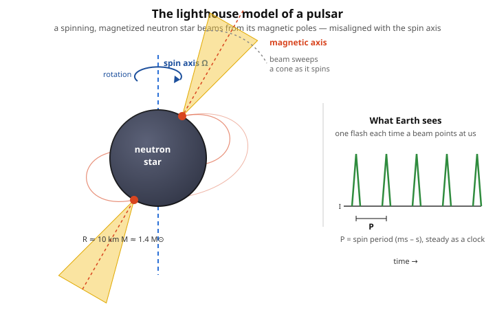

# Astrophysics · Lesson 4.2: Neutron stars and pulsars

> ⏱ ~15 min · Module 4: Compact objects · Builds on: [4.1 White dwarfs & the Chandrasekhar mass](#/lesson/astrophysics/04-01-white-dwarfs-chandrasekhar.md), [stat-mech 4.4 The ideal Fermi gas](#/lesson/stat-mech/04-04-ideal-fermi-gas.md), [mechanics 4.2 Angular momentum](#/lesson/mechanics-refresher/04-02-angular-momentum.md) · Unlocks: 4.3 Black holes in astrophysics

## Why this matters

In [4.1](#/lesson/astrophysics/04-01-white-dwarfs-chandrasekhar.md) you found the wall: electron degeneracy pressure can hold up a dead core only if its mass stays below the Chandrasekhar limit, $M_{\rm Ch}\approx 1.4\,M_\odot$. So what happens when a collapsing core is *heavier* than that? The electrons lose, the collapse resumes — and nature has one more trick, a second and far stiffer degeneracy pressure, this time from **neutrons**. Stop the collapse there and you get a neutron star: a Sun-and-a-half of mass crushed into the size of a city, the densest matter that exists short of a black hole. And when one of these objects spins and beams, it becomes a **pulsar** — a cosmic clock so precise it tests general relativity and once looked, briefly, like a signal from an alien civilization.

## The idea

Picture the iron core of a massive star at the instant it exceeds $M_{\rm Ch}$. Electron pressure fails, and the core falls essentially in free-fall — collapsing from Earth-size toward city-size in under a second. As density climbs, the electrons are squeezed to enormous energies, and it becomes energetically cheaper for an electron to be *eaten by a proton* than to keep paying the degeneracy-energy toll. That reaction,
$$p + e^- \to n + \nu_e,$$
is **inverse beta decay** (neutronization). In words: protons and electrons merge into neutrons, releasing a flood of neutrinos that carries away energy. The matter de-electronizes — it becomes, almost purely, a giant sea of neutrons.

Now the *same* quantum principle that held up the white dwarf reappears, but for neutrons. Neutrons are fermions too, so by [Pauli exclusion](#/lesson/quantum-mechanics/05-01-identical-particles.md) no two can share a state; pack them tight enough and they resist with **neutron degeneracy pressure**. It is vastly stronger than electron pressure for one simple reason: the neutron is ~1840 times heavier than the electron, so its quantum "jitter" momentum translates into a much larger, denser support against gravity. The collapse halts — if the mass is low enough — at nuclear density. You have made a neutron star.

Two numbers tell you this object is unlike anything else. Its density is that of an **atomic nucleus** — you have squeezed a star until it is one giant nucleus 10 km across. And its gravity is so extreme that the escape velocity is a sizeable fraction of the speed of light, which means Newton is no longer enough: you must describe its structure with general relativity.

## The formal version

**The parameters (order of magnitude — memorize the scale).** A neutron star packs
$$M \sim 1.4\,M_\odot, \qquad R \sim 10\text{–}12\ \text{km}, \qquad \rho \sim 10^{17}\ \text{kg/m}^3.$$
In words: a bit more than a solar mass inside a 20-km ball, at the density of nuclear matter (a sugar-cube's worth would mass ~$10^9$ tons). The surface gravity is $g\sim 10^{11}\,g_\oplus$ and the escape speed reaches $\sim0.5c$.

**Why gravity needs Einstein here.** The relevant dimensionless number is the **compactness**,
$$\mathcal{C} \equiv \frac{GM}{Rc^2},$$
the ratio of the object's size to its Schwarzschild radius $r_s = 2GM/c^2$ (so $\mathcal{C}=r_s/2R$). In words: how close the object sits to being a black hole. For the Sun $\mathcal{C}\sim 10^{-6}$ (Newton is flawless); for a neutron star $\mathcal{C}\sim 0.2$ — spacetime curvature is a ~20% effect, not a correction you can ignore. Consequently the hydrostatic-equilibrium equation from [2.1](#/lesson/astrophysics/02-01-equations-stellar-structure.md) is replaced by its general-relativistic version, the **Tolman–Oppenheimer–Volkoff (TOV) equation**. We use it as a result from general relativity (see [`relativity`](#/course/relativity)); its effect is that gravity is *stronger* than Newton predicts at these densities, so it takes less mass to overwhelm the pressure.

**The mass limit (the neutron-star Chandrasekhar).** Just as electron degeneracy has a ceiling, so does neutron degeneracy: above the
$$\textbf{TOV limit} \approx 2\text{–}3\ M_\odot$$
no equation of state can hold the star up, and it collapses to a **black hole**. In words: this is the analog of the Chandrasekhar mass, but softened and made uncertain because at nuclear density we don't precisely know the equation of state of neutron matter — the exact limit depends on how stiff that matter turns out to be. Observed neutron stars cluster near $1.4\,M_\odot$; the heaviest measured are ~$2.1\,M_\odot$, which already rules out the softest theories.

**Pulsars: the lighthouse.** A **pulsar** is a rapidly rotating, strongly magnetized neutron star. Radiation streams out along the **magnetic axis**, which is tilted relative to the **spin axis**; as the star rotates, the beam sweeps around like a lighthouse, and each time it crosses our line of sight we register a pulse. The two facts that make pulsars extreme both follow from conservation laws acting on the collapse:

- **Spin-up (angular momentum).** With no external torque, $L = I\omega$ is conserved ([mechanics 4.2](#/lesson/mechanics-refresher/04-02-angular-momentum.md)). Since $I \propto MR^2$ and $M$ is fixed, $\omega \propto R^{-2}$: shrink the core's radius by a factor of a thousand and the spin rate leaps by a *million*. A core turning once a month ends up turning many times a *second*. Observed periods run from milliseconds to seconds.
- **Magnetic field amplification (flux conservation).** Magnetic flux $\Phi = B\cdot A \propto B R^2$ is frozen into the conducting plasma and conserved as it collapses, so $B \propto R^{-2}$ — the same $R^{-2}$ boost. A stellar field of ~100 G is compressed into $10^8$–$10^{15}$ G, the strongest magnets in the universe.

Because the spin period is set by a huge, slowly-changing flywheel, pulsars are superb **clocks**. Timing them to nanoseconds turns them into precision instruments: the 1974 Hulse–Taylor **binary pulsar** was seen to spiral inward at exactly the rate general relativity predicts for energy lost to **gravitational waves** — the first (indirect) proof those waves exist (again, a `relativity` result — see [`relativity`](#/course/relativity)).

Pulsars were discovered in 1967 by Jocelyn Bell (and Antony Hewish): a startlingly regular 1.337-second radio blip, nicknamed "LGM-1" for Little Green Men before rotation was understood to be the clock.

## Picture

## Worked examples

**Example 1 (mechanical — degeneracy pressure scaling).** Why is neutron degeneracy so much stiffer than electron degeneracy at the same *number* density? For a non-relativistic degenerate gas the pressure scales as
$$P_{\rm deg} \sim \frac{\hbar^2}{m}\,n^{5/3},$$
where $m$ is the fermion mass and $n$ the number density (this is the [Fermi-gas](#/lesson/stat-mech/04-04-ideal-fermi-gas.md) result you used for white dwarfs). The $1/m$ out front says: **for the same $n$, the heavier fermion gives *less* pressure**, not more. So how do neutrons win? Two effects. First, neutronization removes the electrons entirely, so all the mass is in the pressure-providing particles — there are no "dead-weight" nucleons the electrons had to support. Second, and decisively, to reach mechanical balance against the star's own gravity the neutron gas is compressed to enormously higher $n$ (nuclear density), and $P\propto n^{5/3}$ climbs steeply. The net result is a stable object ~500 times smaller than a white dwarf of the same mass — the mass–radius relation $R \propto M^{-1/3}$ from 4.1 still holds, but with the neutron mass swapped in for the electron mass it shifts the whole curve down to ~10 km.

**Example 2 (why you'd care — reading a spin-down age off a clock).** A pulsar's period slowly lengthens as it radiates and loses rotational energy; we measure both the period $P$ and its rate of change $\dot P$. The **characteristic age** is
$$\tau \sim \frac{P}{2\dot P}.$$
In words: divide the clock's reading by how fast it's slowing to estimate how long it's been ticking. For the Crab pulsar, $P = 33$ ms and $\dot P \approx 4.2\times 10^{-13}\ \text{s/s}$:
$$\tau \sim \frac{0.033\ \text{s}}{2\,(4.2\times 10^{-13})} \approx 3.9\times 10^{10}\ \text{s} \approx 1200\ \text{yr}.$$
The Crab supernova was recorded by Chinese astronomers in **1054 AD** — about 970 years ago. The clock, read purely from its spin-down, lands within a factor of ~1.3 of the historical truth. That is the payoff of a neutron star: a piece of nuclear physics you can *time*.

## Watch out

- You might think the collapse stops because "neutrons can't be compressed." No — it stops because of **Pauli exclusion**: neutrons are fermions and refuse to share quantum states, generating pressure. It's a quantum-statistical effect, identical in spirit to what holds up a white dwarf, not a classical "hard sphere" repulsion.
- You might think a neutron star is "made of neutrons the way a gas is made of atoms." Careful: at these densities it's better pictured as one colossal atomic nucleus held together by gravity (with a thin crust and, deep inside, exotic matter we don't fully understand). That nuclear-physics uncertainty is exactly why the TOV mass limit is a *range* (2–3 $M_\odot$), not a sharp number like Chandrasekhar's.
- You might think the pulse period is the beam "turning on and off." It isn't — the beam shines steadily; you see pulses because it **sweeps past you** like a lighthouse. If the beam never crosses Earth, we never see the pulsar at all, even though it's beaming the whole time.
- You might confuse the two axes: rotation is about the **spin axis**; the beam comes out along the **magnetic axis**. Pulsars exist *because* those two are misaligned.

## One-liner

> When electrons lose to gravity, neutron degeneracy makes the last stand — a nuclear-density, city-sized clock spun up and magnetized by the collapse itself — until, above ~2–3 $M_\odot$, even neutrons fail and a black hole wins.

## Problems

**P1 (🟢)** The Sun's core (take radius $R_i \sim 10^4$ km, rotation period $P_i \sim 30$ days) collapses to a neutron star of radius $R_f = 10$ km with no loss of angular momentum. Treating it as a uniform sphere ($I \propto R^2$ at fixed mass), estimate the neutron star's spin period $P_f$. Is the answer in the observed pulsar range?

**P2 (🟡)** Take a neutron star with $M = 1.4\,M_\odot$ and $R = 10$ km. (a) Estimate its mean density $\rho$ and compare it to nuclear saturation density $\rho_{\rm nuc}\approx 2.3\times 10^{17}\ \text{kg/m}^3$. (b) Estimate its surface gravity $g = GM/R^2$ and express it in Earth gravities ($g_\oplus = 9.8\ \text{m/s}^2$). Use $M_\odot = 1.99\times 10^{30}$ kg, $G = 6.67\times 10^{-11}$ SI.

**P3 (🔴, optional)** Compute the compactness $\mathcal{C} = GM/(Rc^2)$ for the same neutron star ($c = 3\times 10^8$ m/s), and for the Sun ($M_\odot$, $R_\odot = 6.96\times 10^8$ m). Show the neutron star's value is $\sim0.2$ while the Sun's is $\sim10^{-6}$, and use it to find the neutron star's escape velocity as a fraction of $c$. Why does this justify replacing Newtonian hydrostatic equilibrium with the general-relativistic TOV equation?

Solutions

**P1** Angular momentum conservation with $I\propto R^2$ (mass fixed): $I_i\omega_i = I_f\omega_f \Rightarrow \omega_f/\omega_i = (R_i/R_f)^2$. Since $P = 2\pi/\omega$, the period scales the *opposite* way:
$$P_f = P_i\left(\frac{R_f}{R_i}\right)^2 = P_i\left(\frac{10\ \text{km}}{10^4\ \text{km}}\right)^2 = P_i\,(10^{-3})^2 = P_i\times 10^{-6}.$$
With $P_i = 30\ \text{days} = 30\times 86400\ \text{s} = 2.59\times 10^6$ s:
$$P_f = 2.59\times 10^6 \times 10^{-6}\ \text{s} \approx 2.6\ \text{s}.$$
A month-long rotation becomes a few-second spin — squarely in the observed pulsar range (ms to s). This is the skater pulling her arms in, amplified by a factor of a million. (Real newborn pulsars spin even faster because cores are more compact and rotate faster than the whole star; this is the clean order-of-magnitude version.)

**P2** (a) $M = 1.4\times 1.99\times 10^{30} = 2.79\times 10^{30}$ kg; $R = 10^4$ m, so
$$V = \tfrac{4}{3}\pi R^3 = \tfrac{4}{3}\pi (10^4)^3 = 4.19\times 10^{12}\ \text{m}^3,$$
$$\rho = \frac{M}{V} = \frac{2.79\times 10^{30}}{4.19\times 10^{12}} \approx 6.7\times 10^{17}\ \text{kg/m}^3.$$
That's $\rho/\rho_{\rm nuc} \approx 6.7\times 10^{17} / 2.3\times 10^{17} \approx 3$ — a few times nuclear saturation density. The star is essentially incompressible nuclear matter. (Check the sugar cube: $1\ \text{cm}^3 = 10^{-6}\ \text{m}^3$ masses $6.7\times 10^{17}\times 10^{-6} = 6.7\times 10^{11}$ kg $\approx 7\times 10^8$ metric tons — about a billion tons per teaspoon.)

(b) $g = \dfrac{GM}{R^2} = \dfrac{(6.67\times 10^{-11})(2.79\times 10^{30})}{(10^4)^2} = \dfrac{1.86\times 10^{20}}{10^8} \approx 1.9\times 10^{12}\ \text{m/s}^2.$
In Earth gravities: $g/g_\oplus = 1.9\times 10^{12}/9.8 \approx 1.9\times 10^{11}$ — about $2\times 10^{11}\,g_\oplus$. A matchstick dropped from 1 m would hit the surface at over a thousand km/s.

**P3** Neutron star: $GM = (6.67\times 10^{-11})(2.79\times 10^{30}) = 1.86\times 10^{20}$; $Rc^2 = (10^4)(3\times 10^8)^2 = 10^4\times 9\times 10^{16} = 9\times 10^{20}$.
$$\mathcal{C}_{\rm ns} = \frac{1.86\times 10^{20}}{9\times 10^{20}} \approx 0.21.$$
Sun: $GM_\odot = 1.33\times 10^{20}$; $R_\odot c^2 = (6.96\times 10^8)(9\times 10^{16}) = 6.26\times 10^{25}$.
$$\mathcal{C}_\odot = \frac{1.33\times 10^{20}}{6.26\times 10^{25}} \approx 2.1\times 10^{-6}.$$
So the neutron star is ~$10^5$ times more compact than the Sun. Escape velocity: $v_{\rm esc} = \sqrt{2GM/R} = \sqrt{2\mathcal{C}}\,c = \sqrt{2(0.21)}\,c \approx 0.65\,c$ — roughly two-thirds the speed of light. When $\mathcal{C}\sim0.2$, relativistic corrections to gravity are ~20%-level, not the $10^{-6}$ negligible for the Sun: the spacetime near the star is strongly curved, time runs measurably slow at its surface, and Newtonian hydrostatic equilibrium ($dP/dr=-G m\rho/r^2$) is simply the wrong equation. The **TOV equation** is its general-relativistic replacement, and it makes gravity effectively *stronger*, which is why the neutron-star mass limit (2–3 $M_\odot$) is lower than a naive Newtonian degenerate-gas estimate would give.

## Flashback

**From Lesson 4.1 (White dwarfs & the Chandrasekhar mass):** In a white dwarf, electron degeneracy pressure supports the star, and the mass–radius relation runs *backward* — more massive white dwarfs are **smaller**. (a) State that relation ($R \propto M^{?}$) for a non-relativistic degenerate gas. (b) Explain in one or two sentences why this relation, extrapolated, predicts $R\to 0$ at a finite mass — and what physical effect (which you'll recognize from where this lesson began) actually intervenes to cap the mass at $M_{\rm Ch}\approx 1.4\,M_\odot$.

Solution

(a) For a non-relativistic degenerate electron gas balanced against gravity, $R \propto M^{-1/3}$. In words: pile on mass and the star *shrinks*, because the added gravity compresses the degenerate gas further (the opposite of a normal star or planet).

(b) Take $R\propto M^{-1/3}$ at face value and $R\to0$ as $M\to\infty$ — but before $R$ reaches zero, the ever-tighter squeeze drives the electrons to relativistic (near-$c$) speeds. In that ultrarelativistic regime the pressure softens to $P\propto n^{4/3}$ instead of $n^{5/3}$, which has the *same* dependence on radius as gravity — so pressure can no longer win by shrinking. Balance is possible only at one special mass, the Chandrasekhar mass $M_{\rm Ch}\approx 1.4\,M_\odot$; above it, electron pressure cannot hold, and (as this lesson opened) collapse proceeds until neutron degeneracy takes over — or, above the TOV limit, doesn't stop at all.

## Connections

- **Backward:** this is [4.1](#/lesson/astrophysics/04-01-white-dwarfs-chandrasekhar.md) with the fermion swapped — the entire [Fermi-gas / degeneracy-pressure](#/lesson/stat-mech/04-04-ideal-fermi-gas.md) machinery reused for neutrons, and [Pauli exclusion](#/lesson/quantum-mechanics/05-01-identical-particles.md) doing the load-bearing work again. The spin-up is [conservation of angular momentum](#/lesson/mechanics-refresher/04-02-angular-momentum.md), $L=I\omega$, applied to a collapsing flywheel.
- **Forward:** raise the mass past the TOV limit and even neutrons fail — [4.3 Black holes](#/lesson/astrophysics/04-03-black-holes-astrophysics.md) picks up exactly there, with the Schwarzschild radius $r_s=2GM/c^2$ that appeared here inside the compactness. Neutron stars in binaries are also the accretion engines of [4.4](#/lesson/astrophysics/04-04-accretion.md) and the sirens of [4.5 Gravitational waves](#/lesson/astrophysics/04-05-gravitational-waves-mergers.md).
- **Sideways (relativity):** compactness $\mathcal{C}\sim0.2$ is where general relativity stops being optional — the structure equation becomes the TOV equation, and the binary-pulsar spin-down is the classic test of gravitational-wave energy loss. These are `relativity` results ([`relativity`](#/course/relativity)) that this course cites rather than derives.
- **Sideways (nuclear physics):** the neutron-star equation of state is an open problem in nuclear physics — the same uncertainty that blurs the TOV limit is what gravitational-wave observations of neutron-star mergers now measure directly.
