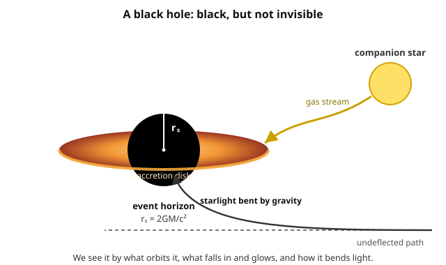

# Astrophysics · Lesson 4.3: Black holes in astrophysics

> ⏱ ~15 min · Module 4: Compact objects · Builds on: [4.1 White dwarfs and the Chandrasekhar mass](#/lesson/astrophysics/04-01-white-dwarfs-chandrasekhar.md), [4.2 Neutron stars and pulsars](#/lesson/astrophysics/04-02-neutron-stars-pulsars.md), [1.4 Gravitational dynamics](#/lesson/astrophysics/01-04-gravitational-dynamics-virial.md) · Unlocks: 4.4 Accretion, 4.5 Gravitational waves and mergers

## Why this matters

White dwarfs and neutron stars work by finding *something* — electron then neutron degeneracy pressure — that pushes back hard enough to halt gravity. In [4.1](#/lesson/astrophysics/04-01-white-dwarfs-chandrasekhar.md) and [4.2](#/lesson/astrophysics/04-02-neutron-stars-pulsars.md) you watched each of those braces reach a mass limit and buckle. Black holes are what you get when the last brace fails: a stellar core above the neutron-star limit has *nothing left* to hold it up, and it collapses without end. The remarkable part is not that this is exotic but that it is **common and simple** — black holes seed the center of nearly every galaxy, and a fully formed one is described by just two numbers: its mass and its spin. This lesson treats them not as relativity puzzles but as astrophysical objects: how big they are, and how you find something that emits no light.

## The idea

Escape velocity grows as you pile on mass or shrink the object. A rocket leaves Earth at $11\ \mathrm{km/s}$; leave the surface of a white dwarf and you need a few thousand $\mathrm{km/s}$; a neutron star demands a good fraction of the speed of light. Keep compressing mass into a smaller radius and there is a point where the escape velocity reaches $c$ itself. Past that point *nothing* — not even light — moves fast enough to climb out. That surface is the **event horizon**, and its radius is the **Schwarzschild radius** $r_s$. Inside it, all paths lead inward; the collapse of the core continues to a singularity we cannot see and this course won't dwell on.

The crucial physical fact: a horizon is not a wall you'd feel. It is simply the last place from which a signal can still reach the outside. Cross it and, for a big enough black hole, you'd notice nothing locally at the moment of crossing. The black hole announces itself only *indirectly*: by the orbits of stars swinging around unseen mass, by gas heating up as it spirals in and blazing in X-rays, by the silhouette it casts on that glow, and by the ripples in spacetime when two of them collide.

## The formal version

**The Schwarzschild radius (Newtonian heuristic).** Escape velocity from mass $M$ at radius $r$ comes from setting kinetic energy equal to the depth of the gravitational well, $\tfrac{1}{2}mv_{\rm esc}^2 = GMm/r$, giving $v_{\rm esc} = \sqrt{2GM/r}$. Demand that even light cannot escape — set $v_{\rm esc} = c$ — and solve for the radius:

$$c^2 = \frac{2GM}{r} \quad\Longrightarrow\quad r_s = \frac{2GM}{c^2}.$$

In words: cram mass $M$ inside the radius $r_s = 2GM/c^2$ and its escape speed hits the speed of light, so light can no longer leave. Here $G = 6.674\times10^{-11}\ \mathrm{N\,m^2/kg^2}$ is Newton's constant and $c = 3.00\times10^8\ \mathrm{m/s}$. This derivation is a **cheat** — light has no mass, and Newtonian energy conservation has no business applying to photons near $c$. Yet the full general-relativity treatment (the Schwarzschild solution of Einstein's equations, developed in the [`relativity`](#/course/relativity) course) gives *exactly* this radius, factor of 2 and all, for the event horizon. The heuristic lands on the right answer for the wrong reasons — a happy accident worth remembering. A handy form:

$$r_s = 2.95\ \mathrm{km}\times\frac{M}{M_\odot}.$$

**Two families by mass.** Black holes come in (at least) two well-populated size classes:

- **Stellar-mass** ($\sim 3$–$100\ M_\odot$): the collapsed cores of massive stars ([3.4 stellar death](#/lesson/astrophysics/03-04-stellar-death-supernovae.md)), and the merger products of two smaller ones. Their horizons are city-sized (kilometers).
- **Supermassive** ($10^6$–$10^{10}\ M_\odot$): lurking in galactic nuclei, one per galaxy essentially. Our own Milky Way hosts **Sgr A\*** at its center, about $4\times10^6\ M_\odot$ — you'll meet it again in [5.2 The Milky Way](#/lesson/astrophysics/05-02-milky-way.md). How they grew so massive so early is an open problem.

(A sparse "intermediate-mass" class, $10^2$–$10^5\ M_\odot$, is the subject of ongoing hunts.)

**The no-hair idea and spin.** General relativity says a stationary black hole is fully characterized by just **mass** $M$, **angular momentum** $J$ (spin), and electric charge $Q$ — and astrophysical black holes are neutral, so *mass and spin alone*. Every other detail of what fell in — the kind of star, its composition, its magnetic field — is erased. This is the "**no-hair**" statement: black holes have no distinguishing features ("hair") beyond these numbers. A spinning black hole is described by the **Kerr** solution rather than the non-spinning **Schwarzschild** one; spin drags spacetime around with it and shrinks the horizon, and it is a reservoir of extractable energy that helps power the jets of [4.4 accretion](#/lesson/astrophysics/04-04-accretion.md). We won't compute Kerr geometry here — just hold onto the punchline: *a black hole is the simplest macroscopic object in nature.*

**How you detect the invisible.** Four handles, in rough order of directness:

1. **Orbital dynamics.** Watch stars or gas orbit an unseen mass and apply Kepler ([1.4](#/lesson/astrophysics/01-04-gravitational-dynamics-virial.md)). Tracking individual stars whipping around Sgr A\* over decades weighs it at $4\times10^6\ M_\odot$ packed inside their tightest approach — far too dense to be anything but a black hole.
2. **Accretion luminosity.** Infalling gas releases its gravitational energy as heat and light before crossing the horizon — the engine of X-ray binaries and quasars, taken up in [4.4](#/lesson/astrophysics/04-04-accretion.md).
3. **The shadow.** The **Event Horizon Telescope** imaged the dark silhouette of the horizon against the glowing accretion flow around M87\* and Sgr A\* — light bending (as sketched below) wraps the bright ring around a central shadow of size a few $r_s$.
4. **Gravitational waves.** Two black holes spiralling together radiate ripples in spacetime that LIGO now hears directly — the subject of [4.5](#/lesson/astrophysics/04-05-gravitational-waves-mergers.md).

**The Eddington luminosity.** Accretion can only shine so bright. The radiation streaming out pushes on the very gas trying to fall in; past some luminosity, that push overwhelms gravity and the fuel supply is blown away. The balance point is the **Eddington luminosity**

$$L_{\rm Edd} = \frac{4\pi G M m_p c}{\sigma_T} \approx 1.26\times10^{31}\ \mathrm{W}\times\frac{M}{M_\odot},$$

where $m_p = 1.673\times10^{-27}\ \mathrm{kg}$ is the proton mass and $\sigma_T = 6.65\times10^{-29}\ \mathrm{m^2}$ is the Thomson cross-section (how effectively a free electron intercepts radiation). In words: $L_{\rm Edd}$ is the steady luminosity at which outward radiation pressure exactly balances inward gravity on the accreting gas — a natural *maximum* brightness that scales with mass ($\propto M$). Because a black hole radiating at $L_{\rm Edd}$ can swallow mass only so fast, this also caps its **growth rate**, which is why building the first billion-solar-mass quasars in the young universe is a genuine puzzle. You'll derive $L_{\rm Edd}$ in Problem 2.

## Picture

The horizon (radius $r_s = 2GM/c^2$) is genuinely black. Everything we *see* is around it: gas torn from a companion spirals into a disk and heats up, a passing star's light bends measurably as it skirts the strong-gravity region, and — not drawn — companion stars trace orbits that betray the central mass. "Detecting a black hole" always means detecting its effect on something visible.

## Worked examples

**Example 1 (mechanical — how small is a horizon?).** Take a stellar-mass black hole of $M = 10\ M_\odot$. Using the shortcut,

$$r_s = 2.95\ \mathrm{km}\times 10 = 29.5\ \mathrm{km}.$$

The entire event horizon fits inside a mid-sized city — ten Suns' worth of mass with a horizon smaller than a neutron star's radius. Now scale up to Sgr A\* at $4\times10^6\ M_\odot$: $r_s = 2.95\ \mathrm{km}\times4\times10^6 = 1.18\times10^{7}\ \mathrm{km} = 1.18\times10^{10}\ \mathrm{m} \approx 0.079\ \mathrm{AU}$. That is only about $17\ R_\odot$ — the whole horizon of a four-million-solar-mass object would sit comfortably inside Mercury's orbit ($0.39$ AU). Black holes are *tiny* for their mass; that is exactly why they are so dense and so hard to resolve.

**Example 2 (why you'd care — reading a quasar's mass off its glow).** A distant quasar shines at $L = 5\times10^{39}\ \mathrm{W}$ ($\approx 1.3\times10^{13}\ L_\odot$, taking $L_\odot = 3.83\times10^{26}\ \mathrm{W}$). If it radiates near its Eddington limit — as many luminous quasars do — then $L \approx L_{\rm Edd} = 1.26\times10^{31}\,(M/M_\odot)\ \mathrm{W}$, so

$$\frac{M}{M_\odot} \approx \frac{5\times10^{39}}{1.26\times10^{31}} = 4.0\times10^{8}.$$

A single brightness measurement, plus the physics of the Eddington limit, delivers a $\sim\!4\times10^8\ M_\odot$ black hole — no orbit-tracking required. This is a workhorse method for weighing the supermassive black holes powering [active galactic nuclei](#/lesson/astrophysics/05-04-galaxy-formation-agn.md) across cosmic time. (The catch: it assumes the source is *at* the Eddington limit, so it's an estimate, not a scale reading.)

## Watch out

- You might think the singularity is the black hole. Astrophysically, the object *is* its horizon — a region of size $r_s$ from which nothing escapes. What's inside is causally sealed off; all observable properties live at or outside the horizon.
- You might think crossing the horizon is a violent event. For a large black hole it is locally uneventful — no wall, no flash. The horizon is a *global* feature (the boundary of what can signal outward), not a local one; you could pass it without any local instrument registering the moment.
- You might think a black hole "sucks things in" more strongly than an ordinary mass. At a distance it doesn't — replace the Sun with a $1\ M_\odot$ black hole and Earth's orbit is unchanged, because the external field depends only on $M$. Black holes are extreme only *up close*, where you can get far nearer the mass than any star would let you.
- You might think the Newtonian escape-velocity derivation of $r_s$ is rigorous. It isn't — it misapplies Newtonian mechanics to light. It gets the right number by luck; trust it as a mnemonic, not a proof. The real justification is the Schwarzschild metric.

## One-liner

> A black hole is mass crammed inside its own escape-velocity-equals-$c$ radius $r_s = 2GM/c^2$ — invisible itself, but betrayed by the orbits it commands, the gas it heats (up to the Eddington limit), and the light it bends.

## Problems

**P1 (🟢)** Compute the Schwarzschild radius $r_s = 2GM/c^2$ for (a) the Sun ($1\ M_\odot$), (b) Sgr A\* ($4\times10^6\ M_\odot$), and (c) the Earth ($M_\oplus = 5.97\times10^{24}\ \mathrm{kg}$). For each, compare $r_s$ to the object's actual physical size ($R_\odot = 6.96\times10^{8}\ \mathrm{m}$, $R_\oplus = 6.37\times10^{6}\ \mathrm{m}$). Use $M_\odot = 1.99\times10^{30}\ \mathrm{kg}$.

**P2 (🟡)** Derive the Eddington luminosity by force balance. Consider fully ionized hydrogen accreting onto a black hole of mass $M$. A free electron at radius $r$ scatters the outgoing radiation with Thomson cross-section $\sigma_T$; the radiation carries momentum, so it exerts an outward force on the electron. Gravity pulls inward mainly on the proton (mass $m_p \gg m_e$), and electrostatic attraction locks each electron to a proton so they move as a pair. (a) Write the outward radiation force on one electron in terms of the luminosity $L$, using that the radiation *momentum* flux is $1/c$ times its *energy* flux. (b) Write the inward gravitational force on the electron–proton pair. (c) Set them equal and solve for the luminosity at which they balance. (d) Evaluate $L_{\rm Edd}$ for $M = 10^8\ M_\odot$ and express it in solar luminosities.

**P3 (🔴, optional)** *Spaghettification.* The tidal (stretching) acceleration across a radial length $\Delta r$ at distance $r$ from mass $M$ is $\Delta a = \dfrac{2GM}{r^3}\,\Delta r$. Take a $\Delta r = 2\ \mathrm{m}$ human falling feet-first. (a) Show that *evaluated at the horizon* $r = r_s$, the tidal acceleration is $\Delta a = \dfrac{c^6}{4G^2 M^2}\,\Delta r$, and note how it scales with $M$. (b) Evaluate it at the horizon of a stellar-mass black hole ($M = 10\ M_\odot$) and of a supermassive one ($M = 10^8\ M_\odot$). (c) Explain why you would be torn apart long before reaching the small black hole's horizon, yet could cross the supermassive one's horizon unharmed.

Solutions

**P1** Use $r_s = 2GM/c^2$ with $2G/c^2 = 2(6.674\times10^{-11})/(3.00\times10^8)^2 = 1.335\times10^{-10}/8.99\times10^{16} = 1.484\times10^{-27}\ \mathrm{m/kg}$, i.e. the shortcut $r_s = 2.95\ \mathrm{km}\times(M/M_\odot)$.

(a) **Sun:** $r_s = 2.95\ \mathrm{km}$. Full check: $r_s = 1.484\times10^{-27}\times1.99\times10^{30} = 2.95\times10^{3}\ \mathrm{m}$. ✓ Compare to $R_\odot = 6.96\times10^{8}\ \mathrm{m}$: the ratio is $R_\odot/r_s \approx 2.4\times10^{5}$. To become a black hole the Sun would have to be squeezed from $700{,}000\ \mathrm{km}$ down to $3\ \mathrm{km}$.

(b) **Sgr A\*:** $r_s = 2.95\ \mathrm{km}\times4\times10^{6} = 1.18\times10^{7}\ \mathrm{km} = 1.18\times10^{10}\ \mathrm{m}$. That's $0.079\ \mathrm{AU} \approx 17\ R_\odot$ — smaller than Mercury's orbit, despite four million solar masses.

(c) **Earth:** $r_s = 1.484\times10^{-27}\times5.97\times10^{24} = 8.86\times10^{-3}\ \mathrm{m} \approx 8.9\ \mathrm{mm}$. Compare to $R_\oplus = 6.37\times10^{6}\ \mathrm{m}$: ratio $\approx 7\times10^{8}$. The whole Earth would have to collapse to under a centimeter — a marble. The lesson: horizons are absurdly small; only nature's densest collapses reach them.

**P2** (a) The radiation flux at radius $r$ from a source of luminosity $L$ is $F = L/(4\pi r^2)$ (energy per area per time). The momentum flux is $F/c$. An electron intercepts area $\sigma_T$, so it absorbs momentum at rate — i.e. feels a force —

$$F_{\rm rad} = \sigma_T\,\frac{F}{c} = \frac{\sigma_T L}{4\pi r^2 c}.$$

(b) Gravity on the pair (mass $\approx m_p$, since $m_e$ is negligible):

$$F_{\rm grav} = \frac{G M m_p}{r^2}.$$

(c) Set $F_{\rm rad} = F_{\rm grav}$. The $r^2$ cancels — the balance is independent of radius, because both forces fall as $1/r^2$:

$$\frac{\sigma_T L}{4\pi r^2 c} = \frac{G M m_p}{r^2} \quad\Longrightarrow\quad L_{\rm Edd} = \frac{4\pi G M m_p c}{\sigma_T}.$$

(d) For $M = 10^8\ M_\odot = 1.99\times10^{38}\ \mathrm{kg}$:

$$L_{\rm Edd} = \frac{4\pi(6.674\times10^{-11})(1.99\times10^{38})(1.673\times10^{-27})(3.00\times10^{8})}{6.65\times10^{-29}}.$$

Numerator: $4\pi(6.674\times10^{-11}) = 8.39\times10^{-10}$; $\times1.99\times10^{38} = 1.67\times10^{29}$; $\times1.673\times10^{-27} = 279$; $\times3.00\times10^{8} = 8.38\times10^{10}$. Divide by $6.65\times10^{-29}$:

$$L_{\rm Edd} \approx 1.26\times10^{39}\ \mathrm{W}.$$

(Consistent with the shortcut $1.26\times10^{31}\times10^{8}$.) In solar units, $L_{\rm Edd}/L_\odot = 1.26\times10^{39}/3.83\times10^{26} \approx 3.3\times10^{12}\ L_\odot$ — a trillion Suns, the luminosity of a bright quasar.

**P3** (a) At $r = r_s = 2GM/c^2$:

$$\Delta a = \frac{2GM}{r_s^3}\,\Delta r = \frac{2GM}{\left(2GM/c^2\right)^3}\,\Delta r = \frac{2GM\,c^6}{8\,G^3M^3}\,\Delta r = \frac{c^6}{4\,G^2 M^2}\,\Delta r.$$

So at the horizon $\Delta a \propto 1/M^2$: **the bigger the black hole, the gentler the tide at its horizon.** (Physically: tidal field at fixed $r$ scales as $M/r^3$, but the horizon itself sits at $r_s\propto M$, so evaluating there gives $M/M^3 = 1/M^2$.)

(b) With $\Delta r = 2\ \mathrm{m}$, $c^6 = (3.00\times10^8)^6 = 7.29\times10^{50}$, $G^2 = 4.45\times10^{-21}$:

- **Stellar-mass, $M = 10\ M_\odot = 1.99\times10^{31}\ \mathrm{kg}$:** $4G^2M^2 = 4(4.45\times10^{-21})(3.96\times10^{62}) = 7.05\times10^{42}$. So $\Delta a = (7.29\times10^{50}/7.05\times10^{42})\times2 \approx 2.1\times10^{8}\ \mathrm{m/s^2}$ — about $2\times10^{7}\,g$ across your body.
- **Supermassive, $M = 10^8\ M_\odot = 1.99\times10^{38}\ \mathrm{kg}$:** scaling by $(10/10^8)^2 = 10^{-14}$ gives $\Delta a \approx 2.1\times10^{8}\times10^{-14} = 2.1\times10^{-6}\ \mathrm{m/s^2}$ — micro-$g$, utterly imperceptible.

(c) The stretching acceleration between your head and feet at the stellar-mass horizon is ${\sim}10^{7}$ times Earth gravity — you're pulled apart ("spaghettified") long *before* you reach it, since the tide already exceeds what tissue can bear well outside $r_s$. At the supermassive horizon the same head-to-foot difference is a millionth of a $\mathrm{m/s^2}$, so you sail across the horizon feeling nothing — the point where you can no longer escape passes without any local sign. Two black holes, identical in kind, opposite in experience, purely because the horizon of the big one sits so far from the mass that spacetime is only gently curved there.

## Flashback

**From Lesson 1.4 (Gravitational dynamics):** A star is observed orbiting the unseen mass at the Galactic center on an ellipse with semi-major axis $a = 1000\ \mathrm{AU}$ and period $P = 16\ \mathrm{yr}$. Treating the central mass $M$ as far larger than the star's, use Kepler's third law to find $M$ in solar masses — and comment on why the answer forces a black hole. (Recall the convenient form: with $a$ in AU, $P$ in years, and $M$ in $M_\odot$, $\ P^2 = a^3/M$.)

Solution

Kepler's third law in solar units gives $M = a^3/P^2$ directly:

$$M = \frac{a^3}{P^2} = \frac{(1000)^3}{(16)^2} = \frac{10^{9}}{256} \approx 3.9\times10^{6}\ M_\odot.$$

Nearly four million solar masses — and the star's closest approach carries it *inside* $a$, so all of that mass sits within a region smaller than $\sim1000\ \mathrm{AU}$ across. No cluster of stars or gas could be that dense without collapsing or shining; the only object that packs $4\times10^6\ M_\odot$ into so small a volume and stays dark is a black hole. This is exactly how Sgr A\* was weighed. (Reassuringly, its Schwarzschild radius from Problem 1, $\sim0.08\ \mathrm{AU}$, is far smaller still — the star never comes close to the horizon.)

## Connections

- **Backward:** this is the end of the sequence begun in [4.1](#/lesson/astrophysics/04-01-white-dwarfs-chandrasekhar.md) and [4.2](#/lesson/astrophysics/04-02-neutron-stars-pulsars.md) — each degeneracy brace (electron, then neutron) has a mass limit, and above the neutron-star (TOV) limit *nothing* halts collapse. The Eddington argument reuses Thomson scattering and the fact that radiation carries momentum $E/c$, the same radiation pressure you met with the Poynting flux in [`em-refresher` 4.3](#/lesson/em-refresher/04-03-energy-poynting.md). Weighing Sgr A\* is Kepler's third law from [1.4](#/lesson/astrophysics/01-04-gravitational-dynamics-virial.md).
- **Forward:** [4.4 Accretion](#/lesson/astrophysics/04-04-accretion.md) turns the "accretion luminosity" handle into a real energy budget (why infalling gas is such an efficient light source), with the Eddington limit as its ceiling; [4.5 Gravitational waves](#/lesson/astrophysics/04-05-gravitational-waves-mergers.md) hears black holes merge. The supermassive ones return in [5.2 The Milky Way](#/lesson/astrophysics/05-02-milky-way.md) and [5.4 active galactic nuclei](#/lesson/astrophysics/05-04-galaxy-formation-agn.md), where black hole and host galaxy grow together.
- **Sideways:** the event horizon, Schwarzschild radius, Kerr spin, and the no-hair theorem are all results of general relativity — developed properly in the [`relativity`](#/course/relativity) course. Here we've used only their astrophysical shadows. The "escape velocity $= c$" heuristic landing on the exact GR radius is a recurring theme: Newtonian gravity is often a startlingly good guide to strong-field results, right up until it isn't.
