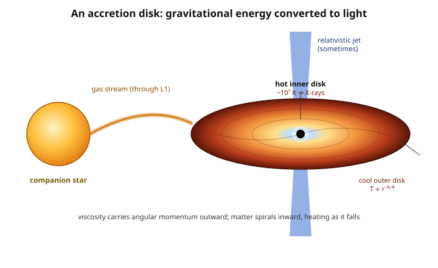

# Astrophysics · Lesson 4.4: Accretion

> ⏱ ~15 min · Module 4: Compact objects · Builds on: [4.1 White dwarfs & Chandrasekhar](#/lesson/astrophysics/04-01-white-dwarfs-chandrasekhar.md), [4.2 Neutron stars & pulsars](#/lesson/astrophysics/04-02-neutron-stars-pulsars.md), [4.3 Black holes in astrophysics](#/lesson/astrophysics/04-03-black-holes-astrophysics.md), [mechanics 4.2 Angular momentum](#/lesson/mechanics-refresher/04-02-angular-momentum.md) · Unlocks: 4.5 Gravitational-wave mergers; 5.4 AGN & quasars

## Why this matters

Compact objects are, by themselves, nearly invisible: a black hole emits nothing, a cold neutron star is a 20-km speck. Yet the most luminous *persistent* sources in the universe — quasars outshining their entire host galaxy — are powered by black holes. The resolution is **accretion**: matter falling onto a compact object converts gravitational potential energy into heat and light with staggering efficiency. It is, kilogram for kilogram, *the most efficient steady power source known* — more than ten times better than the hydrogen fusion that runs the stars. Master the energy budget here and you can read the engine behind X-ray binaries, cataclysmic variables, and the quasars that let us see the early universe.

## The idea

Drop a rock onto a planet and it arrives moving fast — the deeper the well, the harder it hits. Gravitational potential energy $\sim GMm/R$ converts to kinetic energy on the way down, and when the rock stops, that energy becomes heat. Now make the well absurdly deep: a neutron star packs $1.4\,M_\odot$ into a 10-km radius, so a single kilogram falling in releases roughly a *fifth of its rest-mass energy* $mc^2$. Fusion, by contrast, releases only $0.7\%$ of rest mass. **Falling into a compact object beats burning by a factor of thirty.**

But infalling gas almost never falls *straight in*. It carries **angular momentum** (from [mechanics 4.2](#/lesson/mechanics-refresher/04-02-angular-momentum.md)), and angular momentum is conserved — so the gas can't just plunge to the center any more than Earth can fall into the Sun. Instead it settles into a spinning **accretion disk**, orbiting. To actually accrete, a gas parcel must *shed* its angular momentum. Internal friction (viscosity) does this: it slowly ferries angular momentum *outward* through the disk while matter drifts *inward*, and the frictional heating radiates the released gravitational energy away. The disk is a machine that grinds orbital energy into light, hottest where the well is deepest — the inner edge — which is why these things glow in X-rays.

## The formal version

**The accretion energy budget.** A mass $m$ falling from far away to radius $R$ of an object of mass $M$ releases gravitational potential energy
$$\Delta E = \frac{GMm}{R}.$$
Write this as a fraction of the rest-mass energy $mc^2$ to define the **radiative efficiency** $\eta$:
$$\boxed{\;L = \eta\,\dot m\,c^2, \qquad \eta = \frac{GM}{Rc^2}.\;}$$
Here $\dot m$ is the **mass accretion rate** (kg/s) and $L$ the luminosity. In words: *every kilogram you feed in yields $\eta c^2$ joules of light, and $\eta$ is just the depth of the gravitational well measured in units of $c^2$.* For a neutron star $\eta \approx 0.2$; for the innermost stable orbit around a black hole general relativity gives $\eta \approx 0.06$–$0.4$. Either way $\eta \sim 0.1$ — compare hydrogen fusion's $\eta_{\text{fus}} \approx 0.007$. **Accretion onto a compact object is more than $10\times$ more efficient than fusion.** (Note $\eta = GM/Rc^2 = \tfrac{1}{2}R_s/R$ with $R_s = 2GM/c^2$ the Schwarzschild radius of [4.3](#/lesson/astrophysics/04-03-black-holes-astrophysics.md): efficiency is high precisely when the object is close to being a black hole.)

**Why a disk, and the temperature profile.** Angular momentum forbids radial free-fall, so gas circularizes into a thin disk. As viscosity lets a ring drift inward from $r$ to $r-dr$, it releases $GM\dot m\,dr/r^2$; half of that goes into the deeper orbit's kinetic energy and half is radiated locally (the [virial split from 1.4](#/lesson/astrophysics/01-04-gravitational-dynamics-virial.md)). Setting the local dissipation equal to blackbody emission $\sigma T^4$ from the annulus gives, away from the inner edge,
$$T(r) \propto r^{-3/4},$$
so the disk is hottest at its inner rim. Here $\sigma = 5.67\times10^{-8}\ \mathrm{W\,m^{-2}\,K^{-4}}$ is the Stefan–Boltzmann constant. In words: *the inner disk radiates the deepest, most tightly bound orbits, so it is the hottest and bluest part.* For a stellar-mass accretor the inner disk reaches $\sim 10^7$ K — thermal X-rays. (The inner-disk temperature scales as $T_{\rm in}\propto M^{-1/4}$, so a supermassive black hole's disk is cooler, peaking in the UV.)

**The Eddington limit (recap from 4.3).** Radiation pushes back on the infalling gas via electron (Thomson) scattering. When the outward radiation force balances gravity, accretion chokes itself off. This caps the luminosity at
$$L_{\rm Edd} = \frac{4\pi G M m_p c}{\sigma_T} \approx 1.26\times10^{31}\ \Big(\frac{M}{M_\odot}\Big)\ \mathrm{W} \approx 3.3\times10^{4}\,\frac{M}{M_\odot}\,L_\odot,$$
with $m_p$ the proton mass and $\sigma_T = 6.65\times10^{-29}\ \mathrm{m^2}$ the Thomson cross-section. In words: *a given mass can only shine so brightly before its own radiation blows the fuel away* — and since $L_{\rm Edd}\propto M$, this also caps the growth rate, forcing an accreting black hole to grow no faster than **exponentially**.

**Where we see it.** Three flavors, same physics, different accretor:
- **Cataclysmic variables** — a **white dwarf** accreting from a companion; shallow-ish well, optical/UV, occasional thermonuclear flashes (novae).
- **X-ray binaries** — a **neutron star or black hole** plus a companion star feeding it; the deep well makes the inner disk an X-ray beacon.
- **Active galactic nuclei / quasars** — a **supermassive black hole** ($10^6$–$10^{10}\,M_\odot$) accreting at the center of a galaxy; the most luminous persistent objects in the universe (forward link: [5.4 AGN](#/lesson/astrophysics/05-04-galaxy-formation-agn.md)).

## Picture

The color gradient *is* the temperature profile $T\propto r^{-3/4}$: white-blue and X-ray-hot at the inner rim by the compact object, fading to cool red at the edge. The companion star overflows its gravitational lobe, sending a gas stream through the balance point (L1) into the disk. Viscosity then does the slow work — angular momentum out, matter in, gravity into light.

## Worked examples

**Example 1 (mechanical — efficiency of a neutron-star accretor).** Take $M = 1.4\,M_\odot = 2.78\times10^{30}$ kg and $R = 10$ km $= 10^4$ m. Estimate first: the well is deep, so expect tens of percent. Now compute:
$$\eta = \frac{GM}{Rc^2} = \frac{(6.67\times10^{-11})(2.78\times10^{30})}{(10^4)(9.0\times10^{16})} = \frac{1.86\times10^{20}}{9.0\times10^{20}} \approx 0.21.$$
So $\eta \approx 0.2$ — **about $20\%$ of the rest-mass energy** is liberated per kilogram accreted. Against fusion's $0.7\%$, that is a factor of $\sim 30$. Every gram a neutron star swallows outshines the same gram burned in a star.

**Example 2 (why you'd care — powering a bright X-ray binary).** How much mass must a neutron star swallow to shine at $L = 10^{31}$ W ($\approx 2.6\times10^4\,L_\odot$, a bright X-ray binary)? Invert $L = \eta\dot m c^2$ with $\eta = 0.2$:
$$\dot m = \frac{L}{\eta c^2} = \frac{10^{31}}{(0.2)(9.0\times10^{16})} = 5.6\times10^{14}\ \mathrm{kg/s}.$$
That is only $\sim 1.8\times10^{22}$ kg/yr $\approx 3\times10^{-9}\,M_\odot$/yr — a few billionths of a solar mass per year, roughly a small asteroid every second, sustains an X-ray beacon. *Efficiency is why so little fuel does so much.*

## Watch out

- **You might think all of $GMm/R$ comes out as light — but for a disk only about half does.** A gas parcel reaching the inner edge is still *orbiting*, carrying kinetic energy equal to half the potential energy released (virial theorem). So the disk's radiative efficiency is $\eta \approx \tfrac{1}{2}GM/Rc^2$; Example 1's $0.2$ is the full-well figure, and the effective radiative $\eta$ is nearer $0.1$. For a *black hole* there is no surface, so what's radiated is fixed by the innermost stable circular orbit — general relativity, not a hard floor.
- **You might think angular momentum is a detail — it is the whole reason a disk exists.** Without it, gas would plunge radially and light up only on impact. Conservation of angular momentum forbids the plunge and forces the slow, luminous, viscous spiral. No angular momentum transport, no steady accretion light.
- **You might think a black hole can be made arbitrarily bright by feeding it harder — the Eddington limit says no.** Push past $L_{\rm Edd}$ and radiation pressure ejects the fuel. This is a *luminosity* cap set by $M$ alone, and because $L\propto\dot m$, it is also a growth-rate cap.

## One-liner

> Dropping matter into a deep gravitational well releases $\sim 0.1\,mc^2$ as light — ten times fusion — but angular momentum makes it spiral in through a hot viscous disk rather than plunge, and radiation pressure (Eddington) caps how bright, and how fast, the engine can run.

## Problems

**P1 (🟢)** Compute the accretion efficiency $\eta = GM/(Rc^2)$ for a neutron star with $M = 1.4\,M_\odot$ and $R = 10$ km, and express the result as a multiple of the $0.7\%$ efficiency of hydrogen fusion. ($M_\odot = 1.99\times10^{30}$ kg, $G = 6.67\times10^{-11}$ SI, $c = 3.0\times10^8$ m/s.)

**P2 (🟡)** A quasar shines at $L = 10^{13}\,L_\odot$ ($L_\odot = 3.83\times10^{26}$ W). Using $L = \eta\dot m c^2$ with $\eta = 0.1$, find the mass accretion rate $\dot m$ in $M_\odot$ per year. (1 yr $= 3.16\times10^7$ s.)

**P3 (🔴, optional)** Suppose the quasar of P2 radiates *at* the Eddington limit, $L = L_{\rm Edd} \approx 1.26\times10^{31}(M/M_\odot)$ W. (a) Estimate the black-hole mass $M$. (b) Since $\dot M \propto L_{\rm Edd} \propto M$, Eddington-limited growth is exponential, $M(t) = M_0\,e^{t/\tau}$ with $e$-folding ("Salpeter") time $\tau = \eta\,\sigma_T c/(4\pi G m_p) \approx 4.5\times10^7$ yr for $\eta = 0.1$. Starting from a $100\,M_\odot$ stellar seed, roughly how long to reach the mass from (a), and why is that a puzzle?

Solutions

**P1** With $M = 1.4\times1.99\times10^{30} = 2.79\times10^{30}$ kg, $R = 10^4$ m, $c^2 = 9.0\times10^{16}\ \mathrm{m^2/s^2}$:
$$\eta = \frac{GM}{Rc^2} = \frac{(6.67\times10^{-11})(2.79\times10^{30})}{(10^4)(9.0\times10^{16})} = \frac{1.86\times10^{20}}{9.0\times10^{20}} = 0.207 \approx 0.21.$$
As a multiple of fusion: $\eta/\eta_{\text{fus}} = 0.207/0.007 \approx 30$. **Accretion onto a neutron star is about 30 times more efficient than hydrogen fusion** — the headline of the lesson, made numerical.

**P2** Luminosity in watts: $L = 10^{13}\times3.83\times10^{26} = 3.83\times10^{39}$ W. Then
$$\dot m = \frac{L}{\eta c^2} = \frac{3.83\times10^{39}}{(0.1)(9.0\times10^{16})} = \frac{3.83\times10^{39}}{9.0\times10^{15}} = 4.26\times10^{23}\ \mathrm{kg/s}.$$
Per year: $\dot m = 4.26\times10^{23}\times3.16\times10^7 = 1.35\times10^{31}$ kg/yr. In solar masses:
$$\dot m = \frac{1.35\times10^{31}}{1.99\times10^{30}} \approx 6.8\ M_\odot/\mathrm{yr}.$$
So a quasar devours **roughly 7 solar masses of gas every year** — a few Suns annually, sustained for millions of years. That prodigious appetite (and the fuel supply feeding it) is why quasars fade as their host galaxies run low on cold gas.

**P3** (a) Set $L = L_{\rm Edd}$: with $L = 3.83\times10^{39}$ W,
$$\frac{M}{M_\odot} = \frac{L}{1.26\times10^{31}\ \mathrm{W}} = \frac{3.83\times10^{39}}{1.26\times10^{31}} \approx 3.0\times10^{8}.$$
So $M \approx 3\times10^{8}\,M_\odot$ — a few hundred million solar masses, a bona fide supermassive black hole.

(b) Growth factor from a $100\,M_\odot$ seed: $3\times10^8/100 = 3\times10^6$, so the number of $e$-foldings is $\ln(3\times10^6) \approx 15$. Time:
$$t \approx 15\,\tau = 15\times4.5\times10^7\ \mathrm{yr} \approx 7\times10^8\ \mathrm{yr} \approx 0.7\ \mathrm{Gyr}.$$
**The puzzle:** quasars this massive are observed at redshift $z\gtrsim7$, when the universe was younger than $\sim0.8$ Gyr — barely enough time, if the hole accreted at the Eddington limit *continuously* from a stellar-mass seed with no interruption. Real accretion is episodic and often sub-Eddington, which only makes it harder. This is the "early supermassive black hole" problem, and it drives ideas like massive "direct-collapse" seeds ($10^4$–$10^5\,M_\odot$), brief super-Eddington episodes, and mergers — the growth of these engines is an active frontier tied to [galaxy formation (5.4)](#/lesson/astrophysics/05-04-galaxy-formation-agn.md).

## Flashback

**From Lesson 4.3 (Black holes in astrophysics):** For the $M \approx 3\times10^{8}\,M_\odot$ black hole you found in P3, compute its Schwarzschild radius $R_s = 2GM/c^2$, and compare it to a familiar solar-system distance. ($1\ \mathrm{AU} = 1.50\times10^{11}$ m.)

Solution

With $M = 3\times10^8\times1.99\times10^{30} = 5.97\times10^{38}$ kg:
$$R_s = \frac{2GM}{c^2} = \frac{2(6.67\times10^{-11})(5.97\times10^{38})}{9.0\times10^{16}} = \frac{7.96\times10^{28}}{9.0\times10^{16}} = 8.9\times10^{11}\ \mathrm{m}.$$
In AU: $R_s = 8.9\times10^{11}/1.50\times10^{11} \approx 5.9$ AU — **about the radius of Jupiter's orbit**. The engine that outshines a whole galaxy has an event horizon that would fit comfortably inside the inner solar system, and the light-emitting inner disk is only a few times larger. That extreme compactness is exactly why $\eta = \tfrac12 R_s/R$ is large and accretion is so efficient.

## Connections

- **Backward:** the energy source is the gravitational potential well of [4.1](#/lesson/astrophysics/04-01-white-dwarfs-chandrasekhar.md)–[4.3](#/lesson/astrophysics/04-03-black-holes-astrophysics.md); the ban on radial free-fall is conservation of **angular momentum** from [mechanics 4.2](#/lesson/mechanics-refresher/04-02-angular-momentum.md) and the orbital picture of [mechanics 5.2](#/lesson/mechanics-refresher/05-02-orbits-effective-potential.md). The factor-of-two in the disk's efficiency is the [virial theorem from 1.4](#/lesson/astrophysics/01-04-gravitational-dynamics-virial.md); the inner disk's glow is the [blackbody law of 1.2](#/lesson/astrophysics/01-02-blackbody-spectra-hr-diagram.md), $L = 4\pi R^2\sigma T^4$, applied annulus by annulus. The Eddington limit is the radiation-pressure balance recapped from [4.3](#/lesson/astrophysics/04-03-black-holes-astrophysics.md).
- **Forward:** the same compact binaries that accrete are the ones that eventually spiral together and radiate [gravitational waves (4.5)](#/lesson/astrophysics/04-05-gravitational-waves-mergers.md); accretion onto supermassive black holes is the AGN/quasar engine of [5.4](#/lesson/astrophysics/05-04-galaxy-formation-agn.md), and the exponential Eddington growth here is what black-hole/galaxy co-evolution must explain.
- **Sideways:** the outward angular-momentum transport that lets matter fall inward is the same principle that shapes protoplanetary disks and planetary rings; the radiation-pressure force capping accretion is the photon momentum flux from the [em-refresher Poynting/energy lesson](#/lesson/em-refresher/04-03-energy-poynting.md).
