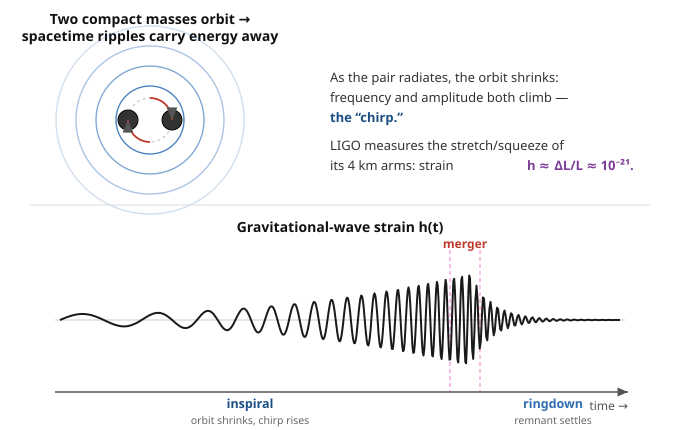

# Astrophysics · Lesson 4.5: Gravitational waves and mergers

> ⏱ ~15 min · Module 4: Compact objects · Builds on: [4.3 Black holes in astrophysics](#/lesson/astrophysics/04-03-black-holes-astrophysics.md), [4.2 Neutron stars & pulsars](#/lesson/astrophysics/04-02-neutron-stars-pulsars.md), [4.4 Accretion](#/lesson/astrophysics/04-04-accretion.md), and the general-relativity theory of [gravitational waves](#/course/relativity) · Unlocks: Module 5 (galaxies & the interstellar medium)

## Why this matters

For all of history, astronomy meant *light* — photons, from radio to gamma rays. But black holes emit no light, and the deep interior of a merging neutron star is opaque. In September 2015, humanity opened a second channel: we *heard* two black holes collide by feeling the spacetime around us stretch and squeeze. This is not a metaphor. General relativity says mass tells spacetime how to curve, and an *accelerating* mass launches ripples in that curvature that travel outward at the speed of light. A pair of black holes, otherwise perfectly dark, becomes the loudest thing in the universe in this new sense — releasing, in its final second, more power than all the stars in the observable universe combined. This lesson is where the compact objects of this whole module (white dwarfs, neutron stars, black holes) stop being static endpoints and start *colliding* — and where we get a probe that reaches places light cannot.

## The idea

Shake an electric charge and it radiates electromagnetic waves — that's how antennas work. Shake a *mass* and, general relativity insists, it radiates **gravitational waves**: ripples in the geometry of spacetime itself. As a ripple passes, it alternately stretches space in one direction and squeezes it in the perpendicular direction — a passing wave literally changes the *distances* between things.

But there's a crucial difference from light. Electric charge comes in two signs, so you can build an oscillating **dipole** — separate + from − and wiggle them — and dipole radiation is the dominant, easy way for charges to radiate. Mass has only one sign. You cannot separate positive mass from negative mass, and two deeper conservation laws forbid the simplest radiation patterns entirely: total mass is conserved (no "monopole" radiation, no pulsing sphere), and total momentum is conserved (no "dipole" radiation either). The *lowest* allowed pattern is the **quadrupole** — a mass distribution that changes shape, like a spinning dumbbell or a squashing-and-stretching blob. Gravitational radiation is intrinsically weak and quadrupolar, which is exactly why it took a century and a 4-kilometer instrument to detect.

The best quadrupole nature builds is a **compact binary**: two neutron stars or two black holes orbiting each other. A spinning pair is a rotating dumbbell — a perfect changing quadrupole. It radiates gravitational-wave energy, and that energy is stolen from the orbit, so the two bodies spiral *inward*. As the orbit tightens, they whirl faster and the waves get louder — the frequency and amplitude both sweep upward into a **chirp**, ending in a violent merger. Catch that chirp and you can read off the masses and the distance to the collision.

## The formal version

**Strain.** A gravitational wave is measured by the dimensionless **strain**

$$h \equiv \frac{\Delta L}{L},$$

the fractional change it produces in the distance $L$ between two free test masses ($\Delta L$ is the change). In words: strain is "how much a passing wave stretches a ruler, as a fraction of the ruler's length." At Earth, from astrophysical sources, $h \sim 10^{-21}$ — the number that sets the entire experimental challenge.

**The quadrupole formula (stated, from general relativity).** The gravitational-wave luminosity of a source is set by the *third* time derivative of its mass quadrupole moment $Q$:

$$L_{\rm GW} \sim \frac{G}{c^5}\,\big(\dddot{Q}\big)^2 .$$

In words: you radiate only if the *shape* of your mass distribution is changing, and changing non-uniformly — a steadily spinning sphere (constant $Q$) emits nothing; a spinning dumbbell (oscillating $Q$) emits. The prefactor $G/c^5$ is astronomically tiny, which is why gravitational radiation is feeble unless masses are huge, dense, and moving near light speed — i.e. compact-object binaries. (This is developed properly in the [relativity course](#/course/relativity); here we use the result.)

**The chirp mass.** For a binary of masses $m_1, m_2$, the shape of the inspiral chirp — how fast the frequency sweeps up — depends on a specific combination called the **chirp mass**:

$$\mathcal{M} = \frac{(m_1 m_2)^{3/5}}{(m_1+m_2)^{1/5}}.$$

In words: $\mathcal{M}$ is *the* number the inspiral hands you directly, because the rate of frequency increase $\dot f$ is fixed by $\mathcal{M}$ alone. The *amplitude* of the wave then fixes the distance (a known intrinsic loudness plus an observed loudness gives an inverse-square distance — a "standard siren," the gravitational analog of a standard candle from [1.1](#/lesson/astrophysics/01-01-scales-luminosity-distance-ladder.md), and one that needs no distance-ladder calibration).

**The three phases.** A merger signal has a universal three-act structure:
- **Inspiral** — the two bodies orbit and slowly spiral in; frequency and amplitude rise (the chirp). Well described by orbital mechanics plus energy loss.
- **Merger** — they touch and coalesce; the strongest, most nonlinear burst, requiring full numerical relativity to model.
- **Ringdown** — the newly formed single black hole "rings" like a struck bell at its characteristic frequencies, damping away as it settles to a smooth Kerr black hole. The ringdown frequency encodes the final mass and spin.

## Picture

Top: two compact masses orbit and radiate ripples that carry orbital energy away, so the orbit shrinks. Bottom: the strain $h(t)$ LIGO records — a chirp of rising frequency and amplitude (**inspiral**), a peak (**merger**), and a fast-damping oscillation (**ringdown**) as the remnant settles.

## Worked examples

**Example 1 (mechanical — reading the chirp).** Why does "frequency rises" follow from "orbit shrinks"? For a circular orbit, Kepler's third law from [mechanics-refresher](#/lesson/mechanics-refresher/05-01-gravitation-kepler.md) gives orbital angular frequency $\omega_{\rm orb}^2 = G(m_1+m_2)/a^3$, where $a$ is the separation. Gravitational waves carry energy away, so the orbit's energy $E = -Gm_1m_2/2a$ becomes *more negative* — meaning $a$ *shrinks*. A smaller $a$ means a larger $\omega_{\rm orb}$, hence a higher orbital frequency; and because the quadrupole flips twice per orbit, the wave comes out at $f_{\rm GW} = 2 f_{\rm orb}$. So as the binary loses energy, $a\downarrow \Rightarrow f\uparrow$ — and the closer they get, the *faster* they lose energy, so $f$ sweeps up ever more steeply. That runaway upsweep is the chirp, and its steepening is what pins down $\mathcal{M}$.

**Example 2 (why you'd care — GW150914 and GW170817).** Two landmark detections show what this buys us.

*GW150914* (14 Sep 2015, the first-ever detection, Nobel Prize 2017): two black holes of roughly $36\,M_\odot$ and $29\,M_\odot$ merged $\sim 1.3$ billion light-years away into a $\sim 62\,M_\odot$ black hole. The missing $\sim 3\,M_\odot$ was radiated *as gravitational waves* in a few tenths of a second — $E = mc^2$ with $m \approx 3 M_\odot$, an unimaginable power. These black holes emitted no light whatsoever; the *only* way to know this collision happened was to feel the strain. Gravitational-wave astronomy is the first tool that sees black holes directly.

*GW170817* (17 Aug 2017): two *neutron* stars merged $\sim 130$ million light-years away. This time the merger was seen in gravitational waves **and** in light — a gamma-ray burst $\sim 1.7$ s later, then an optical/infrared glow that faded over days. That glow was a **kilonova**: the decay of freshly forged heavy nuclei. Neutron-star matter, flung out and decompressed, is the ideal site for the rapid-neutron-capture (**r-process**) that builds gold, platinum, and the heaviest elements — exactly the nucleosynthesis channel introduced in [3.3](#/lesson/astrophysics/03-03-nucleosynthesis-elements.md). GW170817 caught the universe making gold in real time. Seeing one event in *both* gravitational waves and electromagnetic light is **multi-messenger astronomy** — each messenger tells you what the other cannot.

## Watch out

- You might think gravitational waves are waves *of* gravity moving *through* space, like sound through air. They are ripples *of* space — the metric itself oscillates; there is no medium. What waves is the geometry that defines distance.
- You might expect gravitational radiation to work like a dipole antenna. It can't: mass conservation kills monopole radiation and momentum conservation kills dipole radiation, so the leading term is the quadrupole (Problem 2). This is *why* gravitational waves are so much weaker than the electromagnetic waves a comparable charge distribution would emit.
- You might think a spinning object always radiates gravitational waves. A perfectly axisymmetric spinning body (a smooth top) has a *constant* quadrupole moment and emits nothing. You need a *changing* quadrupole — a lopsided or shape-shifting mass, like a binary or a bumpy neutron star.
- You might read $h\sim 10^{-21}$ as a small energy. It's a fractional *length* change. Over LIGO's 4 km arms it is a displacement thousands of times smaller than a proton — the sensitivity, not the energy, is the miracle (Problem 1).

## One-liner

> Accelerating masses ring spacetime like a bell, but only as a quadrupole — so the loudest sources are inspiraling compact binaries, whose chirp we now feel as a $10^{-21}$ stretch of a 4-km ruler.

## Problems

**P1 (🟢)** LIGO's arms are $L = 4$ km long. What absolute length change $\Delta L$ corresponds to a strain $h = 10^{-21}$? Compare it to the size of a proton ($\approx 10^{-15}$ m) — what fraction of a proton's width is it? (This is the measurement LIGO actually makes.)

**P2 (🟡)** Explain *from conservation laws* why the leading gravitational radiation is quadrupole, not monopole or dipole, and why electromagnetism is different. Specifically: (a) what conserved quantity forbids monopole radiation? (b) what conserved quantity forbids mass-dipole radiation? (c) why does an electric dipole radiate freely despite the electromagnetic analog of (b)?

**P3 (🔴, optional)** In GW170817 the gravitational waves and the gamma rays both traveled $D \approx 130$ million light-years and arrived within $\Delta t \approx 1.7$ s of each other (gamma rays slightly later). Assuming they were emitted at essentially the same moment, bound the fractional difference between the speed of gravity $c_g$ and the speed of light $c$, i.e. estimate $|c_g - c|/c$. Then explain in one or two sentences why this was a landmark constraint on theories of gravity and dark energy. (Take 1 year $\approx 3.16\times10^{7}$ s.)

Solutions

**P1** By definition $h = \Delta L / L$, so
$$\Delta L = h\,L = 10^{-21}\times 4000\ \text{m} = 4\times10^{-18}\ \text{m}.$$
Compared to a proton ($\approx 10^{-15}$ m):
$$\frac{\Delta L}{r_{\rm proton}} = \frac{4\times10^{-18}}{10^{-15}} = 4\times10^{-3} \approx \frac{1}{250}.$$
LIGO measures its arm length change to about **a few thousandths of the width of a proton** — roughly one part in $10^{21}$. This is why it needs kilometer-scale arms (bigger $L$ gives bigger $\Delta L$ for fixed $h$), Fabry–Pérot cavities that bounce the laser hundreds of times to multiply the effective path, and extraordinary vibration isolation. The strain is fixed by the astrophysics; the *displacement* is what the interferometer fights to resolve.

**P2** (a) **Mass conservation forbids monopole radiation.** The "monopole moment" of a mass distribution is just its total mass $M$. Radiation requires a time-varying moment, but $M = \text{const}$, so $\dot M = 0$: no monopole (spherically pulsing) gravitational radiation. (In EM the analog is total charge $Q$, also conserved — so EM has no monopole radiation either.)

(b) **Momentum conservation forbids mass-dipole radiation.** The mass dipole moment is $\mathbf{d} = \sum_i m_i \mathbf{r}_i = M\mathbf{R}_{\rm cm}$. Its first time derivative is $\dot{\mathbf d} = \sum_i m_i \dot{\mathbf r}_i = \mathbf{P}$, the total momentum — conserved for an isolated system. So $\ddot{\mathbf d} = \dot{\mathbf P} = 0$, and dipole radiation (which needs $\ddot{\mathbf d}\neq 0$) vanishes. The first nonzero radiating moment is therefore the **quadrupole** (the second moment of the mass distribution), whose time derivatives are not protected by any conservation law.

(c) **Electric dipoles radiate because charge has two signs.** The electric dipole moment is $\mathbf{d}_E = \sum_i q_i \mathbf{r}_i$. Its second derivative is $\ddot{\mathbf d}_E = \sum_i q_i \ddot{\mathbf r}_i$ — and there is *no* conservation law setting this to zero, precisely because $q_i$ can be positive or negative, so $\sum q_i \mathbf{r}_i$ is not proportional to the (conserved) center-of-mass momentum. Positive and negative charges can accelerate oppositely, producing an oscillating dipole. Mass, having a single sign, is rigidly tied to momentum conservation and cannot. Hence gravity's leading channel is the intrinsically weaker quadrupole.

**P3** Travel time of light over the distance:
$$T = \frac{D}{c} = 130\times10^{6}\ \text{yr} = 1.30\times10^{8}\times 3.16\times10^{7}\ \text{s} \approx 4.1\times10^{15}\ \text{s}.$$
If both signals left at the same instant but arrived $\Delta t$ apart, their speeds differ fractionally by at most
$$\frac{|c_g - c|}{c} \lesssim \frac{\Delta t}{T} = \frac{1.7\ \text{s}}{4.1\times10^{15}\ \text{s}} \approx 4\times10^{-16}.$$
So the speed of gravity equals the speed of light to better than **one part in $10^{15}$** — a stunning bound from a single event, made possible only because the baseline $T$ is enormous. (The published analysis, allowing for a modest astrophysical delay between the two emissions, quotes a range of order $-3\times10^{-15}$ to $+7\times10^{-16}$; our simultaneous-emission estimate lands right in that band.)

*Significance:* many modified-gravity theories — proposed to explain cosmic acceleration without a cosmological constant (some scalar–tensor / Horndeski models, massive-graviton scenarios) — predicted gravitational waves propagating at a speed measurably different from $c$. GW170817 ruled out a large class of them overnight, and it confirms the graviton is massless (or extraordinarily light) and that gravity travels at $c$ exactly as general relativity requires. One 1.7-second coincidence pruned the theory space of gravity and dark energy.

## Flashback

**From Lesson 4.3 (Black holes in astrophysics):** The heavier black hole in GW150914 had mass $M \approx 36\,M_\odot$. Compute its Schwarzschild radius $R_s = 2GM/c^2$, and use it to estimate the gravitational-wave frequency near merger — roughly the orbital frequency when the two horizons are about to touch, at separation $a \approx 2R_s$ of the combined $\sim 65\,M_\odot$ system. Does it land in LIGO's audible band (tens to hundreds of Hz)? (Use $G = 6.67\times10^{-11}$ SI, $c = 3\times10^{8}$ m/s, $M_\odot = 2\times10^{30}$ kg.)

Solution

Schwarzschild radius of the $36\,M_\odot$ hole:
$$R_s = \frac{2GM}{c^2} = \frac{2(6.67\times10^{-11})(36\times 2\times10^{30})}{(3\times10^8)^2} = \frac{2(6.67\times10^{-11})(7.2\times10^{31})}{9\times10^{16}} \approx 1.1\times10^{5}\ \text{m}\approx 105\ \text{km}.$$
(A 36-solar-mass black hole is about the size of a city.)

Now estimate the merger frequency. Take the *total* mass $M_{\rm tot}\approx 65\,M_\odot = 1.3\times10^{32}$ kg, whose combined Schwarzschild radius is $R_{s,\rm tot} = 2GM_{\rm tot}/c^2 \approx 1.9\times10^{5}$ m. Set the orbital separation to $a \approx 2R_{s,\rm tot}\approx 3.8\times10^{5}$ m (horizons about to touch). Kepler:
$$\omega_{\rm orb} = \sqrt{\frac{GM_{\rm tot}}{a^3}} = \sqrt{\frac{(6.67\times10^{-11})(1.3\times10^{32})}{(3.8\times10^{5})^3}} = \sqrt{\frac{8.7\times10^{21}}{5.5\times10^{16}}} \approx \sqrt{1.6\times10^{5}} \approx 400\ \text{rad/s}.$$
So $f_{\rm orb} = \omega_{\rm orb}/2\pi \approx 63$ Hz, and the wave (twice the orbital frequency) is $f_{\rm GW} = 2f_{\rm orb} \approx 130$ Hz.

That is squarely in LIGO's most sensitive band (tens to a few hundred Hz) — which is exactly why stellar-mass black-hole mergers are LIGO's bread and butter, and why the GW150914 chirp swept up through a couple hundred Hz in its final moments. The physics is beautifully self-consistent: the horizon scale $R_s\propto M$ sets both the size and the merger frequency, and for tens-of-solar-mass holes that frequency falls in the human audible range — you can literally play the chirp as a sound.

## Connections

- **Backward:** the sources are the compact objects of this whole module — black holes ([4.3](#/lesson/astrophysics/04-03-black-holes-astrophysics.md)) and neutron stars ([4.2](#/lesson/astrophysics/04-02-neutron-stars-pulsars.md)); the inspiral is [mechanics-refresher](#/lesson/mechanics-refresher/05-02-orbits-effective-potential.md)'s two-body orbit bleeding energy, and GW170817's kilonova is the r-process nucleosynthesis of [3.3](#/lesson/astrophysics/03-03-nucleosynthesis-elements.md) caught live. The first indirect proof came decades earlier from the **Hulse–Taylor binary pulsar** (PSR B1913+16, Nobel 1993): its orbital period shrinks year by year in *exact* agreement with the energy that general relativity says gravitational waves must carry off — the pulsar timing of [4.2](#/lesson/astrophysics/04-02-neutron-stars-pulsars.md) turned into a gravitational-wave detector a generation before LIGO.
- **Forward:** standard sirens ([1.1](#/lesson/astrophysics/01-01-scales-luminosity-distance-ladder.md)'s distance problem, solved without the ladder) give an independent measurement of the Hubble constant, feeding the cosmology of Module 6; and gravitational-wave catalogs are becoming a census of the black-hole and neutron-star populations that Module 5's stellar populations produce.
- **Sideways (relativity):** the entire theoretical apparatus — the wave equation for the metric perturbation, the quadrupole formula, the ringdown's black-hole "normal modes" — lives in the [relativity course](#/course/relativity). Astrophysics supplies the sources and reads the data; relativity supplies the equation the data obey. This is the module where "black holes are real objects" and "spacetime is dynamical" finally meet in a measurement.
