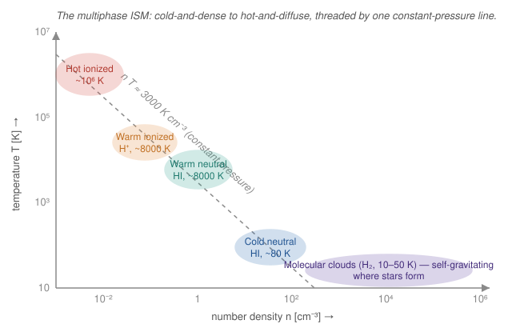

# Astrophysics · Lesson 5.1: The interstellar medium

> ⏱ ~15 min · Module 5: Galaxies and the interstellar medium · Builds on: [3.1 Star formation and the Jeans mass](#/lesson/astrophysics/03-01-star-formation-jeans.md), [3.4 Stellar death: white dwarfs, supernovae](#/lesson/astrophysics/03-04-stellar-death-supernovae.md), [1.3 Radiative transfer and spectral lines](#/lesson/astrophysics/01-03-radiative-transfer-spectral-lines.md) · Unlocks: 5.2 The Milky Way

## Why this matters

A galaxy is not a fixed collection of stars — it is an *engine* that turns gas into stars and hands the exhaust back. The fuel tank, the exhaust pipe, and the recycling plant are all the same thing: the **interstellar medium (ISM)**, the thin gas and dust filling the space between the stars. Every star was condensed out of it, and every star that dies enriches and stirs it. The ISM is only ~10–15% of the Milky Way's baryonic mass, yet it *regulates* the whole show — how fast stars form, what they're made of, and whether the galaxy keeps shining or runs dry. This lesson is where "stars" becomes "a galaxy."

## The idea

Point a telescope between the stars and you are looking through a near-perfect vacuum: on average about **one atom per cubic centimeter**, emptier than anything a laboratory can make. But a galaxy is enormous, and one atom per cm³ stacked across thousands of light-years adds up to billions of solar masses of gas.

That gas is not uniform. Like water — which is ice, liquid, or steam depending on conditions — the ISM lives in distinct **phases**, and they coexist in rough **pressure equilibrium**. The key move: the phases all sit at about the same pressure, and pressure is $P = n k_B T$ (number density times temperature). So a phase that is *hot* must be *diffuse*, and a phase that is *cold* must be *dense* — hot-and-thin balances cold-and-thick against the same push. That single trade-off organizes the whole ISM into a diagonal from cold molecular clouds to million-degree bubbles.

Mixed into the gas is a trace of **dust** — microscopic solid grains, about 1% of the mass. Tiny as it is, dust is why the band of the Milky Way has dark rifts running through it: grains absorb and scatter starlight, reddening and dimming everything behind them. And the whole system **cycles**: molecular clouds collapse into stars, stars blow winds and explode as supernovae that heat and stir the gas and seed it with new elements, and the enriched gas cools back down into the next generation of clouds. The ISM is the galaxy's metabolism.

## The formal version

**The phases.** Heating and cooling settle interstellar gas into a few stable states, held near a common pressure $P/k_B = nT \sim$ a few thousand $\text{K}\,\text{cm}^{-3}$:

| Phase | $T$ (K) | $n$ (cm⁻³) | State | Traced by |
|---|---|---|---|---|
| Molecular clouds | 10–50 | $10^2$–$10^6$ | H₂ | CO radio lines |
| Cold neutral medium (CNM) | ~80 | ~30 | HI | 21-cm absorption |
| Warm neutral medium (WNM) | ~8000 | ~0.5 | HI | 21-cm emission |
| Warm ionized medium (WIM) | ~8000 | ~0.1 | H⁺ | Hα, dispersion |
| Hot ionized medium (HIM) | ~$10^6$ | ~0.004 | H⁺ | X-rays, O VI |

In words: five rough phases, from cold dense molecular gas (where stars are born) to million-degree gas blown by supernovae, all near the same pressure so that cold means dense and hot means diffuse. Molecular clouds are the exception — they are self-gravitating and *over*-pressured, which is exactly why they collapse ([3.1](#/lesson/astrophysics/03-01-star-formation-jeans.md)).

**The 21-cm line.** Neutral atomic hydrogen (HI) is invisible in the optical, but it broadcasts a radio beacon at $\lambda = 21\ \text{cm}$. This is the **hyperfine spin-flip transition**: the proton and electron each carry spin, and the state with their spins parallel sits a tiny $5.9\ \mu\text{eV}$ above the antiparallel state. A spontaneous flip releases that energy as a 21-cm photon. In words: it is the same spin degree of freedom from the [quantum-mechanics spin / Pauli / Stern–Gerlach lesson](#/lesson/quantum-mechanics/04-05-spin-pauli-stern-gerlach.md), now written across the whole Galaxy. The transition is fiercely forbidden (an atom waits ~11 million years to flip), but there is *so much* HI that it lights up brightly — and because radio penetrates dust, 21-cm maps the atomic gas throughout the entire disk, the workhorse tracer of galactic structure and rotation (lesson [5.3](#/lesson/astrophysics/05-03-galaxies-dark-matter.md)).

**Dust.** Grains ~0.01–1 μm across, roughly 1% of the ISM mass, do three jobs far out of proportion to that mass:
- **Extinction and reddening.** They absorb and scatter starlight, more efficiently at short (blue) wavelengths, so background stars are dimmed and reddened — the dark lanes of the Milky Way are dust, not empty space.
- **Reprocessing.** Absorbed UV/optical energy re-emerges as far-infrared thermal radiation ($T \sim 20$ K dust), so dust converts starlight into the infrared glow of a galaxy.
- **Catalysis.** Grain surfaces are where two H atoms meet and combine into H₂ — molecular clouds could not form efficiently without them.

**Heating and cooling.** What sets a phase is the balance of energy in and out. **Heating:** starlight (the photoelectric effect knocking electrons off dust grains), cosmic rays, photoionization by hot stars, and shocks from supernovae. **Cooling:** line emission — atoms and ions collisionally excited, then radiating away the energy in spectral lines (e.g. C II at 158 μm, forbidden oxygen lines) — plus molecular lines (CO) and thermal dust emission. Where heating equals cooling, gas is stable; the arithmetic famously allows *two* stable phases (cold dense and warm diffuse) at the same pressure, which is why the CNM and WNM coexist.

**HII regions (emission nebulae).** A hot O or B star pours out photons above $13.6\ \text{eV}$ that ionize the hydrogen around it. Ionized protons and electrons recombine, cascade down the energy levels, and glow in **recombination lines** — most visibly **Hα** at 656 nm, the $n=3\to2$ transition of hydrogen ([QM hydrogen atom](#/lesson/quantum-mechanics/04-04-hydrogen-atom.md)), the red of the Orion Nebula. The ionized bubble grows until ionizations balance recombinations — the **Strömgren sphere** — of radius
$$R_S = \left(\frac{3Q}{4\pi\, n^2\, \alpha}\right)^{1/3},$$
where $Q$ is the star's ionizing-photon output (photons s⁻¹), $n$ the gas density, and $\alpha \approx 2.6\times10^{-13}\ \text{cm}^3\,\text{s}^{-1}$ the recombination coefficient. In words: the harder the star ionizes and the thinner the gas, the bigger the glowing bubble.

**The baryon cycle.** Clouds form stars; massive stars enrich the gas with heavy elements and inject energy through winds and supernovae ([3.4](#/lesson/astrophysics/03-04-stellar-death-supernovae.md)); this **feedback** heats and stirs the ISM (it *makes* the hot phase), disperses the parent cloud, and drives the gas back into circulation to cool and form the next generation. The ISM is the buffer that meters this cycle — the galaxy's regulator.

## Picture

Read it as a map of the trade-off. The dashed diagonal is a line of **constant pressure** $nT \approx 3000\ \text{K}\,\text{cm}^{-3}$: the CNM, WNM, and HIM all sit near it, so moving from hot-and-diffuse (upper left) to cold-and-dense (lower right) *keeps the pressure fixed*. Molecular clouds fall below-right of the line — they are held together by their own gravity, not pressure balance, which is precisely why they collapse into stars.

## Worked examples

**Example 1 (mechanical — coexistence by pressure).** How can $80$-K cold clouds sit right next to million-degree gas without one crushing the other? Because pressure, not temperature, is what must match. Compute $P/k_B = nT$ for each:
$$\text{CNM:}\quad nT = (30)(80) = 2400\ \text{K}\,\text{cm}^{-3},\qquad \text{HIM:}\quad nT = (0.004)(10^6) = 4000\ \text{K}\,\text{cm}^{-3}.$$
Within a factor of two — mechanical balance. The cold phase is $10^4$ times cooler but $\sim10^4$ times denser, so it pushes just as hard. That is the entire logic of the phase diagram: coexisting phases share a pressure, and $n$ and $T$ slide inversely along the diagonal.

**Example 2 (why you'd care — sizing an HII region).** An O star emits $Q \approx 10^{49}$ ionizing photons per second into gas of density $n \approx 10^3\ \text{cm}^{-3}$. How big is the glowing nebula it carves? Use the Strömgren radius:
$$R_S^3 = \frac{3Q}{4\pi n^2 \alpha} = \frac{3(10^{49})}{4\pi (10^3)^2 (2.6\times10^{-13})} = \frac{3\times10^{49}}{3.27\times10^{-6}} = 9.2\times10^{54}\ \text{cm}^3,$$
$$R_S = (9.2\times10^{54})^{1/3} = 2.1\times10^{18}\ \text{cm} = \frac{2.1\times10^{18}}{3.09\times10^{18}}\approx 0.68\ \text{pc}.$$
A single hot star ionizes a bubble roughly two-thirds of a parsec across, glowing red in Hα — visible across the Galaxy as a signpost of recent, massive star formation. Watch how much physics you read off one number: the *presence* of an HII region tells you an O/B star (lifetime only a few million years) formed here *recently*, so this is an active star-forming region right now.

## Watch out

- **You might think interstellar space is essentially empty — actually it holds billions of solar masses.** At ~1 atom/cm³ the ISM is emptier than the best laboratory vacuum, yet integrated over a galaxy-sized volume it is a colossal reservoir. "Low density" and "small mass" are not the same thing when the volume is astronomical.
- **You might think dust dominates the ISM because it dominates what you see — it's only ~1% by mass.** Grains punch above their weight: they are efficient absorbers and scatterers at optical wavelengths, so a trace of dust can black out the light of everything behind it. Extinction measures dust *opacity*, not dust *quantity*.
- **You might think the phases are separate regions of the galaxy — they are intertwined and near a common pressure.** A single sightline threads cold clumps, warm diffuse gas, and hot bubbles. And do not confuse where gas *is* with where stars *form*: stars are born only in the cold, dense **molecular** phase, never in the hot ionized gas that supernovae produce.

## One-liner

> The interstellar medium is the galaxy's metabolism — a multiphase gas held near constant pressure (so cold means dense and hot means diffuse), laced with dust, that forms stars from its cold molecular clouds and is heated, enriched, and recycled by their deaths.

## Problems

**P1 (🟢)** The mean density of the ISM is about $n \approx 1$ atom cm⁻³. (a) Express this in SI units (m⁻³). (b) A very good laboratory ultra-high vacuum reaches $n \sim 10^{4}\ \text{cm}^{-3}$. How does the *average* ISM compare? (c) A dense molecular cloud has $n \sim 10^{4}\ \text{cm}^{-3}$. How many times denser than the ISM average is it — and is it still an excellent vacuum by earthly standards?

**P2 (🟡)** Dust extinction dims a background star by 3 magnitudes. (a) By what factor is its observed flux reduced? (b) Explain why this biases optical surveys of the Galactic *plane*, and what wavelengths you would switch to. (Recall $m = -2.5\log_{10}(F/F_0)$.)

**P3 (🔴, optional)** The Milky Way holds roughly $10^{10}\,M_\odot$ of stars, built over about $10\ \text{Gyr}$. (a) Estimate the average star-formation rate (SFR) needed to make them, and compare to the observed $\sim1$–$3\,M_\odot\,\text{yr}^{-1}$. (b) The current gas reservoir is only $M_\text{gas}\sim5\times10^{9}\,M_\odot$. Compute the *depletion time* $M_\text{gas}/\text{SFR}$ and compare it to the Galaxy's age. What must be true for the Galaxy to still be forming stars today?

Solutions

**P1** (a) $1\ \text{cm}^{-3} = 1\ \text{cm}^{-3} \times (10^{2}\ \text{cm/m})^{3} = 10^{6}\ \text{m}^{-3}$. One atom per cubic centimeter is a million per cubic meter — still fantastically empty.

(b) The best lab ultra-high vacuum, $\sim10^{4}\ \text{cm}^{-3}$, is about **$10^{4}$ times denser** than the average ISM. Astonishingly, interstellar space is a *better* vacuum than anything we routinely engineer on Earth.

(c) A molecular cloud at $10^{4}\ \text{cm}^{-3}$ is $10^{4}/1 = \mathbf{10^{4}}$ **times denser** than the ISM average — the densest common phase. Yet $10^{4}$ atoms/cm³ is comparable to a good laboratory vacuum and vastly emptier than air ($\sim2.5\times10^{19}\ \text{cm}^{-3}$): even the "dense" star-forming gas is, by earthly standards, an excellent vacuum. Density spans ~4 orders of magnitude across the ISM, but every phase is a vacuum.

**P2** (a) Magnitudes are logarithmic in flux: a difference $\Delta m = 3$ corresponds to a flux ratio
$$\frac{F}{F_0} = 10^{-\Delta m/2.5} = 10^{-3/2.5} = 10^{-1.2} \approx 0.063.$$
The flux is cut to about **6.3% of its true value — a factor of ~16 dimming**.

(b) Dust is concentrated in the thin Galactic disk, so sightlines *through the plane* suffer the heaviest extinction. Distant and intrinsically faint objects behind the dust drop below the survey limit and are missed entirely — the so-called **"zone of avoidance"** where optical catalogs of background galaxies go blank along the Milky Way. Extinction also reddens sources, corrupting color-based selection. The fix is to observe at **longer wavelengths — infrared and radio — where dust is nearly transparent** (extinction falls steeply with wavelength), which is exactly why 21-cm and IR surveys map the plane that optical surveys cannot.

**P3** (a) Averaged over the build-up,
$$\text{SFR} \sim \frac{10^{10}\,M_\odot}{10^{10}\ \text{yr}} = 1\ M_\odot\,\text{yr}^{-1}.$$
This sits right at the low end of the observed $1$–$3\,M_\odot\,\text{yr}^{-1}$ — the Milky Way has been forming stars at roughly one Sun's worth per year for its whole life, and still is. Consistent, and reassuringly close to steady state.

(b) Depletion time:
$$t_\text{dep} = \frac{M_\text{gas}}{\text{SFR}} \sim \frac{5\times10^{9}\,M_\odot}{2\,M_\odot\,\text{yr}^{-1}} \approx 2.5\times10^{9}\ \text{yr} = 2.5\ \text{Gyr}.$$
That is **far shorter than the Galaxy's ~10 Gyr age**: at today's rate the current gas would have been exhausted several times over. Since the Galaxy is manifestly still forming stars, its gas must be **replenished and recycled**: dying stars return a large fraction (~30–50%) of their mass to the ISM through winds and supernovae, and fresh gas keeps **accreting** onto the disk from the halo and intergalactic medium. The ISM is not a tank being drained but a **flow-through reservoir** — the baryon cycle in action, which is the whole point of this lesson.

## Flashback

**From Lesson 1.2 (Blackbody radiation):** Interstellar dust grains warmed by starlight sit at about $T \approx 20\ \text{K}$ and radiate as (approximate) blackbodies. Use Wien's law, $\lambda_\text{peak} T = b$ with $b = 2.9\times10^{-3}\ \text{m·K}$, to find the wavelength at which a dust cloud glows brightest. What band of the spectrum is that, and why does it mean dust surveys are done from infrared telescopes?

Solution

$$\lambda_\text{peak} = \frac{b}{T} = \frac{2.9\times10^{-3}\ \text{m·K}}{20\ \text{K}} = 1.45\times10^{-4}\ \text{m} = 145\ \mu\text{m}.$$
That is the **far-infrared**. Cold dust absorbs starlight (UV/optical) and re-emits it as a far-IR blackbody peaking near 100–200 μm — invisible to optical telescopes and blocked by Earth's atmosphere, which is why dust and the star formation buried in it are mapped by space-based far-IR observatories. This is the "reprocessing" job of dust made quantitative: it is a thermostat that converts starlight into the far-infrared glow of a galaxy.

## Connections

- **Backward:** the cold molecular clouds here are the raw input to [3.1 Star formation](#/lesson/astrophysics/03-01-star-formation-jeans.md) — where the Jeans criterion decides which clumps collapse; dust extinction is the optical-depth machinery of [1.3 Radiative transfer](#/lesson/astrophysics/01-03-radiative-transfer-spectral-lines.md); and dust's infrared glow is the blackbody law of [1.2](#/lesson/astrophysics/01-02-blackbody-spectra-hr-diagram.md), rooted in the [stat-mech photon gas](#/lesson/stat-mech/04-03-photon-gas-blackbody.md). Pressure balance $P = nk_BT$ is just the ideal-gas law from [stat-mech](#/lesson/stat-mech/01-05-ideal-gas-sackur-tetrode.md) governing a galaxy.
- **Forward:** the ISM structure and its 21-cm map of gas kinematics set up [5.2 The Milky Way](#/lesson/astrophysics/05-02-milky-way.md) and become the tracer of rotation curves and dark matter in [5.3](#/lesson/astrophysics/05-03-galaxies-dark-matter.md). The chemical enrichment cycle here connects back to primordial abundances from [Big Bang nucleosynthesis](#/lesson/astrophysics/06-02-thermal-history-bbn.md).
- **Sideways (quantum bridges):** the 21-cm line is the electron–proton **hyperfine spin coupling** of [QM 4.5 (spin, Pauli, Stern–Gerlach)](#/lesson/quantum-mechanics/04-05-spin-pauli-stern-gerlach.md) written galaxy-wide; the Hα glow of HII regions is the [hydrogen atom's](#/lesson/quantum-mechanics/04-04-hydrogen-atom.md) $n=3\to2$ line; and the collisionally excited cooling lines that set the phase temperatures are radiative transitions governed by [Fermi's golden rule](#/lesson/quantum-mechanics/06-06-fermi-golden-rule-radiation.md). Three different corners of quantum mechanics, all read off the gas between the stars.
