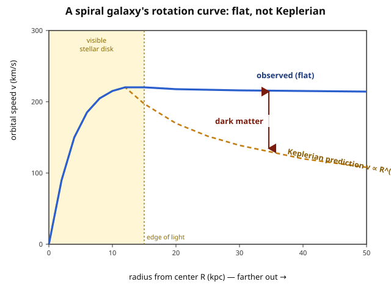

# Astrophysics · Lesson 5.3: Galaxies and dark matter

> ⏱ ~15 min · Module 5: Galaxies and the interstellar medium · Builds on: [5.2 The Milky Way](#/lesson/astrophysics/05-02-milky-way.md), [1.4 Gravitational dynamics & the virial theorem](#/lesson/astrophysics/01-04-gravitational-dynamics-virial.md), [mechanics 5.2 Orbits & the effective potential](#/lesson/mechanics-refresher/05-02-orbits-effective-potential.md) · Unlocks: [5.4 Galaxy formation & AGN](#/lesson/astrophysics/05-04-galaxy-formation-agn.md), and the cosmology of Module 6 (structure formation, the CMB)

## Why this matters

Point a radio telescope at a spiral galaxy and measure how fast its gas orbits at every radius. Freshman mechanics makes a hard prediction: past the bright edge of the disk, where you've already counted all the stars, the orbital speed should **fall off** as $v\propto R^{-1/2}$ — the same $1/\sqrt{R}$ that makes Neptune crawl while Mercury races. It doesn't. The curve goes **flat** and stays flat, thousands of light-years past the last visible star. Something with mass is out there, and it emits no light. That single measurement — repeated for galaxy after galaxy by Vera Rubin and Kent Ford in the 1970s — is the cleanest evidence that most of the matter in the universe is **dark**: it pulls, but it does not shine. This lesson is the galactic half of the case (the cluster half was [1.4](#/lesson/astrophysics/01-04-gravitational-dynamics-virial.md)'s Zwicky estimate, Boss Problem 1); together they are why cosmology's budget reads *27% dark matter, 5% ordinary*.

## The idea

First, the zoo. Galaxies come in a few basic body plans:

- **Spirals** (like the Milky Way, [5.2](#/lesson/astrophysics/05-02-milky-way.md)): a thin rotating **disk** of gas and stars wound into spiral arms, plus a central **bulge**. The disk is still forming stars, so it's blue and full of gas and dust. Rotation-supported — the disk holds itself up by *spinning*.
- **Ellipticals**: featureless red-orange blobs of old stars, gas-poor and no longer forming stars. Their stars move on randomly oriented orbits, so the galaxy is held up by **pressure** (velocity dispersion), not rotation — the stellar analogue of a hot gas cloud, exactly the virial-theorem picture of [1.4](#/lesson/astrophysics/01-04-gravitational-dynamics-virial.md).
- **Irregulars**: small, gas-rich, disorganized — often dwarfs, often distorted by a larger neighbor's gravity.

Edwin Hubble arranged these on his **tuning-fork diagram** ("the Hubble sequence"): ellipticals E0–E7 by roundness on the handle, spirals splitting into normal and barred prongs. It's a morphological classification, not an evolutionary track — the old label "early- vs late-type" is a historical misnomer, not a claim about age.

Now the shock. To weigh a galaxy you can't put it on a scale — you watch how fast things orbit inside it, because gravity is the only force that cares about *all* the mass, luminous or not. Compare that dynamical mass to the mass you'd infer from the starlight, and for spirals the two disagree by a factor of five to ten. The orbits demand far more mass than the stars can supply, and the extra mass is arranged in a huge, roughly spherical **halo** extending well beyond the visible disk. We call it dark matter. The name is a confession of ignorance about *what* it is — but its *presence* is inferred from nothing but gravity, and it shows up, independently, at every scale we can measure.

## The formal version

**Mass-to-light ratio.** For any system, divide total mass by total luminosity:

$$\Upsilon \equiv \frac{M}{L}\quad\text{measured in solar units}\ \frac{M_\odot}{L_\odot}.$$

*In words:* how many solar masses does each unit of starlight correspond to? A population of ordinary stars gives $\Upsilon\sim 1\text{–}5$ (the Sun is $1$ by definition; faint low-mass stars dominate the mass but not the light, pulling it up a few). Measure $\Upsilon$ for a whole spiral galaxy out to its edge and you get $\Upsilon\sim 10\text{–}50$, climbing higher the farther out you look. **Anything much above $\sim 5$ is a mass excess that stars cannot account for.**

**The rotation-curve prediction (visible matter only).** A gas cloud on a circular orbit at radius $R$ in a galaxy feels the gravity of all the mass enclosed within $R$, call it $M(R)$ (a spherical mass shell outside $R$ exerts no net force — Newton's shell theorem, from [mechanics 5.2](#/lesson/mechanics-refresher/05-02-orbits-effective-potential.md)). Balancing gravity against the centripetal requirement:

$$\frac{v^2}{R}=\frac{G\,M(R)}{R^2}\qquad\Longrightarrow\qquad \boxed{\,v(R)=\sqrt{\frac{G\,M(R)}{R}}\,}$$

with $G=6.674\times10^{-11}\ \mathrm{N\,m^2/kg^2}$. *In words:* orbital speed is set by the enclosed mass and the radius — the same Kepler logic that weighs a black hole in [1.4](#/lesson/astrophysics/01-04-gravitational-dynamics-virial.md). **Beyond the luminous disk**, if starlight is all the mass there is, then $M(R)$ stops growing (you've counted every star), $M(R)\to M_{\rm vis}=\text{const}$, and

$$v(R)=\sqrt{\frac{G\,M_{\rm vis}}{R}}\ \propto\ R^{-1/2}\quad(\text{Keplerian falloff}).$$

*In words:* past the edge of the light, the curve should decline like $1/\sqrt{R}$, exactly as planets slow down with distance from the Sun.

**What is actually observed.** The curve is **flat**: $v(R)\approx\text{const}$ out to the last measurable point, often two or three times the optical radius. Run the logic backward with $v$ held constant:

$$v^2=\frac{G\,M(R)}{R}=\text{const}\ \Longrightarrow\ \boxed{\,M(R)=\frac{v^2}{G}\,R\ \propto\ R\,}$$

$$\rho(R)=\frac{1}{4\pi R^2}\frac{dM}{dR}=\frac{1}{4\pi R^2}\cdot\frac{v^2}{G}=\frac{v^2}{4\pi G\,R^2}\ \propto\ R^{-2}.$$

*In words:* a flat curve means **the enclosed mass keeps growing linearly with radius even where there is no more light**, and that mass is distributed as an $R^{-2}$ density profile — a diffuse, roughly spherical **dark-matter halo** that dwarfs the visible galaxy embedded at its center. This is the Rubin–Ford result, and it is Boss Problem 5.

## Picture

Both curves rise together across the bright inner disk, where enclosed mass is genuinely growing. At the edge of the light they part company: the dashed orange **Keplerian prediction** (visible mass only) turns over and falls as $R^{-1/2}$, while the solid blue **observed** curve refuses to drop. The widening blue-orange gap is the missing gravity — the dark-matter halo whose mass keeps accumulating where the starlight has run out.

## Worked examples

**Example 1 (weighing a halo from a flat curve).** A spiral galaxy has a rotation speed that flattens out at $v=220\ \mathrm{km/s}$ (a typical Milky-Way-like value). How much mass lies within $R=20\ \mathrm{kpc}$, and how does it compare to the $\sim6\times10^{10}\,M_\odot$ of stars?

Use $M(R)=v^2R/G$ with $v=2.2\times10^5\ \mathrm{m/s}$ and $1\ \mathrm{kpc}=3.086\times10^{19}\ \mathrm m$, so $R=6.17\times10^{20}\ \mathrm m$:

$$M=\frac{(2.2\times10^5)^2\,(6.17\times10^{20})}{6.674\times10^{-11}}=\frac{(4.84\times10^{10})(6.17\times10^{20})}{6.674\times10^{-11}}=\frac{2.99\times10^{31}}{6.674\times10^{-11}}=4.5\times10^{41}\ \mathrm{kg}.$$

In solar masses, $M=4.5\times10^{41}/1.989\times10^{30}\approx 2.3\times10^{11}\,M_\odot$ — roughly **four times** the stellar mass, already inside the optical radius. Push $R$ outward and $M(R)\propto R$ keeps climbing while the star count doesn't: the mass-to-light ratio soars, and the dark halo comes to outweigh the stars by five to ten. *Check:* units are $(\mathrm{m^2/s^2})(\mathrm m)/(\mathrm{m^3\,kg^{-1}\,s^{-2}})=\mathrm{kg}$. ✓

**Example 2 (four independent witnesses).** Dark matter would be a shaky idea if rotation curves were the only evidence. They aren't — four unrelated methods, probing different scales and different physics, all demand the same missing mass:

1. **Galaxy rotation curves** (this lesson): flat curves → $M(R)\propto R$ halos. *Galaxy scale.*
2. **Cluster velocity dispersions** ([1.4](#/lesson/astrophysics/01-04-gravitational-dynamics-virial.md), Boss Problem 1): Zwicky's virial estimate $M\sim\sigma^2R/G$ gives clusters 10–100× more mass than their galaxies' light. *Cluster scale.*
3. **Gravitational lensing**: mass bends light (general relativity), so the distorted images of background galaxies seen through a foreground cluster weigh that cluster *without any dynamical assumption at all* — just geometry. The lensing mass agrees with the virial mass and again exceeds the light. The **Bullet Cluster** is the showpiece (Problem 3).
4. **The cosmic microwave background & structure formation**: the pattern of hot and cold spots in the CMB ([6.3](#/lesson/astrophysics/06-03-cosmic-microwave-background.md)) and the growth of galaxies from tiny ripples ([6.4](#/lesson/astrophysics/06-04-structure-formation-dark-matter.md)) both require a component of matter that doesn't interact with light — otherwise the early-universe sound waves and the cosmic web come out wrong. *Cosmological scale.*

Four methods, four scales, one answer. That convergence — gravity, and only gravity, insisting on unseen mass everywhere — is why dark matter is the consensus rather than a curiosity.

## Watch out

- **You might think dark matter is just faint ordinary stuff — cold gas, or dim stars.** Both are ruled out. Cold gas would glow in radio/infrared and absorb background light; we'd see it. Faint compact objects (dead stars, rogue planets — **MACHOs**) were searched for by gravitational **microlensing** of the halo, and there simply aren't enough to make up the mass. And the CMB and Big Bang nucleosynthesis independently fix the total amount of *ordinary (baryonic)* matter — it's only $\sim5\%$ of the universe, far too little. The dark matter must be **non-baryonic**.
- **You might think you could fix rotation curves by modifying gravity instead of adding mass.** Modified-gravity theories (like MOND) can fit rotation curves by tweaking Newton's law at low accelerations — but they tie the gravitational field to *where the visible matter is*. The Bullet Cluster (Problem 3) shows the gravity offset from the visible matter, which is exactly what modifying gravity cannot do, and what a separate dark mass does naturally.
- **"Dark" means transparent, not black.** Dark matter neither emits, absorbs, nor scatters light — it's not a dark cloud blocking your view; it's optically *nothing*. You detect it only by its gravity.
- **The halo is spherical; the disk is flat.** The stars you see live in a thin rotating disk, but the dark matter forms a puffy round halo enclosing it. Don't picture the dark matter in the spiral arms — it's the invisible sphere the whole galaxy sits inside.

## One-liner

> A spiral's rotation curve should fall as $R^{-1/2}$ past the last star but stays flat, forcing $M(R)\propto R$ and $\rho\propto R^{-2}$ — a dark, non-baryonic halo, confirmed independently by clusters, lensing, and the CMB, that outweighs ordinary matter five-to-one.

## Problems

**P1 (🟢)** A spiral galaxy's rotation curve is flat at $v=200\ \mathrm{km/s}$. Using $M(R)=v^2R/G$, find the mass enclosed within $R=30\ \mathrm{kpc}$ (take $1\ \mathrm{kpc}=3.086\times10^{19}\ \mathrm m$, $G=6.674\times10^{-11}$). Compare it to the galaxy's visible stellar mass of $\sim5\times10^{10}\,M_\odot$ ($1\,M_\odot=1.989\times10^{30}\ \mathrm{kg}$). What fraction of the enclosed mass is dark?

**P2 (🟡)** Show, starting from the circular-orbit condition $v^2=GM(R)/R$, that a **flat** rotation curve ($v=\text{const}$) implies both $M(R)\propto R$ and a halo density $\rho(R)\propto R^{-2}$. (Use $\rho=\frac{1}{4\pi R^2}\,dM/dR$.)

**P3 (🔴, optional)** In the **Bullet Cluster**, two galaxy clusters have collided and passed through each other. X-ray telescopes show the hot gas — which is *most of the ordinary (baryonic) mass* — piled up and lagging in the middle, shocked by the collision. But gravitational lensing shows the *gravitating* mass sitting out ahead, centered on the two groups of galaxies, offset from the gas. Explain why this offset is strong evidence for dark matter that is hard to reproduce by modifying gravity.

Solutions

**P1** With $v=2\times10^5\ \mathrm{m/s}$ so $v^2=4\times10^{10}\ \mathrm{m^2/s^2}$, and $R=30\times3.086\times10^{19}=9.258\times10^{20}\ \mathrm m$:

$$M=\frac{v^2R}{G}=\frac{(4\times10^{10})(9.258\times10^{20})}{6.674\times10^{-11}}=\frac{3.703\times10^{31}}{6.674\times10^{-11}}=5.55\times10^{41}\ \mathrm{kg}.$$

Convert: $M=5.55\times10^{41}/1.989\times10^{30}\approx 2.8\times10^{11}\,M_\odot$.

Compared with $\sim5\times10^{10}\,M_\odot$ in stars, the enclosed mass is about **5.6 times larger**. The dark fraction is

$$f_{\rm dark}=\frac{2.8\times10^{11}-0.5\times10^{11}}{2.8\times10^{11}}\approx 0.82,$$

so roughly **80% of the mass within 30 kpc is dark** — and this fraction only grows at larger radius, since $M(R)\propto R$ keeps climbing while the starlight has run out. *Check:* units give kg, and the ratio matches the "5–10× more mass than light" rule of thumb. ✓

**P2** Start from the circular-orbit balance (gravity supplies the centripetal force):

$$\frac{v^2}{R}=\frac{GM(R)}{R^2}\quad\Longrightarrow\quad v^2=\frac{GM(R)}{R}\quad\Longrightarrow\quad M(R)=\frac{v^2}{G}\,R.$$

If $v$ is constant (flat curve), then $v^2/G$ is a constant, so $M(R)=(v^2/G)\,R\ \propto\ R$ — **enclosed mass grows linearly with radius.** Differentiate to get the local density from $dM=\rho\,4\pi R^2\,dR$:

$$\frac{dM}{dR}=\frac{v^2}{G}\quad(\text{constant}),\qquad \rho(R)=\frac{1}{4\pi R^2}\frac{dM}{dR}=\frac{1}{4\pi R^2}\cdot\frac{v^2}{G}=\frac{v^2}{4\pi G\,R^2}\ \propto\ R^{-2}.$$

So a flat rotation curve is exactly the signature of an **isothermal $\rho\propto R^{-2}$ halo**. (The density falls, but slowly enough that the *enclosed* mass keeps rising — the halo has no visible edge in the data.)

**P3** Lensing measures **total** gravitating mass (light-bending depends only on mass, via general relativity), while X-rays trace the **hot gas**, which is where most of the ordinary/baryonic mass lives (it outweighs the stars in the galaxies). When the two clusters collided, three components behaved differently:

- The **galaxies** (stars) are effectively collisionless points — they flew straight through and kept going.
- The **gas** clouds *do* collide: they shock, heat, and get dragged to a stop in the middle, lagging behind.
- The **dark matter**, if it exists, is also collisionless — it should pass straight through with the galaxies, ending up *ahead* of the gas.

Observation: the lensing (gravitational) mass is centered on the galaxies, **offset from the gas** — precisely the collisionless behavior expected of dark matter. This is decisive because in any *modified-gravity* theory the extra gravity is sourced by the visible matter, and the dominant visible matter is the **gas** in the middle. So modified gravity predicts the lensing signal should peak *on the gas*. Instead it peaks where there's little baryonic matter, and it has clearly separated from the gas during the collision. That separation of the gravitating mass from the dominant baryons is natural for a dark, collisionless, non-baryonic component, and very hard to arrange by rewriting the law of gravity — because there's nothing visible at the lensing peaks for a modified law to respond to.

## Flashback

**From Lesson 1.2 (Blackbody spectra & the HR diagram):** Star-forming spiral disks look **blue** because their light is dominated by hot young stars, while ellipticals look **red** because their stars are old and cool. Suppose a spiral's integrated light peaks at wavelength $\lambda_{\rm sp}=440\ \mathrm{nm}$ and an elliptical's at $\lambda_{\rm el}=680\ \mathrm{nm}$. Using Wien's displacement law $\lambda_{\rm max}T=b$ with $b=2.90\times10^{-3}\ \mathrm{m\,K}$, find each characteristic temperature and their ratio $T_{\rm sp}/T_{\rm el}$.

Solution

Wien's law says peak wavelength and temperature are inversely proportional, $T=b/\lambda_{\rm max}$:

$$T_{\rm sp}=\frac{2.90\times10^{-3}}{4.40\times10^{-7}}=6.6\times10^{3}\ \mathrm K,\qquad T_{\rm el}=\frac{2.90\times10^{-3}}{6.80\times10^{-7}}=4.3\times10^{3}\ \mathrm K.$$

The ratio needs no constants — it's just the inverse ratio of the wavelengths:

$$\frac{T_{\rm sp}}{T_{\rm el}}=\frac{\lambda_{\rm el}}{\lambda_{\rm sp}}=\frac{680}{440}=1.55.$$

The bluer spiral is about $1.5\times$ hotter in characteristic surface temperature — consistent with a population still making massive, hot, short-lived stars, versus the elliptical's old, cool, red population. *Check:* shorter peak wavelength ⇒ higher temperature, and it does. ✓

## Connections

- **Backward:** the circular-orbit condition $v^2=GM(R)/R$ is [mechanics 5.2](#/lesson/mechanics-refresher/05-02-orbits-effective-potential.md)'s effective-potential/Kepler analysis plus Newton's shell theorem; the cluster-scale twin of this whole argument is the virial mass estimate of [1.4](#/lesson/astrophysics/01-04-gravitational-dynamics-virial.md) (Boss Problem 1), and the pressure-supported ellipticals here are that lesson's virialized systems. Wien's law in the Flashback is [1.2](#/lesson/astrophysics/01-02-blackbody-spectra-hr-diagram.md).
- **Forward:** gravitational lensing and the cosmic web scale this up to [5.5 Clusters & large-scale structure](#/lesson/astrophysics/05-05-clusters-large-scale-structure.md); the *origin* and *nature* of the dark halos returns in [6.4 Structure formation & dark matter](#/lesson/astrophysics/06-04-structure-formation-dark-matter.md), and the "$5\%$ baryons" bound comes from [6.3 the CMB](#/lesson/astrophysics/06-03-cosmic-microwave-background.md). Dark matter's role in *building* galaxies is [5.4](#/lesson/astrophysics/05-04-galaxy-formation-agn.md).
- **Sideways (particle physics / relativity):** the leading candidates are cold non-baryonic particles — **WIMPs** (weakly interacting massive particles) or **axions** — sought in direct-detection labs, an open frontier where astrophysics hands the problem to particle physics. And lensing itself is pure general relativity: mass curves spacetime, light follows the curve, so the Bullet Cluster weighs mass with geometry alone (the `relativity` course's light-bending result).
