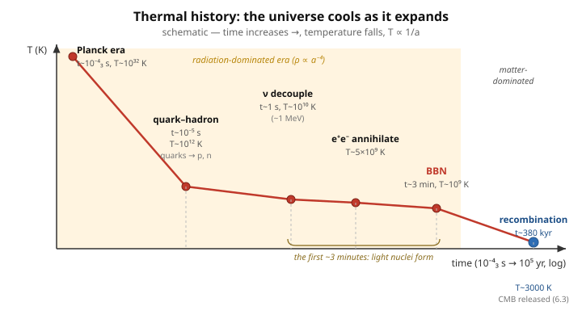

# Astrophysics · Lesson 6.2: The thermal history and Big Bang nucleosynthesis

> ⏱ ~15 min · Module 6: Cosmology · Builds on: [6.1 The expanding universe & the Friedmann equations](#/lesson/astrophysics/06-01-expanding-universe-friedmann.md), [stat-mech: the photon gas & blackbody](#/lesson/stat-mech/04-03-photon-gas-blackbody.md) · Unlocks: 6.3 The cosmic microwave background

## Why this matters

The Friedmann equations of [6.1](#/lesson/astrophysics/06-01-expanding-universe-friedmann.md) run in both directions. Play them *backward* and the universe shrinks, densifies, and — the decisive point — heats up. So the early cosmos was a hot, dense plasma, and its physics is just thermodynamics of an expanding box. That single idea yields a *falsifiable prediction about chemistry made in the first three minutes*: without a single star ever forming, the universe should have come out roughly one-quarter helium by mass, plus a precise trace of deuterium and lithium. We measure those abundances today and they match. Big Bang nucleosynthesis is the earliest event we can test — and its bookkeeping of ordinary matter is one of the pillars of dark matter.

## The idea

Take the Friedmann scaling from [6.1](#/lesson/astrophysics/06-01-expanding-universe-friedmann.md): matter dilutes as $\rho_m \propto a^{-3}$ (volume grows as $a^3$), but radiation dilutes *faster*, $\rho_r \propto a^{-4}$ — one extra factor of $a$ because every photon is also **redshifted**, its energy dropping as $1/a$. Two consequences follow immediately.

First, run $a$ backward toward zero and radiation wins: however small its share today, $\rho_r/\rho_m \propto a^{-1}$ blows up. The early universe was **radiation-dominated** — a gas of photons and relativistic particles, with matter a negligible contaminant.

Second, a photon gas at temperature $T$ has energy density $\propto T^4$ (Stefan–Boltzmann, from the [stat-mech photon gas](#/lesson/stat-mech/04-03-photon-gas-blackbody.md)). Setting $T^4 \propto \rho_r \propto a^{-4}$ gives the master clock of cosmology:

$$T \propto \frac{1}{a}.$$

*In words:* the universe is a blackbody cavity being stretched; stretching cools it. So "earlier" means "hotter," and we can label every cosmic epoch by a temperature. Read the timeline as a cooling sequence — the plasma passes through one threshold after another, and each time a reaction can no longer keep up with the expansion, something **freezes out** and leaves a permanent relic. Big Bang nucleosynthesis is the most important of those relics.

## The formal version

**Temperature–redshift relation.** With $a_0=1$ today and CMB temperature $T_0 = 2.725$ K,

$$T(a) = \frac{T_0}{a} = T_0\,(1+z).$$

*In words:* the temperature at scale factor $a$ is just today's temperature scaled up by $1/a$. Redshift is a thermometer for the past.

**The equilibrium-vs-expansion competition (freeze-out).** A reaction (say $A+B \leftrightarrow C+D$) holds its species in thermal equilibrium only while its interaction rate beats the expansion rate:

$$\Gamma = n\,\sigma\,v \;\;\gtrsim\;\; H \equiv \frac{\dot a}{a}.$$

*In words:* $\Gamma$ is how often a given particle reacts per second ($n$ = target density, $\sigma$ = cross-section, $v$ = relative speed); $H$ is roughly one over the age of the universe, the rate at which everything is being pulled apart. While $\Gamma > H$, particles find each other faster than expansion separates them — equilibrium holds. As the universe expands, $n$ plummets, so $\Gamma$ falls; when $\Gamma$ drops below $H$ the reaction **freezes out**, and whatever abundance it had at that instant is frozen in. This one inequality governs neutrino decoupling, the neutron-to-proton ratio, and (in [6.3](#/lesson/astrophysics/06-03-cosmic-microwave-background.md)) recombination.

**The thermal-history timeline.** Cooling from a hot start, the plasma crosses these thresholds (energies in $k_B T$):

| Epoch | $T$ | $k_B T$ | time | what happens |
|---|---|---|---|---|
| Planck | $10^{32}$ K | $10^{19}$ GeV | $10^{-43}$ s | quantum gravity; theory runs out |
| Quark–hadron | $10^{12}$ K | $\sim 150$ MeV | $10^{-5}$ s | quarks confine into protons & neutrons |
| $\nu$ decoupling | $10^{10}$ K | $\sim 1$ MeV | $1$ s | neutrinos freeze out, stream freely |
| $e^+e^-$ annihilation | $5\times10^9$ K | $\sim 0.5$ MeV | few s | positrons annihilate; photons reheated |
| **BBN** | $\sim 10^9$ K | $\sim 0.1$ MeV | $\sim 3$ min | protons & neutrons fuse into light nuclei |
| Recombination | $3000$ K | $\sim 0.3$ eV | $380{,}000$ yr | electrons bind to nuclei; CMB released ([6.3](#/lesson/astrophysics/06-03-cosmic-microwave-background.md)) |

**Big Bang nucleosynthesis.** Two ingredients set the outcome. (1) The neutron/proton ratio, fixed by *weak-interaction freeze-out* around $k_B T \approx 0.8$ MeV. In equilibrium the ratio is a Boltzmann factor in the mass difference $\Delta m c^2 = 1.293$ MeV (the Boltzmann factor of stat-mech — a state costing energy $E$ is suppressed by $e^{-E/k_B T}$):

$$\frac{n_n}{n_p} = e^{-\Delta m c^2 / k_B T}.$$

*In words:* neutrons are slightly heavier than protons, so they're mildly disfavored; the ratio at freeze-out is about $1/5$, and slow neutron decay over the next few minutes trims it to about $1/7$ by the time fusion begins. (2) Once it is cool enough for deuterium to survive ($T\sim10^9$ K — hotter, and every deuteron is instantly photo-dissociated: the "deuterium bottleneck"), the chain $p+n\to D$, then $D+D \to {}^3\text{He},\,{}^3\text{H} \to {}^4\text{He}$ funnels **nearly every free neutron into helium-4**, the most tightly bound light nucleus. The predicted helium mass fraction is

$$Y = \frac{2(n_n/n_p)}{1+(n_n/n_p)} \approx \frac{2(1/7)}{1+1/7} = \frac{1}{4}.$$

*In words:* pair up neutrons with an equal number of protons into $^4$He; the mass locked in helium is $\sim 25\%$ of the total, almost independent of the details — a remarkably robust number. Left over: trace deuterium and $^3$He (parts in $10^5$), a whisper of $^7$Li (parts in $10^{10}$), and nothing heavier.

## Picture

Read left to right as a cooling curve. The whole early sequence — quark confinement, neutrino decoupling, $e^+e^-$ annihilation, and BBN — is squeezed into the first few *minutes* (the highlighted band), all during radiation domination. Recombination, the release of the CMB, comes almost 400,000 years later, once matter has taken over. The vertical axis is temperature; because $T\propto 1/a$, this axis is equally an inverse-scale-factor axis — the same plot, relabeled.

## Worked examples

**Example 1 (why heavier elements stall at the mass gaps).** In a star, helium bridges to carbon by the **triple-alpha** reaction, because there is no stable nucleus at mass 5 ($^5$He, $^5$Li both fall apart instantly) or mass 8 ($^8$Be lives $\sim10^{-16}$ s). Adding one nucleon at a time to $^4$He hits a wall. Stars leap the mass-8 gap only because their cores are **dense and long-lived** enough for three alphas to meet in the fleeting lifetime of $^8$Be (see [3.3](#/lesson/astrophysics/03-03-nucleosynthesis-elements.md)). BBN has neither luxury: at $T\sim10^9$ K the universe is expanding through the fusion window in *minutes*, and the density is plummeting. The rare three-body triple-alpha never gets going, and the growing Coulomb barrier to heavier nuclei freezes the reactions out. Nucleosynthesis halts at $^7$Li. The carbon in your body and the oxygen you breathe waited hundreds of millions of years — for the first stars ([3.3](#/lesson/astrophysics/03-03-nucleosynthesis-elements.md)).

**Example 2 (BBN as a baryometer).** The trace abundances aren't just leftovers — they're a *scale*. The more baryons per photon (the ratio $\eta = n_b/n_\gamma$, equivalently the baryon density $\Omega_b$), the faster deuterium burns into helium, so **deuterium is a falling function of $\Omega_b$** — a sensitive gauge. Measure primordial deuterium in pristine gas clouds (via absorption toward distant quasars) and you read off

$$\Omega_b \approx 0.05,$$

about 5% of the critical density. But galaxy rotation curves and cluster dynamics ([5.3](#/lesson/astrophysics/05-03-galaxies-dark-matter.md)) demand a *total* matter density $\Omega_m \approx 0.3$. Since BBN counts **all** the baryons — luminous or not, they all participate in fusion — the gap $\Omega_m - \Omega_b \approx 0.25$ cannot be ordinary matter hiding in dark clouds. It must be **non-baryonic dark matter**. BBN and the CMB ([6.3](#/lesson/astrophysics/06-03-cosmic-microwave-background.md)) give the same $\Omega_b$ from completely independent physics — a stunning consistency check.

## Watch out

- You might think radiation dominates the early universe just because there were more photons. The real reason is the **scaling**: $\rho_r \propto a^{-4}$ versus $\rho_m \propto a^{-3}$, so the ratio $\rho_r/\rho_m \propto a^{-1}\to\infty$ as $a\to 0$. Radiation always wins early *no matter how small its present share* — the extra factor of $a$ is the photon redshift.
- You might think "freeze-out" means a reaction stops because it gets too cold. It's a **race**, not a threshold: equilibrium ends when the reaction *rate* $\Gamma$ falls below the *expansion rate* $H$, i.e. when particles can no longer find each other before being pulled apart. A faster-expanding universe would freeze things out hotter.
- You might think the $\sim 25\%$ helium is fine-tuned. It's the opposite — it's **robust**. Almost every neutron that survives to BBN ends up in $^4$He regardless of reaction-rate details, so $Y$ depends mainly on the frozen $n/p$ ratio, which depends only on $\Delta m c^2$ and the freeze-out temperature. That insensitivity is exactly why a $\sim 25\%$ measurement is such a clean test.

## One-liner

> Wind the expansion back and the universe is a cooling blackbody ($T\propto 1/a$); in its first three minutes it froze a $1{:}7$ neutron-to-proton ratio into $\sim 25\%$ helium — and by counting every baryon that fused, it proved most of the matter isn't baryons at all.

## Problems

**P1 (🟢)** BBN happens at $T_{\rm BBN}\approx 10^9$ K. Using $T\propto 1/a$ and today's CMB temperature $T_0 = 2.725$ K (with $a_0=1$), find the scale factor $a$ and the redshift $z$ of the universe at BBN.

**P2 (🟡)** Estimate the equilibrium neutron/proton ratio using the Boltzmann factor $n_n/n_p = e^{-\Delta m c^2/k_B T}$ with $\Delta m c^2 = 1.293$ MeV, at the freeze-out temperature $k_B T \approx 0.8$ MeV. Then, taking the ratio at the *onset of fusion* to be $\approx 1/7$ (after some neutron decay), show that funneling nearly all neutrons into $^4$He gives a helium mass fraction $Y\approx 0.25$.

**P3 (🔴, optional)** Explain why BBN produces essentially no elements heavier than lithium. Name the two nuclear "gaps" involved and the expansion effect that shuts fusion down, and state what this implies about the origin of the carbon and oxygen in your body.

Solutions

**P1** Since $T = T_0/a$,

$$a = \frac{T_0}{T_{\rm BBN}} = \frac{2.725\ \text{K}}{10^9\ \text{K}} = 2.7\times10^{-9}.$$

The universe was about a **billionth** of its present size. The redshift:

$$1+z = \frac{1}{a} = \frac{T_{\rm BBN}}{T_0} = \frac{10^9}{2.725} = 3.7\times10^8 \;\;\Rightarrow\;\; z \approx 3.7\times10^8.$$

(For comparison, recombination is at $z\approx1100$ — BBN is a factor of $\sim3\times10^5$ deeper in redshift, i.e. earlier and hotter.)

**P2** Boltzmann factor at freeze-out:

$$\frac{n_n}{n_p} = e^{-\Delta m c^2/k_B T} = e^{-1.293/0.8} = e^{-1.62} \approx 0.20 \approx \frac{1}{5}.$$

So at freeze-out roughly one neutron per five protons. Free neutrons then $\beta$-decay ($\tau_n\approx 880$ s) during the few-minute wait for the deuterium bottleneck to open, dropping the ratio to about $1/7$ by the time fusion actually starts.

Now build helium. Take $n_n/n_p = 1/7$: for every 2 neutrons there are 14 protons. Nearly all neutrons pair into $^4$He ($2p+2n$ each): 2 neutrons make **one** $^4$He nucleus, consuming 2 of the protons. That leaves $14-2 = 12$ protons as hydrogen. The helium mass fraction (using mass $\approx 4$ for $^4$He, $\approx 1$ for H, in nucleon units):

$$Y = \frac{4\times 1}{4\times 1 + 1\times 12} = \frac{4}{16} = 0.25.$$

Equivalently, the shortcut formula $Y = \dfrac{2(n_n/n_p)}{1+(n_n/n_p)} = \dfrac{2/7}{8/7} = \dfrac14$. About **25% helium by mass** — matching observation, and set almost entirely by the frozen $n/p$ ratio.

**P3** *Two gaps:* there is **no stable nucleus at mass 5** ($^5$He, $^5$Li are unbound) and **none at mass 8** ($^8$Be disintegrates in $\sim10^{-16}$ s). So one cannot climb from $^4$He to carbon by adding nucleons one at a time; the only bridge is the three-body **triple-alpha** reaction, which needs high density and time to catch three $^4$He nuclei within $^8$Be's fleeting lifetime.

*The expansion effect:* during BBN the universe is expanding and cooling through the fusion window in just a few **minutes**, so both the temperature and the density are dropping fast. The rare triple-alpha never ignites, and the rising Coulomb barrier to heavier nuclei — together with the collapsing reaction rates ($\Gamma$ falling below $H$) — freezes fusion out. Synthesis stops at a trace of $^7$Li.

*Implication:* the Big Bang made only H, He, and a whisper of Li. Every carbon and oxygen atom in your body was forged **later, inside stars** — carbon via the triple-alpha reaction in stellar cores, oxygen by further alpha capture — and dispersed by stellar winds and supernovae ([3.3](#/lesson/astrophysics/03-03-nucleosynthesis-elements.md)). We are, literally, second-generation material.

## Flashback

**From Lesson 6.1 (The expanding universe & the Friedmann equations):** For a flat universe the Friedmann equation is $H^2 = \left(\dfrac{\dot a}{a}\right)^2 = \dfrac{8\pi G}{3}\,\rho$. In the radiation-dominated early universe $\rho = \rho_0\,(a_0/a)^4$. Solve for $a(t)$, show that $a\propto t^{1/2}$, and hence that $H = 1/(2t)$.

Solution

Write $\rho = C\,a^{-4}$ (with $C=\rho_0 a_0^4$ a constant). Then

$$\frac{\dot a}{a} = \sqrt{\frac{8\pi G}{3}\,C}\;\,a^{-2} \equiv K\,a^{-2}, \qquad K \equiv \sqrt{\tfrac{8\pi G}{3}\,C}.$$

So $\dot a = K\,a^{-1}$, a separable ODE:

$$a\,da = K\,dt \;\;\Rightarrow\;\; \frac{a^2}{2} = K\,t \;\;\Rightarrow\;\; a(t) = (2K)^{1/2}\,t^{1/2} \propto t^{1/2}.$$

Then

$$H = \frac{\dot a}{a} = \frac{d}{dt}\!\left(\tfrac12\ln a\right)\!\cdot 2 = \frac{1}{2t},$$

or directly: $a = A t^{1/2}\Rightarrow \dot a = \tfrac12 A t^{-1/2}\Rightarrow H=\dot a/a = 1/(2t)$. So during radiation domination the age of the universe is simply $t = 1/(2H)$ — the relation that converts each temperature on the timeline into a clock reading (e.g. $T\sim10^{10}$ K $\leftrightarrow t\sim1$ s). (For matter domination, $\rho\propto a^{-3}$ instead gives $a\propto t^{2/3}$.)

## Connections

- **Backward:** this is [6.1](#/lesson/astrophysics/06-01-expanding-universe-friedmann.md)'s Friedmann dynamics run to early times, where $\rho_r\propto a^{-4}$ makes radiation dominate and fixes $a\propto t^{1/2}$. The neutron/proton ratio and the helium yield are pure equilibrium thermodynamics — the **Boltzmann factor** and blackbody scaling of [`stat-mech`](#/course/stat-mech), especially the [photon gas](#/lesson/stat-mech/04-03-photon-gas-blackbody.md) that gives $\rho_r\propto T^4$ and hence $T\propto 1/a$.
- **Forward:** the *same* freeze-out logic — $\Gamma$ falling below $H$ — reappears at recombination in [6.3](#/lesson/astrophysics/06-03-cosmic-microwave-background.md), where electrons stop finding protons and the CMB is set free. BBN's $\Omega_b\approx 0.05$ is one of the two independent baryon counts that the CMB acoustic peaks confirm.
- **Sideways (dark matter):** BBN counts *all* baryons via fusion, yet delivers only $\Omega_b\approx 0.05$ against the dynamical $\Omega_m\approx 0.3$ of [5.3](#/lesson/astrophysics/05-03-galaxies-dark-matter.md) — the cosmological complement to galaxy rotation curves and the cluster virial argument, pointing at **non-baryonic** dark matter.
- **Sideways (stellar nucleosynthesis):** the mass-5 and mass-8 gaps that *stop* BBN at lithium are the very same gaps stars leap with the triple-alpha reaction in [3.3](#/lesson/astrophysics/03-03-nucleosynthesis-elements.md) — the Big Bang and stellar furnaces face identical nuclear physics but with opposite amounts of density and time.
