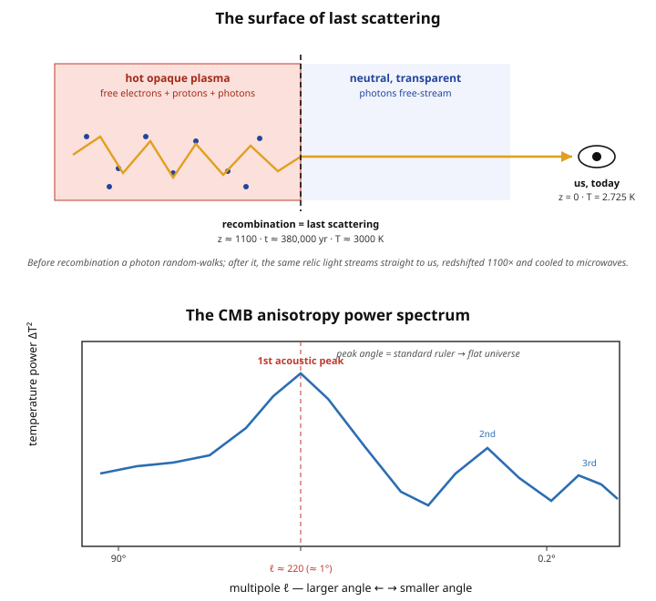

# Astrophysics · Lesson 6.3: The cosmic microwave background

> ⏱ ~15 min · Module 6: Cosmology · Builds on: [6.1 The expanding universe and the Friedmann equations](#/lesson/astrophysics/06-01-expanding-universe-friedmann.md), [6.2 The thermal history and Big Bang nucleosynthesis](#/lesson/astrophysics/06-02-thermal-history-bbn.md), [stat-mech 4.3 Photon gas & blackbody](#/lesson/stat-mech/04-03-photon-gas-blackbody.md) · Unlocks: 6.4 Structure formation and dark matter

## Why this matters

Point a microwave antenna anywhere in the sky, subtract the atmosphere and the Galaxy, and a faint uniform glow remains — the same in every direction, a perfect blackbody at $2.725\ \mathrm{K}$. This is the oldest light in existence: a photograph of the entire universe taken when it was $380{,}000$ years old, still in transit $13.8$ billion years later. It is the single strongest piece of evidence that the universe began hot and dense, and — through the pattern of one-part-in-$100{,}000$ ripples printed on it — it is the most precise measurement we have of what the universe is *made of* and *how it is shaped*. Cosmology became a precision science the day we resolved those ripples.

## The idea

Run the expansion of [6.1](#/lesson/astrophysics/06-01-expanding-universe-friedmann.md) backward. Shrink the universe and you compress and heat everything in it, exactly like a gas squeezed in a piston. Early on it was so hot that atoms couldn't hold together: hydrogen was a **plasma** of bare protons and free electrons swimming in a sea of photons. Free electrons are superb at scattering light, so a photon couldn't travel any distance before ricocheting — the universe was a glowing **fog**, opaque like the inside of the Sun.

Now let it expand and cool. When the temperature dropped to about $3000\ \mathrm{K}$, something abrupt happened: electrons and protons combined into neutral hydrogen atoms. This is **recombination** (a misnomer — they were never "combined" before, but the name stuck). Neutral atoms barely scatter the ambient light, so the fog cleared in a cosmic instant. The photons that were bouncing around at that moment suddenly found the universe transparent and have been **free-streaming** ever since. We still catch them today. They come from the last place each one scattered — a spherical shell around us called the **surface of last scattering**. Looking at the CMB is looking at that wall of fog, as far back as light can ever take us.

Two things happened to that light on its $13.8$-billion-year trip. First, the expansion stretched every wavelength by a factor of $\sim 1100$, dragging the $3000\ \mathrm{K}$ glow down to a chilly $2.725\ \mathrm{K}$ microwave hiss — but it stayed a **blackbody**, just a colder one. Second, the fog wasn't perfectly smooth: it carried sound waves, and those left faint hot-and-cold spots — the **anisotropies** — frozen into the light. Those spots are the seeds every galaxy grew from, and their statistics encode the whole recipe of the cosmos.

## The formal version

**Recombination and decoupling.** The ionization balance is the Saha equation from [1.3](#/lesson/astrophysics/01-03-radiative-transfer-spectral-lines.md): schematically

$$\frac{n_p\, n_e}{n_{\mathrm{H}}} \propto T^{3/2}\, e^{-\chi/k_B T},\qquad \chi = 13.6\ \mathrm{eV},$$

with $n_p, n_e, n_{\mathrm{H}}$ the number densities of protons, electrons, and neutral hydrogen, $k_B$ Boltzmann's constant, and $\chi$ the hydrogen ionization energy (the binding energy of the $n=1$ ground state you solved for in [QM 4.4](#/lesson/quantum-mechanics/04-04-hydrogen-atom.md)). In words: neutral atoms win once the thermal energy $k_B T$ falls well below $\chi$. That happens at $T_{\mathrm{rec}}\approx 3000\ \mathrm{K}$ ($k_B T \approx 0.26\ \mathrm{eV}$), corresponding to redshift $z\approx 1100$ and cosmic age $\approx 380{,}000$ yr. As the free electrons vanish, photon scattering shuts off and radiation **decouples** from matter.

**The relic blackbody.** Free-streaming photons keep a blackbody (Planck) spectrum; expansion just cools it. Temperature scales inversely with the scale factor $a$,

$$T \propto \frac{1}{a} = 1+z,$$

so the $3000\ \mathrm{K}$ emission is observed at $T_0 = 2.725\ \mathrm{K}$ today. In words: the CMB is the redshifted, cooled relic of the last-scattering fog. COBE measured its spectrum in 1990 and found the most perfect blackbody in nature — deviations under $0.01\%$ — exactly the Planck curve from [stat-mech 4.3](#/lesson/stat-mech/04-03-photon-gas-blackbody.md).

**Anisotropies and acoustic peaks.** The temperature varies across the sky by only

$$\frac{\Delta T}{T} \sim 10^{-5}.$$

These tiny fluctuations trace density ripples $\delta\rho/\rho$ in the pre-recombination **photon–baryon plasma**. Gravity pulled matter into overdense spots; photon pressure pushed back out — the plasma **rang** like a struck bell, setting up standing sound waves (baryon acoustic oscillations). Decompose the sky map into angular scales (spherical harmonics, multipole $\ell$; large $\ell$ = small angle) and plot the fluctuation power versus $\ell$: you get a series of **acoustic peaks**. The first, largest peak is the mode that had time to compress exactly once by recombination. Its physical size (the *sound horizon*, $\approx 150\ \mathrm{Mpc}$ comoving) is known from first principles, so its observed angular scale — about $1^\circ$, at $\ell \approx 220$ — is a **standard ruler**. The angle a known length subtends depends on the geometry of the space the light crossed, so the peak position measures the spatial curvature: it comes out flat, $\Omega_{\mathrm{total}} \approx 1$. The heights and spacings of the peaks fix the rest of the recipe — $\Omega_b$ (baryons), $\Omega_m$ (total matter), $\Omega_\Lambda$ (dark energy), and $H_0$. COBE → WMAP → Planck sharpened this into cosmology's crown jewel.

**The dipole.** The single largest anisotropy, $\Delta T/T \sim 10^{-3}$, isn't cosmological: it's a Doppler shift from our own motion (the Sun, Galaxy, and Local Group drift at $\sim 370\ \mathrm{km/s}$ relative to the CMB rest frame), making one side of the sky slightly hot and the opposite side cool. Subtract it, and the $10^{-5}$ primordial pattern remains.

## Picture

The top panel is the geography of the CMB: a photon random-walks through the opaque plasma, then at recombination the fog lifts and the same light streams straight to us, stretched and cooled. The bottom panel is what we do with it — the harmonic fingerprint of the plasma's sound waves, whose first peak at $\ell\approx 220$ is the standard ruler that says the universe is flat.

## Worked examples

**Example 1 (mechanical — the redshift of last scattering).** The CMB was emitted at $T_{\mathrm{rec}} = 3000\ \mathrm{K}$ and observed at $T_0 = 2.725\ \mathrm{K}$. Since $T \propto 1/a = 1+z$,

$$1 + z = \frac{T_{\mathrm{rec}}}{T_0} = \frac{3000}{2.725} \approx 1101 \quad\Rightarrow\quad z \approx 1100.$$

The universe was $\sim 1100$ times smaller in every linear dimension, hence $\sim 1100^3 \approx 1.3\times 10^9$ times denser. One number — a temperature ratio — reads off directly how much the universe has grown since it turned transparent.

**Example 2 (why you'd care — the CMB is a Fermi calculation waiting to happen).** How many CMB photons are in a coffee mug ($\sim 3\times 10^{-4}\ \mathrm{m}^3$)? A blackbody at $T$ has number density $n_\gamma \approx 2.03\times 10^{7}\,T^3\ \mathrm{m^{-3}}$ (the [photon-gas](#/lesson/stat-mech/04-03-photon-gas-blackbody.md) result, $T$ in kelvin). At $T_0 = 2.725\ \mathrm{K}$,

$$n_\gamma \approx 2.03\times 10^{7}\,(2.725)^3 \approx 4.1\times 10^{8}\ \mathrm{photons/m^3},$$

so the mug holds $\approx 4.1\times 10^{8}\times 3\times 10^{-4} \approx 1.2\times 10^{5}$ relic photons right now — about $410$ per cubic centimeter everywhere in space. Compare that to the baryon density $\sim 0.25\ \mathrm{m^{-3}}$: photons outnumber baryons by roughly $10^{9}$ to $1$. That enormous ratio is exactly what delayed recombination until $k_B T \ll \chi$ (see the Flashback), and it's a number BBN in [6.2](#/lesson/astrophysics/06-02-thermal-history-bbn.md) pins down independently.

## Watch out

- **"Recombination" and "decoupling" are not quite the same event.** Recombination is atoms forming (Saha); decoupling is photons stopping scattering because the free electrons are gone. They happen in quick succession around $z\approx 1100$, but they're distinct physical statements — recombination is the *cause*, decoupling and last scattering the *consequence*.
- **The CMB is not "the light of the Big Bang" in the sense of the very beginning.** It's from $380{,}000$ years *after*, the earliest moment the universe was transparent. Before that the plasma was opaque — no photon could reach us from further back. (To see earlier you'd need neutrinos or gravitational waves, which decoupled sooner.)
- **The redshift doesn't distort the blackbody shape.** You might expect stretching all the wavelengths to scramble the spectrum. It doesn't: a Planck curve redshifted by $1+z$ is still a Planck curve, just at temperature $T/(1+z)$. The blackbody is preserved exactly — which is why COBE's perfect fit is such a clean confirmation of a hot, thermal origin.
- **$\Delta T/T \sim 10^{-5}$ is the primordial signal; the $10^{-3}$ dipole is us.** Don't confuse the two. The dipole is our peculiar motion, subtracted before any cosmology is done.

## One-liner

> The CMB is a $2.725\ \mathrm{K}$ blackbody photograph of the universe at $380{,}000$ years, redshifted $1100\times$ from the moment it turned transparent — and the $10^{-5}$ ripples printed on it are both the seeds of every galaxy and the standard ruler that says the universe is flat.

## Problems

**P1 (🟢)** The CMB is observed at $T_0 = 2.725\ \mathrm{K}$ today and was emitted at $T_{\mathrm{rec}} = 3000\ \mathrm{K}$. Using $T \propto 1/a = 1+z$, find (a) the redshift $z$ of last scattering, and (b) the ratio of the scale factor then to now, $a_{\mathrm{rec}}/a_0$. State in one sentence what that ratio means physically.

**P2 (🟡)** Find the wavelength at which the CMB blackbody spectrum peaks *today*, using Wien's displacement law from [1.2](#/lesson/astrophysics/01-02-blackbody-spectra-hr-diagram.md), $\lambda_{\max} T = b$ with $b = 2.898\times 10^{-3}\ \mathrm{m\cdot K}$. Confirm that it lands in the microwave band, and (bonus) find the corresponding frequency.

**P3 (🔴, optional)** In two short paragraphs: (a) explain how the angular scale of the first acoustic peak acts as a *standard ruler* that reveals the universe is spatially flat — what is the known length, what is measured, and why does the angle depend on geometry? (b) Explain why fluctuations of $\Delta T/T \sim 10^{-5}$ were *necessary* for galaxies to exist: what would a perfectly smooth universe produce, and what do these ripples become?

Solutions

**P1** (a) $1+z = T_{\mathrm{rec}}/T_0 = 3000/2.725 \approx 1101$, so $z \approx 1100$.
(b) Since $a \propto 1/T$, $\ a_{\mathrm{rec}}/a_0 = T_0/T_{\mathrm{rec}} = 2.725/3000 \approx 9.1\times 10^{-4} \approx 1/1101$.
Physically: the universe was about $1100$ times smaller in linear scale when the CMB was released — every distance has since stretched by that factor, which is exactly why the emission cooled from $3000\ \mathrm{K}$ to $2.725\ \mathrm{K}$.

**P2** Wien's law: $\lambda_{\max} = b/T_0 = (2.898\times 10^{-3})/2.725 = 1.06\times 10^{-3}\ \mathrm{m} \approx 1.06\ \mathrm{mm}$.
A wavelength of about a millimeter is squarely in the microwave / millimeter band (microwaves run $\sim 1\ \mathrm{mm}$ to $\sim 1\ \mathrm{m}$) — hence the name *cosmic microwave background*.
Bonus frequency: $\nu = c/\lambda_{\max} = (3.00\times 10^{8})/(1.06\times 10^{-3}) \approx 2.8\times 10^{11}\ \mathrm{Hz} = 280\ \mathrm{GHz}$, right in the band Planck's detectors were built to observe. (Note: the spectrum's peak in *frequency* units sits lower, near $160\ \mathrm{GHz}$, because per-$\nu$ and per-$\lambda$ Planck curves peak at different places — but both are unambiguously microwave.)

**P3** (a) The known length is the **sound horizon** at recombination: the farthest a pressure wave could travel through the photon–baryon plasma before decoupling, a distance fixed by the sound speed and the age of the universe at $z\approx 1100$ (about $150\ \mathrm{Mpc}$ comoving). The first acoustic peak is the mode set by exactly that scale, and we *measure* the angle it subtends on the sky — about $1^\circ$ ($\ell\approx 220$). A ruler of known length $s$ seen at distance $d$ subtends an angle $\theta \approx s/d$ **in flat space**, but in a curved geometry light rays bend: positive (closed) curvature focuses them and makes the ruler look *larger*, negative (open) curvature defocuses them and makes it look *smaller*. So the observed angle is a direct readout of curvature. The measured $\sim 1^\circ$ is the flat-space prediction, giving $\Omega_{\mathrm{total}} \approx 1$: the universe is spatially flat.

(b) Structure grows by **gravitational instability**: a region even slightly denser than average pulls in more matter, growing denser still, and the excess density $\delta\rho/\rho$ amplifies over time. A perfectly smooth universe has $\delta\rho/\rho = 0$ everywhere — nothing to seed collapse, so it would expand forever as uniform gas, with no stars, galaxies, or us. The $\Delta T/T \sim 10^{-5}$ hot and cold spots are the imprint of the primordial density ripples $\delta\rho/\rho \sim 10^{-5}$ present at recombination. Under gravity these grew by a factor of order $1000$ as the universe expanded, reaching order unity and collapsing into the bound structures we see — the CMB spots are the literal blueprint of today's cosmic web. (Baryons alone couldn't have grown enough in the time available; **dark matter**, which had been clumping unimpeded since well before recombination, provided the deeper potential wells the baryons fell into — the subject of [6.4](#/lesson/astrophysics/06-04-structure-formation-dark-matter.md).)

## Flashback

**From Lesson 1.3 (Radiative transfer and spectral lines — the Saha equation):** Hydrogen's ionization energy is $\chi = 13.6\ \mathrm{eV}$, yet recombination waited until the temperature fell to $T_{\mathrm{rec}} \approx 3000\ \mathrm{K}$, where $k_B T \approx 0.26\ \mathrm{eV}$ — a full *factor of $\sim 50$ below* the binding energy. Using the Saha picture, explain why hydrogen stayed ionized until $k_B T$ dropped so far below $\chi$. (Hint: recall from Example 2 that photons outnumber baryons by $\eta^{-1} \sim 10^{9}$.)

Solution

Naively you'd expect neutral atoms once a *typical* photon can't ionize them, i.e. around $k_B T \sim \chi$, or $T \sim 1.6\times 10^{5}\ \mathrm{K}$. But ionization doesn't need a typical photon — it needs *any* photon with energy above $\chi$, and there are staggeringly many photons per atom. The number of photons in the blackbody tail above $\chi$ is suppressed by $e^{-\chi/k_B T}$, but that tail is multiplied by the huge photon-to-baryon ratio $\eta^{-1}\sim 10^{9}$. Hydrogen only recombines once the exponential suppression finally beats the number ratio:

$$e^{-\chi/k_B T_{\mathrm{rec}}} \sim \eta \sim 10^{-9} \quad\Rightarrow\quad \frac{\chi}{k_B T_{\mathrm{rec}}} \sim \ln(10^{9}) \approx 20\text{–}30.$$

So $k_B T_{\mathrm{rec}} \sim \chi/25 \approx 0.5\ \mathrm{eV}$, i.e. $T_{\mathrm{rec}}$ of order a few thousand kelvin — matching the observed $\sim 3000\ \mathrm{K}$. The Saha equation's $e^{-\chi/k_B T}$ factor, fighting the enormous photon abundance, is precisely what delays recombination and *sets the redshift of the surface of last scattering*. The same ionization balance that decides which absorption lines a stellar photosphere shows (1.3) decides when the whole universe turned transparent.

## Connections

- **Backward:** recombination is the [1.3](#/lesson/astrophysics/01-03-radiative-transfer-spectral-lines.md) Saha equation applied to the entire universe, with the hydrogen binding energy from [QM 4.4](#/lesson/quantum-mechanics/04-04-hydrogen-atom.md); the relic spectrum is the [stat-mech photon gas](#/lesson/stat-mech/04-03-photon-gas-blackbody.md) preserved and cooled by the [6.1](#/lesson/astrophysics/06-01-expanding-universe-friedmann.md) expansion, and its peak is read with the [1.2](#/lesson/astrophysics/01-02-blackbody-spectra-hr-diagram.md) Wien law. The $T\propto 1/a$ cooling and the photon-to-baryon ratio are the thermal-history results of [6.2](#/lesson/astrophysics/06-02-thermal-history-bbn.md).
- **Forward:** the $\Delta T/T \sim 10^{-5}$ ripples are the initial conditions for [6.4](#/lesson/astrophysics/06-04-structure-formation-dark-matter.md), where gravitational instability grows them into galaxies and the cosmic web — and the acoustic-peak heights that measure $\Omega_m$ and $\Omega_\Lambda$ feed straight into the concordance model of [6.6](#/lesson/astrophysics/06-06-concordance-model-frontiers.md).
- **Sideways (statistical mechanics):** the whole lesson is thermodynamics of an expanding box — a blackbody photon gas decoupling from an ionization equilibrium. The acoustic oscillations are literal sound waves in a relativistic fluid, the same standing-wave physics as a gas in a pipe, printed on the sky.
