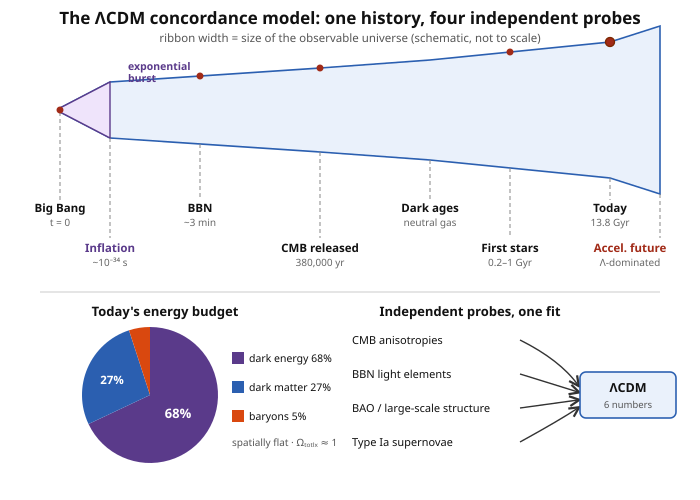

# Astrophysics · Lesson 6.6: The concordance model and frontiers

> ⏱ ~15 min · Module 6: Cosmology · Builds on: [6.2 Thermal history & BBN](#/lesson/astrophysics/06-02-thermal-history-bbn.md), [6.3 The cosmic microwave background](#/lesson/astrophysics/06-03-cosmic-microwave-background.md), [6.4 Structure formation & dark matter](#/lesson/astrophysics/06-04-structure-formation-dark-matter.md), [6.5 Dark energy & acceleration](#/lesson/astrophysics/06-05-dark-energy-acceleration.md) · Unlocks: nothing — this is the last lesson of the course and the capstone of the whole curriculum

## Why this matters

For most of human history, "what is the universe made of, how old is it, and how did it begin?" was philosophy. It is now a **measurement** — pinned down to a few percent by six numbers. The astonishing part is not any single result but that four experiments probing utterly different epochs and physics — the microwave sky at 380,000 years, the light-element abundances at 3 minutes, the clustering of a million galaxies today, and the dimming of exploding stars halfway across the cosmos — all fall into line behind **one** model with the **same** parameters. That is what "concordance" means, and it is the strongest evidence we have that the framework is right. This lesson assembles that model, explains the epoch that seeded it (inflation), and walks you to the exact edges where the physics runs out — the frontiers that the rest of physics, especially quantum gravity, is being built to reach.

## The idea

Imagine four detectives who never spoke, each handed a different clue from a different century, each asked independently to name the culprit's height, weight, age, and hometown — and all four write down the same four numbers. You would not call that a coincidence; you would call it solved. That is the state of cosmology.

The model they all point to is **ΛCDM**: a universe that is spatially **flat**, expanding, and filled with three things — ordinary matter (baryons), **cold dark matter** (CDM: slow-moving, non-luminous, felt only by gravity), and a **cosmological constant Λ** (dark energy, a constant energy density of empty space that drives acceleration). Run the clock and the budget today comes out roughly **68% dark energy, 27% dark matter, 5% ordinary matter**, in a universe **13.8 billion years** old. Only that last 5% — the baryons — is made of anything on the periodic table. Everything you have ever seen, touched, or been made of is the rounding error in the cosmic budget.

But a flat, uniform universe seeded with just-right ripples is not something ΛCDM explains — it *assumes* it. **Inflation** is the proposed prequel: a fleeting burst of exponential expansion in the first instant that stretches a microscopic, causally-connected patch to encompass everything we see, ironing it flat and uniform, while quantum jitters in the process get frozen in as the density seeds galaxies later grew from. It is a bold idea that turns three separate puzzles into one mechanism — and it links the largest structures in the universe to the quantum mechanics of the very small.

## The formal version

**ΛCDM in six numbers.** The base model is specified by six free parameters; everything else — the age, the acceleration, the CMB peak positions, the galaxy power spectrum — is *derived*. A standard choice:

| Parameter | Meaning | Value |
|---|---|---|
| $\Omega_b h^2$ | baryon density | $0.0224$ |
| $\Omega_c h^2$ | cold dark matter density | $0.120$ |
| $H_0$ (via $\theta_*$) | expansion rate / sound-horizon angle | $67$–$68\ \mathrm{km\,s^{-1}Mpc^{-1}}$ |
| $\tau$ | reionization optical depth | $0.054$ |
| $A_s$ | amplitude of primordial fluctuations | $2.1\times10^{-9}$ |
| $n_s$ | tilt of the primordial spectrum | $0.965$ |

Here $h \equiv H_0/(100\ \mathrm{km\,s^{-1}Mpc^{-1}})$ and $\Omega_i \equiv \rho_i/\rho_{\rm crit}$ is each component's density in units of the critical density $\rho_{\rm crit}=3H_0^2/8\pi G$ (from [6.1](#/lesson/astrophysics/06-01-expanding-universe-friedmann.md)). *In words: six dials, turned once, simultaneously fit the microwave sky, the light elements, the galaxy distribution, and the supernova Hubble diagram.* The derived budget is

$$\Omega_\Lambda \approx 0.68,\quad \Omega_{\rm dm}\approx 0.27,\quad \Omega_b\approx 0.05,\qquad \Omega_{\rm total}=\Omega_\Lambda+\Omega_{\rm dm}+\Omega_b \approx 1.00,$$

so $\Omega_k = 1-\Omega_{\rm total}\approx 0$: **spatially flat**, with age $t_0 \approx 13.8$ Gyr.

**Inflation and the two problems it solves.** Inflation posits a scalar field ("the inflaton") whose energy density behaved like a temporary, enormous $\Lambda$, driving $a(t)\propto e^{Ht}$ for roughly $10^{-34}$ s — expanding linear scales by a factor $\gtrsim e^{60}\approx 10^{26}$.

- **The horizon problem.** Without inflation, regions of the CMB more than $\sim 1$–$2^\circ$ apart on the sky were never in causal contact — no light, no signal, nothing could have passed between them since $t=0$ (Problem 2). Yet the whole sky is the **same temperature to 1 part in $10^5$**. How did thousands of causally-disconnected patches agree? *Inflation's answer:* they weren't disconnected. The entire observable universe was once a **tiny patch small enough to reach thermal equilibrium**, which inflation then blew up beyond the horizon.
- **The flatness problem.** In the Friedmann equation, any curvature ($\Omega_k\neq0$) grows with time relative to matter and radiation, so $\Omega_{\rm total}=1$ is an *unstable* point — for it to be $\approx1$ today, it had to be tuned to $1$ to $\sim 60$ decimal places at the Big Bang. *Inflation's answer:* exponential expansion drives $\Omega\to1$ automatically, the way inflating a balloon flattens any patch of its surface.

And a bonus that turned inflation from plausible to compelling: quantum fluctuations of the inflaton, stretched from subatomic to cosmic scales, are **frozen in as the primordial density perturbations** — the $\Delta T/T\sim 10^{-5}$ seeds of [6.3](#/lesson/astrophysics/06-03-cosmic-microwave-background.md) and [6.4](#/lesson/astrophysics/06-04-structure-formation-dark-matter.md). *In words: the galaxies, clusters, and cosmic web all grew from quantum jitters magnified across $10^{26}$ — the largest structures in existence are Heisenberg's uncertainty principle, writ across the sky.* Inflation even predicts the near-scale-invariant, slightly tilted spectrum ($n_s$ just below 1) that the CMB measures — a genuine, confirmed prediction.

**The open frontiers.** ΛCDM works, but three of its six ingredients are placeholders for physics we do not have:

- **What is dark matter?** ΛCDM needs a cold, collisionless particle, but no known particle fits. Direct-detection experiments (deep underground), collider searches, and astrophysical probes have ruled out large swaths of parameter space for WIMPs and axions without a confirmed signal.
- **What is dark energy?** A cosmological constant fits, but its natural value from quantum field theory is $\sim 10^{120}$ times too large — the **cosmological-constant problem** ([6.5](#/lesson/astrophysics/06-05-dark-energy-acceleration.md)), the worst quantitative mismatch in physics. Is $\Lambda$ truly constant, or dynamical (quintessence)? Surveys are now measuring its equation of state $w$ to test this.
- **The Hubble tension.** The **early-universe** $H_0$ inferred from the CMB ($\approx 67.4$) and the **late-universe** $H_0$ measured directly from the distance ladder ([1.1](#/lesson/astrophysics/01-01-scales-luminosity-distance-ladder.md), $\approx 73$) disagree at $\sim 5\sigma$. Either a subtle systematic hides in one method, or ΛCDM is missing something in the early universe.
- **Before inflation, and the singularity.** Extrapolating $a(t)\to0$ drives density and curvature to infinity — general relativity predicts its own breakdown. What happened *at* $t=0$, and what set inflation going, are questions no current theory can answer: they require a quantum theory of gravity. This is the endpoint the whole curriculum points toward.

**The fate of the universe.** With $\Lambda$ now dominating and constant, the Friedmann equation gives $a(t)\propto e^{H_\Lambda t}$: expansion **accelerates forever** (Boss Problem 6). Structure already gravitationally bound (galaxies, clusters) survives; everything else recedes and redshifts away until, in the far future, other galaxies vanish beyond the horizon, star formation ceases as gas runs out, stars burn down to remnants, and the universe drifts toward a cold, dark, dilute **heat death**.

## Picture

The ribbon is the size of the observable universe through time (schematic): a near-instant exponential burst at inflation, then steady expansion that *re-accelerates* in the recent, Λ-dominated era (the flare at right). Below: the energy budget — 68/27/5 — and the four independent probes (CMB, BBN, large-scale structure, Type Ia supernovae) that each, alone, constrain the model and together pin it to the same six numbers.

## Worked examples

**Example 1 (the concordance budget is not a fudge — count the constraints).** ΛCDM has **6** parameters. Now count what it must fit *simultaneously*: the positions and heights of the first several CMB acoustic peaks (a dozen independent numbers from [6.3](#/lesson/astrophysics/06-03-cosmic-microwave-background.md)), the primordial abundances of D, ³He, ⁴He, and ⁷Li from BBN ([6.2](#/lesson/astrophysics/06-02-thermal-history-bbn.md)), the galaxy power spectrum and the BAO scale across multiple redshifts ([6.4](#/lesson/astrophysics/06-04-structure-formation-dark-matter.md), [5.5](#/lesson/astrophysics/05-05-clusters-large-scale-structure.md)), and the supernova magnitude-redshift relation ([6.5](#/lesson/astrophysics/06-05-dark-energy-acceleration.md)) — dozens of data points. Six knobs fitting dozens of independent measurements is **wildly over-constrained**: a wrong model has nowhere to hide. That it fits at all is the triumph. As a concrete cross-check, the baryon density $\Omega_b h^2 = 0.0224$ measured from the *CMB peak ratios* (physics: photon-baryon acoustic oscillations at 380,000 yr) agrees with $\Omega_b h^2$ from *BBN* (physics: neutron-proton freeze-out and deuterium synthesis at 3 minutes). Two epochs, two entirely different physical processes, **one baryon density**. That agreement is the concordance in a single number.

**Example 2 (why "cold" dark matter, and why it must dominate the baryons).** The CMB says total matter $\Omega_m h^2 = \Omega_b h^2 + \Omega_c h^2 = 0.0224+0.120 = 0.142$, while baryons alone are $0.0224$ — so **dark matter outweighs ordinary matter about $5{:}1$** ($0.120/0.0224\approx 5.4$). Structure formation ([6.4](#/lesson/astrophysics/06-04-structure-formation-dark-matter.md)) needs this: baryons stayed ionized and pressure-locked to photons until recombination, so their density ripples *couldn't grow* before then. Dark matter, feeling only gravity, began collapsing earlier and built the potential wells that baryons later fell into. Without a dominant, pressure-less (**cold**) matter component, there would not have been enough time to grow today's galaxies from $10^{-5}$ seeds — the observed cosmic web *requires* dark matter to outweigh baryons, and independently the CMB and galaxy clustering agree it does by $\sim5{:}1$. Same answer, three ways.

## Watch out

- **You might think "concordance" means one experiment measured everything — it means the opposite.** The power is that *independent* probes, each capable of constraining the model alone, agree. Remove any one (say, supernovae) and the CMB + BBN + structure still pin ΛCDM; the redundancy is the evidence. A single fit could be tuned; four blind fits landing together cannot.
- **You might think inflation *is* the Big Bang — it isn't.** Inflation is a proposed episode *within* the first instant that solves the horizon and flatness problems; the hot Big Bang (BBN, CMB) proceeds after inflation ends and reheats the universe. And inflation says nothing about the initial singularity at $t=0$ — that still needs quantum gravity. Inflation is very well-motivated but is not established at the level ΛCDM is.
- **You might think dark energy means the universe is "filling up" with new stuff — no.** A cosmological constant is a *constant energy density of empty space*: as space expands, there is more space, hence more total dark energy, but the density never changes. That constancy is exactly why it comes to dominate — matter dilutes as $\rho\propto a^{-3}$, radiation as $a^{-4}$, while $\rho_\Lambda$ holds fixed and eventually wins.
- **You might think the Hubble tension is just measurement error.** It might be — but two independent, repeatedly cross-checked methods now disagree at $\sim5\sigma$, which is the threshold particle physicists call a discovery. It is taken seriously precisely because both methods have survived intense scrutiny.

## One-liner

> ΛCDM is six numbers that fit the whole universe — 68% dark energy, 27% dark matter, 5% us, flat, 13.8 Gyr old — set up by an inflationary burst that stretched quantum noise into galaxies, and fraying at exactly the edges (dark matter, dark energy, the singularity) where new physics must live.

## Problems

**P1 (🟢)** (a) Using $\Omega_\Lambda=0.685$, $\Omega_{\rm dm}=0.265$, $\Omega_b=0.049$, confirm the ΛCDM budget sums to $\Omega_{\rm total}\approx1$ and state what that implies for spatial geometry. (b) Compute the critical density $\rho_{\rm crit}=3H_0^2/8\pi G$ for $H_0=67.4\ \mathrm{km\,s^{-1}Mpc^{-1}}$, and express it as a number of protons per cubic metre. (c) Find the *baryon* density in protons per cubic metre. ($1\ \mathrm{Mpc}=3.086\times10^{22}$ m, $G=6.67\times10^{-11}$ SI, $m_p=1.67\times10^{-27}$ kg.)

**P2 (🟡, the horizon problem)** In a matter-dominated flat universe the comoving particle horizon grows as $\eta\propto a^{1/2}$, so the horizon at recombination subtends an angle on today's sky of $\theta_{\rm hor}\approx(1+z_{\rm rec})^{-1/2}$ radians. (a) Evaluate $\theta_{\rm hor}$ for $z_{\rm rec}\approx1100$, in degrees. (b) Estimate how many causally-disconnected patches of this size tile the full sky. (c) In one or two sentences, state the puzzle this poses and how inflation resolves it.

**P3 (🔴, optional — the capstone)** Trace a single **oxygen** atom in the air you are breathing from the Big Bang to your lungs. Name the *five or six* physical stages it passed through, and for **each** stage name the specific physics (and, where you can, the prerequisite course) that governed it. This is the whole curriculum in one atom.

Solutions

**P1** (a) $\Omega_{\rm total}=0.685+0.265+0.049=0.999\approx1$. Since $\Omega_{\rm total}=1$ means the total density equals the critical density, the Friedmann curvature term vanishes ($\Omega_k=1-\Omega_{\rm total}\approx0$): the universe is **spatially flat**. (Observationally $|\Omega_k|<0.005$.)

(b) Convert $H_0$ to SI: $H_0=\dfrac{67.4\times10^3\ \mathrm{m/s}}{3.086\times10^{22}\ \mathrm{m}}=2.184\times10^{-18}\ \mathrm{s^{-1}}$, so $H_0^2=4.77\times10^{-36}\ \mathrm{s^{-2}}$. Then

$$\rho_{\rm crit}=\frac{3H_0^2}{8\pi G}=\frac{3(4.77\times10^{-36})}{8\pi(6.67\times10^{-11})}=\frac{1.43\times10^{-35}}{1.676\times10^{-9}}=8.5\times10^{-27}\ \mathrm{kg\,m^{-3}}.$$

As protons: $8.5\times10^{-27}/1.67\times10^{-27}\approx \mathbf{5.1\ protons\,m^{-3}}$ — the whole universe averages about **five hydrogen atoms per cubic metre**, emptier than any laboratory vacuum.

(c) Baryons are $\Omega_b=0.049$ of that: $0.049\times5.1\approx \mathbf{0.25\ protons\,m^{-3}}$, i.e. one proton per $\sim4\ \mathrm{m^3}$. (This matches the baryon density BBN infers from the deuterium abundance — the concordance of Example 1.)

**P2** (a) $\theta_{\rm hor}=(1+1100)^{-1/2}=(1101)^{-1/2}=0.0301$ rad. In degrees: $0.0301\times(180/\pi)=\mathbf{1.7^\circ}$. So only regions closer than $\sim1$–$2^\circ$ on the sky could ever have exchanged a light signal by recombination.

(b) A patch of angular *radius* $\sim\theta_{\rm hor}/2$ has solid angle $\Omega_{\rm patch}\approx\pi(\theta_{\rm hor}/2)^2=\pi(0.0151)^2\approx7.1\times10^{-4}$ sr. The full sky is $4\pi\approx12.57$ sr, so

$$N\approx\frac{4\pi}{\Omega_{\rm patch}}=\frac{12.57}{7.1\times10^{-4}}\approx1.8\times10^{4},$$

roughly **ten thousand** causally-disconnected patches.

(c) *The puzzle:* those $\sim10^4$ patches had no way to exchange energy or information, yet they all show the same temperature to 1 part in $10^5$ — a conspiracy the standard hot Big Bang cannot explain. *Inflation's resolution:* before inflation the entire region that became our observable universe was a single tiny patch, small enough to reach thermal equilibrium; a burst of exponential expansion then stretched it far beyond the horizon, so the uniformity we see is a fossil of that early contact.

**P3** One oxygen atom's journey (the capstone integration — exact staging may vary, the physics is the point):

1. **Big Bang / BBN (first 3 minutes).** Oxygen is *not* made here — BBN produces only H, He, and a trace of Li ([6.2](#/lesson/astrophysics/06-02-thermal-history-bbn.md)). What this stage sets is the raw fuel: the protons and neutrons (from quark freeze-out) and the primordial hydrogen from which everything later is built. *Physics:* nuclear statistical equilibrium and weak-interaction freeze-out — thermal statistical mechanics ([`stat-mech`](#/course/stat-mech)) applied to the early universe.
2. **Gravitational collapse & star formation.** A primordial H/He cloud, seeded by the $10^{-5}$ density ripples from inflation, cools and exceeds its Jeans mass, collapsing into a massive star ([3.1](#/lesson/astrophysics/03-01-star-formation-jeans.md)). *Physics:* gravitational (Jeans) instability — gravity from `mechanics-refresher`, with radiative cooling from `stat-mech`.
3. **Stellar nucleosynthesis.** In the massive star's core, hydrogen fuses to helium, then the triple-alpha reaction makes carbon, and alpha capture builds **oxygen-16** ([3.3](#/lesson/astrophysics/03-03-nucleosynthesis-elements.md)). *Physics:* fusion enabled by quantum **tunneling** through the Coulomb barrier (the Gamow peak, [2.3](#/lesson/astrophysics/02-03-nuclear-energy-generation.md) / [`quantum-mechanics`](#/lesson/quantum-mechanics/02-05-scattering-barriers-tunneling.md)).
4. **Supernova & dispersal.** The massive star exhausts its fuel to an iron core and dies in a **core-collapse supernova** ([3.4](#/lesson/astrophysics/03-04-stellar-death-supernovae.md)), blasting the freshly-made oxygen out into interstellar space. *Physics:* degeneracy-pressure failure and the collapse/bounce — quantum degeneracy ([`stat-mech`](#/lesson/stat-mech/04-04-ideal-fermi-gas.md)) meeting gravity/GR.
5. **ISM enrichment.** The oxygen mixes into a molecular cloud, raising the metallicity of the interstellar medium ([5.1](#/lesson/astrophysics/05-01-interstellar-medium.md), [3.5](#/lesson/astrophysics/03-05-imf-stellar-populations.md)). *Physics:* radiative cooling and the multiphase ISM — atomic/molecular line emission from `em-refresher` and `quantum-mechanics`.
6. **Star/planet formation → Earth → you.** That enriched cloud collapses again to form the Sun and its protoplanetary disk; oxygen is incorporated into Earth's rock, water, and atmosphere — and finally into the $\mathrm{O_2}$ you just inhaled. *Physics:* disk formation and angular-momentum transport (`mechanics-refresher`), planetary chemistry.

Every prerequisite course appears: **mechanics** (collapse, orbits), **EM** (radiation, line cooling), **stat-mech** (BBN, degeneracy, thermal history), **quantum mechanics** (tunneling, spectral lines), and **relativity** (the cosmological stage it all unfolds on). The atom in your breath is a working record of 13.8 billion years of physics.

## Flashback

**From Lesson 6.3 (The cosmic microwave background):** The CMB is a blackbody at $T_0=2.725$ K today, and its temperature scales as $T\propto(1+z)$ because expansion stretches every photon wavelength. At what redshift $z$ was the CMB at a comfortable room temperature of $300$ K — and what was happening in the universe around then?

Solution

Set $T=T_0(1+z)$ and solve for $z$:

$$1+z=\frac{T}{T_0}=\frac{300}{2.725}=110.1\quad\Rightarrow\quad z\approx109.$$

So around $z\sim110$ the entire universe was at room temperature. This is deep in the **dark ages**: recombination ([6.3](#/lesson/astrophysics/06-03-cosmic-microwave-background.md)) had already happened at $z\approx1100$ (when $T\approx3000$ K), so the gas was neutral and no stars had yet formed — a universe uniformly at shirtsleeve temperature, entirely dark, with the first stars still a hundred million years in the future. (Note $T\propto(1+z)$ is the same relation that makes the CMB *hotter* in the past, keeping it in equilibrium before decoupling.)

## Connections

- **Backward:** this lesson is the keystone that ties Module 6 together — the [Friedmann dynamics and $\Omega$ of 6.1](#/lesson/astrophysics/06-01-expanding-universe-friedmann.md), the [BBN abundances of 6.2](#/lesson/astrophysics/06-02-thermal-history-bbn.md), the [CMB anisotropies of 6.3](#/lesson/astrophysics/06-03-cosmic-microwave-background.md), the [dark-matter structure growth of 6.4](#/lesson/astrophysics/06-04-structure-formation-dark-matter.md), and the [dark-energy acceleration of 6.5](#/lesson/astrophysics/06-05-dark-energy-acceleration.md) are the five constraints ΛCDM satisfies at once. The dark-matter evidence reaches back to the [cluster and rotation-curve dynamics of Module 5](#/lesson/astrophysics/05-05-clusters-large-scale-structure.md) and the virial mass of [1.4](#/lesson/astrophysics/01-04-gravitational-dynamics-virial.md).
- **Forward:** the open frontiers point outward — dark energy's fine-tuning and the initial singularity both demand physics beyond ΛCDM and general relativity. The natural next destination is [`relativity`](#/course/relativity) (the FLRW/Friedmann machinery used throughout Module 6, and the black-hole singularities of Module 4) and, past it, quantum gravity — the endpoint this entire roadmap has been walking toward.
- **Sideways (quantum ↔ cosmos):** inflation is the deepest cross-subject bridge in the course — the $\Delta T/T\sim10^{-5}$ seeds of every galaxy are **quantum fluctuations** ([`quantum-mechanics`](#/course/quantum-mechanics)) stretched to cosmic scale. The largest structures in the universe are a magnified image of the uncertainty principle.

---

*Course & curriculum close.* Astrophysics was the capstone by design, and it earned the title: to explain the universe from atomic nuclei to the cosmic web, it drew on **mechanics** (orbits, the virial theorem, collapse), **electromagnetism** (radiation, spectra, the Poynting flux of starlight), **statistical mechanics** (blackbody radiation, degeneracy pressure, the thermal history and BBN), **quantum mechanics** (fusion tunneling, spectral lines, the Pauli exclusion that holds white dwarfs up), and **relativity** (black holes, the expanding FLRW spacetime). Every course in this roadmap turned out to be a tool the universe actually uses. You began by refreshing calculus; you finish able to weigh a galaxy, derive the Chandrasekhar mass, explain why the night sky is dark, and read the age and composition of the cosmos off six numbers. The frontiers where this lesson ended — what dark matter and dark energy are, what preceded inflation, what happens at a singularity — are not gaps in your education but the live edges of the field itself. That is exactly where a physicist's work begins.
