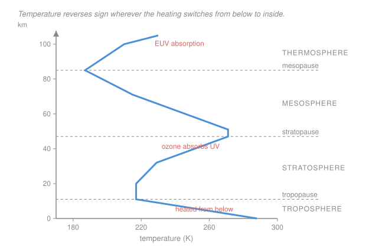

# Atmospheric Science · Lesson 1.1: Composition & vertical structure

> ⏱ ~15 min · Module 1: Atmospheric structure & thermodynamics · Builds on: [`thermodynamics-physics` 1.2](../../thermodynamics-physics/lessons/01-02-state-variables-equations-of-state.md) · Unlocks: 1.2 (hydrostatic equation)

## Why this matters

Every result in this course is a statement about a specific, peculiar fluid: a thin, stratified shell of gas, heated from the bottom in one layer and from the inside in another. Before you can derive a lapse rate or a jet stream you need to know what the air is made of, how much of it there is, and — the single most diagnostic fact about the atmosphere — **why its temperature falls with height, then rises, then falls, then rises again**. That zigzag is not a curiosity. It is a fingerprint of *where the radiation is absorbed*, and it explains why weather is confined to the bottom 10 km, why the ozone layer sits where it does, and why a volcanic plume spreads out into a flat anvil instead of continuing up.

## The idea

Two facts do most of the work.

**First: the atmosphere is absurdly thin.** Earth's radius is 6371 km; the height over which air pressure drops by a factor of $e$ is about 8.4 km. That's a ratio of about 758 to 1 — the atmosphere is proportionally thinner than the skin on an apple. Ninety-nine percent of its mass is below 32 km. When you see a photograph of the limb of the Earth from orbit, that blue haze really is the whole thing. This is why we can almost always treat the atmosphere as a *stack of horizontal layers*: horizontal distances (thousands of km) dwarf vertical ones (tens of km), so the vertical direction is special.

**Second: temperature reverses sign wherever the heating switches from "below" to "inside".** Air is nearly transparent to visible sunlight, so most sunlight sails through and is absorbed at the *ground*. A layer heated at its bottom is warm at the bottom and cool at the top — that's the troposphere, and because warm-below is exactly the unstable arrangement, it churns. (Greek *tropos*, "to turn": the troposphere is the turning layer, and turning is what weather is.)

But higher up, ozone soaks up ultraviolet light *in place*, depositing heat in the middle of a layer rather than at its base. Now the layer is warm at the *top* — the stratosphere, which is warm-above, stable, and therefore layered rather than churning (Latin *stratum*, "layer"). Above the ozone the heating runs out and temperature falls again through the mesosphere; higher still, the last few molecules absorb extreme ultraviolet and — because there is almost nothing there to share the energy with — get very hot indeed.

So the profile's shape is a map of the absorbers: **surface → ozone → nothing → oxygen and nitrogen at extreme UV**.

## The formal version

**Composition.** Dry air below about 100 km is extremely well mixed, because turbulent stirring is faster than molecular diffusive separation. That region is the **homosphere**; above it (the **heterosphere**) gases do separate by molar mass. In the homosphere the dry-air proportions are constant by volume:

| Gas | Fraction of dry air by volume |
|---|---|
| Nitrogen, $\mathrm{N_2}$ | 78.08 percent |
| Oxygen, $\mathrm{O_2}$ | 20.95 percent |
| Argon, $\mathrm{Ar}$ | 0.93 percent |
| Carbon dioxide, $\mathrm{CO_2}$ | about 0.042 percent (roughly 420 parts per million, rising) |

*In words: four numbers describe 99.99 percent of dry air, and the first three do not change with weather.* The mean molar mass is $M_d = 28.96\ \mathrm{g\,mol^{-1}}$, so the **specific gas constant for dry air** is

$$R_d = \frac{R_u}{M_d} = \frac{8314\ \mathrm{J\,kmol^{-1}\,K^{-1}}}{28.96\ \mathrm{kg\,kmol^{-1}}} = 287\ \mathrm{J\,kg^{-1}\,K^{-1}},$$

with $R_u$ the universal gas constant. This is the number that turns the ideal-gas law from [`thermodynamics-physics` 1.2](../../thermodynamics-physics/lessons/01-02-state-variables-equations-of-state.md) into a working atmospheric equation,

$$p = \rho R_d T,$$

where $p$ is pressure (Pa), $\rho$ density (kg m⁻³), and $T$ absolute temperature (K). *In words: air behaves as an ideal gas to better than one percent everywhere weather happens.*

The interesting gases are the **variable** ones, which are exactly the ones that matter for weather and climate: water vapor (0 to about 4 percent by volume, all of it below roughly 10 km), ozone (peaking near 25 km), and aerosols. Water vapor gets Module 2; ozone appears immediately below.

**The layers.** Define the **environmental lapse rate**

$$\Gamma \equiv -\frac{\partial T}{\partial z},$$

the rate at which the surrounding air's temperature *falls* with height $z$ (K km⁻¹). The sign convention is worth internalizing: $\Gamma > 0$ means temperature decreasing upward. The atmosphere splits into four **spheres**, separated by three **pauses** where $\Gamma$ changes sign:

| Layer | Top | $\Gamma$ | Why |
|---|---|---|---|
| Troposphere | tropopause, 8 km (poles) to 17 km (tropics) | $\approx +6.5$ K km⁻¹ | heated from below by the surface |
| Stratosphere | stratopause, $\approx 50$ km | negative (T rises to $\approx 271$ K) | ozone absorbs solar UV in place |
| Mesosphere | mesopause, $\approx 85$ km | positive (T falls to $\approx 187$ K, the coldest place on Earth) | ozone gone; $\mathrm{CO_2}$ radiates heat to space |
| Thermosphere | — | negative (T reaches 500–2000 K) | $\mathrm{O_2}$, $\mathrm{N_2}$ absorb extreme UV; almost no mass to heat |

*In words: two heating sources — the ground and the ozone layer — plus two places where heating runs out, give four layers and three reversals.*

Two consequences worth stating outright:

- **Weather lives in the troposphere.** Roughly 78 percent of the atmosphere's mass and essentially all of its water vapor sit below the tropopause. Above it, the negative lapse rate makes rising motion strongly resisted — which is why thunderstorm tops flatten into anvils when they hit the tropopause, and why airliners cruise just above it in smooth air.
- **The thermosphere's temperature is not "hot" in any useful sense.** Temperature measures the mean kinetic energy per molecule; at $10^{-9}$ of sea-level density there are so few molecules that the *heat content* is negligible. A satellite there is warmed by sunlight, not by the air.

## Picture

## Worked examples

**Example 1 (mechanical — density from the gas law).** What is the density of dry air at sea level, $p = 1013$ hPa and $T = 288$ K?

Convert first: $1013\ \mathrm{hPa} = 1.013\times10^5\ \mathrm{Pa}$ (one hectopascal is 100 Pa, and 1 hPa is the same as the older 1 millibar). Then

$$\rho = \frac{p}{R_d T} = \frac{1.013\times10^{5}}{287 \times 288} = \frac{1.013\times10^{5}}{8.266\times10^{4}} = 1.23\ \mathrm{kg\,m^{-3}}.$$

*Check.* About $1/800$ of water's density, which is the right order for a gas at one atmosphere; and the units work out as $\mathrm{Pa}/(\mathrm{J\,kg^{-1}\,K^{-1}}\cdot\mathrm{K}) = (\mathrm{J\,m^{-3}})/(\mathrm{J\,kg^{-1}}) = \mathrm{kg\,m^{-3}}$.

**Example 2 (why you'd care — how much atmosphere is there?).** Surface pressure is the weight of the air column overhead, per unit area: $p_s = m g$, where $m$ is the column mass per square metre. So

$$m = \frac{p_s}{g} = \frac{1.013\times10^{5}\ \mathrm{Pa}}{9.81\ \mathrm{m\,s^{-2}}} \approx 1.03\times10^{4}\ \mathrm{kg\,m^{-2}}.$$

Ten tonnes of air stand over every square metre. Two payoffs. First, if that air were compressed to sea-level density it would form a layer only $m/\rho = 1.03\times10^4/1.23 \approx 8.4\ \mathrm{km}$ deep — the same 8.4 km as the pressure scale height, which is no accident (Lesson 1.2 shows why). Second, this is how you convert a trace-gas mixing ratio into a column burden: 420 parts per million of $\mathrm{CO_2}$ by volume, scaled by the molar-mass ratio $44/29$, is about $6.4\times10^{-4}$ of the column by mass, or roughly 6.6 kg of $\mathrm{CO_2}$ per square metre of Earth's surface.

## Watch out

- **You might think** the stratosphere is warm because it is closer to the Sun. **Actually** the extra distance is a fraction of a percent of an astronomical unit and changes nothing; the stratosphere is warm because *ozone converts UV photons into heat right there*. Remove the ozone and the stratosphere would be cold and the reversal would vanish.
- **You might think** a negative lapse rate ("temperature inversion") is exotic. **Actually** the entire stratosphere is one, and small ones form near the ground on almost every calm clear night. What an inversion always means is *stability*: air lifted into warmer surroundings is denser than them and sinks back. That is why pollution and fog get trapped under them.
- **You might think** "lapse rate" and "how a parcel cools as it rises" are the same thing. **Actually** they are two different quantities that Module 1 keeps carefully apart: $\Gamma$ describes the *environment* you measure with a balloon, while the adiabatic lapse rate $\Gamma_d$ of Lesson 1.3 describes a *moving parcel*. Comparing the two is the whole content of stability theory.

## One-liner

> The atmosphere is an onion skin whose temperature reverses at every altitude where the heating stops coming from below and starts coming from inside.

## Problems

**P1 (🟢)** A weather balloon reports $T = 288$ K at the surface and $T = 249$ K at 6 km. Compute the environmental lapse rate over that layer in K km⁻¹, and say whether it is above or below the global-average tropospheric value of 6.5 K km⁻¹.

**P2 (🟡)** At 80 km the pressure is about $1.0\times10^{-2}$ hPa and the temperature about 199 K. Compute the density, and express it as a fraction of the sea-level density from Example 1. Comment on what this does to the phrase "the thermosphere is 1000 K hot."

**P3 (🔴, optional)** Argon makes up 0.93 percent of dry air by volume and has molar mass 40 g mol⁻¹, against dry air's mean 29 g mol⁻¹. (a) What fraction of the atmosphere's *mass* is argon? (b) In the heterosphere above roughly 100 km, gases separate by molar mass and the heavier ones are left behind. Predict, with one sentence of reasoning, whether the argon *fraction* at 300 km is larger or smaller than at sea level.

Solutions

**P1** The lapse rate is the temperature *drop* per kilometre:

$$\Gamma = -\frac{\Delta T}{\Delta z} = -\frac{249 - 288}{6 - 0} = \frac{39}{6} = 6.5\ \mathrm{K\,km^{-1}}.$$

That is exactly the global-average tropospheric value — a completely ordinary sounding. (Note the two minus signs: $\Delta T$ is negative, and the definition carries a minus, so $\Gamma$ comes out positive. A positive $\Gamma$ always means cooling upward.)

*Check.* Extrapolating, the tropopause near 11 km would sit at $288 - 6.5\times11 \approx 216$ K, which matches the standard-atmosphere value of 217 K.

**P2** Use $\rho = p/(R_d T)$ after converting to pascals: $1.0\times10^{-2}\ \mathrm{hPa} = 1.0\ \mathrm{Pa}$.

$$\rho = \frac{1.0}{287 \times 199} = \frac{1.0}{5.71\times10^{4}} = 1.75\times10^{-5}\ \mathrm{kg\,m^{-3}}.$$

As a fraction of sea level, $1.75\times10^{-5}/1.23 = 1.4\times10^{-5}$ — about one part in seventy thousand.

The comment: temperature is the mean kinetic energy *per molecule*, and at one seventy-thousandth of the density there are almost no molecules to carry that energy. The heat capacity per unit volume is smaller by the same factor, so a 1000 K thermosphere holds less thermal energy per cubic metre than air at 300 K near the ground. You would freeze there, not burn — the air cannot deliver heat to you faster than you radiate it away.

**P3** (a) Mass fraction is volume fraction weighted by the molar-mass ratio:

$$f_{\mathrm{mass}} = 0.0093 \times \frac{40}{29} = 0.0093 \times 1.38 = 0.0128,$$

about 1.28 percent of the atmosphere's mass — noticeably more than its 0.93 percent by volume, because argon is heavier than average air.

(b) **Smaller.** In diffusive equilibrium each species falls off with its *own* scale height, $H_i = R_u T/(M_i g)$, so heavy species have short scale heights and thin out fastest with altitude. Argon ($M = 40$) decays faster than $\mathrm{N_2}$ ($M = 28$) and far faster than atomic oxygen ($M = 16$), which is why the upper thermosphere is dominated by O, He and H rather than by argon.

*Check.* The same logic run downward explains why the homosphere has *constant* proportions: turbulent mixing there is much faster than diffusive separation, so no species gets to use its own scale height.

## Connections

- **Backward:** the ideal-gas law $p = \rho R_d T$ is [`thermodynamics-physics` 1.2](../../thermodynamics-physics/lessons/01-02-state-variables-equations-of-state.md)'s equation of state, rewritten per unit mass instead of per mole — that rewriting is what makes $R_d$ appear.
- **Forward:** [1.2](01-02-hydrostatic-equation-barometric-law.md) turns "the atmosphere is thin and layered" into the hydrostatic equation, and explains where the 8.4 km scale height of Example 2 comes from. The lapse-rate definition here is the environmental curve that Lesson 2.4 will compare against a lifted parcel to decide stability.
- **Sideways (astrophysics):** the same hydrostatic-plus-ideal-gas reasoning, applied to a self-gravitating ball instead of a shell, gives the equations of stellar structure in [`astrophysics` 2.1](../../astrophysics/lessons/02-01-equations-stellar-structure.md). A star is an atmosphere that never ends.
