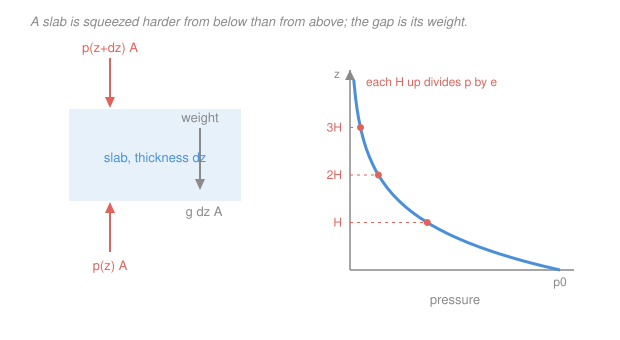

# Atmospheric Science · Lesson 1.2: The hydrostatic equation & the barometric law

> ⏱ ~15 min · Module 1: Atmospheric structure & thermodynamics · Builds on: [1.1 Composition & vertical structure](01-01-composition-vertical-structure.md), [`ode-refresher` 1.2](../../ode-refresher/lessons/01-02-separable-and-linear-first-order.md) · Unlocks: 1.3 (dry adiabatic lapse rate), 4.3 (geostrophic wind)

## Why this matters

Almost everything a meteorologist measures is a pressure, and almost everything they want to know is a height. Weather maps are drawn on *pressure* surfaces (the "500 hPa chart"), soundings are plotted against $\ln p$, and satellites retrieve temperature as a function of pressure. The hydrostatic equation is the exchange rate between the two — and it is astonishingly accurate: vertical accelerations in the atmosphere are typically $10^{-4}$ of gravity, so the balance holds to four decimal places outside of thunderstorm updrafts. Its integral, the barometric law, is the reason the atmosphere has a *scale height* at all, and the reason a warm air column is thicker than a cold one, which will turn out (in Lesson 4.4) to be the entire origin of the jet stream.

## The idea

Take a horizontal slab of air, area $A$, thickness $dz$. It is not going anywhere, so the forces on it cancel. There are three: pressure pushing **up** on its bottom face, pressure pushing **down** on its top face, and gravity pulling down on its mass.

Because the slab sits still, the upward push from below must exceed the downward push from above by exactly the slab's weight. That is the whole derivation. Pressure falls with height *because* the air above must be held up, and pressure at any level is nothing more than the weight of everything above it, per unit area.

Now make it quantitative. The weight of the slab is proportional to its density, and by the gas law density is proportional to pressure. So the *rate* at which pressure falls is proportional to the pressure itself — the defining property of an exponential. Pressure drops by a fixed *factor* for each fixed *rise in height*, never by a fixed amount. Climb 5.5 km and you have half the atmosphere below you, wherever you started. Climb another 5.5 km and you halve it again.

The constant that sets the tempo is the **scale height** $H$: the climb that divides pressure by $e$. It is bigger for warmer air (fast molecules are harder to pin down) and smaller for stronger gravity or heavier molecules. Everything about the vertical structure of any planet's atmosphere is in that one length.

## The formal version

**The hydrostatic equation.** Balance the slab: the net upward pressure force is $[p(z) - p(z+dz)]A$, and the weight is $\rho g\,A\,dz$. Setting them equal and letting $dz \to 0$,

$$\boxed{\ \frac{dp}{dz} = -\rho g\ }$$

with $\rho$ the density (kg m⁻³) and $g = 9.81\ \mathrm{m\,s^{-2}}$. *In words: pressure falls with height at a rate equal to the weight of air per unit volume.* Integrating from the top of the atmosphere down gives the interpretation directly:

$$p(z) = \int_z^{\infty} \rho g\,dz' = g \times (\text{mass of air above } z \text{ per unit area}).$$

**The barometric law.** Substitute the gas law $\rho = p/(R_d T)$ from [1.1](01-01-composition-vertical-structure.md):

$$\frac{dp}{dz} = -\frac{g}{R_d T}\,p \qquad\Longrightarrow\qquad \frac{dp}{p} = -\frac{dz}{H}, \qquad H \equiv \frac{R_d T}{g}.$$

This is separable — the technique from [`ode-refresher` 1.2](../../ode-refresher/lessons/01-02-separable-and-linear-first-order.md). If $T$ (and hence $H$) is constant, integrating from the surface gives

$$\boxed{\ p(z) = p_0\,e^{-z/H}, \qquad H = \frac{R_d T}{g}\ }$$

*In words: in an isothermal atmosphere, pressure decays exponentially with height, falling by a factor of $e$ every scale height.* For $T = 288$ K,

$$H = \frac{287 \times 288}{9.81} = 8430\ \mathrm{m} \approx 8.4\ \mathrm{km}.$$

Two readings of $H$, both worth carrying: it is the $e$-folding height of pressure, *and* it is the depth the whole atmosphere would have if it were compressed to uniform sea-level density (Example 2 of [1.1](01-01-composition-vertical-structure.md) found the same 8.4 km that way — the agreement is exact, not a coincidence).

**The hypsometric equation.** Real atmospheres are not isothermal, but the integral still closes if you use a *layer-mean* temperature $\overline{T}$. Integrating $dz = -H\,d\ln p$ between two pressure levels:

$$\boxed{\ Z_2 - Z_1 = \frac{R_d \overline{T}}{g}\,\ln\!\frac{p_1}{p_2}\ }$$

*In words: the vertical distance between two pressure surfaces — the layer's **thickness** — is proportional to the mean temperature of the air between them.* This is the single most useful diagnostic in synoptic meteorology: **thickness is a thermometer**. A forecaster reading a 1000-to-500 hPa thickness chart is reading the mean temperature of the lower half of the atmosphere without ever seeing a temperature.

## Picture

## Worked examples

**Example 1 (mechanical — pressure at altitude).** Denver sits near 1.6 km. Taking $p_0 = 1013$ hPa and a layer-mean temperature of 270 K, what is the pressure there?

$$H = \frac{R_d\overline{T}}{g} = \frac{287 \times 270}{9.81} = 7900\ \mathrm{m},$$

$$p = 1013\,e^{-1600/7900} = 1013\,e^{-0.2025} = 1013 \times 0.817 = 828\ \mathrm{hPa}.$$

*Check.* Observed station pressures in Denver run around 830 hPa, so the isothermal model is good to about one percent over this shallow layer. It degrades higher up, where the 6.5 K km⁻¹ lapse makes $\overline{T}$ a worse and worse stand-in.

**Example 2 (why you'd care — thickness as a thermometer).** Two soundings, both with surface pressure 1000 hPa. In the cold one the 1000-to-500 hPa layer averages 253 K; in the warm one it averages 273 K. How far apart are the 500 hPa surfaces?

$$Z_{\text{warm}} = \frac{287 \times 273}{9.81}\ln 2 = 7987 \times 0.693 = 5536\ \mathrm{m},$$
$$Z_{\text{cold}} = \frac{287 \times 253}{9.81}\ln 2 = 7402 \times 0.693 = 5130\ \mathrm{m}.$$

The warm column's 500 hPa surface stands **406 m higher**. Note what this does *not* say: both columns have the same 1000 hPa surface and the same amount of mass above 500 hPa. The warm column has not gained air; it has expanded. But now put the two columns side by side, and at any fixed altitude near 5 km the warm column has *higher pressure* than the cold one — a horizontal pressure gradient created purely by a horizontal temperature contrast. Aloft, that gradient drives a wind. Hold this example; Lesson 4.4 turns it into the thermal wind and the jet stream.

## Watch out

- **You might think** hydrostatic balance means the air is not moving. **Actually** it only means the *vertical acceleration* is negligible compared with $g$ — horizontal winds of 50 m s⁻¹ are perfectly hydrostatic. The balance fails only where vertical accelerations get large: deep convective updrafts, mountain waves, and the fine structure inside a thunderstorm.
- **You might think** you can use $p = p_0e^{-z/H}$ with the *surface* temperature. **Actually** the derivation needs $T$ constant through the layer, so the honest version uses the layer-*mean* $\overline{T}$. Using a 300 K surface value to get the pressure at 10 km overestimates $H$ badly and underestimates the pressure drop.
- **You might think** pressure and density fall off at the same rate. **Actually** they only do so where $T$ is constant. In general $\rho = p/(R_dT)$, so in the stratosphere, where $T$ *rises* with height, density falls off faster than pressure does.

## One-liner

> Pressure is the weight of the air overhead, so it decays by a constant factor per scale height $H = R_dT/g$ — and the thickness of a pressure layer is a direct read-out of its mean temperature.

## Problems

**P1 (🟢)** An aircraft cruises where the pressure is 250 hPa. Taking $p_0 = 1000$ hPa and a layer-mean temperature of 250 K, estimate the cruise altitude.

**P2 (🟡)** Mars: surface pressure 6.1 hPa, mean molar mass 43.3 g mol⁻¹ (mostly $\mathrm{CO_2}$), $g = 3.71\ \mathrm{m\,s^{-2}}$, mean temperature 210 K. (a) Compute the Martian specific gas constant and scale height. (b) Olympus Mons rises 22 km above the datum. What fraction of the surface pressure survives at its summit? Compare that fraction to the equivalent climb on Earth.

**P3 (🔴, optional)** Suppose instead of being isothermal the atmosphere has a *constant* lapse rate, $T(z) = T_0 - \Gamma z$. (a) Integrate the hydrostatic equation to show that the pressure follows a power law, $p = p_0\left(1 - \Gamma z/T_0\right)^{g/(R_d\Gamma)}$. (b) With $T_0 = 288$ K and $\Gamma = 6.5$ K km⁻¹, evaluate the exponent and the pressure at 11 km, and compare with the isothermal estimate that uses $H(288\ \mathrm{K})$.

Solutions

**P1** Invert the barometric law. With $H = 287\times250/9.81 = 7314\ \mathrm{m}$,

$$z = H\ln\!\frac{p_0}{p} = 7314 \times \ln 4 = 7314 \times 1.386 = 10\,140\ \mathrm{m} \approx 10.1\ \mathrm{km}.$$

*Check.* Typical jet cruise is 10–12 km, and the 250 hPa surface is the standard "jet level" chart — so the estimate lands where it should. Note the answer is $2H\ln 2$: two halvings, since 1000 to 250 hPa is a factor of 4.

**P2** (a) $R_{\mathrm{M}} = R_u/M = 8314/43.3 = 192\ \mathrm{J\,kg^{-1}\,K^{-1}}$, so

$$H_{\mathrm{M}} = \frac{192 \times 210}{3.71} = \frac{40\,320}{3.71} = 10\,900\ \mathrm{m} \approx 10.9\ \mathrm{km}.$$

Mars's atmosphere is *taller* than Earth's despite being colder and made of a heavier gas, because its gravity is only 38 percent of Earth's — and $g$ sits alone in the denominator.

(b) $p/p_0 = e^{-22\,000/10\,900} = e^{-2.02} = 0.133$, so about 13 percent of the surface pressure — roughly 0.8 hPa at the summit. On Earth the same 22 km climb gives $e^{-22\,000/8430} = e^{-2.61} = 0.074$, about 7 percent. The Martian atmosphere thins more slowly with height, which is exactly why a mountain more than twice Everest's height can exist there without poking out of the atmosphere entirely.

**P3** (a) Substitute $T(z) = T_0 - \Gamma z$ into $dp/p = -g\,dz/(R_dT)$:

$$\frac{dp}{p} = -\frac{g}{R_d}\frac{dz}{T_0 - \Gamma z}.$$

Integrate the right side with the substitution $u = T_0 - \Gamma z$, $du = -\Gamma\,dz$:

$$\ln\frac{p}{p_0} = \frac{g}{R_d\Gamma}\ln\!\frac{T_0 - \Gamma z}{T_0} \quad\Longrightarrow\quad p = p_0\left(1 - \frac{\Gamma z}{T_0}\right)^{g/(R_d\Gamma)}.$$

(b) The exponent is

$$\frac{g}{R_d\Gamma} = \frac{9.81}{287 \times 6.5\times10^{-3}} = \frac{9.81}{1.8655} = 5.26.$$

At $z = 11$ km, $1 - \Gamma z/T_0 = 1 - 71.5/288 = 0.7517$, so $p/p_0 = 0.7517^{5.26} = 0.223$ — that is, 223 hPa from a 1000 hPa surface. The isothermal estimate using $H(288) = 8430$ m gives $e^{-11\,000/8430} = 0.271$, or 271 hPa.

The power law is the better answer (the real 11 km pressure is 226 hPa). The isothermal version overestimates because it assumes the whole column stays at the surface temperature; the real column cools upward, its air is denser than assumed at every level, and pressure therefore falls faster than $e^{-z/H(T_0)}$ predicts.

*Check.* Two limits confirm the formula. As $\Gamma \to 0$ the exponent blows up while the base approaches 1, and the standard limit $(1 - a/n)^n \to e^{-a}$ recovers the isothermal exponential. And when $\Gamma z = T_0$ the temperature hits absolute zero and the pressure hits exactly zero — the model has a genuine top, unlike the isothermal one.

## Flashback

**From Lesson 1.1 (Composition & vertical structure):** At an altitude where $p = 500$ hPa and $T = 253$ K, (a) compute the air density. (b) Express it as a fraction of the sea-level value of $1.23\ \mathrm{kg\,m^{-3}}$, and say why that fraction is *not* simply the pressure ratio of 0.49.

Solution

(a) Convert to pascals ($500\ \mathrm{hPa} = 5.00\times10^{4}$ Pa) and use $p = \rho R_dT$ with $R_d = 287\ \mathrm{J\,kg^{-1}\,K^{-1}}$:

$$\rho = \frac{p}{R_dT} = \frac{5.00\times10^{4}}{287 \times 253} = \frac{5.00\times10^{4}}{7.261\times10^{4}} = 0.689\ \mathrm{kg\,m^{-3}}.$$

(b) As a fraction of sea level, $0.689/1.23 = 0.560$ — about 56 percent, against a pressure ratio of $500/1013 = 0.49$.

The two differ because density depends on *both* pressure and temperature: $\rho \propto p/T$. The air up here is colder (253 K against 288 K), and colder air is denser at any given pressure. The temperature factor $288/253 = 1.138$ multiplies the pressure ratio: $0.494 \times 1.138 = 0.562$, recovering the answer.

*Check.* This is exactly the caveat flagged in this lesson's "Watch out" — pressure and density fall off at the same rate only where $T$ is constant. In the stratosphere, where $T$ *rises* with height, the gap runs the other way and density falls off faster than pressure does.

## Connections

- **Backward:** the gas law and the layered picture come from [1.1](01-01-composition-vertical-structure.md); the integration is the separable first-order ODE of [`ode-refresher` 1.2](../../ode-refresher/lessons/01-02-separable-and-linear-first-order.md), with $\ln p$ playing the role of the natural vertical coordinate.
- **Forward:** [1.3](01-03-adiabatic-parcels-dry-lapse-rate.md) combines this equation with the first law to get the dry adiabatic lapse rate — the hydrostatic $dp/dz$ is precisely what makes a rising parcel expand. Example 2's warm-column-is-thicker result becomes the thermal wind in [4.4](04-04-thermal-wind-general-circulation.md).
- **Sideways (fluid dynamics):** this is the zero-velocity case of the momentum equation in [`fluid-dynamics` 1.5](../../fluid-dynamics/lessons/01-05-euler-equation.md) — drop every term except the vertical pressure gradient and gravity, and Euler's equation collapses to $dp/dz = -\rho g$. Hydrostatic balance is fluid statics.
