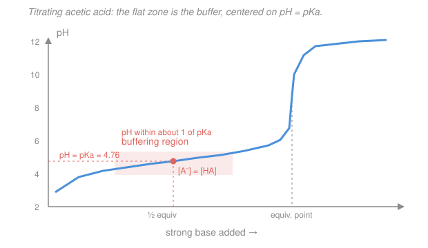

# Biochemistry · Lesson 1.1: Water, pH & buffers — the medium of life

> ⏱ ~15 min · Module 1: Proteins — Structure & Function · Builds on: prior chemistry (acid–base equilibrium — see [`general-chemistry`](../../general-chemistry/syllabus.md)) · Unlocks: [1.2 Amino acids & the peptide bond](01-02-amino-acids-peptide-bond.md)

## Why this matters

Before a single protein folds or an enzyme turns over, there is water — and water is not a passive backdrop. Its stickiness holds biomolecules together and its aversion to grease is the force that folds proteins and builds membranes. And because every reaction in a cell trades protons, life runs in a knife-thin pH window: your blood sits at 7.40, and a drift of 0.1 can put you in a hospital. This lesson gives you the one tool that keeps that window steady — the **buffer** — and the one equation that quantifies it, **Henderson–Hasselbalch**. You will use it in every remaining lesson: to titrate amino acids, to explain hemoglobin's Bohr effect, to score the thermodynamics of ATP.

## The idea

Water is a tiny magnet. Oxygen hogs the shared electrons, so each molecule has a slightly negative end and two slightly positive ends, and neighbors line up plus-to-minus. That fleeting plus-to-minus link is a **hydrogen bond**: individually weak, but each water molecule makes up to four of them, so collectively they make water cohesive, high-boiling, and an eager partner for anything else that carries charge or can hydrogen-bond.

The flip side is the star of protein folding. Drop a greasy (nonpolar) molecule into water and it *can't* hydrogen-bond. The surrounding water can't just shrug — it cages the intruder in an orderly shell to preserve its own bonds, and orderly means low entropy, which water hates. So water squeezes nonpolar things together, not because they attract each other, but to *minimize the caged surface* and release that trapped order. This is the **hydrophobic effect**: an entropy-driven shove that buries oily amino-acid side chains in a protein's core and lines up lipid tails into a membrane. It is the single largest force in folding.

Now pH. Water quietly swaps protons with itself, so a trace of it is always ionized. Add an acid and you tip the balance toward more $\ce{H+}$; add a base and you soak $\ce{H+}$ up. A **buffer** is a chemical shock absorber: a reservoir holding *both* a weak acid and its conjugate base at once, so incoming $\ce{H+}$ gets mopped up by the base half and incoming $\ce{OH-}$ gets fed by the acid half. The pH barely twitches — until one half runs out.

## The formal version

**Hydrogen bond.** An attraction between a hydrogen covalently bound to an electronegative atom (O, N) and a lone pair on a nearby O or N. Bond energy $\approx 20$ kJ/mol — about a tenth of a covalent bond. *In words: a weak, directional "sticky" link that water, DNA base pairs, and protein backbones all lean on.*

**Hydrophobic effect.** Burying nonpolar surface is favorable because of the entropy freed when caged water is released. Every spontaneous process obeys

$$\Delta G = \Delta H - T\,\Delta S,$$

with $\Delta G$ the free-energy change (spontaneous when negative), $\Delta H$ the enthalpy (heat) change, $T$ the absolute temperature (K), and $\Delta S$ the entropy (disorder) change. *In words: even when clumping oily groups gives little energy payoff ($\Delta H \approx 0$), the entropy gain $\Delta S > 0$ from freed water makes $\Delta G < 0$ — folding is driven by the solvent, not the solute.*

**Autoionization and pH.** Water self-ionizes, $\ce{2 H2O <=> H3O+ + OH-}$, with $K_w = [\ce{H+}][\ce{OH-}] = 10^{-14}$ at $25\,^\circ\text{C}$. We measure acidity on a log scale:

$$\text{pH} = -\log_{10}[\ce{H+}].$$

*In words: pH is just the negative log of the proton concentration — each pH unit is a tenfold change.* Neutral water has $[\ce{H+}] = 10^{-7}$, so pH 7.

**Weak acids, $K_a$ and $pK_a$.** A weak acid $\ce{HA}$ only partly dissociates:

$$\ce{CH3COOH <=> CH3COO- + H+}, \qquad K_a = \frac{[\ce{CH3COO-}][\ce{H+}]}{[\ce{CH3COOH}]}, \qquad pK_a = -\log_{10} K_a.$$

*In words: $K_a$ measures how willingly the acid sheds its proton; $pK_a$ is its log — a lower $pK_a$ means a stronger acid.* Acetic acid has $pK_a = 4.76$.

**Henderson–Hasselbalch.** Take $\log_{10}$ of the $K_a$ expression and rearrange. Starting from $[\ce{H+}] = K_a\,\dfrac{[\ce{HA}]}{[\ce{A-}]}$ and negating the log:

$$\boxed{\ \text{pH} = pK_a + \log_{10}\frac{[\ce{A-}]}{[\ce{HA}]}\ }$$

*In words: the pH equals the $pK_a$ plus the log of how much conjugate base you have relative to acid.* Three consequences worth memorizing:

- When $[\ce{A-}] = [\ce{HA}]$, the log is $0$, so $\text{pH} = pK_a$. This is the **half-equivalence point** — pick an acid whose $pK_a$ is near your target pH and you have a buffer.
- A tenfold excess of base gives $\text{pH} = pK_a + 1$; a tenfold excess of acid gives $pK_a - 1$. Outside that $\pm 1$ band the buffer is nearly spent.

**Buffer capacity.** The amount of strong acid or base a buffer absorbs per unit pH change. It scales with total buffer concentration and is **maximal when $[\ce{HA}] = [\ce{A-}]$**, i.e. at $\text{pH} = pK_a$ — the flattest point of the titration curve, where both partners are abundant and adding acid or base moves the ratio (and its log) the least.

## Picture

The curve is steep where either partner is scarce and flat where they are balanced. That flat shelf, centered on $\text{pH} = pK_a$, *is* the buffer: pour in base and you slide only a little along the plateau. Past the equivalence point one partner is gone and the pH runs away.

## Worked examples

**Example 1 (read the ratio — compute a buffer's pH).** You mix acetate buffer that is $0.10\ \text{M}$ acetic acid ($\ce{CH3COOH}$) and $0.15\ \text{M}$ sodium acetate ($\ce{CH3COO-}$). With $pK_a = 4.76$, plug straight into Henderson–Hasselbalch:

$$\text{pH} = 4.76 + \log_{10}\frac{[\ce{A-}]}{[\ce{HA}]} = 4.76 + \log_{10}\frac{0.15}{0.10} = 4.76 + \log_{10}(1.5) = 4.76 + 0.18 = 4.94.$$

The pH sits *above* $pK_a$ because there is more conjugate base than acid — exactly as the curve predicts (you're on the upper half of the plateau). Note only the **ratio** matters, not the absolute concentrations: dilute both tenfold and the pH is unchanged (the total concentration sets *capacity*, not pH).

**Example 2 (why buffers work — capacity, and why it peaks at $pK_a$).** Take $1\ \text{L}$ of a balanced acetate buffer: $0.10\ \text{mol}$ $\ce{CH3COOH}$ and $0.10\ \text{mol}$ $\ce{CH3COO-}$, so $\text{pH} = pK_a = 4.76$. Add $0.010\ \text{mol}$ of strong acid ($\ce{HCl}$). The incoming $\ce{H+}$ is mopped up by acetate, converting it to acetic acid:

$$\ce{CH3COO- + H+ -> CH3COOH}.$$

Acetate: $0.10 - 0.010 = 0.090\ \text{mol}$. Acetic acid: $0.10 + 0.010 = 0.11\ \text{mol}$. New pH:

$$\text{pH} = 4.76 + \log_{10}\frac{0.090}{0.11} = 4.76 + \log_{10}(0.818) = 4.76 - 0.087 = 4.67.$$

The pH dropped by only **0.09**. Now add that same $0.010\ \text{mol}$ $\ce{HCl}$ to $1\ \text{L}$ of pure water (pH 7): $[\ce{H+}] = 0.010\ \text{M}$, so $\text{pH} = -\log_{10}(0.010) = 2.0$ — a plunge of **5 pH units**. The buffer absorbed the same insult with 1/50th the disturbance.

Why is the resistance greatest at $\text{pH} = pK_a$? Because there the two partners are equal and *both large*, so converting a little of one into the other barely changes the ratio $[\ce{A-}]/[\ce{HA}]$, and pH tracks the **log** of that ratio. Start lopsided instead — say $0.19\ \text{mol}$ $\ce{HA}$ and $0.01\ \text{mol}$ $\ce{A-}$ — and the same $0.010\ \text{mol}$ acid nearly wipes out the acetate, sending the ratio and the pH tumbling. Balanced reserves, maximal capacity: that is why buffers are formulated to sit within about one unit of their $pK_a$.

## Watch out

- **You might think the hydrophobic effect is oily things *attracting* each other.** They don't — nonpolar groups barely interact. It's *water* pushing them together to reclaim its own entropy. The driving force lives in the solvent, which is why heating (larger $T\,\Delta S$) actually strengthens it over a range.
- **You might think a more concentrated buffer holds a different pH.** It doesn't. Henderson–Hasselbalch depends only on the *ratio* $[\ce{A-}]/[\ce{HA}]$. Concentration sets how *much* acid or base the buffer can swallow (capacity), not *where* it holds the pH.
- **You might reach for a $pK_a$ far from your target pH.** A buffer only works within roughly $pK_a \pm 1$. To hold blood at pH 7.4 you need an acid with $pK_a$ near 7 — which is why phosphate ($pK_a \approx 7.2$) and bicarbonate systems, not acetate, guard physiological pH.

## One-liner

> Water folds proteins by hating grease, and Henderson–Hasselbalch — $\text{pH} = pK_a + \log([\ce{A-}]/[\ce{HA}])$ — tells you a mixture of a weak acid and its conjugate base pins the pH near $pK_a$ and resists change most strongly when the two are equal.

## Problems

**P1 (🟢)** A buffer is $0.20\ \text{M}$ acetic acid and $0.050\ \text{M}$ sodium acetate ($pK_a = 4.76$). What is its pH? Is it above or below $pK_a$, and does that match the ratio?

**P2 (🟡)** You need a buffer at physiological pH 7.4 using the phosphate pair $\ce{H2PO4-}$ / $\ce{HPO4^2-}$, whose relevant $pK_a$ is 7.2. What ratio $[\ce{HPO4^2-}]/[\ce{H2PO4-}]$ must you prepare? (This is the intracellular buffer that keeps your cytoplasm near 7.2 — a direct bridge to the acid–base bookkeeping you'll do on amino acids in [1.2](01-02-amino-acids-peptide-bond.md) and on hemoglobin in [1.5](01-05-oxygen-binding-myoglobin-hemoglobin.md).)

**P3 (🔴, optional)** A $1\ \text{L}$ buffer holds $0.10\ \text{mol}$ $\ce{HA}$ and $0.10\ \text{mol}$ $\ce{A-}$ ($pK_a = 4.76$). (a) How many moles of strong base ($\ce{NaOH}$) can you add before the pH climbs to 5.76, one full unit above $pK_a$? (b) In one sentence, explain — pointing at the titration curve — why adding much more base past that point sends the pH running away.

Solutions

**P1** Plug the ratio into Henderson–Hasselbalch:

$$\text{pH} = 4.76 + \log_{10}\frac{[\ce{A-}]}{[\ce{HA}]} = 4.76 + \log_{10}\frac{0.050}{0.20} = 4.76 + \log_{10}(0.25) = 4.76 - 0.602 = 4.16.$$

The pH is *below* $pK_a$, which matches: there is four times as much acid as conjugate base, so the mixture is more acidic than the half-equivalence point. *Check.* $\log_{10}(0.25) = \log_{10}(1/4) = -\log_{10}4 \approx -0.60$ ✓, and being on the acid-rich side must pull pH under $pK_a$ ✓.

**P2** Solve for the ratio:

$$7.4 = 7.2 + \log_{10}\frac{[\ce{HPO4^2-}]}{[\ce{H2PO4-}]} \;\Longrightarrow\; \log_{10}\frac{[\ce{HPO4^2-}]}{[\ce{H2PO4-}]} = 0.2 \;\Longrightarrow\; \frac{[\ce{HPO4^2-}]}{[\ce{H2PO4-}]} = 10^{0.2} \approx 1.6.$$

You need about $1.6$ parts of the basic form ($\ce{HPO4^2-}$) per part acidic form ($\ce{H2PO4-}$). *Check.* pH is $0.2$ above $pK_a$, so base should modestly exceed acid ($>1$ but well under the tenfold that would give $pK_a + 1$) ✓.

**P3 (a)** Added $\ce{NaOH}$ converts $\ce{HA}$ to $\ce{A-}$ one-for-one: if $x$ mol goes in, $\ce{HA} = 0.10 - x$ and $\ce{A-} = 0.10 + x$. Target pH 5.76 means the ratio is $10^{(5.76 - 4.76)} = 10^1 = 10$:

$$\frac{0.10 + x}{0.10 - x} = 10 \;\Longrightarrow\; 0.10 + x = 1.0 - 10x \;\Longrightarrow\; 11x = 0.90 \;\Longrightarrow\; x \approx 0.082\ \text{mol}.$$

So about $0.082\ \text{mol}$ $\ce{NaOH}$. **(b)** After that, only $\approx 0.018\ \text{mol}$ $\ce{HA}$ remains to neutralize incoming base, so the buffer is nearly spent — you've reached the top of the plateau, and further $\ce{OH-}$ goes straight into raising $[\ce{OH-}]$, climbing the steep part of the curve toward the equivalence point. *Check.* At the start $\ce{HA} = \ce{A-}$ (pH $= pK_a$), and pushing to $pK_a + 1$ should consume most but not all of one partner — $0.082$ of the available $0.10$ mol, leaving a sliver ✓.

## Connections

- **Backward:** this is the acid–base equilibrium of prior chemistry ($K_a$, $K_w$, the log-scale pH — see [`general-chemistry`](../../general-chemistry/syllabus.md)) applied to the one solvent biology never leaves. Henderson–Hasselbalch is nothing but the $K_a$ expression wearing logarithms.
- **Forward:** [1.2 Amino acids & the peptide bond](01-02-amino-acids-peptide-bond.md) runs Henderson–Hasselbalch on *two or three* ionizable groups at once to titrate an amino acid and find its isoelectric point; the hydrophobic effect from this lesson becomes the main engine of folding in [1.4 The folding problem](01-04-the-folding-problem.md), and the same pH-sensing logic explains hemoglobin's Bohr effect in [1.5](01-05-oxygen-binding-myoglobin-hemoglobin.md).
- **Sideways:** the $\Delta G = \Delta H - T\,\Delta S$ that makes the hydrophobic effect entropy-driven is the same thermodynamic ledger you'll use to score ATP hydrolysis in [2.5 Bioenergetics](02-05-bioenergetics-atp-redox.md) — and it's the core of physical-chemistry thermodynamics generally. Buffering itself is what keeps your blood at 7.40, the bicarbonate system studied in physiology.
