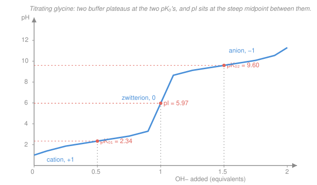

# Biochemistry · Lesson 1.2: Amino acids & the peptide bond

> ⏱ ~15 min · Module 1: Proteins — Structure & Function · Builds on: [1.1 Water, pH & buffers](01-01-water-ph-buffers.md) · Unlocks: [1.3 The four levels of protein structure](01-03-four-levels-protein-structure.md)

## Why this matters

A protein is a chain of amino acids, and almost everything a protein does — bind, catalyze, signal, fold — traces back to the chemistry of those 20 side chains and the one bond that links them. Before you can reason about a fold you have to reason about a monomer: what charge it carries at a given pH, and how it snaps to its neighbor. The good news is that you already own the tool. An amino acid is just a molecule with two (or more) titratable groups, so [1.1](01-01-water-ph-buffers.md)'s Henderson–Hasselbalch equation is the *entire* engine here — we're pointing it at a new target.

## The idea

Picture a glycine molecule as a tiny seesaw of charge. It has an acidic end (a carboxyl, $\ce{-COOH}$) that *wants to give up* a proton, and a basic end (an amino group, $\ce{-NH2}$) that *wants to grab one*. At the pH of your body, both get their wish at once: the carboxyl has already dropped its proton (now $\ce{-COO^-}$, negative) and the amino group has already stolen one (now $\ce{-NH3^+}$, positive). The molecule is doubly charged but nets to zero — a **zwitterion** (German for "hybrid ion"). Amino acids are almost never the neutral, uncharged structures drawn in intro classes; in water they are ions.

Now turn a dial called pH and watch. Crank it acidic (flood the solution with protons) and even the reluctant carboxyl holds onto its proton — the molecule goes net positive. Crank it basic (strip protons away) and even the clingy amino group surrenders — net negative. Somewhere in between is a pH where the positives and negatives exactly cancel: the molecule's *average* charge is zero. That pH is its **isoelectric point (pI)**, and finding it is the whole skill of this lesson.

The 20 side chains are just 20 flavors of "what's hanging off the middle carbon" — some greasy, some charged, some quirky. And the peptide bond that joins one amino acid to the next turns out to be stiffer and flatter than it looks, which is the seed of all protein structure.

## The formal version

**Anatomy.** Every (standard) amino acid is a central $\alpha$-carbon carrying four things: an amino group ($\ce{-NH2}$), a carboxyl group ($\ce{-COOH}$), a hydrogen, and a variable **side chain** $R$. The $R$ group is the only thing that differs between the 20.

**The 20 side chains, by chemistry.** You don't memorize 20 structures; you memorize five *bins*:

| Bin | Members (one-letter) | What defines them |
|---|---|---|
| Nonpolar / hydrophobic | G, A, V, L, I, M, F, W, P | greasy hydrocarbon/aromatic; flee water, pack the core |
| Polar uncharged | S, T, N, Q, Y, C | can H-bond; face the surface or line active sites |
| Acidic (−) | D, E | side-chain $\ce{-COOH}$, deprotonated at pH 7 → negative |
| Basic (+) | K, R, H | side-chain N that grabs a proton → positive at pH 7 |
| Special cases | G, P, C | see below |

*In words:* sort by how the side chain relates to water and to protons, and the table stops being a memory dump. The three "specials" earn their own line: **glycine** ($R = \text{H}$) is the smallest, so tiny and flexible it fits where nothing else can; **proline**'s side chain loops back and bonds its own backbone nitrogen, kinking the chain and killing rotation; **cysteine**'s $\ce{-SH}$ can oxidize and form a covalent $\ce{-S-S-}$ **disulfide bridge** to another cysteine — the one side chain that staples the fold shut.

**Zwitterion and net charge.** At a given pH, each ionizable group is protonated or not according to Henderson–Hasselbalch, $\text{pH} = pK_a + \log\frac{[\text{A}^-]}{[\text{HA}]}$. A group is $>50\%$ deprotonated once $\text{pH} > pK_a$. So:

- A **carboxyl** ($pK_a \approx 2$) is $\ce{-COO^-}$ (charge $-1$) whenever pH is above $\sim 2$; protonated and neutral below it.
- An **amino/guanidinium/imidazole** group ($pK_a \approx 9$–$12$, or $\sim 6$ for His) is $\ce{-NH3^+}$ (charge $+1$) whenever pH is *below* its $pK_a$; neutral above it.

Sum the charges of all groups to get the molecule's **net charge** at that pH.

**Isoelectric point.**

$$\text{pI} = \tfrac{1}{2}\left(pK_a^{(1)} + pK_a^{(2)}\right),$$

where the two $pK_a$'s are the ones **flanking the neutral (zwitterionic) species** — the group that loses its proton just *above* pI and the group that gains one just *below* it.

*In words:* find the form with net charge zero, then average the two $pK_a$'s that sit on either side of it — one guarding it from going positive, one from going negative. For a simple amino acid (only $\alpha\text{-COOH}$ and $\alpha\text{-NH}_3^+$) that's just the average of its two $pK_a$'s. For an amino acid with a *third* ionizable group, you must first pick the correct two.

## Picture

Read it left to right: start fully protonated (cation, $+1$). Adding base first strips the carboxyl — a buffer plateau centered on $pK_{a1}$, where pH changes slowly (half-titrated, $\text{pH} = pK_{a1}$). At one full equivalent the molecule is the pure zwitterion; the curve rockets through its steepest stretch, and the pH at that midpoint *is* the pI. Keep going and the amino group titrates around $pK_{a2}$, ending as the anion ($-1$). The flat parts are exactly the buffer regions of [1.1](01-01-water-ph-buffers.md) — an amino acid is a two-stage buffer.

## Worked examples

**Example 1 — Glycine: name the species, find the pI.** Glycine has $pK_{a1} = 2.34$ ($\alpha$-COOH) and $pK_{a2} = 9.60$ ($\alpha$-$\ce{NH3^+}$). What is it at pH 1, 6, and 11, and what is its pI?

Walk the two groups through each pH (a group is charged when pH is on the "still-holding-its-proton" side for that group type):

- **pH 1** (below both $pK_a$'s): carboxyl keeps its proton → neutral; amino keeps its proton → $+1$. Species is the **cation**, net $+1$:
$$\ce{^{+}H3N-CH2-COOH}.$$
- **pH 6** (above 2.34, below 9.60): carboxyl deprotonated → $-1$; amino still protonated → $+1$. Species is the **zwitterion**, net $0$:
$$\ce{^{+}H3N-CH2-COO^{-}}.$$
- **pH 11** (above both): carboxyl $-1$; amino deprotonated → $0$. Species is the **anion**, net $-1$:
$$\ce{H2N-CH2-COO^{-}}.$$

The neutral (zwitterion) form is flanked by both $pK_a$'s — the carboxyl below it and the amino above it — so

$$\text{pI} = \tfrac{1}{2}(2.34 + 9.60) = 5.97.$$

At pH 5.97 glycine is, *on average*, uncharged: it won't migrate in an electric field. (That's exactly how electrophoresis separates amino acids and proteins — each parks at its own pI.)

**Example 2 — Glutamate: pick the right two $pK_a$'s.** Glutamate (Glu, E) is *acidic*: besides the backbone $\alpha$-COOH and $\alpha$-$\ce{NH3^+}$ it carries a **side-chain carboxyl**. Its three $pK_a$'s are $pK_{a1} = 2.19$ ($\alpha$-COOH), $pK_R = 4.25$ (side-chain COOH), $pK_{a3} = 9.67$ ($\alpha$-$\ce{NH3^+}$). Find the net charge at pH 7 and the pI.

*Net charge at pH 7.* Take the groups one at a time:
- $\alpha$-COOH ($pK_a\,2.19$): pH 7 is well above → $\ce{-COO^-}$, charge $-1$.
- side-chain COOH ($pK_a\,4.25$): pH 7 above → $\ce{-COO^-}$, charge $-1$.
- $\alpha$-$\ce{NH3^+}$ ($pK_a\,9.67$): pH 7 is *below* → still $\ce{-NH3^+}$, charge $+1$.

$$q(\text{pH } 7) = (-1) + (-1) + (+1) = -1.$$

*pI.* March the molecule from very acidic to very basic and track net charge, watching for the form that hits **zero**:

| pH region | $\alpha$-COOH | side COOH | $\alpha$-$\ce{NH3^+}$ | net |
|---|---|---|---|---|
| below 2.19 | $0$ | $0$ | $+1$ | $+1$ |
| 2.19 – 4.25 | $-1$ | $0$ | $+1$ | $\mathbf{0}$ |
| 4.25 – 9.67 | $-1$ | $-1$ | $+1$ | $-1$ |
| above 9.67 | $-1$ | $-1$ | $0$ | $-2$ |

The net-zero species lives between the two **lowest** $pK_a$'s, so those are the flanking pair:

$$\text{pI} = \tfrac{1}{2}(2.19 + 4.25) = 3.22.$$

A low, acidic pI — the fingerprint of an acidic amino acid, because it takes an *acidic* environment to keep it from going net-negative. (Contrast a basic residue like lysine, whose extra $\ce{-NH3^+}$ pushes pI up near 9.7. The trick is always the same: find net zero, average its two neighbors.)

## Watch out

- **You might think** an amino acid's neutral form is the uncharged Lewis structure. **Actually** the net-neutral form in water is the *zwitterion* — doubly charged, canceling to zero. "Net charge zero" ≠ "no charges."
- **You might think** pI is always the average of the two extreme $pK_a$'s. **Actually** it's the average of the two $pK_a$'s **flanking the zwitterion** — for a triprotic amino acid those are two *adjacent* $pK_a$'s (the lowest pair for an acidic residue, the highest pair for a basic one), never the outermost pair.
- **You might think** each amino acid in a protein keeps its two backbone charges. **Actually** forming a peptide bond consumes the $\alpha$-carboxyl and $\alpha$-amino of the joined residues — only the chain's two *ends* and the *side chains* stay titratable, which is why protein pI depends mostly on side-chain composition.

## Concrete instance — the peptide bond is flat

The bond that links residue $n$ to residue $n{+}1$ is an **amide**: the carboxyl of one condenses with the amino of the next, splitting out water. Drawn naively it's a single C–N bond that should swivel freely. It doesn't. The nitrogen's lone pair delocalizes into the neighboring $\ce{C=O}$:

$$\ce{-C(=O)-N(H)- <=> -C(-O^{-})=N^{+}(H)-}$$

*In words:* the real bond is a **resonance hybrid**, roughly 40% double-bond in character. Consequences you can state without any calculation:

1. **It's planar.** The six atoms $C_\alpha$–C(=O)–N(H)–$C_\alpha$ lie in one plane — a rigid tile. A protein backbone is a string of these flat tiles connected by rotatable joints (the bonds *around* each $\alpha$-carbon, whose angles $\phi,\psi$ are the whole story of [1.3](01-03-four-levels-protein-structure.md)).
2. **It won't rotate.** Twisting the amide would break the partial $\pi$-bond, at a stiff energy cost (~85 kJ/mol). The backbone folds *between* tiles, not through them.
3. **It prefers *trans*.** The two bulky $C_\alpha$ groups sit on opposite sides of the flat bond (dihedral $\omega \approx 180^\circ$) to avoid bumping; *cis* ($\omega \approx 0^\circ$) is rare — mainly at X–proline bonds, where proline's ring makes the two options nearly a tie.

So "chain of amino acids" really means "chain of rigid, planar, *trans* amide tiles." That single structural fact is why proteins have discrete, foldable geometry instead of floppy noodle randomness.

## One-liner

> An amino acid's charge is just Henderson–Hasselbalch run on each group; its pI is the average of the two $pK_a$'s flanking its net-zero zwitterion — and the peptide bonds stringing them together are flat, rigid, *trans* tiles.

## Problems

**P1 (🟢)** Alanine has $pK_{a1} = 2.34$ ($\alpha$-COOH) and $pK_{a2} = 9.69$ ($\alpha$-$\ce{NH3^+}$). (a) Give its net charge at pH 1, pH 6, and pH 12. (b) Compute its pI.

**P2 (🟡)** Lysine (Lys, K) is a *basic* amino acid with three $pK_a$'s: $2.18$ ($\alpha$-COOH), $8.95$ ($\alpha$-$\ce{NH3^+}$), and $10.53$ (side-chain $\varepsilon$-$\ce{NH3^+}$). (a) What is its net charge at pH 7? (b) Which two $pK_a$'s flank the net-neutral form, and what is the pI? (c) In one sentence, why is lysine's pI high while glutamate's (Example 2) is low?

**P3 (🔴, optional — bridge to [1.3](01-03-four-levels-protein-structure.md))** A tripeptide Ala–Ser–Lys is assembled by two peptide bonds. (a) Counting all ionizable groups, how many titratable protons does the free tripeptide have — and how does that compare to the three amino acids titrated separately (Ala 2, Ser 2 backbone + a very high-$pK_a$ –OH we ignore, Lys 3)? (b) The measured backbone C–N peptide bond is about 1.33 Å, between a pure C–N single bond (1.49 Å) and a C=N double bond (1.27 Å). What does that intermediate length tell you, and name one geometric consequence for the folded chain.

Solutions

**P1.** (a) Same logic as glycine — carboxyl charged ($-1$) above $\sim$2.3, amino charged ($+1$) below $\sim$9.7.
- pH 1: below both → carboxyl neutral, amino $+1$ → net **$+1$** (cation, $\ce{^{+}H3N-CH(CH3)-COOH}$).
- pH 6: above 2.34, below 9.69 → $-1$ and $+1$ → net **$0$** (zwitterion).
- pH 12: above both → $-1$ and $0$ → net **$-1$** (anion).

(b) The zwitterion is flanked by both $pK_a$'s, so
$$\text{pI} = \tfrac{1}{2}(2.34 + 9.69) = \mathbf{6.02}.$$
Alanine's greasy methyl side chain isn't ionizable, so — like glycine — its pI is just the average of the two backbone $pK_a$'s, near neutral.

**P2.** (a) Group by group at pH 7:
- $\alpha$-COOH ($pK_a\,2.18$): pH 7 above → $-1$.
- $\alpha$-$\ce{NH3^+}$ ($pK_a\,8.95$): pH 7 *below* → $+1$.
- $\varepsilon$-$\ce{NH3^+}$ ($pK_a\,10.53$): pH 7 *below* → $+1$.
$$q(\text{pH } 7) = (-1) + (+1) + (+1) = \mathbf{+1}.$$

(b) Track net charge up the pH scale:

| pH region | $\alpha$-COOH | $\alpha$-$\ce{NH3^+}$ | $\varepsilon$-$\ce{NH3^+}$ | net |
|---|---|---|---|---|
| below 2.18 | $0$ | $+1$ | $+1$ | $+2$ |
| 2.18 – 8.95 | $-1$ | $+1$ | $+1$ | $+1$ |
| 8.95 – 10.53 | $-1$ | $0$ | $+1$ | $\mathbf{0}$ |
| above 10.53 | $-1$ | $0$ | $0$ | $-1$ |

The net-zero form is flanked by the two **highest** $pK_a$'s, so
$$\text{pI} = \tfrac{1}{2}(8.95 + 10.53) = \mathbf{9.74}.$$

(c) Lysine carries an *extra positive* group (the $\varepsilon$-amino), so you must climb to a high, basic pH to strip enough protons to reach net zero — pushing pI up; glutamate carries an extra *negative* (side-chain carboxyl), so it reaches net zero only at low, acidic pH, pulling pI down.

**P3.** (a) Assembling the peptide bonds consumes the internal $\alpha$-amino and $\alpha$-carboxyl groups (they become the amide linkages, no longer titratable). What survives in Ala–Ser–Lys: the **N-terminal $\alpha$-amino** (Ala's), the **C-terminal $\alpha$-carboxyl** (Lys's), and the **side chains** — here Lys's $\varepsilon$-amino (Ser's –OH has too high a $pK_a$ to count). That's **3** meaningful titratable groups, versus $2 + 2 + 3 = 7$ for the free amino acids. The lost four are the four backbone groups tied up in the two peptide bonds — the general rule that a protein's charge behavior is dominated by side chains plus its two termini.

(b) A C–N length *between* single and double is the direct signature of **partial double-bond (resonance) character**: the amide nitrogen's lone pair is delocalized into the carbonyl, so the bond order is between 1 and 2. Geometric consequence (any one): the peptide unit is **planar** (a rigid flat tile); the bond **cannot freely rotate** (twisting costs the $\pi$-bond energy); the linkage strongly prefers **trans**. All three restrict the backbone to rotating only at the $\alpha$-carbons — the $\phi,\psi$ angles that [1.3](01-03-four-levels-protein-structure.md) plots on the Ramachandran diagram.

## Connections

- **Backward:** this lesson is nothing but [1.1](01-01-water-ph-buffers.md)'s Henderson–Hasselbalch aimed at a molecule with two or three titratable groups; each buffer plateau in the titration curve is a [1.1](01-01-water-ph-buffers.md) buffer region, and pI is where the two cancel.
- **Forward:** side-chain chemistry (which residues are greasy, charged, or special) drives folding in [1.3](01-03-four-levels-protein-structure.md) and [1.4](01-04-the-folding-problem.md); the planar, *trans* peptide bond sets up the backbone $\phi,\psi$ angles and the Ramachandran plot in [1.3](01-03-four-levels-protein-structure.md); histidine's near-physiological side-chain $pK_a$ returns as the pH sensor behind hemoglobin's Bohr effect in [1.5](01-05-oxygen-binding-myoglobin-hemoglobin.md).
- **Sideways (organic chemistry):** the peptide bond is a resonance-stabilized amide and its formation is a condensation (dehydration) reaction — the same amide resonance and acid/base $pK_a$ reasoning you meet in [`organic-chemistry`](../../organic-chemistry/syllabus.md); electrophoretic separation by pI is a workhorse of [`analytical-chemistry`](../../analytical-chemistry/syllabus.md).
