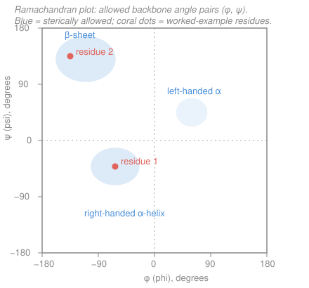

# Biochemistry · Lesson 1.3: The four levels of protein structure

> ⏱ ~15 min · Module 1: Proteins — Structure & Function · Builds on: [1.2 Amino acids & the peptide bond](01-02-amino-acids-peptide-bond.md), [1.1 Water, pH & buffers](01-01-water-ph-buffers.md) · Unlocks: [1.4 The folding problem](01-04-the-folding-problem.md)

## Why this matters

A protein is a one-dimensional string of amino acids that somehow becomes a three-dimensional machine — an enzyme that accelerates a reaction a millionfold, a channel that ferries ions, an antibody that grips a virus. The magic is that the string carries its own folding instructions: **sequence dictates structure dictates function**. To read a protein you learn its four nested levels of organization, and one small diagram — the Ramachandran plot — that tells you, from two angles per residue, which shapes the backbone is even allowed to take.

## The idea

Think of the folded protein as a hierarchy you can zoom through, coarsest to finest scale reversed — actually finest to coarsest:

- **Primary** — the *sequence*: which amino acids, in which order, linked by peptide bonds. This is the one-dimensional text.
- **Secondary** — *local* repeating shapes the backbone settles into over a short stretch: the coiled **α-helix** and the extended, side-by-side **β-sheet**. Both are held together by **backbone** hydrogen bonds — the side chains aren't invited.
- **Tertiary** — the *whole chain's* 3D fold: how those helices and sheets pack together into a compact blob, driven by **side-chain** interactions (especially burying the greasy hydrophobic ones away from water).
- **Quaternary** — how *several folded chains* (subunits) assemble into one functional complex, like hemoglobin's four subunits.

Here's the key move that makes secondary structure predictable. Each amino acid's backbone has three bonds in a row, but the middle one — the peptide bond itself — is **locked flat** (we'll see why). So the only freedom per residue is *two* rotations: an angle called **φ (phi)** just before the α-carbon and **ψ (psi)** just after. Two numbers per residue fix the backbone's local shape. Plot every residue's (φ, ψ) on a grid and you get the Ramachandran plot — and most of that grid is *forbidden*, because the atoms would crash into each other. The few allowed islands *are* the α-helix and β-sheet.

## The formal version

**Primary structure** is the covalent sequence, written N-terminus → C-terminus, of residues joined by peptide (amide) bonds. *In words: the ordered list of amino acids, read from the free-amino end to the free-carboxyl end.*

**The planar peptide bond.** The peptide C–N bond has partial double-bond character (resonance shares the carbonyl's electrons into the C–N bond), so the six atoms of the amide unit — $\ce{C_\alpha}$, C, O, N, H, and the next $\ce{C_\alpha}$ — lie in **one rigid plane**. The dihedral angle about this bond, $\omega$ (omega), is essentially frozen at $180^\circ$ (trans). *In words: the peptide bond is flat and can't twist, so the backbone is a chain of stiff plates.* That leaves exactly two rotatable bonds per residue:

$$\varphi = \text{rotation about the } \ce{N-C_\alpha} \text{ bond}, \qquad \psi = \text{rotation about the } \ce{C_\alpha-C} \text{ bond}.$$

*In words: φ and ψ are the two hinges on either side of each α-carbon — the only freedom the backbone has.*

**The Ramachandran plot** is the map of $\varphi$ (x-axis) versus $\psi$ (y-axis), each from $-180^\circ$ to $+180^\circ$. Because neighboring backbone atoms (the carbonyl O, the amide H, the side-chain $\ce{C_\beta}$) are hard spheres that can't overlap, most (φ, ψ) pairs are **sterically forbidden**. The allowed islands are:

- **Right-handed α-helix:** $\varphi \approx -60^\circ,\ \psi \approx -45^\circ$. The backbone coils; every carbonyl $\ce{C=O}$ of residue $i$ hydrogen-bonds to the amide $\ce{N-H}$ of residue $i+4$, straight down the axis. *In words: a spiral staircase stitched together by backbone H-bonds four residues apart.*
- **β-sheet (extended):** $\varphi \approx -120^\circ,\ \psi \approx +120^\circ$. The backbone stretches nearly straight; strands lie alongside each other and H-bond *between* strands. *In words: pleated ribbons zipped edge-to-edge by backbone H-bonds.*
- **Left-handed α-helix:** $\varphi \approx +60^\circ,\ \psi \approx +45^\circ$ — a small, mostly forbidden region only glycine comfortably reaches (positive φ clashes a side-chain $\ce{C_\beta}$).

**Tertiary structure** is the complete 3D arrangement of one polypeptide — how its secondary-structure elements combine into recurring **motifs** (e.g. β-α-β) and independently folding **domains**. It is stabilized by *side-chain* interactions: the hydrophobic effect (nonpolar side chains buried away from water — see [1.1](01-01-water-ph-buffers.md)), plus hydrogen bonds, salt bridges, and disulfide bonds. *In words: the fold of the whole chain, set mostly by hiding greasy residues in the core.*

**Quaternary structure** is the assembly of multiple folded chains (**subunits**) into one complex, held by the same weak interactions across subunit interfaces. *In words: how finished chains snap together into the working unit.*

## Picture

## Worked examples

**Example 1 (place two residues on the plot).** You're given backbone angles for two residues and asked which secondary structure each belongs to.

- **Residue 1:** $\varphi = -63^\circ,\ \psi = -42^\circ$. Both angles are moderately negative — this lands in the lower-left island. That's the **right-handed α-helix** region (textbook helix is $\approx(-57^\circ, -47^\circ)$). So residue 1 sits in a helix.
- **Residue 2:** $\varphi = -135^\circ,\ \psi = +135^\circ$. Strongly negative φ with strongly positive ψ lands in the upper-left island: the **β-sheet (extended)** region.

The recipe: read the *signs and rough sizes* of φ and ψ, then match to an island. Negative/negative → α; negative-φ/positive-ψ → β; positive/positive → the rare left-handed corner. These are the two dots on the figure.

**Example 2 (predict how a substitution perturbs a level).** Two classic mutations, two different levels hit.

*(a) Gly → Pro in the middle of an α-helix.* Proline is the odd one out twice over: its side chain loops back and bonds to the backbone nitrogen, so (i) that nitrogen has **no amide H to donate** the $i \leftarrow i{+}4$ backbone hydrogen bond a helix needs, and (ii) the ring **rigidly fixes** φ near $-60^\circ$, forbidding the small adjustments the helix requires further along. Result: the helix **kinks or breaks** at that point — a **secondary-structure** disruption. (Proline is a notorious "helix breaker"; it shows up instead at the *starts* of helices and in turns.)

*(b) A buried hydrophobic residue → a charged one (say Val → Glu) in the protein's core.* Primary structure changes by one letter; the local backbone may still helix or sheet fine, so secondary is largely spared. The damage is to **tertiary structure**: you've dropped a charged, heavily hydrated group into a dry, greasy core. Stripping its hydration shell and stranding its charge with no counterion costs a lot of free energy (the hydrophobic effect from [1.1](01-01-water-ph-buffers.md) run in reverse), so the fold is **destabilized** — often it partially unfolds. If that residue sat at a subunit interface, **quaternary** assembly breaks too. (This is exactly the logic of sickle-cell hemoglobin, where a surface Glu → Val does the opposite and creates a sticky patch.)

## Watch out

- **You might think the backbone can twist freely, so any (φ, ψ) is possible.** It can't — the peptide bond is flat ($\omega$ frozen at $180^\circ$), and steric clashes forbid *most* of the Ramachandran map. That emptiness is the whole point: only a few backbone shapes exist, which is why proteins have just a handful of secondary-structure types.
- **You might think side chains hold α-helices and β-sheets together.** They don't — secondary structure is stitched by **backbone** $\ce{C=O \bond{...} H-N}$ hydrogen bonds. Side chains do their work one level up, in **tertiary** packing. Keep the levels straight: backbone → secondary, side chains → tertiary/quaternary.
- **You might treat glycine and proline as ordinary residues.** They're the exceptions that prove the steric rule. Glycine has no $\ce{C_\beta}$ (just an H), so it escapes clashes and roams far more of the plot — including the left-handed region. Proline's ring clamps φ and kills its backbone donor H. Both are special cases you read straight off the Ramachandran plot.

## One-liner

> Sequence (primary) dictates the fold: backbone H-bonds set local shape (α-helix, β-sheet), side chains pack the core (tertiary) and glue subunits (quaternary) — and because the peptide bond is planar, only φ and ψ are free, so most of the Ramachandran map is forbidden.

## Problems

**P1 (🟢)** For each residue, name the secondary structure its backbone angles indicate:
(a) $\varphi = -57^\circ,\ \psi = -47^\circ$; (b) $\varphi = -119^\circ,\ \psi = +113^\circ$; (c) $\varphi = +55^\circ,\ \psi = +45^\circ$ (and say which single amino acid you'd most expect here).

**P2 (🟡)** A structural biologist mutates a **leucine buried in the hydrophobic core** to a **lysine**. Which level(s) of structure are most perturbed, and does the fold become more or less stable? Explain in terms of the hydrophobic effect. (Bridges to [1.4 The folding problem](01-04-the-folding-problem.md).)

**P3 (🔴, optional)** The peptide bond fixes $\omega \approx 180^\circ$, leaving two free dihedrals per residue. If φ and ψ could each roam the full $360^\circ$ independently, the map would be one big torus — yet real proteins populate only small islands. Explain physically why the allowed area is so small, and why **glycine** is the exception that populates far more of it.

Solutions

**P1**
(a) $(-57^\circ, -47^\circ)$ — both moderately negative, lower-left island → **right-handed α-helix** (this is the canonical helix pair).
(b) $(-119^\circ, +113^\circ)$ — negative φ, positive ψ, upper-left island → **β-sheet (extended strand)**.
(c) $(+55^\circ, +45^\circ)$ — positive/positive, upper-right → **left-handed α-helix** region. Positive φ forces a normal side chain's $\ce{C_\beta}$ into a steric clash, so this spot is essentially reserved for **glycine**, which has no $\ce{C_\beta}$.

**P2** Primary changes by one residue; the local backbone can still adopt its helix/sheet, so **secondary** structure is largely unaffected. The blow lands on **tertiary** structure (and **quaternary** if the residue is at a subunit interface). Lysine carries a long, positively charged, strongly hydrated side chain; burying it in the nonpolar core forces you to strip its hydration shell and strand its charge with no counterion — a large desolvation/electrostatic penalty. That is the **hydrophobic effect run backward** ([1.1](01-01-water-ph-buffers.md)): the core is stable precisely because greasy groups hide there and polar/charged groups stay in water. So the fold becomes **less stable** (unfavorable ΔΔG of folding) — it may loosen into a molten globule or unfold outright. Core-packing mutations like this are among the most destabilizing you can make.

**P3** Two effects shrink the map. First, the peptide bond's partial double-bond character freezes $\omega$, so each residue offers only φ and ψ — two hinges, not three. Second, even those two are heavily constrained by **hard-sphere steric clashes**: for most (φ, ψ) combinations the backbone carbonyl O, the amide H, or the side-chain $\ce{C_\beta}$ of adjacent residues would overlap. Only a few conformations avoid every collision — the α and β islands, plus a sliver of left-handed α — so a large majority of the torus is forbidden (allowed area is roughly on the order of only ~10–25%). **Glycine** has just a hydrogen where every other residue has a $\ce{C_\beta}$; removing that bulky atom eliminates most of the clashes, so glycine accesses a much larger allowed area — including positive-φ regions like the left-handed helix — which is exactly why it's favored in tight turns where the backbone must bend sharply.

## Flashback

**From Lesson 1.2 (Amino acids & the peptide bond):** Glutamate (Glu) has $pK_a$ values $2.2$ (α-COOH), $4.3$ (side-chain γ-COOH), and $9.7$ (α-$\ce{NH3+}$). (a) Compute its isoelectric point, pI. (b) Using Henderson–Hasselbalch, find Glu's net charge at $\text{pH} = 4.0$.

Solution

**(a)** Glutamate is acidic — it has two carboxyls and one amino group. The pI is the pH midway between the two $pK_a$ values that flank the **neutral (zero-charge) species**. Walking up from low pH, the molecule goes $+1 \to 0$ as the first COOH deprotonates and $0 \to -1$ as the second does, so the neutral form is bracketed by the two lowest $pK_a$'s:

$$\text{pI} = \frac{2.2 + 4.3}{2} = 3.25.$$

**(b)** Henderson–Hasselbalch gives the fraction of each group in its **deprotonated** form: $f_{\text{deprot}} = \dfrac{1}{1 + 10^{\,(pK_a - \text{pH})}}$. At pH 4.0:

- α-COOH ($pK_a=2.2$): $f = \dfrac{1}{1+10^{2.2-4.0}} = \dfrac{1}{1+10^{-1.8}} = \dfrac{1}{1.0158} \approx 0.98$ deprotonated → charge $\approx -0.98$.
- γ-COOH ($pK_a=4.3$): $f = \dfrac{1}{1+10^{4.3-4.0}} = \dfrac{1}{1+10^{0.3}} = \dfrac{1}{1+2.0} \approx 0.33$ deprotonated → charge $\approx -0.33$.
- α-$\ce{NH3+}$ ($pK_a=9.7$): pH is far below $pK_a$, so essentially fully protonated → charge $\approx +1.00$.

$$q_{\text{net}} \approx (-0.98) + (-0.33) + (+1.00) = -0.31.$$

*Check.* pH 4.0 sits just above the pI of 3.25, so the net charge should be slightly negative — and $-0.31$ is exactly that. ✓

## Connections

- **Backward:** the peptide bond and the 20 side chains from [1.2](01-02-amino-acids-peptide-bond.md) are the raw material — primary structure *is* that sequence — and the hydrophobic effect from [1.1](01-01-water-ph-buffers.md) is the force that drives tertiary packing.
- **Forward:** [1.4 The folding problem](01-04-the-folding-problem.md) asks *how* a sequence finds its one native fold (Anfinsen, folding funnels, chaperones) and what goes wrong when it misfolds; [1.5](01-05-oxygen-binding-myoglobin-hemoglobin.md) makes quaternary structure do work, as hemoglobin's four subunits cooperate to bind O₂.
- **Sideways (organic chemistry):** the planar peptide bond is the same amide **resonance** you meet in [organic-chemistry](../../organic-chemistry/syllabus.md) — delocalizing the carbonyl lone pair into the C–N bond is exactly what gives it double-bond character and locks the plane.
