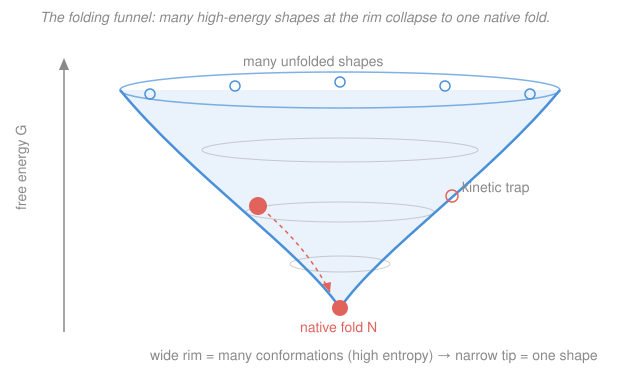

# Biochemistry · Lesson 1.4: The folding problem

> ⏱ ~15 min · Module 1: Proteins — Structure & Function · Builds on: [1.3 The four levels of protein structure](01-03-four-levels-protein-structure.md) · Unlocks: [1.5 Oxygen binding: myoglobin & hemoglobin](01-05-oxygen-binding-myoglobin-hemoglobin.md)

## Why this matters

A protein is synthesized as a floppy one-dimensional string, yet within milliseconds to seconds it snaps into one precise three-dimensional machine — the same shape every time. Nobody positions the atoms; the sequence does it alone. That single fact ([Anfinsen](#the-formal-version)) is the reason a gene can encode a working enzyme. And the whole delicate act rides on a *tiny* net free energy — the difference between a functioning cell and Alzheimer's, Parkinson's, or a prion is a few kilojoules per mole tipping the wrong way.

## The idea

Picture the freshly made chain thrashing in water. Its **hydrophobic** (oily, nonpolar) side chains — Leu, Ile, Val, Phe — are a problem: water can't hydrogen-bond to them, so it cages each one in a shell of unnaturally ordered molecules. That ordering costs water its freedom. The chain's escape route is to **collapse those greasy side chains together into a buried core**, out of the water — which sets all that caged water free to tumble around as normal bulk liquid. The huge gain in *water's* entropy is the main engine of folding. This is the **hydrophobic effect**, the same water-driven force that made oil droplets bead up back in [1.1](01-01-water-ph-buffers.md); here it folds a protein.

But which of the astronomically many shapes does the chain find, and how so fast? Not by blind trial and error — that would take longer than the universe has existed (**Levinthal's paradox**, Example 1). The resolution: the energy landscape isn't flat. It's a **funnel** (see the Picture). Almost every partial step that buries a bit more oil or forms a native contact is slightly downhill, so the chain is *biased* toward the native fold from wherever it starts — it rolls down the walls rather than searching the whole floor. **Chaperone** proteins help by keeping crowded chains from clumping while they roll, but they don't invent the shape — the sequence already contains it.

## The formal version

**Anfinsen's experiment (the thermodynamic hypothesis).** Anfinsen took ribonuclease, a 124-residue enzyme, and *denatured* it — unfolded it completely with urea and a reducing agent that broke its disulfide bonds. Activity vanished. When he removed the urea and reductant, the enzyme spontaneously **refolded to full activity**, disulfides reforming in exactly the native pairing.

> *In words: everything needed to specify the fold is already written in the amino-acid sequence — the native structure is the one the sequence settles into on its own.*

The interpretation: the native state is the **global free-energy minimum** accessible to the chain under physiological conditions. Folding is spontaneous because it lowers free energy:

$$\Delta G_{\text{fold}} = G_{\text{native}} - G_{\text{unfolded}} = \Delta H_{\text{fold}} - T\,\Delta S_{\text{fold}} < 0,$$

where $\Delta H$ is the enthalpy change (J/mol), $T$ the absolute temperature (K), and $\Delta S$ the entropy change (J·mol⁻¹·K⁻¹). *In words: a process runs on its own when it lowers $G$; folding does, barely.* The punchline of protein stability is that punchline word — **barely**: the net $\Delta G_{\text{fold}}$ of a typical protein is only about $-20$ to $-60$ kJ/mol, the worth of a couple of hydrogen bonds. Proteins are **marginally stable** on purpose.

Why so small? Because $\Delta S_{\text{fold}}$ is a tug-of-war between two large, opposite entropy terms:

$$\Delta S_{\text{fold}} = \underbrace{\Delta S_{\text{solvent}}}_{\text{large } (+),\ \text{hydrophobic}} + \underbrace{\Delta S_{\text{conf}}}_{\text{large } (-),\ \text{chain freezes}}.$$

*In words: folding sets ordered water free (entropy up) but locks the once-floppy chain into one shape (entropy down); the two nearly cancel, leaving a small net $\Delta G$.* The favorable $\Delta S_{\text{solvent}}$ from burying hydrophobic surface is the dominant driving force; the enthalpic reward from newly formed hydrogen bonds, van der Waals contacts, and salt bridges in the packed core ([1.3](01-03-four-levels-protein-structure.md)) helps, but folding would fail outright without the hydrophobic term (Example 2).

**Levinthal's paradox.** If a chain of $N$ residues had to *randomly search* its shapes, and each of the $N-1$ backbone units could take, say, 3 conformations, there are $\sim 3^{N-1}$ possibilities. Trying each in $\sim 10^{-13}$ s (a bond vibration) would still take astronomically longer than the age of the universe (Example 1). Yet real proteins fold in $10^{-3}$–$10^{0}$ s. **Resolution:** folding is not a search — the **funnel-shaped landscape** biases every step downhill toward the native basin.

**Chaperones.** Molecular chaperones (e.g. the Hsp70 family, and the GroEL/GroES barrel) bind exposed hydrophobic patches on not-yet-folded chains and release them in ATP-driven cycles. They **raise the yield and speed** of correct folding — chiefly by preventing chains from sticking to *each other* (aggregation) in the crowded cell — but they do **not** change the native structure. Anfinsen still holds: the sequence dictates the fold; the chaperone just clears the runway.

**Misfolding disease.** For some sequences an **alternative** low-energy state exists: **amyloid**, a fiber of stacked intermolecular β-sheets ("cross-β"). It can sit *lower* in free energy than the native fold but is normally walled off by a high kinetic barrier. When a protein slips into it — through mutation, aging, or high concentration — the fibers deposit and cause disease (amyloid-β in Alzheimer's, α-synuclein in Parkinson's, islet amyloid in type-2 diabetes). **Prions** are the extreme case: a misfolded form that acts as a *template*, converting native copies to the misfolded shape — a conformational chain reaction that is infectious (Creutzfeldt–Jakob, BSE).

## Picture

The vertical axis is free energy $G$ (down is better); the width is conformational entropy — how many shapes live at that level. The wide rim holds a multitude of high-energy unfolded conformations; the single point at the bottom is the native fold. A chain starting anywhere on the rim rolls *down* the biased walls to the native basin instead of wandering the whole floor. A side dimple is a **kinetic trap** — a partly folded shape that briefly holds the chain up.

## Worked examples

**Example 1 (Levinthal — why random search is hopeless).** A 101-residue protein has $100$ backbone units; suppose each can adopt $3$ conformations. Number of possible shapes:

$$3^{100} = 10^{100\log_{10}3} = 10^{100(0.477)} = 10^{47.7} \approx 5\times10^{47}.$$

At $10^{-13}$ s to sample one shape, exhaustively trying them all takes

$$t = 5\times10^{47} \times 10^{-13}\ \text{s} = 5\times10^{34}\ \text{s}.$$

Compare to the age of the universe, $\approx 4\times10^{17}$ s:

$$\frac{t}{t_{\text{universe}}} = \frac{5\times10^{34}}{4\times10^{17}} \approx 1\times10^{17}.$$

A blind search would take about $10^{17}$ times the age of the universe — yet the real protein folds in under a second. Random sampling is *impossible*; the funnel, by making each downhill step likely, is the only way out.

**Example 2 (the marginal $\Delta G$ balance, and a destabilizing mutation).** Take illustrative order-of-magnitude numbers for a small protein folding at body temperature, $T = 310$ K. Split the entropy into its two pieces as energies $T\Delta S$ (kJ/mol):

| Contribution | Value (kJ/mol) | Sign for folding |
|---|---|---|
| $\Delta H_{\text{fold}}$ (H-bonds, vdW, salt bridges) | $-70$ | favorable |
| $T\Delta S_{\text{solvent}}$ (hydrophobic — water freed) | $+150$ | favorable |
| $T\Delta S_{\text{conf}}$ (chain loses freedom) | $-190$ | unfavorable |

Assemble $\Delta G_{\text{fold}} = \Delta H_{\text{fold}} - T\Delta S_{\text{fold}}$, with $T\Delta S_{\text{fold}} = T\Delta S_{\text{solvent}} + T\Delta S_{\text{conf}} = 150 + (-190) = -40$ kJ/mol:

$$\Delta G_{\text{fold}} = (-70) - (-40) = -30\ \text{kJ/mol}.$$

Folded, but only by $-30$ kJ/mol — three big terms nearly cancel to a small net. **Now delete the hydrophobic effect** (imagine burying the core cost no water ordering, $T\Delta S_{\text{solvent}} = 0$): then $T\Delta S_{\text{fold}} = -190$ and

$$\Delta G_{\text{fold}} = (-70) - (-190) = +120\ \text{kJ/mol} > 0 \quad\Rightarrow\quad \textbf{would not fold.}$$

The hydrophobic term is the difference between a folded protein and a puddle. **A destabilizing mutation** — say replacing a buried Leu with a polar Asn, which no longer sheds as much ordered water — shaves, say, $20$ kJ/mol off $T\Delta S_{\text{solvent}}$ (now $+130$). Then $T\Delta S_{\text{fold}} = 130 - 190 = -60$ and

$$\Delta G_{\text{fold}} = (-70) - (-60) = -10\ \text{kJ/mol}.$$

Still negative, but $\Delta\Delta G = +20$ kJ/mol *less* stable — the fold now unravels more easily and lingers longer in aggregation-prone unfolded states. This is exactly how single point mutations trigger misfolding disease.

## Watch out

- **You might think chaperones fold the protein — they don't.** They prevent aggregation and give the chain clean attempts, but the native shape is set by the sequence (Anfinsen). Remove the chaperone and folding is slower and messier, not *different*.
- **You might think the hydrophobic effect is about oil molecules attracting each other (enthalpy).** The dominant term is *entropy*: nonpolar surface forces water into ordered cages; burying that surface releases the water. It's water's freedom, not the oil's fondness, that folds proteins.
- **You might think the native fold is always the lowest-energy state.** Often it's only the lowest *kinetically accessible* one. Amyloid can sit lower still, held off by a barrier — which is why aging or a nudge can tip a protein into disease.

## One-liner

> Burying oil sets so much caged water free that a floppy chain rolls down a funnel to its one native shape — held there by a free energy no bigger than a couple of hydrogen bonds.

## Problems

**P1 (🟢)** A 151-residue protein has $150$ backbone units, each able to adopt $2$ conformations. (a) How many possible shapes are there? (b) At $10^{-13}$ s per shape, how long would an exhaustive random search take? (c) Express that as a multiple of the age of the universe ($\approx 4\times10^{17}$ s), and state in one sentence what actually saves the protein.

**P2 (🟡)** A protein folds with $\Delta H_{\text{fold}} = -200$ kJ/mol and net $\Delta S_{\text{fold}} = -0.60$ kJ·mol⁻¹·K⁻¹ (this net value already combines the favorable solvent and unfavorable conformational terms). (a) Compute $\Delta G_{\text{fold}}$ at $37\,^\circ\text{C}$ (310 K) and say whether it folds. (b) Find the **melting temperature** $T_m$ where $\Delta G_{\text{fold}} = 0$, and explain, from the signs, why raising the temperature past $T_m$ unfolds the protein.

**P3 (🔴, optional)** For an amyloid-forming sequence, the fibrous aggregate has a *lower* free energy than the native fold, yet healthy cells keep the protein folded natively for decades. (a) Using the funnel picture, explain how the native state can persist even though it isn't the global minimum. (b) Name two things that could tip the balance toward aggregation. (c) The downstream enzymes of [Module 2](02-01-enzymes-catalytic-strategy.md) only work in their native fold — in one sentence, connect that to why misfolding is pathological, not merely untidy.

Solutions

**P1.** (a) Number of shapes:
$$2^{150} = 10^{150\log_{10}2} = 10^{150(0.301)} = 10^{45.2} \approx 1.4\times10^{45}.$$
(b) Search time:
$$t = 1.4\times10^{45} \times 10^{-13}\ \text{s} = 1.4\times10^{32}\ \text{s}.$$
(c) As a multiple of the universe's age:
$$\frac{1.4\times10^{32}}{4\times10^{17}} \approx 3.5\times10^{14}.$$
About $3\times10^{14}$ times the age of the universe. What saves the protein is that folding is *not* a random search: the funnel-shaped landscape biases nearly every step downhill toward the native basin, so the chain reaches it in under a second.

*Check.* Even with only 2 choices per residue, exponential growth in $N$ makes exhaustive search absurd — the paradox doesn't depend on the exact numbers. ✓

**P2.** (a) At $T = 310$ K:
$$\Delta G_{\text{fold}} = \Delta H - T\Delta S = -200 - (310)(-0.60) = -200 + 186 = -14\ \text{kJ/mol}.$$
Negative, so it folds spontaneously — and $-14$ kJ/mol is the expected marginal stability.

(b) Set $\Delta G_{\text{fold}} = 0$:
$$T_m = \frac{\Delta H}{\Delta S} = \frac{-200}{-0.60} = 333\ \text{K} = 60\,^\circ\text{C}.$$
Both $\Delta H$ and $\Delta S$ are negative. In $\Delta G = \Delta H - T\Delta S$, the term $-T\Delta S$ is *positive* (unfavorable) and grows with $T$. Below $T_m$ the favorable enthalpy wins ($\Delta G < 0$, folded); above $T_m$ the entropic term wins ($\Delta G > 0$, unfolded). Heat feeds the chain's craving for conformational freedom, and the protein denatures — the everyday fact that proteins cook.

*Check.* $\Delta G(T_m) = -200 - 333(-0.60) = -200 + 200 = 0$ ✓. And $\Delta G(310) = -14 < 0$ with $310 < 333$, consistent with "folded below $T_m$." ✓

**P3.** (a) The native fold sits at the bottom of the funnel the chain actually rolls into; the amyloid state, though lower still, is separated from it by a **large kinetic barrier** (it requires many chains to come together and rearrange into cross-β sheets). Thermodynamically favorable but kinetically slow — like a diamond that "wants" to be graphite but effectively never converts. (b) Any two: a destabilizing mutation (raises $\Delta G_{\text{fold}}$, more time spent unfolded — see Example 2); high local concentration/crowding; aging or loss of chaperone capacity; impaired clearance of misfolded protein. (c) Because catalysis depends on the precise native geometry that positions catalytic residues ([2.1](02-01-enzymes-catalytic-strategy.md)), a misfolded protein is not just messy — it is *non-functional*, and its sticky aggregates actively poison the cell.

## Flashback

**From Lesson 1.1 (Water, pH & buffers) — the hydrophobic effect is, at heart, a story about water, so return to it.** A phosphate buffer is made with $0.10$ M dihydrogen phosphate $\ce{H2PO4-}$ and $0.15$ M hydrogen phosphate $\ce{HPO4^2-}$. The relevant $pK_a$ is $7.2$. What is the pH?

Solution

Henderson–Hasselbalch, with $\ce{HPO4^2-}$ the conjugate base $\text{A}^-$ and $\ce{H2PO4-}$ the acid $\text{HA}$:
$$\text{pH} = pK_a + \log\frac{[\text{A}^-]}{[\text{HA}]} = 7.2 + \log\frac{0.15}{0.10} = 7.2 + \log(1.5) = 7.2 + 0.18 = 7.38.$$

*Check.* There's more base than acid, so the pH should sit *above* the $pK_a$ — and $7.38 > 7.2$. ✓ (This buffer, tuned near $pK_a = 7.2$, is why phosphate holds cytosolic pH close to the blood value of 7.4.)

## Connections

- **Backward:** the buried hydrophobic core and the weak interactions that stabilize it are the **tertiary structure** of [1.3](01-03-four-levels-protein-structure.md); this lesson explains *why* the chain assembles that core — to free ordered water. The hydrophobic effect itself is the water chemistry of [1.1](01-01-water-ph-buffers.md).
- **Forward:** [1.5](01-05-oxygen-binding-myoglobin-hemoglobin.md) needs a correctly folded globin to cradle its heme, and the enzymes of [Module 2](02-01-enzymes-catalytic-strategy.md) work only in their native geometry — folding is the precondition for every protein function that follows.
- **Sideways (thermodynamics):** $\Delta G = \Delta H - T\Delta S$ and the spontaneity/melting logic are the free-energy machinery of [physical chemistry](../../physical-chemistry/syllabus.md) and [thermodynamics](../../thermodynamics-physics/syllabus.md); the hydrophobic effect is a textbook entropy-driven process, and Anfinsen's "sequence encodes structure" is a statement that biological information is stored in a one-dimensional string that a physical energy landscape decodes.
