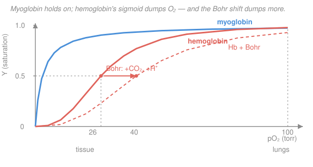

# Biochemistry · Lesson 1.5: Oxygen binding — myoglobin & hemoglobin

> ⏱ ~15 min · Module 1: Proteins — Structure & Function · Builds on: [1.4 The folding problem](01-04-the-folding-problem.md), [1.3 Four levels of protein structure](01-03-four-levels-protein-structure.md), [1.1 Water, pH & buffers](01-01-water-ph-buffers.md) · Unlocks: [2.1 Enzymes & catalytic strategy](02-01-enzymes-catalytic-strategy.md), [2.4 Allosteric regulation](02-04-allosteric-regulation-metabolic-control.md)

## Why this matters

Two proteins, one job — carry $\ce{O2}$ — and almost the same fold, yet they behave completely differently. **Myoglobin** grabs oxygen and won't let go; **hemoglobin** grabs it in the lungs and dumps nearly half of it in your tissues. The difference is a single trick — **cooperativity** — that turns a one-subunit sponge into a four-subunit delivery truck. This lesson is where the [quaternary structure](01-03-four-levels-protein-structure.md) you just learned about pays off: four subunits can *talk to each other*, and that conversation is the first clear case of **allostery** — regulation at a distance — which becomes the master theme of enzyme control in [Module 2](02-04-allosteric-regulation-metabolic-control.md).

## The idea

Picture a binding site as a parking spot for $\ce{O2}$. **Myoglobin** is a single spot in a single protein. The more $\ce{O2}$ floating around, the more likely the spot is filled — a smooth, boring **hyperbola**. Great for *storage* (myoglobin sits in muscle, hoarding oxygen), useless for *delivery*: it clings just as hard when supply runs low.

**Hemoglobin** has four spots on four subunits, and here's the magic: filling one spot makes the *next* one easier to fill. The subunits are cooperative — like a stadium wave, once it starts it takes off. So hemoglobin is reluctant at low oxygen and eager at high oxygen. That gives an **S-shaped (sigmoidal)** curve: nearly empty in the low-oxygen tissues, nearly full in the high-oxygen lungs. A protein that switches sharply between "loaded" and "unloaded" over the exact pressure range your body spans is a superb transporter.

The mechanism behind cooperativity is a **two-state switch**. Each subunit can sit in a **T (tense, low-affinity)** shape or an **R (relaxed, high-affinity)** shape. Empty hemoglobin is locked in T; binding $\ce{O2}$ tugs the whole quaternary structure toward R, and R holds oxygen much more tightly. Because all four subunits flip roughly together, the first $\ce{O2}$ is hard to load (fighting T) but the fourth is easy (everyone's in R). And anything that stabilizes T — acid, $\ce{CO2}$, the small molecule 2,3-BPG — makes hemoglobin *release* more oxygen right where it's needed.

## The formal version

We measure how full the protein is with **fractional saturation** $Y$: the fraction of binding sites occupied, from $0$ (empty) to $1$ (full).

**Myoglobin — one site, simple equilibrium.** For a single site binding $\ce{O2}$, $\ce{Mb + O2 <=> MbO2}$ with dissociation constant $K_d = \dfrac{[\ce{Mb}][\ce{O2}]}{[\ce{MbO2}]}$,

$$Y = \frac{[\ce{O2}]}{K_d + [\ce{O2}]} = \frac{p}{P_{50} + p},$$

where $p$ is the partial pressure of $\ce{O2}$ (in torr; pressure is the natural "concentration" for a gas) and $P_{50}$ is the pressure giving half-saturation. *In words: saturation rises smoothly toward 1 as oxygen climbs, and when $p = P_{50}$ exactly half the sites are filled.* For a one-site protein, $P_{50} = K_d$. This is a **hyperbola** — myoglobin's $P_{50} \approx 2.8$ torr, so it's already ~90% full at any pressure your tissues ever see.

**Hemoglobin — many sites, the Hill equation.** Cooperativity is captured by raising pressure to a power $n$:

$$Y = \frac{p^{\,n}}{P_{50}^{\,n} + p^{\,n}}.$$

*In words: the same saturation formula, but the exponent $n$ makes the curve switch from "off" to "on" more sharply the larger it is.* The **Hill coefficient** $n$ measures cooperativity:

- $n = 1$: no cooperativity — the sites are independent, and this collapses back to the myoglobin hyperbola.
- $n > 1$: **positive cooperativity** — binding helps binding. Hemoglobin has $n \approx 2.8$.
- $n$ can never exceed the number of sites (4 for hemoglobin); $n = 4$ would be perfect all-or-nothing cooperativity. The real value $2.8 < 4$ says the coupling is strong but not total.

$P_{50}$ for hemoglobin is $\approx 26$ torr — conveniently near the $\ce{O2}$ pressure in resting tissue, so hemoglobin is poised right at its steepest, most responsive point exactly where delivery happens.

**The Bohr effect.** Actively working tissue is acidic (it makes $\ce{CO2}$, which forms carbonic acid, and lactate). Protons and $\ce{CO2}$ bind hemoglobin and **stabilize the T state**, lowering affinity — a **right-shift** (larger $P_{50}$).

$$\ce{HbO2 + H+ <=> HbH+ + O2}$$

*In words: acid pushes oxygen off hemoglobin.* This is beautiful feedback: the tissues that are working hardest are the most acidic, so they automatically pull the most oxygen off. **2,3-bisphosphoglycerate (2,3-BPG)**, a small molecule in red cells, does the same by wedging into the central cavity of the T state — it's why stored/adapted blood tunes its $P_{50}$ (and why fetal hemoglobin, which binds 2,3-BPG weakly, can steal $\ce{O2}$ from the mother).

## Picture

Between lungs (~100 torr) and tissue (~26 torr), the blue myoglobin curve barely drops — it stays loaded. The coral hemoglobin sigmoid falls off a cliff over that same span — that vertical drop *is* the oxygen delivered. The dashed curve shows the Bohr right-shift making the cliff even steeper.

## Worked examples

**Example 1 — how much does each protein actually deliver?** Compare myoglobin and hemoglobin as they travel from lungs ($p = 100$ torr) to tissue ($p = 26$ torr). Delivery is $Y_{\text{lung}} - Y_{\text{tissue}}$.

*Myoglobin* (hyperbola, $P_{50} = 2.8$ torr):

$$Y_{\text{lung}} = \frac{100}{2.8 + 100} = 0.973, \qquad Y_{\text{tissue}} = \frac{26}{2.8 + 26} = 0.903.$$

Delivered $= 0.973 - 0.903 = 0.07$. Myoglobin unloads only ~**7%** of its capacity — it's a hoarder, not a courier.

*Hemoglobin* (Hill, $P_{50} = 26$ torr, $n = 2.8$). First the lung value. The one arithmetic move to know: $p^{2.8}$ via logs, e.g. $100^{2.8} = 10^{2.8 \times \log_{10} 100} = 10^{2.8 \times 2} = 10^{5.6} = 3.98\times10^{5}$, and $26^{2.8} = 10^{2.8 \times 1.415} = 10^{3.96} = 9.16\times10^{3}$. Then

$$Y_{\text{lung}} = \frac{100^{2.8}}{26^{2.8} + 100^{2.8}} = \frac{3.98\times10^{5}}{9.16\times10^{3} + 3.98\times10^{5}} = 0.978.$$

At the tissue, $p = 26 = P_{50}$ exactly, so $Y_{\text{tissue}} = 0.5$ with no arithmetic — the very definition of $P_{50}$. Delivered $= 0.978 - 0.500 = 0.48$: hemoglobin unloads ~**48%** of its capacity, nearly **seven times** more than myoglobin over the identical pressure drop. That gap is the entire payoff of the sigmoid — and it exists *because* evolution parked $P_{50}$ right at the tissue pressure, on the steepest part of the curve.

**Example 2 — the Bohr effect delivers even more.** Now let the tissue be hard-working muscle: it's acidic, so the Bohr effect right-shifts hemoglobin to $P_{50} = 40$ torr (the dashed curve). The lungs are unaffected ($Y_{\text{lung}} = 0.978$ as before). At the tissue, $p = 26$ but now $P_{50} = 40$:

$$Y_{\text{tissue}} = \frac{26^{2.8}}{40^{2.8} + 26^{2.8}} = \frac{9.16\times10^{3}}{3.06\times10^{4} + 9.16\times10^{3}} = \frac{9158}{39765} = 0.23,$$

using $40^{2.8} = 10^{2.8 \times 1.602} = 10^{4.49} = 3.06\times10^{4}$. Delivered $= 0.978 - 0.23 = 0.75$.

So the Bohr shift lifts delivery from $0.48$ to $0.75$ — an extra $0.27$, more than **half again as much oxygen**, handed precisely to the tissue that earned it by working. Same hemoglobin, same pressures; only the $P_{50}$ moved.

## Watch out

- **You might think a higher $P_{50}$ means hemoglobin is "better."** It means *lower affinity* — a right-shift. That's good for *unloading* in tissue but you'd never want it in the lungs. Affinity and delivery are different virtues; the sigmoid's genius is being high-affinity where it loads and low-affinity where it unloads.
- **You might read the Hill coefficient $n$ as "the number of binding sites."** It's a measure of *cooperativity*, not a count. Hemoglobin has 4 sites but $n \approx 2.8$; a hypothetical protein with 4 independent sites would still have $n = 1$. Only perfect all-or-nothing binding pushes $n$ up to the site count.
- **You might picture each subunit flipping T→R on its own.** In the cooperative (concerted) view the subunits are coupled, so the quaternary structure tends to flip *together* — that coupling is exactly why one binding event changes the others' affinity. We formalize this as the MWC model in [2.4](02-04-allosteric-regulation-metabolic-control.md).

## One-liner

> Myoglobin's hyperbola hoards oxygen; hemoglobin's cooperative sigmoid — sharpened by the Bohr effect and 2,3-BPG — is tuned to *dump* it exactly where the tissue is acidic and starving.

## Problems

**P1 (🟢)** Myoglobin has $P_{50} = 2.8$ torr. Compute its fractional saturation $Y$ at $pO_2 = 40$ torr (venous blood) and at $pO_2 = 5$ torr (deep in exercising muscle). What do the two numbers say about myoglobin's job?

**P2 (🟡)** At high altitude, arterial $pO_2$ falls from 100 torr to about 60 torr. Using the Hill equation for hemoglobin ($P_{50} = 26$ torr, $n = 2.8$), compute $Y$ at 60 torr and compare it to the sea-level value of 0.978. Why is it reassuring that hemoglobin operates on the flat *top* of its curve in the lungs? (You'll need $60^{2.8}$; use logs as in Example 1.)

**P3 (🔴, connects to [2.2 Michaelis–Menten kinetics](02-02-michaelis-menten-kinetics.md))** A curve fits the Hill equation. Two measured points are $(p = 10\ \text{torr},\, Y = 0.20)$ and $(p = 40\ \text{torr},\, Y = 0.80)$. Take the logarithm of $\dfrac{Y}{1-Y}$ (the "Hill plot") to extract the Hill coefficient $n$ and the $P_{50}$. This linearization trick — turning a curved binding law into a straight line to read off constants — is the same move as the Lineweaver–Burk plot you'll meet in enzyme kinetics.

Solutions

**P1.** Hyperbola $Y = \dfrac{p}{P_{50} + p}$ with $P_{50} = 2.8$:

$$Y(40) = \frac{40}{2.8 + 40} = \frac{40}{42.8} = 0.935, \qquad Y(5) = \frac{5}{2.8 + 5} = \frac{5}{7.8} = 0.641.$$

Even at 40 torr myoglobin is ~94% loaded, and only when the pressure crashes to 5 torr — the extreme low-oxygen conditions of hard-working muscle — does it release a meaningful chunk (down to 64%). *That's exactly a storage protein's job:* hold oxygen in reserve and surrender it only in emergency, low-pressure conditions, not routinely in transit. Contrast hemoglobin, which unloads across ordinary tissue pressures.

**P2.** Need $60^{2.8}$: $\log_{10} 60 = 1.778$, so $60^{2.8} = 10^{2.8 \times 1.778} = 10^{4.979} = 9.53\times10^{4}$. With $26^{2.8} = 9.16\times10^{3}$,

$$Y(60) = \frac{9.53\times10^{4}}{9.16\times10^{3} + 9.53\times10^{4}} = \frac{95300}{104460} = 0.912.$$

Dropping from 100 to 60 torr barely dents saturation (0.978 → 0.912) — hemoglobin loses only ~7% of its load despite a 40% fall in pressure. That's the *reassuring* consequence of loading on the flat plateau of the sigmoid: the lung end has a built-in safety margin, so moderate altitude, mild lung disease, or a bad night's air still leaves the blood nearly fully charged. All the action (the steep part) is saved for the tissue end, where you *want* sensitivity.

**P3.** Rearrange the Hill equation. From $Y = \dfrac{p^{n}}{P_{50}^{n} + p^{n}}$,

$$\frac{Y}{1 - Y} = \frac{p^{n}}{P_{50}^{n}} \quad\Longrightarrow\quad \log_{10}\!\frac{Y}{1-Y} = n\log_{10} p - n\log_{10} P_{50}.$$

This is a straight line in $\log_{10} p$ with **slope $n$**. Evaluate the two points:

$$\text{at }p=10:\ \frac{Y}{1-Y} = \frac{0.20}{0.80} = 0.25,\quad \log_{10} 0.25 = -0.602,$$
$$\text{at }p=40:\ \frac{Y}{1-Y} = \frac{0.80}{0.20} = 4,\quad \log_{10} 4 = 0.602.$$

Slope:

$$n = \frac{0.602 - (-0.602)}{\log_{10} 40 - \log_{10} 10} = \frac{1.204}{1.602 - 1.000} = \frac{1.204}{0.602} = 2.0.$$

So $n = 2$ (positive cooperativity). For $P_{50}$, use the intercept via either point — at half-saturation $\log_{10}\frac{Y}{1-Y} = 0$, i.e. $\log_{10} P_{50} = \log_{10} p - \frac{1}{n}\log_{10}\frac{Y}{1-Y}$. With the $p = 10$ point:

$$\log_{10} P_{50} = 1.000 - \frac{-0.602}{2} = 1.000 + 0.301 = 1.301 \quad\Longrightarrow\quad P_{50} = 10^{1.301} = 20\ \text{torr}.$$

*Check* with the other point: $\log_{10} P_{50} = \log_{10} 40 - \frac{0.602}{2} = 1.602 - 0.301 = 1.301$ ✓. The linearization pulled both constants ($n = 2$, $P_{50} = 20$ torr) out of two data points — precisely the logic of the double-reciprocal Lineweaver–Burk plot in [2.2](02-02-michaelis-menten-kinetics.md), where a curved rate law is straightened to read off $K_m$ and $V_{\max}$.

## Flashback

**From [1.1 Water, pH & buffers](01-01-water-ph-buffers.md) (Henderson–Hasselbalch) — with a Bohr twist.** Hemoglobin's Bohr effect works because certain histidine side chains have an imidazole $pK_a \approx 6.0$, close enough to physiological pH that a small pH change flips their protonation. Using Henderson–Hasselbalch, compute the fraction of these imidazole groups that are **protonated** at arterial pH 7.4 and at hard-working-muscle pH 6.8. Then say in one sentence why a $pK_a$ near physiological pH is exactly what a pH sensor needs.

Solution

For the acid–base pair imidazolium ($\ce{HA}$, protonated) $\ce{<=>}$ imidazole ($\ce{A}$, deprotonated) $+\ \ce{H+}$, Henderson–Hasselbalch gives

$$\text{pH} = pK_a + \log_{10}\frac{[\ce{A}]}{[\ce{HA}]} \quad\Longrightarrow\quad \text{fraction protonated} = \frac{[\ce{HA}]}{[\ce{HA}]+[\ce{A}]} = \frac{1}{1 + 10^{\,\text{pH} - pK_a}}.$$

At **pH 7.4** ($pK_a = 6.0$): $10^{7.4 - 6.0} = 10^{1.4} = 25.1$, so fraction protonated $= \dfrac{1}{1 + 25.1} = 0.038$ (**~3.8%**).

At **pH 6.8**: $10^{6.8 - 6.0} = 10^{0.8} = 6.31$, so fraction protonated $= \dfrac{1}{1 + 6.31} = 0.137$ (**~13.7%**).

Dropping just 0.6 pH units nearly **quadruples** protonation (3.8% → 13.7%). Those extra protonated histidines form the salt bridges that lock the low-affinity T state — which *is* the Bohr effect, mechanistically. A $pK_a$ near physiological pH is what makes a good sensor: only a group titrating right in the working pH range responds to small physiological pH swings — a group with $pK_a = 3$ or $pK_a = 11$ would sit fully protonated or fully deprotonated across the whole range and register nothing. (This is the same reasoning behind Boss Problem 1's histidine.)

## Connections

- **Backward:** cooperativity *requires* the multi-subunit [quaternary structure](01-03-four-levels-protein-structure.md) — a lone subunit (myoglobin) can't cooperate because there's no neighbor to signal. The Bohr calculation reuses Henderson–Hasselbalch straight from [1.1](01-01-water-ph-buffers.md), and the T→R conformational switch is a controlled version of the folding landscape ideas in [1.4](01-04-the-folding-problem.md).
- **Forward:** hemoglobin is the textbook warm-up for [2.4 Allosteric regulation](02-04-allosteric-regulation-metabolic-control.md) — the same T/R, MWC, cooperative-effector machinery governs the enzymes that control metabolic flux (e.g. phosphofructokinase in [glycolysis](03-02-glycolysis.md)). The Hill-plot linearization in P3 previews the Lineweaver–Burk analysis of [2.2](02-02-michaelis-menten-kinetics.md).
- **Sideways (physiology / gas transport):** the Bohr effect is one half of a loop with $\ce{CO2}$ transport — tissue $\ce{CO2}$ acidifies blood to release $\ce{O2}$, while in the lungs the reverse promotes $\ce{CO2}$ offloading (the Haldane effect). It's also a clean case of Le Châtelier's principle from [general-chemistry](../../general-chemistry/syllabus.md): add $\ce{H+}$ to $\ce{HbO2 + H+ <=> HbH+ + O2}$ and the equilibrium shifts to expel $\ce{O2}$.
