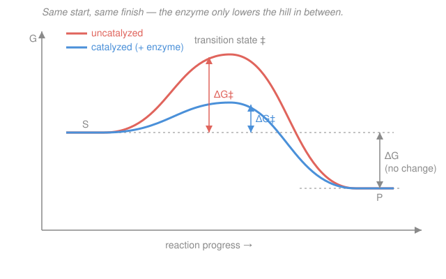

# Biochemistry · Lesson 2.1: Enzymes & catalytic strategy

> ⏱ ~15 min · Module 2: Enzymes & Bioenergetics · Builds on: [1.3 Four levels of protein structure](01-03-four-levels-protein-structure.md) · Unlocks: [2.2 Michaelis–Menten kinetics](02-02-michaelis-menten-kinetics.md)

## Why this matters

Left alone, the reactions life runs on are absurdly slow — some would take *centuries* at body temperature. Enzymes accelerate them by factors of $10^{6}$ to $10^{17}$, turning geological timescales into milliseconds, and they do it without heat, pressure, or exotic reagents — just a folded protein pocket. The trick is subtle and often misremembered: an enzyme does **not** make the products more stable, and it does **not** grip the substrate tightest. It grips the fleeting, strained **transition state** tightest. Get that one idea right and every catalytic strategy below falls out of it.

## The idea

Every reaction has to climb a hill. Reactants can't slide straight to products; they must first pass through a high-energy, half-broken arrangement — the **transition state** — where old bonds are stretching and new ones forming. The height of that hill is the **activation energy**: the higher it is, the rarer the molecules with enough energy to make it over, and the slower the reaction.

An enzyme is a molecular pocket shaped to fit that awkward transition state *better than it fits either the reactant or the product*. When the transition state nestles in and forms favorable contacts, its energy drops — the hilltop is pulled down. A lower hill means a larger fraction of collisions clear it, so the reaction runs faster. Crucially, the enzyme lowers the hill by the **same amount** whether you approach from the reactant side or the product side, so it speeds the forward and reverse reactions equally. That's why it changes only the *rate*, never the destination: the valleys on either side — reactants and products — sit exactly where they always did.

A tempting mistake is to build a pocket that binds the *substrate* beautifully. That's a trap: a snug substrate sits in a *deeper* valley, so it has a *taller* hill to climb — you've made the reaction slower. The best enzymes bind substrate only loosely and save their strongest embrace for the transition state.

## The formal version

The rate of a reaction depends exponentially on its activation barrier. Writing $\Delta G^{\ddagger}$ (Gibbs free energy of activation, in J/mol) for the height of the barrier from reactant to transition state, transition-state theory (the **Eyring** equation) gives a rate constant

$$k = \kappa\,\frac{k_{B}T}{h}\,e^{-\Delta G^{\ddagger}/RT},$$

where $k_{B}$ is Boltzmann's constant, $h$ Planck's constant, $T$ the absolute temperature (K), $R = 8.314\ \mathrm{J\,mol^{-1}K^{-1}}$ the gas constant, and $\kappa \approx 1$ a transmission factor. *In words: the rate falls off exponentially as the barrier rises; the prefactor is roughly how often the transition state is even attempted.*

The only thing an enzyme touches is $\Delta G^{\ddagger}$. If it lowers the barrier by $\Delta\Delta G^{\ddagger}$, the rate multiplies by

$$\frac{k_{\text{cat}}}{k_{\text{uncat}}} = e^{\,\Delta\Delta G^{\ddagger}/RT}.$$

*In words: every bit you shave off the barrier multiplies the speed, and because it's an exponential, small energy savings buy huge speedups.* At $T = 310\ \mathrm{K}$, $RT = 2.58\ \mathrm{kJ/mol}$ and $RT\ln 10 = 5.9\ \mathrm{kJ/mol}$ — so **about 6 kJ/mol of transition-state stabilization buys one factor of ten** in rate.

What it does **not** touch is the overall free-energy change $\Delta G = G_{\text{products}} - G_{\text{reactants}}$, which fixes the equilibrium constant through $\Delta G^{\circ} = -RT\ln K_{\text{eq}}$. Since the enzyme lowers the barrier equally in both directions, $k_{\text{forward}}$ and $k_{\text{reverse}}$ rise by the same factor and $K_{\text{eq}} = k_{\text{forward}}/k_{\text{reverse}}$ is untouched. *In words: an enzyme changes how fast you reach equilibrium, never where equilibrium is.*

**How the barrier gets lowered — four strategies.** Enzymes combine these to stabilize the transition state:

- **Acid–base catalysis** — a side chain donates or accepts a proton at the right instant, avoiding a high-energy charged intermediate (histidine is the workhorse, because its imidazole $\mathrm{p}K_a \approx 6$–7 lets it act as either acid *or* base at physiological pH).
- **Covalent catalysis** — a nucleophilic residue transiently forms a covalent bond to the substrate, splitting one hard step into two easier ones.
- **Metal-ion catalysis** — a bound metal ($\ce{Zn^2+}$, $\ce{Mg^2+}$, $\ce{Fe^2+}$…) orients substrate, shields or stabilizes negative charge, or activates water.
- **Proximity and orientation** — simply holding two reactants together in the correct geometry pays the entropic cost of bringing them into register, which alone can contribute large rate factors.

## Picture

Same reactant valley (S), same product valley (P), so the same $\Delta G$ — but the catalyzed (blue) path crosses a much lower pass than the uncatalyzed (coral) one. The vertical arrows are the two activation energies $\Delta G^{\ddagger}$; the gap between them is the $\Delta\Delta G^{\ddagger}$ that the exponential turns into the rate enhancement.

## Worked examples

**Example 1 (how much speed does a small barrier drop buy?).** An enzyme lowers $\Delta G^{\ddagger}$ by $\Delta\Delta G^{\ddagger} = 30\ \mathrm{kJ/mol}$ at body temperature $T = 310\ \mathrm{K}$. By what factor does the reaction speed up?

Use $\dfrac{k_{\text{cat}}}{k_{\text{uncat}}} = e^{\,\Delta\Delta G^{\ddagger}/RT}$ with $RT = (8.314)(310) = 2577\ \mathrm{J/mol} = 2.58\ \mathrm{kJ/mol}$:

$$\frac{\Delta\Delta G^{\ddagger}}{RT} = \frac{30{,}000}{2577} = 11.6, \qquad \frac{k_{\text{cat}}}{k_{\text{uncat}}} = e^{11.6} \approx 1.1\times10^{5}.$$

So a 30 kJ/mol dent in the barrier — about the strength of one or two hydrogen bonds to the transition state — buys a **hundred-thousand-fold** acceleration. That is the whole magic of enzymes: they don't need to do anything violent, just form a few extra bonds to the *right* (transient) shape. Notice the leverage: converting through decades, $30/5.9 \approx 5.1$, i.e. $\approx 10^{5}$ — matching the direct calculation.

**Example 2 (the chymotrypsin catalytic triad, step by step).** Chymotrypsin cleaves the peptide backbone $\ce{R-CO-NH-R' + H2O -> R-COOH + H2N-R'}$ — normally a spectacularly sluggish reaction because the carbonyl carbon is a poor electrophile and $\ce{OH-}$ is scarce at pH 7. Its active site packs three residues into one hydrogen-bonded relay: **Ser-195, His-57, Asp-102** (the "catalytic triad"). Walk the logic:

1. **His as a general base (acid–base catalysis).** Serine's $-\ce{OH}$ is a weak nucleophile — its proton won't leave on its own at pH 7. His-57's imidazole, with $\mathrm{p}K_a \approx 6$, plucks that proton *at the moment of attack*, unleashing a much more reactive alkoxide $\ce{Ser-O-}$ that lunges at the carbonyl carbon. His works here precisely because its $\mathrm{p}K_a$ sits near physiological pH, so it can grab a proton now and hand it back a step later. Asp-102 anchors and polarizes the imidazole, sharpening its base strength (an electrostatic assist).
2. **Covalent catalysis.** The serine oxygen forms a real covalent bond to the substrate, passing through a **tetrahedral transition state** and cleaving the peptide to leave a covalent **acyl-enzyme** intermediate — one hard hydrolysis has become two easier half-reactions.
3. **The oxyanion hole stabilizes the transition state.** As the flat carbonyl carbon becomes tetrahedral, its oxygen picks up negative charge — an **oxyanion**. That charged, strained arrangement *is* the transition state. Two backbone $\ce{N-H}$ groups point into a small pocket, the **oxyanion hole**, and donate hydrogen bonds exactly to that developing negative charge. Because those H-bonds fit the transition state far better than they fit the flat starting substrate, they preferentially lower $\Delta G^{\ddagger}$ — textbook transition-state stabilization.

Every strategy in the list above appears here: acid–base (His), covalent (Ser), and proximity/orientation (the substrate is clamped in register). No metal is needed. The payoff is a rate enhancement of roughly $10^{9}$–$10^{10}$.

## Watch out

- **You might think an enzyme works by binding its substrate as tightly as possible.** Actually, tight substrate binding *deepens* the reactant valley and makes the hill **taller** — slower, not faster. Enzymes evolve to bind the **transition state** tightest; the substrate should fit only loosely. (This is why transition-state analogs make such potent inhibitors: they exploit the pocket's real preference.)
- **You might think a catalyst can shift the equilibrium toward products.** It cannot. $\Delta G$ and $K_{\text{eq}}$ are set by reactant and product energies alone, which the enzyme never touches; it lowers the forward and reverse barriers equally, so it only gets you to the *same* equilibrium faster.
- **You might think "lowering activation energy" means adding heat or changing $\Delta G^{\ddagger}$ globally.** The enzyme changes nothing about the uncatalyzed reaction — it opens a **different, lower-barrier pathway** through its active site, running alongside the old one.

## One-liner

> An enzyme speeds a reaction by binding and stabilizing the *transition state* — lowering $\Delta G^{\ddagger}$, never $\Delta G$ — so equilibrium is unchanged and only the rate, which depends exponentially on the barrier, explodes.

## Problems

**P1 (🟢)** An enzyme lowers the activation barrier by $\Delta\Delta G^{\ddagger} = 20\ \mathrm{kJ/mol}$ at body temperature ($T = 310\ \mathrm{K}$, so $RT = 2.58\ \mathrm{kJ/mol}$). By what factor does it accelerate the reaction?

**P2 (🟡)** Carbonic anhydrase, one of the fastest enzymes known, achieves a rate enhancement of about $10^{7}$. What drop in activation energy $\Delta\Delta G^{\ddagger}$ (in kJ/mol) does that correspond to at $T = 310\ \mathrm{K}$? Does this tell you anything about how much more product the reaction will form at equilibrium?

**P3 (🔴, connects to [bioenergetics](02-05-bioenergetics-atp-redox.md) & [kinetics](02-02-michaelis-menten-kinetics.md))** An endergonic reaction $\text{A}\rightleftharpoons\text{B}$ has forward barrier $\Delta G^{\ddagger}_{f} = 80\ \mathrm{kJ/mol}$ and reverse barrier $\Delta G^{\ddagger}_{r} = 50\ \mathrm{kJ/mol}$. (a) What is $\Delta G$ for $\text{A}\to\text{B}$? (b) A perfect enzyme lowers the transition state by 30 kJ/mol. Write the new forward and reverse barriers and the new $\Delta G$. (c) Show that both rate constants increase by the same factor, and conclude what happens to $K_{\text{eq}}$.

Solutions

**P1.** Rate factor $= e^{\Delta\Delta G^{\ddagger}/RT}$ with $\Delta\Delta G^{\ddagger}/RT = 20{,}000/2577 = 7.76$:

$$e^{7.76} \approx 2.4\times10^{3}.$$

About a **2,000-fold** speedup. *Check via the "6 kJ/mol per decade" rule:* $20/5.9 = 3.4$ decades $\Rightarrow 10^{3.4} \approx 2.5\times10^{3}$ ✓ (small rounding difference).

**P2.** Invert the exponential: $\Delta\Delta G^{\ddagger} = RT\ln(\text{factor})$.

$$\Delta\Delta G^{\ddagger} = (2.58\ \mathrm{kJ/mol})\times\ln(10^{7}) = 2.58 \times 16.12 = 41.6\ \mathrm{kJ/mol}.$$

So stabilizing the transition state by only about **42 kJ/mol** (a handful of well-placed contacts) delivers a ten-million-fold acceleration. It says **nothing** about the equilibrium amount of product: $\Delta\Delta G^{\ddagger}$ affects the barrier, not $\Delta G$, so $K_{\text{eq}}$ is unchanged — the enzyme just reaches the same equilibrium far sooner. *Check via the decade rule:* $7$ decades $\times 5.9 = 41.3\ \mathrm{kJ/mol}$ ✓.

**P3.**
(a) $\Delta G = \Delta G^{\ddagger}_{f} - \Delta G^{\ddagger}_{r} = 80 - 50 = +30\ \mathrm{kJ/mol}$ (endergonic, as advertised — B sits *above* A).

(b) Lowering the shared transition state by 30 kJ/mol drops **both** barriers by 30:
$$\Delta G^{\ddagger}_{f,\text{new}} = 80 - 30 = 50\ \mathrm{kJ/mol}, \qquad \Delta G^{\ddagger}_{r,\text{new}} = 50 - 30 = 20\ \mathrm{kJ/mol}.$$
The new $\Delta G = 50 - 20 = +30\ \mathrm{kJ/mol}$ — **identical** to before. The valleys never moved.

(c) Each rate constant scales as $e^{-\Delta G^{\ddagger}/RT}$, so each rises by the same factor $e^{+30{,}000/2577} = e^{11.6} \approx 1.1\times10^{5}$. Therefore
$$K_{\text{eq}} = \frac{k_{f}}{k_{r}} = \frac{k_{f}^{\text{old}}\cdot e^{11.6}}{k_{r}^{\text{old}}\cdot e^{11.6}} = \frac{k_{f}^{\text{old}}}{k_{r}^{\text{old}}} = K_{\text{eq}}^{\text{old}}.$$
The factors cancel: $K_{\text{eq}}$ is **unchanged**. This is the whole point — an enzyme accelerates approach to equilibrium symmetrically and shifts it not at all. (To *drive* an unfavorable reaction you must change $\Delta G$ itself, e.g. by coupling it to ATP hydrolysis — the subject of [2.5](02-05-bioenergetics-atp-redox.md).)

## Flashback

**From Lesson 1.5 (Oxygen binding):** A hemoglobin variant binds $\ce{O2}$ cooperatively with Hill coefficient $n = 3.0$ and half-saturation pressure $P_{50} = 20\ \mathrm{torr}$. Using the Hill equation, compute the fractional saturation $Y$ at an oxygen partial pressure of $p\ce{O2} = 40\ \mathrm{torr}$.

Solution

The Hill equation for fractional saturation is

$$Y = \frac{(p\ce{O2})^{n}}{P_{50}^{\,n} + (p\ce{O2})^{n}}.$$

Plug in $n = 3.0$, $P_{50} = 20$, $p\ce{O2} = 40$:

$$Y = \frac{40^{3}}{20^{3} + 40^{3}} = \frac{64{,}000}{8{,}000 + 64{,}000} = \frac{64{,}000}{72{,}000} = 0.889.$$

So the protein is about **89% saturated**. *Check:* at $p\ce{O2} = P_{50} = 20$ the formula gives $Y = 20^3/(20^3+20^3) = 0.5$ ✓ (half-saturated at $P_{50}$, by definition), and doubling the pressure past $P_{50}$ pushes a cooperative binder well up the steep part of its sigmoid — 89% is sensible.

## Connections

- **Backward:** the active site is a precise 3D pocket carved by the folded chain — the tertiary and quaternary architecture of [1.3 Four levels of protein structure](01-03-four-levels-protein-structure.md). The catalytic triad works only because folding brings Ser-195, His-57, and Asp-102 — distant in sequence — into contact, and the same weak interactions that fold the protein (H-bonds, electrostatics) are the ones that grip the transition state.
- **Forward:** [2.2 Michaelis–Menten kinetics](02-02-michaelis-menten-kinetics.md) turns "the enzyme lowers $\Delta G^{\ddagger}$" into measurable numbers — $k_{\text{cat}}$ is the rate over that lowered barrier, and $k_{\text{cat}}/K_m$ measures how well the enzyme captures the transition state. [2.3 Enzyme inhibition](02-03-enzyme-inhibition.md) then weaponizes the transition-state idea: the best inhibitors mimic the transition state itself.
- **Sideways:** the exponential rate–barrier link is transition-state theory / the Eyring and Arrhenius equations from [physical chemistry](../../physical-chemistry/syllabus.md); the strict separation of *rate* ($\Delta G^{\ddagger}$) from *spontaneity* ($\Delta G$) is the same Gibbs free energy bookkeeping you meet in [thermodynamics](../../thermodynamics-physics/syllabus.md) and revisit for ATP coupling in [2.5](02-05-bioenergetics-atp-redox.md).
