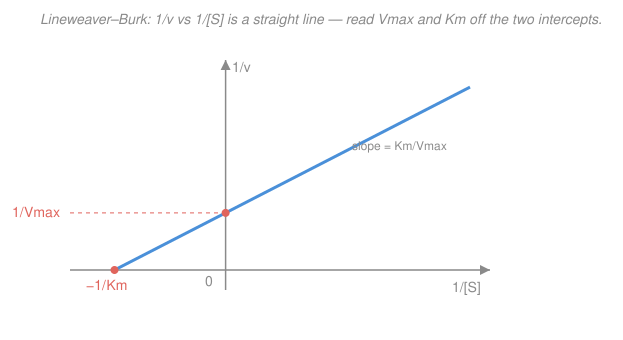

# Biochemistry · Lesson 2.2: Michaelis–Menten kinetics

> ⏱ ~15 min · Module 2: Enzymes & Bioenergetics · Builds on: [2.1 Enzymes & catalytic strategy](02-01-enzymes-catalytic-strategy.md), [1.5 Oxygen binding](01-05-oxygen-binding-myoglobin-hemoglobin.md) · Unlocks: [2.3 Enzyme inhibition](02-03-enzyme-inhibition.md)

## Why this matters

Lesson 2.1 told you *why* enzymes are fast — they stabilize the transition state. This lesson tells you *how to measure it*. Almost every number you'll ever quote about an enzyme — how tightly it grips its substrate, how many molecules per second it converts, whether a drug shuts it down — comes from one rate law with two parameters, $K_m$ and $V_{\max}$. Michaelis–Menten kinetics is the enzyme's data sheet, and the same hyperbola we're about to derive is the one you already met as hemoglobin's oxygen-binding curve in [1.5](01-05-oxygen-binding-myoglobin-hemoglobin.md). Master this and you can read a page of kinetic data like a sentence.

## The idea

Watch an enzyme work as you pour in more and more substrate. At first, adding substrate speeds things up almost linearly — the enzymes are mostly idle, so every extra molecule finds a free active site fast. But there's a ceiling: only so many enzyme molecules exist, and each takes a finite time to process one substrate and spit out product. Flood the system and every enzyme is busy *all the time* — now the rate can't rise any further no matter how much substrate you add. The enzymes are **saturated**.

So the rate-versus-substrate graph starts as a rising line and bends over into a flat plateau: a **rectangular hyperbola**. Two numbers pin it down. The plateau height is $V_{\max}$, the flat-out top speed when every enzyme is occupied. And the substrate concentration that gets you *halfway* to that ceiling is $K_m$ — a measure of how much substrate the enzyme "needs" to get going. A small $K_m$ means the enzyme reaches half-speed at a tiny substrate concentration: it grabs substrate greedily. That's the whole picture; the rest is bookkeeping to make it exact.

## The formal version

The simplest enzyme mechanism: substrate binds reversibly, then the bound complex commits to product.

$$\ce{E + S <=>[k_1][k_{-1}] ES ->[k_2] E + P}$$

In words: enzyme $\text{E}$ and substrate $\text{S}$ associate at rate constant $k_1$ to form the complex $\text{ES}$, which can either fall back apart (rate constant $k_{-1}$) or push forward to release product $\text{P}$ and free enzyme (rate constant $k_2$). We want the initial velocity $v = k_2[\text{ES}]$ — the rate product appears — as a function of $[\text{S}]$.

**The steady-state (Briggs–Haldane) assumption.** Once the reaction gets going, the complex $\text{ES}$ is made and destroyed so fast that its concentration barely drifts:

$$\frac{d[\text{ES}]}{dt} = 0.$$

In words: $\text{ES}$ is a fast-turnover intermediate — as much is created each instant as is consumed, so its pool sits at a constant level. (This is gentler than the older "rapid-equilibrium" assumption; it doesn't require $k_2$ to be small.)

**The derivation, step by step.** $\text{ES}$ is *formed* only by binding, and *destroyed* by both falling apart and going to product:

$$\underbrace{k_1[\text{E}][\text{S}]}_{\text{formation}} = \underbrace{k_{-1}[\text{ES}] + k_2[\text{ES}]}_{\text{breakdown}} = (k_{-1}+k_2)[\text{ES}].$$

The free enzyme $[\text{E}]$ is whatever total enzyme isn't currently bound. With total enzyme $[\text{E}]_T$ (a fixed amount you pipetted in),

$$[\text{E}]_T = [\text{E}] + [\text{ES}] \quad\Longrightarrow\quad [\text{E}] = [\text{E}]_T - [\text{ES}].$$

Substitute that into the balance:

$$k_1\big([\text{E}]_T - [\text{ES}]\big)[\text{S}] = (k_{-1}+k_2)[\text{ES}].$$

Expand and collect every $[\text{ES}]$ on one side:

$$k_1[\text{E}]_T[\text{S}] = (k_{-1}+k_2)[\text{ES}] + k_1[\text{ES}][\text{S}] = [\text{ES}]\big((k_{-1}+k_2) + k_1[\text{S}]\big).$$

Solve for $[\text{ES}]$ and divide top and bottom by $k_1$:

$$[\text{ES}] = \frac{k_1[\text{E}]_T[\text{S}]}{(k_{-1}+k_2)+k_1[\text{S}]} = \frac{[\text{E}]_T[\text{S}]}{\dfrac{k_{-1}+k_2}{k_1}+[\text{S}]}.$$

That grouped constant is the **Michaelis constant** $K_m \equiv \dfrac{k_{-1}+k_2}{k_1}$ (units of concentration). Finally $v = k_2[\text{ES}]$, and the top speed $V_{\max}=k_2[\text{E}]_T$ (reached when *all* enzyme is bound, $[\text{ES}]=[\text{E}]_T$). Put it together:

$$\boxed{\,v = \frac{V_{\max}[\text{S}]}{K_m+[\text{S}]}\,}\qquad K_m=\frac{k_{-1}+k_2}{k_1},\qquad V_{\max}=k_{cat}[\text{E}]_T.$$

In words: velocity rises with substrate but saturates at $V_{\max}$; $K_m$ sets how quickly you approach the ceiling.

**Reading the three constants.**

- $K_m$ **is the substrate concentration at half-maximal velocity.** Set $[\text{S}]=K_m$: $v = \dfrac{V_{\max}K_m}{K_m+K_m}=\dfrac{V_{\max}}{2}$. A low $K_m$ = half-speed reached at low substrate = high apparent affinity.
- $k_{cat}$, the **turnover number**, is product molecules made per enzyme per second when saturated. For this one-intermediate mechanism $k_{cat}=k_2$. It's $V_{\max}$ stripped of how much enzyme you happened to add: $k_{cat}=V_{\max}/[\text{E}]_T$. Example: if $V_{\max}=8\ \mu\text{M/s}$ with $[\text{E}]_T=2\ \text{nM}=0.002\ \mu\text{M}$, then $k_{cat}=8/0.002=4000\ \text{s}^{-1}$ — each enzyme cycles 4000 times a second.
- $k_{cat}/K_m$, the **catalytic efficiency** (or specificity constant), rates the enzyme at *low, physiological* substrate where sites are mostly empty. There $v\approx (k_{cat}/K_m)[\text{E}][\text{S}]$, so $k_{cat}/K_m$ is the effective second-order rate constant for E meeting S. It has a hard ceiling: an enzyme can't work faster than substrate diffuses into the active site, roughly $10^{8}$–$10^{9}\ \text{M}^{-1}\text{s}^{-1}$. Enzymes near that limit (fumarase, catalase, triose-phosphate isomerase) are called **catalytically perfect** — every collision is a reaction.

**Linearizing: the Lineweaver–Burk plot.** The hyperbola's plateau is hard to pin down by eye, so take reciprocals of both sides:

$$\frac{1}{v}=\frac{K_m+[\text{S}]}{V_{\max}[\text{S}]}=\frac{K_m}{V_{\max}}\cdot\frac{1}{[\text{S}]}+\frac{1}{V_{\max}}.$$

In words: plot $1/v$ against $1/[\text{S}]$ and you get a **straight line** — slope $K_m/V_{\max}$, $y$-intercept $1/V_{\max}$, and $x$-intercept $-1/K_m$. A curve you can't extrapolate becomes a ruler.

## Picture

![v-versus-[S] Michaelis–Menten hyperbola, with the V_max asymptote and K_m marked at half-maximal velocity](assets/02-02-fig1.svg)

## Worked examples

**Example 1 (mechanical — build the curve, confirm the half-max).** An enzyme has $V_{\max}=60\ \mu\text{mol}\cdot\text{min}^{-1}$ and $K_m=4\ \text{mM}$. Compute $v$ across a sweep of $[\text{S}]$ using $v=\dfrac{V_{\max}[\text{S}]}{K_m+[\text{S}]}$:

| $[\text{S}]$ (mM) | $v=\dfrac{60[\text{S}]}{4+[\text{S}]}$ ($\mu$mol/min) | fraction of $V_{\max}$ |
|---|---|---|
| $1$ | $60/5=12$ | $0.20$ |
| $2$ | $120/6=20$ | $0.33$ |
| $4\;(=K_m)$ | $240/8=30$ | $0.50$ |
| $8$ | $480/12=40$ | $0.67$ |
| $16$ | $960/20=48$ | $0.80$ |
| $\to\infty$ | $\to 60$ | $\to 1$ |

At $[\text{S}]=K_m=4$ mM, $v=30=V_{\max}/2$ exactly — the defining property, confirmed. Notice you need $[\text{S}]=16$ mM (four times $K_m$) just to reach 80% of the ceiling: approach to saturation is *slow*, which is exactly why you don't read $V_{\max}$ straight off the curve.

**Example 2 (why you'd care — extract the constants from real data).** You measure initial velocity at four substrate concentrations. Take reciprocals to set up a Lineweaver–Burk fit:

| $[\text{S}]$ (mM) | $v$ ($\mu$mol/min) | $1/[\text{S}]$ (mM$^{-1}$) | $1/v$ (min/$\mu$mol) |
|---|---|---|---|
| $1$ | $3.33$ | $1.00$ | $0.300$ |
| $2$ | $5.00$ | $0.50$ | $0.200$ |
| $4$ | $6.67$ | $0.25$ | $0.150$ |
| $8$ | $8.00$ | $0.125$ | $0.125$ |

The points $(1/[\text{S}],\,1/v)$ lie on a line. Get the **slope** from the two extreme points:

$$\text{slope}=\frac{0.300-0.125}{1.00-0.125}=\frac{0.175}{0.875}=0.20\ \frac{\text{min}}{\mu\text{mol}}\cdot\text{mM}.$$

Get the **$y$-intercept** by extrapolating to $1/[\text{S}]=0$ (infinite substrate): using the first point, $\dfrac{1}{v}=0.300-0.20(1.00)=0.100$. Now decode:

$$\frac{1}{V_{\max}}=0.100\ \Longrightarrow\ V_{\max}=10\ \mu\text{mol/min},$$
$$K_m=\text{slope}\times V_{\max}=0.20\times 10 = 2\ \text{mM}.$$

Cross-check with the $x$-intercept: setting $1/v=0$ gives $1/[\text{S}]=-\dfrac{\text{intercept}}{\text{slope}}=-\dfrac{0.100}{0.20}=-0.5$, and $-1/K_m=-0.5$ confirms $K_m=2$ mM. ✓ If the assay held a total of $[\text{E}]_T=5\times10^{-6}\ \mu\text{mol}$ of enzyme (5 pmol), then $k_{cat}=V_{\max}/[\text{E}]_T=(10\ \mu\text{mol/min})/(5\times10^{-6}\ \mu\text{mol})=2\times10^{6}\ \text{min}^{-1}\approx 3.3\times10^{4}\ \text{s}^{-1}$.

## Watch out

- **You might think $K_m$ measures binding affinity.** It only equals the dissociation constant $K_d=k_{-1}/k_1$ when $k_2\ll k_{-1}$ (the complex almost always falls back before reacting). In general $K_m=\frac{k_{-1}+k_2}{k_1}\ge K_d$, so a fast catalyst can have a $K_m$ well above its true binding constant. Call $K_m$ "apparent affinity" and you'll never be wrong.
- **You might think a bigger $V_{\max}$ means a better enzyme.** $V_{\max}=k_{cat}[\text{E}]_T$ depends on how much enzyme you added, so it's a property of your *sample*, not the *catalyst*. To compare enzymes, use $k_{cat}$ (per-molecule speed) or $k_{cat}/K_m$ (efficiency at low substrate) — both independent of dose.
- **You might trust the Lineweaver–Burk fit blindly.** Taking reciprocals inflates the error of the smallest, noisiest velocities (low $[\text{S}]$, far right of the plot), so the line gets dragged by the least reliable points. It's superb for *understanding* the algebra and spotting inhibition patterns (next lesson), but modern practice fits the hyperbola directly by nonlinear regression.

## One-liner

> $v=\dfrac{V_{\max}[\text{S}]}{K_m+[\text{S}]}$: velocity saturates at $V_{\max}$, hits half of it when $[\text{S}]=K_m$, and the catalyst's true quality lives in $k_{cat}$ and $k_{cat}/K_m$, not $V_{\max}$.

## Problems

**P1 (🟢)** An enzyme has $K_m=5\ \text{mM}$ and $V_{\max}=20\ \mu\text{mol/min}$. (a) Find $v$ at $[\text{S}]=5$ mM and at $[\text{S}]=15$ mM. (b) At what $[\text{S}]$ does the enzyme run at 90% of $V_{\max}$?

**P2 (🟡)** Two enzymes act on the same substrate. Enzyme A: $k_{cat}=1000\ \text{s}^{-1}$, $K_m=2\ \text{mM}$. Enzyme B: $k_{cat}=50\ \text{s}^{-1}$, $K_m=0.02\ \text{mM}$. At *low* substrate concentration (well below both $K_m$'s), which enzyme processes substrate faster, and by what factor? Which number did you use, and why is it the right one?

**P3 (🔴, optional — bridge to O₂ binding)** Myoglobin's oxygen saturation is $Y=\dfrac{p}{P_{50}+p}$, where $p$ is O₂ partial pressure and $P_{50}$ is the pressure at half-saturation (see [1.5](01-05-oxygen-binding-myoglobin-hemoglobin.md)). Show this is algebraically the *same* hyperbola as Michaelis–Menten, and state precisely what plays the role of $v$, $V_{\max}$, $[\text{S}]$, and $K_m$. Why does *hemoglobin's* curve (sigmoidal) break the analogy?

Solutions

**P1** (a) Use $v=\dfrac{V_{\max}[\text{S}]}{K_m+[\text{S}]}$.
At $[\text{S}]=5$ mM $=K_m$: $v=\dfrac{20\cdot5}{5+5}=\dfrac{100}{10}=10\ \mu\text{mol/min}$ — half of $V_{\max}$, as it must be at $[\text{S}]=K_m$.
At $[\text{S}]=15$ mM: $v=\dfrac{20\cdot15}{5+15}=\dfrac{300}{20}=15\ \mu\text{mol/min}$ (that's 75% of $V_{\max}$).

(b) Want $v=0.9\,V_{\max}$: $\dfrac{[\text{S}]}{K_m+[\text{S}]}=0.9\Rightarrow[\text{S}]=0.9K_m+0.9[\text{S}]\Rightarrow0.1[\text{S}]=0.9K_m\Rightarrow[\text{S}]=9K_m=45\ \text{mM}$.
General fact worth remembering: reaching fraction $f$ of $V_{\max}$ needs $[\text{S}]=\dfrac{f}{1-f}K_m$ — so 90% costs $9K_m$, 99% costs $99K_m$. Saturation is expensive.

**P2** At low $[\text{S}]$ (well below $K_m$), the denominator $K_m+[\text{S}]\approx K_m$, so
$$v\approx\frac{V_{\max}}{K_m}[\text{S}]=\frac{k_{cat}[\text{E}]_T}{K_m}[\text{S}]=\Big(\frac{k_{cat}}{K_m}\Big)[\text{E}]_T[\text{S}].$$
The deciding number is the **catalytic efficiency** $k_{cat}/K_m$, not $k_{cat}$ alone — at low substrate the bottleneck is how often E and S even meet, which $k_{cat}/K_m$ measures.
- Enzyme A: $k_{cat}/K_m=1000/2=500\ \text{mM}^{-1}\text{s}^{-1}$.
- Enzyme B: $k_{cat}/K_m=50/0.02=2500\ \text{mM}^{-1}\text{s}^{-1}$.
Enzyme B wins by a factor of $2500/500=5$, even though its raw turnover $k_{cat}$ is 20× *slower* — its far tighter grip (low $K_m$) more than compensates when substrate is scarce. (At *saturating* substrate the verdict flips: there $v\to V_{\max}$ and A, with the higher $k_{cat}$, is 20× faster. Which enzyme is "better" depends on the substrate level it actually sees.)

**P3** Divide the Michaelis–Menten numerator and denominator by nothing — just match symbol to symbol. Myoglobin: $Y=\dfrac{p}{P_{50}+p}$. Michaelis–Menten: $\dfrac{v}{V_{\max}}=\dfrac{[\text{S}]}{K_m+[\text{S}]}$. They are the identical function $\dfrac{x}{c+x}$ rising from 0 to 1. The dictionary:
$$v\leftrightarrow Y,\qquad V_{\max}\leftrightarrow 1\ (\text{full saturation}),\qquad [\text{S}]\leftrightarrow p,\qquad K_m\leftrightarrow P_{50}.$$
Both are one-site binding curves: fractional occupancy of a site as a function of ligand concentration, half-filled at the constant in the denominator.
Hemoglobin breaks it because it has **four** cooperating sites — binding at one raises the affinity of the others (the T→R shift from [1.5](01-05-oxygen-binding-myoglobin-hemoglobin.md)). That cooperativity turns the hyperbola into a sigmoid, described by the Hill equation $Y=\dfrac{p^{n}}{P_{50}^{n}+p^{n}}$ with Hill coefficient $n>1$. Michaelis–Menten is the $n=1$ (non-cooperative) special case — which is why single-active-site enzymes obey it and hemoglobin doesn't.

## Flashback

**From Lesson 2.1 (Enzymes & catalytic strategy):** An enzyme accelerates a reaction purely by stabilizing the transition state — it lowers the activation barrier by $\Delta\Delta G^{\ddagger}=34\ \text{kJ/mol}$. By what factor does it multiply the rate at body temperature ($T=310\ \text{K}$, $R=8.314\ \text{J}\cdot\text{mol}^{-1}\text{K}^{-1}$)? (Fresh variant — new numbers.)

Solution

Rate constants follow $k\propto e^{-\Delta G^{\ddagger}/RT}$ (transition-state theory), so lowering the barrier by $\Delta\Delta G^{\ddagger}$ multiplies the rate by

$$\frac{k_{\text{enz}}}{k_{\text{uncat}}}=\exp\!\Big(\frac{\Delta\Delta G^{\ddagger}}{RT}\Big)=\exp\!\Big(\frac{34{,}000}{8.314\times310}\Big)=\exp\!\Big(\frac{34{,}000}{2577}\Big)=e^{13.2}\approx 5\times10^{5}.$$

A 34 kJ/mol barrier cut — modest on a molecular energy scale, only a few hydrogen bonds' worth — buys a **half-million-fold** speedup. That exponential leverage of transition-state stabilization is the entire reason enzymes exist, and $k_{cat}$ from this lesson is just $k_{\text{enz}}$ wearing a kinetics label.

## Connections

- **Backward:** the $V_{\max}$ ceiling is 2.1's finite enzyme count made quantitative, and $k_{cat}$ is the rate constant of 2.1's transition-state-stabilized step (the Flashback closes that loop). The saturating hyperbola is literally [1.5](01-05-oxygen-binding-myoglobin-hemoglobin.md)'s myoglobin binding curve (P3).
- **Forward:** [2.3 Enzyme inhibition](02-03-enzyme-inhibition.md) reads inhibitor mechanisms straight off *how* an inhibitor moves the Lineweaver–Burk intercepts — competitive inhibitors raise $K_m$ (pivot about the $y$-intercept), uncompetitive drop both. [2.4](02-04-allosteric-regulation-metabolic-control.md) generalizes the $n=1$ curve to the cooperative $n>1$ case.
- **Sideways (chemical kinetics):** the steady-state approximation $d[\text{ES}]/dt=0$ is the exact same tool used for reactive intermediates throughout [physical-chemistry](../../physical-chemistry/syllabus.md); Michaelis–Menten is its most famous application. The low-substrate limit $v\approx(k_{cat}/K_m)[\text{E}][\text{S}]$ is ordinary second-order kinetics.
