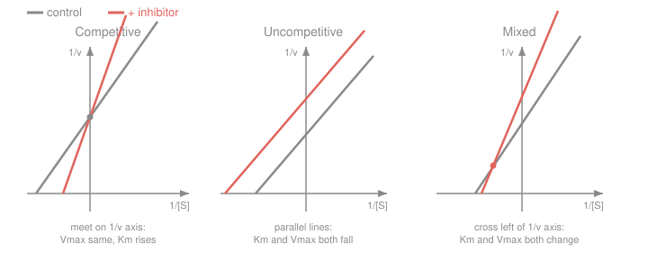

# Biochemistry · Lesson 2.3: Enzyme inhibition

> ⏱ ~15 min · Module 2: Enzymes & Bioenergetics · Builds on: [2.2 Michaelis–Menten kinetics](02-02-michaelis-menten-kinetics.md), [2.1 Enzymes & catalytic strategy](02-01-enzymes-catalytic-strategy.md) · Unlocks: [2.4 Allosteric regulation & metabolic control](02-04-allosteric-regulation-metabolic-control.md)

## Why this matters

Most drugs in your medicine cabinet are enzyme inhibitors: aspirin, penicillin, statins, ibuprofen, many chemotherapeutics. Designing one — or explaining a poison — starts with a diagnostic question you can answer from a table of numbers: *does the inhibitor compete with substrate, or does it wait for substrate to bind first?* Michaelis–Menten gave you $K_m$ and $V_{\max}$; inhibition is what happens to those two numbers when a molecule gets in the way, and the pattern of the change tells you the mechanism.

## The idea

Recall the two-step picture from [2.2](02-02-michaelis-menten-kinetics.md): enzyme grabs substrate to form the complex $\ce{ES}$, then $\ce{ES}$ turns over to product. An inhibitor can jam this in two fundamentally different places.

- **Competitive:** the inhibitor looks like the substrate and sits in the *same* active site. It can only bind the *free* enzyme $\ce{E}$ — once $\ce{S}$ is in, the door is taken. So it's a popularity contest for the active site, and you can win it back by shouting louder: **flood the system with substrate and the inhibitor gets outcompeted.** Top speed $V_{\max}$ is therefore unchanged; it just takes more substrate to get there, so the *apparent* $K_m$ goes up.
- **Uncompetitive:** the inhibitor binds *only the $\ce{ES}$ complex*, at a separate spot that appears once substrate is bound. Now adding more substrate makes things *worse*, because it makes more $\ce{ES}$ for the inhibitor to grab. It drags down both the top speed and the apparent $K_m$.
- **Mixed (and its symmetric special case, noncompetitive):** the inhibitor binds *both* $\ce{E}$ and $\ce{ES}$ at that separate site. You get a blend of both effects.

The whole lesson is one modified rate law with two knobs — one for "hurts free E," one for "hurts ES" — and reading which knob turned.

## The formal version

Two dimensionless inhibition factors, each $\geq 1$, measure how hard the inhibitor bites at each site:

$$\alpha = 1 + \frac{[I]}{K_i}, \qquad \alpha' = 1 + \frac{[I]}{K_i'}.$$

Here $[I]$ is the inhibitor concentration; $K_i$ is the **dissociation constant** for inhibitor binding *free enzyme* ($\ce{E + I <=> EI}$) and $K_i'$ is the one for binding the *complex* ($\ce{ES + I <=> ESI}$). *In words:* a small $K_i$ means tight binding, so even a little inhibitor makes $\alpha$ large; $\alpha=1$ means "this site is untouched."

The rate law becomes

$$v = \frac{V_{\max}[S]}{\alpha K_m + \alpha'[S]}.$$

*In words:* it's plain Michaelis–Menten with $K_m$ scaled by $\alpha$ and $[S]$ scaled by $\alpha'$. Divide top and bottom by $\alpha'$ to read off what an experimenter actually measures:

$$V_{\max}^{\text{app}} = \frac{V_{\max}}{\alpha'}, \qquad K_m^{\text{app}} = \frac{\alpha}{\alpha'}K_m.$$

| type | binds | $\alpha$ | $\alpha'$ | $V_{\max}^{\text{app}}$ | $K_m^{\text{app}}$ |
|---|---|---|---|---|---|
| competitive | E only | $>1$ | $1$ | unchanged | **up** ($\alpha K_m$) |
| uncompetitive | ES only | $1$ | $>1$ | **down** | **down** (both $\div\,\alpha'$) |
| mixed | E and ES | $>1$ | $>1$ | **down** | up or down |
| noncompetitive | E and ES equally ($K_i=K_i'$) | $=\alpha'$ | $=\alpha$ | **down** | unchanged |

*In words:* competitive touches only $K_m$, uncompetitive scales both the same way, and pure noncompetitive touches only $V_{\max}$.

**The trick that makes it diagnosable** is the double-reciprocal (Lineweaver–Burk) form from [2.2](02-02-michaelis-menten-kinetics.md) — take $1/v$ and it's a straight line in $1/[S]$:

$$\frac{1}{v} = \underbrace{\frac{\alpha K_m}{V_{\max}}}_{\text{slope}}\cdot\frac{1}{[S]} + \underbrace{\frac{\alpha'}{V_{\max}}}_{\text{y-intercept}}.$$

*In words:* the **y-intercept** ($1/[S]\to 0$, i.e. infinite substrate) reports $\alpha'$ — the ES effect — and the **slope** carries $\alpha$. Two numbers, two mechanisms, one plot.

## Picture

Read each panel by asking *what did the inhibitor move?* **Competitive:** both lines pin to the same y-intercept ($V_{\max}$ untouched) and the inhibited line is steeper — they meet on the vertical axis. **Uncompetitive:** same slope, higher intercept — **parallel** lines. **Mixed:** slope *and* intercept both rise, so the lines cross somewhere to the *left* of the y-axis (for pure noncompetitive, exactly on the x-axis).

## Worked examples

**Example 1 (mechanical — plug a competitive inhibitor into the rate law).**
An enzyme has $V_{\max}=100\ \mu\text{mol·min}^{-1}$ and $K_m=2$ mM. A competitive inhibitor is present at $[I]=4$ mM with $K_i=2$ mM. Find $\alpha$ and the rate at $[S]=8$ mM; compare to no inhibitor.

Competitive, so $\alpha' = 1$ and

$$\alpha = 1 + \frac{[I]}{K_i} = 1 + \frac{4}{2} = 3.$$

The apparent $K_m$ triples to $\alpha K_m = 6$ mM. Now the rate:

$$v = \frac{V_{\max}[S]}{\alpha K_m + \alpha'[S]} = \frac{100\cdot 8}{3\cdot 2 + 1\cdot 8} = \frac{800}{14} = 57.1\ \mu\text{mol·min}^{-1}.$$

Without inhibitor, $v_0 = \dfrac{100\cdot 8}{2+8} = 80\ \mu\text{mol·min}^{-1}$. The inhibitor cut the rate from 80 to 57 — but notice the escape hatch: as $[S]\to\infty$, *both* rates climb to the same $V_{\max}=100$. That's the signature of competition: you can always out-shout it with more substrate.

**Example 2 (diagnostic — read the mechanism off two data columns, then back out $K_i$).**
You measure initial rate $v$ (in $\mu\text{mol·min}^{-1}$) at two substrate concentrations, with and without an inhibitor at $[I]=8$ mM:

| $[S]$ (mM) | $v$, no inhibitor | $v$, $+I$ |
|---|---|---|
| 4  | 60 | 30 |
| 12 | 90 | 60 |

**Step 1 — get $V_{\max}$ and $K_m$ for each column.** Michaelis–Menten $v=\dfrac{V_{\max}[S]}{K_m+[S]}$ has two unknowns, and we have two data points per column, so solve directly. Rearrange each equation to $V_{\max}=\dfrac{v(K_m+[S])}{[S]}$ and set the two expressions equal.

*No inhibitor:* from $[S]=4$: $V_{\max}=15(K_m+4)=15K_m+60$; from $[S]=12$: $V_{\max}=7.5(K_m+12)=7.5K_m+90$. Equate:

$$15K_m + 60 = 7.5K_m + 90 \;\Rightarrow\; 7.5K_m = 30 \;\Rightarrow\; K_m = 4\text{ mM}, \quad V_{\max}=120.$$

*Plus inhibitor:* from $[S]=4$: $V_{\max}^{\text{app}}=7.5(K_m^{\text{app}}+4)$; from $[S]=12$: $V_{\max}^{\text{app}}=5(K_m^{\text{app}}+12)$. Equate:

$$7.5K_m^{\text{app}} + 30 = 5K_m^{\text{app}} + 60 \;\Rightarrow\; 2.5K_m^{\text{app}} = 30 \;\Rightarrow\; K_m^{\text{app}} = 12\text{ mM}, \quad V_{\max}^{\text{app}}=120.$$

**Step 2 — diagnose.** $V_{\max}$ is unchanged (120 both times) but the apparent $K_m$ tripled ($4\to 12$ mM). That is the competitive fingerprint: $\alpha'=1$, $\alpha>1$.

**Step 3 — back out $K_i$.** The apparent $K_m$ rose by the factor $\alpha$:

$$\alpha = \frac{K_m^{\text{app}}}{K_m} = \frac{12}{4} = 3 = 1 + \frac{[I]}{K_i} \;\Rightarrow\; \frac{8}{K_i}=2 \;\Rightarrow\; K_i = 4\text{ mM}.$$

So the inhibitor binds free enzyme with $K_i=4$ mM. (Sanity check on the coral line: same $V_{\max}$, steeper — lines meeting on the y-axis, exactly Panel A.)

## Watch out

- You might think **more substrate always beats an inhibitor**. Only for *competitive* inhibitors. For an uncompetitive inhibitor, piling on substrate makes *more* $\ce{ES}$ — the very thing it binds — so it makes inhibition *worse*. This is why uncompetitive inhibitors are prized in drug design: you can't dilute them out.
- You might think **"noncompetitive" and "uncompetitive" are the same word for the same thing**. They are opposites in flavor: noncompetitive (a symmetric mixed case) leaves $K_m$ *unchanged* and lowers $V_{\max}$; uncompetitive lowers *both*. The names are a historical trap — trust the $\alpha,\alpha'$ table, not the syllables.
- You might think a **small $K_i$ means weak inhibition**. Backwards: $K_i$ is a *dissociation* constant, so small $K_i$ = tight binding = strong inhibition. And these $\alpha,\alpha'$ formulas describe *reversible* inhibitors, which sit in equilibrium. **Irreversible** inhibitors (below) don't obey them — they take enzyme molecules permanently out of the game, so they lower $V_{\max}$ by shrinking the effective enzyme count, no matter how much substrate you add.

**Irreversible inhibitors as drugs.** Aspirin acetylates a serine in cyclooxygenase; penicillin covalently kills a bacterial cell-wall transpeptidase; many statins are tight, slowly-reversing HMG-CoA reductase blockers. A covalent bond isn't a competition you can win with more substrate — it's a permanent kill, which is exactly why these molecules are such durable drugs.

## One-liner

> The y-intercept of a Lineweaver–Burk plot reports $V_{\max}$ (the ES site), the slope reports $K_m$ (the E site): competitive spares the intercept, uncompetitive leaves lines parallel, mixed moves both.

## Problems

**P1 (🟢)** An enzyme has $V_{\max}=200\ \mu\text{mol·min}^{-1}$, $K_m=5$ mM. A competitive inhibitor is added at $[I]=15$ mM, $K_i=5$ mM. (a) Find $\alpha$ and the apparent $K_m$. (b) Compute $v$ at $[S]=10$ mM with and without the inhibitor.

**P2 (🟡)** Two double-reciprocal experiments on the same enzyme give these fitted lines (units: $1/v$ in min·μmol⁻¹, $1/[S]$ in mM⁻¹):
- control: $\dfrac{1}{v} = 0.02\cdot\dfrac{1}{[S]} + 0.01$
- $+$ inhibitor: $\dfrac{1}{v} = 0.02\cdot\dfrac{1}{[S]} + 0.03$

Diagnose the inhibition type, and give $V_{\max}$, $K_m$ (control), $V_{\max}^{\text{app}}$, and $\alpha'$.

**P3 (🔴, optional)** A mixed inhibitor gives $\alpha = 2$ and $\alpha' = 4$ at the tested $[I]$. Starting from $K_m^{\text{app}}=\dfrac{\alpha}{\alpha'}K_m$, does the apparent $K_m$ rise or fall? Then explain, using the Lineweaver–Burk slope and intercept, why the control and inhibited lines must cross *below* the x-axis in this case (contrast with pure noncompetitive, $\alpha=\alpha'$, which cross exactly *on* it).

Solutions

**P1.** (a) Competitive, so $\alpha' = 1$ and $\alpha = 1 + [I]/K_i = 1 + 15/5 = 4$. Apparent $K_m = \alpha K_m = 4\cdot 5 = 20$ mM.
(b) With inhibitor: $v = \dfrac{200\cdot 10}{4\cdot 5 + 1\cdot 10} = \dfrac{2000}{30} = 66.7\ \mu\text{mol·min}^{-1}$. Without: $v_0 = \dfrac{200\cdot 10}{5+10} = \dfrac{2000}{15} = 133.3\ \mu\text{mol·min}^{-1}$. The competitive inhibitor halved the rate at this $[S]$, but $V_{\max}=200$ is still reachable at saturating substrate.

**P2.** The slopes are identical (0.02) and the inhibited y-intercept is higher (0.03 vs 0.01) — **parallel lines shifted up = uncompetitive**.
- y-intercept $=1/V_{\max}=0.01 \Rightarrow V_{\max}=100\ \mu\text{mol·min}^{-1}$.
- slope $=K_m/V_{\max}=0.02 \Rightarrow K_m = 0.02\cdot 100 = 2$ mM.
- Inhibited y-intercept $=\alpha'/V_{\max}=0.03 \Rightarrow \alpha' = 0.03\cdot 100 = 3$, so $V_{\max}^{\text{app}} = V_{\max}/\alpha' = 100/3 = 33.3\ \mu\text{mol·min}^{-1}$.
(Consistency check: $K_m^{\text{app}} = K_m/\alpha' = 2/3 = 0.67$ mM — both dropped by $\alpha'=3$, as uncompetitive demands.)

**P3.** $K_m^{\text{app}} = \dfrac{\alpha}{\alpha'}K_m = \dfrac{2}{4}K_m = \tfrac12 K_m$ — it **falls** (to half). Now the two lines: control has slope $K_m/V_{\max}$ and intercept $1/V_{\max}$; the inhibited line has slope $\alpha K_m/V_{\max} = 2K_m/V_{\max}$ (steeper) and intercept $\alpha'/V_{\max}=4/V_{\max}$ (higher). Set the two $1/v$ expressions equal to find where they cross, writing $x=1/[S]$:

$$\frac{K_m}{V_{\max}}x + \frac{1}{V_{\max}} = \frac{2K_m}{V_{\max}}x + \frac{4}{V_{\max}} \;\Rightarrow\; 1 - 4 = (2-1)K_m x \;\Rightarrow\; x = -\frac{3}{K_m}.$$

At $x = -3/K_m$, plug into the control line: $\dfrac{1}{v} = \dfrac{K_m}{V_{\max}}\left(-\dfrac{3}{K_m}\right) + \dfrac{1}{V_{\max}} = \dfrac{-3+1}{V_{\max}} = -\dfrac{2}{V_{\max}} < 0$. The crossing point sits at negative $1/v$ — **below the x-axis** — because $\alpha' > \alpha$. For pure noncompetitive, $\alpha=\alpha'$, the numerator $1-\alpha'$ and denominator $(\alpha-1)K_m$ give $x = -1/K_m$, where $1/v = 0$ exactly — the lines meet *on* the x-axis (and $K_m^{\text{app}}=K_m$ is unchanged, the noncompetitive signature).

## Flashback

**From Lesson 2.2 (Michaelis–Menten kinetics):** An enzyme obeys Michaelis–Menten with $V_{\max}=90\ \mu\text{mol·min}^{-1}$ and $K_m=3$ mM. (a) Compute the initial rate at $[S]=1$ mM. (b) At what $[S]$ does the enzyme run at exactly half its maximum rate?

Solution

(a) $v = \dfrac{V_{\max}[S]}{K_m+[S]} = \dfrac{90\cdot 1}{3+1} = \dfrac{90}{4} = 22.5\ \mu\text{mol·min}^{-1}$.
(b) Half-maximal means $v = V_{\max}/2$, which forces $K_m + [S] = 2[S]$, i.e. $[S] = K_m = 3$ mM. That's the defining meaning of $K_m$: the substrate concentration at half of $V_{\max}$ — the anchor every inhibition "apparent $K_m$" in this lesson is measured against.

## Connections

- **Backward:** this is [2.2](02-02-michaelis-menten-kinetics.md)'s rate law with two scaling factors, read through its Lineweaver–Burk linearization; the free-E-vs-ES distinction is the two-step [2.1](02-01-enzymes-catalytic-strategy.md) mechanism deciding *where* the inhibitor can dock.
- **Forward:** [2.4](02-04-allosteric-regulation-metabolic-control.md) generalizes "a molecule that binds elsewhere and changes activity" into allosteric regulation and feedback inhibition — the cell's physiological version of what a drug does artificially; the $K_i$ logic returns when scoring effector strength.
- **Sideways (statistics / data fitting):** Lineweaver–Burk is a *reciprocal transform that turns a curve into a straight line so you can read parameters off a slope and intercept* — the same linearize-then-fit move behind semilog plots and linear regression in `prob-stat-refresher`. (Modern practice fits the hyperbola directly by nonlinear regression, because taking reciprocals blows up the error on small $v$ — a nice cautionary tale about transforming data before fitting.)
