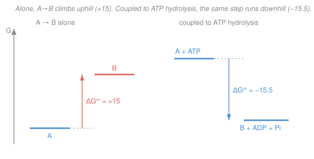

# Biochemistry · Lesson 2.5: Bioenergetics — ΔG, ATP & redox carriers

> ⏱ ~15 min · Module 2: Enzymes & Bioenergetics · Builds on: [2.1 Enzymes & catalytic strategy](02-01-enzymes-catalytic-strategy.md), [`thermodynamics-physics`](../../thermodynamics-physics/syllabus.md) · Unlocks: all of Module 3 — [3.2 Glycolysis](03-02-glycolysis.md), [3.4 Oxidative phosphorylation](03-04-oxidative-phosphorylation.md)

## Why this matters

Enzymes (Lessons 2.1–2.4) control *how fast* a reaction goes, but never *which way* — kinetics can't repeal thermodynamics. This lesson is the ledger every reaction in the cell must balance. It answers two questions that run all of metabolism: how does a cell force an uphill reaction to happen anyway (spoiler: it spends ATP), and how much energy is hiding in the electrons a fuel gives up (spoiler: enough to make ~30 ATP from one glucose). Get this and Module 3 becomes bookkeeping.

## The idea

**Spontaneity is about ΔG, not ΔG°′.** A reaction runs forward whenever its **Gibbs free-energy change** $\Delta G$ is negative — energy is released. The *standard* value $\Delta G^{\circ\prime}$ is just the value at a fixed reference (everything at 1 M, pH 7); the *actual* $\Delta G$ slides up or down as concentrations change. A reaction with an unfavorable $\Delta G^{\circ\prime}$ can still run if the cell keeps products scarce and reactants piled high.

**Coupling: pay for the uphill climb.** If reaction A→B is uphill, the cell doesn't cheat thermodynamics — it *adds* a steeply downhill reaction (usually ATP hydrolysis) that shares a chemical intermediate, so the **sum** is downhill. Think of a cash-strapped errand paid for by a rich sponsor walking the same route: individually one loses money, but the combined trip nets a profit. The magic word is *shared intermediate* — the two reactions must physically hand off a molecule, not just happen nearby.

**Electrons carry energy too.** Burning fuel means stripping electrons off carbon and letting them "fall" to oxygen. The cell catches those electrons on shuttle molecules — **NAD⁺** and **FAD** — and cashes them in later. How much energy a fall releases is set by **reduction potential** $E^{\circ\prime}$: a molecule's eagerness to grab electrons. Electrons falling from a reluctant carrier (NADH) to an eager acceptor (O₂) release a lot of energy — the same "downhill" idea, now in volts.

## The formal version

**The master equation.** For a reaction with reaction quotient $Q$ (products over reactants, each concentration in M, raised to its stoichiometric coefficient),

$$\Delta G = \Delta G^{\circ\prime} + RT\ln Q,$$

where $R = 8.314\ \text{J·mol}^{-1}\text{·K}^{-1}$ is the gas constant and $T$ is temperature (K). *In words: the real free-energy change is the standard value plus a correction for how far current concentrations sit from 1 M each.* At equilibrium $\Delta G = 0$ and $Q = K_{\text{eq}}'$, giving the crucial link

$$\Delta G^{\circ\prime} = -RT\ln K_{\text{eq}}'.$$

*In words: the standard free energy just encodes the equilibrium constant — a large negative $\Delta G^{\circ\prime}$ means products vastly outnumber reactants at equilibrium.*

**Why the prime?** The physicist's $\Delta G^{\circ}$ takes standard state as 1 M for *everything*, including $\ce{H+}$ (pH 0) and water. That's absurd for a cell. The **biochemical standard** $\Delta G^{\circ\prime}$ redefines the reference: $[\ce{H+}] = 10^{-7}$ M (pH 7), $[\ce{H2O}] = 55.5$ M, and $[\ce{Mg^2+}]$ fixed — all folded into the constant so protons and water don't appear in $Q$. *In words: the prime means "measured under conditions a cell could actually survive."*

**Energy coupling.** Two reactions sharing an intermediate add their free energies:

$$\ce{A -> B}\quad (\Delta G_1^{\circ\prime} > 0), \qquad \ce{ATP + H2O -> ADP + Pi}\quad (\Delta G_2^{\circ\prime} = -30.5\ \text{kJ/mol})$$

net to $\ce{A + ATP -> B + ADP + Pi}$ with $\Delta G^{\circ\prime} = \Delta G_1^{\circ\prime} + \Delta G_2^{\circ\prime}$. *In words: free energies of coupled steps add, so a big enough ATP-hydrolysis discount can flip any modest uphill reaction downhill.*

**Phosphoryl-transfer potential.** ATP hydrolysis is favorable because ADP + Pᵢ is more stable (charge relief, resonance, better solvation) than ATP. Ranking compounds by how much energy their phosphate release gives:

$$\underbrace{\text{PEP}}_{-61.9} > \underbrace{\text{1,3-BPG}}_{-49.3} > \underbrace{\text{ATP}}_{-30.5} > \underbrace{\text{glucose-6-P}}_{-13.8}\quad (\Delta G^{\circ\prime}\ \text{of hydrolysis, kJ/mol}).$$

*In words: ATP sits deliberately in the middle — high-energy donors above it (PEP, 1,3-BPG, made in glycolysis) can recharge ADP→ATP, and ATP can in turn phosphorylate low-energy acceptors below it (glucose→glucose-6-P). A mid-range currency can both receive and pay.*

**Redox carriers and reduction potential.** Oxidation is losing electrons; reduction is gaining them. The two hydride/electron shuttles:

$$\ce{NAD+ + 2e- + H+ -> NADH}, \qquad \ce{FAD + 2e- + 2H+ -> FADH2}.$$

Each carrier's **standard reduction potential** $E^{\circ\prime}$ (volts, at pH 7) measures its pull on electrons — more positive means a stronger grab. Free energy and potential connect through

$$\Delta G^{\circ\prime} = -nF\,\Delta E^{\circ\prime}, \qquad \Delta E^{\circ\prime} = E^{\circ\prime}_{\text{acceptor}} - E^{\circ\prime}_{\text{donor}},$$

where $n$ is electrons transferred and $F = 96{,}485\ \text{C/mol}$ is Faraday's constant. *In words: electrons falling to a more eager acceptor ($\Delta E^{\circ\prime} > 0$) release energy ($\Delta G^{\circ\prime} < 0$); the bigger the voltage drop, the bigger the payoff.*

## Picture

The left panel is A→B by itself — B sits above A, so it won't go. The right panel couples the *same* conversion to ATP hydrolysis through a shared intermediate: now the start (A + ATP) sits above the end (B + ADP + Pᵢ), and the whole thing rolls downhill. Same chemistry for A→B; the sponsor reaction changed the slope.

## Worked examples

**Example 1 (coupling — flip an uphill reaction).** Reaction $\ce{A -> B}$ has $\Delta G^{\circ\prime} = +15$ kJ/mol. Couple it to ATP hydrolysis ($-30.5$ kJ/mol) at $T = 310$ K.

*Step 1 — alone, how bad is it?* Using $\Delta G^{\circ\prime} = -RT\ln K_{\text{eq}}'$ with $RT = 8.314 \times 310 = 2577\ \text{J/mol} = 2.577\ \text{kJ/mol}$:

$$K_{\text{eq}}' = e^{-\Delta G^{\circ\prime}/RT} = e^{-15000/2577} = e^{-5.82} \approx 0.0030 = \frac{[B]}{[A]}.$$

So unassisted, A outnumbers B about 340-to-1 — the reaction barely happens.

*Step 2 — add the sponsor.* Free energies add:

$$\Delta G^{\circ\prime}_{\text{sum}} = +15 + (-30.5) = -15.5\ \text{kJ/mol} < 0.$$

Negative, so the coupled reaction $\ce{A + ATP -> B + ADP + Pi}$ is now spontaneous.

*Step 3 — the coupled equilibrium ratio.* With ATP, ADP, and Pᵢ each held at the 1 M standard state, $Q = [B]/[A]$ and

$$\frac{[B]}{[A]} = K_{\text{eq}}' = e^{-\Delta G^{\circ\prime}_{\text{sum}}/RT} = e^{15500/2577} = e^{6.01} \approx 410.$$

Coupling swung the ratio from $0.003$ to $410$ — a shift of about $10^5$-fold in B's favor. That factor is exactly $e^{30500/2577} = e^{11.8}$, the ATP-hydrolysis discount in disguise. *That is what "ATP drives a reaction" means, quantitatively.*

**Example 2 (redox — energy in a falling electron).** NADH is oxidized by oxygen, the reaction at the end of respiration. Given $E^{\circ\prime}(\ce{NAD+}/\ce{NADH}) = -0.32$ V and $E^{\circ\prime}(\tfrac{1}{2}\ce{O2}/\ce{H2O}) = +0.82$ V, with $n = 2$ electrons.

*Step 1 — which way do electrons flow?* Toward the more positive (eager) potential: from NADH up to O₂. So O₂ is the acceptor, NAD⁺/NADH the donor:

$$\Delta E^{\circ\prime} = E^{\circ\prime}_{\text{acceptor}} - E^{\circ\prime}_{\text{donor}} = 0.82 - (-0.32) = 1.14\ \text{V}.$$

*Step 2 — convert volts to kJ/mol.*

$$\Delta G^{\circ\prime} = -nF\,\Delta E^{\circ\prime} = -(2)(96485)(1.14) = -2.20\times10^{5}\ \text{J/mol} = -220\ \text{kJ/mol}.$$

*Step 3 — how many ATP could that drive?* Each ATP costs 30.5 kJ/mol to make, so the thermodynamic ceiling is

$$\frac{220}{30.5} \approx 7\ \text{ATP per NADH}.$$

The cell actually banks about **2.5 ATP per NADH** (Lesson 3.4) — roughly 35% efficiency, the rest lost as heat and as the safety margin that keeps the chain running forward. The point: one NADH is a fat energy packet, and oxygen's strong pull is why aerobes get so much more ATP than fermenters.

## Watch out

- **You might think a positive $\Delta G^{\circ\prime}$ means the reaction can't happen.** But spontaneity is set by $\Delta G$, not $\Delta G^{\circ\prime}$. Keep products scarce (a downstream enzyme drains B fast) and the $RT\ln Q$ term goes negative enough to pull $\Delta G$ below zero. Cells run mildly uphill steps this way all the time.
- **You might think ATP's phosphate bond is a special "high-energy bond" that stores energy like a battery.** No — the energy is released by the *overall* hydrolysis (product stabilization: charge relief + resonance + solvation), not stored in one bond. "High-energy bond" is sloppy shorthand for "large negative $\Delta G^{\circ\prime}$ of hydrolysis."
- **You might mix up the sign convention for $\Delta E^{\circ\prime}$.** Use acceptor *minus* donor. A *positive* $\Delta E^{\circ\prime}$ gives a *negative* $\Delta G^{\circ\prime}$ (favorable) — the two signs are opposite because of the minus in $\Delta G^{\circ\prime} = -nF\Delta E^{\circ\prime}$.

## One-liner

> Spontaneity rides on $\Delta G = \Delta G^{\circ\prime} + RT\ln Q$, not the standard value alone; the cell buys uphill reactions with ATP by sharing an intermediate, and reads the energy in a falling electron off $\Delta G^{\circ\prime} = -nF\Delta E^{\circ\prime}$.

## Problems

**P1 (🟢)** A kinase couples glucose phosphorylation to ATP. Glucose + Pᵢ → glucose-6-P has $\Delta G^{\circ\prime} = +13.8$ kJ/mol; ATP hydrolysis is $-30.5$ kJ/mol. Compute $\Delta G^{\circ\prime}$ for the coupled reaction $\ce{glucose + ATP -> glucose-6-P + ADP}$, and state whether it is spontaneous under standard conditions.

**P2 (🟡)** In glycolysis the enzyme phosphoglycerate kinase transfers a phosphoryl group from 1,3-bisphosphoglycerate (hydrolysis $\Delta G^{\circ\prime} = -49.3$ kJ/mol) to ADP, making ATP (i.e. reversing ATP hydrolysis, $+30.5$ kJ/mol). Find $\Delta G^{\circ\prime}$ for this ATP-*making* step and explain, using the phosphoryl-transfer ranking, why it can run.

**P3 (🔴, connects to physics)** FADH₂ enters the chain at a less negative potential than NADH: $E^{\circ\prime}(\ce{FAD}/\ce{FADH2}) = +0.03$ V. For FADH₂ oxidized by O₂ ($E^{\circ\prime} = +0.82$ V, $n = 2$), compute $\Delta E^{\circ\prime}$ and $\Delta G^{\circ\prime}$, and explain why FADH₂ yields fewer ATP (~1.5) than NADH (~2.5). This voltage-to-energy conversion is the same $\Delta G = -nF\Delta E$ used in electrochemistry — see [`thermodynamics-physics`](../../thermodynamics-physics/syllabus.md).

Solutions

**P1** Free energies of coupled steps add:

$$\Delta G^{\circ\prime}_{\text{sum}} = (+13.8) + (-30.5) = -16.7\ \text{kJ/mol}.$$

Negative, so **spontaneous** under standard conditions. (This is exactly what hexokinase does in glycolysis step 1 — Lesson 3.2. Note the shared intermediate is the phosphoryl group handed from ATP straight to glucose, never released as free Pᵢ.)

*Check.* Sign makes sense: a $+13.8$ climb is smaller than the $30.5$ discount, so the sum lands comfortably below zero. ✓

**P2** Add the phosphate donor's hydrolysis to the reverse of ATP hydrolysis:

$$\Delta G^{\circ\prime} = (-49.3) + (+30.5) = -18.8\ \text{kJ/mol}.$$

Still negative, so it runs forward and makes ATP. **Why:** 1,3-BPG sits *above* ATP on the phosphoryl-transfer ranking ($-49.3$ vs. $-30.5$), so it is a stronger phosphate donor — it can charge ADP→ATP with energy to spare. Compounds above ATP recharge it; compounds below it get phosphorylated by it. This is substrate-level phosphorylation.

*Check.* The $18.8$ kJ/mol left over is the gap between the two hydrolysis potentials, $49.3 - 30.5 = 18.8$ ✓ — nothing is created, ATP just skims the difference.

**P3** Electrons fall from FADH₂ (donor) to O₂ (acceptor):

$$\Delta E^{\circ\prime} = 0.82 - 0.03 = 0.79\ \text{V},$$
$$\Delta G^{\circ\prime} = -nF\Delta E^{\circ\prime} = -(2)(96485)(0.79) = -1.52\times10^{5}\ \text{J/mol} = -152\ \text{kJ/mol}.$$

Compare NADH's $-220$ kJ/mol (Example 2). FADH₂ starts from a *higher* (less negative) potential, so its electrons have a **shorter distance to fall** to oxygen — smaller $\Delta E^{\circ\prime}$, smaller energy release. Physically (Lesson 3.4) FADH₂ enters the chain past Complex I, pumping fewer protons, so it drives fewer ATP: $152/30.5 \approx 5$ thermodynamic ceiling, ~1.5 actually banked, versus NADH's ~2.5.

*Check.* The ratio of energies $152/220 \approx 0.69$ tracks the ratio of banked ATP $1.5/2.5 = 0.6$ — same efficiency, less raw voltage. ✓ Units: $\text{C/mol} \times \text{V} = \text{C/mol} \times \text{J/C} = \text{J/mol}$ ✓.

## Flashback

**From Lesson 2.2 (Michaelis–Menten kinetics):** An enzyme has $V_{\max} = 60\ \mu\text{mol/min}$ and $K_m = 4$ mM. Find the initial velocity $v$ at substrate concentration $[S] = 12$ mM. (Fresh numbers.)

Solution

$$v = \frac{V_{\max}[S]}{K_m + [S]} = \frac{60 \times 12}{4 + 12} = \frac{720}{16} = 45\ \mu\text{mol/min}.$$

*Check.* At $[S] = 3K_m$ the enzyme should be at $3/(1+3) = 75\%$ of $V_{\max}$, and $45/60 = 0.75$ ✓. The kinetics (how fast) is a separate axis from today's thermodynamics (how far) — an enzyme sets $v$ but never changes the reaction's $\Delta G$.

## Connections

- **Backward:** [2.1 Enzymes & catalytic strategy](02-01-enzymes-catalytic-strategy.md) showed enzymes lower activation energy without touching $\Delta G$ — this lesson is the $\Delta G$ half of that promise. The coupling logic also underlies [2.4](02-04-allosteric-regulation-metabolic-control.md)'s committed step: cells regulate the reactions where a big negative $\Delta G$ makes flux effectively one-way.
- **Forward:** every reaction in Module 3 is scored with these tools — [3.2 Glycolysis](03-02-glycolysis.md) invests 2 ATP to bank 4 (coupling + phosphoryl transfer), and [3.4 Oxidative phosphorylation](03-04-oxidative-phosphorylation.md) cashes NADH/FADH₂ down the potential ladder from $-0.32$ V to $+0.82$ V to make most of the cell's ATP.
- **Sideways (physics):** $\Delta G = \Delta G^{\circ\prime} + RT\ln Q$ is the chemistry face of Gibbs free energy from [`thermodynamics-physics`](../../thermodynamics-physics/syllabus.md), and the $RT\ln Q$ term is a Boltzmann-weighted population ratio straight out of [`stat-mech`](../../stat-mech/syllabus.md) — the $e^{-\Delta G/RT}$ in Example 1 is a Boltzmann factor. The redox relation $\Delta G^{\circ\prime} = -nF\Delta E^{\circ\prime}$ is the same equation electrochemistry uses to turn cell voltages into energy.
