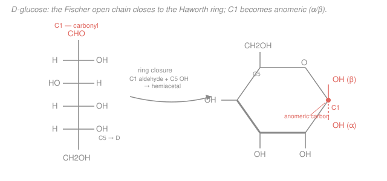

# Biochemistry · Lesson 3.1: Carbohydrates — structure & storage

> ⏱ ~15 min · Module 3: Central Metabolism · Builds on: [organic-chemistry](../../organic-chemistry/syllabus.md) (stereochemistry, hemiacetal formation) · Unlocks: [3.2 Glycolysis](03-02-glycolysis.md)

## Why this matters

This lesson opens Module 3, the energy highway — and every molecule that travels it starts as a sugar. The remarkable thing is how *little* chemistry separates the sugar you eat from the sugar you can't. Glucose stored as glycogen is dinner; the very same glucose stored as cellulose is dietary fiber your gut can't touch. The only difference is the *angle* of one bond. Learn to read that bond and you can predict, from a drawing alone, whether a polysaccharide is fuel, a rip-cord energy reserve, or a structural cable.

## The idea

A monosaccharide is almost embarrassingly simple: a short carbon chain wearing an $\ce{-OH}$ on nearly every carbon, plus one carbon doubled to oxygen (a **carbonyl**). Glucose is six carbons of exactly this. Because those hydroxyls and the carbonyl are on the same molecule, one $\ce{-OH}$ can reach around and attack the carbonyl — the chain bites its own tail and closes into a **ring**. This is the hemiacetal reaction you met in organic chemistry, run intramolecularly.

Closing the ring creates a brand-new detail: the old carbonyl carbon, once flat, is now a stereocenter with an $\ce{-OH}$ that can point either **down** ($\alpha$) or **up** ($\beta$). That carbon is the **anomeric carbon**, and that single up/down choice — invisible on the open chain — is the hinge the whole lesson turns on. When we glue sugars together, we glue *through* that anomeric $\ce{-OH}$, and whether it was pointing up or down gets frozen into the link. $\alpha$ links coil into digestible storage; $\beta$ links stack into indigestible fiber. Same brick, different mortar, completely different building.

## The formal version

**Monosaccharides.** Formula $\ce{(CH2O)_n}$ — literally "hydrated carbon," the origin of *carbo-hydrate*. Glucose, fructose, and galactose are all $\ce{C6H12O6}$ (hexoses). Two classifications:

- **Aldose vs. ketose:** an *aldose* has its carbonyl at the end of the chain (C1, an aldehyde) — glucose and galactose. A *ketose* has it internal (C2, a ketone) — fructose.
- **D vs. L:** set by the configuration at the chiral carbon *farthest* from the carbonyl (C5 in a hexose). $\ce{-OH}$ on the right in a Fischer projection = **D**; on the left = **L**. Nearly all biological sugars are D.

*In words: name a sugar by where its carbonyl sits (end or middle) and which way the last stereocenter points.* Glucose and galactose differ at exactly one carbon (C4) — they are **epimers**.

**Ring forms and anomers.** The C1 aldehyde and the C5 hydroxyl react intramolecularly to form a cyclic **hemiacetal** — a six-membered *pyranose* ring (fructose can form a five-membered *furanose*). The former carbonyl carbon is now the **anomeric carbon**: it bears the ring oxygen *and* a new $\ce{-OH}$.

$$\alpha\text{-anomer: anomeric }\ce{-OH}\text{ points down (trans to }\ce{CH2OH})\qquad \beta\text{-anomer: points up (cis)}$$

*In words: the anomeric carbon is the only ring carbon attached to two oxygens; $\alpha$/$\beta$ just records which face its new $\ce{-OH}$ ended up on.*

**Mutarotation.** In water the ring pops open to the aldehyde and re-closes, each time freely re-choosing $\alpha$ or $\beta$. So pure $\alpha$-glucose dissolved in water drifts to an equilibrium mixture (about $36\%\ \alpha$, $64\%\ \beta$, trace open chain) — visible as a change in optical rotation from $+112^\circ$ toward $+52.7^\circ$. *In words: sugars quietly shuffle between $\alpha$ and $\beta$ through the open chain until they hit a fixed ratio.*

**The glycosidic bond.** Join the anomeric $\ce{-OH}$ of one sugar to an $\ce{-OH}$ of another, expelling water (a condensation):

$$\ce{2 C6H12O6 -> C12H22O11 + H2O}$$

The bond is named by the anomeric configuration and the two carbons joined: **$\alpha(1\to4)$**, **$\alpha(1\to6)$**, or **$\beta(1\to4)$**. *In words: the glycosidic bond is the anomeric carbon of one ring bolted onto a specific carbon of the next, and its $\alpha$/$\beta$ label is permanent once formed.*

**Storage vs. structure — same monomer, three polymers of glucose:**

| Polymer | Backbone | Branches | Job |
|---|---|---|---|
| **Glycogen** (animals) | $\alpha(1\to4)$ | $\alpha(1\to6)$, ~1 per 8–12 residues | fast-mobilized fuel reserve |
| **Starch** (plants: amylose + amylopectin) | $\alpha(1\to4)$ | $\alpha(1\to6)$, sparser | plant fuel reserve |
| **Cellulose** (plant walls) | $\beta(1\to4)$ | none | rigid structural fiber |

*In words: $\alpha(1\to4)$ chains coil into loose, hydrated helices enzymes attack easily; $\alpha(1\to6)$ branches add end-points for rapid release; $\beta(1\to4)$ chains lie flat, hydrogen-bond into ribbons, and go rigid.* Humans secrete $\alpha$-amylases but no **cellulase** ($\beta$-glucosidase), so we digest starch and glycogen but pass cellulose through as fiber.

## Picture

The Fischer chain (left) is the open aldehyde; ring closure joins C1 to the C5 oxygen. On the Haworth ring (right) C1 is the anomeric carbon: the coral $\ce{-OH}$ down is $\alpha$, up is $\beta$.

## Worked examples

**Example 1 (read a Haworth, assign the anomer, explain mutarotation).** You are handed a Haworth drawing of a D-glucopyranose. The $\ce{CH2OH}$ (C6) sits up above the ring, the ring oxygen is at the top-right, and moving clockwise from that oxygen the first ring carbon bears an $\ce{-OH}$ pointing *up*. Name the anomeric carbon and the anomer; then predict what happens when it dissolves.

*Step 1 — find the anomeric carbon.* It is the ring carbon bonded to **two** oxygens: the ring oxygen and a free $\ce{-OH}$. That is the carbon immediately clockwise from the ring O — namely **C1**. (No other ring carbon touches the ring oxygen *and* carries an extra $\ce{-OH}$.)

*Step 2 — assign $\alpha$/$\beta$.* Compare the anomeric $\ce{-OH}$ to the reference $\ce{CH2OH}$ (C6), which points up. The anomeric $\ce{-OH}$ also points **up** — same side, *cis* — so this is **$\beta$-D-glucopyranose**. (Down/*trans* would be $\alpha$.)

*Step 3 — mutarotation.* In water this pure $\beta$ form won't stay pure. The ring transiently opens to the free C1 aldehyde and re-closes, each cycle re-rolling the dice on the anomeric face. Given time it reaches the fixed equilibrium (~$64\%\ \beta$, $36\%\ \alpha$). Nothing about the molecule's connectivity changed — only the anomeric configuration equilibrated — yet the measured optical rotation slides to its equilibrium value of $+52.7^\circ$. That interconversion *is* mutarotation.

**Example 2 (glycogen vs. cellulose — why the bond geometry dictates the job).** Both are polymers of nothing but D-glucose. Why is one a fast fuel depot and the other a structural cable you can't eat?

*Cellulose — $\beta(1\to4)$.* A $\beta$ link forces each successive glucose to flip $180^\circ$ relative to its neighbor. The chain therefore extends into a **straight, flat ribbon**. Straight ribbons pack side-by-side and lock together through a dense lattice of inter-chain hydrogen bonds, forming rigid, water-excluding microfibrils — perfect for a plant cell wall under turgor pressure. Those buried $\beta(1\to4)$ bonds are sterically shielded, and human enzymes can't fit the $\beta$ geometry anyway, so the polymer is indigestible fiber.

*Glycogen — $\alpha(1\to4)$ backbone + $\alpha(1\to6)$ branches.* An $\alpha$ link bends the chain the same way each step, so the backbone **coils into an open helix** — hydrated, floppy, and easy for enzymes to grip. Now the branches. Glycogen phosphorylase chews glucose off only from **non-reducing ends** (the free-C4 tails), one residue at a time. A linear chain has exactly *one* such end; every $\alpha(1\to6)$ branch point sprouts a *new* non-reducing end. A heavily branched molecule therefore offers dozens of ends to attack **simultaneously**, so glucose floods out fast when a muscle suddenly demands fuel. Branching also keeps the giant molecule soluble.

So: $\alpha$ vs. $\beta$ decides helix vs. ribbon (mobilizable vs. rigid), and the $\alpha(1\to6)$ branch density tunes *how fast* the store can be spent. Geometry is function.

## Watch out

- **You might think $\alpha$/$\beta$ is a property of the sugar. It's a property of the anomeric carbon only, and it's not even fixed** — free glucose in solution mutarotates between both. It becomes permanent *only once* the anomeric $\ce{-OH}$ is locked into a glycosidic bond (a glycoside no longer mutarotates at that carbon).
- **You might think starch and cellulose differ because they're different sugars. They are the identical monomer, D-glucose.** The entire digestible/indigestible split comes from $\alpha(1\to4)$ vs. $\beta(1\to4)$ — one stereochemical flip at C1.
- **You might read "D" off the anomeric carbon. D/L is set at C5** (the farthest chiral carbon), decided in the open chain and unchanged by ring closure; $\alpha/\beta$ is a *separate* label living at C1. Don't conflate the two stereocenters.

## One-liner

> A sugar's fate is written at its anomeric carbon: $\alpha$ links coil into fuel you can burn, $\beta$ links stack into fiber you can't — same glucose, one bond's difference.

## Problems

**P1 (🟢)** D-galactose is the C4 epimer of D-glucose (its C4 $\ce{-OH}$ points the other way); it is otherwise identical. (a) Is galactose an aldose or a ketose, and how many carbons does it have? (b) What is its molecular formula? (c) When it closes to a pyranose ring, which carbon is the anomeric carbon, and what two ring forms result?

**P2 (🟡)** Maltose is two glucoses joined $\alpha(1\to4)$; cellobiose is two glucoses joined $\beta(1\to4)$. Both are $\ce{C12H22O11}$. (a) Humans digest maltose to glucose but excrete cellobiose intact — explain why, in terms of enzyme specificity. (b) In each disaccharide, one glucose has used its anomeric carbon to form the glycosidic bond while the other still has a *free* anomeric $\ce{-OH}$. What can that second, free anomeric carbon still do that the bonded one cannot?

**P3 (🔴, optional — bridges to physical chemistry/physiology)** A hepatocyte holds roughly $0.4\ \text{mol/L}$ of glucose *equivalents* in reserve. (a) If it stored them as *free* glucose, estimate the osmotic pressure that solute alone would generate at body temperature, using $\Pi = cRT$ with $c = 0.4\ \text{mol/L}$, $R = 8.314\ \text{J·mol}^{-1}\text{K}^{-1}$, and $T = 310\ \text{K}$. (Give the answer in atm; $1\ \text{atm} = 101{,}325\ \text{Pa}$.) (b) Glycogen polymerizes ~$50{,}000$ glucose units into one molecule. In one sentence, explain why this nearly eliminates the osmotic cost you just computed.

Solutions

**P1.** (a) Galactose is glucose's C4 epimer, so it shares glucose's carbonyl position: an **aldose** with its carbonyl at C1, and it has **6 carbons** (a hexose). (b) Same as glucose: $\ce{C6H12O6}$ — epimers are stereoisomers, identical formula. (c) Ring closure is the C1 aldehyde attacking the C5 $\ce{-OH}$ (a pyranose), so the anomeric carbon is **C1**. It can close two ways, giving **$\alpha$-D-galactopyranose** (anomeric $\ce{-OH}$ down) and **$\beta$-D-galactopyranose** (up), which interconvert by mutarotation.

**P2.** (a) Digestive enzymes are stereospecific for the *geometry* of the glycosidic bond. Human $\alpha$-amylase and maltase hydrolyze the $\alpha(1\to4)$ bond of maltose, but no human enzyme (no cellulase / $\beta$-glucosidase) fits the $\beta(1\to4)$ bond of cellobiose — so cellobiose passes through undigested. It is the bond's $\alpha$-vs-$\beta$ configuration, not the sugar, that the enzyme reads. (b) The free anomeric carbon can still open to the aldehyde (mutarotate) and, because that aldehyde is a **reducing group**, it can act as a *reducing end* — reducing agents like Cu²⁺ in classic sugar tests (i.e., maltose and cellobiose are reducing sugars). The anomeric carbon locked in the glycosidic bond can no longer open, so it neither mutarotates nor reduces. *(This "one free anomeric end per chain" is exactly the non-reducing/reducing-end bookkeeping behind Example 2's mobilization argument.)*

**P3.** (a) Convert concentration to SI: $c = 0.4\ \text{mol/L} = 400\ \text{mol/m}^3$. Then
$$\Pi = cRT = (400)(8.314)(310) \approx 1.03\times 10^{6}\ \text{Pa}.$$
In atmospheres: $\Pi = \dfrac{1.03\times 10^{6}}{101{,}325} \approx 10\ \text{atm}$. That is a crushing osmotic load — water would pour into the cell and burst it.

(b) Osmotic pressure counts *particles*, not mass. Packing ~$50{,}000$ glucose molecules into a single glycogen molecule cuts the particle count by ~$50{,}000$-fold, so the same stored carbon contributes a negligible $\Pi$ (~$10\ \text{atm}/50{,}000 \approx 0.0002\ \text{atm}$). Storing fuel as one big polymer, not many small solutes, is how the cell hoards glucose without drowning itself.

## Flashback

**From Lesson 2.5 (Bioenergetics — coupling):** A metabolic step $\ce{A -> B}$ has $\Delta G^{\circ\prime} = +12\ \text{kJ/mol}$ — unfavorable on its own. The cell couples it to ATP hydrolysis ($\Delta G^{\circ\prime} = -30.5\ \text{kJ/mol}$). (a) Find $\Delta G^{\circ\prime}$ for the coupled reaction. (b) Compute the equilibrium ratio $[\ce{B}]/[\ce{A}]$ it can reach at $37\,^\circ\text{C}$ (use $R = 8.314\ \text{J·mol}^{-1}\text{K}^{-1}$, $T = 310\ \text{K}$).

Solution

(a) Coupling adds the free energies:
$$\Delta G^{\circ\prime}_{\text{coupled}} = (+12) + (-30.5) = -18.5\ \text{kJ/mol}.$$
Now negative — the ATP-driven reaction is spontaneous under standard conditions.

(b) At equilibrium $\Delta G^{\circ\prime} = -RT\ln K$, so
$$K = \exp\!\left(\frac{-\Delta G^{\circ\prime}}{RT}\right) = \exp\!\left(\frac{18{,}500}{(8.314)(310)}\right) = \exp(7.18) \approx 1.3\times 10^{3}.$$
Coupling to ATP shifts the attainable ratio from $[\ce{B}]/[\ce{A}] = \exp(-12{,}000/2577) \approx 0.01$ (heavily toward A) all the way to about **1,300 in favor of B** — a swing of five orders of magnitude, bought by spending one ATP. *(This is the same coupling logic that will drive the "investment" steps of glycolysis in [3.2](03-02-glycolysis.md).)*

## Connections

- **Backward:** ring closure is the intramolecular **hemiacetal** reaction from [organic-chemistry](../../organic-chemistry/syllabus.md), and $\alpha$/$\beta$ anomers are a stereochemistry problem — a new stereocenter born at the carbonyl carbon. The Flashback reuses the energy-coupling ledger from [2.5 Bioenergetics](02-05-bioenergetics-atp-redox.md).
- **Forward:** [3.2 Glycolysis](03-02-glycolysis.md) takes one glucose and dismantles it for ATP; glycogen and starch are just where that glucose was parked, and $\alpha(1\to6)$ branch points are why it can be released fast.
- **Sideways (physical chemistry / physiology):** P3 is a colligative-properties calculation — polymerizing solutes to dodge osmotic pressure is the same trick cells use everywhere, and it connects to membrane transport and osmoregulation in later physiology.
