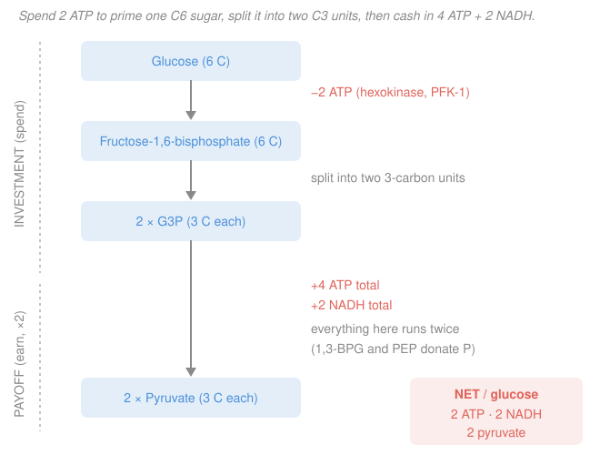

# Biochemistry · Lesson 3.2: Glycolysis

> ⏱ ~15 min · Module 3: Central Metabolism · Builds on: [3.1 Carbohydrates: structure & storage](03-01-carbohydrates-structure-storage.md), [2.5 Bioenergetics: ΔG, ATP & redox](02-05-bioenergetics-atp-redox.md) · Unlocks: [3.3 The citric-acid cycle](03-03-citric-acid-cycle.md)

## Why this matters

Glycolysis is the oldest and most universal energy trick life has — every cell you own, and nearly every organism on Earth, runs it, with or without oxygen. It takes one six-carbon glucose and, in ten steps, breaks it into two three-carbon pyruvates while banking a small, immediate profit of ATP and reducing power. It is also a masterclass in a principle you already met in [2.5](02-05-bioenergetics-atp-redox.md): **you sometimes have to spend energy to make energy**. The whole pathway is a two-phase investment: pay two ATP up front to make the sugar unstable and symmetric, then harvest four ATP and two NADH on the back end.

## The idea

Think of glucose as a log that won't catch fire on its own. Glycolysis first **primes** it — spends 2 ATP to bolt two phosphate groups on, which destabilizes the sugar and makes it splittable down the middle into two identical three-carbon halves. That's the *investment phase*: money out, no return yet, and it ends with two molecules of glyceraldehyde-3-phosphate (G3P).

Then comes the *payoff phase*, and here's the move that trips everyone up: **everything from now on happens twice**, once per G3P. Each three-carbon fragment gets oxidized (handing its electrons to $\ce{NAD+}$ to make NADH) and then milked for two ATP through direct phosphate hand-offs. Two G3P × (2 ATP + 1 NADH) = 4 ATP + 2 NADH out. Subtract the 2 ATP you spent priming, and the cell walks away with a **net 2 ATP, 2 NADH, and 2 pyruvate per glucose**. Modest — oxidative phosphorylation ([3.4](03-04-oxidative-phosphorylation.md)) will later dwarf it — but fast, and it needs no oxygen.

## The formal version

The ten enzyme-catalyzed steps split cleanly into two phases. You do **not** need every intermediate; you need the logic and the ledger.

**Investment phase (steps 1–5): glucose → 2 G3P, costs 2 ATP.**

- **Step 1 — hexokinase:** glucose + ATP → glucose-6-phosphate. Spend 1 ATP. *Irreversible, regulated.*
- **Step 3 — phosphofructokinase-1 (PFK-1):** fructose-6-phosphate + ATP → fructose-1,6-bisphosphate. Spend 1 ATP. *Irreversible, the committed step and master control valve.*
- **Steps 4–5 — aldolase + isomerase:** the six-carbon fructose-1,6-bisphosphate is cut in half and both halves are funneled into **G3P**, giving **2 G3P** per glucose.

*In words: burn 2 ATP to phosphorylate the sugar at both ends, then snap it into two identical three-carbon pieces.*

**Payoff phase (steps 6–10): each G3P → pyruvate, per fragment yields 2 ATP + 1 NADH.**

- **Step 6 — G3P dehydrogenase:** oxidizes G3P and reduces $\ce{NAD+}$, producing **1 NADH** and the high-energy compound 1,3-bisphosphoglycerate (1,3-BPG).
- **Step 7 — phosphoglycerate kinase:** 1,3-BPG donates a phosphate straight to ADP → **1 ATP** (substrate-level phosphorylation).
- **Step 10 — pyruvate kinase:** phosphoenolpyruvate (PEP) donates a phosphate straight to ADP → **1 ATP** (substrate-level phosphorylation), giving pyruvate. *Irreversible, regulated.*

Because there are **2 G3P**, double everything: $2 \times (2\ \text{ATP} + 1\ \text{NADH}) = 4\ \text{ATP} + 2\ \text{NADH}$.

**The net ledger.**

$$\ce{Glucose + 2 NAD+ + 2 ADP + 2 P_i -> 2\ Pyruvate + 2 NADH + 2 H+ + 2 ATP + 2 H2O}$$

$$\underbrace{4\ \text{ATP made}}_{\text{payoff}} - \underbrace{2\ \text{ATP spent}}_{\text{investment}} = \boxed{\textbf{net } 2\ \text{ATP},\ 2\ \text{NADH},\ 2\ \text{pyruvate}}$$

*In words: per glucose the cell nets 2 ATP and 2 NADH, and is left holding two pyruvates it still has to deal with.*

**Substrate-level phosphorylation.** The two ATP-making steps (7 and 10) transfer a phosphoryl group *directly* from a high-phosphoryl-transfer-potential substrate (1,3-BPG, PEP — both above ATP on [2.5](02-05-bioenergetics-atp-redox.md)'s ladder) onto ADP. *In words: no membrane, no oxygen, no electron chain — just a hand-off from a molecule that holds phosphate more loosely than ATP does.*

**The three control points.** Only three steps are irreversible ($\Delta G \ll 0$ in the cell), so only they are worth regulating: **hexokinase, PFK-1, and pyruvate kinase**. PFK-1 is the **master valve** — the committed step, since fructose-1,6-bisphosphate has nowhere to go but forward through glycolysis:

- **Inhibited by ATP and citrate** — "the cell is already energy-rich, stop burning fuel."
- **Activated by AMP and fructose-2,6-bisphosphate** — "energy is low (AMP) or hormones say *go* (F-2,6-BP), open the valve."

That fructose-2,6-bisphosphate switch is the hinge of [3.5 reciprocal regulation](03-05-gluconeogenesis-reciprocal-regulation.md), where it simultaneously turns glycolysis on and glucose-*making* off.

## Picture

## Worked examples

**Example 1 (mechanical — the tally, done honestly).** Account for the net ATP and NADH per glucose, being explicit about where the factor of 2 enters.

Investment phase, per glucose:
$$\text{ATP spent} = \underbrace{1}_{\text{hexokinase}} + \underbrace{1}_{\text{PFK-1}} = 2.$$
This happens on the single six-carbon molecule — **no doubling here.**

The molecule then splits into **2 G3P**, so the payoff phase runs **twice**. Per G3P:
$$\text{ATP made} = \underbrace{1}_{\text{step 7}} + \underbrace{1}_{\text{step 10}} = 2, \qquad \text{NADH made} = \underbrace{1}_{\text{step 6}} = 1.$$
Double it:
$$\text{ATP made} = 2 \times 2 = 4, \qquad \text{NADH made} = 2 \times 1 = 2.$$

Net:
$$\text{ATP} = 4 - 2 = 2, \qquad \text{NADH} = 2, \qquad \text{pyruvate} = 2.$$

The classic error is to double the *investment* too (getting a net of 0) or to forget to double the *payoff* (getting a net of 1). The asymmetry is the point: **you pay once on the whole sugar, you collect twice on its two halves.**

**Example 2 (why you'd care — the NAD⁺ crisis).** A muscle cell sprinting anaerobically converts its pyruvate to lactate. Why *must* it, and what breaks if it doesn't?

Look at step 6: G3P dehydrogenase **requires $\ce{NAD+}$** as the electron acceptor — it can't run without an empty carrier to dump electrons onto. But a cell holds only a tiny pool of $\ce{NAD+}$, and every trip through glycolysis converts two of them to NADH. Within a few turns, **all the $\ce{NAD+}$ is used up** and sitting as NADH.

Aerobically that's fine: the electron-transport chain ([3.4](03-04-oxidative-phosphorylation.md)) reoxidizes NADH back to $\ce{NAD+}$ using oxygen as the final electron sink. But with no oxygen, that recycling stops. So the cell improvises a dead-end regeneration:
$$\ce{Pyruvate + NADH + H+ ->[LDH] Lactate + NAD+}$$

*In words: dump the electrons from NADH onto pyruvate itself, purely to hand $\ce{NAD+}$ back to step 6.* Lactate is a waste product; the cell gains no extra ATP from this step. Its **only** purpose is to keep $\ce{NAD+}$ flowing so glycolysis — and its 2 ATP — can continue.

If the cell *didn't* reduce pyruvate: $\ce{NAD+}$ runs out, **step 6 stalls**, and with step 6 dead the entire pathway freezes — no 1,3-BPG, no substrate-level phosphorylation, **zero ATP**. Fermentation isn't about making lactate (or, in yeast, ethanol + $\ce{CO2}$); it's about **not running out of $\ce{NAD+}$.**

## Watch out

- **You might think glycolysis "makes 4 ATP."** It makes 4 *gross* but nets only **2** — the two you spent priming are real and must be subtracted. Always quote the net.
- **You might double the wrong phase.** The ×2 applies only *after* the six-carbon sugar splits (payoff), never to the investment ATP paid on the intact sugar. Pay once, collect twice.
- **You might think the point of fermentation is lactate or ethanol.** The product is metabolic garbage; the *point* is regenerating $\ce{NAD+}$ so the oxidation step (6) keeps turning. No $\ce{NAD+}$, no glycolytic ATP — even though the ATP-making enzymes themselves are untouched.

## One-liner

> Glycolysis spends 2 ATP to prime and split one glucose, then harvests 4 ATP + 2 NADH from its two halves — net 2 ATP, 2 NADH, 2 pyruvate — and it all hinges on keeping $\ce{NAD+}$ in stock.

## Problems

**P1 (🟢)** When glucose comes from **glycogen** (see [3.1](03-01-carbohydrates-structure-storage.md)), it is released by phosphorolysis already as glucose-6-phosphate — so the hexokinase step (and its 1 ATP) is skipped. What is the **net** ATP and NADH yield per glucose unit mobilized from glycogen through glycolysis?

**P2 (🟡)** A resting, well-fed liver cell has high ATP and high citrate; then the cell suddenly starts working hard and its AMP rises sharply. (a) Which single glycolytic enzyme registers all three of these signals, and which way does flux go in each case? (b) Why is that enzyme — not hexokinase — called the pathway's committed/master step?

**P3 (🔴, optional)** A drug that inhibits lactate dehydrogenase (LDH) is given to a tumor that relies on anaerobic glycolysis for ATP. Substrate-level phosphorylation enzymes (steps 7 and 10) are left completely intact. Explain why glycolytic ATP production nonetheless grinds to a halt, name the *exact* step that stalls first, and identify the molecule whose depletion is the true bottleneck. (This is the redox logic that [3.4](03-04-oxidative-phosphorylation.md) resolves with oxygen.)

Solutions

**P1** The payoff phase is unchanged (the sugar still splits into 2 G3P), so it still yields **4 ATP + 2 NADH gross**. But the investment phase now spends only the PFK-1 ATP — the hexokinase ATP is skipped, so investment = **1 ATP**. Net:
$$\text{ATP} = 4 - 1 = 3, \qquad \text{NADH} = 2.$$
So **net 3 ATP and 2 NADH** per glycogen-derived glucose — one ATP better than free glucose, because storage already paid part of the priming cost. (This is a small reason glycogen is such efficient quick fuel.)

**P2** (a) The enzyme is **PFK-1**.
- *High ATP* → inhibits PFK-1 → flux **down** (energy is plentiful, don't burn glucose).
- *High citrate* → inhibits PFK-1 → flux **down** (citrate signals the citric-acid cycle is backed up with fuel; [3.3](03-03-citric-acid-cycle.md)).
- *Rising AMP* → activates PFK-1 → flux **up** (AMP is the cell's "energy is low" alarm; it accumulates when ATP is consumed).

(b) The reaction PFK-1 catalyzes, fructose-6-P → fructose-1,6-bisphosphate, is the **first step unique and committed to glycolysis**: fructose-1,6-bisphosphate has no fate but to continue down the pathway. Glucose-6-phosphate (hexokinase's product) still has other exits — glycogen synthesis, the pentose phosphate pathway — so regulating hexokinase wouldn't specifically control glycolytic flux. You put the master valve at the first *irreversible, committed, no-turning-back* step. (Forward to [3.5](03-05-gluconeogenesis-reciprocal-regulation.md): fructose-2,6-bisphosphate is the allosteric activator that overrides ATP inhibition here.)

**P3** Glycolysis's oxidation step — **step 6 (G3P dehydrogenase)** — consumes $\ce{NAD+}$ every turn, reducing it to NADH. Anaerobically, the *only* way to regenerate $\ce{NAD+}$ is LDH reducing pyruvate to lactate. Block LDH and NADH piles up while $\ce{NAD+}$ is drained; once the small $\ce{NAD+}$ pool is exhausted, **step 6 stalls first** (it has no electron acceptor). With step 6 dead, no 1,3-BPG or PEP is made, so the intact step-7 and step-10 kinases have **no substrate** to phosphorylate ADP with — ATP output stops even though those enzymes work perfectly. The true bottleneck is depletion of **$\ce{NAD+}$**, not any ATP-making enzyme. (Aerobic cells escape this because the electron-transport chain of [3.4](03-04-oxidative-phosphorylation.md) regenerates $\ce{NAD+}$ using $\ce{O2}$ — which is exactly why blocking LDH kills glycolysis-addicted tumor cells but spares tissues that can respire.)

## Flashback

**From Lesson 3.1 (Carbohydrates: structure & storage):** Lactose is galactose joined to glucose by a **β-1,4 glycosidic bond**. (a) Which carbon of the galactose is locked into the bond, and what does that "β" describe about it? (b) Lactose is a *reducing sugar* — which of its two monosaccharides must therefore keep a **free anomeric carbon**, and why does that make lactose reducing?

Solution

(a) The **anomeric carbon of galactose (C1)** is locked into the glycosidic bond. The "β" describes the *configuration at that anomeric carbon* when the bond formed: in the β-anomer the C1 substituent (here the oxygen bridging to glucose) points on the **same side as the C6/reference group** — up, in the standard Haworth drawing — as opposed to the α-anomer, where it points down. Once that carbon is committed to the glycosidic bond, its configuration is fixed as β.

(b) The **glucose** retains a **free anomeric carbon** (its C1 is *not* in the glycosidic bond — only galactose's C1 is). A free anomeric carbon can open to the linear aldehyde form, and that aldehyde can be oxidized (donate electrons) — which is exactly what "reducing sugar" means: it can reduce a mild oxidant. Because glucose's anomeric center is free, lactose is reducing; if *both* anomeric carbons were tied up in the linkage (as in sucrose), it would not be.

## Connections

- **Backward:** the two substrate-level phosphorylation steps are pure [2.5](02-05-bioenergetics-atp-redox.md) phosphoryl-transfer-potential logic — 1,3-BPG and PEP sit *above* ATP on the transfer ladder, so they can hand phosphate downhill to ADP. And the sugar you're breaking is the glucose/glycogen of [3.1](03-01-carbohydrates-structure-storage.md).
- **Forward:** the two pyruvates and two NADH are handed straight to [3.3 the citric-acid cycle](03-03-citric-acid-cycle.md) (via acetyl-CoA) and [3.4 oxidative phosphorylation](03-04-oxidative-phosphorylation.md), where oxygen regenerates the $\ce{NAD+}$ and multiplies the ATP yield roughly fifteen-fold. The PFK-1 valve is re-examined in [3.5](03-05-gluconeogenesis-reciprocal-regulation.md).
- **Sideways (medicine & thermodynamics):** the $\ce{NAD+}$-regeneration argument is the whole basis of fermentation (brewing, bread, yogurt) and of the *Warburg effect* in cancer — cells burning glucose to lactate even in oxygen. It's also a clean case of [2.5](02-05-bioenergetics-atp-redox.md)'s coupling: an unfavorable oxidation is driven by pairing it to $\ce{NAD+}$ reduction, and an unfavorable priming is driven by ATP hydrolysis.
