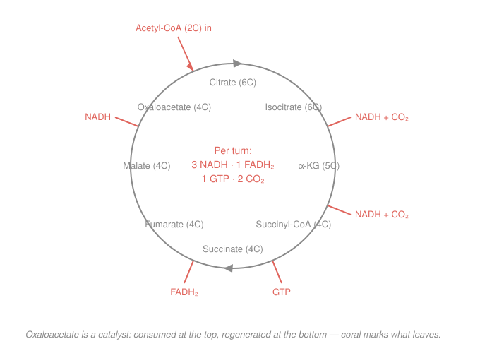

# Biochemistry · Lesson 3.3: The citric-acid cycle

> ⏱ ~15 min · Module 3: Central Metabolism · Builds on: [3.2 Glycolysis](03-02-glycolysis.md), [2.5 Bioenergetics: ΔG, ATP & redox carriers](02-05-bioenergetics-atp-redox.md) · Unlocks: [3.4 Oxidative phosphorylation](03-04-oxidative-phosphorylation.md)

## Why this matters

Glycolysis ([3.2](03-02-glycolysis.md)) barely touched glucose's energy — it split a 6-carbon sugar into two pyruvates and skimmed off just 2 ATP. The real payoff is still locked in those carbons, and the citric-acid cycle is where the cell finally burns them to $\ce{CO2}$. But notice what it collects: almost no ATP directly. Instead the cycle's job is to **strip electrons** off carbon and load them onto carriers (NADH, FADH₂) — an IOU that [3.4](03-04-oxidative-phosphorylation.md) will cash for the bulk of the cell's ATP. The cycle is also the busiest intersection in metabolism: the same intermediates feed fat and amino-acid synthesis. Learn it as a *hub*, not a list of eight enzymes.

## The idea

Think of the cycle as a conveyor with a reusable clamp. A 4-carbon molecule, **oxaloacetate (OAA)**, grabs an incoming 2-carbon **acetyl** group to make 6-carbon citrate. As the conveyor turns, it snips off two carbons as $\ce{CO2}$, and at four points it yanks off a pair of high-energy electrons — three times onto $\ce{NAD+}$ (making NADH) and once onto FAD (making FADH₂) — plus it makes one GTP for direct spending money. By the time the conveyor returns to the start, it's back to plain oxaloacetate, ready to clamp the next acetyl group. The clamp is never used up; it's a **catalyst that gets regenerated every lap**.

Where does the acetyl group come from? Pyruvate — glycolysis's product — must first be converted by a bridge reaction. That's the **pyruvate dehydrogenase** step: it lops one carbon off pyruvate as $\ce{CO2}$, grabs one NADH, and hands the remaining 2-carbon acetyl to a carrier molecule (coenzyme A) as **acetyl-CoA**. This bridge is the gateway from sugar-breakdown into the cycle, and it's irreversible — once carbon commits to being burned, there's no going back to glucose from here.

## The formal version

**The bridge — pyruvate dehydrogenase (PDH).** Per pyruvate:

$$\ce{Pyruvate + NAD+ + CoA-SH -> Acetyl-CoA + CO2 + NADH}$$

*In words: the 3-carbon pyruvate loses one carbon as $\ce{CO2}$, reduces one $\ce{NAD+}$ to NADH, and its 2 remaining carbons ride out on coenzyme A.* Glucose gives **two** pyruvates, so this runs twice: **2 NADH + 2 $\ce{CO2}$** per glucose, before the cycle even starts.

**The cycle — one turn per acetyl-CoA.** Acetyl-CoA (2C) condenses with oxaloacetate (4C) to give citrate (6C); eight steps later oxaloacetate is regenerated. You do **not** need the enzyme names — you need the four energy-yielding steps and where carbon leaves. Going around once:

| Transition | What comes off |
|---|---|
| isocitrate → α-ketoglutarate | 1 NADH + 1 $\ce{CO2}$ |
| α-ketoglutarate → succinyl-CoA | 1 NADH + 1 $\ce{CO2}$ |
| succinyl-CoA → succinate | 1 GTP (substrate-level) |
| succinate → fumarate | 1 FADH₂ |
| malate → oxaloacetate | 1 NADH |

Summed, **one turn yields**

$$\boxed{\;3\ \text{NADH} \;+\; 1\ \text{FADH}_2 \;+\; 1\ \text{GTP} \;+\; 2\ \ce{CO2}\;}$$

*In words: each acetyl group is fully oxidized to two $\ce{CO2}$, and its electrons are banked as 3 NADH + 1 FADH₂, with 1 GTP of pocket change.* The lone GTP is made by **substrate-level phosphorylation** — the same direct-transfer trick as glycolysis ([3.2](03-02-glycolysis.md)), and GTP is energetically equivalent to ATP ($\Delta G^{\circ\prime}$ of hydrolysis ≈ −30.5 kJ/mol, from [2.5](02-05-bioenergetics-atp-redox.md)).

**Regulation — the cycle reads the NADH/ATP gauge.** The cycle runs fast only when the cell is electron-hungry. High **NADH** (product) and high **ATP** shut down the committed steps (PDH, isocitrate dehydrogenase, α-ketoglutarate dehydrogenase); high **ADP** and $\ce{NAD+}$ speed them up. *In words: don't strip more electrons if the carriers are already full and the battery is charged.* This is feedback inhibition, exactly the logic of [2.4](02-04-allosteric-regulation-metabolic-control.md).

## Picture

Trace it clockwise: 2 carbons enter at the top (acetyl-CoA), 2 leave as $\ce{CO2}$ on the right side, and the four coral electron/GTP tick-marks are the entire point of the lap.

## Worked examples

**Example 1 (the tally — one acetyl-CoA, then one glucose).** *How much does aerobic glucose breakdown bank up to the end of the cycle?*

Start with **one acetyl-CoA** = one turn:

$$3\ \text{NADH},\quad 1\ \text{FADH}_2,\quad 1\ \text{GTP},\quad 2\ \ce{CO2}.$$

Now scale to **one glucose**. Three contributions stack up:

1. *Glycolysis* ([3.2](03-02-glycolysis.md)): 1 glucose → 2 pyruvate, netting **2 ATP + 2 NADH**.
2. *PDH bridge* (×2, one per pyruvate): **2 NADH + 2 $\ce{CO2}$**.
3. *Cycle* (×2, one turn per acetyl-CoA): $2\times(3\,\text{NADH}, 1\,\text{FADH}_2, 1\,\text{GTP}, 2\,\ce{CO2}) =$ **6 NADH + 2 FADH₂ + 2 GTP + 4 $\ce{CO2}$**.

Add the reduced carriers across all three:

$$\text{NADH}: 2 + 2 + 6 = 10, \qquad \text{FADH}_2: 0 + 0 + 2 = 2.$$

So per glucose, through the end of the cycle: **10 NADH, 2 FADH₂**, plus **2 ATP + 2 GTP** of direct phosphorylation, and **6 $\ce{CO2}$** (2 from PDH + 4 from the two turns). All six of glucose's carbons are now gone as $\ce{CO2}$ — the cycle has finished the burn. The 10 NADH + 2 FADH₂ are the fuel [3.4](03-04-oxidative-phosphorylation.md) converts into ~26 more ATP.

*Check.* Carbon balance: glucose has 6 C; $\ce{CO2}$ released = 6 ✓ (none left over). Direct energy so far (2 ATP + 2 GTP = 4) is tiny next to the ~30 ATP the carriers will yield — confirming the cycle's real product is *electrons*, not ATP.

**Example 2 (carbon counting — which two carbons actually leave?).** *Two acetyl carbons enter each turn and two $\ce{CO2}$ leave. Are they the same two carbons?* This is the classic subtlety — and the answer is **no**, not in the turn they enter.

Bookkeeping first (this always balances): entering the turn we have acetyl (2C) + oxaloacetate (4C) = 6 carbons in citrate. Two leave as $\ce{CO2}$, so 4 carbons remain — exactly enough to rebuild the 4-carbon oxaloacetate. **Net: 2 C in, 2 C out, clamp regenerated.** The cycle never accumulates or loses carbon.

But *which* atoms? Isotope-labeling experiments (feed acetyl-CoA with a tagged carbon and watch where the tag comes out) show the two $\ce{CO2}$ molecules released in a given turn come from the **oxaloacetate** carbons, *not* from the two acetyl carbons that just entered. The freshly-arrived acetyl carbons stay on the conveyor — they become part of the regenerated oxaloacetate and only leave as $\ce{CO2}$ on *later* turns.

*Why it works out anyway:* over many turns the counting is what matters — for every acetyl group consumed, two carbons exit as $\ce{CO2}$ somewhere down the line. The mass balance "2 in, 2 out per turn" is exact even though the specific atoms are one lap out of phase. *In words: the cycle burns two carbons per acetyl group, but with a one-turn delay in which atoms actually go up in smoke.*

## Watch out

- **You might think the cycle makes lots of ATP.** It makes exactly **1 GTP per turn** — trivial. Its true output is reduced carriers (NADH, FADH₂); the ATP appears later, in oxidative phosphorylation ([3.4](03-04-oxidative-phosphorylation.md)). Don't credit the cycle with energy it only *stages*.
- **You might think the two $\ce{CO2}$ per turn are the acetyl carbons.** They aren't (Example 2) — they come from the oxaloacetate portion; the acetyl carbons leave on later laps. The *count* balances; the *atoms* lag by a turn.
- **You might think the cycle is purely for burning fuel.** It's **amphibolic** — a two-way hub. When the cell needs to *build*, it siphons intermediates out: citrate → cytosol → fatty acids ([4.1](04-01-lipids-fatty-acids-triacylglycerols-sterols.md)); α-ketoglutarate and oxaloacetate → amino acids. Because draining intermediates would stall the cycle, **anaplerotic** ("filling-up") reactions replenish them — e.g. pyruvate carboxylase converts $\ce{Pyruvate + CO2 -> Oxaloacetate}$ to top up the clamp.

## One-liner

> The citric-acid cycle burns each acetyl group to 2 $\ce{CO2}$ while banking 3 NADH + 1 FADH₂ + 1 GTP — a self-regenerating hub whose real product is electrons, not ATP.

## Problems

**P1 (🟢)** In a single turn of the citric-acid cycle, how many NADH, FADH₂, GTP, and $\ce{CO2}$ are produced? Now scale to the acetyl-CoA from **one glucose** (remember glucose gives two acetyl-CoA) and state the per-glucose totals *from the cycle alone* (exclude glycolysis and the PDH bridge).

**P2 (🟡)** A cell is at rest with plenty of ATP and a high NADH/$\ce{NAD+}$ ratio. Predict qualitatively what happens to the *rate* of the citric-acid cycle, and name the kind of control responsible. Then explain, in one sentence, why this coupling of the cycle's rate to the NADH level is exactly what you'd want a fuel-burning pathway to do.

**P3 (🔴, optional — connects to biosynthesis, [4.1](04-01-lipids-fatty-acids-triacylglycerols-sterols.md))** To synthesize fatty acids, a growing cell exports **citrate** out of the cycle to supply cytosolic acetyl-CoA. If citrate is continually removed, what happens to the oxaloacetate needed to accept incoming acetyl-CoA, and how must the cell compensate to keep the cycle turning? Name the general term for such a replenishing reaction and give one concrete example.

Solutions

**P1** One turn produces **3 NADH, 1 FADH₂, 1 GTP, and 2 $\ce{CO2}$** (this is the boxed per-turn yield; the four energy steps are isocitrate→α-KG giving NADH+$\ce{CO2}$, α-KG→succinyl-CoA giving NADH+$\ce{CO2}$, succinyl-CoA→succinate giving GTP, succinate→fumarate giving FADH₂, and malate→oxaloacetate giving the third NADH).

One glucose → two pyruvate → **two** acetyl-CoA → **two** turns. Multiply everything by 2:

$$6\ \text{NADH},\quad 2\ \text{FADH}_2,\quad 2\ \text{GTP},\quad 4\ \ce{CO2}.$$

*Check.* This matches the module goal's per-glucose cycle yield. (The other 4 $\ce{CO2}$ needed to finish off glucose's 6 carbons come from the two PDH steps — but those are the *bridge*, not the cycle, so they're correctly excluded here. 4 from the cycle + 2 from PDH = 6 total ✓.)

**P2** With ATP abundant and NADH/$\ce{NAD+}$ high, the cycle **slows down** (rate drops toward zero). Two reinforcing reasons: (i) NADH is a **product-inhibitor** of the NADH-producing dehydrogenases (isocitrate dehydrogenase, α-ketoglutarate dehydrogenase, and the upstream PDH), and (ii) there's little free $\ce{NAD+}$ substrate left to accept more electrons. This is **allosteric feedback inhibition** (product/energy-charge control), the mechanism of [2.4](02-04-allosteric-regulation-metabolic-control.md).

One-sentence rationale: a pathway whose job is to charge the electron carriers *should* stop the moment those carriers are full and the ATP battery is charged — otherwise it would burn fuel it can't use, wasting carbon and leaving no $\ce{NAD+}$ to run on.

**P3** Removing citrate drains carbon out of the cycle. Every downstream intermediate — including **oxaloacetate** — is made from citrate as the conveyor turns, so continually exporting citrate depletes the oxaloacetate pool. With too little oxaloacetate, there's no clamp to accept incoming acetyl-CoA, and the cycle **stalls**.

The cell compensates by **replenishing** the lost intermediate through an **anaplerotic reaction** ("filling up"). The canonical example is **pyruvate carboxylase**:

$$\ce{Pyruvate + CO2 + ATP -> Oxaloacetate + ADP + Pi},$$

which regenerates oxaloacetate directly from pyruvate, restocking the clamp so the cycle keeps turning while citrate is siphoned off for fat synthesis. *In words: if you keep skimming intermediates for biosynthesis, you must refill them — that's anaplerosis.*

## Flashback

**From Lesson 3.2 (Glycolysis):** Glycolysis converts one glucose to two pyruvate. Its "investment" phase spends 2 ATP and its "payoff" phase makes 4 ATP and 2 NADH by substrate-level phosphorylation. (a) State the **net** ATP and NADH per glucose. (b) One molecule of the sugar galactose is funneled into glycolysis as glucose-6-phosphate, but doing so costs **1 extra ATP** up front. What is the *net* ATP yield of glycolysis for one galactose?

Solution

(a) Net ATP = payoff − investment = $4 - 2 = 2$ ATP per glucose; NADH is made only in the payoff phase, so **net 2 ATP and 2 NADH** per glucose. (Pyruvate: 2, unchanged.)

(b) The extra 1 ATP raises the investment phase from 2 to 3 ATP, while the payoff is unchanged at 4 ATP:

$$\text{net ATP} = 4 - 3 = 1\ \text{ATP per galactose}.$$

NADH is still 2 (the payoff phase is untouched). *Check.* Galactose enters the same payoff machinery, so only the front-end cost changes — one extra priming ATP halves the net ATP (2 → 1), a small tax for using an alternative sugar. ✓

## Connections

- **Backward:** the cycle consumes the pyruvate/acetyl-CoA that [3.2 Glycolysis](03-02-glycolysis.md) produced, and its GTP is the same substrate-level phosphorylation trick. Every NADH/FADH₂ it banks is a redox carrier defined in [2.5 Bioenergetics](02-05-bioenergetics-atp-redox.md); its NADH-based shutdown is the feedback control of [2.4](02-04-allosteric-regulation-metabolic-control.md).
- **Forward:** [3.4 Oxidative phosphorylation](03-04-oxidative-phosphorylation.md) feeds the 10 NADH + 2 FADH₂ per glucose into the electron-transport chain, where each carrier's electrons pump protons and ultimately spin ATP synthase — turning this lesson's IOUs into the bulk of the cell's ATP. [4.2 Fatty-acid oxidation](04-02-fatty-acid-oxidation.md) also dumps its acetyl-CoA straight into this cycle.
- **Sideways (biosynthesis / physical chemistry):** the cycle is a metabolic crossroads — citrate → fatty acids, α-ketoglutarate/oxaloacetate → amino acids — so it's read both forward (catabolism) and in reverse (anabolism). Whether any given step actually runs is a matter of $\Delta G$ signs and mass action, the thermodynamic bookkeeping of [2.5](02-05-bioenergetics-atp-redox.md) and, more deeply, [`thermodynamics-physics`](../../thermodynamics-physics/syllabus.md).
