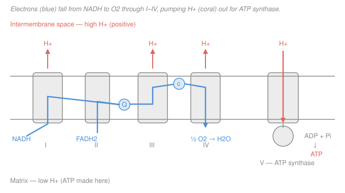

# Biochemistry · Lesson 3.4: Oxidative phosphorylation

> ⏱ ~15 min · Module 3: Central Metabolism · Builds on: [3.3 The citric-acid cycle](03-03-citric-acid-cycle.md), [2.5 Bioenergetics: ΔG, ATP & redox carriers](02-05-bioenergetics-atp-redox.md) · Unlocks: [3.5 Gluconeogenesis & reciprocal regulation](03-05-gluconeogenesis-reciprocal-regulation.md), [3.6 A taste of photosynthesis](03-06-photosynthesis-taste.md)

## Why this matters

Glycolysis and the citric-acid cycle barely make any ATP directly — a handful of molecules by substrate-level phosphorylation. Their real product is a fleet of **reduced electron carriers** (NADH, FADH₂). This lesson is where that fleet gets cashed in: it produces the *other* ~90% of your ATP, and it's why you'd suffocate in minutes without oxygen. The mechanism — proton gradients driving a molecular turbine — was so unintuitive that its discoverer was disbelieved for a decade. It's the single best idea in bioenergetics.

## The idea

The cell has a pile of high-energy electrons (on NADH and FADH₂) and it wants ATP. It does **not** hand the electrons straight to oxygen — that would release all the energy at once, as useless heat (a tiny explosion). Instead it lets the electrons fall to oxygen in **stages**, like water dropping down a series of small waterfalls instead of one cliff, and at three of those stages it uses the released energy to do one specific job: **pump protons (H⁺) across the inner mitochondrial membrane**, from the matrix (inside) out to the intermembrane space.

Now protons are piled up on one side of a barrier — like water backed up behind a dam. That stored gradient is potential energy. A single enzyme, **ATP synthase**, is the sluice gate: it lets protons flow back down, and their flow physically *spins* part of the enzyme like a turbine, and that rotation mechanically forges ATP from ADP + Pi.

So the trick — **chemiosmosis** — is that oxidation (electrons falling) and phosphorylation (ATP being made) are not directly linked chemically. They're linked only through the proton gradient. Burning fuel charges a battery; ATP synthase drains it.

## The formal version

**The electron-transport chain (ETC).** Four membrane complexes hand electrons down a ladder of increasing affinity for electrons (increasing reduction potential $E^{\circ\prime}$, see [2.5](02-05-bioenergetics-atp-redox.md)):

- **Complex I** takes electrons from NADH; **Complex II** (succinate dehydrogenase — the same enzyme from the citric-acid cycle) takes them from FADH₂. Both pass them to the mobile carrier **ubiquinone (Q)**.
- **Complex III** passes them from Q to the mobile protein **cytochrome c**.
- **Complex IV** delivers them to the terminal acceptor, oxygen:

$$\ce{1/2 O2 + 2H+ + 2e- -> H2O}$$

In words: two electrons plus two protons plus half an $\ce{O2}$ make one water — this is why you breathe, and where the oxygen goes.

**Complexes I, III, and IV are proton pumps.** Each electron pair that traverses the full chain from NADH pumps roughly **10 H⁺** out of the matrix. FADH₂ enters at Complex II, which does *not* pump — so its electrons skip the Complex I waterfall and only ~6 H⁺ get pumped.

**The proton-motive force $\Delta p$.** The gradient has two parts — a concentration difference and a charge difference (the outside becomes positive):

$$\Delta p = \Delta\psi - \frac{2.3RT}{F}\,\Delta\text{pH}$$

In words: the "pressure" pushing protons back in is the sum of an **electrical** term $\Delta\psi$ (membrane voltage) and a **chemical** term (the pH difference). In mitochondria the electrical term dominates. $R$ is the gas constant, $T$ temperature, $F$ the Faraday constant.

**ATP synthase (Complex V).** Protons flowing back down $\Delta p$ turn a rotor (the $c$-ring + $\gamma$ stalk); the rotation cycles the catalytic $\beta$ subunits through conformations that bind ADP + Pi and squeeze out ATP. About **4 H⁺** must return per ATP exported.

**The P/O ratio** = ATP made per pair of electrons reaching oxygen. With ~10 H⁺ pumped per NADH and ~4 H⁺ spent per ATP: $10/4 \approx$ **2.5 ATP per NADH**, and $6/4 \approx$ **1.5 ATP per FADH₂**. (Older texts say 3 and 2 — same idea, rounder guess.)

## Picture

The blue path is the electrons falling from NADH (and FADH₂, entering later at II) down to oxygen. Coral arrows are protons: pumped **out** at I, III, IV, and flowing back **in** only through ATP synthase — the one door in the dam.

## Worked examples

**Example 1 (the payoff — total ATP from one glucose).** Tally every carrier made upstream, then convert with 2.5 and 1.5.

| Source | Direct ATP/GTP | NADH | FADH₂ |
|---|---|---|---|
| Glycolysis (net) | 2 | 2 | 0 |
| Pyruvate dehydrogenase (×2) | 0 | 2 | 0 |
| Citric-acid cycle (×2 turns) | 2 | 6 | 2 |
| **Total** | **4** | **10** | **2** |

Now cash in the carriers at ATP synthase:

$$10\ \text{NADH} \times 2.5 = 25, \qquad 2\ \text{FADH}_2 \times 1.5 = 3.$$

Add the substrate-level ATP (already net of the 2 ATP invested in glycolysis's prep phase):

$$25 + 3 + 4 = \boxed{32\ \text{ATP per glucose}}.$$

So oxidative phosphorylation supplies $28$ of the $32$ — about **88%**. (You'll see "~30" quoted too: the 2 glycolytic NADH are made in the *cytosol* and must be ferried in by a shuttle; the glycerol-phosphate shuttle drops them to Complex II value, $2\times1.5$ instead of $2\times2.5$, costing 2 ATP → 30. The malate–aspartate shuttle keeps them as NADH → 32. Hence "~30–32.")

**Example 2 (an uncoupler — DNP and brown fat).** An *uncoupler* is a molecule (2,4-dinitrophenol; or the protein thermogenin/UCP1 in brown fat) that carries protons back across the membrane **around** ATP synthase — punching extra holes in the dam. Trace all four effects:

- **(a) Electron flow:** *speeds up.* The back-pressure of $\Delta p$ normally throttles the chain (no gradient can build past a point, so pumping stalls). Drain the gradient and the pumps run flat-out.
- **(b) O₂ consumption:** *rises sharply* — electrons race to oxygen faster than ever, so $\ce{O2}$ is reduced to water furiously.
- **(c) ATP yield:** *collapses.* Protons bypass ATP synthase, so it has no flow to turn. Oxidation is now *uncoupled* from phosphorylation — fuel burns, no ATP is captured.
- **(d) Heat:** the redox energy that would have been stored in $\Delta p$ and harvested as ATP is instead released directly as **heat**.

Why it's lethal: the cell burns fuel at maximum rate but makes almost no ATP, so it's in an energy crisis *and* overheating. DNP was a 1930s diet drug — it does cause dramatic weight loss (you burn fuel for nothing), and it killed people by uncontrolled hyperthermia. Brown fat does exactly this *on purpose*, in a controlled way, to keep infants and hibernators warm — proof the mechanism is real, not just a poison.

## Watch out

- You might think ATP synthase and the electron-transport chain are chemically coupled. They are **not** — they share only the proton gradient. That's the whole content of chemiosmosis (Mitchell's insight), and it's exactly why an uncoupler can run one without the other.
- You might think FADH₂ yields less ATP because it "has less energy." It has *somewhat* less, but the sharp reason is **geometric**: it enters at Complex II, downstream of the Complex I pump, so its electrons power fewer proton pumps ($6$ vs $10$ H⁺). Skipping a waterfall, not a weaker electron.
- You might think oxygen's role is to "provide energy." Oxygen provides *nothing* energetically — it's the **terminal electron sink**, the bottom of the ladder that makes the whole downhill fall possible. No sink, no flow: this is why cyanide (which blocks Complex IV) and asphyxiation kill the same way — the electrons back up and everything upstream jams.

## One-liner

> Burning fuel pumps protons out; ATP synthase lets them back in to spin ATP into existence — oxidation and phosphorylation talk only through the gradient, which is why an uncoupler turns your food into a fever.

## Problems

**P1 (🟢)** A muscle cell running anaerobically makes ATP only by substrate-level phosphorylation in glycolysis (2 net per glucose) and cannot use its NADH for oxidative phosphorylation. Compared with full aerobic metabolism (32 ATP), what fraction of the ATP yield is it getting, and in one phrase say what it's missing.

**P2 (🟡)** Complex IV (cytochrome c oxidase) is the enzyme cyanide blocks. Using the logic of Example 2, predict what cyanide poisoning does to (a) electron flow through Complex I, (b) O₂ consumption, and (c) the proton gradient — and contrast each with what an *uncoupler* does. (This is why cyanide and DNP are both deadly but for opposite reasons.)

**P3 (🔴, optional)** Suppose a mutant ATP synthase needs only **3 H⁺** per ATP instead of 4, with proton pumping unchanged (~10 H⁺/NADH, ~6 H⁺/FADH₂). Recompute the P/O ratios for NADH and FADH₂, then the new total ATP per glucose (10 NADH, 2 FADH₂, 4 substrate-level ATP). Is a "more efficient" synthase always good for the cell? Give one reason it might not be.

Solutions

**P1** Anaerobic yield is 2 ATP; aerobic is 32. Fraction $= 2/32 = 1/16 \approx 6\%$. It's missing oxidative phosphorylation entirely — with no oxygen as terminal acceptor, NADH can't be re-oxidized by the chain, so the 10 NADH + 2 FADH₂ (worth ~28 ATP) go uncashed. (In practice the cell also can't even keep making that 2 ATP unless it regenerates NAD⁺ by fermentation to lactate — the subject of the glycolysis lesson.)

**P2** Cyanide blocks Complex IV, so electrons can't reach oxygen; the whole chain backs up like a clogged drain.
- (a) Electron flow through Complex I **stops** — with nowhere for electrons to go at the bottom, everything upstream jams (Q and cytochrome c stay reduced, Complex I can't unload).
- (b) O₂ consumption **stops** — no electrons reach $\ce{O2}$, so no water is made. (Blood stays bright red with unused oxygen — a diagnostic sign.)
- (c) The proton gradient **collapses over time** — pumping halts while protons leak back, so $\Delta p$ runs down and ATP synthesis stops.

Contrast with an uncoupler: the uncoupler *speeds up* electron flow and O₂ consumption (it removes back-pressure) while also collapsing the gradient. Both kill by stopping ATP synthesis, but cyanide does it by **jamming electron flow** (O₂ use → 0), the uncoupler by **short-circuiting the gradient** (O₂ use → max). Opposite effects on respiration, same fatal endpoint.

**P3** New P/O ratios: NADH $= 10/3 \approx 3.33$; FADH₂ $= 6/3 = 2.0$.
New total:
$$10 \times 3.33 + 2 \times 2.0 + 4 = 33.3 + 4.0 + 4 = 41.3\ \text{ATP per glucose}.$$
More ATP per fuel — but not necessarily "good." A synthase that turns more freely also means the gradient does less work holding protons back, so the membrane potential $\Delta\psi$ sits lower; the cell loses a control knob. Real cells *deliberately* keep the P/O ratio modest and even burn some gradient as heat (brown fat) — regulation and thermogenesis matter more than squeezing out maximum ATP. Efficiency is not the only objective.

## Flashback

**From Lesson 2.5 (Bioenergetics: ΔG, ATP & redox carriers):** The free energy released when a carrier is oxidized by oxygen is $\Delta G^{\circ\prime} = -nF\,\Delta E^{\circ\prime}$, where $n$ is the number of electrons transferred and $F = 96.485\ \text{kJ}\cdot\text{V}^{-1}\cdot\text{mol}^{-1}$. Using $E^{\circ\prime}(\ce{NAD+}/\ce{NADH}) = -0.32$ V, $E^{\circ\prime}(\text{FAD}/\text{FADH}_2,\ \text{Complex II}) \approx 0.00$ V, and $E^{\circ\prime}(\tfrac{1}{2}\ce{O2}/\ce{H2O}) = +0.82$ V, compute $\Delta G^{\circ\prime}$ for the oxidation of NADH and of FADH₂ by oxygen ($n = 2$ each). Then say, in one sentence, how the *difference* explains the 2.5-vs-1.5 ATP gap.

Solution

Electrons flow from the more negative (better donor) to the more positive couple; $\Delta E^{\circ\prime} = E^{\circ\prime}_{\text{acceptor}} - E^{\circ\prime}_{\text{donor}}$.

**NADH:** $\Delta E^{\circ\prime} = 0.82 - (-0.32) = 1.14$ V.
$$\Delta G^{\circ\prime} = -nF\,\Delta E^{\circ\prime} = -(2)(96.485)(1.14) \approx -220\ \text{kJ/mol}.$$

**FADH₂:** $\Delta E^{\circ\prime} = 0.82 - 0.00 = 0.82$ V.
$$\Delta G^{\circ\prime} = -(2)(96.485)(0.82) \approx -158\ \text{kJ/mol}.$$

The difference is about $62$ kJ/mol — the extra fall NADH's electrons take by starting higher (at $-0.32$ V vs $0.00$ V). That extra drop is precisely what powers the Complex I proton pump that FADH₂'s electrons skip, worth roughly one more ATP: hence 2.5 for NADH vs 1.5 for FADH₂. (Both releases dwarf the ~30.5 kJ/mol needed to make one ATP — the chain stages the fall so the energy is captured in installments, not wasted.)

## Connections

- **Backward:** this is where [3.3](03-03-citric-acid-cycle.md)'s carrier tally (10 NADH + 2 FADH₂ per glucose) and [2.5](02-05-bioenergetics-atp-redox.md)'s reduction potentials cash out — the redox ladder $E^{\circ\prime}$ *is* the electron-transport chain read as energetics.
- **Forward:** [3.6](03-06-photosynthesis-taste.md) runs this same chemiosmotic machine in reverse — light *builds* a proton gradient to make ATP (and NADPH), with water as the electron *source* instead of the sink. [3.5](03-05-gluconeogenesis-reciprocal-regulation.md) needs the ATP accounting to see why running glycolysis backward is expensive. In Module 4, [fatty-acid oxidation](04-02-fatty-acid-oxidation.md) feeds this exact chain, which is why fat is such a dense fuel.
- **Sideways (physics):** the proton-motive force is a genuine electrochemical potential — $\Delta\psi$ is a membrane voltage of ~150–200 mV across ~4 nm, an electric field near the dielectric breakdown of oil. ATP synthase is a real rotary motor turning a chemical gradient into mechanical work into chemical bonds; it is the cleanest biological instance of the energy-conversion accounting you meet in [thermodynamics](../../thermodynamics-physics/syllabus.md).
