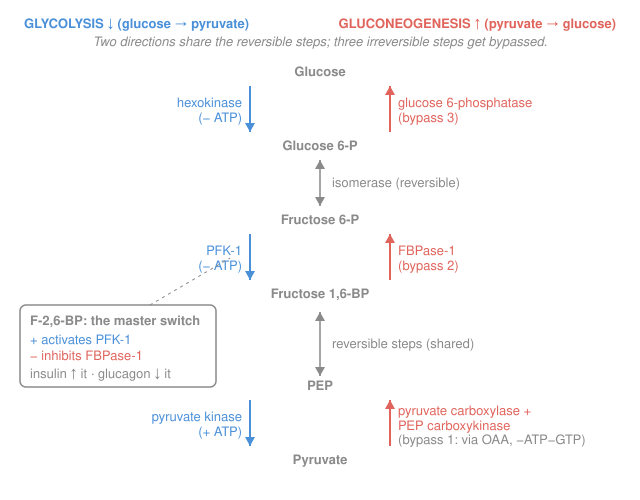

# Biochemistry · Lesson 3.5: Gluconeogenesis & reciprocal regulation

> ⏱ ~15 min · Module 3: Central Metabolism · Builds on: [3.2 Glycolysis](03-02-glycolysis.md), [2.4 Allosteric regulation & metabolic control](02-04-allosteric-regulation-metabolic-control.md) · Unlocks: [3.6 A taste of photosynthesis](03-06-photosynthesis-taste.md), Module 4

## Why this matters

Your brain burns about 120 grams of glucose a day and refuses every other fuel except in starvation. Skip breakfast and your blood sugar would crater within hours — except it doesn't, because your liver *manufactures* glucose from scratch and exports it. That's **gluconeogenesis**, glycolysis run uphill. But you can't just play the tape backward: three glycolytic steps are one-way cliffs, and if the cell ever ran both directions at once it would burn ATP in a circle and pay out nothing but heat. The whole trick — build glucose, spend glucose, and *never both at once* — turns on a single small molecule. This lesson is where metabolism stops being a list of reactions and becomes a *controlled* system.

## The idea

Glycolysis ([3.2](03-02-glycolysis.md)) tears glucose down to pyruvate and nets 2 ATP. Gluconeogenesis does the reverse: 2 pyruvate up to 1 glucose. The naive hope is that a pathway is a two-way street — push it backward and you regenerate what you spent. Two problems kill that hope.

**First, thermodynamics.** Most glycolytic steps sit near equilibrium and *are* freely reversible. But three of them dump a huge amount of free energy — they're the steep waterfalls that make glycolysis go forward at all. Running those backward would be like pushing water back up a waterfall: the cell must supply extra energy and, crucially, use *different enzymes* that take a *different route* around each cliff. So gluconeogenesis is glycolysis with **four bypass reactions** patched in at the three irreversible points.

**Second, control.** Even with bypasses, glycolysis and gluconeogenesis share the same middle enzymes and the same pool of intermediates. If both directions ran full-tilt simultaneously, glucose would be built and immediately destroyed — a **futile cycle** whose only product is wasted ATP released as heat. The cell forbids this with **reciprocal regulation**: the same signal that turns one direction *on* turns the other *off*. The master signal is a molecule called **fructose-2,6-bisphosphate**, and hormones set its level to decide, minute by minute, whether the liver is feeding on glucose or feeding you.

## The formal version

**The three irreversible steps and their bypasses.** In glycolysis these three reactions have large negative $\Delta G$ and are catalyzed by regulated enzymes. Gluconeogenesis cannot reverse them, so it routes around each:

| Glycolytic (one-way, forward) | Gluconeogenic bypass (reverse) |
|---|---|
| Pyruvate kinase: PEP → pyruvate | **Pyruvate carboxylase** (pyruvate → OAA, costs ATP) **then PEP carboxykinase / PEPCK** (OAA → PEP, costs GTP) |
| PFK-1: F-6-P → F-1,6-BP | **Fructose-1,6-bisphosphatase (FBPase-1)**: F-1,6-BP → F-6-P (hydrolysis) |
| Hexokinase: glucose → G-6-P | **Glucose-6-phosphatase**: G-6-P → glucose (hydrolysis) |

Symbols: PEP = phosphoenolpyruvate; OAA = oxaloacetate; G-6-P = glucose-6-phosphate; F-6-P = fructose-6-phosphate; F-1,6-BP = fructose-1,6-bisphosphate. *In words: three glycolytic cliffs, four enzymes to climb back up — the pyruvate → PEP cliff needs two.*

Note the two hydrolases (FBPase-1, glucose-6-phosphatase) just snip off a phosphate with water; they *don't* regenerate ATP. That asymmetry — spending ATP going down but not getting it back coming up — is exactly what makes each direction irreversible and therefore *separately controllable*.

**The cost.** Adding it all up for 2 pyruvate → 1 glucose:

$$2\ \text{pyruvate} + 4\,\text{ATP} + 2\,\text{GTP} + 2\,\text{NADH} \;\longrightarrow\; \text{glucose} + 4\,\text{ADP} + 2\,\text{GDP} + 6\,\text{P}_i + 2\,\text{NAD}^+$$

*In words: building one glucose costs 6 nucleoside-triphosphate equivalents (4 ATP + 2 GTP), plus 2 NADH as reducing power.* Compare glycolysis, which *yields* only 2 ATP going the other way — building costs far more than burning returns (Worked Example 1 shows why that's unavoidable).

**Reciprocal regulation via fructose-2,6-bisphosphate (F-2,6-BP).** This is *not* a pathway intermediate — it's a pure signal molecule whose only job is to control node 2:

$$\text{F-2,6-BP} \;\; \begin{cases} \textbf{activates PFK-1} & (\text{pushes glycolysis}) \\ \textbf{inhibits FBPase-1} & (\text{blocks gluconeogenesis}) \end{cases}$$

*In words: high F-2,6-BP means "burn glucose"; low F-2,6-BP means "make glucose."* Because one molecule flips both enzymes in opposite directions, the two pathways can never run hard at the same time — that's what "reciprocal" means.

F-2,6-BP is itself made and destroyed by a single **bifunctional enzyme, PFK-2/FBPase-2** (distinct from the pathway enzymes PFK-1/FBPase-1). Hormones control it by phosphorylation:

- **Glucagon** (low blood sugar) → cAMP → protein kinase A phosphorylates the bifunctional enzyme → its **FBPase-2** half switches on, **PFK-2** half switches off → **F-2,6-BP falls** → glycolysis off, gluconeogenesis on.
- **Insulin** (high blood sugar) → dephosphorylation → PFK-2 on → **F-2,6-BP rises** → glycolysis on, gluconeogenesis off.

**The Cori cycle.** Hard-working muscle runs glycolysis anaerobically and dumps **lactate** into the blood. The liver takes up that lactate, oxidizes it back to pyruvate, and runs gluconeogenesis to remake glucose, which returns to the muscle:

$$\underbrace{\text{glucose} \to 2\,\text{lactate}}_{\text{muscle, nets }2\,\text{ATP}} \qquad\Longrightarrow\qquad \underbrace{2\,\text{lactate} \to \text{glucose}}_{\text{liver, spends }6\,\text{ATP}}$$

*In words: the muscle borrows quick ATP and offloads the metabolic debt to the liver, which pays 6 ATP to recycle the lactate.* The whole loop shifts the energy cost from muscle (which is busy contracting) to liver — an inter-organ division of labor.

## Picture

## Worked examples

**Example 1 (the energy audit — why you can't just reverse the pathway).** Tally every high-energy phosphate spent making one glucose from 2 pyruvate, and contrast it with the 2 ATP glycolysis yields going down.

Walk the four bypass reactions, remembering there are **two** three-carbon units per glucose:

- Pyruvate carboxylase (×2): each pyruvate → OAA costs **1 ATP** → **2 ATP**.
- PEP carboxykinase (×2): each OAA → PEP costs **1 GTP** → **2 GTP**.
- Phosphoglycerate kinase (×2): running this reversible payoff step *backward* re-consumes the ATP glycolysis made there → **2 ATP**.

Total: $2 + 2 + 2 = \mathbf{6}$ high-energy phosphates (4 ATP + 2 GTP). Glycolysis in the forward direction nets only **2 ATP**. So the round trip glucose → 2 pyruvate → glucose costs $6 - 2 = \mathbf{4}$ ATP.

Why the imbalance? At each irreversible step, glycolysis releases a big chunk of free energy going down (that's what makes it one-way). To climb back up you must *pay at least that much* — and thermodynamics guarantees you pay a little extra, because a truly reversible round trip that returned all its energy would sit at equilibrium and go *nowhere*. That surplus (the 4 ATP) is the price of making both directions spontaneous and independently switchable. **You can't reverse the pathway for free; you'd have to make each waterfall flow uphill, and that always costs.** The 4 ATP isn't waste when the directions are properly separated in time — it's waste *only* if both run at once, which is exactly the futile cycle regulation exists to prevent.

**Example 2 (the switch in action — glucagon flips the flux).** Blood sugar drops between meals. Trace the signal from glucagon to a change in metabolic direction.

1. **Hormone.** Low blood glucose → pancreas releases **glucagon** → binds liver receptors → raises **cAMP** → activates **protein kinase A (PKA)**.
2. **The bifunctional enzyme.** PKA phosphorylates PFK-2/FBPase-2. Phosphorylation **inactivates the PFK-2 (kinase) domain** and **activates the FBPase-2 (phosphatase) domain**.
3. **The signal level.** With PFK-2 off and FBPase-2 on, existing **F-2,6-BP is degraded and not remade → [F-2,6-BP] falls.**
4. **The two pathway enzymes respond reciprocally.** Low F-2,6-BP means PFK-1 loses its activator (**glycolysis slows**) *and* FBPase-1 loses its inhibitor (**gluconeogenesis speeds up**).
5. **Physiological payoff.** The liver stops consuming glucose and starts exporting it, pushing blood sugar back up.

Insulin after a meal runs every arrow backward: dephosphorylation → PFK-2 on → F-2,6-BP high → glycolysis on, gluconeogenesis off. One molecule, one phosphate, and the liver reverses its entire relationship to glucose. This is the covalent-modification control you met in [2.4](02-04-allosteric-regulation-metabolic-control.md), now wired across two whole pathways.

## Watch out

- **You might think gluconeogenesis is "reverse glycolysis" with the same enzymes.** Seven steps are shared and reversible, but the three irreversible ones are bypassed by **four distinct enzymes** (pyruvate carboxylase, PEPCK, FBPase-1, glucose-6-phosphatase). Same road in the middle, different on- and off-ramps at the cliffs.
- **You might think F-2,6-BP is an intermediate in the pathway.** It isn't — no carbon from it ends up in glucose. It's a dedicated *signal* (fructose-**2,6**-bisphosphate), made by a separate enzyme, that only exists to tell PFK-1 and FBPase-1 what to do. Don't confuse it with fructose-**1,6**-bisphosphate, which *is* a pathway intermediate.
- **You might think reciprocal regulation is optional fine-tuning.** Without it the two pathways form a futile cycle that hydrolyzes ATP → ADP with no net product — pure heat. (Some organisms, like bumblebees warming their flight muscles, actually exploit exactly this to generate heat on purpose.)

## One-liner

> Gluconeogenesis is glycolysis with four bypass enzymes around the three one-way cliffs, costing 6 ATP/GTP to build what burning returns only 2 — and fructose-2,6-bisphosphate is the single switch that keeps the two directions from ever running at once.

## Problems

**P1 (🟢)** Name the enzyme (glycolytic or gluconeogenic) that catalyzes each transformation, and state whether it consumes or produces a high-energy phosphate: (a) fructose-1,6-bisphosphate → fructose-6-phosphate; (b) glucose-6-phosphate → glucose; (c) pyruvate → oxaloacetate.

**P2 (🟡)** Blood glucose has just spiked after a sugary meal, so insulin is high. (a) Is F-2,6-BP high or low? (b) Which of PFK-1 and FBPase-1 is more active? (c) Is the liver net-consuming or net-producing glucose? Explain the chain in one or two sentences.

**P3 (🔴, optional — connects to physiology)** A sprinter's leg muscle produces lactate anaerobically; the liver reclaims it via the Cori cycle. The muscle nets 2 ATP per glucose it breaks down; the liver spends 6 ATP per glucose it rebuilds. (a) What is the net ATP cost of one full Cori-cycle turn, summed across both organs? (b) Given that the loop *loses* ATP overall, what does the organism actually gain by running it?

Solutions

**P1**
(a) **FBPase-1 (fructose-1,6-bisphosphatase)**, gluconeogenic. It *hydrolyzes* a phosphate off with water — **no ATP produced or consumed** (this is the asymmetry that makes the step irreversible; the phosphate's energy is lost as heat, not captured).
(b) **Glucose-6-phosphatase**, gluconeogenic. Also a hydrolysis — **no high-energy phosphate produced** (phosphate released as inorganic $\text{P}_i$).
(c) **Pyruvate carboxylase**, gluconeogenic — the first bypass reaction. It **consumes 1 ATP** (and adds $\ce{CO2}$) to make oxaloacetate.

*Point:* the two phosphatase bypasses spend no ATP, but they also give none back — you never recover the ATP glycolysis "should" have regenerated, which is why building costs more than burning returns.

**P2**
(a) **High.** Insulin → dephosphorylation of PFK-2/FBPase-2 → PFK-2 (kinase) active → F-2,6-BP is synthesized.
(b) **PFK-1** is more active — F-2,6-BP activates it. FBPase-1 is simultaneously inhibited by the same high F-2,6-BP.
(c) **Net-consuming** glucose (running glycolysis). High blood sugar signals "there's plenty — burn/store it," so the liver switches on glycolysis and shuts gluconeogenesis off. This is the exact mirror image of Worked Example 2.

**P3**
(a) Muscle **nets** +2 ATP (it *gains* 2 by breaking glucose down); liver **spends** 6 ATP to rebuild it. Net across the loop: $+2 - 6 = \mathbf{-4}$ ATP per turn. The cycle is a net drain of 4 ATP.
(b) It's a deliberate trade, not a mistake. The **muscle** gets fast, oxygen-independent ATP right when it's sprinting, and offloads the lactate (and the metabolic debt) into the blood. The **liver**, which has ample oxygen and ATP, pays the 4-ATP tax later to regenerate glucose and prevent lactate buildup / acidosis. The organism spends energy to move the *timing and location* of the cost — quick ATP now in muscle, repaid later in liver — which is worth it during a sprint.

*Check:* the 6 ATP the liver spends is exactly the Worked-Example-1 cost of gluconeogenesis; the 2 ATP muscle nets is exactly the glycolysis yield from [3.2](03-02-glycolysis.md). The Cori cycle is just those two ledgers stitched together across organs. ✓

## Flashback

**From Lesson 3.4 (Oxidative phosphorylation — the ATP tally):** A liver mitochondrion feeds the electron-transport chain **5 NADH** and **2 FADH₂**. Using the standard yields of **2.5 ATP per NADH** and **1.5 ATP per FADH₂**, how much ATP does oxidative phosphorylation produce from this batch? (Fresh numbers — no glucose bookkeeping, just the P/O conversion.)

Solution

Each reduced carrier drops its electrons into the chain, pumping protons whose backflow through ATP synthase makes ATP. NADH enters at Complex I (more protons pumped → higher yield); FADH₂ enters at Complex II (fewer protons → lower yield):

$$\text{ATP} = (5 \times 2.5) + (2 \times 1.5) = 12.5 + 3.0 = \mathbf{15.5\ \text{ATP}}.$$

*Check:* NADH out-earns FADH₂ per molecule (2.5 vs 1.5) precisely because it enters the chain one complex earlier and pumps more protons — the proton-motive force, not the carrier itself, is what ATP synthase is paid in. ✓

## Connections

- **Backward:** the shared middle of the pathway and the 2 ATP glycolytic yield come straight from [3.2 Glycolysis](03-02-glycolysis.md); the *mechanism* of the switch — allosteric activation of PFK-1 plus covalent (phosphorylation) control of the bifunctional enzyme — is the regulatory toolkit from [2.4 Allosteric regulation & metabolic control](02-04-allosteric-regulation-metabolic-control.md), and the "spend ATP to drive an uphill step" logic is the energy coupling of [2.5 Bioenergetics](02-05-bioenergetics-atp-redox.md).
- **Forward:** [3.6 A taste of photosynthesis](03-06-photosynthesis-taste.md) is the ultimate biosynthesis — building sugar from $\ce{CO2}$ — and its Calvin cycle reuses gluconeogenic-style reductive, ATP-driven steps; Module 4's fatty-acid and membrane energetics lean on this same reciprocal-control thinking (build vs. burn, never both).
- **Sideways (physiology / endocrinology):** the glucagon/insulin control of F-2,6-BP is the molecular basis of blood-sugar homeostasis — the same axis that goes wrong in diabetes. The Cori cycle is an inter-organ energy loop you'll meet again in whole-body metabolism and exercise physiology.
