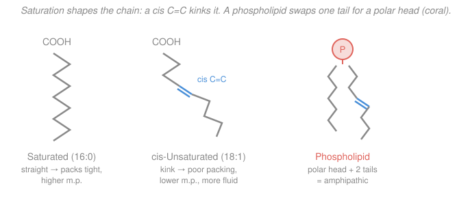

# Biochemistry · Lesson 4.1: Lipids — fatty acids, triacylglycerols & sterols

> ⏱ ~15 min · Module 4: Lipids, Membranes & the Flow of Information · Builds on: [organic-chemistry](../../organic-chemistry/syllabus.md), [2.5 Bioenergetics](02-05-bioenergetics-atp-redox.md) · Unlocks: [4.2 Fatty-acid oxidation](04-02-fatty-acid-oxidation.md), [4.3 Membranes & membrane transport](04-03-membranes-membrane-transport.md)

## Why this matters

A camel crosses the desert on the fat in its hump; a hibernating bear burns fat all winter; you are reading this powered partly by fat. Life stores its long-term energy as fat and builds every cell's wall out of a close cousin of fat — and both jobs trace back to one chemical fact: a **long hydrocarbon tail hates water and is packed with reduced C–H bonds**. This lesson opens Module 4 by classifying lipids and answering a number you have probably heard on a nutrition label without knowing why: fat carries ~9 kcal per gram, while sugar and protein carry ~4.

## The idea

Here is the twist that trips people up: **"lipid" is not a shape, it's a behavior.** Proteins are polymers of amino acids; nucleic acids are polymers of nucleotides — defined by structure. Lipids are defined by what they *do*: they don't dissolve in water. That solubility club admits members with wildly different skeletons — a floppy fatty acid, a three-tailed fat droplet, a ring-stiff sterol — united only by a greasy, water-avoiding hydrocarbon region.

That greasy region is the whole story. Because a hydrocarbon chain is nothing but carbon wearing hydrogen — no oxygen, no charge — it is (1) **invisible to water**, which is why fats clump into droplets and membranes, and (2) **electron-rich and un-oxidized**, which is why burning it releases so much energy. Chains that are *saturated* (all single bonds) are straight and stack like uncooked spaghetti; a single *cis* double bond puts a permanent 30° kink in the chain, and kinked chains can't stack — they stay liquid. Everything below is that one picture, dressed up.

## The formal version

**Fatty acid.** A long hydrocarbon chain ending in a carboxyl group, $\ce{CH3-(CH2)_n-COOH}$. We name it **X:Y** — $X$ carbons, $Y$ carbon–carbon double bonds. So **16:0** is palmitate (16 C, 0 double bonds, *saturated*); **18:1** is oleate (18 C, 1 double bond, *mono-unsaturated*), its lone double bond written $\Delta^9$ (between C9 and C10). *In words: the first number is chain length, the second counts the double bonds — and each double bond is one place the chain is not "saturated" with hydrogen.*

- **Saturated** = no C=C = straight chain = stacks tightly = higher melting point (solid at room temp, e.g. butter, tallow).
- **cis-Unsaturated** = one or more cis C=C = kinked chain = can't stack = lower melting point (liquid, e.g. olive oil). *A cis double bond bends the chain; a trans double bond does not, which is why "trans fats" behave like saturated fats.*

**Triacylglycerol (TAG).** The storage form: a glycerol backbone esterified to **three** fatty acids.

$$\ce{glycerol + 3\ RCOOH -> triacylglycerol + 3\ H2O}$$

*In words: fat is three fatty-acid tails tied to a glycerol handle by ester bonds — pure, uncharged energy storage, packed into oily droplets.* Because it carries no polar head, TAG is not a membrane material; it's the fuel tank.

**Glycerophospholipid.** Take a triacylglycerol and replace **one** tail with a phosphate-bearing polar head. Now the molecule has a schizophrenic personality: two greasy tails (**hydrophobic**) and one charged head (**hydrophilic**). We call such a molecule **amphipathic**. *In words: a phospholipid is a fat with one tail swapped for a water-loving head, so one end runs from water and the other end craves it.* Drop many into water and they self-assemble tails-in, heads-out — the **lipid bilayer**, the membrane of every cell (that is Lesson [4.3](04-03-membranes-membrane-transport.md)).

**Sterol.** A different skeleton entirely: four fused rigid rings. The star is **cholesterol** — a small polar $\ce{-OH}$ on one end, a rigid ring body, and a short tail. It wedges among phospholipid tails and acts as a **fluidity buffer** (Example 2), and it is the precursor to the steroid hormones (testosterone, estrogen, cortisol) and to bile salts.

**Why fat is such dense fuel (~9 vs ~4 kcal/g).** Two independent reasons stack:

1. **More reduced carbon.** Energy comes from stripping electrons off carbon and handing them to $\ce{O2}$. A fatty-acid carbon is bonded mostly to H (each C–H is a stored electron pair ready to be harvested); a carbohydrate carbon already wears an $\ce{-OH}$ on almost every carbon, i.e. it is *half-burned* already. Fewer electrons left to harvest → less ATP per carbon (quantified in Example 1).
2. **Anhydrous storage.** Fat is stored dry, in near-pure droplets. Glycogen — the carbohydrate store — is stored **hydrated**, dragging along roughly 2–3 grams of water per gram of glycogen. That water is dead weight carrying zero energy (Problem 2).

## Picture

## Worked examples

**Example 1 (why a fatty-acid carbon out-yields a glucose carbon — a redox count).** Energy harvest = electrons removed from carbon. A carbon's "how many electrons left to give" is its **oxidation state**: more negative = more reduced = more fuel. Assign by the rule that in each bond the electrons go to the more electronegative atom (C–H counts $-1$ for carbon, C–O counts $+1$, C–C counts $0$), and require every atom's oxidation numbers to sum to zero for a neutral molecule (H is $+1$, O is $-2$).

*Glucose*, $\ce{C6H12O6}$: sum over C $= -[12(+1)] - [6(-2)] = -12 + 12 = 0$, so the **average carbon oxidation state is $0/6 = 0$** — dead neutral, half-oxidized already.

*Palmitate*, $\ce{C16H32O2}$: sum over C $= -[32(+1)] - [2(-2)] = -32 + 4 = -28$, so the **average is $-28/16 = -1.75$** — every carbon is strongly reduced.

The fatty-acid carbons sit far lower on the oxidation ladder, so burning them all the way up to $\ce{CO2}$ ($+4$) drops each carbon through a bigger redox distance, spilling more electrons into NADH/FADH₂ and thus more ATP **per carbon**. That is the deep reason behind the 9-vs-4 number — and the tally you will actually crank out in [4.2](04-02-fatty-acid-oxidation.md).

**Example 2 (the geometry of melting — what a kink and a sterol do to a membrane).** Compare two 18-carbon fatty acids:

- **Stearate (18:0)**, fully saturated: straight chains stack like a tight brick of pencils, maximizing van der Waals contact. It takes lots of heat to shake them loose → melts around $69\,^\circ\text{C}$ (a hard fat).
- **Oleate (18:1, cis)**: one cis kink means neighbors can't lie flat against each other, van der Waals contact collapses, and it melts near $13\,^\circ\text{C}$ (a liquid oil).

So **adding a cis double bond lowers the melting point and, inside a membrane, raises fluidity** — more unsaturated tails = a runnier, more flexible bilayer. This is exactly how a fish keeps its membranes working in cold water (Problem 3).

Now **cholesterol**, wedged among the tails, does something clever *in both directions* — a buffer:

- **At high temperature** (membrane too fluid), the rigid ring body **restrains** the thrashing tails and packs them → it **stiffens** the membrane.
- **At low temperature** (membrane about to freeze into a rigid gel), cholesterol jams **between** tails and blocks them from crystallizing into a tight lattice → it **keeps** the membrane fluid.

*In words: cholesterol pushes back against whatever the temperature is doing, holding fluidity in a usable middle band.*

## Watch out

- **You might think all lipids share a common building block, like proteins do.** They don't — lipid is a *solubility* class ("insoluble in water, soluble in organic solvent"), not a structural family. A fatty acid, a triacylglycerol, and cholesterol have almost nothing structurally in common; they're grouped by behavior.
- **You might think a double bond raises the melting point (more bonds = stronger?).** Opposite: a *cis* double bond is a geometric wrench that *lowers* mp by preventing packing. Bond *count* isn't the point, chain *shape* is — which is why *trans* double bonds (no kink) melt high like saturated fats, the reason trans fats are solid.
- **You might conflate the fat (TAG) with the membrane lipid (phospholipid).** Both hang tails off glycerol, but TAG has **three** tails and no charge (pure storage), while a phospholipid trades one tail for a **polar head**, and that single swap is the entire reason it forms membranes — it's now amphipathic.

## One-liner

> Fat is dense fuel because its carbons are un-oxidized C–H bonds stored bone-dry — and a single cis kink is the wrench that keeps membranes from freezing solid.

## Problems

**P1 (🟢)** A fatty acid is labeled **18:2 ($\Delta^{9,12}$)**. (a) How many carbons and how many C=C double bonds? Is it saturated or unsaturated? (b) Rank its melting point against stearate (18:0) and oleate (18:1) — highest to lowest. (c) Of these three molecules — a triacylglycerol, a glycerophospholipid, cholesterol — which is amphipathic, and what feature makes it so?

**P2 (🟡)** Fat stores ~9 kcal/g and is essentially anhydrous; glycogen stores ~4 kcal/g but drags along ~3 g of water per gram of glycogen. (a) Compute the *effective* energy density of the hydrated glycogen store (kcal per gram of wet mass). (b) By what factor is fat a denser energy store per unit of actual body mass? (c) In one sentence, why does this make fat, not glycogen, the body's long-term reserve?

**P3 (🔴, optional — bridges to physiology & [4.3](04-03-membranes-membrane-transport.md))** An Antarctic fish lives at $-2\,^\circ\text{C}$; a desert lizard's membranes must work at $40\,^\circ\text{C}$. Predict which animal's membrane phospholipids carry *more* cis-unsaturated tails, and explain the reasoning in terms of fluidity. (This adjustment has a name: *homeoviscous adaptation*.)

Solutions

**P1** (a) **18 carbons, 2 double bonds** (the $\Delta^{9,12}$ says they sit at C9–C10 and C12–C13); two C=C means it is **unsaturated** (specifically poly-unsaturated — this is linoleate, an essential fatty acid). (b) More cis double bonds = more kinks = worse packing = lower mp, so highest → lowest is **18:0 (stearate) > 18:1 (oleate) > 18:2**. (Actual mp's: ~69, ~13, ~$-5\,^\circ\text{C}$ — monotonic in the double-bond count, as predicted.) (c) The **glycerophospholipid** is amphipathic: it has both a hydrophobic region (its two fatty-acid tails) and a hydrophilic region (its charged phosphate head), so one end flees water and the other seeks it. (TAG is all-hydrophobic; cholesterol is nearly so, with only a tiny $\ce{-OH}$.)

**P2** (a) One gram of glycogen brings ~3 g of water, so a "unit of glycogen store" is $1 + 3 = 4$ g of wet mass carrying $4$ kcal:
$$\frac{4\ \text{kcal}}{4\ \text{g wet}} = 1\ \text{kcal/g}.$$
(b) Fat is ~9 kcal per gram of (essentially dry) mass, so
$$\frac{9\ \text{kcal/g}}{1\ \text{kcal/g}} \approx 9\times.$$
Even taking the drier end (2 g water/g → $4/3 \approx 1.3$ kcal/g) still leaves fat ~**6–9× denser** per unit of actual mass. (Note the two effects compound: ~2.25× from the fuel itself being more reduced, times ~3–4× from carrying no water.) (c) Storing months of energy as glycogen would mean lugging around several times the mass in water — fat lets you carry the same energy at a fraction of the weight, which is decisive for anything that has to move.

**P3** The **Antarctic fish** needs *more* cis-unsaturated tails. Cold pushes a membrane toward a rigid, gel-like solid; cis kinks disrupt packing and keep the bilayer fluid at low temperature, so a cold-adapted organism enriches its phospholipids in unsaturated (kinked) chains to stay liquid at $-2\,^\circ\text{C}$. The hot-adapted lizard faces the opposite risk — a membrane going too runny — so it uses *more saturated* (straight) tails to hold packing together at $40\,^\circ\text{C}$. Both are tuning the same knob, chain shape, to land membrane fluidity in the working band despite very different temperatures — the geometric idea from Example 2, run as a survival strategy.

## Flashback

**From Lesson 3.4 (Oxidative phosphorylation):** A tissue fully oxidizes a fuel that delivers **5 NADH** and **1 FADH₂** to the electron-transport chain. (a) Using **2.5 ATP per NADH** and **1.5 ATP per FADH₂**, how much ATP does oxidative phosphorylation yield from this batch of carriers? (b) In one sentence, what physically couples the electron transfer to ATP synthesis?

Solution

(a) Multiply and add:
$$5 \times 2.5 + 1 \times 1.5 = 12.5 + 1.5 = 14\ \text{ATP}.$$

(b) The electron-transport chain uses the energy of electron transfer to pump protons across the inner mitochondrial membrane, building a **proton-motive force** (an $\ce{H+}$ gradient); protons flowing back down that gradient through **ATP synthase** drive it to make ATP — the chemiosmotic coupling. *(This is exactly the machinery [4.2](04-02-fatty-acid-oxidation.md) feeds: fatty-acid oxidation is a factory for the NADH and FADH₂ you just cashed in here.)*

## Connections

- **Backward:** the 9-vs-4 argument is pure redox bookkeeping from [2.5 Bioenergetics](02-05-bioenergetics-atp-redox.md) — oxidation state and electron carriers — and the ester and hydrocarbon chemistry of the tails is straight out of [organic-chemistry](../../organic-chemistry/syllabus.md).
- **Forward:** [4.2 Fatty-acid oxidation](04-02-fatty-acid-oxidation.md) actually burns these tails (Example 1's reduced carbons become the ATP), and [4.3 Membranes & membrane transport](04-03-membranes-membrane-transport.md) builds the bilayer from the amphipathic phospholipid and tunes it with the cholesterol of Example 2.
- **Sideways (physiology / thermodynamics):** anhydrous fat vs. hydrated glycogen is a mass-vs-energy design tradeoff every mobile organism has solved the same way, and homeoviscous adaptation (Problem 3) is a living thermostat built from nothing but chain geometry.
