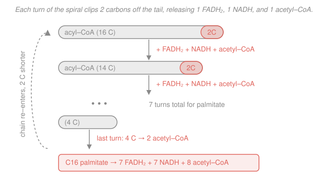

# Biochemistry · Lesson 4.2: Fatty-acid oxidation

> ⏱ ~15 min · Module 4: Lipids, Membranes & the Flow of Information · Builds on: [4.1 Lipids](04-01-lipids-fatty-acids-triacylglycerols-sterols.md), [3.3 The citric-acid cycle](03-03-citric-acid-cycle.md), [3.4 Oxidative phosphorylation](03-04-oxidative-phosphorylation.md) · Unlocks: [4.3 Membranes & membrane transport](04-03-membranes-membrane-transport.md)

## Why this matters

[Lesson 4.1](04-01-lipids-fatty-acids-triacylglycerols-sterols.md) claimed fat is the body's densest fuel — roughly 9 kcal/g against 4 for carbohydrate. This lesson cashes that claim out in the only currency the cell cares about: **ATP**. We'll take a single palmitate molecule, feed it into a small machine that peels off two carbons at a time, route the products into the same citric-acid cycle and electron-transport chain you already know, and land on an exact number — 106 ATP. Doing that tally is the whole reason lipids are worth storing.

## The idea

A saturated fatty acid is a long, floppy hydrocarbon tail: $\ce{CH3-CH2-CH2-\cdots-COOH}$. Almost every carbon is a $\ce{-CH2-}$ — as *reduced* (electron-rich) as carbon gets. Burning it means stripping those electrons off and handing them to $\ce{O2}$, and the cell does this the same patient way you'd eat a very long breadstick: **two carbons at a time, from one end**.

Each bite is a four-step cycle called **β-oxidation**. The name points at the second carbon from the carbonyl (the β-carbon): the cell oxidizes it, then snaps the bond just past it, releasing a two-carbon fragment as **acetyl-CoA** and leaving the tail two carbons shorter. Then it does it again. And again. Because the chain re-enters the same loop each time, the pathway is drawn as a **spiral** — same four steps, ever-shorter substrate.

Every bite also fills two electron carriers — one **FADH₂** and one **NADH** — which are exactly the reduced carriers [3.4](03-04-oxidative-phosphorylation.md) turns into ATP. So the accounting is almost mechanical: count the bites, count the acetyl-CoAs, count the carriers, convert to ATP, subtract the small entry fee. That's the lesson.

## The formal version

**Step 0 — activation (the entry fee).** Before anything, the fatty acid is tagged with coenzyme A. In the cytosol:

$$\ce{"fatty acid" + CoA-SH + ATP -> "acyl-CoA" + AMP + PPi}$$

*In words: the fatty acid is welded to CoA, and paying for the weld splits ATP all the way to AMP.* ATP $\to$ AMP breaks **two** phosphoanhydride bonds, and the released pyrophosphate ($\ce{PPi}$) is immediately hydrolyzed to $\ce{2 Pi}$ to make the step irreversible — so activation costs **2 ATP equivalents**. This is the *only* place ATP is spent, and you pay it once per fatty acid, not once per turn.

**The carnitine shuttle (getting inside).** β-Oxidation happens in the mitochondrial matrix, but the inner membrane won't pass acyl-CoA. A carrier called **carnitine** takes over the acyl group at the outer face (enzyme CPT-I), ferries it across as acylcarnitine, and hands it back to a fresh CoA inside (CPT-II).

*In words: CoA can't cross the membrane, so carnitine acts as a shuttle bus for the fatty tail.* This gate is the pathway's main control valve — **malonyl-CoA**, the signal that the cell is *building* fat, blocks CPT-I so you don't burn and build at once.

**The β-oxidation spiral (one turn).** Once inside, each turn runs four steps — *oxidize, hydrate, oxidize, cleave*:

| Step | Enzyme | What happens | Yield |
|---|---|---|---|
| 1 | acyl-CoA dehydrogenase | make a trans C=C double bond | **1 FADH₂** |
| 2 | enoyl-CoA hydratase | add water across it | — |
| 3 | hydroxyacyl-CoA dehydrogenase | oxidize the new $\ce{-OH}$ to a ketone | **1 NADH** |
| 4 | thiolase | CoA cleaves off the end 2 carbons | **1 acetyl-CoA** + acyl-CoA (2 C shorter) |

*In words: two oxidations load one FADH₂ and one NADH, then a knife-cut releases one acetyl-CoA and shortens the chain by two.* A chain of $n$ carbons ($n$ even) needs

$$\text{turns} = \frac{n}{2} - 1, \qquad \text{acetyl-CoA produced} = \frac{n}{2}.$$

*In words: you stop one turn early, because the final 4-carbon piece splits into two acetyl-CoAs in a single cut — so there is always one more acetyl-CoA than there are turns.*

**Where the products go.** Each acetyl-CoA enters the [citric-acid cycle](03-03-citric-acid-cycle.md) and is worth **10 ATP** (its 3 NADH + 1 FADH₂ + 1 GTP, converted through [ox-phos](03-04-oxidative-phosphorylation.md)). Each β-oxidation NADH and FADH₂ goes straight to the electron-transport chain at **2.5** and **1.5 ATP** respectively.

**Ketone bodies (the overflow).** When acetyl-CoA is produced faster than the cycle can burn it — prolonged fasting, a low-carb diet, untreated diabetes, when oxaloacetate is scarce — the liver condenses acetyl-CoA into **ketone bodies** (acetoacetate and β-hydroxybutyrate), water-soluble fuels it exports to the brain and muscle. *In words: when the acetyl-CoA tank overflows, the liver bottles the excess as ketones and ships them out.*

## Picture

## Worked examples

**Example 1 (the full palmitate tally).** Palmitate is $\ce{C16}$, saturated. Walk the accounting straight down.

*Turns and fragments.*

$$\text{turns} = \frac{16}{2} - 1 = 7, \qquad \text{acetyl-CoA} = \frac{16}{2} = 8.$$

Seven turns each release one FADH₂ and one NADH: **7 FADH₂ + 7 NADH + 8 acetyl-CoA**.

*Convert to ATP.*

$$
\begin{aligned}
\text{7 FADH}_2 &: \ 7 \times 1.5 = 10.5 \\
\text{7 NADH} &: \ 7 \times 2.5 = 17.5 \\
\text{8 acetyl-CoA} &: \ 8 \times 10 = 80 \\
\hline
\text{gross} &= 108
\end{aligned}
$$

*Subtract the entry fee* — activation cost 2 ATP equivalents:

$$\boxed{\,108 - 2 = 106 \text{ ATP net per palmitate.}\,}$$

Notice how little the direct carriers matter (10.5 + 17.5 = 28) versus the acetyl-CoAs (80): **β-oxidation's real job is to manufacture acetyl-CoA for the citric-acid cycle** — the electron carriers it fills along the way are a bonus.

**Example 2 (fat vs. glucose, per carbon).** Is fat really the denser fuel, once we account for chain length? Compare *ATP per carbon atom*.

Palmitate delivers 106 ATP over 16 carbons:

$$\frac{106}{16} = 6.6 \text{ ATP/carbon.}$$

Glucose ($\ce{C6}$) fully oxidized yields **32 ATP** (from [3.2](03-02-glycolysis.md)–[3.4](03-04-oxidative-phosphorylation.md): net 2 ATP + 2 NADH in glycolysis, 2 NADH from pyruvate dehydrogenase, and 20 ATP from two turns of the cycle):

$$\frac{32}{6} = 5.3 \text{ ATP/carbon.}$$

Fat wins, **6.6 vs. 5.3 per carbon** — and the reason is exactly [4.1](04-01-lipids-fatty-acids-triacylglycerols-sterols.md)'s point. A fatty acid's carbons are nearly all $\ce{-CH2-}$: fully reduced, loaded with electrons to harvest. Glucose's carbons already carry $\ce{-OH}$ groups — they're *partially oxidized*, so there's less left to extract. (Per *gram* the gap is even wider, because fat also carries no water of hydration — which is why animals store energy as fat, not sugar.)

## Watch out

- **You might think activation costs 1 ATP.** It splits ATP to **AMP + 2 Pi**, breaking two high-energy bonds — 2 ATP equivalents. Counting it as 1 gives 107 and is the single most common tally error.
- **You might count 8 turns for a C16 chain.** It's 8 acetyl-CoAs but only **7 turns**: the last turn takes a 4-carbon acyl-CoA and cleaves it into *two* acetyl-CoAs at once. Turns $= n/2 - 1$, acetyl-CoA $= n/2$ — they differ by one.
- **You might expect the FADH₂ and NADH to dominate the yield.** They don't — 28 of the 106 ATP. The acetyl-CoA fed to the citric-acid cycle is where 80 of them come from. β-Oxidation is mostly a *chopping* pathway that outsources the real burning to [3.3](03-03-citric-acid-cycle.md).

## One-liner

> Peel a fatty acid two carbons at a time: each turn banks one FADH₂ + one NADH + one acetyl-CoA, and a C16 tallies to $7(1.5) + 7(2.5) + 8(10) - 2 = 106$ ATP.

## Problems

**P1 (🟢)** Laurate is a saturated $\ce{C12}$ fatty acid. Find the number of β-oxidation turns, the number of acetyl-CoA produced, and the **net ATP** yield (2.5 ATP/NADH, 1.5 ATP/FADH₂, 10 ATP/acetyl-CoA, −2 for activation).

**P2 (🟡)** A classmate tallies palmitate but charges activation as **1** ATP and counts **8** turns (so 8 FADH₂ + 8 NADH). What net ATP do they get, and by how much does it exceed the correct 106? Identify the two separate mistakes and the ATP each one adds.

**P3 (🔴, optional)** Palmitoleate is $\ce{C16{:}1}$ — palmitate with one *cis* double bond already in the chain (a monounsaturated fat, per [4.1](04-01-lipids-fatty-acids-triacylglycerols-sterols.md)). At the turn where β-oxidation reaches that pre-existing double bond, step 1 (the FADH₂-producing oxidation) is **skipped** — the double bond is already there, so an isomerase just repositions it. It still runs 7 turns and makes 8 acetyl-CoA. Compute its net ATP and explain, in one sentence, why unsaturation slightly lowers the energy yield.

Solutions

**P1.** $\ce{C12}$: turns $= 12/2 - 1 = 5$; acetyl-CoA $= 12/2 = 6$. So 5 FADH₂ + 5 NADH + 6 acetyl-CoA.

$$
5(1.5) + 5(2.5) + 6(10) - 2 = 7.5 + 12.5 + 60 - 2 = \boxed{78 \text{ ATP.}}
$$

*Check:* per carbon $78/12 = 6.5$, just under palmitate's 6.6 — the fixed 2-ATP activation fee is spread over fewer carbons, so shorter chains are marginally less efficient. ✓

**P2.** With 8 turns and activation charged as 1:

$$
8(1.5) + 8(2.5) + 8(10) - 1 = 12 + 20 + 80 - 1 = 111 \text{ ATP.}
$$

That's $111 - 106 = 5$ ATP too high, from two independent errors:
- **Extra turn:** counting 8 turns instead of 7 adds one phantom FADH₂ + NADH $= 1.5 + 2.5 = 4$ ATP. (The acetyl-CoA count, 8, was right.)
- **Activation undercharge:** paying 1 instead of 2 adds $1$ ATP.

$4 + 1 = 5$ — the two mistakes account for the whole gap. ✓

**P3.** Same 7 turns and 8 acetyl-CoA, but one turn loses its FADH₂ step, so **6 FADH₂ + 7 NADH + 8 acetyl-CoA**:

$$
6(1.5) + 7(2.5) + 8(10) - 2 = 9 + 17.5 + 80 - 2 = \boxed{104.5 \text{ ATP.}}
$$

That's 1.5 ATP below palmitate — exactly one FADH₂'s worth. A pre-existing double bond means those two carbons were *already partially oxidized*, so the cell doesn't get to perform (and bank the electrons from) that first oxidation. Fewer electrons to harvest, slightly less ATP: the same reduced-vs-oxidized logic as Example 2, now visible within a single molecule. ✓

## Flashback

**From [Lesson 3.3 (The citric-acid cycle)](03-03-citric-acid-cycle.md):** A burst of acetyl-CoA drives **4 turns** of the citric-acid cycle. Using 2.5 ATP/NADH, 1.5 ATP/FADH₂, and 1 ATP per GTP, how much ATP does oxidative phosphorylation (plus the substrate-level GTP) extract? (Fresh numbers — recompute the per-turn value, don't just recall "10.")

Solution

One turn of the cycle yields 3 NADH, 1 FADH₂, and 1 GTP. Per turn:

$$3(2.5) + 1(1.5) + 1 = 7.5 + 1.5 + 1 = 10 \text{ ATP.}$$

Over 4 turns: $4 \times 10 = \boxed{40 \text{ ATP.}}$

*Check:* this is the origin of the "10 ATP per acetyl-CoA" shortcut used all through this lesson — each turn of the cycle burns exactly one acetyl-CoA. ✓

## Connections

- **Backward:** the acetyl-CoA from every turn is the *same* two-carbon fuel that [3.3](03-03-citric-acid-cycle.md) burns, and the FADH₂/NADH cash out through [3.4](03-04-oxidative-phosphorylation.md)'s electron-transport chain at 1.5 and 2.5 ATP — this lesson is those two lessons with a chain-chopper bolted on the front. The reduced-carbon energy density is [4.1](04-01-lipids-fatty-acids-triacylglycerols-sterols.md)'s claim, now a number.
- **Forward:** [4.3 Membranes & membrane transport](04-03-membranes-membrane-transport.md) — the carnitine shuttle is a preview of *why* getting molecules across the inner mitochondrial membrane needs dedicated carriers, the central theme of transport.
- **Sideways (physiology / endocrinology):** the malonyl-CoA switch on CPT-I and the ketone-body overflow are how insulin and glucagon decide, hour by hour, whether you store fat or burn it — the biochemistry under fasting, ketogenic diets, and diabetic ketoacidosis.
