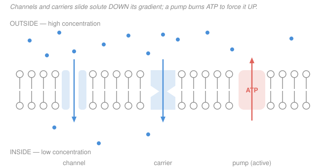

# Biochemistry · Lesson 4.3: Membranes & membrane transport

> ⏱ ~15 min · Module 4: Lipids, Membranes & the Flow of Information · Builds on: [4.1 Lipids](04-01-lipids-fatty-acids-triacylglycerols-sterols.md), [2.5 Bioenergetics](02-05-bioenergetics-atp-redox.md) · Unlocks: [4.4 Nucleic acids](04-04-nucleic-acids-dna-rna-structure.md)

## Why this matters

A cell is defined by a boundary two molecules thick. That boundary has a contradictory job: seal the inside off from a hostile outside, yet let exactly the right things cross at exactly the right rate. The whole trick reduces to one number — the free-energy change $\Delta G$ of moving a molecule across. If $\Delta G < 0$, the membrane can let it slide for free; if $\Delta G > 0$, the cell must *pay*, and the currency is ATP. Get this energetics straight and every transport protein — channel, carrier, pump — falls into place.

## The idea

Picture a crowded room (outside) connected to an empty one (inside) by a doorway. Open the door and people drift into the empty room on their own — no pushing required. That drift down a concentration difference is **diffusion**, and it costs nothing because it increases disorder (entropy): the universe *likes* spreading things out. This is the default behavior of anything that can get through the wall.

But the lipid membrane is a greasy wall. Small nonpolar molecules ($\ce{O2}$, $\ce{CO2}$) dissolve through it easily; ions and sugars — charged or hydrogen-bonding — hit it like a brick and need a protein doorway. Even with a doorway, the *direction* is still set by the gradient: a doorway can only speed up a drift that was already going to happen. To move something **the wrong way** — from the empty room back into the crowded one — you need a machine that does work, powered by burning fuel. That machine is a **pump**, and the fuel is usually ATP. Three regimes, one dividing line: is the move downhill (free) or uphill (pay)?

## The formal version

**The membrane.** Phospholipids are **amphipathic** — a polar phosphate head that loves water, two greasy fatty-acid tails that flee it (from [4.1](04-01-lipids-fatty-acids-triacylglycerols-sterols.md)). Drop them in water and they self-assemble, tails inward, heads out, into a **bilayer**: a two-layer sheet with an oily core. *In words: the membrane builds itself, because hiding the tails from water is downhill.* The **fluid-mosaic model** (Singer & Nicolson, 1972) says this sheet is a two-dimensional *fluid* — lipids and embedded proteins drift laterally like boats on a pond — not a rigid wall. Its **fluidity** rises with temperature and with unsaturated (kinked) tails, and is tuned by cholesterol, which buffers it both ways.

**The transport ladder.** For a solute at concentration $c_1$ on the starting side and $c_2$ on the far side:

| Mode | Protein? | Direction | $\Delta G$ | Energy source |
|---|---|---|---|---|
| Simple diffusion | none | down gradient | $<0$ | the gradient itself |
| Facilitated diffusion | channel or carrier | down gradient | $<0$ | the gradient itself |
| Active transport | pump | **up** gradient | $>0$ (made $<0$ by coupling) | ATP or another gradient |

*In words: passive transport (the first two rows) always runs downhill and needs no fuel — a protein only changes the speed, never the direction; active transport runs uphill and must be paid for.* **Channels** are open pores (fast, unselective-ish); **carriers** bind and flip one solute at a time (slower, selective) — both passive.

**The energetics.** For an **uncharged** solute, the free energy to move one mole from side 1 to side 2 is

$$\Delta G = RT \ln \frac{c_2}{c_1},$$

with $R = 8.314\ \mathrm{J\,mol^{-1}K^{-1}}$ and $T$ the absolute temperature (K). *In words: moving toward the more concentrated side ($c_2 > c_1$) costs energy; moving toward the dilute side releases it.* This is the same $RT\ln Q$ bookkeeping as reaction free energy in [2.5](02-05-bioenergetics-atp-redox.md) — a gradient is just a reaction whose "product" is the solute on the other side.

For a **charged** solute (an ion of charge $z$, e.g. $z=+1$ for $\ce{Na+}$), add the electrical work of crossing the membrane voltage:

$$\boxed{\;\Delta G = RT \ln \frac{c_2}{c_1} + zF\,\Delta\psi\;}$$

where $F = 96485\ \mathrm{C\,mol^{-1}}$ is Faraday's constant and $\Delta\psi = \psi_{\text{destination}} - \psi_{\text{source}}$ is the electrical potential difference the ion moves through (volts). *In words: an ion feels two forces — the concentration gradient AND the voltage — and the total electrochemical $\Delta G$ adds them.* The two terms can help or fight each other.

**Primary vs secondary active transport.** A pump with $\Delta G_{\text{transport}} > 0$ survives only by **coupling** to a downhill process, exactly as an uphill reaction couples to ATP hydrolysis in [2.5](02-05-bioenergetics-atp-redox.md):

- **Primary** active transport hydrolyzes ATP directly. The **$\ce{Na+}/\ce{K+}$-ATPase** spends one ATP to pump 3 $\ce{Na+}$ out and 2 $\ce{K+}$ in, building the gradients that power the cell.
- **Secondary** active transport spends *no* ATP itself — it lets one ion fall down its gradient and harnesses that release to drag a second solute uphill. **Symport** carries both the same way (e.g. the $\ce{Na+}$–glucose transporter: $\ce{Na+}$ falls inward, glucose is dragged in with it); **antiport** trades them in opposite directions. The ATP was spent *earlier*, by the primary pump that built the $\ce{Na+}$ gradient — secondary transport just cashes it in.

## Picture

## Worked examples

**Example 1 (uncharged solute uphill — why a pump needs ATP).** A cell must move an uncharged solute (say glucose) *up* a 10-fold concentration gradient — from $c_1$ inside to $c_2 = 10\,c_1$ outside — at body temperature $T = 310\ \mathrm{K}$. What does it cost, and can facilitated diffusion do it?

Only the concentration term appears ($z = 0$):

$$\Delta G = RT\ln\frac{c_2}{c_1} = (8.314)(310)\ln(10) = (8.314)(310)(2.3026) \approx +5.9\times10^3\ \mathrm{J/mol} = +5.9\ \mathrm{kJ/mol}.$$

$\Delta G > 0$, so this move is **non-spontaneous** — a channel or carrier (which only run downhill) *cannot* do it; the solute would just leak back. The cell couples it to ATP hydrolysis ($\Delta G^{\circ\prime}_{\text{ATP}} = -30.5\ \mathrm{kJ/mol}$):

$$\Delta G_{\text{coupled}} = +5.9 + (-30.5) = -24.6\ \mathrm{kJ/mol} < 0.\ \checkmark$$

*In words: hydrolyzing one ATP releases far more than the 5.9 kJ needed, so the coupled process runs — that is primary active transport.*

**Example 2 (add the voltage — pumping $\ce{Na+}$ out).** Now pump $\ce{Na+}$ ($z = +1$) *out* of the cell, up a 10-fold gradient ($c_2/c_1 = 10$, higher outside), across a membrane whose potential is $-60\ \mathrm{mV}$ inside relative to outside. Does the electric field help or oppose? ($T = 310\ \mathrm{K}$.)

Concentration term (same as Example 1):

$$RT\ln\frac{c_2}{c_1} = +5.9\ \mathrm{kJ/mol}.$$

Electrical term. The ion goes from inside (source) to outside (destination), so $\Delta\psi = \psi_{\text{out}} - \psi_{\text{in}} = 0 - (-60\,\mathrm{mV}) = +0.060\ \mathrm{V}$:

$$zF\Delta\psi = (+1)(96485)(+0.060) \approx +5.8\times10^3\ \mathrm{J/mol} = +5.8\ \mathrm{kJ/mol}.$$

A positive term means the field **opposes** the move: the cell interior is negative, so it *attracts* the positive $\ce{Na+}$ and resists letting it out. Both terms are positive — the export is doubly uphill:

$$\Delta G = 5.9 + 5.8 = +11.7\ \mathrm{kJ/mol}.$$

*In words: pushing a cation out against both a concentration gradient and an inward-pulling voltage costs ~11.7 kJ per mole.* The $\ce{Na+}/\ce{K+}$-ATPase moves 3 $\ce{Na+}$ per cycle, so ~$3 \times 11.7 \approx 35\ \mathrm{kJ/mol}$ just for the $\ce{Na+}$ leg — comfortably inside the budget of one ATP (whose *cellular* $\Delta G$ runs near $-50\ \mathrm{kJ/mol}$), which is why one ATP suffices.

## Watch out

- **You might think a transport protein sets the direction of flow. It doesn't.** A channel or carrier is passive plumbing — it only changes the *rate*. Direction is fixed by the sign of $\Delta G$, i.e. by the gradient and voltage. Only a fuel-burning pump can reverse the natural direction.
- **You might drop the electrical term for ions.** For anything charged, "down the concentration gradient" and "downhill in energy" can disagree — the voltage term can flip the sign. Always use the full $RT\ln(c_2/c_1) + zF\Delta\psi$; the *electrochemical* gradient is what governs, not concentration alone.
- **You might think secondary active transport is "free."** It burns no ATP *at that step*, but it spends the $\ce{Na+}$ gradient — which the primary $\ce{Na+}/\ce{K+}$-ATPase paid ATP to build. The energy debt is just moved upstream, never erased.

## One-liner

> Passive transport rides the electrochemical gradient downhill for free ($\Delta G = RT\ln\frac{c_2}{c_1} + zF\Delta\psi < 0$); active transport forces the uphill move and must couple to ATP or another gradient to pay for it.

## Problems

**P1 (🟢)** Classify each as simple diffusion, facilitated diffusion, or active transport, and state the sign of $\Delta G$ for the transported species: (a) $\ce{O2}$ crossing the bilayer into a capillary where it is consumed; (b) glucose entering a red blood cell through the GLUT1 carrier, down its gradient; (c) the $\ce{Na+}/\ce{K+}$-ATPase exporting $\ce{Na+}$; (d) the $\ce{Na+}$–glucose symporter pulling glucose into a gut cell against its gradient.

**P2 (🟡)** A $\ce{K+}$ channel lets $\ce{K+}$ ($z = +1$) leak *out* of a cell, from 140 mM inside to 5 mM outside, across a membrane potential of $-60\ \mathrm{mV}$ (inside relative to outside), at $T = 310\ \mathrm{K}$. Compute $\Delta G$ for moving one mole of $\ce{K+}$ out. Is the outward leak spontaneous? Which term dominates, and do the two terms cooperate or fight?

**P3 (🔴, connects to physiology)** In the gut, a $\ce{Na+}$–glucose symporter moves 1 $\ce{Na+}$ and 1 glucose *inward* per cycle. $\ce{Na+}$ falls from 145 mM (outside) to 12 mM (inside) across $-60\ \mathrm{mV}$; glucose must climb from 5 mM (outside) to 15 mM (inside), uncharged. Taking "inside" as the destination for both, at $T = 310\ \mathrm{K}$: (a) find $\Delta G$ for the $\ce{Na+}$ leg; (b) find $\Delta G$ for the glucose leg; (c) is the coupled cycle spontaneous? This is secondary active transport — say in one line where the energy ultimately came from.

Solutions

**P1.**
(a) **Simple diffusion** — $\ce{O2}$ is small and nonpolar, dissolves straight through the bilayer, no protein; it flows toward where it is consumed (low concentration), so $\Delta G < 0$.
(b) **Facilitated diffusion** — a carrier (GLUT1), but glucose moves *down* its gradient, so $\Delta G < 0$; the carrier only speeds it up.
(c) **Active transport (primary)** — $\ce{Na+}$ is pushed *up* its electrochemical gradient, so $\Delta G_{\text{transport}} > 0$; ATP hydrolysis makes the coupled process negative.
(d) **Active transport (secondary)** — glucose is dragged *up* its gradient ($\Delta G_{\text{glucose}} > 0$), paid for by $\ce{Na+}$ falling *down* its gradient ($\Delta G_{\ce{Na+}} < 0$); no ATP at this step.

**P2.** $\ce{K+}$ moves out: destination = outside, source = inside, so $c_2/c_1 = 5/140$ and $\Delta\psi = \psi_{\text{out}} - \psi_{\text{in}} = +0.060\ \mathrm{V}$.

Concentration term:
$$RT\ln\frac{5}{140} = (8.314)(310)\ln(0.0357) = (2577.3)(-3.332) \approx -8.6\times10^3\ \mathrm{J/mol} = -8.6\ \mathrm{kJ/mol}.$$

Electrical term:
$$zF\Delta\psi = (+1)(96485)(+0.060) \approx +5.8\ \mathrm{kJ/mol}.$$

Total:
$$\Delta G = -8.6 + 5.8 = -2.8\ \mathrm{kJ/mol}.$$

$\Delta G < 0$, so the outward leak **is spontaneous** — this is why resting cells lose $\ce{K+}$ through leak channels. The two terms **fight**: the steep concentration gradient (140 → 5) pushes $\ce{K+}$ out ($-8.6$), while the negative interior pulls the cation back in ($+5.8$). The concentration term wins, but only just — the cell sits near the $\ce{K+}$ equilibrium potential. *(Sanity: the Nernst equilibrium voltage for $\ce{K+}$ here is about $-89\ \mathrm{mV}$; at only $-60\ \mathrm{mV}$ the voltage under-pulls, so net outward flow — consistent with $\Delta G < 0$.)*

**P3.**
(a) $\ce{Na+}$ leg, inward: $c_2/c_1 = 12/145$, $\Delta\psi = \psi_{\text{in}} - \psi_{\text{out}} = -0.060\ \mathrm{V}$.
$$RT\ln\frac{12}{145} = (2577.3)\ln(0.0828) = (2577.3)(-2.492) \approx -6.4\ \mathrm{kJ/mol},$$
$$zF\Delta\psi = (+1)(96485)(-0.060) \approx -5.8\ \mathrm{kJ/mol},$$
$$\Delta G_{\ce{Na+}} = -6.4 + (-5.8) = -12.2\ \mathrm{kJ/mol}.$$
Both terms negative: concentration *and* voltage drive $\ce{Na+}$ inward — that inward $\ce{Na+}$ gradient is a loaded spring.

(b) Glucose leg, inward, uncharged ($z=0$): $c_2/c_1 = 15/5 = 3$.
$$\Delta G_{\text{glucose}} = RT\ln 3 = (2577.3)(1.0986) \approx +2.8\ \mathrm{kJ/mol}.$$
Positive — glucose is being pushed uphill, as required.

(c) Coupled cycle (1 $\ce{Na+}$ + 1 glucose):
$$\Delta G_{\text{cycle}} = -12.2 + 2.8 = -9.4\ \mathrm{kJ/mol} < 0.$$
**Spontaneous** — the $\ce{Na+}$ downhill run more than pays for dragging glucose uphill. The energy ultimately came from ATP: the $\ce{Na+}/\ce{K+}$-ATPase spent ATP earlier to build the $\ce{Na+}$ gradient this symporter now cashes in.

## Flashback

**From Lesson 2.5 (Bioenergetics — actual vs standard $\Delta G$):** A metabolic reaction $\ce{A -> B}$ has $\Delta G^{\circ\prime} = +7.5\ \mathrm{kJ/mol}$. Inside the cell the mass-action ratio is held at $Q = [\text{B}]/[\text{A}] = 0.01$ by the reaction that consumes B. At $T = 310\ \mathrm{K}$, compute the *actual* $\Delta G$ and state whether the reaction runs forward. ($R = 8.314\ \mathrm{J\,mol^{-1}K^{-1}}$.)

Solution

Use $\Delta G = \Delta G^{\circ\prime} + RT\ln Q$ — the same $RT\ln(\text{ratio})$ form that governs transport:

$$\Delta G = 7500 + (8.314)(310)\ln(0.01) = 7500 + (2577.3)(-4.605) = 7500 - 11868 \approx -4.4\times10^3\ \mathrm{J/mol}.$$

$$\Delta G \approx -4.4\ \mathrm{kJ/mol} < 0 \;\Rightarrow\; \text{the reaction runs forward.}$$

*In words: even though the reaction is unfavorable under standard conditions ($+7.5$), keeping product scarce ($Q = 0.01$) drags the actual $\Delta G$ negative — exactly the same trick a cell uses to keep an "uphill" step flowing. A concentration gradient and a reaction quotient are the same energetics wearing different clothes.*

## Connections

- **Backward:** the bilayer self-assembles because the amphipathic phospholipids of [4.1](04-01-lipids-fatty-acids-triacylglycerols-sterols.md) hide their tails from water; the coupling of an uphill pump to ATP is the same energy-coupling logic — and the same $RT\ln Q$ term — from [2.5 Bioenergetics](02-05-bioenergetics-atp-redox.md).
- **Forward:** the electrochemical-gradient math here is exactly the **proton-motive force** that spins ATP synthase in [3.4 Oxidative phosphorylation](03-04-oxidative-phosphorylation.md) — a proton falling down its gradient does the work, the mirror image of a pump building one. Next, [4.4 Nucleic acids](04-04-nucleic-acids-dna-rna-structure.md) turns from the cell's walls to its blueprint.
- **Sideways (physiology & neuroscience):** the $\ce{Na+}/\ce{K+}$-ATPase and the resulting ion gradients are the foundation of the **resting membrane potential** and the nerve action potential — the same $zF\Delta\psi$ term computed here, read as a voltage across the axon membrane.
