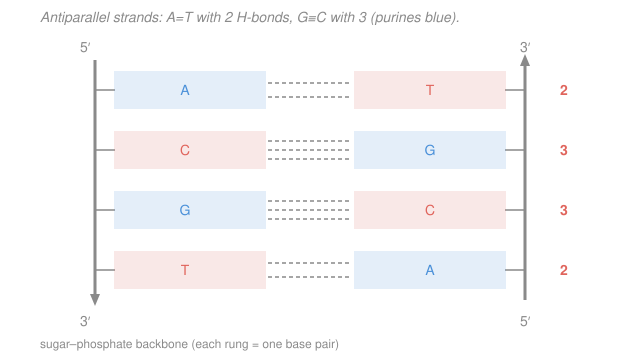

# Biochemistry · Lesson 4.4: Nucleic acids — DNA & RNA structure

> ⏱ ~15 min · Module 4: Lipids, Membranes & the Flow of Information · Builds on: [`organic-chemistry`](../../organic-chemistry/syllabus.md), [`general-biology`](../../general-biology/syllabus.md), [1.1 Water, pH & buffers](01-01-water-ph-buffers.md) · Unlocks: [4.5 The flow of genetic information](04-05-flow-of-genetic-information.md)

## Why this matters

Every protein you have met in this course — every enzyme, every hemoglobin, every membrane pump — is spelled out in a molecule whose entire job is to store and copy a message. DNA is not a complicated machine like an enzyme; it is a **ladder with a code written on the rungs**, and the code is legible precisely because of one chemical trick: a base on one strand hydrogen-bonds *specifically* to exactly one partner on the other. That single rule — A pairs with T, G pairs with C — is why a cell can unzip the ladder and rebuild each half perfectly, and it is why we can sequence a genome at all. This lesson is the structure; [4.5](04-05-flow-of-genetic-information.md) is what the cell *does* with it.

## The idea

Picture a twisted rope ladder. The two ropes are identical **sugar–phosphate backbones** — a monotonous, chemically boring alternation of sugar, phosphate, sugar, phosphate — running up each side. All the information lives on the **rungs**, and each rung is two flat chemical letters reaching in from opposite ropes and clasping hands in the middle.

The clasp is the whole story. There are four letters — A, G, C, T — but they do not pair at random. A is shaped and charged to hydrogen-bond only with T; G only with C. So if I hand you one rope with the sequence spelled out, you can reconstruct the other rope *without being told it* — every A demands a T across from it, every G demands a C. The two strands are **complementary**: not copies, but mirror-negatives, like a photograph and its film. That redundancy is the point. Lose one strand and the other dictates how to rebuild it. This is how life copies itself.

Two more facts make the ladder work. First, the two ropes run in **opposite directions** — one heads "up," the other "down." (They have a chemical polarity, a distinct top end and bottom end, and pairing only fits when they are flipped head-to-tail.) Second, the whole ladder **twists** into a double helix, which tucks the flat letters into a dry, stacked core and leaves two spiral grooves on the outside where proteins can read the sequence without unzipping anything.

## The formal version

**Nucleotide.** The monomer of a nucleic acid, built from three pieces: a **phosphate** group, a five-carbon **sugar**, and a **nitrogenous base**.

- The sugar is **deoxyribose** in DNA and **ribose** in RNA. The only difference: ribose carries an $\ce{-OH}$ on its 2′ carbon; deoxyribose has just $\ce{-H}$ there (hence *deoxy*).
- Sugar carbons are numbered 1′ through 5′ (read "one-prime," to keep them distinct from the atoms of the base). The base attaches at 1′; the phosphate hangs off 5′; the next nucleotide links onto the 3′.

*In words: a nucleotide is a sugar wearing a base on one side and a phosphate on another — the phosphate and base are the two connectors that let it join a chain and carry information.*

**The bases: purines vs. pyrimidines.**

| Class | Ring | Bases |
|---|---|---|
| **Purine** | two fused rings (bigger) | Adenine (**A**), Guanine (**G**) |
| **Pyrimidine** | one ring (smaller) | Cytosine (**C**), Thymine (**T**, DNA only), Uracil (**U**, RNA only) |

*In words: purines are the big two-ring bases, pyrimidines the small one-ring bases.* A pair always joins one big and one small base, which is exactly why every rung of the ladder is the same width.

**Watson–Crick base pairing.** The specific hydrogen-bonded partners:

$$\text{A}=\text{T}\ \ (\text{2 H-bonds}), \qquad \text{G}\equiv\text{C}\ \ (\text{3 H-bonds}).$$

*In words: adenine pairs with thymine using two hydrogen bonds; guanine pairs with cytosine using three.* Each is a purine + a pyrimidine (big + small). The hydrogen bond here is the same weak, directional link from [1.1](01-01-water-ph-buffers.md) (~20 kJ/mol each) — individually feeble, but a whole strand's worth zips the two backbones together tightly while still letting them unzip on demand.

**Antiparallel strands and the backbone.** Consecutive nucleotides are joined by a **phosphodiester bond**: the 5′-phosphate of one sugar bridges to the 3′-hydroxyl of the next. This gives each strand a **direction**, written $5'\to 3'$. The two strands of a duplex run **antiparallel** — one $5'\to 3'$ top-to-bottom, its partner $3'\to 5'$ top-to-bottom (i.e. $5'\to 3'$ bottom-to-top).

*In words: the backbone is a directional chain with a distinct head (5′) and tail (3′), and the two strands lie head-to-tail against each other.* By convention a sequence is written $5'\to 3'$ unless stated otherwise.

**The double helix.** The two antiparallel strands wind into a right-handed helix (B-form, ~10 base pairs per turn). The backbones spiral on the outside; the stacked base pairs fill a hydrophobic core. Because the two backbones are not diametrically opposite, the helix surface has two unequal channels: a wide **major groove** and a narrow **minor groove** — the major groove exposes enough of the base edges for proteins (like transcription factors) to read the sequence directly.

**RNA — the differences.** RNA is built the same way but with three changes: (1) the sugar is **ribose** (2′-OH present); (2) it uses **uracil (U)** in place of thymine (U pairs with A, also 2 H-bonds); (3) it is usually **single-stranded**, folding back on itself into local hairpins rather than forming a long duplex. Its main roles:

- **mRNA** (messenger): a transcript of a gene, carrying the protein recipe to the ribosome.
- **tRNA** (transfer): the adaptor that reads a 3-letter codon and delivers the matching amino acid.
- **rRNA** (ribosomal): the structural and catalytic core of the ribosome itself.
- **Regulatory RNAs** (e.g. miRNA): short RNAs that tune which genes are expressed.

## Picture

The left strand reads $5'\text{-ACGT-}3'$ (top to bottom); its antiparallel partner is $3'\text{-TGCA-}5'$. Count the dashes on each rung: two for A=T, three for G≡C. More dashes, more glue.

## Worked examples

**Example 1 (complement an antiparallel strand and count the glue).** Given the strand

$$5'\text{-} \texttt{A T G C G G T A} \text{-}3',$$

write the complementary strand and total its hydrogen bonds.

*Step 1 — pair each base.* Complement letter by letter (A↔T, G↔C):

$$\texttt{A T G C G G T A} \;\longrightarrow\; \texttt{T A C G C C A T}.$$

*Step 2 — get the direction right.* The complement runs **antiparallel**, so as written left-to-right it is $3'\to 5'$:

$$3'\text{-}\texttt{T A C G C C A T}\text{-}5'.$$

To report it in standard $5'\to 3'$ form, reverse it:

$$\boxed{5'\text{-}\texttt{T A C C G C A T}\text{-}3'.}$$

*Step 3 — count H-bonds.* Tally the pairs in the 8 bp duplex. There are 4 A/T pairs and 4 G/C pairs (count the G's and C's in the original: G, C, G, G → 4 strong pairs; the rest are A/T):

$$4 \times 2 + 4 \times 3 = 8 + 12 = 20 \text{ hydrogen bonds.}$$

*Check.* The complement should have the same GC content as the original (4 of 8), because every G on one strand faces a C on the other — and it does. ✓

**Example 2 (which duplex melts first?).** "Melting" ($T_m$) is the temperature at which the two strands come apart. You have two 10-bp sequences:

$$\text{Sequence I: } 5'\text{-}\texttt{ATATATATAT}\text{-}3', \qquad \text{Sequence II: } 5'\text{-}\texttt{GCGCGCGCGC}\text{-}3'.$$

Which has the higher $T_m$?

*Step 1 — count the H-bonds holding each duplex.* Sequence I is all A/T pairs (2 H-bonds each): $10 \times 2 = 20$. Sequence II is all G/C pairs (3 H-bonds each): $10 \times 3 = 30$.

*Step 2 — interpret.* Melting means supplying enough thermal energy to break the base-pair hydrogen bonds. Sequence II has 50% more hydrogen bonds (and stronger base-stacking) holding it shut, so it takes **more** heat to separate:

$$\boxed{\text{Sequence II (high GC) has the higher } T_m.}$$

*Why 3 vs. 2 matters:* $T_m$ rises roughly linearly with **GC content** — each G≡C pair contributes an extra hydrogen bond over an A=T pair, so a GC-rich stretch is a more thermally stable clasp. This is why PCR primers are chosen for balanced GC content, and why heat-loving bacteria carry GC-rich genomes. *Check.* If the rule were reversed we'd expect AT-rich DNA (like the "TATA box" where transcription must pry the strands open) to be the *hardest* to melt — but biology puts easy-to-open AT-rich sequences exactly where the cell needs to unzip. ✓

## Watch out

- **You might think the two strands are identical copies.** They are **complementary**, not identical — each is the other's negative. Reading one gives you the other by the pairing rule, which is the entire basis of copying; identical strands would carry no such redundancy.
- **You might forget to flip direction when writing a complement.** The complement is antiparallel. If you write the paired bases left-to-right you have produced the $3'\to 5'$ strand; reverse it to report the conventional $5'\to 3'$ sequence (as in Example 1).
- **You might think more hydrogen bonds means DNA is "stronger" everywhere is good.** The genome is deliberately mixed: it needs GC-rich regions for stability *and* AT-rich regions that open easily for replication and transcription. The information is in the *sequence*, not in maximizing the glue.

## One-liner

> DNA is two antiparallel sugar–phosphate backbones clasped by specific base pairs — A=T (2 H-bonds), G≡C (3) — so each strand dictates the other, and GC-rich duplexes, held by more hydrogen bonds, melt at higher temperature.

## Problems

**P1 (🟢)** A DNA strand reads $5'\text{-}\texttt{TTACGCAG}\text{-}3'$. (a) Write its complementary strand in standard $5'\to 3'$ form. (b) How many hydrogen bonds hold the resulting 8-bp duplex together?

**P2 (🟡)** Two 12-bp duplexes have the same length but sequence A is 25% GC and sequence B is 75% GC. (a) Count the total hydrogen bonds in each. (b) Which has the higher melting temperature, and state the one-sentence reason. (c) A researcher wants a short duplex that will reliably stay closed at 37 °C body temperature — which design principle should she favor?

**P3 (🔴, optional — bridge to information theory)** A stretch of DNA is $n = 20$ base pairs long. (a) How many distinct double-stranded sequences of this length are possible, given that fixing one strand fixes the other? (b) How many bits of information does one such 20-bp sequence encode? (This is the same "letters × log of alphabet size" counting used in [`information-theory`](../../information-theory/syllabus.md).)

Solutions

**P1 (a)** Complement each base (A↔T, G↔C): $\texttt{TTACGCAG} \to \texttt{AATGCGTC}$, which as written is the $3'\to 5'$ strand. Reverse it for standard form:

$$\boxed{5'\text{-}\texttt{CTGCGTAA}\text{-}3'.}$$

**(b)** Count G/C pairs in the original strand: the C, G, C, G give **4** G≡C pairs; the remaining 4 are A=T pairs.

$$4 \times 3 + 4 \times 2 = 12 + 8 = 20 \text{ H-bonds.}$$

*Check.* GC content is 4/8 on both strands — every C faces a G. ✓

**P2 (a)** In a 12-bp duplex, 25% GC = 3 G/C pairs and 9 A/T pairs; 75% GC = 9 G/C pairs and 3 A/T pairs.

$$\text{A: } 3(3) + 9(2) = 9 + 18 = 27 \text{ H-bonds.} \qquad \text{B: } 9(3) + 3(2) = 27 + 6 = 33 \text{ H-bonds.}$$

**(b)** Sequence **B** (75% GC) has the higher $T_m$: it is held by more hydrogen bonds (and stronger base stacking), so more thermal energy is needed to separate the strands.

**(c)** Favor **high GC content** (and/or greater length) — more G≡C pairs mean more hydrogen bonds and a higher $T_m$, so the duplex resists melting apart at body temperature.

**P3 (a)** Fixing one strand fixes the other by complementarity, so a double-stranded sequence is determined entirely by its top strand: 4 choices per position, 20 positions:

$$4^{20} = (2^2)^{20} = 2^{40} \approx 1.1 \times 10^{12} \text{ distinct sequences.}$$

**(b)** Information content $= \log_2(\text{number of equally likely messages})$:

$$\log_2\!\left(4^{20}\right) = 20\log_2 4 = 20 \times 2 = \boxed{40 \text{ bits}}$$

— i.e. **2 bits per base pair**, since each of 4 bases is 2 bits. *Check.* The complement adds no new information (it is fully determined by the top strand), so a "20-bp" duplex still carries only 20 bases' worth = 40 bits, not 80. ✓

## Flashback

**From Lesson 1.1 (Water, pH & buffers).** Base pairing *is* hydrogen bonding — the same weak link that makes water sticky and buffers work. As a fresh retrieval: you need a buffer at pH 7.0 from the pair $\ce{H2PO4-}$ / $\ce{HPO4^2-}$ with $pK_a = 7.2$. What ratio $[\ce{HPO4^2-}]/[\ce{H2PO4-}]$ do you prepare, and is there more acid or more base?

Solution

Apply Henderson–Hasselbalch, $\text{pH} = pK_a + \log_{10}\dfrac{[\ce{A-}]}{[\ce{HA}]}$, with $\ce{A-} = \ce{HPO4^2-}$ and $\ce{HA} = \ce{H2PO4-}$:

$$7.0 = 7.2 + \log_{10}\frac{[\ce{HPO4^2-}]}{[\ce{H2PO4-}]} \;\Longrightarrow\; \log_{10}\frac{[\ce{HPO4^2-}]}{[\ce{H2PO4-}]} = -0.2 \;\Longrightarrow\; \frac{[\ce{HPO4^2-}]}{[\ce{H2PO4-}]} = 10^{-0.2} \approx 0.63.$$

So about **0.63 parts base per part acid** — there is *more acid* ($\ce{H2PO4-}$) than base. *Check.* The target pH (7.0) sits *below* $pK_a$ (7.2), so the acid form must dominate ($<1$ ratio) — consistent. ✓

## Connections

- **Backward:** the base-pair clasp is the **hydrogen bond** of [1.1](01-01-water-ph-buffers.md) — weak, directional, ~20 kJ/mol — used in bulk. And the helix's dry, stacked core is stabilized by the same **hydrophobic effect** that buries oily side chains in a protein: the flat bases stack away from water while the charged phosphate backbone faces out.
- **Forward:** [4.5 The flow of genetic information](04-05-flow-of-genetic-information.md) turns this static ladder into a process — complementarity drives **semiconservative replication** (each strand templates a new partner), **transcription** (DNA → mRNA), and **translation** (mRNA → protein, read three bases at a time by tRNA).
- **Sideways (information theory):** a base pair is a 2-bit symbol, so a genome is a message with a 4-letter alphabet — the exact counting of [`information-theory`](../../information-theory/syllabus.md) (P3). Complementarity is a built-in error-correcting redundancy: a damaged base can be rebuilt from its partner, the biological cousin of a parity check.
