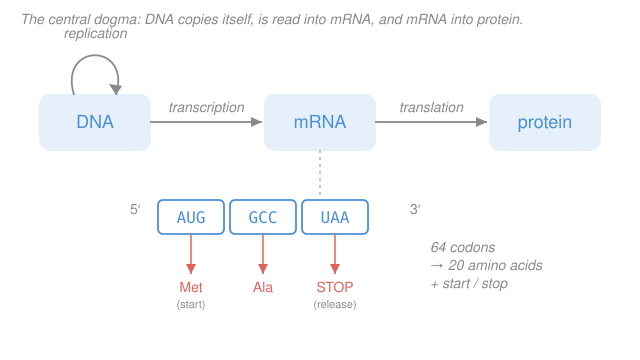

# Biochemistry · Lesson 4.5: The flow of genetic information (a taste)

> ⏱ ~15 min · Module 4: Lipids, Membranes & the Flow of Information · Builds on: [4.4 Nucleic acids: DNA & RNA structure](04-04-nucleic-acids-dna-rna-structure.md), [1.2 Amino acids & the peptide bond](01-02-amino-acids-peptide-bond.md) · Unlocks: (course end) [`molecular-cell-biology`](../../molecular-cell-biology/syllabus.md), [`genetics`](../../genetics/syllabus.md)

## Why this matters

In [4.4](04-04-nucleic-acids-dna-rna-structure.md) you learned that DNA is a double helix of paired, antiparallel strands — a stable archive. This lesson is about what the archive is *for*: a cell reads it to build proteins, and copies it to hand down. Three processes do all the work — **replication**, **transcription**, **translation** — and together they close the loop this whole course has been tracing: a one-dimensional *sequence* (Module 1) folds into a *structure* that performs a *function* (Modules 1–3), and here we see where that sequence comes *from*. This is a taste, not the full meal; the machinery in depth lives in [`molecular-cell-biology`](../../molecular-cell-biology/syllabus.md) and [`genetics`](../../genetics/syllabus.md).

## The idea

Think of DNA as a master blueprint locked in the vault (the nucleus). You never take the master out onto the shop floor. Instead you make a **working photocopy** of just the page you need — that's **transcription**, DNA → a messenger RNA (mRNA). The photocopy goes to the machine shop (the ribosome), which reads it and assembles the part — that's **translation**, mRNA → protein. And once in a while you photocopy the *entire* master to give a daughter cell — that's **replication**, DNA → DNA.

That one-directional flow, **DNA → RNA → protein**, is the **central dogma** of molecular biology. Information moves from nucleic-acid sequence into amino-acid sequence, and — as a rule of thumb — not back out.

The clever part is the reading step. Protein is written in a 20-letter alphabet (amino acids); RNA in a 4-letter alphabet (A, U, G, C). How do you spell 20 things with 4 letters? Use *words of length three*: $4^3 = 64$ three-letter words, called **codons**, more than enough. The ribosome reads mRNA three bases at a time and, for each codon, grabs the matching amino acid and welds it onto the growing chain — using the exact same **peptide bond** you met back in [1.2](01-02-amino-acids-peptide-bond.md).

## The formal version

**The central dogma.** The standard flow of sequence information is

$$\text{DNA} \xrightarrow{\ \text{transcription}\ } \text{RNA} \xrightarrow{\ \text{translation}\ } \text{protein}, \qquad \text{DNA} \xrightarrow{\ \text{replication}\ } \text{DNA}.$$

*In words: DNA is copied to make more DNA, read out into RNA, and RNA is decoded into protein — information flows one way, nucleic acid to protein.* (Retroviruses run RNA → DNA with reverse transcriptase; the "dogma" is the default, not a law of physics.)

**Replication is semiconservative.** To copy the duplex, the two strands unzip and each serves as a **template** for a new partner, built by **DNA polymerase** following Watson–Crick pairing (A–T, G–C) from [4.4](04-04-nucleic-acids-dna-rna-structure.md). Each daughter helix ends up with **one old strand and one new strand** — hence *semi*conservative (half-conserved). Polymerase can only add nucleotides to the 3' end, i.e. it synthesizes strictly **5' → 3'**; so one new strand (the **leading** strand) is built continuously and the other (the **lagging** strand) in short backstitched pieces. *In words: unzip the zipper, and each half tells you exactly how to rebuild the missing half.*

**Transcription.** **RNA polymerase** binds DNA, opens a short bubble, and reads one strand (the **template**) 3' → 5' while building an mRNA copy 5' → 3'. The mRNA sequence matches the *non-template* strand except that RNA uses **uracil (U) in place of thymine (T)**. *In words: transcription is a single-stranded photocopy of one gene, in RNA letters.*

**The genetic code.** The ribosome reads mRNA in non-overlapping **triplets** (codons) starting from a **start codon, AUG** (which also codes methionine), and stops at one of three **stop codons** (UAA, UAG, UGA). The mapping of 64 codons → 20 amino acids has structure:

- **Triplet:** each codon is 3 bases, read in a fixed **reading frame**.
- **Degenerate (redundant):** 64 codons, only 20 amino acids + stop, so most amino acids have several codons — usually differing only in the **third** base.
- **Unambiguous:** each codon specifies exactly one amino acid.

*In words: three letters per word; more words than meanings, so the code has synonyms — a fact that matters enormously for mutations.*

**Translation.** The **ribosome** (two subunits of RNA + protein) clamps the mRNA. For each codon, a **transfer RNA (tRNA)** whose three-base **anticodon** is complementary to the codon arrives carrying the corresponding amino acid. The ribosome catalyzes a **peptide bond** between the new amino acid and the growing chain — the same planar amide condensation from [1.2](01-02-amino-acids-peptide-bond.md) — then shifts one codon down. *In words: tRNAs are molecular adaptors — one end reads a codon, the other end holds the amino acid, and the ribosome staples them into a chain.*

## Picture

The top row is the dogma; the strip below zooms into the reading step — mRNA chopped into codons, each pulling in one amino acid, with AUG kicking things off and UAA halting the chain.

## Worked examples

**Example 1 — Run one gene end to end: DNA → mRNA → protein.** You're given the **template** strand of a short gene, written 3' → 5' so it lines up with the mRNA:

$$\text{template DNA:}\quad 3'\text{-}\;\mathtt{T\,A\,C}\;\;\mathtt{C\,G\,G}\;\;\mathtt{A\,T\,T}\;\text{-}5'.$$

Use this mini codon table:

| Codon | Amino acid |
|---|---|
| AUG | Met (**start**) |
| GCU, GCC, GCA, GCG | Ala |
| GAC | Asp |
| UAA, UAG, UGA | **stop** |

*Step 1 — transcribe.* RNA polymerase reads the template 3' → 5' and builds mRNA 5' → 3' by complementary pairing, writing **U** where the template has **A**:

| template (3'→5') | T | A | C | C | G | G | A | T | T |
|---|---|---|---|---|---|---|---|---|---|
| mRNA (5'→3') | A | U | G | G | C | C | U | A | A |

So the mRNA is $5'\text{-}\mathtt{AUG\;GCC\;UAA}\text{-}3'$.

*Step 2 — translate.* Read from the start codon in triplets:

- **AUG** → Met (start — the ribosome begins here),
- **GCC** → Ala,
- **UAA** → stop (no amino acid; the ribosome releases the peptide).

*Result:* the protein is **Met–Ala** (a dipeptide), joined by one peptide bond, then the chain is released. Two amino acids linked exactly as in [1.2](01-02-amino-acids-peptide-bond.md) — the whole course, sequence → structure → function → information, in three lines of decoding.

**Example 2 — Semiconservative copying, and why one typo has three fates.** Two ideas, tied together.

*What "semiconservative" means.* Unzip the parent duplex and use each strand as a template. Each daughter helix keeps **one parental strand** and gets **one freshly built strand** — not two brand-new strands (that would be *conservative*), and not a scrambled mix (*dispersive*). This is exactly what Meselson and Stahl confirmed by density-labeling DNA: after one round of copying, every duplex was a hybrid of old + new.

*One base substitution, three outcomes.* Suppose replication or transcription introduces a single wrong base — a **point mutation** — changing one codon. Because the code is a *triplet* and *degenerate*, the consequence depends on which codon you land on. Take the Ala codon **GCC** from Example 1:

- **Silent:** GCC → **GCA**. Both mean Ala (third-base degeneracy!), so the protein is **unchanged**. The code's redundancy absorbs the typo. *This is the direct payoff of degeneracy.*
- **Missense:** GCC → **GAC**. Now the codon means Asp, so **one amino acid is swapped** for another. Sometimes harmless, sometimes catastrophic — the classic case is sickle-cell, where a single Glu → Val swap in β-globin deforms hemoglobin.
- **Nonsense:** take a codon one base away from a stop — e.g. the Lys codon **AAA → UAA**. A single A → U change turns it into a **stop codon**, truncating the protein early. Usually severe, because the rest of the chain is never made.

*In words: the same size of error — one letter — can do nothing, change one residue, or chop the protein in half, and which one happens is dictated by the structure of the genetic code.*

## Watch out

- **You might think** the ribosome reads DNA directly. **Actually** it reads **mRNA** — DNA never leaves the nucleus (in eukaryotes); transcription makes the portable copy, and RNA uses **U** where DNA used **T**.
- **You might think** "degenerate" means the code is sloppy or ambiguous. **Actually** it's the opposite: each codon maps to exactly *one* amino acid (unambiguous); degeneracy means several codons *share* an amino acid. That redundancy is a feature — it lets many single-base changes be **silent**.
- **You might think** replication makes two all-new copies. **Actually** it's **semiconservative** — each daughter duplex is one old strand + one new. And synthesis is always **5' → 3'**, which is *why* the lagging strand has to be built in pieces.

## One-liner

> Information flows DNA → RNA → protein: each DNA strand templates its partner (semiconservative), RNA polymerase photocopies a gene into mRNA, and the ribosome reads that mRNA three bases at a time — tRNA adaptors delivering amino acids that it welds with peptide bonds.

## Problems

**P1 (🟢)** A gene's **template** strand reads $3'\text{-}\mathtt{TAC\;TTC\;ACT}\text{-}5'$. Using the table below, (a) transcribe it to mRNA (5' → 3'), and (b) translate the first codons to the peptide.

| Codon | AA | Codon | AA |
|---|---|---|---|
| AUG | Met (start) | UGA | stop |
| AAG | Lys | AAA | Lys |
| UGA | stop | GCU | Ala |

**P2 (🟡)** Classify each single-base change to the mRNA codon **UGG** (Trp) as silent, missense, or nonsense, and say what the new codon means. Use: UGG = Trp, UGA/UAG/UAA = stop, CGG = Arg, UGC = Cys.
(a) UGG → UGA. (b) UGG → CGG. (c) UGG → UGC.

**P3 (🔴, optional — bridge to [`genetics`](../../genetics/syllabus.md))** A stretch of a protein-coding gene has its reading frame shifted by the **insertion of a single extra base** near the start of the coding region (a *frameshift*). Explain why this typically wrecks the whole downstream protein far more thoroughly than a single-base *substitution* does — and why degeneracy of the code offers essentially **no** protection here.

Solutions

**P1.** (a) Transcribe by complementary pairing, template read 3' → 5', writing U for A:

| template (3'→5') | T | A | C | T | T | C | A | C | T |
|---|---|---|---|---|---|---|---|---|---|
| mRNA (5'→3') | A | U | G | A | A | G | U | G | A |

mRNA $= 5'\text{-}\mathtt{AUG\;AAG\;UGA}\text{-}3'$.

(b) Read in triplets from the start: **AUG** → Met (start), **AAG** → Lys, **UGA** → stop. Peptide = **Met–Lys**, then release. (Two residues, one peptide bond.)

**P2.** Trp is UGG.
- (a) UGG → **UGA**: UGA is a stop codon → **nonsense** (protein truncated at this position).
- (b) UGG → **CGG**: CGG is Arg → **missense** (Trp replaced by Arg).
- (c) UGG → **UGC**: UGC is Cys → **missense** (Trp replaced by Cys). *(Not silent — the amino acid changed. Trp happens to have only one codon, so it has no synonymous single-base neighbors; no silent option exists here.)*

**P3.** A substitution changes **one codon**, so at worst it alters (missense) or truncates at (nonsense) a *single* position, and degeneracy can even make it silent. A single-base **insertion** shifts the **reading frame**: every codon *downstream* of the insertion is re-grouped into a completely different set of triplets. So instead of one changed amino acid you get an entirely **different amino-acid sequence** from the insertion point onward — usually gibberish that also hits a premature stop codon quickly, truncating the protein. Degeneracy can't help because it only protects *synonymous* substitutions within a fixed frame; a frameshift destroys the frame itself, so the "synonym" structure of the code no longer lines up with anything. This is why insertions/deletions of non-multiples of three are typically far more damaging than point substitutions — a staple result you'll formalize in [`genetics`](../../genetics/syllabus.md).

## Flashback

**From Lesson 4.4 (base pairing, antiparallel strands, GC and melting):** One strand of DNA reads $5'\text{-}\mathtt{GCGCATTA}\text{-}3'$. (a) Write its complementary strand, with the 5'/3' ends labeled correctly. (b) Would this duplex melt (denature) at a **higher or lower** temperature than the duplex $5'\text{-}\mathtt{AATTAATT}\text{-}3'$ + its complement, and why?

Solution

(a) Strands are **antiparallel**, so the complement runs the opposite direction. Pair A–T and G–C base by base:

| given (5'→3') | G | C | G | C | A | T | T | A |
|---|---|---|---|---|---|---|---|---|
| complement (3'→5') | C | G | C | G | T | A | A | T |

Written in the conventional 5' → 3' direction, the complementary strand is $5'\text{-}\mathtt{TAATGCGC}\text{-}3'$. (The partner reads 3'-CGCGTAAT-5' as aligned above.)

(b) **Higher.** This duplex is 50% G–C (4 of 8 base pairs: the GCGC block), and each **G–C pair has three hydrogen bonds** versus **two for A–T**. The comparison duplex is **all A–T** (0% GC), held by only two H-bonds per pair. More G–C content means more hydrogen bonds to break, so a **higher melting temperature** $T_m$ — exactly the GC-content rule from [4.4](04-04-nucleic-acids-dna-rna-structure.md).

## Connections

- **Backward:** this lesson is [4.4](04-04-nucleic-acids-dna-rna-structure.md)'s base pairing put to work — Watson–Crick complementarity is the copying rule for *both* replication and transcription — and the bond the ribosome forms is the planar peptide bond from [1.2](01-02-amino-acids-peptide-bond.md), closing the course loop from sequence to structure to function to information.
- **Forward (course end):** the mechanistic depth — origins and replication forks, RNA processing and splicing, ribosome structure, mutation and repair, gene regulation — is the spine of [`molecular-cell-biology`](../../molecular-cell-biology/syllabus.md) and [`genetics`](../../genetics/syllabus.md), which this "taste" is meant to hand you off to.
- **Sideways (information theory):** a triplet code over a 4-letter alphabet giving $4^3 = 64$ codons for ~21 meanings is a redundant encoding, and "degeneracy = error tolerance" is exactly the coding-theory idea that redundancy buys robustness to single-symbol errors — the language of [`information-theory`](../../information-theory/syllabus.md).
