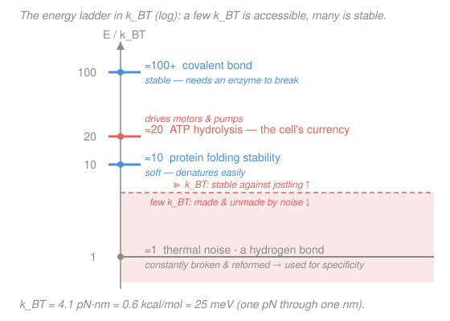

# Biophysics · Lesson 1.1: The ruler of the cell — $k_BT$ and scales

> ⏱ ~15 min · Module 1: Scales, random walks, and diffusion · Builds on: [`stat-mech` syllabus](../../stat-mech/syllabus.md) · Unlocks: [1.2 The random walk](01-02-random-walk.md)

## Why this matters

Before you write a single equation about the cell, you need to know what a "big" number and a "small" number *are* down there. A newton is absurd; a meter is a galaxy away. The cell has its own natural ruler — the **thermal energy** $k_BT$ — and almost every question in this course reduces to one comparison: *is this energy bigger or smaller than $k_BT$?* Bigger, and it survives the ceaseless jostling of warm water; smaller, and thermal noise makes and unmakes it thousands of times a second. Binding, folding, motor stepping, ion channels gating — all of it is a few $k_BT$ fighting entropy. Learn the ruler first and every later estimate falls into place.

## The idea

A cell is warm water packed with molecules, and warm means *shaking*. Every atom is being kicked by its neighbors with a characteristic energy set by temperature. That energy scale is $k_BT$ — Boltzmann's constant $k_B$ times absolute temperature $T$ — and at body or room temperature it comes out to a number worth burning into memory:

$$k_BT \approx 4.1\ \mathrm{pN\cdot nm}.$$

Why *piconewton-nanometers*, of all units? Because that is the cell's native scale. Molecular **forces** come in piconewtons (pN, $10^{-12}$ N) and molecular **sizes** come in nanometers (nm, $10^{-9}$ m). So $k_BT$ is literally *the energy it takes to push a piconewton force through a nanometer* — the work of one molecular tug over one molecular length. That is why it's the ruler: it's built out of the cell's own units.

The whole method of this course is a comparison. Line every energy up against $k_BT$:

- Costs **only a few $k_BT$**? Thermal jostling supplies that for free, constantly — the thing is forever being formed and broken. (This is *why* the cell uses weak bonds for recognition: they let go and re-grab.)
- Costs **$\gg k_BT$**? Thermal noise essentially never pays the bill on its own — the thing is stable, and it takes dedicated machinery (an enzyme, a motor burning fuel) to change it.

Hold that ladder in your head — thermal noise at the bottom rung, covalent bonds far above — and you can predict what's rigid, what's floppy, and what spontaneously happens, all before doing arithmetic.

## The formal version

**Thermal energy.** For a system in contact with a heat bath at absolute temperature $T$ (in kelvin, K), the natural energy scale is

$$k_BT, \qquad k_B = 1.38\times 10^{-23}\ \mathrm{J/K}.$$

At $T \approx 300\ \mathrm{K}$ (room / body temperature, since $37^\circ\mathrm{C} = 310\ \mathrm{K}$ is close enough for estimates),

$$k_BT \approx 4.1\times 10^{-21}\ \mathrm{J} \approx 4.1\ \mathrm{pN\cdot nm} \approx 0.6\ \mathrm{kcal/mol} \approx 25\ \mathrm{meV}.$$

*In words: the same energy, in four dialects — joules for physics, pN·nm for single molecules, kcal/mol for chemistry, meV for spectroscopy.* Memorize **4.1 pN·nm**; convert to the others as needed. (The $k_B$ here is the per-molecule Boltzmann constant; multiply by Avogadro's number $N_A = 6.02\times 10^{23}\ \mathrm{mol^{-1}}$ to get the per-mole gas constant $R = N_A k_B = 8.31\ \mathrm{J/(mol\cdot K)}$, and $RT \approx 2.5\ \mathrm{kJ/mol} \approx 0.6\ \mathrm{kcal/mol}$.)

**The Boltzmann factor** (straight from [`stat-mech`](../../stat-mech/syllabus.md)). If a state costs energy $\Delta E$ above the ground state, its relative population at equilibrium is

$$\frac{P(\text{excited})}{P(\text{ground})} = e^{-\Delta E / k_BT}.$$

*In words: every $k_BT$ of extra cost cuts the odds by a factor of $e \approx 2.7$.* This one exponential is the quantitative form of "compare it to $k_BT$": when $\Delta E \sim k_BT$ the factor is order 1 (both states matter, things flicker); when $\Delta E \gg k_BT$ the factor is astronomically small (the costly state is empty).

**The energy ladder** (values to know, all in $k_BT$ at $\sim 300\ \mathrm{K}$):

| Process | Energy | Consequence |
|---|---|---|
| Thermal noise | $1\ k_BT$ | the baseline — the ruler itself |
| Weak / hydrogen bond | $\sim 1$–few $k_BT$ | breaks and reforms constantly → used for specificity |
| Marginal protein folding stability | $\sim 10\ k_BT$ | soft; denatures easily |
| ATP hydrolysis | $\sim 20\ k_BT$ | the cell's energy currency; drives motors & pumps |
| Covalent bond | $\sim 100$–$200\ k_BT$ | stable; needs an enzyme to break |

**The length and force ladder** (to know):

- Water molecule $\sim 0.3\ \mathrm{nm}$; lipid bilayer thickness $\sim 4\ \mathrm{nm}$; a typical protein $\sim 5\ \mathrm{nm}$; a bacterium $\sim 1\ \mu\mathrm{m}$; a eukaryotic cell $\sim 10\ \mu\mathrm{m}$.
- A molecular motor stalls at $\sim 5\ \mathrm{pN}$; a covalent bond ruptures at $\sim 1\ \mathrm{nN} = 1000\ \mathrm{pN}$.

Notice these hang together: a force of a few pN acting over a step of a few nm does work of a few to tens of pN·nm — a few to tens of $k_BT$. The cell's forces, sizes, and energies are *designed* around the same ruler.

## Picture

## Worked examples

**Example 1 (mechanical — ATP in $k_BT$).** The cell's fuel, ATP, releases about $\Delta G \approx 50\ \mathrm{kJ/mol}$ when hydrolyzed under real cellular conditions. How many $k_BT$ is that? First convert per-mole to per-molecule by dividing by Avogadro's number:

$$\Delta G_{\text{per molecule}} = \frac{50\times 10^{3}\ \mathrm{J/mol}}{6.02\times 10^{23}\ \mathrm{mol^{-1}}} = 8.3\times 10^{-20}\ \mathrm{J}.$$

Now measure it in rulers:

$$\frac{\Delta G}{k_BT} = \frac{8.3\times 10^{-20}\ \mathrm{J}}{4.1\times 10^{-21}\ \mathrm{J}} \approx 20.$$

So one ATP is worth **about $20\ k_BT$** — comfortably above the noise, enough to force a motor forward against jostling but small enough that a handful of ATP powers each step. (The often-quoted *standard*-state value $30.5\ \mathrm{kJ/mol}$ gives $\approx 12\ k_BT$; the cell keeps ATP far from equilibrium, which is what buys the extra $\sim 8\ k_BT$.)

**Example 2 (why you'd care — who survives the jostling).** Take a lone hydrogen bond worth $\Delta E = 2\ k_BT$. At equilibrium, what fraction of the time is it broken? Model it as two states — bonded (ground) and broken (costs $\Delta E$). The Boltzmann factor gives the ratio of broken to bonded:

$$\frac{P(\text{broken})}{P(\text{bonded})} = e^{-\Delta E / k_BT} = e^{-2} \approx 0.14,$$

so the fraction broken is

$$P(\text{broken}) = \frac{0.14}{1 + 0.14} \approx 0.12 \quad (\approx 12\%).$$

A single weak bond spends more than a tenth of its life *undone* — it flickers open and shut, which is exactly why the cell uses weak bonds where it wants reversible recognition. Now run the same number for a covalent bond at $\Delta E = 100\ k_BT$: $e^{-100} \approx 4\times 10^{-44}$. It is *never* broken by thermal noise; only an enzyme, lowering the barrier, can touch it. Same formula, opposite verdicts — because one energy is a couple of rulers and the other is a hundred.

## Watch out

- **You might think $k_BT$ is an *amount of heat you have to add*.** It isn't a budget you spend — it's the *typical size of the kicks already happening* at temperature $T$. "Costs $2\ k_BT$" means "thermal noise pays for this fairly often on its own"; "costs $50\ k_BT$" means "thermal noise essentially never does."
- **You might mix up per-molecule and per-mole.** $k_BT$ (with $k_B$) is per molecule; $RT$ (with $R = N_A k_B$) is per mole. They differ by Avogadro's number. A quantity in kJ/mol must be divided by $N_A$ before comparing to a single molecule's $k_BT$ in joules — or just compare it to $RT \approx 2.5\ \mathrm{kJ/mol}$ directly.
- **You might treat 300 K as exact.** For order-of-magnitude biophysics it's fine to use $k_BT \approx 4.1\ \mathrm{pN\cdot nm}$ for anything from room ($298\ \mathrm{K}$) to body ($310\ \mathrm{K}$) temperature — that whole range shifts $k_BT$ by only $\sim 4\%$, far below the precision of these estimates.

## One-liner

> $k_BT \approx 4.1\ \mathrm{pN\cdot nm}$ is the cell's ruler: a few $k_BT$ is made and unmade by thermal noise, $\gg k_BT$ is stable — and *compare it to $k_BT$* is the whole method.

## Problems

**P1 (🟢)** A typical globular protein's folding is only marginally stable, worth about $10\ k_BT$. Express that stability in kcal/mol, and comment on whether the number is reasonable for a real protein.

**P2 (🟡)** A weak bond in a binding site is worth $\Delta E = 3\ k_BT$. Using the Boltzmann factor, estimate the fraction of the time it sits broken at equilibrium. How does raising the cost to $6\ k_BT$ change that fraction?

**P3 (🔴, optional)** A molecular motor converts the $\sim 20\ k_BT$ from one ATP into a single $4\ \mathrm{nm}$ forward step. Estimate the maximum force it could exert (energy over distance), in pN. Compare it to a motor's typical $\sim 5\ \mathrm{pN}$ stall force and to the $\sim 1\ \mathrm{nN}$ needed to snap a covalent bond — what do the comparisons tell you?

Solutions

**P1** Use the conversion $1\ k_BT \approx 0.6\ \mathrm{kcal/mol}$:

$$10\ k_BT \times 0.6\ \frac{\mathrm{kcal/mol}}{k_BT} = 6\ \mathrm{kcal/mol}.$$

*Check.* Measured folding free energies for small single-domain proteins run roughly $5$–$15\ \mathrm{kcal/mol}$, so $6\ \mathrm{kcal/mol}$ sits right in the real range. That it's only $\sim 10\ k_BT$ — a handful of rulers — is exactly why proteins are "soft," breathe, and denature with a modest nudge in temperature or pH. ✓

**P2** Two states, broken costing $\Delta E$ above bonded. Ratio of broken to bonded is $e^{-\Delta E/k_BT}$, so the fraction broken is $e^{-\Delta E/k_BT}/(1 + e^{-\Delta E/k_BT})$. For $\Delta E = 3\ k_BT$:

$$e^{-3} \approx 0.050 \;\Longrightarrow\; P(\text{broken}) = \frac{0.050}{1.050} \approx 0.047 \approx 5\%.$$

For $\Delta E = 6\ k_BT$:

$$e^{-6} \approx 0.0025 \;\Longrightarrow\; P(\text{broken}) = \frac{0.0025}{1.0025} \approx 0.0025 \approx 0.25\%.$$

*Check.* Doubling the cost from $3$ to $6\ k_BT$ dropped the broken fraction by a factor of $e^{-3} \approx 20$, from $\sim 5\%$ to $\sim 0.25\%$ — the exponential's signature. Each extra $k_BT$ buys another factor of $e$ of stability, so a bond only a few rulers deep flickers, while one a dozen rulers deep is effectively permanent. ✓

**P3** Maximum force is the energy delivered divided by the step length (all the work done over the step). Convert $20\ k_BT$ to pN·nm using $k_BT \approx 4.1\ \mathrm{pN\cdot nm}$:

$$E = 20 \times 4.1\ \mathrm{pN\cdot nm} = 82\ \mathrm{pN\cdot nm}, \qquad F_{\max} = \frac{E}{d} = \frac{82\ \mathrm{pN\cdot nm}}{4\ \mathrm{nm}} \approx 20\ \mathrm{pN}.$$

*Check.* The answer lands squarely in piconewtons — the cell's force scale — which is the whole point: pN·nm energies over nm steps give pN forces. It's an *upper bound* (a real motor is not a perfectly efficient lever and loses some energy to heat), so the measured stall force $\sim 5\ \mathrm{pN}$ being a few-fold smaller is exactly right. And $20\ \mathrm{pN}$ is $\sim 50\times$ below the $\sim 1000\ \mathrm{pN}$ that ruptures a covalent bond — so a motor can haul cargo and strain structures all day without ever tearing its own backbone apart. ✓

## Connections

- **Backward:** the Boltzmann factor $e^{-\Delta E/k_BT}$ and the very idea of a thermal energy scale come straight from [`stat-mech`](../../stat-mech/syllabus.md) — this lesson just reads that machinery in the cell's units (pN·nm) and turns it into an estimation habit.
- **Forward:** the *same* thermal kicks that make and unmake weak bonds also push molecules around at random — that's [1.2 The random walk](01-02-random-walk.md) and then diffusion. The $k_BT$ ruler will resurface everywhere: as the stiffness of an [entropic spring](03-01-entropic-spring.md), the depth of a [binding well](02-03-ligand-binding-occupancy.md), and the drive behind [molecular motors](04-03-molecular-motors-ratchet.md).
- **Sideways:** "compare the energy to $k_BT$" is the biophysics face of a comparison you'll meet again in chemistry (activation energy vs $RT$) and semiconductor physics (band gap vs $k_BT$, where 25 meV is the room-temperature ruler). Same exponential, different field.
