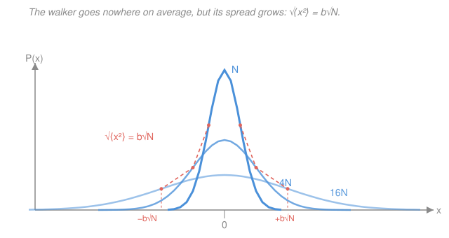

# Biophysics · Lesson 1.2: The random walk

> ⏱ ~15 min · Module 1: Scales, random walks, and diffusion · Builds on: [1.1 The ruler of the cell: $k_BT$ and scales](01-01-kbt-ruler-scales.md), [`prob-stat-refresher` syllabus](../../prob-stat-refresher/syllabus.md) · Unlocks: [1.3 Diffusion and Fick's laws](01-03-diffusion-ficks-laws.md)

## Why this matters

A protein floating in the cytoplasm is not swimming anywhere — it is being *punched*, from every side, about $10^{12}$ times a second by water molecules carrying the $k_BT$ of energy you met in [1.1](01-01-kbt-ruler-scales.md). Each punch nudges it a fraction of a nanometer in a random direction. Out of that structureless jitter comes one of the most useful laws in all of biology: the molecule's typical distance from home grows as $\sqrt{t}$, not $t$. That single fact — the signature of **diffusion** — decides whether a cell can rely on molecules finding each other by luck (bacteria can) or must build motors and highways to haul them (neurons must). This lesson turns "many small random kicks" into a sharp, predictable spread, and hands you the Gaussian you'll integrate into Fick's laws next lesson.

## The idea

Picture a drunk on a sidewalk who flips a coin at every step: heads, one step right; tails, one step left. Where is she after $N$ flips? On *average*, nowhere — right and left cancel, so her expected position is exactly her starting point. That feels like nothing is happening. But "on average nowhere" hides the real story: any *particular* walk wanders off, and the further you let it run, the further it typically strays. The right question isn't "where is she on average?" (zero, boring) but "how far from home is she typically?" — and that distance genuinely grows.

Here's the crucial twist that makes diffusion so different from walking-with-purpose. Because the steps point in random directions, they add up like a *tug-of-war with random pulls*, not like marching. To go twice as far, she needs **four times** as many steps — distance grows like the square root of the number of steps, hence the square root of time. That $\sqrt{t}$ is slow when you want to cross a room and lightning-fast when you only need to cross a nanometer, which is exactly why molecular life at the nanoscale can let diffusion do the work for free.

## The formal version

Model the walk in 1D. Take $N$ steps; step $i$ is a random variable $s_i = \pm b$, where $b$ (in nm) is the **step length**. For an **unbiased** walk each direction is equally likely, $P(+b) = P(-b) = \tfrac12$, and the steps are **independent** of one another. The net displacement is their sum,

$$x = \sum_{i=1}^{N} s_i.$$

**Mean displacement.** Each step averages to zero, $\langle s_i\rangle = \tfrac12(+b) + \tfrac12(-b) = 0$, so

$$\langle x\rangle = \sum_{i=1}^N \langle s_i\rangle = 0.$$

*In words: with no preferred direction, the walker drifts nowhere — the average of all possible walks is a molecule that never left.*

**Mean-square displacement.** The average position is useless; the average *squared* position is everything. Square the sum before averaging:

$$\langle x^2\rangle = \Big\langle \Big(\sum_i s_i\Big)\Big(\sum_j s_j\Big)\Big\rangle = \sum_{i} \langle s_i^2\rangle \;+\; \sum_{i\neq j} \langle s_i s_j\rangle.$$

The two pieces behave completely differently. Each **diagonal** term is $\langle s_i^2\rangle = b^2$ (since $s_i^2 = b^2$ no matter which way the step went) — there are $N$ of them. Each **cross** term vanishes: by independence $\langle s_i s_j\rangle = \langle s_i\rangle\langle s_j\rangle = 0\cdot 0 = 0$. So the cross terms — the interference between different steps — average away, and only the squares survive:

$$\boxed{\;\langle x^2\rangle = N b^2\;}\qquad\Longrightarrow\qquad x_{\text{rms}} \equiv \sqrt{\langle x^2\rangle} = b\sqrt{N}.$$

*In words: variances of independent steps simply add. A random walker goes nowhere on average, but its typical distance from home grows as $\sqrt{N}$ — it spreads, it does not drift.*

**The $\sqrt{t}$ signature.** The molecule is kicked at a fixed rate, so the number of steps is proportional to elapsed time, $N \propto t$. Therefore

$$x_{\text{rms}} = b\sqrt{N} \;\propto\; \sqrt{t}.$$

This is the fingerprint of diffusion, and it is *not* the $x \propto t$ of something moving at constant velocity (ballistic motion). To cover twice the distance you need four times the time. Great for a molecule crossing a nanometer, hopeless for one crossing a meter — the fact that sets up **Boss problem 1** and the reason neurons pay for active transport.

**The Gaussian (central limit theorem).** A sum of many independent, identically distributed steps has a limiting shape, no matter what a single step looked like: a **Gaussian**. With mean $0$ and variance $\langle x^2\rangle = N b^2$, the probability of finding the walker near position $x$ after $N$ steps is

$$P(x,N) = \frac{1}{\sqrt{2\pi N b^2}}\; e^{-x^2 / (2 N b^2)}.$$

*In words: the cloud of possible positions is a bell curve centered on home, whose width $\sigma = b\sqrt{N}$ grows as $\sqrt{N}$ while its peak sinks to keep the total probability at $1$* — a spreading, flattening bell (the picture below). This is exactly the **central limit theorem** from [`prob-stat-refresher`](../../prob-stat-refresher/syllabus.md), wearing a biophysics uniform.

**The biased walk.** Add a gentle push — a force, a flow, a motor's bias — so that stepping right has probability $p$ and left $q = 1-p$. Now each step averages to $\langle s_i\rangle = pb - qb = (p-q)b$, and the mean displacement no longer vanishes:

$$\langle x\rangle = N(p-q)b \neq 0.$$

*In words: a drift now rides on top of the spread.* The bell curve still widens as before, but its center marches off at a steady rate — the seed of **drift–diffusion**, the physics of molecular motors ([4.3](04-03-molecular-motors-ratchet.md)) and of electrophoresis pulling charged molecules through a gel.

## Picture

Quadrupling the number of steps only *doubles* the width — the visual meaning of $\sigma \propto \sqrt{N}$. The coral envelope tracks $x_{\text{rms}} = b\sqrt{N}$ as it opens.

## Worked examples

**Example 1 (mechanical — the RMS after $N$ steps).** A small protein takes steps of length $b = 1\ \text{nm}$ and, over some interval, makes $N = 10^4$ independent unbiased steps. Then

$$\langle x\rangle = 0, \qquad x_{\text{rms}} = b\sqrt{N} = (1\ \text{nm})\sqrt{10^4} = 100\ \text{nm}.$$

It has typically wandered $100$ nm, even though its *average* position never moved. To wander a full micron ($1\,\mu\text{m} = 1000$ nm) it would need $N = (1000/1)^2 = 10^6$ steps — a hundredfold more steps to go tenfold farther. That is $\sqrt{N}$ scaling in one line.

**Example 2 (why you'd care — diffusion is fast small, hopeless large).** Suppose a molecule crosses a $1\ \mu\text{m}$ bacterium in about $t_0 = 0.5$ ms. Because diffusion time scales as the *square* of the distance ($t \propto L^2$, since $L \propto \sqrt t$), stretching the distance costs quadratically:

$$\text{across } 1\ \text{mm} = 10^3\,\mu\text{m}: \quad t = t_0\,(10^3)^2 = 0.5\ \text{ms}\times 10^6 \approx 500\ \text{s} \approx 8\ \text{min};$$
$$\text{across } 1\ \text{m} = 10^6\,\mu\text{m}: \quad t = t_0\,(10^6)^2 = 0.5\ \text{ms}\times 10^{12} \approx 5\times10^{8}\ \text{s} \approx 16\ \text{years}.$$

A bacterium can let diffusion mix its contents in milliseconds; a meter-long axon that waited for diffusion would wait a human lifetime. This is precisely why neurons build motors and microtubule highways — the arithmetic of $\sqrt{t}$ forbids the lazy option.

## Watch out

- **You might think $\langle x\rangle = 0$ means "nothing spreads."** It means nothing *drifts*. Spreading lives in the *second* moment $\langle x^2\rangle = Nb^2$, which grows without bound. Always ask for the mean-square, not the mean, when the mean is zero by symmetry.
- **You might expect distance $\propto$ time.** That is ballistic motion (constant velocity). Diffusion gives distance $\propto \sqrt{t}$ because random steps add in *quadrature* — their variances add, not their lengths. The cross terms cancel; that cancellation *is* the square root.
- **You might drop the cross terms without justification.** They vanish only because the steps are **independent** ($\langle s_i s_j\rangle = \langle s_i\rangle\langle s_j\rangle$). If successive steps were correlated (a stiff polymer, a molecule with memory), the cross terms would survive and change the scaling — the very effect that defines a persistence length in [3.2](03-02-persistence-length-wlc.md).

## One-liner

> Independent random kicks give $\langle x\rangle = 0$ but $\langle x^2\rangle = Nb^2$, so a diffusing molecule's typical distance grows as $b\sqrt{N}\propto\sqrt{t}$ — a spreading Gaussian, not a march.

## Problems

**P1 (🟢)** An unbiased 1D walker takes steps of length $b = 2\ \text{nm}$. (a) What is its mean displacement $\langle x\rangle$ after $N = 2500$ steps? (b) Its RMS displacement? (c) How many steps would it need to reach an RMS displacement of $1\ \mu\text{m}$?

**P2 (🟡)** A transcription factor crosses the $1\ \mu\text{m}$ width of a bacterium by diffusion in about $0.4$ ms. Treating diffusion time as $t \propto L^2$, estimate how long it would take the same molecule to diffuse (a) across a $20\ \mu\text{m}$ animal cell and (b) down a $10\ \text{cm}$ nerve axon. In one sentence, what do the two answers say about when a cell can trust diffusion?

**P3 (🔴, optional)** A charged molecule in an electric field does a *biased* walk: step right with probability $p = 0.55$, left with $q = 0.45$, step length $b = 1\ \text{nm}$, for $N = 10^4$ steps. (a) Find the mean displacement $\langle x\rangle$. (b) Show the variance of one step is $\mathrm{Var}(s_i) = 4pq\,b^2$, and find the spread (standard deviation) $\sigma = \sqrt{N\cdot 4pq}\,b$ of the total. (c) Compare drift to spread — which wins, and what does that mean physically?

Solutions

**P1** (a) By symmetry an unbiased walk has $\langle x\rangle = 0$ — no preferred direction, so all $N$ steps average to zero regardless of $N$ or $b$.

(b) $x_{\text{rms}} = b\sqrt{N} = (2\ \text{nm})\sqrt{2500} = 2\ \text{nm}\times 50 = 100\ \text{nm}.$

(c) Set $b\sqrt{N} = 1\ \mu\text{m} = 1000\ \text{nm}$: $\sqrt{N} = 1000/2 = 500$, so $N = 500^2 = 2.5\times10^{5}$ steps.

*Check.* Units: nm $\times\sqrt{\text{(pure number)}}$ = nm ✓. Going from $100$ nm to $1000$ nm is $10\times$ farther and costs $(10)^2 = 100\times$ the steps ($2500 \to 250{,}000$) — the $\sqrt{N}$ law confirmed.

**P2** Time scales as the square of distance, $t = t_0 (L/L_0)^2$ with $L_0 = 1\ \mu\text{m}$, $t_0 = 0.4$ ms.

(a) $L = 20\ \mu\text{m}$: $t = 0.4\ \text{ms}\times(20)^2 = 0.4\ \text{ms}\times 400 = 160\ \text{ms} \approx 0.16\ \text{s}.$

(b) $L = 10\ \text{cm} = 10^5\ \mu\text{m}$: $t = 0.4\ \text{ms}\times(10^5)^2 = 0.4\ \text{ms}\times10^{10} = 4\times10^{9}\ \text{ms} = 4\times10^{6}\ \text{s} \approx 46\ \text{days}.$

One sentence: diffusion is essentially instantaneous across a cell but takes weeks down an axon, so cells rely on diffusion at the micron scale and must use active transport (motors) at the millimeter-and-up scale.

*Check.* The $\sqrt{t}$/$L^2$ scaling means a $10^5$-fold jump in length is a $10^{10}$-fold jump in time — the enormous gap between $0.16$ s and $46$ days is exactly that quadratic penalty, matching the lesson's bacterium-vs-neuron point and setting up Boss problem 1.

**P3** (a) $\langle x\rangle = N(p-q)b = 10^4\times(0.55-0.45)\times 1\ \text{nm} = 10^4\times 0.1\ \text{nm} = 1000\ \text{nm} = 1\ \mu\text{m}.$

(b) A single step has $s_i = \pm b$ so $s_i^2 = b^2$ always, giving $\langle s_i^2\rangle = b^2$. Its mean is $\langle s_i\rangle = (p-q)b$, so

$$\mathrm{Var}(s_i) = \langle s_i^2\rangle - \langle s_i\rangle^2 = b^2 - (p-q)^2 b^2 = b^2\big[1-(p-q)^2\big] = b^2\big[(p+q)^2-(p-q)^2\big] = 4pq\,b^2,$$

using $p+q=1$. Independent steps add variances, so the total variance is $N\cdot 4pq\,b^2$ and $\sigma = b\sqrt{4pqN}$. Numerically $4pq = 4(0.55)(0.45) = 0.99$, so $\sigma = (1\ \text{nm})\sqrt{0.99\times10^4} \approx (1\ \text{nm})(99.5) \approx 100\ \text{nm}.$

(c) Drift $\langle x\rangle = 1000$ nm vastly beats spread $\sigma \approx 100$ nm — a $10:1$ ratio after $10^4$ steps. Physically, a small directional bias, integrated over many steps, produces net transport that overwhelms the random blurring: the molecule is being *driven*, with diffusion merely fuzzing the arrival position. This drift-plus-spread is drift–diffusion, the physics behind electrophoresis and molecular motors.

*Check.* Set $p=q=\tfrac12$: then $\langle x\rangle = 0$ and $4pq = 1$, recovering the unbiased $\sigma = b\sqrt N$ and $\langle x^2\rangle = Nb^2$ ✓. Also note the drift grows as $N$ while the spread grows only as $\sqrt N$, so bias always wins in the long run — exactly why even a weak force eventually dominates thermal wandering.

## Connections

- **Backward:** the $10^{12}$ kicks per second come straight from [1.1](01-01-kbt-ruler-scales.md) — each collision trades $\sim k_BT$ of thermal energy, and $k_BT$ is what sets the step size and rate. The random walk is what $k_BT$ *does* to a molecule over time.
- **Forward:** [1.3 Diffusion and Fick's laws](01-03-diffusion-ficks-laws.md) promotes $\langle x^2\rangle = Nb^2$ into $\langle x^2\rangle = 2Dt$, defining the diffusion coefficient $D$ and turning this discrete walk into the continuous diffusion equation; the biased walk here becomes the drift term in the drift–diffusion equation, and reappears in molecular motors ([4.3](04-03-molecular-motors-ratchet.md)).
- **Sideways (probability):** the emergence of the Gaussian $P(x,N)$ from a sum of many independent steps *is* the **central limit theorem** of [`prob-stat-refresher`](../../prob-stat-refresher/syllabus.md) — the same theorem that makes measurement errors bell-shaped makes a diffusing molecule's position bell-shaped.
