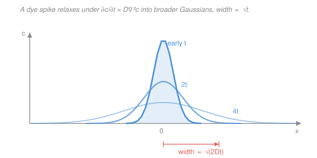

# Biophysics · Lesson 1.3: Diffusion and Fick's laws

> ⏱ ~15 min · Module 1: Scales, random walks, and diffusion · Builds on: [1.2 The random walk](01-02-random-walk.md), [`stat-mech`](../../stat-mech/syllabus.md) · Unlocks: [1.4 The Einstein relation](01-04-einstein-relation.md)

## Why this matters

A bacterium doesn't stir its cytoplasm — it lets molecules find each other by blundering around. Whether that works is a question of *scale*: diffusion is blindingly fast across a micron and hopelessly slow across a millimeter, and the whole architecture of cells (small, unstirred) versus neurons (long, with motors and pumps) follows from that one fact. In [1.2](01-02-random-walk.md) you watched one molecule random-walk and found its spread grows as $\sqrt{t}$. Now we zoom out: instead of tracking one walker, we ask how a *crowd* of them flows. Two equations — Fick's laws — package the entire random walk into a coefficient $D$ you can look up, and hand you diffusion times, membrane fluxes, and reaction rates for free.

## The idea

Picture a drop of dye in still water. No molecule "wants" to go anywhere — each just jitters at random. Yet the blob visibly spreads from where it's crowded toward where it's empty. Why? Pure counting. Where concentration is high, more walkers are available to wander left than there are on the left to wander right. The *net* traffic across any line is just "more came from the crowded side." That imbalance is a **flux**, and it points down the concentration gradient — not because anything pushes, but because that's where the empty seats are.

That's the entire content of **Fick's first law**: flux is proportional to how steep the concentration gradient is, with a proportionality constant $D$ that measures how fast the walkers jitter. And if you then insist that molecules aren't created or destroyed — whatever flows out of a slab must lower the concentration inside it — you get **Fick's second law**, the diffusion equation, which tells you how any concentration profile evolves in time. Its signature is the $\sqrt{t}$ spreading you already met: it *is* the crowd-level version of one walker's Gaussian.

## The formal version

**The diffusion coefficient.** Recall from [1.2](01-02-random-walk.md) that a 1D walker taking steps of length $b$ every time $\tau$ reaches a mean-square displacement $\langle x^2\rangle = Nb^2 = (t/\tau)\,b^2$. Define

$$\boxed{\;\langle x^2\rangle = 2Dt \quad\text{(1D)},\qquad D \equiv \frac{b^2}{2\tau}\;}$$

so $D$ (units $\mathrm{m^2/s}$, or the biophysicist's $\mu\mathrm{m^2/s}$) is just the step picture repackaged. *In words: $D$ is the area a molecule explores per unit time.* In three dimensions the three axes each contribute $2Dt$, so $\langle r^2\rangle = \langle x^2\rangle+\langle y^2\rangle+\langle z^2\rangle = 6Dt$ — the source of the estimate $t \sim L^2/6D$. Real numbers to anchor you: a small molecule in water $D \approx 10^3\ \mu\mathrm{m^2/s}$; a protein in cytoplasm $D \approx 10\text{–}100\ \mu\mathrm{m^2/s}$; a protein diffusing in a membrane $D \approx 1\ \mu\mathrm{m^2/s}$.

**Fick's first law.** The particle flux $\mathbf{J}$ (number crossing unit area per unit time) is

$$\mathbf{J} = -D\,\nabla c,$$

where $c(\mathbf{r},t)$ is the concentration (number per volume) and $\nabla c$ is its gradient. *In words: stuff drifts from crowded to empty, at a rate set by $D$ and the steepness of the gradient.* The minus sign says flux runs *down*hill in concentration. Nothing is pushing — this is the statistical drift of many independent random walkers, not a force.

**Fick's second law (the diffusion equation).** Molecules are conserved: the rate a box fills is minus the net flux out of it, $\partial c/\partial t = -\nabla\cdot\mathbf{J}$ (a continuity equation). Substitute Fick's first law:

$$\boxed{\;\frac{\partial c}{\partial t} = D\,\nabla^2 c\;}$$

*In words: concentration changes fastest where the profile is most sharply curved* ($\nabla^2 c$ measures curvature) — peaks sink, valleys fill. This is the **same PDE as heat conduction**; temperature and concentration obey identical mathematics. Its point-source solution in 1D is exactly the spreading Gaussian of [1.2](01-02-random-walk.md),

$$c(x,t) = \frac{N}{\sqrt{4\pi D t}}\,e^{-x^2/4Dt},$$

whose width $\sqrt{2Dt}$ grows as $\sqrt{t}$ — diffusion buys distance slowly.

**Steady state.** When nothing changes in time, $\partial c/\partial t = 0$, so the diffusion equation collapses to **Laplace's equation** $\nabla^2 c = 0$. In a slab this forces a *linear* profile (constant gradient, constant flux). Around a sphere of radius $a$ held at $c=0$ (a perfect absorber) sitting in a bath $c_\infty$, spherical symmetry gives

$$c(r) = c_\infty\!\left(1 - \frac{a}{r}\right),$$

a $1/r$ profile. The molecules it swallows per second, $I = 4\pi D a\, c_\infty$, is the **diffusion-limited absorption rate** — the ceiling on how fast any target can catch diffusing partners, which [1.4](01-04-einstein-relation.md) turns into the Smoluchowski reaction rate.

## Picture

## Worked examples

**Example 1 (diffusion time — the $L^2$ tyranny).** How long for a small molecule ($D \approx 10^3\ \mu\mathrm{m^2/s}$) to diffuse across a $1\ \mu\mathrm{m}$ bacterium versus a $1\ \mathrm{mm}$ gap? Use $t \sim L^2/6D$ (3D):

$$t_{\text{cell}} \sim \frac{(1\ \mu\mathrm{m})^2}{6\cdot 10^3\ \mu\mathrm{m^2/s}} \approx 1.7\times10^{-4}\ \mathrm{s} \approx 0.2\ \mathrm{ms},$$
$$t_{\text{mm}} \sim \frac{(10^3\ \mu\mathrm{m})^2}{6\cdot 10^3\ \mu\mathrm{m^2/s}} \approx 1.7\times10^{2}\ \mathrm{s} \approx 3\ \mathrm{min}.$$

Because $t \propto L^2$, multiplying the distance by $10^3$ multiplies the time by $10^6$. A bacterium can trust diffusion; a cell a millimeter across cannot — which is exactly why big cells stir, and why neurons pay ATP for motor-driven transport.

**Example 2 (Fick flux across a membrane).** A stagnant water layer of thickness $L = 10\ \mu\mathrm{m} = 10^{-5}\ \mathrm{m}$ separates a compartment at $c = 1\ \mathrm{mM}$ from one at $\approx 0$; the permeant has $D = 10^3\ \mu\mathrm{m^2/s} = 10^{-9}\ \mathrm{m^2/s}$. At steady state the profile is linear, so the gradient is just $\Delta c/L$ and

$$J = D\,\frac{\Delta c}{L} = 10^{-9}\ \frac{\mathrm{m^2}}{\mathrm{s}}\cdot\frac{1\ \mathrm{mol/m^3}}{10^{-5}\ \mathrm{m}} = 10^{-4}\ \frac{\mathrm{mol}}{\mathrm{m^2\,s}},$$

using $1\ \mathrm{mM} = 1\ \mathrm{mol/m^3}$. The quantity $P \equiv D/L = 10^{-4}\ \mathrm{m/s}$ is the **permeability**: flux $= P\,\Delta c$, the workhorse formula for transport across thin barriers.

## Watch out

- **You might think flux needs a force.** It doesn't. $\mathbf{J} = -D\nabla c$ comes from counting random walkers, not from anything pulling them downhill — there is no potential, no field. The "drift" is pure statistics: more walkers where there are more walkers to leave.
- **You might read $\nabla^2 c$ as slope.** It's *curvature*, the second derivative. A region with a steep but straight gradient (a slab at steady state) has $\nabla^2 c = 0$ and doesn't change in time, even though molecules are pouring through it. Only *curved* profiles evolve.
- **You might expect diffusion to cover distance at steady speed.** Never. Width grows as $\sqrt{t}$, so the effective "speed" $\sim\sqrt{D/t}$ keeps falling. Diffusion is fast up close and punishingly slow far away — the crux of the whole low-$Re$ world in [1.5](01-05-low-reynolds-number.md).

## One-liner

> Random walks in bulk obey $\mathbf{J} = -D\nabla c$ and $\partial_t c = D\nabla^2 c$; distance costs time as $L^2/D$, so life is diffusion-fast at a micron and diffusion-dead at a millimeter.

## Problems

**P1 (🟢)** A signaling protein has $D \approx 10\ \mu\mathrm{m^2/s}$. Using $t \sim L^2/6D$, estimate the time to diffuse across a $1\ \mu\mathrm{m}$ bacterium and down a $1\ \mathrm{mm}$ length. By what factor do the two times differ, and why is that factor not $10^3$?

**P2 (🟡)** Oxygen ($D \approx 2\times10^3\ \mu\mathrm{m^2/s}$ in water) crosses an unstirred layer of thickness $L = 20\ \mu\mathrm{m}$ with a concentration drop $\Delta c = 0.1\ \mathrm{mM}$ across it. Find the steady-state flux $J$ (in $\mathrm{mol\,m^{-2}\,s^{-1}}$) and the permeability $P$.

**P3 (🔴, optional)** A perfectly absorbing sphere of radius $a = 1\ \mu\mathrm{m}$ sits in a bath of a molecule at $c_\infty = 1\ \mu\mathrm{M}$ with $D = 500\ \mu\mathrm{m^2/s}$. (a) Verify $c(r) = c_\infty(1 - a/r)$ solves $\nabla^2 c = 0$ with $c(a)=0$, $c(\infty)=c_\infty$. (b) Show the total absorption rate is $I = 4\pi D a\,c_\infty$ and evaluate it in molecules per second. (Take $c_\infty = 1\ \mu\mathrm{M} \approx 6\times10^{2}\ \text{molecules}/\mu\mathrm{m^3}$.)

Solutions

**P1** With $D = 10\ \mu\mathrm{m^2/s}$:

$$t_{1\,\mu\mathrm{m}} \sim \frac{(1)^2}{6\cdot 10} \approx 1.7\times10^{-2}\ \mathrm{s} \approx 17\ \mathrm{ms},\qquad t_{1\,\mathrm{mm}} \sim \frac{(10^3)^2}{6\cdot 10} \approx 1.7\times10^{4}\ \mathrm{s} \approx 5\ \mathrm{hr}.$$

The ratio is $(10^3/1)^2 = 10^6$, not $10^3$, because diffusion time scales as $L^2$: tripling the exponent's base. *Check.* A slow protein takes hours to cross a millimeter — consistent with why axons use kinesin/dynein motors rather than waiting on diffusion. ✓

**P2** Convert: $D = 2\times10^3\ \mu\mathrm{m^2/s} = 2\times10^{-9}\ \mathrm{m^2/s}$; $L = 20\ \mu\mathrm{m} = 2\times10^{-5}\ \mathrm{m}$; $\Delta c = 0.1\ \mathrm{mM} = 0.1\ \mathrm{mol/m^3}$.

$$J = D\frac{\Delta c}{L} = 2\times10^{-9}\cdot\frac{0.1}{2\times10^{-5}} = 1\times10^{-5}\ \frac{\mathrm{mol}}{\mathrm{m^2\,s}},\qquad P = \frac{D}{L} = \frac{2\times10^{-9}}{2\times10^{-5}} = 10^{-4}\ \mathrm{m/s}.$$

*Check.* Units of $J$: $(\mathrm{m^2/s})(\mathrm{mol/m^3})/\mathrm{m} = \mathrm{mol\,m^{-2}s^{-1}}$ ✓; and indeed $J = P\Delta c = 10^{-4}\cdot 0.1 = 10^{-5}$ ✓.

**P3** (a) For a spherically symmetric profile, $\nabla^2 c = \dfrac{1}{r^2}\dfrac{d}{dr}\!\left(r^2\dfrac{dc}{dr}\right)$. Here $\dfrac{dc}{dr} = c_\infty\dfrac{a}{r^2}$, so $r^2\dfrac{dc}{dr} = c_\infty a$ (a constant), and its derivative is $0$: Laplace satisfied. Boundary checks: $c(a) = c_\infty(1 - a/a) = 0$ ✓ and $c(r\to\infty) \to c_\infty$ ✓.

(b) Flux inward at the surface is $J = -D\,\dfrac{dc}{dr}\big|_{r=a} = -D\,c_\infty\dfrac{a}{a^2} = -D\dfrac{c_\infty}{a}$ (negative = pointing inward, toward the sink). The magnitude times the surface area $4\pi a^2$ gives the absorption rate:

$$I = 4\pi a^2\cdot D\frac{c_\infty}{a} = 4\pi D a\, c_\infty.$$

Numerically, with $D = 500\ \mu\mathrm{m^2/s}$, $a = 1\ \mu\mathrm{m}$, $c_\infty \approx 6\times10^{2}\ \mu\mathrm{m^{-3}}$:

$$I = 4\pi(500)(1)(6\times10^{2}) \approx 3.8\times10^{6}\ \text{molecules/s}.$$

*Check.* Units: $(\mu\mathrm{m^2/s})(\mu\mathrm{m})(\mu\mathrm{m^{-3}}) = \mathrm{s^{-1}}$ ✓. This $4\pi D a c_\infty$ is the Smoluchowski diffusion-limited rate — the hard ceiling on how fast a receptor can capture ligand, which [1.4](01-04-einstein-relation.md) uses to bound reaction speeds. ✓

## Flashback

**From Lesson 1.2 (The random walk):** An unbiased 1D random walker takes $N = 10^4$ independent steps, each of length $b = 2\ \mathrm{nm}$. Find its mean displacement $\langle x\rangle$ and its root-mean-square displacement $\sqrt{\langle x^2\rangle}$. Then, if each step takes $\tau = 1\ \mu\mathrm{s}$, what diffusion coefficient does this walk correspond to?

Solution

Symmetry gives $\langle x\rangle = 0$ (left and right are equally likely). The spread comes from $\langle x^2\rangle = Nb^2$:

$$\sqrt{\langle x^2\rangle} = b\sqrt{N} = 2\ \mathrm{nm}\cdot\sqrt{10^4} = 2\ \mathrm{nm}\cdot 100 = 200\ \mathrm{nm}.$$

For the diffusion coefficient use $D = b^2/2\tau$:

$$D = \frac{(2\ \mathrm{nm})^2}{2(1\ \mu\mathrm{s})} = \frac{4\times10^{-6}\ \mu\mathrm{m^2}}{2\times10^{-6}\ \mathrm{s}} = 2\ \mu\mathrm{m^2/s}.$$

*Check.* The walker drifts nowhere on average but spreads $200\ \mathrm{nm}$ — one-third of a wavelength of green light — after $10^4$ steps; and $D \approx 2\ \mu\mathrm{m^2/s}$ lands in the membrane-protein range, sensible for $\mathrm{nm}$-scale steps at microsecond pace. ✓ Equivalently, over the total time $t = N\tau = 10^{-2}\ \mathrm{s}$, $\langle x^2\rangle = 2Dt = 2(2)(10^{-2}) = 0.04\ \mu\mathrm{m^2}$, and $\sqrt{0.04} = 0.2\ \mu\mathrm{m} = 200\ \mathrm{nm}$ — consistent. ✓

## Connections

- **Backward:** this is [1.2](01-02-random-walk.md)'s single-walker Gaussian promoted to a whole population — $\langle x^2\rangle = 2Dt$ is literally the random walk's $Nb^2$ rewritten with $D = b^2/2\tau$. The conservation step $\partial_t c = -\nabla\cdot\mathbf{J}$ is the counting/continuity logic from [`prob-stat-refresher`](../../prob-stat-refresher/syllabus.md).
- **Forward:** [1.4 The Einstein relation](01-04-einstein-relation.md) explains *what sets $D$* — linking it to drag via $D = k_BT/\gamma$ — and uses the absorbing-sphere rate $4\pi D a c_\infty$ as the Smoluchowski ceiling on reaction speed.
- **Sideways (PDEs):** $\partial_t c = D\nabla^2 c$ is the [`pdes`](../../pdes/syllabus.md) diffusion/heat equation, symbol-for-symbol. The separation-of-variables and Green's-function machinery there (the point-source Gaussian, steady-state Laplace solutions) is exactly what generates the profiles above — biology and heat conduction share one equation.
