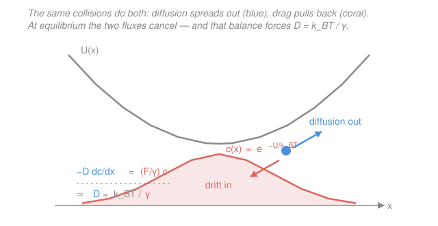

# Biophysics · Lesson 1.4: The Einstein relation

> ⏱ ~15 min · Module 1: Scales, random walks, and diffusion · Builds on: [1.3 Diffusion and Fick's laws](01-03-diffusion-ficks-laws.md), [`stat-mech` syllabus](../../stat-mech/syllabus.md) · Unlocks: [1.5 Life at low Reynolds number](01-05-low-reynolds-number.md)

## Why this matters

A protein jiggling in water and a protein being *dragged* through water look like two unrelated facts — one is random, one is a steady force. Einstein's 1905 insight was that they are the *same molecular collisions* seen twice. The water molecules that randomly kick a particle (giving it a diffusion coefficient $D$) are exactly the ones that resist it when it tries to move (giving it a drag $\gamma$). They cannot be tuned independently, and the link between them, $D = k_BT/\gamma$, is the simplest **fluctuation–dissipation theorem** — the deepest idea in this module. It also hands you a ruler: measure how fast something diffuses and you can read off its *size*, and compute the fastest any two molecules can possibly find each other.

## The idea

Picture a particle in a bowl-shaped potential — a bead in an optical trap, or a protein settling under gravity. Two things happen at once. **Thermal kicks** try to spread it out, pushing it up the walls of the bowl; this is diffusion, and it is stronger the larger $D$ is. **Drag** pulls it back down toward the bottom whenever it drifts; this is dissipation, stronger the larger $\gamma$ is. After a while the particle settles into a steady cloud — denser at the bottom, thinner up the walls — that neither spreads further nor collapses.

Here is the punchline. Statistical mechanics already *told us* what that steady cloud must look like: the Boltzmann distribution, $c(x) \propto e^{-U(x)/k_BT}$. So the spreading (set by $D$) and the settling (set by $\gamma$) are not free to disagree — they must conspire to reproduce exactly that Boltzmann cloud. Demanding it locks $D$ and $\gamma$ together. Vigorous jiggling and stiff drag are two faces of one coin: **the harder the fluid kicks you around, the harder it resists you when you push back.**

## The formal version

**Mobility and drag.** Push a particle with a steady force $F$ (in pN) through a fluid and, at the tiny scales of the cell, it does not accelerate — it reaches a terminal drift velocity almost instantly (why: [1.5](01-05-low-reynolds-number.md)). That velocity is proportional to the force:

$$v_{\text{drift}} = \mu F = \frac{F}{\gamma}, \qquad \mu \equiv \frac{1}{\gamma}.$$

*In words: $\gamma$ (the drag coefficient, units pN·s/nm or kg/s) says how many units of force you need per unit of speed; its inverse $\mu$, the mobility, says how much speed you get per unit force.*

**Balancing the two fluxes.** Put the particle in a potential $U(x)$, so it feels a force $F = -\,dU/dx$. Two currents of particles flow (both are number per area per time):

- Diffusive flux, down the concentration gradient (Fick's first law, [1.3](01-03-diffusion-ficks-laws.md)): $\; J_{\text{diff}} = -D\,\dfrac{dc}{dx}.$
- Drift flux, the cloud sliding at $v_{\text{drift}}$: $\; J_{\text{drift}} = v_{\text{drift}}\,c = \dfrac{F}{\gamma}\,c.$

At equilibrium **nothing net flows**, $J_{\text{diff}} + J_{\text{drift}} = 0$:

$$-D\,\frac{dc}{dx} + \frac{F}{\gamma}\,c = 0.$$

*In words: the outward diffusive leak exactly cancels the inward drift back down the well.*

**Impose Boltzmann (the stat-mech bridge).** Equilibrium *must* give the Boltzmann distribution $c(x) \propto e^{-U(x)/k_BT}$, where $k_BT \approx 4.1$ pN·nm is the thermal energy. Differentiate it:

$$\frac{dc}{dx} = c\cdot\left(-\frac{1}{k_BT}\frac{dU}{dx}\right) = \frac{F}{k_BT}\,c \qquad (\text{since } F=-dU/dx).$$

Substitute into the balance and cancel the common $F\,c$ (true for *any* $x$, so the brackets must vanish):

$$-D\,\frac{F}{k_BT}\,c + \frac{F}{\gamma}\,c = 0 \;\Longrightarrow\; \frac{D}{k_BT} = \frac{1}{\gamma} \;\Longrightarrow\; \boxed{\,D = \frac{k_BT}{\gamma} = \mu\, k_BT\,}$$

*In words: the diffusion constant is the thermal energy divided by the drag.* This is the **Einstein relation**. The force field was just scaffolding — it dropped out. What is left is a statement purely about the fluid: **fluctuation ($D$) and dissipation ($\gamma$) are locked together by $k_BT$.**

**Stokes drag and Stokes–Einstein.** For a sphere of radius $a$ moving slowly through a fluid of viscosity $\eta$, hydrodynamics (↔ [`fluid-dynamics` syllabus](../../fluid-dynamics/syllabus.md)) gives the drag

$$\gamma = 6\pi\eta a.$$

Feed it into Einstein and you get the **Stokes–Einstein relation**:

$$\boxed{\,D = \frac{k_BT}{6\pi\eta a}\,}$$

*In words: bigger particles and thicker fluids diffuse slower, and $D$ falls off only as $1/a$ — halving the size merely doubles the speed.* For water $\eta \approx 10^{-3}$ Pa·s. A protein with $a \approx 2$ nm then has $D \approx 100\ \mu\text{m}^2/\text{s}$ (computed below) — exactly the range measured in cells.

**The diffusion-limited (Smoluchowski) rate.** In [1.3](01-03-diffusion-ficks-laws.md) the steady flux onto a perfectly absorbing sphere of radius $a$ kept at bulk concentration $c_\infty$ was $I = 4\pi D a\,c_\infty$ (molecules per second). Read as a chemical rate, a target captures diffusing partners with a second-order rate constant

$$\boxed{\,k_{\text{diff}} = 4\pi D a\,}$$

*In words: this is the fastest an on-rate can ever be — the ceiling set purely by how quickly diffusion can deliver reactants to the target.* Plugging in cellular numbers gives $k_{\text{diff}} \approx 10^{8}\text{–}10^{9}\ \text{M}^{-1}\text{s}^{-1}$. An enzyme whose measured $k_{\text{cat}}/K_M$ approaches this is called *catalytically perfect* — it reacts on essentially every encounter (we meet these in Lesson 2.4 and Lesson 4.2, Michaelis–Menten).

## Picture

## Worked examples

**Example 1 (Stokes–Einstein — predict $D$ from size).** Estimate $D$ for a globular protein of radius $a = 2$ nm in water at $T = 300$ K.

Use $k_BT = 4.1\times10^{-21}$ J, $\eta = 1.0\times10^{-3}$ Pa·s, $a = 2\times10^{-9}$ m. First the drag:

$$\gamma = 6\pi\eta a = 6\pi(10^{-3})(2\times10^{-9}) = 3.8\times10^{-11}\ \text{kg/s}.$$

Then Einstein:

$$D = \frac{k_BT}{\gamma} = \frac{4.1\times10^{-21}}{3.8\times10^{-11}} = 1.1\times10^{-10}\ \text{m}^2/\text{s} = 110\ \mu\text{m}^2/\text{s}.$$

*Check.* Units: $\text{J}/(\text{kg/s}) = (\text{kg·m}^2\text{s}^{-2})/(\text{kg·s}^{-1}) = \text{m}^2/\text{s}$ ✓. Magnitude: measured $D$ for proteins like GFP or lysozyme is $\sim 80\text{–}120\ \mu\text{m}^2/\text{s}$ — spot on.

**Example 2 (the diffusion limit — how fast can two molecules meet?).** Estimate the diffusion-limited on-rate for a substrate finding an enzyme, taking a relative diffusion coefficient $D \approx 1\times10^{-10}$ m$^2$/s and an encounter radius $a \approx 5$ nm.

$$k_{\text{diff}} = 4\pi D a = 4\pi(10^{-10})(5\times10^{-9}) = 6.3\times10^{-18}\ \text{m}^3/\text{s} \quad(\text{per molecule}).$$

Convert to molar units by multiplying by Avogadro's number $N_A = 6.0\times10^{23}\ \text{mol}^{-1}$ and $10^{3}$ L/m$^3$:

$$k_{\text{diff}} = 6.3\times10^{-18}\times 6.0\times10^{23}\times 10^{3} \approx 4\times10^{9}\ \text{M}^{-1}\text{s}^{-1}.$$

*Check.* Acetylcholinesterase runs at $k_{\text{cat}}/K_M \approx 1.6\times10^{8}\ \text{M}^{-1}\text{s}^{-1}$ and triosephosphate isomerase at $\sim 4\times10^{8}$ — both within a factor of $\sim$10 of this ceiling, which is why they are called "perfect." Nothing beats $\sim10^{9}\ \text{M}^{-1}\text{s}^{-1}$ because diffusion can't deliver reactants any faster. ✓

## Watch out

- **You might think $D$ and $\gamma$ are separate material properties you'd measure independently.** They are not — that is the whole content of the Einstein relation. Fix the temperature and the fluid, and knowing one *determines* the other. This is the "no free lunch" of thermal physics: a fluid that jostles you more also drags on you more, in lockstep through $k_BT$.
- **You might use diameter instead of radius in $6\pi\eta a$.** $a$ is the **radius**. Using the diameter halves your $D$. (And $a$ is the *hydrodynamic* radius — a protein drags a shell of water, so it's a bit larger than the dry molecular radius.)
- **You might expect the diffusion limit $4\pi D a$ to grow with the target's size the way area does ($a^2$).** It grows only as $a^1$ — a bigger target is easier to hit, but it also depletes the nearby supply, and the two effects leave a linear law. Doubling a receptor's radius only doubles its capture rate.

## One-liner

> The kicks that make a particle diffuse are the collisions that make it feel drag, so $D$ and $\gamma$ can't be independent: $D = k_BT/\gamma$ — and for a sphere that's $D = k_BT/6\pi\eta a$, the ruler that turns a diffusion measurement into a size.

## Problems

**P1 (🟢)** A small metabolite is modeled as a sphere of hydrodynamic radius $a = 0.5$ nm in water ($\eta = 10^{-3}$ Pa·s, $k_BT = 4.1\times10^{-21}$ J at 300 K). Estimate its diffusion coefficient $D$ in $\mu\text{m}^2/\text{s}$.

**P2 (🟡)** Single-particle tracking gives a diffusion coefficient $D = 25\ \mu\text{m}^2/\text{s}$ for a labeled complex in water. (a) Find its drag coefficient $\gamma$. (b) Infer its hydrodynamic radius $a$. Is the size reasonable for a molecular assembly?

**P3 (🔴, optional)** A signaling ligand ($D \approx 3\times10^{-10}$ m$^2$/s) binds a cell-surface receptor of radius $a \approx 3$ nm. (a) Compute the diffusion-limited on-rate $k_{\text{diff}} = 4\pi D a$ in $\text{M}^{-1}\text{s}^{-1}$. (b) The measured on-rate is $k_{\text{on}} \approx 10^{7}\ \text{M}^{-1}\text{s}^{-1}$. What fraction of encounters lead to binding, and what does that tell you about the reaction?

Solutions

**P1** Stokes–Einstein with $a = 0.5\times10^{-9}$ m:

$$\gamma = 6\pi\eta a = 6\pi(10^{-3})(0.5\times10^{-9}) = 9.4\times10^{-12}\ \text{kg/s},$$
$$D = \frac{k_BT}{\gamma} = \frac{4.1\times10^{-21}}{9.4\times10^{-12}} = 4.4\times10^{-10}\ \text{m}^2/\text{s} = 440\ \mu\text{m}^2/\text{s}.$$

*Check.* Four times the 2 nm protein of Example 1 (110 → 440), because $D \propto 1/a$ and the radius is 4× smaller. ✓ Small molecules in water sit at a few hundred $\mu\text{m}^2/\text{s}$ (glucose is $\sim 600$), matching. ✓

**P2** (a) Einstein relation inverted, with $D = 25\ \mu\text{m}^2/\text{s} = 2.5\times10^{-11}$ m$^2$/s:

$$\gamma = \frac{k_BT}{D} = \frac{4.1\times10^{-21}}{2.5\times10^{-11}} = 1.6\times10^{-10}\ \text{kg/s}.$$

(b) From $\gamma = 6\pi\eta a$:

$$a = \frac{\gamma}{6\pi\eta} = \frac{1.6\times10^{-10}}{6\pi(10^{-3})} = 8.7\times10^{-9}\ \text{m} \approx 8.7\ \text{nm}.$$

*Check.* Units of $\gamma$: $\text{J}\cdot(\text{m}^2/\text{s})^{-1} = \text{kg/s}$ ✓. An $\sim$9 nm radius is reasonable for a multi-protein complex or a small virus capsid — bigger than a single protein ($\sim$2 nm), consistent with its slower $D$. ✓

**P3** (a) With $D = 3\times10^{-10}$ m$^2$/s and $a = 3\times10^{-9}$ m:

$$k_{\text{diff}} = 4\pi D a = 4\pi(3\times10^{-10})(3\times10^{-9}) = 1.1\times10^{-17}\ \text{m}^3/\text{s}.$$

Convert: $\times N_A \times 10^3\ \text{L/m}^3 = 1.1\times10^{-17}\times 6.0\times10^{23}\times 10^{3} \approx 6.8\times10^{9}\ \text{M}^{-1}\text{s}^{-1}.$

(b) Fraction that bind $= k_{\text{on}}/k_{\text{diff}} = 10^{7}/6.8\times10^{9} \approx 1.5\times10^{-3}$, about **1 in 700 encounters**.

*Check.* $k_{\text{on}} < k_{\text{diff}}$, as it must be — you can't bind faster than you arrive ✓. Because only $\sim$0.1% of collisions stick, this reaction is **reaction-limited**, not diffusion-limited: there's an orientational or energetic barrier at contact, so speeding up diffusion wouldn't help. Contrast the "perfect" enzymes of Example 2, which stick on nearly every hit. ✓

## Flashback

**From Lesson 1.3 (Diffusion and Fick's laws):** A protein has $D = 100\ \mu\text{m}^2/\text{s}$. Using the diffusion time estimate $t \sim L^2/(2D)$ in one dimension, how long does it take to diffuse across a $1\ \mu\text{m}$ bacterium? Across a $100\ \mu\text{m}$ animal cell? (Fresh variant — different $D$ and lengths than before.)

Solution

Rearrange $\langle x^2\rangle = 2Dt$ to $t \sim L^2/(2D)$, with $D = 100\ \mu\text{m}^2/\text{s}$.

Bacterium, $L = 1\ \mu\text{m}$:
$$t \sim \frac{(1)^2}{2(100)} = 5\times10^{-3}\ \text{s} = 5\ \text{ms}.$$

Animal cell, $L = 100\ \mu\text{m}$:
$$t \sim \frac{(100)^2}{2(100)} = 50\ \text{s}.$$

*Check.* The time scales as $L^2$: a 100× larger cell takes $100^2 = 10^4$× longer (5 ms → 50 s) ✓. This is exactly why bacteria can run on diffusion alone but large cells need active transport — the quadratic penalty is brutal. It sets up [1.5](01-05-low-reynolds-number.md). ✓

## Connections

- **Backward:** the derivation leans entirely on the Boltzmann distribution $c \propto e^{-U/k_BT}$ from [`stat-mech`](../../stat-mech/syllabus.md) and on Fick's first law $J = -D\,dc/dx$ from [1.3](01-03-diffusion-ficks-laws.md). The Einstein relation is what you get when you insist those two descriptions of equilibrium agree.
- **Forward:** [1.5 Life at low Reynolds number](01-05-low-reynolds-number.md) uses the same Stokes drag $\gamma = 6\pi\eta a$ to show why microorganisms coast for less than an atom's width; and $k_{\text{diff}} = 4\pi D a$ becomes the ceiling on catalytic efficiency in Lesson 4.2 (Michaelis–Menten).
- **Sideways:** $D = k_BT/\gamma$ is the prototype **fluctuation–dissipation theorem** — noise strength set by dissipation and temperature — a template that recurs throughout [`stat-mech`](../../stat-mech/syllabus.md) (Johnson–Nyquist noise, linear response). And the drag law $\gamma = 6\pi\eta a$ is a result of Stokes flow from [`fluid-dynamics`](../../fluid-dynamics/syllabus.md), the low-Reynolds-number limit of the Navier–Stokes equations.
