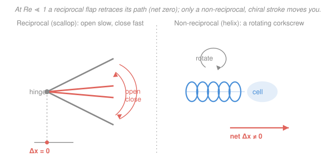

# Biophysics · Lesson 1.5: Life at low Reynolds number

> ⏱ ~15 min · Module 1: Scales, random walks, and diffusion · Builds on: [1.4 The Einstein relation](01-04-einstein-relation.md), [`fluid-dynamics` syllabus](../../fluid-dynamics/syllabus.md) · Unlocks: [2.1 Free energy and the cell's currency](02-01-free-energy-cell-currency.md)

## Why this matters

A tuna coasts. A bacterium cannot. Shrink a swimmer down to a micron and the physics of moving through water inverts: inertia — the property that lets *you* glide after a push — becomes so utterly negligible that a bacterium which stops beating its flagellum stops **dead**, in a distance smaller than an atom. This single fact, captured by one dimensionless number, reshapes how everything in the cell moves, mixes, and swims. It's why bacteria corkscrew instead of paddle, why they can't stir their food, and why the intuitions you built swimming in a pool are exactly wrong at molecular scale. It is also, literally, the [`fluid-dynamics`](../../fluid-dynamics/syllabus.md) creeping-flow lesson wearing a biology hat.

## The idea

Every object moving through a fluid feels two kinds of force: **inertial** (the fluid's reluctance to be shoved aside and set moving, $\sim \rho v^2$) and **viscous** (the fluid's internal friction as layers slide past each other, $\sim \eta v/L$). Their ratio is the **Reynolds number** $Re$. For you in a pool, inertia wins by a factor of a million — you push off and glide. For a bacterium, viscosity wins by a factor of ten thousand: water feels like thick honey, and there is no glide at all.

Two consequences follow, and they are strange. First, **no coasting**: with inertia negligible, motion stops the instant the driving force does. Second — the deep one — the equations of such flow are **time-reversible**, so any stroke that just runs *backward* to where it started produces **zero net motion**. Flap a paddle out and back and you end up exactly where you began. This is **Purcell's scallop theorem**, and it's why a real bacterium can't swim like a fish: it must use a stroke that looks *different* run in reverse — a rotating helix, or a wave traveling down a filament. The molecular world swims by corkscrewing, not paddling.

## The formal version

**The Reynolds number.** For an object of size $L$ (m) moving at speed $v$ (m/s) through a fluid of density $\rho$ (kg/m³) and dynamic viscosity $\eta$ (Pa·s),

$$Re \;=\; \frac{\rho v L}{\eta} \;=\; \frac{v L}{\nu} \;=\; \frac{\text{inertial forces}}{\text{viscous forces}}, \qquad \nu \equiv \frac{\eta}{\rho}.$$

Here $\nu$ (m²/s) is the **kinematic viscosity**; for water $\nu \approx 10^{-6}\ \mathrm{m^2/s}$. *In words: $Re$ is the tug-of-war between inertia and friction — big $Re$ means inertia rules (turbulent, gliding), small $Re$ means friction rules (smooth, sticky, no glide).*

**Life at $Re \ll 1$ (Stokes / creeping flow).** When $Re \ll 1$ the inertial term in the Navier–Stokes equations drops out and you are left with the linear **Stokes equations** $\eta\nabla^2 \mathbf{v} = \nabla p$, $\nabla\cdot\mathbf{v}=0$ — no time derivative, no $v^2$. *In words: the flow has no memory and no momentum; it is set entirely by the forces acting right now.* Two things follow:

1. **No coasting.** With inertia gone, Newton's law for a body of mass $m$ coasting against Stokes drag $F=-\gamma v$ (drag coefficient $\gamma = 6\pi\eta a$ for a sphere of radius $a$, from [1.4](01-04-einstein-relation.md)) is $m\dot v = -\gamma v$, giving $v(t)=v_0 e^{-t/\tau}$ with $\tau = m/\gamma$. The total glide distance is
$$d = \int_0^\infty v\,dt = v_0\tau = \frac{v_0 m}{\gamma}.$$
*In words: cut the motor and you slide only $v_0\tau$ before friction eats all your speed — and for a bacterium $\tau \sim 10^{-7}$ s, so $d$ is sub-atomic.*

2. **Kinematic reversibility → the scallop theorem.** Because the Stokes equations are linear and time-independent, reversing the boundary motion reverses the entire flow exactly. So a **reciprocal** stroke — one that runs through a sequence of shapes and then back through the *same* sequence in reverse — produces **zero net displacement**, no matter how fast or slow each phase is. *In words: if your swimming stroke looks the same played backward as forward, you go nowhere.* A scallop with a single hinge can only open and close: that's reciprocal, so it can't swim at low $Re$. You need a **non-reciprocal** stroke: a rotating helical flagellum (chiral — a corkscrew is not its own mirror-in-reverse) or a bending wave sent down a cilium/flagellum.

**Mixing is by diffusion, not stirring.** The competition between carrying a molecule along ("advection") and letting it diffuse is the **Péclet number** $Pe = vL/D$, with $D$ the diffusion coefficient (m²/s) from [1.3](01-03-diffusion-ficks-laws.md). *In words: $Pe \ll 1$ means diffusion outruns any stirring you could do — a bacterium can't mix its surroundings, it must wait for molecules to arrive.* (This ties Module 1's whole diffusion story to swimming: at small scale, transport *is* diffusion.)

## Picture

## Worked examples

**Example 1 (the anchor — $Re$ for a bacterium).** *E. coli* swims at $v \approx 30\ \mu\mathrm{m/s} = 3\times10^{-5}\ \mathrm{m/s}$, with body size $L \approx 1\ \mu\mathrm{m} = 10^{-6}\ \mathrm{m}$, in water ($\nu \approx 10^{-6}\ \mathrm{m^2/s}$):

$$Re = \frac{vL}{\nu} = \frac{(3\times10^{-5})(10^{-6})}{10^{-6}} = 3\times10^{-5}.$$

So inertia is about $10^5$ times weaker than viscous drag. *In words: to the bacterium, water is thick honey.* Contrast a swimming human ($v\sim1$ m/s, $L\sim1$ m): $Re\sim10^6$ — six orders of magnitude the other way. Same water, opposite world.

**Example 2 (why a reciprocal stroke gets nowhere).** Imagine a "swimmer" that is a paddle on a single hinge: it opens to angle $\theta_{\max}$, then closes back to $\theta_{\min}$. Its configuration is the single number $\theta$. Over one cycle $\theta$ goes $\theta_{\min}\to\theta_{\max}\to\theta_{\min}$ — it traces a path in configuration space and then *retraces it backward*. Because Stokes flow is reversible, whatever displacement the opening phase produced, the closing phase produces exactly its negative: net $\Delta x = 0$. Crucially this is **independent of speed** — opening slowly and closing fast changes the forces at every instant but not the *geometry* of the path, and only the geometry survives (the equations have no clock). To break the symmetry you need at least *two* out-of-phase degrees of freedom, or a continuously advancing shape like a rotating helix. That is the scallop theorem, and it is why microorganisms never paddle.

## Watch out

- **You might think "just flap faster/harder."** Speed can't rescue a reciprocal stroke — the scallop theorem is about the *path of shapes*, not the rate. A fast slam-shut and slow re-open still nets zero, because Stokes flow carries no memory of speed. What breaks the symmetry is *non-reciprocity* (asymmetry in the sequence of shapes), not power.
- **You might think low $Re$ means "slow."** It doesn't — it's a *ratio* of forces, not a speed. A tiny thing moving fast can still be low-$Re$ (a bacterium at $30\ \mu$m/s is), because $L$ is minuscule. What matters is $vL/\nu$, all three together.
- **You might picture drag as $\propto v^2$ (air resistance on a car).** That's the *high*-$Re$ inertial drag. At low $Re$ drag is **linear**, $F=\gamma v$ (Stokes) — the regime where the Einstein relation $D=k_BT/\gamma$ of [1.4](01-04-einstein-relation.md) lives.

## One-liner

> At $Re\ll1$ inertia vanishes: there is no coasting, and any stroke you can run backward gets you nowhere — so life at molecular scale must corkscrew, not paddle.

## Problems

**P1 (🟢)** A human sperm cell swims at $v \approx 200\ \mu\mathrm{m/s}$ with flagellar length $L \approx 50\ \mu\mathrm{m}$ in water ($\nu \approx 10^{-6}\ \mathrm{m^2/s}$). Compute its Reynolds number. Then do the same for a tuna ($v\approx 5$ m/s, $L\approx1$ m). What do the two numbers tell you about how each must move? *(This is the $Re$ estimate of Boss problem 1, for two other swimmers.)*

**P2 (🟡)** Estimate the coasting (glide) distance of *E. coli* after it stops swimming. Model it as a sphere of radius $a=1\ \mu\mathrm{m}$ and density $\rho \approx 10^{3}\ \mathrm{kg/m^3}$ (water), initial speed $v_0=30\ \mu\mathrm{m/s}$, in water ($\eta = 10^{-3}\ \mathrm{Pa\cdot s}$). Use $\gamma=6\pi\eta a$, $\tau=m/\gamma$, and $d=v_0\tau$. Compare your answer to the size of an atom ($\sim 0.1$ nm).

**P3 (🔴, optional)** A bacterium ($v=30\ \mu\mathrm{m/s}$, $L=1\ \mu\mathrm{m}$) "wants" to bring a nutrient molecule ($D\approx 500\ \mu\mathrm{m^2/s}$) to its surface faster by swimming through the fluid to stir it up. Compute the Péclet number $Pe=vL/D$ and decide: does swimming help it gather food, or is it stuck waiting for diffusion? Connect your answer to Module 1's picture of transport.

Solutions

**P1** Sperm cell: $Re = vL/\nu = (2\times10^{-4})(5\times10^{-5})/10^{-6} = (10^{-8})/10^{-6} = 10^{-2} = 0.01.$ Tuna: $Re = (5)(1)/10^{-6} = 5\times10^{6}.$ The sperm, at $Re\approx0.01\ll1$, lives in the viscous world — no coasting, and it swims by sending bending **waves** down its flagellum (a non-reciprocal stroke), not by paddling. The tuna, at $Re\sim10^{6}$, is all inertia: it accelerates, glides, and coasts between thrusts. Even the largest, fastest microswimmer is still deep in the low-$Re$ regime.

*Check.* Units: $(\mathrm{m/s})(\mathrm{m})/(\mathrm{m^2/s})$ is dimensionless ✓. The sperm number $0.01$ sits between *E. coli* ($3\times10^{-5}$) and macroscopic life, as it should for the biggest cellular swimmer — and it's still $\ll1$, forbidding a reciprocal stroke. ✓

**P2** Mass of the sphere: $m=\tfrac43\pi a^3\rho = \tfrac43\pi(10^{-6})^3(10^{3}) \approx 4.2\times10^{-15}\ \mathrm{kg}.$ Drag coefficient: $\gamma=6\pi\eta a = 6\pi(10^{-3})(10^{-6}) \approx 1.9\times10^{-8}\ \mathrm{kg/s}.$ Relaxation time:
$$\tau = \frac{m}{\gamma} = \frac{4.2\times10^{-15}}{1.9\times10^{-8}} \approx 2.2\times10^{-7}\ \mathrm{s}.$$
Glide distance:
$$d = v_0\tau = (3\times10^{-5})(2.2\times10^{-7}) \approx 6.7\times10^{-12}\ \mathrm{m} \approx 7\ \mathrm{pm}.$$
That is about $0.07$ Å — roughly a *tenth* the diameter of a hydrogen atom. The bacterium stops effectively instantaneously.

*Check.* Units of $d$: $(\mathrm{m/s})(\mathrm{s})=\mathrm{m}$ ✓. Closed form $d=v_0(2/9)(\rho/\eta)a^2$ gives the same $\sim7$ pm ✓. This is Purcell's famous result — the reason "no coasting" is not an exaggeration but a sub-atomic fact. ✓

**P3** $Pe = vL/D = (30\ \mu\mathrm{m/s})(1\ \mu\mathrm{m})/(500\ \mu\mathrm{m^2/s}) = 30/500 = 0.06.$ Since $Pe\ll1$, diffusion transports the nutrient far faster than the bacterium's swimming can carry (stir) it. Swimming does **not** meaningfully stir food toward the cell — a bacterium can't mix its surroundings; diffusion already delivers molecules faster than it could. (Swimming *is* useful, but for **relocating** to a richer patch, not for stirring — that's the logic of chemotaxis.) This is Module 1's message from the swimmer's side: at micron scale, transport is diffusion.

*Check.* $Pe$ is dimensionless: $(\mu\mathrm{m/s})(\mu\mathrm{m})/(\mu\mathrm{m^2/s})$ ✓. A small molecule's $D\sim500\ \mu\mathrm{m^2/s}$ is realistic (glucose in water $\approx 600$) and gives $Pe\sim0.1$, the known result that bacterial feeding is diffusion-limited, not stirring-limited. ✓

## Flashback

**From Lesson 1.4 (The Einstein relation):** Use the Stokes–Einstein relation $D = k_BT/(6\pi\eta a)$ to estimate the diffusion coefficient of a small globular protein of radius $a=2$ nm in water at room temperature. Take $k_BT = 4.1\ \mathrm{pN\cdot nm} = 4.1\times10^{-21}\ \mathrm{J}$ and $\eta = 10^{-3}\ \mathrm{Pa\cdot s}$. Does your answer land near the measured $\sim 100\ \mu\mathrm{m^2/s}$?

Solution

Drag: $6\pi\eta a = 6\pi(10^{-3})(2\times10^{-9}) \approx 3.8\times10^{-11}\ \mathrm{kg/s}.$ Then
$$D = \frac{k_BT}{6\pi\eta a} = \frac{4.1\times10^{-21}}{3.8\times10^{-11}} \approx 1.1\times10^{-10}\ \mathrm{m^2/s} = 110\ \mu\mathrm{m^2/s}.$$

*Check.* Units: $\mathrm{J}/(\mathrm{kg/s}) = (\mathrm{kg\,m^2/s^2})/(\mathrm{kg/s}) = \mathrm{m^2/s}$ ✓. Converting, $1.1\times10^{-10}\ \mathrm{m^2/s}\times10^{12} = 110\ \mu\mathrm{m^2/s}$ — right on top of the measured value for a small protein, and the same $\gamma=6\pi\eta a$ that set the bacterium's coasting time in P2. ✓

## Connections

- **Backward:** the drag law $F=\gamma v$ with $\gamma=6\pi\eta a$ and the relation $D=k_BT/\gamma$ come straight from [1.4](01-04-einstein-relation.md); the Péclet number pits swimming against the diffusion of [1.3](01-03-diffusion-ficks-laws.md). Low-$Re$ life is where the whole Module 1 toolkit — random walks, $D$, Stokes drag — converges.
- **Forward:** [2.1](02-01-free-energy-cell-currency.md) turns to the *energy* budget of the cell — where the ATP that drives a flagellar motor comes from — opening Module 2's free-energy story. The motor itself returns in [`4.3`](04-03-molecular-motors-ratchet.md), a machine that must beat this same viscous, noise-dominated world.
- **Sideways (fluid dynamics):** this *is* the Stokes-flow / creeping-flow lesson of [`fluid-dynamics`](../../fluid-dynamics/syllabus.md) — the scallop theorem is a statement about the time-reversal symmetry of the linear Stokes equations, the microscopic cousin of the time-reversal arguments you meet throughout mechanics and E&M.
