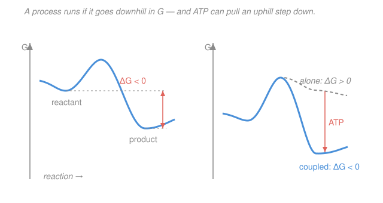

# Biophysics · Lesson 2.1: Free energy and the cell's currency

> ⏱ ~15 min · Module 2: Free energy and the Boltzmann distribution in biology · Builds on: [1.5 Life at low Reynolds number](01-05-low-reynolds-number.md), [`stat-mech` syllabus](../../stat-mech/syllabus.md) · Unlocks: [2.2 The Boltzmann distribution and two-state systems](02-02-boltzmann-two-state.md)

## Why this matters

Every question a cell faces — will this protein fold, will this ligand bind, will this pump push an ion the wrong way — is the same question in disguise: *which direction does this process go, and how hard is it to force the other way?* Thermodynamics answers it with one number, the change in **free energy** $\Delta G$. Negative means "runs on its own," positive means "you'll have to pay." And the cell's payment is almost always the same coin: the roughly $20\,k_BT$ released when one ATP molecule is hydrolyzed. This lesson turns $\Delta G$ into a tool you can actually compute — and shows why ATP is the universal currency that drives biology uphill.

## The idea

Drop a ball and it rolls downhill; it never spontaneously rolls up. "Downhill" for a *molecular* process isn't gravity — it's **free energy** $G$, and nature minimizes it at constant temperature and pressure. But $G$ is a tug-of-war between two things the ball never worries about:

- **Enthalpy** $H$ — the energy stored in bonds and interactions. Systems like to make strong bonds, lowering $H$.
- **Entropy** $S$ — the number of ways to arrange things, i.e. disorder. Systems like more arrangements, raising $S$.

The combination is $G = H - TS$: enthalpy minus temperature times entropy. Because of the minus sign, *raising* entropy *lowers* $G$ — so a process can run even while it costs energy (uphill in $H$), as long as it buys enough disorder. Temperature $T$ is the exchange rate between the two: hot systems weight entropy heavily, cold systems weight bonds. **In words: nature will pay enthalpy to gain enough entropy, or order things up if the energy payoff is big enough — whichever lowers $G$.**

Here's the biology twist that trips up newcomers: the entropy that matters is not just the molecule's own. When a hydrophobic protein folds or two molecules bind, the disorder that increases is often the **water's** — releasing trapped, over-ordered water molecules is a huge entropy gain for the surroundings. That water-driven push is the hydrophobic effect ([3.4](03-04-self-assembly-hydrophobic.md)), and it is one of the strongest forces in the cell. Always ask: whose entropy?

## The formal version

**Gibbs free energy.** At constant temperature $T$ and pressure $P$,

$$G = H - TS, \qquad \Delta G = \Delta H - T\,\Delta S.$$

A process is **spontaneous** (runs forward on its own) exactly when it lowers $G$:

$$\Delta G < 0 \;\text{spontaneous}, \qquad \Delta G = 0 \;\text{equilibrium}, \qquad \Delta G > 0 \;\text{needs energy input.}$$

*In words: compute the change in $G$; a negative sign is nature's green light.* This is the macroscopic face of the Boltzmann statistics you built in `stat-mech` — $G$ is (up to a sign and a log) the free energy $-k_BT\ln Z$ of a system in contact with a heat and particle bath.

**Chemical potential.** How much does $G$ change when you add *one more* molecule of species with concentration $c$? That derivative is the **chemical potential**

$$\mu = \frac{\partial G}{\partial N} = \mu^\circ + k_BT\ln\frac{c}{c^\circ},$$

where $\mu^\circ$ is the standard value at reference concentration $c^\circ$ (usually 1 M), and $N$ is the number of molecules. *In words: $\mu$ is the free-energy price of one more molecule; it rises with concentration.* The consequence is the engine of the whole course: **molecules flow from high $\mu$ to low $\mu$** — from concentrated to dilute. That is diffusion ([1.3](01-03-diffusion-ficks-laws.md)) and membrane transport, seen through the lens of free energy.

**Reactions and the reaction quotient.** For a reaction, the driving force is

$$\Delta G = \Delta G^\circ + k_BT\ln Q,$$

where $\Delta G^\circ$ is the standard free-energy change and $Q$ is the **reaction quotient** — products over reactants, each concentration divided by $c^\circ$. For $A \to B$, $Q = (c_B/c^\circ)/(c_A/c^\circ)$. *In words: the standard number $\Delta G^\circ$ sets the baseline, and the log term corrects for how far the actual concentrations sit from 1 M.* At equilibrium the flow stops, $\Delta G = 0$ and $Q = K_{\text{eq}}$, giving the bridge to the equilibrium constant:

$$\boxed{\;\Delta G^\circ = -k_BT\ln K_{\text{eq}}\;}$$

*In words: a reaction's standard free energy is just the log of how lopsided its equilibrium is.* This is the exact same statistical-mechanics identity that will hand you the dissociation constant $K_d$ for binding in [2.3](02-03-ligand-binding-occupancy.md).

**Units, once and for all.** Per molecule, $k_BT \approx 4.1\ \text{pN·nm} \approx 4.1\times10^{-21}$ J at $T\approx 300$ K. Multiplied by Avogadro's number, that is $RT \approx 2.5$ kJ/mol $\approx 0.6$ kcal/mol. So the conversion you will use all lesson is

$$1\,k_BT \;\longleftrightarrow\; 2.5\ \text{kJ/mol} \;\longleftrightarrow\; 0.6\ \text{kcal/mol}.$$

## Picture

## Worked examples

**Example 1 (ATP's real driving force — $\Delta G$ from $\Delta G^\circ$ and concentrations).** ATP hydrolysis, $\mathrm{ATP} \to \mathrm{ADP} + \mathrm{P_i}$, has $\Delta G^\circ \approx -30.5$ kJ/mol. That is the *standard* value (all species at 1 M) — but the cell is nowhere near standard. Typical cellular concentrations: $[\mathrm{ATP}]\approx 3$ mM, $[\mathrm{ADP}]\approx 0.1$ mM, $[\mathrm{P_i}]\approx 3$ mM. The reaction quotient (concentrations in molar, $c^\circ = 1$ M) is

$$Q = \frac{[\mathrm{ADP}][\mathrm{P_i}]}{[\mathrm{ATP}]} = \frac{(1\times10^{-4})(3\times10^{-3})}{3\times10^{-3}} = 1\times10^{-4}.$$

Then

$$\Delta G = \Delta G^\circ + RT\ln Q = -30.5 + (2.5)\ln(10^{-4}) = -30.5 + (2.5)(-9.2) = -53.5\ \text{kJ/mol}.$$

In the ruler of the cell, $-53.5/2.5 \approx -21\,k_BT$ — the "$\approx -20\,k_BT$ per ATP" you first met in [1.1](01-01-kbt-ruler-scales.md). The cell holds ATP far above its equilibrium, and that displacement makes hydrolysis *more* favorable than the standard number suggests. This is the coin every pump, motor, and synthesis reaction spends.

**Example 2 (coupling — buying an uphill reaction, and its $K_{\text{eq}}$).** The first step of using glucose is phosphorylating it: $\text{glucose} + \mathrm{P_i} \to \text{glucose-6-phosphate}$, with $\Delta G^\circ \approx +13.8$ kJ/mol. Uphill. Its equilibrium constant is

$$K_{\text{eq}} = e^{-\Delta G^\circ/RT} = e^{-13.8/2.5} = e^{-5.5} \approx 4\times10^{-3},$$

so left to itself almost no product forms. Now the enzyme hexokinase **couples** it to ATP hydrolysis, running the sum

$$\text{glucose} + \mathrm{ATP} \to \text{glucose-6-phosphate} + \mathrm{ADP}, \qquad \Delta G^\circ = +13.8 + (-30.5) = -16.7\ \text{kJ/mol}.$$

Now $K_{\text{eq}} = e^{+16.7/2.5} = e^{6.7} \approx 8\times10^{2}$ — the equilibrium has swung by a factor of $\sim2\times10^5$, from "won't happen" to "goes essentially to completion." **Coupling works because free energies add: bolt a big negative $\Delta G$ onto a small positive one and the sum runs downhill.** The catch (see Watch out) is that the enzyme must *physically* link them through a shared intermediate — you can't couple two reactions just by writing them on the same line.

## Watch out

- **You might think $\Delta G^\circ$ decides direction. It doesn't — $\Delta G$ does.** The standard value assumes every species at 1 M, a condition no cell ever meets. In Example 1 the concentrations pushed $\Delta G$ far below $\Delta G^\circ$; in a problem below, a *positive* $\Delta G^\circ$ still runs forward once concentrations are set. Always add the $k_BT\ln Q$ term before calling a direction.
- **You might count only the system's entropy.** Binding and folding often look like they *lower* entropy (two molecules become one, a floppy chain orders up) yet still run — because the **surroundings'** entropy rises more, usually by releasing ordered water (the hydrophobic effect, [3.4](03-04-self-assembly-hydrophobic.md)). $\Delta G$ already bundles both; that is why it, not $\Delta S_{\text{system}}$ alone, is the arbiter.
- **You might mix per-molecule and per-mole.** $\Delta G = \Delta G^\circ + k_BT\ln Q$ (per molecule, energies in $k_BT$ or pN·nm) and $\Delta G = \Delta G^\circ + RT\ln Q$ (per mole, energies in kJ/mol) are the *same equation* in different currencies. Pick one and don't let $k_BT$ and $RT$ appear in the same line.
- **You might think writing two reactions together couples them.** Coupling requires a real mechanism — a shared enzyme and intermediate that carries the energy across. On paper the sum is always allowed; in the cell it happens only where a machine makes it happen.

## One-liner

> Nature minimizes $G = H - TS$; a process runs when $\Delta G = \Delta G^\circ + k_BT\ln Q < 0$, and the cell spends ATP's $\approx 20\,k_BT$ to force the ones that won't.

## Problems

**P1 (🟢)** A reaction $A \to B$ has $\Delta G^\circ = +5$ kJ/mol at $T \approx 300$ K (so $RT \approx 2.5$ kJ/mol). In a cell $[A] = 10$ mM and $[B] = 0.1$ mM. Compute $\Delta G$ and say which way the reaction actually runs. What does this tell you about trusting the sign of $\Delta G^\circ$?

**P2 (🟡)** (a) A binding reaction has $\Delta G^\circ = -18\,k_BT$. What is its equilibrium constant $K_{\text{eq}}$? (b) A biosynthetic step is uphill under cellular conditions with $\Delta G \approx +70$ kJ/mol. If each ATP hydrolysis delivers $\approx -50$ kJ/mol ($\approx -20\,k_BT$) in the cell, how many ATP must be coupled to it to make the whole thing spontaneous, and what is the net $\Delta G$?

**P3 (🔴, optional)** The SERCA pump keeps calcium low: $[\mathrm{Ca}^{2+}]_{\text{in}} \approx 100$ nM inside, $[\mathrm{Ca}^{2+}]_{\text{out}} \approx 2$ mM outside. Using the chemical potential $\mu = \mu^\circ + k_BT\ln c$ and ignoring the membrane voltage for now, (a) find the free-energy cost of moving one $\mathrm{Ca}^{2+}$ from inside to outside, in $k_BT$ and in kJ/mol. (b) Can a single ATP ($\approx -20\,k_BT$) drive it? (This is a Module 4 preview — the real pump also fights the membrane voltage.)

Solutions

**P1** The quotient is $Q = [B]/[A] = 0.1/10 = 0.01$. Then

$$\Delta G = \Delta G^\circ + RT\ln Q = 5 + (2.5)\ln(0.01) = 5 + (2.5)(-4.6) = 5 - 11.5 = -6.5\ \text{kJ/mol}.$$

So $\Delta G < 0$: the reaction runs **forward**, $A \to B$, even though $\Delta G^\circ > 0$. The lesson: a positive standard free energy does *not* forbid a reaction — pile up the reactant and starve the product, and the $k_BT\ln Q$ term flips the sign. Direction is set by $\Delta G$, not $\Delta G^\circ$.

*Check.* $-6.5$ kJ/mol $\approx -2.6\,k_BT$ — a small, few-$k_BT$ push, exactly the regime this course lives in. Units: kJ/mol throughout, $\ln Q$ dimensionless. ✓

**P2** (a) $\Delta G^\circ = -k_BT\ln K_{\text{eq}} \Rightarrow K_{\text{eq}} = e^{-\Delta G^\circ/k_BT} = e^{18} \approx 6.6\times10^{7}$. Strong binding — products (bound state) outnumber reactants by nearly $10^8$ to one at equilibrium.

(b) One ATP contributes $-50$ kJ/mol, leaving a net $70 - 50 = +20$ kJ/mol — still uphill, not enough. Two ATP contribute $-100$ kJ/mol, giving net $70 - 100 = -30$ kJ/mol $< 0$. So **2 ATP** are required; the coupled net $\Delta G \approx -30$ kJ/mol $\approx -12\,k_BT$.

*Check.* $70/50 = 1.4$, and you can't hydrolyze a fraction of an ATP, so you round up to 2 — consistent with the arithmetic. $e^{18}$ is a plausible $K$ for a nanomolar-affinity bond, which is what an $18\,k_BT$ binding free energy means. ✓

**P3** (a) Moving one ion from concentration $c_{\text{in}}$ to $c_{\text{out}}$ costs the difference in chemical potential:

$$\Delta\mu = k_BT\ln\frac{c_{\text{out}}}{c_{\text{in}}} = k_BT\ln\frac{2\times10^{-3}}{1\times10^{-7}} = k_BT\ln(2\times10^{4}) = 9.9\,k_BT.$$

In molar units, $9.9 \times 2.5 \approx 24.7$ kJ/mol. It costs energy (positive) because we push the ion *up* its gradient, into the higher concentration.

(b) One ATP delivers $\approx -20\,k_BT$. Net: $-20 + 9.9 = -10.1\,k_BT < 0$, so yes — a single ATP has enough free energy to drive one $\mathrm{Ca}^{2+}$ out, with margin to spare.

*Check.* $\ln(2\times10^4) = \ln 2 + \ln 10^4 = 0.69 + 9.21 = 9.9$ ✓. Reality check: real SERCA pumps 2 $\mathrm{Ca}^{2+}$ per ATP, which the $\sim2\times$ margin here makes plausible — and the membrane voltage (Module 4) adds more cost per charge, which is why the true budget is tighter than this concentration-only estimate. ✓

## Flashback

**From Lesson 1.1 ($k_BT$ and scales):** A molecular motor takes a single 8 nm step while pulling against an opposing force of 5 pN. How much work does it do per step, in units of $k_BT$ (use $k_BT \approx 4.1$ pN·nm)? Compare it to the $\approx 20\,k_BT$ available from hydrolyzing one ATP — can one ATP power one step?

Solution

Work is force times distance: $W = F\,d = (5\ \text{pN})(8\ \text{nm}) = 40\ \text{pN·nm}$. Converting,

$$W = \frac{40\ \text{pN·nm}}{4.1\ \text{pN·nm}/k_BT} \approx 9.8\,k_BT.$$

One ATP supplies $\approx 20\,k_BT$, comfortably more than $9.8\,k_BT$, so **one ATP can power one step** with roughly half its energy to spare.

*Check.* This is essentially kinesin: an 8 nm step, forces up to a few pN, and one ATP hydrolyzed per step — the numbers land right where the real motor works, which is exactly why the cell can afford it (Module 4, [4.3](04-03-molecular-motors-ratchet.md)). Units: pN·nm / (pN·nm) is dimensionless, as $k_BT$ counts should be. ✓

## Connections

- **Backward:** the $\approx 20\,k_BT$ per ATP is the ruler from [1.1](01-01-kbt-ruler-scales.md), and "molecules flow from high $\mu$ to low $\mu$" is the free-energy statement of the diffusion you built in [1.3](01-03-diffusion-ficks-laws.md) — a concentration gradient *is* a chemical-potential gradient.
- **Forward:** [2.2](02-02-boltzmann-two-state.md) makes the two-state switch whose two levels differ by a $\Delta G$; [2.3](02-03-ligand-binding-occupancy.md) turns $\Delta G^\circ = -k_BT\ln K$ into the dissociation constant $K_d$; and the water-entropy idea powers self-assembly in [3.4](03-04-self-assembly-hydrophobic.md). Every pump and motor in Module 4 spends the ATP currency defined here.
- **Sideways (`stat-mech`):** $G = H - TS$, the chemical potential $\mu = \mu^\circ + k_BT\ln(c/c^\circ)$, and $\Delta G^\circ = -k_BT\ln K_{\text{eq}}$ are exactly the free energy, chemical potential, and equilibrium constant of statistical mechanics — see the [`stat-mech` syllabus](../../stat-mech/syllabus.md). Biology just supplies the molecules.
