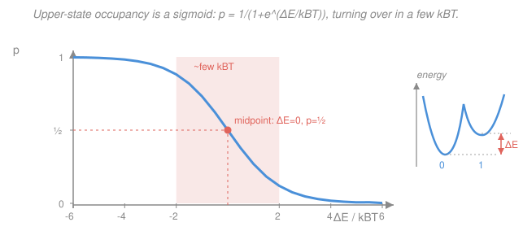

# Biophysics · Lesson 2.2: The Boltzmann distribution and two-state systems

> ⏱ ~15 min · Module 2: Free energy and the Boltzmann distribution in biology · Builds on: [2.1 Free energy and the cell's currency](02-01-free-energy-cell-currency.md), [`stat-mech` syllabus](../../stat-mech/syllabus.md) · Unlocks: [2.3 Ligand binding and receptor occupancy](02-03-ligand-binding-occupancy.md)

## Why this matters

Astonishingly much of molecular biology is a **switch with two settings**: an ion channel is open or closed, a receptor is bound or unbound, a protein is folded or unfolded, a motor is pre- or post-stroke. The cell controls its life by controlling how many switches sit in each setting. This lesson gives you the *one formula* that answers "what fraction are in the upper state?" — the Boltzmann two-state occupancy — and then shows that ligand binding (2.3), voltage gating of nerve channels (4.5), and conformational change are all the **same sigmoid** in disguise. Learn to read this curve and you can predict occupancy from an energy, or design an energy for a target occupancy.

## The idea

Picture a molecule that can be in one of two states, $0$ and $1$, with energies $E_0$ and $E_1$. The only number that matters is the **gap** $\Delta E = E_1 - E_0$ — how much *more* energy the upper state costs. Left alone in a warm bath, the molecule doesn't just fall into the lower state and stay; thermal kicks of size $k_BT$ keep flipping it back and forth. So at any instant there's a *probability* of finding it up.

Two competing pressures set that probability. Energy wants the molecule *down* (lower energy is favored). Temperature doesn't care about energy differences smaller than its own scale $k_BT$ — if the gap is much less than a kick, the molecule sloshes between the states almost freely. The tug-of-war is decided entirely by the ratio $\Delta E / k_BT$: **the gap measured in units of thermal energy.** A gap of a few $k_BT$ is enough to nearly empty the upper state; a gap near zero splits the population 50/50. That is why "a few $k_BT$" is the natural size of a biological switch — small enough to build with a binding event or a voltage, large enough to actually flip the answer.

## The formal version

**Boltzmann weight.** The unnormalized probability of a state with energy $E$ is its **Boltzmann factor**
$$w = e^{-E/k_BT},$$
where $k_BT$ is thermal energy (at room temperature $k_BT \approx 4.1\ \text{pN·nm} \approx 0.6\ \text{kcal/mol}$). *In words: every $k_BT$ of extra energy multiplies a state's likelihood by $e^{-1} \approx 0.37$ — the higher the energy, the exponentially rarer the state.* (This is the result you derived in [`stat-mech`](../../stat-mech/syllabus.md); here we just use it.)

**The partition function.** To turn weights into probabilities, divide by their sum, the **partition function** $Z$. For two states,
$$Z = e^{-E_0/k_BT} + e^{-E_1/k_BT}.$$
*In words: $Z$ is the total "statistical weight" available — the normalizer that makes the probabilities add to 1.*

**Two-state occupancy.** The probability of the upper state is its weight over $Z$:
$$p \equiv p_1 = \frac{e^{-E_1/k_BT}}{e^{-E_0/k_BT} + e^{-E_1/k_BT}}.$$
Divide top and bottom by $e^{-E_0/k_BT}$ — only the **gap** $\Delta E = E_1 - E_0$ survives:
$$\boxed{\; p = \frac{e^{-\Delta E/k_BT}}{1 + e^{-\Delta E/k_BT}} = \frac{1}{1 + e^{\Delta E/k_BT}} \;}$$
and the lower state has $p_0 = 1 - p = \dfrac{1}{1 + e^{-\Delta E/k_BT}}$. *In words: the fraction of switches in the upper state is a sigmoid set by the gap in thermal units — nothing else about $E_0$ or $E_1$ enters, only their difference.*

**Reading the sigmoid.** Three landmarks tell you everything (plot below):

- $\Delta E = 0$ (states tied): $p = \dfrac{1}{1+1} = \tfrac12$ — the **midpoint**, a 50/50 split.
- $\Delta E \gg k_BT$ (upper state expensive): $e^{\Delta E/k_BT}$ is huge, $p \to 0$ — the upper state is **empty**.
- $\Delta E \ll -k_BT$ (upper state cheaper): $e^{\Delta E/k_BT} \to 0$, $p \to 1$ — the upper state is **full**.

The whole turnover happens across a window of a few $k_BT$: going from $p = 0.1$ to $p = 0.9$ takes a change in $\Delta E$ of only $2\ln 9 \approx 4.4\ k_BT$ (derived in Example 2). Sharper than a linear response, but not a hard step — that softness is **thermal switching**: even a strongly favored state is vacated a measurable fraction of the time, which is exactly why single molecules behave probabilistically, not deterministically.

**The master move.** Everything downstream is *control of $\Delta E$*. Bind a ligand and you lower the bound state's energy (2.3). Apply a voltage across a channel and you tilt $\Delta E \propto$ gating-charge $\times$ voltage (4.5). Pull with a force, or phosphorylate a residue, and again you shift $\Delta E$. In every case the occupancy responds through *this one formula* — you slide the operating point along the same S-curve.

## Picture

## Worked examples

**Example 1 (occupancy from a gap).** A channel's open state sits $\Delta E = 2\,k_BT$ *above* its closed state. What fraction is open?
$$p = \frac{1}{1 + e^{\Delta E/k_BT}} = \frac{1}{1 + e^{2}} = \frac{1}{1 + 7.39} = \frac{1}{8.39} \approx 0.12.$$
About **12% open**. Flip the sign — suppose instead the *open* state is $2\,k_BT$ *lower* ($\Delta E = -2\,k_BT$): $p = 1/(1+e^{-2}) = 1/(1+0.135) \approx 0.88$, **88% open**. A $2\,k_BT$ tilt swings a channel from mostly-closed to mostly-open. That's why energies of just a few $k_BT$ are the currency of gating.

**Example 2 (design a gap for a target occupancy).** What gap makes the upper state 90% occupied? Solve $p = 0.9$:
$$0.9 = \frac{1}{1+e^{\Delta E/k_BT}} \;\Rightarrow\; 1 + e^{\Delta E/k_BT} = \frac{1}{0.9} = 1.111 \;\Rightarrow\; e^{\Delta E/k_BT} = 0.111,$$
$$\frac{\Delta E}{k_BT} = \ln(0.111) = -2.20 \;\Rightarrow\; \Delta E \approx -2.2\,k_BT.$$
The upper state must sit about $2.2\,k_BT$ *below* the lower one. By the mirror symmetry of the sigmoid, 10% occupancy needs $\Delta E = +2.2\,k_BT$. So moving occupancy from 10% to 90% requires shifting $\Delta E$ by $2 \times 2.2 = 4.4\,k_BT$ — the concrete meaning of "turns over in a few $k_BT$." (In general the 10–90% span is $2\ln 9 = 4.39\,k_BT$, independent of where the midpoint sits.)

**Example 3 (a ligand tilts the gap).** A receptor is 20% bound at rest, so its bound (upper) state has $\Delta E = k_BT\ln(0.8/0.2) = k_BT\ln 4 = +1.39\,k_BT$. Now add ligand until the binding energy lowers $\Delta E$ by $2\,k_BT$, to $\Delta E = -0.61\,k_BT$. The new occupancy:
$$p = \frac{1}{1+e^{-0.61}} = \frac{1}{1+0.54} \approx 0.65.$$
A $2\,k_BT$ tilt drove occupancy from 20% to **65%** — the switch flipped. Section 2.3 will show that for ligand binding the tilt is exactly $\Delta E = \Delta E_0 - k_BT\ln([L]/c_0)$: raising concentration $[L]$ lowers the effective gap logarithmically, sliding you up the same sigmoid.

## Watch out

- **You might think a favorable state is fully occupied.** Not at finite temperature. Even at $\Delta E = -5\,k_BT$ the upper state is empty $1/(1+e^{5}) \approx 0.7\%$ of the time — small but nonzero. Thermal switching never fully stops; that residual flipping *is* the noise in molecular machines.
- **You might use $E_0$ and $E_1$ separately.** Only the difference $\Delta E = E_1 - E_0$ enters. Shifting both energies by the same amount (a different zero of energy) leaves $p$ untouched — as it must.
- **Watch the sign convention.** Here $p$ is the occupancy of the *upper* (state-1) level and $\Delta E = E_1 - E_0$, so $p$ *decreases* as $\Delta E$ grows. If you define $\Delta E$ as "lower minus upper," the exponent flips sign. Always state which state is "up."
- **A sigmoid is not a step.** Its half-width is a few $k_BT$, not zero. Real switches are soft; to get a sharp one you need *cooperativity* (Lesson 2.4), which stacks several $k_BT$ into one transition.

## One-liner

> Two states, one gap: the upper level's occupancy is $p = 1/(1+e^{\Delta E/k_BT})$ — a sigmoid that sits at 50/50 when $\Delta E=0$ and turns over across a few $k_BT$, so controlling the energy gap controls the switch.

## Problems

**P1 (🟢)** A protein's active conformation sits $\Delta E = 3\,k_BT$ above its inactive one. What fraction of molecules are active at any instant? Comment on whether $3\,k_BT$ makes a good "off" switch.

**P2 (🟡)** A voltage-gated channel is 20% open at rest. A depolarizing voltage step lowers the open-state gap $\Delta E$ by $2.5\,k_BT$. What is the new open probability? (First back out the resting $\Delta E$.)

**P3 (🔴, optional)** A small protein is marginally stable: its unfolded state lies $\Delta E = +5\,k_BT$ above the folded state. (a) What fraction is unfolded at equilibrium — i.e. how often does thermal switching unfold it? (b) A denaturant weakens folding, raising the folded-state energy until $\Delta E = 0$. Now what fraction is unfolded, and how much energy (in $k_BT$) did the denaturant add?

Solutions

**P1** With the active state as the upper state, $\Delta E = +3\,k_BT$:
$$p = \frac{1}{1+e^{3}} = \frac{1}{1+20.09} = \frac{1}{21.09} \approx 0.047.$$
About **4.7% active**. A $3\,k_BT$ gap leaves the switch ~95% off — a decent but leaky "off" state; a truly quiet switch needs a larger gap or cooperativity, since even $3\,k_BT$ lets 1 in 20 slip through.
*Check.* $p<\tfrac12$ as it must be for a positive gap, and $e^3\approx 20$ gives the "1 in 21" instantly. Matches the rule of thumb that each extra $k_BT$ of gap roughly cuts the minority population by $e\approx2.7$. ✓

**P2** At 20% open, the resting gap satisfies $0.2 = 1/(1+e^{\Delta E/k_BT})$, so $e^{\Delta E/k_BT} = (1-0.2)/0.2 = 4$ and $\Delta E = k_BT\ln 4 = +1.39\,k_BT$. Lowering it by $2.5\,k_BT$ gives $\Delta E = 1.39 - 2.5 = -1.11\,k_BT$. Then
$$p = \frac{1}{1+e^{-1.11}} = \frac{1}{1+0.330} \approx 0.75.$$
The channel goes from **20% to about 75% open**.
*Check.* The tilt is negative (open state now favored), so $p$ should exceed $\tfrac12$ — it does. A $2.5\,k_BT$ push near the midpoint moves occupancy a lot, consistent with the steep middle of the sigmoid. This is precisely the two-state gating of Lesson 4.5. ✓

**P3** (a) Unfolded is the upper state, $\Delta E = +5\,k_BT$:
$$p_{\text{unfolded}} = \frac{1}{1+e^{5}} = \frac{1}{1+148.4} \approx 0.0067,$$
about **0.67%** — roughly 1 molecule in 150 is unfolded at any instant. That constant thermal unfolding/refolding is real: marginal stabilities of $5$–$15\,k_BT$ are typical for small proteins.
(b) At $\Delta E = 0$, $p_{\text{unfolded}} = 1/(1+1) = 0.5$ — **50% unfolded**. The denaturant raised the folded-state energy by the full $5\,k_BT$ needed to close the gap.
*Check.* $\Delta E$ went from $+5\,k_BT$ to $0$, a $5\,k_BT$ change, and occupancy rose from 0.67% to 50% — a huge swing from a modest energy, the hallmark of the sigmoid's steep region. Units are consistent (energies in $k_BT$, probabilities dimensionless). ✓

## Flashback

**From Lesson 1.1 (The ruler of the cell: $k_BT$ and scales):** Room-temperature thermal energy is $k_BT \approx 4.1\ \text{pN·nm} \approx 0.6\ \text{kcal/mol}$. A single hydrogen bond in water is worth roughly $2\,k_BT$. (a) Give its energy in kcal/mol. (b) Treating "bonded" (lower) vs "broken" (upper) as a two-state system, estimate the fraction of such bonds thermally broken at any instant. (Fresh variant — a bond energy, not the ATP figure from 1.1.)

Solution

(a) $2\,k_BT \times 0.6\ \text{kcal/mol per }k_BT \approx 1.2\ \text{kcal/mol}$ — feeble on the scale of a covalent bond (~100 kcal/mol), which is why hydrogen bonds form and break constantly.
(b) With the broken state $\Delta E = 2\,k_BT$ above the bonded state,
$$p_{\text{broken}} = \frac{1}{1+e^{2}} = \frac{1}{1+7.39} \approx 0.12.$$
About **12%** of such bonds are broken at any moment.
*Check.* A $2\,k_BT$ bond is easily disrupted by thermal kicks — consistent with the fact that DNA base-pairing and protein H-bonds rely on *many* such bonds acting together, no single one being reliable. Same arithmetic as Example 1, now read as a physical bond. ✓

## Connections

- **Backward:** this is [2.1](02-01-free-energy-cell-currency.md)'s free-energy bookkeeping specialized to two discrete states — $\Delta E$ here plays the role of $\Delta G$ between two configurations, and the Boltzmann factor $e^{-\Delta E/k_BT}$ is the equilibrium ratio $p_1/p_0$.
- **Forward:** [2.3 Ligand binding](02-03-ligand-binding-occupancy.md) makes $\Delta E$ depend on ligand concentration through the chemical potential, turning this sigmoid into the Langmuir binding curve with its dissociation constant $K_d$; [2.4](02-04-cooperativity-allostery.md) sharpens it into the Hill function.
- **Sideways:** the Boltzmann distribution and partition function come straight from [`stat-mech`](../../stat-mech/syllabus.md) — this is that machinery applied to biology. The *same* two-state sigmoid gates voltage-dependent ion channels in [4.5 Excitable membranes](04-05-excitable-membranes-action-potential.md), where $\Delta E \propto$ gating charge $\times$ membrane voltage, so a nerve firing is this curve read as a function of voltage.
