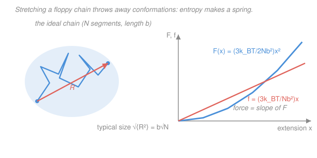

# Biophysics · Lesson 3.1: Polymers as random walks: the entropic spring

> ⏱ ~15 min · Module 3: Polymers, membranes, and self-assembly · Builds on: [2.4 Cooperativity and allostery](02-04-cooperativity-allostery.md), [1.2 The random walk](01-02-random-walk.md) · Unlocks: [3.2 Persistence length and the worm-like chain](03-02-persistence-length-wlc.md)

## Why this matters

Pull on a strand of DNA with optical tweezers and it pulls back — gently at first, then harder — long before any chemical bond is stretched. Where does that force come from? Not from stretching bonds, not from bending anything: from **entropy**. A floppy chain has astronomically many ways to be crumpled and very few ways to be straight, so straightening it costs disorder, and the chain fights to stay crumpled. This is the single most important idea in polymer physics, it explains why rubber, DNA, and unfolded proteins are all *soft* springs, and it is the low-force front half of every single-molecule pulling curve you'll fit in [3.3](03-03-stretching-single-molecules.md). Best of all, you already have the tool: a polymer *is* the random walk of [1.2](01-02-random-walk.md), now living in space.

## The idea

Take a long chain and pretend it's a string of $N$ rigid links, each of length $b$, each free to point in any direction independent of its neighbors — a **freely-jointed** (or **ideal**) **chain**. Now walk from one end to the other, link by link. Each link is a random step. So the vector from the first bead to the last, the **end-to-end vector** $\mathbf{R}$, is exactly a random walk of $N$ steps of length $b$ — the very object from [1.2](01-02-random-walk.md).

That gives the coil's size for free. The walk has no preferred direction, so on average it goes nowhere, $\langle\mathbf{R}\rangle = 0$; but its typical *spread* grows as the square root of the number of steps, $\sqrt{\langle R^2\rangle} = b\sqrt{N}$. The punchline: a floppy chain is a tiny crumpled ball, far smaller than its stretched-out length $L = Nb$. A chain of $N = 10^4$ segments is only $\sqrt{10^4} = 100$ segments across — a hundredfold crumpling.

Now stretch it. To hold the ends a distance $x$ apart, you forbid every conformation that *doesn't* reach that far. There are enormously many crumpled conformations and vanishingly few stretched ones, so pulling the chain out **destroys conformations** — it lowers the entropy. Lower entropy at fixed temperature means higher free energy, and a system always slides back toward lower free energy. The chain therefore pulls *inward*, trying to recoil into its high-entropy crumpled state. No bond is under tension. The restoring force is pure bookkeeping of disorder.

## The formal version

**The coil size.** With each of the $N$ links an independent random step of length $b$,

$$\langle\mathbf{R}\rangle = 0, \qquad \langle R^2\rangle = N b^2, \qquad \sqrt{\langle R^2\rangle} = b\sqrt{N}.$$

*In words: the chain drifts nowhere on average, and its typical size grows only as $\sqrt{N}$ — so the coil (size $b\sqrt N$) is much smaller than the fully-stretched contour length $L = Nb$.* This is the identical $\langle x^2\rangle = Nb^2$ result from the random walk in [1.2](01-02-random-walk.md); we've just reinterpreted "steps in time" as "links in space."

**Counting conformations.** Pick a direction to pull, call the end-to-end distance along it $x$. Because $\mathbf{R}$ is a sum of many independent steps, the central limit theorem ([`prob-stat-refresher` 3.3](../../prob-stat-refresher/lessons/03-03-central-limit-theorem.md)) makes the number of conformations $\Omega(x)$ with that extension a **Gaussian**:

$$\Omega(x) \;\propto\; \exp\!\left(-\frac{3x^2}{2Nb^2}\right).$$

*In words: overwhelmingly most conformations sit near $x = 0$ (crumpled); the count falls off as a bell curve as you demand a larger extension.* (The $3$ is a 3-D bookkeeping factor: one Cartesian component of the walk has variance $\langle x^2\rangle = Nb^2/3$, so the Gaussian's width is set by $Nb^2/3$.)

**Entropy and free energy.** Boltzmann's entropy $S = k_B\ln\Omega$ (the same $S = k_B\ln\Omega$ as [`stat-mech`](../../stat-mech/syllabus.md)), with $k_B$ the Boltzmann constant, turns that count into

$$S(x) = k_B\ln\Omega(x) = \text{const} - \frac{3k_B\,x^2}{2Nb^2}.$$

There is **no bond energy** here — every conformation has the same energy, so the internal energy is flat and the free energy is *purely entropic*, $F = U - TS = \text{const} - TS$:

$$\boxed{\,F(x) = \frac{3k_BT}{2Nb^2}\,x^2\,}$$

*In words: the free energy is a parabola in the extension — exactly the $\tfrac12 k x^2$ of a spring.* Compare $\tfrac12 k x^2$: the chain is a **Hookean spring** with

$$\text{force}\quad f(x) = \frac{dF}{dx} = \frac{3k_BT}{Nb^2}\,x, \qquad \text{spring constant}\quad \boxed{\,k = \frac{3k_BT}{Nb^2}\,}.$$

*In words: stretching the polymer doesn't stretch any bonds — it orders the chain, lowering entropy, and the chain pulls back to regain disorder. Entropy alone makes a spring.*

**The temperature twist.** Look hard at $k = 3k_BT/Nb^2$: it is **proportional to temperature**. Heat an entropic spring and it gets *stiffer* — the opposite of a metal spring, whose stiffness comes from bond energies and barely changes (in fact softens slightly) with heat. The reason is transparent: the restoring force *is* the thermal jostling trying to recrumple the chain, and hotter means more jostling. A stretched rubber band — also an entropic spring — really does contract when you heat it (the Gough–Joule effect). Cool it toward $T = 0$ and the entropic spring goes limp: no thermal motion, no restoring force.

## Picture

## Worked examples

**Example 1 (coil size vs contour length — a crumpled ball).** Model a piece of DNA as $N = 100$ Kuhn segments of length $b = 100\ \text{nm}$ (we'll justify $b$ from stiffness in [3.2](03-02-persistence-length-wlc.md)). Its fully-stretched contour length is

$$L = Nb = 100 \times 100\ \text{nm} = 10^4\ \text{nm} = 10\ \mu\text{m}.$$

But its typical coiled size is

$$\sqrt{\langle R^2\rangle} = b\sqrt{N} = 100\ \text{nm}\times\sqrt{100} = 1000\ \text{nm} = 1\ \mu\text{m}.$$

So a molecule that is $10\ \mu\text{m}$ long when straight sits, left alone, as a blob about $1\ \mu\text{m}$ across — tenfold crumpled. This is why an entire chromosome's worth of DNA fits inside a cell: floppy chains are self-packing.

**Example 2 (how soft is the entropic spring, and what force to pull it out?).** Use the same chain, $N=100$, $b=100\ \text{nm}$, at room temperature where $k_BT = 4.1\ \text{pN·nm}$. The spring constant is

$$k = \frac{3k_BT}{Nb^2} = \frac{3\times 4.1\ \text{pN·nm}}{100\times(100\ \text{nm})^2} = \frac{12.3\ \text{pN·nm}}{10^{6}\ \text{nm}^2} = 1.2\times10^{-5}\ \text{pN/nm}.$$

To hold the ends apart at $x = 1\ \mu\text{m} = 1000\ \text{nm}$ (about one coil size), the force is

$$f = kx = 1.2\times10^{-5}\ \text{pN/nm}\times 1000\ \text{nm} \approx 1.2\times10^{-2}\ \text{pN} \approx 12\ \text{fN}.$$

*Twelve femtonewtons* — a thousandth of the force that ruptures a typical protein–ligand bond. Entropic springs are extraordinarily soft, which is exactly why the low-force end of a DNA pulling curve is so gentle and so *linear* (the entropic regime of Boss problem 3) before the worm-like chain stiffens near full extension in [3.2](03-02-persistence-length-wlc.md).

## Watch out

- **You might think stretching a polymer stretches its bonds.** In the ideal chain it stretches *nothing* — every conformation has identical energy. The force is entirely the chain shedding disorder; the restoring "spring" is made of missing conformations, not compressed material.
- **You might think a hotter spring is a softer spring.** True for a steel spring (bond-energy elasticity), false here. Entropic stiffness $k = 3k_BT/Nb^2$ *rises* with $T$. If a spring stiffens when heated and slackens when cooled, its elasticity is entropic — that's the fingerprint (rubber, DNA, unfolded proteins).
- **You might confuse the contour length $L=Nb$ with the coil size $b\sqrt N$.** They differ by a factor $\sqrt N$, which is huge — a $10^4$-segment chain is $100\times$ smaller crumpled than stretched. The Hookean law $f=kx$ is only the small-$x$ story; as $x\to L$ you run out of conformations and the force blows up (that's the worm-like chain, [3.2](03-02-persistence-length-wlc.md)).

## One-liner

> A floppy chain is a random walk of size $b\sqrt N$, and pulling it flat just burns entropy — so it behaves as a Hookean spring $k = 3k_BT/Nb^2$ that, uniquely, stiffens when you heat it.

## Problems

**P1 (🟢)** An unfolded protein is modeled as a freely-jointed chain of $N = 40$ Kuhn segments, each $b = 0.8\ \text{nm}$. Find (a) its contour length $L$ and (b) its typical coil size $\sqrt{\langle R^2\rangle}$. By what factor is the crumpled coil smaller than the stretched chain?

**P2 (🟡)** For the same unfolded protein ($N=40$, $b=0.8\ \text{nm}$, $k_BT = 4.1\ \text{pN·nm}$), compute the entropic spring constant $k$, and the force needed to stretch it to an extension $x = 3\ \text{nm}$. Is this force above or below the $\sim 5\ \text{pN}$ scale at which such measurements are made?

**P3 (🔴, optional)** You hold one entropic spring at fixed extension $x$ and measure the restoring force $f$. You then raise the absolute temperature from $300\ \text{K}$ to $330\ \text{K}$ (a $10\%$ increase). By what percentage does the force change, and in which direction? Contrast this in one sentence with what a steel spring would do.

Solutions

**P1** (a) Contour length is fully-stretched length:
$$L = Nb = 40 \times 0.8\ \text{nm} = 32\ \text{nm}.$$
(b) Coil size:
$$\sqrt{\langle R^2\rangle} = b\sqrt N = 0.8\ \text{nm}\times\sqrt{40} = 0.8\times 6.32\ \text{nm} \approx 5.1\ \text{nm}.$$
The coil is smaller than the contour by the factor $\sqrt N = \sqrt{40}\approx 6.3$.

*Check.* Units are nm throughout. Sanity: a real unfolded ~40-residue protein does crumple to a few nm across, matching the $5\ \text{nm}$ estimate; and the ratio being $\sqrt N$ (not $N$) is the random-walk signature — quadrupling $N$ only doubles the size. ✓

**P2** Spring constant:
$$k = \frac{3k_BT}{Nb^2} = \frac{3\times 4.1\ \text{pN·nm}}{40\times(0.8\ \text{nm})^2} = \frac{12.3\ \text{pN·nm}}{40\times 0.64\ \text{nm}^2} = \frac{12.3}{25.6}\ \text{pN/nm} \approx 0.48\ \text{pN/nm}.$$
Force at $x = 3\ \text{nm}$:
$$f = kx = 0.48\ \text{pN/nm}\times 3\ \text{nm} \approx 1.4\ \text{pN}.$$

*Check.* Units: $(\text{pN·nm})/\text{nm}^2 = \text{pN/nm}$, times nm gives pN. ✓ The result $\sim 1\ \text{pN}$ sits just below the $\sim 5\ \text{pN}$ measurement scale — reassuring, since $3\ \text{nm}$ is only about $10\%$ of the $32\ \text{nm}$ contour, still deep in the soft linear regime where the Hookean law holds. ✓ (Note this short, stiff chain is far stiffer than Example 2's long DNA — smaller $N$ and $b$ both raise $k$.)

**P3** The force at fixed $x$ is $f = (3k_BT/Nb^2)\,x \propto T$, so it scales linearly with *absolute* temperature. Raising $T$ from $300$ to $330\ \text{K}$ multiplies $f$ by $330/300 = 1.10$:
$$\frac{\Delta f}{f} = \frac{330-300}{300} = 0.10 = +10\%.$$
The restoring force *increases* by $10\%$ — the spring stiffens on heating. A steel spring would do essentially the opposite: its stiffness comes from bond energies, nearly $T$-independent (and if anything it softens slightly as it warms). Stiffening on heating is the hallmark of entropic elasticity.

*Check.* Because $k\propto T$ with $T$ in kelvin (an absolute scale, so we must use $300$/$330$, not Celsius), a $10\%$ rise in $T$ is exactly a $10\%$ rise in force. This is the Gough–Joule effect: a stretched rubber band pulls harder when warmed. ✓

## Flashback

**From Lesson 2.2 (The Boltzmann distribution and two-state systems):** An ion channel flips between a closed state and an open state. The open state has energy $\Delta E = 3\,k_BT$ *above* the closed state. Treating it as a two-state Boltzmann system, what fraction of the time is the channel open? (Fresh variant — a new energy gap.)

Solution

Two states with Boltzmann weights $e^{-E/k_BT}$: closed weight $\propto e^{0}=1$, open weight $\propto e^{-\Delta E/k_BT} = e^{-3}$. The open probability is that weight over the sum:

$$P_{\text{open}} = \frac{e^{-\Delta E/k_BT}}{1 + e^{-\Delta E/k_BT}} = \frac{1}{1+e^{\Delta E/k_BT}} = \frac{1}{1+e^{3}} = \frac{1}{1+20.1} \approx 0.047.$$

So the channel is open about $5\%$ of the time.

*Check.* A gap of $3\,k_BT$ is a few times thermal energy, so the higher state should be rare but not vanishing — $5\%$ fits. Limiting cases: $\Delta E\to 0$ gives $P_{\text{open}}\to\tfrac12$ (states equally likely), and $\Delta E\to\infty$ gives $P_{\text{open}}\to 0$. ✓ Same Boltzmann bookkeeping that, applied to counting *conformations*, gave this lesson's entropic spring — energy gaps here, entropy gaps there.

## Connections

- **Backward:** the end-to-end vector $\mathbf R$ *is* the random walk of [1.2](01-02-random-walk.md) — same $\langle R^2\rangle = Nb^2$, same Gaussian from the central limit theorem ([`prob-stat-refresher` 3.3](../../prob-stat-refresher/lessons/03-03-central-limit-theorem.md)). And $S = k_B\ln\Omega$ with $F = U - TS$ is the [`stat-mech`](../../stat-mech/syllabus.md) machinery, here with $U$ flat so the physics is *all* entropy.
- **Forward:** [3.2 Persistence length and the worm-like chain](03-02-persistence-length-wlc.md) adds bending stiffness (the ideal chain has none), replacing "$N$ freely-jointed segments" with a smoothly bending rod of persistence length $l_p$, and fixing the failure of $f=kx$ as $x\to L$. That worm-like chain is what you'll actually fit to tweezer data in [3.3](03-03-stretching-single-molecules.md) (Boss problem 3).
- **Sideways:** this is the physics of **rubber elasticity** — a rubber band is a network of entropic springs, which is why it warms when stretched and contracts when heated. The same "free energy is a parabola near its minimum, so everything is a spring" logic drove simple harmonic motion in [`mechanics-refresher` 3.1](../../mechanics-refresher/lessons/03-01-simple-harmonic-motion.md); the twist here is that the parabola is carved by *entropy*, not potential energy.
