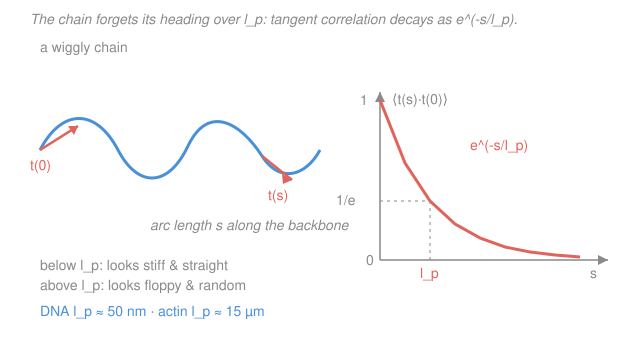

# Biophysics · Lesson 3.2: Persistence length and the worm-like chain

> ⏱ ~15 min · Module 3: Polymers, membranes, and self-assembly · Builds on: [3.1 Polymers as random walks: the entropic spring](03-01-entropic-spring.md), [1.2 The random walk](../../prob-stat-refresher/syllabus.md) · Unlocks: [3.3 Stretching single molecules](03-03-stretching-single-molecules.md)

## Why this matters

The freely-jointed chain of [3.1](03-01-entropic-spring.md) is a beautiful lie. It treats a polymer as beads on frictionless hinges, free to kink 180° from one link to the next at zero cost. But DNA is a stiff, twisted ladder — bend it too tightly and you pay real energy. That single missing ingredient, **bending stiffness**, is the difference between a model that gives the right scaling and the model that actually *fits* single-molecule data to three digits. It's also why a gene is not a shapeless blob: DNA's stiffness is exactly why wrapping it around a nucleosome costs a measurable price, why short DNA won't loop, and why cytoskeletal filaments span a cell like girders. This lesson adds stiffness and, remarkably, recovers the entropic spring anyway — with the *right* effective segment.

## The idea

Picture a garden hose lying on the ground. Look at a 1 cm stretch: it's basically straight — too short to have curved much. Look at a 100 m stretch: it wanders all over the lawn, its far end pointing anywhere. Somewhere in between there's a crossover length where the hose "forgets" which way it was heading. That crossover is the **persistence length** $l_p$.

Why does a length like that exist at all? Thermal kicks are constantly trying to bend the chain; the chain's own stiffness resists. The two fight to a draw. Over a short piece the stiffness wins and the chain stays nearly straight; over a long piece the accumulated random bends win and the direction randomizes. $l_p$ is the tipping point — measured by how fast the chain's *heading* decorrelates as you walk along it.

So a real polymer has **two regimes in one molecule**. Zoom in below $l_p$ and it's a stiff rod. Zoom out above $l_p$ and it's a floppy random walk — the entropic spring of [3.1](03-01-entropic-spring.md) is back, just with an effective segment length set by the stiffness. The model that stitches these together is the **worm-like chain (WLC)**, and the numbers it produces are the ones you measure: DNA's $l_p \approx 50$ nm, which is why a 150-base-pair gene fragment is *semiflexible* — neither a rod nor a coil, but caught in between.

## The formal version

**Bending energy.** Model the chain as a thin elastic rod. Bending a rod into a local radius of curvature $R(s)$ (meters) at arc-length position $s$ costs energy

$$E_{\text{bend}} = \frac{1}{2}\,B\int_0^L \left(\frac{1}{R(s)}\right)^2 ds,$$

where $B$ is the **bending stiffness** (units of energy·length, e.g. $\mathrm{pN\cdot nm^2}$) and $L$ is the **contour length** — the total arc length of the backbone if you pulled it straight. *In words: sharper bends (smaller $R$, so larger $1/R$) cost quadratically more, and a stiffer rod (bigger $B$) charges more for the same bend.* This is the elastic-beam energy from mechanics, now applied to a molecule.

**Persistence length.** Let $\mathbf{t}(s)$ be the unit **tangent vector** — the chain's heading at position $s$. Balance the bending energy against thermal energy $k_BT$ and the tangent–tangent correlation falls off exponentially:

$$\boxed{\;\langle \mathbf{t}(s)\cdot\mathbf{t}(0)\rangle = e^{-s/l_p}, \qquad l_p \equiv \frac{B}{k_BT}\;}$$

*In words: the average alignment between two points a distance $s$ apart decays with a characteristic length $l_p$ — the distance over which the chain forgets its direction.* At $s=0$ the tangents are identical ($\langle\mathbf{t}\cdot\mathbf{t}\rangle=1$); at $s=l_p$ the correlation has dropped to $1/e\approx0.37$; well beyond $l_p$ the headings are unrelated. Stiffer chain → bigger $B$ → longer $l_p$.

**The numbers that matter** (all at $k_BT\approx4.1\ \mathrm{pN\cdot nm}$):

| Molecule | $l_p$ | In perspective |
|---|---|---|
| Unstructured protein | $0.5$–$1$ nm | forgets its direction every few residues — a floppy coil |
| Double-stranded DNA | $\approx 50$ nm | $\approx 150$ base pairs ($0.34$ nm/bp) — **semiflexible** |
| Actin filament | $\approx 15\ \mu$m | nearly rigid across a whole cell |
| Microtubule | $\sim 1$ mm | a rigid rod on any cellular scale |

**The worm-like chain (WLC)** interpolates between the two limits:

- **On scales $\ll l_p$:** a stiff, nearly straight rod. End-to-end distance $\approx$ contour length.
- **On scales $\gg l_p$:** integrating the exponential correlation gives the mean-square end-to-end distance

$$\langle R^2\rangle = 2\,l_p L \qquad (L \gg l_p).$$

*In words: over many persistence lengths the WLC is just the random walk of [3.1](03-01-entropic-spring.md), $\langle R^2\rangle = Nb^2$, with an effective segment.* Matching $Nb^2 = Lb = 2l_pL$ (since $Nb=L$) identifies the **Kuhn length**

$$b = 2\,l_p:$$

the effective straight segment of the equivalent freely-jointed chain is *twice* the persistence length. Feed that into the entropic spring $F = \dfrac{3k_BT}{Nb^2}x = \dfrac{3k_BT}{Lb}x$ and you get the WLC's low-force stiffness

$$F \approx \frac{3k_BT}{2\,l_p L}\,x \qquad (\text{small } x),$$

— exactly the entropic spring of 3.1 with $Nb^2 \to 2l_pL$. This is the low-force limit of the full force–extension law you'll fit to tweezers data in [3.3](03-03-stretching-single-molecules.md).

## Picture

## Worked examples

**Example 1 (the coil size of a real gene-delivery molecule).** $\lambda$-DNA has contour length $L\approx16\ \mu\text{m}=1.6\times10^4$ nm and $l_p=50$ nm. Since $L\gg l_p$, use the random-coil result:

$$\langle R^2\rangle = 2l_pL = 2(50)(1.6\times10^4)\ \text{nm}^2 = 1.6\times10^6\ \text{nm}^2,$$

so the typical end-to-end distance is

$$\sqrt{\langle R^2\rangle} = \sqrt{1.6\times10^6}\ \text{nm} \approx 1.3\times10^3\ \text{nm} \approx 1.3\ \mu\text{m}.$$

A molecule 16 µm long, laid straight, balls up into a coil barely 1 µm across — a **13-fold** compaction from entropy alone, no proteins required. (This is why naked $\lambda$-DNA fits inside a phage head at all, and why measured radii of gyration of $\lambda$-DNA come out near half a micron.)

**Example 2 (stiff or floppy? — pick the regime before you compute).** Is a stretch of DNA rod-like or coil-like? Compare its length to $l_p=50$ nm.

- A **20 nm** segment (about 60 bp): $20 < 50$, so shorter than one persistence length. It behaves like a **stiff rod** — it barely bends, and treating it as a random coil is wrong. This is exactly why short DNA fragments resist looping.
- A **2 µm** segment ($=2000$ nm, about 6000 bp): $2000 \gg 50$, so $L/l_p\approx40$ persistence lengths. It's a **floppy random walk**, and $\langle R^2\rangle = 2l_pL = 2(50)(2000)=2\times10^5\ \text{nm}^2$, giving $\sqrt{\langle R^2\rangle}\approx450$ nm — far shorter than its 2 µm contour length. A coil, not a rod.

The lesson: *always compare your scale to $l_p$ first.* The same molecule is a girder up close and a noodle far away.

## Watch out

- **You might think $l_p$ is a fixed number of base pairs.** It's a physical length set by stiffness, $l_p=B/k_BT$ — so it depends on temperature and, importantly, on **salt**: lowering salt lets the DNA backbone's negative charges repel each other, stiffening the chain and raising $l_p$. (That electrostatic stiffening is a preview of [3.6](03-06-electrostatics-salt-water.md).)
- **You might confuse Kuhn length with persistence length.** They differ by a factor of two: $b = 2l_p$. Use $l_p$ inside the exponential correlation; use $b=2l_p$ (or equivalently $2l_pL$) when you borrow the freely-jointed formulas $\langle R^2\rangle=Nb^2$ and $F=3k_BT\,x/Nb^2$. Mixing them up costs you a factor of 2.
- **You might apply $\langle R^2\rangle = 2l_pL$ to a short, stiff segment.** That formula is the $L\gg l_p$ limit only. For $L\lesssim l_p$ the chain is nearly straight and $\langle R^2\rangle\to L^2$ (a rod), not $2l_pL$.

## One-liner

> Stiffness gives a chain a memory length $l_p=B/k_BT$: below it a rod, above it the entropic spring of 3.1 with Kuhn length $b=2l_p$ and $\langle R^2\rangle = 2l_pL$.

## Problems

**P1 (🟢)** A DNA molecule has contour length $L=5\ \mu\text{m}$ and $l_p=50$ nm. (a) How many persistence lengths long is it? (b) Compute $\langle R^2\rangle$ and the typical coil size $\sqrt{\langle R^2\rangle}$. (c) What is the effective Kuhn length $b$?

**P2 (🟡)** You measure a filament's bending stiffness to be $B=200\ \mathrm{pN\cdot nm^2}$ at room temperature ($k_BT=4.1\ \mathrm{pN\cdot nm}$). (a) Find its persistence length. (b) Which of the four molecules in the table is it? (c) A cousin filament (actin) has $l_p\approx15\ \mu\text{m}$; how many times stiffer is *its* bending modulus $B$ than the one you measured?

**P3 (🔴, optional)** A chromatin nucleosome wraps DNA into $\approx 1.65$ turns around a protein spool of radius $R\approx4.2$ nm, using about $1.5$ turns $\times\,2\pi R \approx 40$ nm of DNA. Using $E_{\text{bend}}=\tfrac12 B\int(1/R)^2 ds$ with $B=l_p\,k_BT$ and $l_p=50$ nm, estimate the bending energy paid (in $k_BT$). Comment: is this a lot compared to the $\sim1\,k_BT$ scale of thermal noise, and what must supply it?

Solutions

**P1** (a) $L/l_p = 5000\ \text{nm}/50\ \text{nm} = 100$ persistence lengths — very floppy, deep in the random-coil regime.

(b) Since $L\gg l_p$, $\langle R^2\rangle = 2l_pL = 2(50)(5000) = 5\times10^5\ \text{nm}^2$, so

$$\sqrt{\langle R^2\rangle} = \sqrt{5\times10^5}\ \text{nm}\approx 707\ \text{nm}\approx 0.7\ \mu\text{m}.$$

(c) $b = 2l_p = 100$ nm.

*Check.* The coil (0.7 µm) is far smaller than the 5 µm contour length, as it must be for a random walk ($\sqrt{\langle R^2\rangle}\propto\sqrt{L}$, not $L$). And $\sqrt{\langle R^2\rangle}=\sqrt{Lb}=\sqrt{2l_pL}$ ✓, self-consistent with $b=2l_p$.

**P2** (a) $l_p = B/k_BT = (200\ \mathrm{pN\cdot nm^2})/(4.1\ \mathrm{pN\cdot nm}) \approx 49\ \text{nm}\approx 50$ nm.

(b) That's **double-stranded DNA**.

(c) $B = l_p\,k_BT$, so at fixed temperature $B\propto l_p$. Actin's $l_p\approx15\ \mu\text{m}=1.5\times10^4$ nm versus DNA's $50$ nm gives a ratio $1.5\times10^4/50 = 300$. Actin is about **300× stiffer** in bending.

*Check.* Units in (a): $\mathrm{pN\cdot nm^2}/\mathrm{pN\cdot nm}=\mathrm{nm}$ ✓. The DNA answer lands right on the tabulated 50 nm, and actin being ~300× stiffer matches its role as a structural filament rather than a floppy coil. ✓

**P3** Along the wrapped stretch the radius of curvature is fixed at $R=4.2$ nm over arc length $s_{\text{wrap}}\approx40$ nm, so with $1/R$ constant,

$$E_{\text{bend}}=\tfrac12 B\,\frac{s_{\text{wrap}}}{R^2} = \tfrac12\,(l_p k_BT)\,\frac{s_{\text{wrap}}}{R^2} = \tfrac12\,k_BT\,\frac{l_p\,s_{\text{wrap}}}{R^2}.$$

Plugging in $l_p=50$ nm, $s_{\text{wrap}}=40$ nm, $R=4.2$ nm:

$$E_{\text{bend}} = \tfrac12\,k_BT\,\frac{(50)(40)}{(4.2)^2} = \tfrac12\,k_BT\,\frac{2000}{17.6} \approx 57\ k_BT.$$

*Check.* Units inside the fraction: $\mathrm{nm\cdot nm/nm^2}$ = dimensionless ✓, leaving an answer in $k_BT$. Tens of $k_BT$ is enormous next to the $\sim1\,k_BT$ of thermal jostling — DNA will **not** wrap itself spontaneously. The favorable DNA–histone binding contacts must supply that bending cost, which is exactly why nucleosomes need histones (and why the wrap can be regulated). Order-of-magnitude agrees with the textbook estimate that each nucleosome stores tens of $k_BT$ of bending strain.

## Flashback

**From Lesson 3.1 (Polymers as random walks: the entropic spring):** A freely-jointed chain has $N=400$ Kuhn segments each of length $b=2$ nm. (a) What is its mean-square end-to-end distance $\langle R^2\rangle$? (b) Its entropic spring constant is $k_{\text{eff}} = 3k_BT/(Nb^2)$; evaluate it in pN/nm using $k_BT=4.1\ \mathrm{pN\cdot nm}$. (Fresh variant — new numbers, and note the tie to this lesson: $b=2l_p$.)

Solution

(a) $\langle R^2\rangle = Nb^2 = 400\,(2)^2 = 1600\ \text{nm}^2$, so $\sqrt{\langle R^2\rangle}=40$ nm.

(b) $k_{\text{eff}} = \dfrac{3k_BT}{Nb^2} = \dfrac{3(4.1\ \mathrm{pN\cdot nm})}{1600\ \text{nm}^2} = \dfrac{12.3}{1600}\ \mathrm{pN/nm} \approx 7.7\times10^{-3}\ \mathrm{pN/nm}.$

*Check.* Units: $\mathrm{pN\cdot nm/nm^2}=\mathrm{pN/nm}$ ✓. The spring is extraordinarily soft ($\sim10^{-2}$ pN/nm) — sub-piconewton forces stretch it appreciably, which is why optical tweezers can pull DNA at all ([3.3](03-03-stretching-single-molecules.md)). Tie-in: with $b=2l_p$ this chain has $l_p=1$ nm and $Nb^2=2l_pL=1600\ \text{nm}^2$ ($L=Nb=800$ nm), so $k_{\text{eff}}=3k_BT/(2l_pL)$ — the same WLC low-force stiffness derived above. ✓

## Connections

- **Backward:** this is [3.1](03-01-entropic-spring.md)'s entropic spring with the *right* segment. The freely-jointed chain assumed sharp kinks; adding bending stiffness replaces the arbitrary link $b$ with a physical one, $b=2l_p$, so $\langle R^2\rangle=Nb^2$ becomes $2l_pL$ and $F=3k_BT\,x/Nb^2$ becomes $3k_BT\,x/(2l_pL)$ (Boss problem 3). The exponential tangent correlation is a random walk on the sphere of directions — the [random walk / CLT](../../prob-stat-refresher/syllabus.md) machinery of Module 1, applied to headings instead of positions.
- **Forward:** [3.3 Stretching single molecules](03-03-stretching-single-molecules.md) takes the WLC to high force, where the Marko–Siggia force–extension law $F=\dfrac{k_BT}{l_p}\!\left[\dfrac{1}{4(1-x/L)^2}-\dfrac14+\dfrac{x}{L}\right]$ diverges as $x\to L$; the small-$x$ expansion of that bracket is exactly the $\tfrac32(x/L)$ derived here. Fitting real tweezers data pulls $l_p$ and $L$ straight out.
- **Sideways:** the salt-dependence of $l_p$ is electrostatic stiffening — the same Debye screening you'll compute in [3.6](03-06-electrostatics-salt-water.md) and that reappears as Poisson–Boltzmann screening in [`plasma-physics`](../../plasma-physics/syllabus.md). The elastic-rod bending energy $E_{\text{bend}}=\tfrac12 B\int(1/R)^2ds$ is the same beam-bending functional that governs membrane curvature in [3.5](03-05-membrane-mechanics.md).
