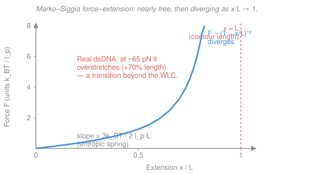

# Biophysics · Lesson 3.3: Stretching single molecules

> ⏱ ~15 min · Module 3: Polymers, membranes, and self-assembly · Builds on: [3.2 Persistence length and the worm-like chain](03-02-persistence-length-wlc.md) · Unlocks: [3.4 Self-assembly and the hydrophobic effect](03-04-self-assembly-hydrophobic.md)

## Why this matters

For a century, polymer physics was a theory about *averages* — you measured a bulk solution and inferred what the molecules were doing. Then, in the 1990s, people learned to grab a **single** DNA molecule by its ends and pull. Glue one end to a glass surface, the other to a micron-sized bead, and either hold the bead in a focused laser (**optical tweezers**) or tug it with a magnet (**magnetic tweezers**). Now you can apply a known force — down to a fraction of a piconewton — and watch one molecule stretch, nanometer by nanometer. The result is a **force–extension curve**, and it is the most direct test polymer physics has ever had. This lesson is about reading that curve: it's a two-parameter fit that hands you the persistence length $l_p$ and the contour length $L$ of a single molecule.

## The idea

Recall the two facts from [3.1](03-01-entropic-spring.md) and [3.2](03-02-persistence-length-wlc.md). A floppy polymer in warm water is a coiled random walk, not because anything holds it coiled but because there are vastly more crumpled shapes than straight ones — pulling it out *costs entropy*, so the chain pulls back like a spring. And the natural scale of that entropic pull is set by the persistence length: a force of about $k_BT/l_p$ is what it takes to matter. For DNA, $l_p \approx 50\ \mathrm{nm}$, so $k_BT/l_p \approx 4.1/50 \approx 0.08\ \mathrm{pN}$. **That is a tiny force.** The first stretch of a DNA molecule is almost free — a few hundredths of a piconewton straightens the big lazy coils.

But it can't stay cheap. As you pull the molecule toward its full **contour length** $L$ (the length of the backbone if you laid every bond out straight), you run out of slack. The only wiggles left are tiny, short-wavelength thermal wrinkles, and flattening those requires ever-larger force. The curve, flat and gentle at first, turns and shoots almost straight up as the extension approaches $L$. You can never quite get there: reaching the *exact* contour length would mean zero entropy, and that costs infinite force. The whole story of the force–extension curve is this contrast — **nearly free at low extension, diverging near full extension** — and the shape in between is a precise fingerprint of the chain's stiffness.

## The formal version

The worm-like chain has no exact closed-form force–extension law, but **Marko and Siggia (1995)** found an interpolation formula that is accurate to a couple of percent across the whole range and is *the* workhorse of the field. With $x$ the end-to-end extension, $L$ the contour length, and $l_p$ the persistence length,

$$\boxed{\,F(x) = \frac{k_BT}{l_p}\left[\frac{1}{4\,(1 - x/L)^2} - \frac{1}{4} + \frac{x}{L}\right].\,}$$

*In words: the force needed to hold the chain at extension $x$, in units of the entropic scale $k_BT/l_p$, is a function of the fractional extension $x/L$ alone.* Everything about the specific molecule sits in the two prefactors $k_BT/l_p$ (the force scale) and $L$ (the length scale). Read its two limits — they are the whole lesson:

**Low force ($x \ll L$).** Expand for small $x/L$: the divergent term $\tfrac14(1-x/L)^{-2} \approx \tfrac14(1 + 2x/L)$, so the bracket becomes $\tfrac14 + \tfrac12\,x/L - \tfrac14 + x/L = \tfrac32\,x/L$. Hence

$$F \approx \frac{3\,k_BT}{2\,l_p L}\,x.$$

*In words: at low force the molecule is a linear (Hookean) spring* with stiffness $k = 3k_BT/(2 l_p L)$ — exactly the entropic spring of [3.1](03-01-entropic-spring.md)/[3.2](03-02-persistence-length-wlc.md). Longer or stiffer chains are softer springs. This is the regime where the *slope* of the measured curve directly reports $l_p$ (given $L$).

**Near full extension ($x \to L$).** The first term blows up while the others stay finite:

$$F \approx \frac{k_BT}{4\,l_p}\,\frac{1}{(1 - x/L)^2}.$$

*In words: the force diverges as $(1 - x/L)^{-2}$* — halve the remaining gap $1 - x/L$ and you quadruple the force. This is the near-vertical wall on the right of the curve, and its steepness is what pins down $L$: the extension where the force runs away is the contour length.

**The fit.** Overlay the Marko–Siggia curve on measured $(x, F)$ points with $l_p$ and $L$ as the only two free parameters. A single two-parameter fit captures the entire curve — the gentle toe, the turn, and the divergence. This is *literally* how $l_p \approx 50\ \mathrm{nm}$ for double-stranded DNA was measured.

**One caveat the WLC does not know about.** Pull dsDNA past about $65\ \mathrm{pN}$ and it abruptly lengthens by roughly $70\%$ — the **overstretching transition**, a real change in the molecule's structure, seen as a flat plateau in the curve. That is genuine conformational physics *beyond* the elastic WLC; the formula above describes everything up to it.

## Picture

## Worked examples

**Example 1 (mechanical — walk up the curve).** Take dsDNA, $l_p = 50\ \mathrm{nm}$, so the force scale is $k_BT/l_p = 4.1/50 = 0.082\ \mathrm{pN}$. What force holds it at $x/L = 0.5$, $0.8$, and $0.9$? Plug each fractional extension into the bracket $B(u) = \tfrac{1}{4(1-u)^2} - \tfrac14 + u$ and multiply by $0.082\ \mathrm{pN}$:

$$
\begin{aligned}
u = 0.5:\quad &B = \tfrac{1}{4(0.5)^2} - 0.25 + 0.5 = 1.00 - 0.25 + 0.5 = 1.25 &\Rightarrow\ F = 0.10\ \mathrm{pN},\\
u = 0.8:\quad &B = \tfrac{1}{4(0.2)^2} - 0.25 + 0.8 = 6.25 - 0.25 + 0.8 = 6.80 &\Rightarrow\ F = 0.56\ \mathrm{pN},\\
u = 0.9:\quad &B = \tfrac{1}{4(0.1)^2} - 0.25 + 0.9 = 25.0 - 0.25 + 0.9 = 25.65 &\Rightarrow\ F \approx 2.1\ \mathrm{pN}.
\end{aligned}
$$

Look at the spacing: going from half-extended to $80\%$ extended costs only about $0.5\ \mathrm{pN}$, but the last $10\%$ (from $0.8$ to $0.9$) nearly *quadruples* the force. The divergent term $\tfrac{1}{4(1-u)^2}$ has taken over — you are climbing the wall.

**Example 2 (why you'd care — reading $l_p$ and $L$ off a real curve).** Suppose an optical-tweezers experiment on a DNA fragment gives you two clean measurements: at small extension the curve is linear with **slope** (stiffness) $k = 1.2\times 10^{-4}\ \mathrm{pN/nm}$, and the force diverges as the extension approaches $x \approx 1000\ \mathrm{nm}$. Read off the parameters. The divergence point is the contour length directly: $L \approx 1000\ \mathrm{nm} = 1\ \mu\mathrm{m}$. The low-force stiffness gives $l_p$ through $k = 3k_BT/(2 l_p L)$:

$$l_p = \frac{3\,k_BT}{2\,k\,L} = \frac{3 \times 4.1\ \mathrm{pN\cdot nm}}{2 \times (1.2\times 10^{-4}\ \mathrm{pN/nm}) \times 1000\ \mathrm{nm}} = \frac{12.3}{0.24}\ \mathrm{nm} \approx 51\ \mathrm{nm}.$$

There it is — $l_p \approx 50\ \mathrm{nm}$, extracted from a single molecule. In practice you don't use just two points; you fit the whole Marko–Siggia curve at once, which is more robust and also flags where overstretching or other non-WLC physics kicks in. But the intuition is exactly this: *the toe gives you $l_p$, the wall gives you $L$.*

## Watch out

- **You might read the divergence as "DNA snaps at full extension."** It doesn't — the WLC force diverges because you're paying to remove the *last* thermal wrinkles, an entropic cost, not because a bond is breaking. In real dsDNA the elastic story is interrupted first by the $65\ \mathrm{pN}$ overstretching transition, which is a structural change, not a rupture (covalent rupture needs $\sim 1000\ \mathrm{pN}$, from [1.1](01-01-kbt-ruler-scales.md)).
- **You might plug extension in nanometers into the formula.** The bracket depends only on the *dimensionless* ratio $x/L$; the physical units live entirely in the prefactor $k_BT/l_p$. Always form $x/L$ first.
- **You might confuse contour length $L$ with the coil's size.** $L$ is the fully-straightened backbone length (for dsDNA, $0.34\ \mathrm{nm}$ per base pair). The relaxed coil is far smaller — its end-to-end size is the random-walk $\sqrt{2 l_p L}$ from [3.2](03-02-persistence-length-wlc.md), which for a $\mu$m of DNA is only a few hundred nm.

## One-liner

> The Marko–Siggia force–extension law is nearly free at low extension (a soft entropic spring, slope $\propto 1/l_p L$) and diverges as $(1-x/L)^{-2}$ near full extension — so its toe measures $l_p$, its wall measures $L$, and one two-parameter fit reads out a single molecule.

## Problems

**P1 (🟢)** A piece of dsDNA has contour length $L = 1\ \mu\mathrm{m} = 1000\ \mathrm{nm}$ and $l_p = 50\ \mathrm{nm}$. Working in the low-force (linear) regime, find its entropic spring constant $k = 3k_BT/(2 l_p L)$, and the force needed to hold it at extension $x = 100\ \mathrm{nm}$. Is your force in the sub-piconewton range the anchor promises?

**P2 (🟡)** *(Boss-flavored.)* λ-DNA (the standard test molecule, contour length $L \approx 16.5\ \mu\mathrm{m}$) is held at $90\%$ of full extension, $x/L = 0.9$. Use the full Marko–Siggia formula with $l_p = 50\ \mathrm{nm}$ to find the force. Which term in the bracket dominates, and roughly what force scale does that put you at?

**P3 (🔴, optional)** The WLC "wall" is steep, but *how* steep? Using the near-full-extension limit $F \approx \dfrac{k_BT}{4 l_p}\dfrac{1}{(1-x/L)^2}$ for dsDNA ($l_p = 50\ \mathrm{nm}$), find the fractional extension $x/L$ at which the WLC would predict $F = 65\ \mathrm{pN}$ (the overstretch force). What does the answer say about why the overstretching transition is a *surprise* — i.e., why the molecule "cheats" instead of following the curve?

Solutions

**P1** Spring constant, using $k_BT = 4.1\ \mathrm{pN\cdot nm}$:

$$k = \frac{3\,k_BT}{2\,l_p L} = \frac{3 \times 4.1}{2 \times 50 \times 1000}\ \frac{\mathrm{pN\cdot nm}}{\mathrm{nm^2}} = \frac{12.3}{100000}\ \mathrm{pN/nm} = 1.23\times 10^{-4}\ \mathrm{pN/nm}.$$

Force at $x = 100\ \mathrm{nm}$ (still $x/L = 0.1 \ll 1$, so linear regime is valid):

$$F = k x = 1.23\times 10^{-4}\ \mathrm{pN/nm} \times 100\ \mathrm{nm} = 0.0123\ \mathrm{pN}.$$

*Check.* About $0.01\ \mathrm{pN}$ — a hundredth of a piconewton — squarely sub-pN, matching the anchor's claim that the first stretch of DNA is almost free. Equivalently, in reduced form $F = \tfrac32 (k_BT/l_p)(x/L) = 1.5 \times 0.082 \times 0.1 = 0.0123\ \mathrm{pN}$ ✓. The measured force scale $k_BT/l_p \approx 0.08\ \mathrm{pN}$ is exactly why sub-pN resolution instruments were needed to see this. ✓

**P2** Fractional extension $u = 0.9$, so $1 - u = 0.1$. The bracket:

$$B = \frac{1}{4(0.1)^2} - \frac14 + 0.9 = \frac{1}{0.04} - 0.25 + 0.9 = 25.0 - 0.25 + 0.9 = 25.65.$$

The divergent term $1/[4(0.1)^2] = 25$ dominates completely (the other two nearly cancel). With $k_BT/l_p = 4.1/50 = 0.082\ \mathrm{pN}$:

$$F = 0.082\ \mathrm{pN} \times 25.65 \approx 2.1\ \mathrm{pN}.$$

*Check.* Note $L$ never entered — the bracket depends only on $x/L$, and $L$ would only matter if you asked for the force at a fixed *physical* extension. About $2\ \mathrm{pN}$ to hold DNA at $90\%$: comfortably measurable, still far below the $65\ \mathrm{pN}$ overstretch, and $\sim 25\times$ the natural scale $k_BT/l_p$ — the "$25$" being exactly $1/[4(1-0.9)^2]$. Pulling out the last $10\%$ already costs $\sim 25$ thermal-scale forces, and it only gets worse from here. ✓

**P3** Set the near-full-extension limit equal to $65\ \mathrm{pN}$ and solve for $1 - u$ where $u = x/L$. The force scale is $k_BT/l_p = 0.082\ \mathrm{pN}$:

$$\frac{k_BT}{4 l_p}\frac{1}{(1-u)^2} = 65 \;\Longrightarrow\; \frac{1}{(1-u)^2} = \frac{4 \times 65}{k_BT/l_p} = \frac{260}{0.082} \approx 3170.$$

So $(1-u)^2 \approx 3.15\times 10^{-4}$, giving $1 - u \approx 0.0178$, i.e.

$$\frac{x}{L} \approx 0.982 \quad (\approx 98\% \text{ extended}).$$

*Check.* The WLC insists you'd have to reach $\sim 98\%$ of the contour length — squeezing out all but the last $2\%$ of thermal slack — before you feel $65\ \mathrm{pN}$. That's an enormous force to be paying for a sliver of remaining extension. The molecule "cheats": rather than climb that near-vertical entropic wall, dsDNA finds it cheaper to *change its structure* — unwinding/lengthening into an overstretched form that adds $\sim 70\%$ contour length at nearly constant $\sim 65\ \mathrm{pN}$. The transition is a surprise precisely because the elastic WLC has no such escape hatch; it's new physics the fit reveals by *failing* right there. ✓

## Flashback

**From Lesson 3.2 (Persistence length and the worm-like chain):** The worm-like chain's backbone direction decorrelates as $\langle \cos\theta(s)\rangle = e^{-s/l_p}$, where $s$ is arc length along the chain and $\theta(s)$ is the angle between the tangents at two points separated by $s$. For dsDNA ($l_p = 50\ \mathrm{nm}$): over what arc length has the tangent direction decorrelated to $1/e$ of its initial value, and roughly how many such independent "reorientations" fit along a $1\ \mu\mathrm{m}$ stretch? (Fresh variant — a decorrelation count, not a size calculation.)

Solution

The correlation $e^{-s/l_p}$ falls to $1/e$ when $s = l_p = 50\ \mathrm{nm}$ — that *is* the meaning of the persistence length: the arc length over which the chain "forgets" which way it was pointing. Along $L = 1000\ \mathrm{nm}$ of contour,

$$N \sim \frac{L}{l_p} = \frac{1000}{50} = 20$$

roughly independent orientations. *Check.* A $1\ \mu\mathrm{m}$ piece of DNA is only $\sim 20$ persistence lengths long — semiflexible, not a floppy Gaussian coil (which needs $L \gg l_p$, i.e. hundreds of $l_p$). This is the same $L/l_p$ ratio that governs whether the low-force spring approximation or the full Marko–Siggia curve is needed, tying this flashback straight into today's fit. ✓

## Connections

- **Backward:** the low-force limit $F \approx (3k_BT/2 l_p L)\,x$ *is* the entropic spring of [3.1](03-01-entropic-spring.md), and the $k_BT/l_p$ force scale and $\sqrt{2 l_p L}$ coil size come straight from [3.2](03-02-persistence-length-wlc.md). This lesson just adds the high-force half of the story and the instrument that measures it.
- **Forward:** the same single-molecule force spectroscopy that fits a WLC also watches [molecular motors](../../biophysics/syllabus.md) step under load and DNA/RNA fold — force is the cleanest reaction coordinate the cell physicist has. The overstretching plateau previews cooperative structural transitions you'll meet again in folding.
- **Sideways (statistics):** fitting Marko–Siggia to noisy $(x,F)$ points with two free parameters is maximum-likelihood curve fitting — the estimation machinery of [`prob-stat-refresher`](../../prob-stat-refresher/syllabus.md). And the trap-stiffness calibration behind optical tweezers (force $=$ trap stiffness $\times$ bead displacement) is a bead in a harmonic well obeying equipartition, $\tfrac12 \kappa \langle x^2\rangle = \tfrac12 k_BT$ — the fluctuation–dissipation logic from [`stat-mech`](../../stat-mech/syllabus.md).
