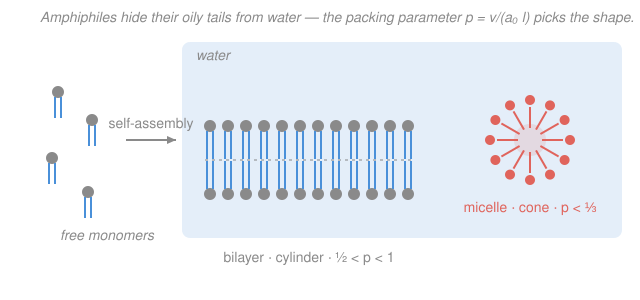

# Biophysics · Lesson 3.4: Self-assembly and the hydrophobic effect

> ⏱ ~15 min · Module 3: Polymers, membranes, and self-assembly · Builds on: [3.3 Stretching single molecules](03-03-stretching-single-molecules.md), [2.1 Free energy and the cell's currency](02-01-free-energy-cell-currency.md) · Unlocks: [3.5 Membrane mechanics](03-05-membrane-mechanics.md)

## Why this matters

A cell has no factory laying down its membranes brick by brick. Drop the right molecules into water and the compartments **build themselves** — bilayers, vesicles, micelles — with no template and no energy input beyond the second law. This is the deepest trick in biology: complex structure from nothing but free-energy minimization. And the engine turns out to be a beautiful surprise. Oil and water don't separate because oil "hates" water; they separate because **water wants its freedom back**. Understand that one entropic sleight of hand and you understand why every membrane in your body exists.

## The idea

Picture a single oily (nonpolar) molecule dropped into water. Water molecules love to hydrogen-bond with each other — that's their whole social life. But the oily intruder can't hydrogen-bond. So the water molecules touching it can't waste those bonds; instead they arrange themselves into a rigid, ordered "cage" (a **clathrate** shell) that keeps their hydrogen bonds intact by pointing them at each other around the intruder. The intruder isn't attacked — it's *quarantined* by an ordered wall of water.

Here's the twist. That ordered cage has **low entropy**: the caging water has lost its freedom to tumble every which way. The universe hates that. So the system finds a way out: **cluster all the oily surfaces together**. Two oily blobs stuck to each other expose *half* the surface to water that two separate blobs would — which means half as much caged, ordered water. Merging the blobs **releases** the imprisoned water back into the free, disordered bulk. Entropy goes up, and the free energy goes down.

> In words: oil and water separate not because the oil molecules attract each other, but because hiding them lets the *surrounding water* return to disorder.

This is the **hydrophobic effect**, and its signature is that the driving free energy is **entropic** and lives in the *surroundings* (the water), not in the oil. It's the concrete payoff of a point from [2.1](02-01-free-energy-cell-currency.md): a process can be spontaneous ($\Delta G < 0$) even when the *system's* own energy doesn't want it — as long as the surroundings' entropy rises enough to pay for it.

Now the biology. A **lipid** is an **amphiphile**: a water-loving (**hydrophilic**) head glued to one or two oily (**hydrophobic**) tails. It can't win either way — the head wants water, the tails want to hide. So a crowd of them resolves the conflict *geometrically*: assemble so the tails huddle in a water-free interior and the heads face outward into the water. Depending on the molecule's shape, that gives a **micelle** (a tail-in ball) or a **bilayer** (two tail-to-tail leaflets — the membrane).

## The formal version

**The hydrophobic free energy.** Transferring a hydrocarbon tail out of water and into an oily interior lowers the free energy by an amount roughly proportional to the tail's buried surface — about

$$\Delta G_{\text{transfer}} \approx -\,\varepsilon\, n_{\mathrm{C}}, \qquad \varepsilon \approx 1.1\,k_BT \ \text{per } \mathrm{CH_2},$$

where $n_{\mathrm{C}}$ is the number of carbons in the tail and $\varepsilon$ is the free energy gained per methylene ($\mathrm{CH_2}$) group buried. *In words: every extra oily group you hide from water is worth about one $k_BT$ of favorable free energy.* Crucially the decomposition $\Delta G = \Delta H - T\Delta S$ shows this is **entropy-driven**: at room temperature $\Delta H \approx 0$ (the oil–water interaction is not the point), and the win comes from the large positive $\Delta S$ of the released cage water.

**The packing parameter.** Whether a lipid tiles into a sphere, a cylinder, or a flat sheet is set by a single dimensionless number comparing the tail's bulk to the head's footprint:

$$p = \frac{v}{a_0\, l},$$

where $v$ is the tail's volume (nm³), $a_0$ is the optimal head-group area (nm²), and $l$ is the tail's length (nm). *In words: $p$ asks whether the molecule is shaped like a cone (small $p$, fat head over skinny tail) or a cylinder (big $p$, tail as wide as head).* The geometry of tiling space then forces the shape:

| $p$ | molecular shape | assembly |
|---|---|---|
| $p < \tfrac13$ | cone | spherical **micelle** |
| $\tfrac13 < p < \tfrac12$ | truncated cone | cylindrical micelle |
| $\tfrac12 < p < 1$ | cylinder | **bilayer** (the membrane) |
| $p > 1$ | inverted cone | inverted / hexagonal phases |

Single-tailed detergents have a fat head over one skinny tail ($p<\tfrac13$) → micelles. Double-tailed phospholipids pack their two tails into nearly the same width as the head ($p\approx0.5$–$0.8$) → **bilayers**. One number, and the shape falls out.

**The critical micelle concentration (CMC).** Self-assembly is **cooperative** — it switches on sharply, like a phase transition. Below a threshold monomer concentration, the amphiphiles float free; above it, every *additional* molecule you add joins an aggregate and the free-monomer concentration stays pinned near that threshold. That threshold is the **CMC**. Because a monomer joining an aggregate cashes in the hydrophobic free energy, the equilibrium (a Boltzmann factor, exactly as in [2.1](02-01-free-energy-cell-currency.md)) gives

$$\ln(\text{CMC}) \approx \text{const} - \frac{|\Delta G_{\text{tail}}|}{k_BT} \approx \text{const} - \varepsilon' n_{\mathrm{C}},$$

with $\Delta G_{\text{tail}}$ the hydrophobic free energy per tail and $\varepsilon' \sim 1$ per carbon. *In words: the CMC drops roughly exponentially as the tail gets longer* — each added $\mathrm{CH_2}$ multiplies the CMC by about $e^{-1}\!\sim\!\tfrac13$. Double-tailed membrane lipids sit so deep in this well that their CMC is around $10^{-10}\,\mathrm{M}$: essentially no lipid ever leaves the membrane, which is exactly why your cells hold together.

## Picture

## Worked examples

**Example 1 (packing parameter → shape).** A double-tailed lipid has tail volume $v = 0.90\ \mathrm{nm^3}$, head area $a_0 = 0.70\ \mathrm{nm^2}$, tail length $l = 1.7\ \mathrm{nm}$. Then

$$p = \frac{v}{a_0 l} = \frac{0.90}{0.70 \times 1.7} = \frac{0.90}{1.19} \approx 0.76.$$

Since $\tfrac12 < 0.76 < 1$, this lipid forms a **bilayer** — a membrane. Now imagine snipping off one of its two tails: $v$ halves to $0.45\ \mathrm{nm^3}$ while $a_0$ and $l$ stay put, so $p \to 0.38$ — a cylindrical micelle. Halve it again to one short tail and $p$ drops below $\tfrac13$ into spherical micelles. *This is why detergents (one tail, micelle-formers) dissolve membranes: they wedge in, drop the local $p$, and turn sheet into ball.*

**Example 2 (sign and magnitude of the hydrophobic $\Delta G$, and why it's entropic).** Take a 14-carbon tail burying itself in a bilayer core. Using $\varepsilon \approx 1.1\,k_BT$ per $\mathrm{CH_2}$,

$$\Delta G_{\text{transfer}} \approx -1.1\,k_BT \times 14 \approx -15\,k_BT \approx -9\ \text{kcal/mol}.$$

The sign is **negative** (assembly is downhill) and the magnitude is **tens of $k_BT$** — enormous next to the $\sim\!k_BT$ thermal jostling, so the membrane is rock-solid against being shaken apart. Why entropic? Split it: measured values give $\Delta H \approx 0$ (nonpolar–water contact is energetically a wash) and a large, favorable $-T\Delta S$ from the caged water set free. So $\Delta G \approx -T\Delta S < 0$: the drive is almost pure *entropy of the surroundings*. Tellingly, the hydrophobic effect gets *stronger* when you warm it up (more $T$ in $-T\Delta S$) — the opposite of what an energy-driven bond would do.

## Watch out

- **You might think oil clumps because oil molecules attract each other.** Van der Waals attraction between hydrocarbons is real but minor; the dominant term is the water's entropy gain from *not* having to cage them. Remove the water and the "hydrophobic force" vanishes.
- **You might think lower entropy of the ordered cage means the effect is entropically *un*favorable.** It's the reverse: the cage is the low-entropy *starting* state; assembly *destroys* the cage and *raises* entropy. The system's own entropy may barely change — the bookkeeping win is in the surroundings, per [2.1](02-01-free-energy-cell-currency.md).
- **You might treat the packing parameter as a property of the lipid alone.** $a_0$ shifts with salt, pH, and temperature (it's the *optimal* head area, set by head–head repulsion). Screen a charged head's repulsion with salt and $a_0$ shrinks, $p$ rises, and micelles can flip to bilayers — chemistry tuning geometry.

## One-liner

> Membranes assemble themselves because hiding lipid tails frees the water that was caging them — an entropic $\Delta G < 0$ paid by the surroundings — and a single number $p = v/(a_0 l)$ decides sphere versus sheet.

## Problems

**P1 (🟢)** A single-tailed surfactant has $v = 0.35\ \mathrm{nm^3}$, $a_0 = 0.70\ \mathrm{nm^2}$, $l = 1.6\ \mathrm{nm}$. (a) Compute $p$ and name the aggregate it forms. (b) A chemist links two of these tails onto one head (so $v$ doubles, $a_0$ and $l$ unchanged). Recompute $p$ and name the new aggregate. What structural change did doubling the tails cause?

**P2 (🟡)** Adding one $\mathrm{CH_2}$ to a surfactant's tail multiplies its CMC by about $e^{-1.1} \approx \tfrac13$. A 10-carbon single-tailed surfactant has $\text{CMC} \approx 30\ \mathrm{mM}$. (a) Estimate the CMC of the 12-carbon version. (b) Explain in one sentence, using this exponential trend, why a double-tailed phospholipid ($\sim\!32$ buried carbons) has a CMC near $10^{-10}\,\mathrm{M}$ and therefore essentially never leaves the membrane.

**P3 (🔴, optional)** The oil–water interface carries a surface tension $\gamma \approx 50\ \mathrm{mJ/m^2}$. (a) Show that $\gamma \approx 12\,k_BT/\mathrm{nm^2}$. (b) Estimate the free-energy penalty of leaving one lipid tail's cross-section ($\approx 0.30\ \mathrm{nm^2}$) exposed to water, in $k_BT$, and use it to argue why lipids pack their heads shoulder-to-shoulder with no gaps.

Solutions

**P1** (a) $p = \dfrac{0.35}{0.70 \times 1.6} = \dfrac{0.35}{1.12} = 0.3125 < \tfrac13$, so it forms a **spherical micelle** (cone-shaped molecule). (b) Doubling the tail volume: $p = \dfrac{0.70}{0.70 \times 1.6} = \dfrac{0.70}{1.12} = 0.625$, now in $\tfrac12 < p < 1$, so it forms a **bilayer**. Doubling the tails turned a micelle-former into a membrane-former — precisely why nature builds membranes from *double*-tailed phospholipids.

*Check.* $p$ doubled because $v$ doubled with $a_0, l$ fixed — dimensionally $p = \mathrm{nm^3/(nm^2\cdot nm)}$ is dimensionless ✓, and the values land in the textbook ranges (single-tail detergents micellize, double-tail lipids bilayer) ✓.

**P2** (a) 10 → 12 carbons is $+2\ \mathrm{CH_2}$, so multiply by $(e^{-1.1})^2 = e^{-2.2} \approx 0.111$: $\text{CMC} \approx 30\ \mathrm{mM} \times 0.111 \approx 3.3\ \mathrm{mM}$. (b) A double-tailed lipid buries roughly $32$ carbons versus $12$ — about $20$ more, so its CMC is smaller by $\sim e^{-1.1 \times 20} = e^{-22} \approx 3\times10^{-10}$; applied to a few-mM single-tail scale that lands near $10^{-10}\,\mathrm{M}$, meaning the monomer concentration needed to pull a lipid off is astronomically tiny — membranes don't dissolve.

*Check.* $30\ \mathrm{mM}\times e^{-22} \approx 30\times10^{-3}\times3\times10^{-10} \approx 10^{-11}\,\mathrm{M}$, the right order of magnitude for phospholipid CMCs (measured $\sim\!10^{-10}\,\mathrm{M}$) ✓. Exponential-in-tail-length is the signature of the hydrophobic free energy adding up per $\mathrm{CH_2}$ ✓.

**P3** (a) Convert: $\gamma = 50\ \mathrm{mJ/m^2} = 50\times10^{-3}\,\mathrm{J/m^2}$. Since $1\ \mathrm{m^2} = 10^{18}\ \mathrm{nm^2}$ and $1\ \mathrm{J} = 10^{21}\ \mathrm{pN\cdot nm}$,

$$\gamma = \frac{50\times10^{-3}\times10^{21}\ \mathrm{pN\cdot nm}}{10^{18}\ \mathrm{nm^2}} = 50\ \frac{\mathrm{pN\cdot nm}}{\mathrm{nm^2}} = \frac{50}{4.1}\,\frac{k_BT}{\mathrm{nm^2}} \approx 12\,\frac{k_BT}{\mathrm{nm^2}}.$$

(b) Exposing $0.30\ \mathrm{nm^2}$ of tail costs $\approx 12 \times 0.30 \approx 3.6\,k_BT$. That is several times $k_BT$ per lipid *per exposed patch* — far too costly to tolerate thermally, so lipids crowd their heads to leave no bare tail facing water. Multiplied over a whole tail's flank (several nm²) this is the tens-of-$k_BT$ drive of Example 2.

*Check.* $\gamma$ in $k_BT/\mathrm{nm^2}$ using $k_BT = 4.1\ \mathrm{pN\cdot nm}$ is the standard PBoC conversion ✓; a few $k_BT$ per exposed lipid patch is the right scale for interfacial packing ✓.

## Flashback

**From Lesson 3.1 (Polymers as random walks: the entropic spring):** A floppy protein loop is modeled as a freely-jointed chain of $N = 100$ Kuhn segments each of length $b = 0.5\ \mathrm{nm}$. Its entropic restoring force for small end-to-end extension $x$ is $F = \dfrac{3k_BT}{Nb^2}\,x$. (a) Find the effective spring constant. (b) What force (in pN) holds the ends $2\ \mathrm{nm}$ apart? (Use $k_BT = 4.1\ \mathrm{pN\cdot nm}$.)

Solution

(a) $k_{\text{eff}} = \dfrac{3k_BT}{Nb^2} = \dfrac{3\times4.1\ \mathrm{pN\cdot nm}}{100\times(0.5\ \mathrm{nm})^2} = \dfrac{12.3\ \mathrm{pN\cdot nm}}{25\ \mathrm{nm^2}} \approx 0.49\ \mathrm{pN/nm}.$

(b) $F = k_{\text{eff}}\,x = 0.49\ \mathrm{pN/nm} \times 2\ \mathrm{nm} \approx 1.0\ \mathrm{pN}.$

*Check.* Units: $(\mathrm{pN\cdot nm})/\mathrm{nm^2} = \mathrm{pN/nm}$ ✓, and $\times\,\mathrm{nm} = \mathrm{pN}$ ✓. About $1\ \mathrm{pN}$ is exactly the scale single-molecule tweezers pull at — the same $k_BT$-per-configuration entropic elasticity that, in this lesson, drives water to release its caged order. Both are entropy doing mechanical work.

## Connections

- **Backward:** the CMC is a Boltzmann equilibrium and the whole drive is an entropy-of-the-surroundings $\Delta G < 0$ — the exact free-energy bookkeeping of [2.1 Free energy and the cell's currency](02-01-free-energy-cell-currency.md), here made physical by caged water. The entropic force that resists stretching a chain in [3.1](03-01-entropic-spring.md) is the same "entropy pushes back" principle wearing a different coat.
- **Forward:** [3.5 Membrane mechanics](03-05-membrane-mechanics.md) takes the bilayer this lesson assembled and treats it as an elastic sheet — an area-stretch modulus and a bending stiffness $\kappa$ — to quantify how it flexes and undulates.
- **Sideways (cooperativity, Module 2):** the sharp onset of assembly at the CMC is a *cooperative* switch — nothing, then suddenly aggregates — the same all-or-none sharpening you met in [2.4 Cooperativity and allostery](02-04-cooperativity-allostery.md), and the same statistical-mechanics story of many weak interactions ganging up into a near-phase-transition.
