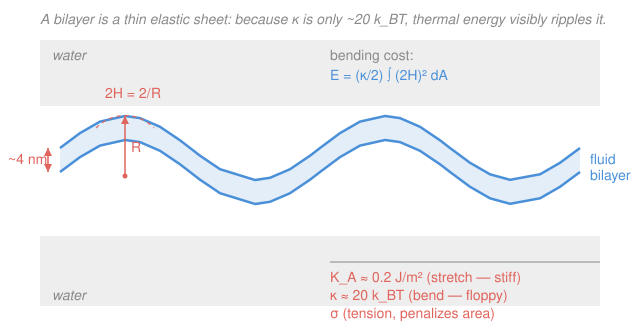

# Biophysics · Lesson 3.5: Membrane mechanics

> ⏱ ~15 min · Module 3: Polymers, membranes, and self-assembly · Builds on: [3.4 Self-assembly and the hydrophobic effect](03-04-self-assembly-hydrophobic.md), [`stat-mech` syllabus](../../stat-mech/syllabus.md) · Unlocks: [3.6 Electrostatics in salt water](03-06-electrostatics-salt-water.md)

## Why this matters

In [3.4](03-04-self-assembly-hydrophobic.md) the hydrophobic effect glued lipids into a bilayer. Now zoom out: that bilayer is a **sheet ~4 nm thick** that a cell folds into vesicles, tubes, the endoplasmic reticulum, and the stacked cristae of a mitochondrion. What does it cost to shape it? The answer is one number, the **bending modulus** $\kappa \approx 20\,k_BT$, and it is *small* — so small that the membrane is floppy, cheap to bend, and visibly rippled by thermal noise. This lesson turns "a bilayer is a sheet" into numbers you can estimate: the energy of a vesicle, the amplitude of its thermal flicker, and why a membrane always bends rather than stretches.

## The idea

Think of a bilayer as a two-dimensional elastic sheet that is *fluid in-plane* — lipids slide past each other freely — but *resists three kinds of deformation*, each with an energy cost:

1. **Area stretch.** Pull on the sheet and you spread each lipid over more area. This is stiff: membranes rupture at only **2–4% area strain**. So real shape changes almost never come from stretching.
2. **Bending.** Curve the sheet without changing its area. This is *cheap* — that small $\kappa \approx 20\,k_BT$. Bending is how a cell actually reshapes membranes.
3. **Tension.** A lateral pull $\sigma$ that penalizes total area. Tension flattens the sheet and damps its ripples.

The punchline of the whole lesson: because stretching is expensive and bending is cheap, a membrane responds to *any* demand to change shape by **bending at constant area**. And because $\kappa$ is a mere $\sim\!20\,k_BT$, thermal energy — a few $k_BT$ — is enough to make the sheet ripple all on its own. Watch a giant lipid vesicle under a microscope and you see it *flicker*. Measure that flicker and you have measured $\kappa$.

## The formal version

**Area stretch.** Let a patch of area $A_0$ be stretched to $A$, with fractional strain $u = \Delta A/A_0$. The elastic energy per unit area is

$$e_{\text{stretch}} = \tfrac12\, K_A\, u^2, \qquad u = \frac{\Delta A}{A_0},$$

with **area-stretch modulus** $K_A \approx 0.2\ \mathrm{J/m^2}$. *In words: stretching costs energy like a spring in the area, and $K_A$ is the stiffness of that spring.* Rupture at $u \sim 0.02$–$0.04$ tells you the membrane is essentially **inextensible**.

**Bending — the Helfrich energy.** Describe the local shape by the **mean curvature** $H$ (for a sphere of radius $R$, $H = 1/R$; for a flat sheet, $H=0$). The bending energy of the whole sheet is

$$\boxed{\,E_{\text{bend}} = \frac{\kappa}{2}\int (2H)^2\, dA\,}$$

with **bending modulus** $\kappa \approx 20\,k_BT$ — the key number of this lesson. *In words: every bit of curvature costs energy proportional to curvature squared, and $\kappa$ sets the price.* (We drop the Gaussian-curvature term, which by a topological theorem is constant unless the sheet changes its number of handles or edges.)

**Tension.** A membrane under lateral tension $\sigma$ pays $\sigma$ per unit of excess area. Tension and bending together control the shape.

**Thermal undulations.** Parametrize small out-of-plane ripples by a height field $h(\mathbf r)$ and decompose into Fourier modes of wavevector $\mathbf q$ (wavelength $2\pi/|\mathbf q|$). Each mode is an independent harmonic degree of freedom, so by **equipartition** it carries $\tfrac12 k_BT$ — exactly the stat-mech rule from [`stat-mech`](../../stat-mech/syllabus.md). Working out the Helfrich (plus tension) energy of each mode gives the **fluctuation spectrum**

$$\langle |h_q|^2 \rangle = \frac{k_BT}{A\,(\kappa q^4 + \sigma q^2)}.$$

*In words: the mean-square amplitude of a ripple of wavevector $q$ is set by temperature divided by its stiffness $\kappa q^4 + \sigma q^2$.* Two things to read off: (i) long-wavelength modes (small $q$) fluctuate **most** — the $q^4$ in the denominator makes big, gentle ripples floppy; (ii) measuring $\langle |h_q|^2\rangle$ versus $q$ — **flicker spectroscopy** — hands you $\kappa$ directly. These same undulations, pressed between two membranes, generate an entropic **Helfrich repulsion** (squeezing the ripples costs entropy).

## Picture

## Worked examples

**Example 1 (the bending energy of a vesicle — radius-independent!).** Form a spherical vesicle of radius $R$ from a flat patch. A sphere has $H = 1/R$ everywhere, so $(2H)^2 = 4/R^2$, and its area is $\int dA = 4\pi R^2$. Then

$$E_{\text{bend}} = \frac{\kappa}{2}\,(2H)^2 \int dA = \frac{\kappa}{2}\cdot\frac{4}{R^2}\cdot 4\pi R^2 = 8\pi\kappa.$$

The $R^2$'s cancel: **every** spherical vesicle costs the *same* bending energy, independent of size. Numerically, with $\kappa = 20\,k_BT$,

$$E_{\text{bend}} = 8\pi \times 20\,k_BT \approx 502\,k_BT \approx 500\,k_BT \approx 2100\ \mathrm{pN\cdot nm}.$$

*Why this matters:* $\sim\!500\,k_BT$ is a real barrier — a lot compared to the few $k_BT$ that drives most molecular events. That is why cells don't bud vesicles by thermal luck; they recruit protein coats (clathrin, COPII) whose binding energy pays the $8\pi\kappa$ bill. Yet the same small $\kappa$ makes *gentle*, large-radius shapes — ER tubes, ruffles, cristae — nearly free.

**Example 2 (why a membrane bends instead of stretches).** Compare the two ways to deform a patch of area $A = 1\ \mu\mathrm{m}^2 = 10^{-12}\ \mathrm{m}^2$.

*Stretch* it by just 1% ($u = 0.01$):

$$E_{\text{stretch}} = \tfrac12 K_A u^2 \,A = \tfrac12 (0.2)(0.01)^2 (10^{-12}) = 1.0\times10^{-17}\ \mathrm{J} \approx \frac{1.0\times10^{-17}}{4.1\times10^{-21}}\,k_BT \approx 2400\,k_BT.$$

*Bend* the same patch into a whole closed vesicle — total cost $8\pi\kappa \approx 500\,k_BT$ (Example 1), and gentler curvatures cost far less.

A mere 1% stretch already costs several times more than folding the entire patch into a vesicle. So when a cell needs to change shape, the membrane keeps its area fixed and **bends**. *In words: stretching is the expensive knob, bending the cheap one — biology always turns the cheap knob.*

## Watch out

- **You might think a smaller vesicle costs more to bend.** For the *total* Helfrich energy of a sphere it doesn't — it's exactly $8\pi\kappa$ regardless of $R$. What grows for small vesicles is the **curvature energy per lipid** and the strain of packing; the size-dependence enters through tension, spontaneous curvature, and edge effects, not the bare $8\pi\kappa$.
- **You might conflate $K_A$ and $\kappa$.** They are different moduli with different units — $K_A$ in $\mathrm{J/m^2}$ (energy per area, for stretching), $\kappa$ in $\mathrm{J}$ (energy, for bending). Roughly $\kappa \sim K_A\, d^2$ with $d$ the bilayer thickness, but never plug one in for the other.
- **You might expect all thermal ripples to be the same size.** They aren't — the $q^4$ law means long-wavelength modes dominate. The visible flicker of a giant vesicle is almost entirely its few longest-wavelength modes.

## One-liner

> A bilayer is an inextensible elastic sheet whose only cheap deformation is bending at cost $\kappa \approx 20\,k_BT$; a vesicle costs $8\pi\kappa \approx 500\,k_BT$ no matter its size, and the same small $\kappa$ lets thermal noise ripple it — flicker that *measures* $\kappa$.

## Problems

**P1 (🟢)** A bilayer has $\kappa = 25\,k_BT$. (a) What is the bending energy of a spherical vesicle made from it, in $k_BT$? (b) Does your answer change if the vesicle is 50 nm across versus 500 nm across? Explain in one sentence.

**P2 (🟡)** Estimate the lateral tension $\sigma$ needed to stretch a membrane's area by 2% ($u = 0.02$), using $K_A = 0.2\ \mathrm{J/m^2}$. Tension is the derivative of the stretch energy density with respect to strain, $\sigma = K_A\,u$. Give $\sigma$ in $\mathrm{mN/m}$, and say whether this strain is near where real membranes rupture.

**P3 (🔴, optional)** *Extracting $\kappa$ from flicker.* Model a single bending mode as a corrugation $h(x) = a\cos(qx)$ on a tension-free patch of area $A$. (a) Show its Helfrich energy is $E = \tfrac14\,\kappa\, q^4 a^2 A$. (b) Set $\langle E\rangle = \tfrac12 k_BT$ (equipartition) to get $\langle a^2\rangle = 2k_BT/(\kappa q^4 A)$. (c) For the **longest** mode on a patch of side $L = 5\ \mu\mathrm{m}$ (so $q = 2\pi/L$, $A = L^2$) with $\kappa = 20\,k_BT$, estimate the rms amplitude $\sqrt{\langle a^2\rangle}$ in nm. Is it optically visible?

Solutions

**P1** (a) The total Helfrich energy of a sphere is $8\pi\kappa$ (the $R$'s cancel, Example 1):

$$E = 8\pi\kappa = 8\pi \times 25\,k_BT \approx 628\,k_BT \approx 630\,k_BT.$$

(b) **No change.** $8\pi\kappa$ is radius-independent, so the 50 nm and 500 nm vesicles cost the same bending energy.

*Check.* Units: $\kappa$ is an energy, so $8\pi\kappa$ is an energy ✓. Order of magnitude: $\sim\!600\,k_BT$, comparable to the $\sim\!500\,k_BT$ for $\kappa = 20\,k_BT$ — the size of a clathrin coat's binding budget, which is why real vesicle budding needs proteins. ✓

**P2** With $\sigma = K_A\,u$:

$$\sigma = (0.2\ \mathrm{J/m^2})(0.02) = 4\times10^{-3}\ \mathrm{J/m^2} = 4\times10^{-3}\ \mathrm{N/m} = 4\ \mathrm{mN/m}.$$

A 2% strain sits right in the **rupture window** (2–4%), so a few $\mathrm{mN/m}$ is about the most tension a bilayer can bear before it pops. This is why membranes are treated as nearly inextensible: the accessible tension range is tiny.

*Check.* Units: $\mathrm{J/m^2} = \mathrm{N\cdot m/m^2} = \mathrm{N/m}$ ✓. Real lysis tensions for lipid vesicles are indeed a few $\mathrm{mN/m}$, matching this. ✓

**P3** (a) With $h = a\cos(qx)$, the curvature is $\partial_x^2 h = -q^2 a\cos(qx)$, so $(\nabla^2 h)^2 = q^4 a^2\cos^2(qx)$. In the small-slope limit the Helfrich integrand is $\tfrac{\kappa}{2}(\nabla^2 h)^2$, and averaging $\cos^2$ over the patch gives $\tfrac12$:

$$E = \frac{\kappa}{2}\int (\nabla^2 h)^2\, dA = \frac{\kappa}{2}\, q^4 a^2 \cdot \tfrac12 A = \tfrac14\,\kappa\, q^4 a^2 A.$$

(b) Equipartition on this one quadratic mode: $\langle E\rangle = \tfrac14 \kappa q^4 A\,\langle a^2\rangle = \tfrac12 k_BT$, so

$$\langle a^2\rangle = \frac{2k_BT}{\kappa\, q^4 A}.$$

(c) Longest mode: $q = 2\pi/L$, $A = L^2$, so $q^4 A = (2\pi)^4 L^2 / L^4 = 16\pi^4/L^2$ and

$$\langle a^2\rangle = \frac{2k_BT\,L^2}{\kappa\,16\pi^4} = \frac{L^2}{8\pi^4\,\kappa/k_BT}.$$

With $L = 5000\ \mathrm{nm}$ and $\kappa = 20\,k_BT$:

$$\langle a^2\rangle = \frac{(5000)^2}{8\pi^4 (20)}\ \mathrm{nm^2} = \frac{2.5\times10^{7}}{1.56\times10^{4}}\ \mathrm{nm^2} \approx 1.6\times10^{3}\ \mathrm{nm^2}, \qquad \sqrt{\langle a^2\rangle} \approx 40\ \mathrm{nm}.$$

**Yes — optically visible.** A $\sim\!40$ nm ripple on a 5 µm vesicle is exactly the flicker seen under a microscope; tracking $\langle a^2\rangle$ versus $q$ is how $\kappa$ is measured.

*Check.* The amplitude *grows with $L$* and *shrinks as $\kappa$ rises* — floppier (smaller $\kappa$) or bigger patches ripple more, as intuition demands ✓. Stiffer membranes (say $\kappa = 400\,k_BT$ for a red-cell-scale composite) would give $\sqrt{1600/20} \approx 9$ nm, harder to see — consistent with stiffer sheets flickering less. ✓

## Flashback

**From Lesson 3.4 (Self-assembly and the hydrophobic effect):** A single-tailed surfactant has a critical micelle concentration of $\mathrm{CMC} = 8\ \mathrm{mM}$. Its assembly is driven by burying the hydrocarbon tail: at threshold, a monomer's chemical potential in water equals its value in a micelle, which makes $\mathrm{CMC} \propto e^{+\Delta G_{\text{transfer}}/k_BT}$, where $\Delta G_{\text{transfer}} > 0$ is the cost of pulling one molecule *out* into water. Adding two $\mathrm{CH_2}$ groups to the tail raises that cost by about $2\,k_BT$ (roughly $1\,k_BT$ per $\mathrm{CH_2}$). Estimate the new CMC.

Solution

The CMC scales as the Boltzmann factor of the transfer free energy. Making $\Delta G_{\text{transfer}}$ *more* positive by $2\,k_BT$ multiplies the CMC by $e^{-2}$:

$$\mathrm{CMC}_{\text{new}} = \mathrm{CMC}\times e^{-2} = 8\ \mathrm{mM} \times 0.135 \approx 1.1\ \mathrm{mM}.$$

*Check.* Longer tails are more hydrophobic, so they self-assemble at *lower* concentration — the CMC drops, as it should. The rule "about a factor of $e$ per $\mathrm{CH_2}$" is Traube's rule, seen across real surfactant series. This is the same Boltzmann-factor bookkeeping as the fluctuation spectrum above — free energy in, exponential out. ✓

## Connections

- **Backward:** the sheet whose mechanics we just quantified is the very bilayer that self-assembled in [3.4](03-04-self-assembly-hydrophobic.md); the hydrophobic cohesion that sets the CMC there is also what sets $K_A$ and $\kappa$ here. The bending-vs-stretching argument reuses the "spring energy $\propto$ deformation squared" idea from the entropic spring in [3.1](03-01-entropic-spring.md).
- **Forward:** [3.6 Electrostatics in salt water](03-06-electrostatics-salt-water.md) adds the fact that membranes are *charged* — surface charge couples to tension and curvature — and Module 4's channels and pumps all live inside this elastic sheet, whose tension gates mechanosensitive channels.
- **Sideways:** the $\tfrac12 k_BT$-per-mode equipartition that fixed the fluctuation spectrum is the same theorem you met in [`stat-mech`](../../stat-mech/syllabus.md); and membrane curvature and tension are the mechanical inputs to cell shape and morphogenesis modeled in [`systems-biology`](../../systems-biology/syllabus.md).
