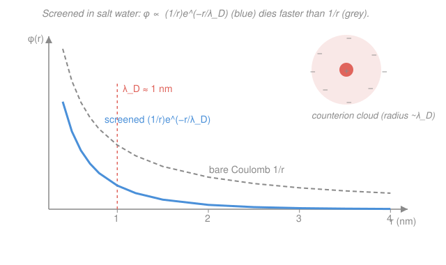

# Biophysics · Lesson 3.6: Electrostatics in salt water

> ⏱ ~15 min · Module 3: Polymers, membranes, and self-assembly · Builds on: [3.5 Membrane mechanics](03-05-membrane-mechanics.md), [`stat-mech` syllabus](../../stat-mech/syllabus.md) · Unlocks: [4.1 Reaction kinetics and mass action](04-01-reaction-kinetics-mass-action.md)

## Why this matters

Every textbook draws two charges pulling on each other across a page. Inside a cell that picture is a lie. Biology happens in **salt water** — roughly 150 mM of $\mathrm{Na}^+$, $\mathrm{K}^+$, $\mathrm{Cl}^-$ and friends, all free to move — and those mobile ions swarm around any charge and *cancel its field*. The reach of an electric influence in the cell is not "the whole cell" and not "infinity"; it is about **one nanometer**. That single fact reorganizes molecular biology: proteins can't feel each other electrostatically across the cytoplasm, DNA's enormous charge is largely neutralized, and yet at contact — inside that nanometer — charges dominate binding. This lesson gives you the one number you need, the **Debye length** $\lambda_D \approx 1$ nm, and the two ideas behind it. It's also the same screening you'll meet as a plasma physicist ([`plasma-physics` syllabus](../../plasma-physics/syllabus.md)) — biology and fusion plasmas obey the *same* equation.

## The idea

Drop a positive charge into pure water and its field reaches out forever, falling as $1/r$. Now dissolve salt. The negative ions ($\mathrm{Cl}^-$) are slightly attracted inward toward the charge, the positive ions ($\mathrm{Na}^+$) slightly pushed away. The result is a diffuse **cloud of net-negative charge** hugging our positive intruder. Stand a little distance away and you see the original charge *plus its cloud* — and the cloud's job is to hide it. Beyond a certain distance the cloud has piled up enough opposite charge to cancel the intruder almost completely. That distance is the **Debye screening length** $\lambda_D$.

There are two competing effects, and $\lambda_D$ is where they balance. Electrostatics wants to pull counterions into a tight neutralizing shell; **thermal motion** ($k_BT$) wants to kick them back out into a uniform soup. More salt (more ions available to screen) or colder water $\to$ tighter cloud, shorter reach. In physiological salt the balance lands at $\lambda_D \approx 0.8$–$1$ nm. So the working rule for the whole cell is brutally simple: **to know whether electrostatics matters between two charges, compare their separation to $\approx 1$ nm.** Closer than that, they feel each other strongly; farther, thermal jostling of the ion cloud has erased the conversation.

Before that, one companion number. Even in salt-free water, when do two bare charges "feel" each other at all? When their mutual Coulomb energy beats $k_BT$. The separation where those are equal is the **Bjerrum length** $l_B \approx 0.7$ nm in water — a second nanometer-scale ruler, and the natural yardstick for how strongly charges couple.

## The formal version

**The Bjerrum length.** Two elementary charges $e$ a distance $r$ apart in a medium of relative permittivity $\varepsilon_r$ have Coulomb energy $U(r) = e^2/(4\pi\varepsilon_0\varepsilon_r r)$. Set $U = k_BT$ and solve for $r$:

$$l_B \equiv \frac{e^2}{4\pi\varepsilon_0\varepsilon_r\,k_BT}.$$

*In words: $l_B$ is the separation at which two elementary charges' electrostatic energy equals one unit of thermal energy.* Closer than $l_B$, Coulomb wins and the charges are "aware" of each other; farther, thermal motion drowns the interaction out. Water is a strong dielectric ($\varepsilon_r \approx 80$ — its polar molecules reorient to blunt fields), and plugging in $e = 1.60\times10^{-19}$ C, $\varepsilon_0 = 8.85\times10^{-12}$ F/m, $k_BT = 4.1\times10^{-21}$ J at $T \approx 300$ K gives

$$l_B^{\text{water}} \approx 0.70\ \text{nm}.$$

The huge $\varepsilon_r$ is doing the work: in vacuum ($\varepsilon_r = 1$) the same formula gives $\approx 56$ nm.

**The Poisson–Boltzmann equation.** Now put a charge in salt water and let the mobile ions respond. Two laws close the loop. First, ions of charge $\pm e$ sit in the local potential $\varphi(\mathbf r)$ with Boltzmann-weighted densities (this is just [`stat-mech`'s](../../stat-mech/syllabus.md) Boltzmann factor):

$$n_\pm(\mathbf r) = n_0\, e^{\mp e\varphi/k_BT},$$

where $n_0$ is the bulk number density of each ion species far away. *In words: counterions pile up where the potential attracts them, co-ions deplete.* Second, Poisson's equation ties the potential to the charge density $\rho$ those ions make:

$$\nabla^2\varphi = -\frac{\rho}{\varepsilon_0\varepsilon_r}, \qquad \rho = e\,(n_+ - n_-) = -2 e\, n_0 \sinh\!\Big(\frac{e\varphi}{k_BT}\Big).$$

Substituting gives the **Poisson–Boltzmann equation**, $\nabla^2\varphi = (2en_0/\varepsilon_0\varepsilon_r)\sinh(e\varphi/k_BT)$ — nonlinear and nasty.

**Debye–Hückel (the linearization).** When the potential is weak, $e\varphi \ll k_BT$, use $\sinh x \approx x$:

$$\boxed{\ \nabla^2\varphi = \frac{\varphi}{\lambda_D^2}\ } \qquad\text{with}\qquad \lambda_D = \sqrt{\frac{\varepsilon_0\varepsilon_r\,k_BT}{2\,n_0 e^2 z^2}} = \frac{1}{\sqrt{8\pi\, l_B\, n_0}}\ \ (\text{1:1 salt, } z=1).$$

*In words: the potential obeys a screened Laplace equation whose single length scale is $\lambda_D$.* This is **exactly** the Debye shielding of an electrolyte or a plasma — the same equation the plasma course derives for quasineutral shielding around a test charge. For a point charge in three dimensions the solution is the **screened (Yukawa) potential**

$$\varphi(r) = \frac{q}{4\pi\varepsilon_0\varepsilon_r\, r}\, e^{-r/\lambda_D},$$

the bare Coulomb $1/r$ multiplied by an exponential cutoff that switches off past $\lambda_D$. Note $\lambda_D \propto 1/\sqrt{n_0}$: **more salt, shorter reach.** In physiological $\approx 150$ mM monovalent salt,

$$\lambda_D \approx 0.8\ \text{nm}.$$

A handy room-temperature shortcut for 1:1 salt in water: $\lambda_D\ (\text{nm}) \approx 0.30/\sqrt{I}$ with the ionic strength $I$ in molar.

## Picture

## Worked examples

**Example 1 (the reach of a charge — physiological vs. low salt).** Take the shortcut $\lambda_D \approx 0.30/\sqrt{I}$ nm.

- Physiological, $I = 0.15$ M: $\lambda_D \approx 0.30/\sqrt{0.15} = 0.30/0.387 \approx 0.78$ nm.
- Dilute, $I = 0.01$ M (10 mM): $\lambda_D \approx 0.30/\sqrt{0.01} = 0.30/0.10 \approx 3.0$ nm.

Dropping the salt 15-fold lengthens the reach only $\sqrt{15}\approx 3.9\times$ — screening fights back slowly, because $\lambda_D \propto 1/\sqrt{n_0}$. Either way the answer is a *small number of nanometers*: in the crowded cytoplasm, electrostatics is a contact sport.

**Example 2 (why you can't steer a protein with charge).** Two charged patches on separate proteins sit $r = 2$ nm apart in physiological salt ($\lambda_D \approx 0.8$ nm). How much of their bare Coulomb attraction survives? The screening factor is

$$e^{-r/\lambda_D} = e^{-2/0.8} = e^{-2.5} \approx 0.082.$$

Over 90% of the interaction is gone at just 2 nm — and at 4 nm, $e^{-5}\approx 0.007$, essentially nothing. So a cell **cannot** rely on long-range Coulomb forces to guide two molecules together across the cytoplasm; the ion cloud erases the signal within a couple of nanometers. Recognition has to happen by diffusion-and-collision (Module 1) with the electrostatics only closing the deal at contact. This is also why **DNA's** enormous linear charge (one $-e$ every 0.17 nm) doesn't repel everything in sight: a tight sheath of counterions condenses onto it (**Manning condensation**) and neutralizes most of the charge, leaving only a short-range, screened residue. Inside $\lambda_D$, though — a salt bridge, a docked ligand — those same charges are worth several $k_BT$ and make or break binding.

## Watch out

- **You might think a bigger cell means longer-range forces.** The cell's *size* is irrelevant; the *salt concentration* sets the reach. A charge in a bacterium and a charge in a neuron both go silent past $\approx 1$ nm because both sit in $\approx 150$ mM salt. Screening is set by $n_0$, not geometry.
- **You might treat $l_B$ and $\lambda_D$ as the same nanometer.** They answer different questions. $l_B$ (fixed by the solvent and temperature, $\approx 0.7$ nm in water) is *how strongly* two bare charges couple; $\lambda_D$ (set by salt, $\approx 1$ nm here) is *how far* a charge's influence penetrates the electrolyte before the ion cloud kills it. More salt shortens $\lambda_D$ but leaves $l_B$ untouched.
- **You might forget the linearization has limits.** Debye–Hückel assumes $e\varphi \ll k_BT$. Right against a highly charged surface like DNA or a membrane, $e\varphi \gtrsim k_BT$ and the full nonlinear Poisson–Boltzmann (or counterion condensation) is needed. The $e^{-r/\lambda_D}$ form is the correct *far-field* tail, not the value at the surface.
- **You might expect divalent ions to behave like monovalent.** $\lambda_D \propto 1/(z\sqrt{n_0})$-ish through the ionic strength $I = \tfrac12\sum_i c_i z_i^2$: a $\mathrm{Ca}^{2+}$ ion counts $z^2 = 4$ times as much as $\mathrm{Na}^+$. A little multivalent salt screens disproportionately.

## One-liner

> In the cell's salt water a charge wears a counterion cloud that hides it past the Debye length $\lambda_D \approx 1$ nm — so electrostatics is short-range, and "does it matter?" is answered by comparing the distance to a nanometer.

## Problems

**P1 (🟢)** Using $\lambda_D\ (\text{nm}) \approx 0.30/\sqrt{I}$ (ionic strength $I$ in molar, 1:1 salt, room temperature), find the Debye length in (a) physiological 150 mM salt and (b) a dilute 10 mM buffer. By what factor does the reach change, and why isn't it 15×?

**P2 (🟡)** Compute the Bjerrum length $l_B = e^2/(4\pi\varepsilon_0\varepsilon_r k_BT)$ in water ($\varepsilon_r = 80$) at $T = 300$ K, using $e = 1.60\times10^{-19}$ C, $\varepsilon_0 = 8.85\times10^{-12}$ F/m, $k_BT = 4.1\times10^{-21}$ J. What is the physical meaning of the distance you get? What would $l_B$ be in vacuum ($\varepsilon_r = 1$), and what does the 80× difference tell you about why life uses water?

**P3 (🔴, optional)** A charge sits in physiological salt, $\lambda_D = 0.8$ nm. Compared with the *unscreened* Coulomb potential at the same distance, what fraction of the potential survives at (a) $r = \lambda_D$, (b) $r = 2\lambda_D$, and (c) $r = 5$ nm? Use the result to justify, in one sentence, the claim that electrostatic interactions in the cell are effectively short-range.

Solutions

**P1** (a) $I = 0.15$ M: $\lambda_D \approx 0.30/\sqrt{0.15} = 0.30/0.387 \approx 0.78$ nm. (b) $I = 0.01$ M: $\lambda_D \approx 0.30/\sqrt{0.01} = 0.30/0.10 = 3.0$ nm. The reach grows by $3.0/0.78 \approx 3.9\times$, **not** 15×, because $\lambda_D \propto 1/\sqrt{n_0}$ — screening depends on the *square root* of concentration, so a 15-fold dilution buys only $\sqrt{15}\approx 3.9$ in length.

*Check.* Both land in the "few nanometers" range that matches real electrophoresis and colloid measurements; $0.78$ nm at physiological salt is the textbook value ($\approx 0.8$–$1$ nm). ✓

**P2** Plug in:

$$l_B = \frac{(1.60\times10^{-19})^2}{4\pi(8.85\times10^{-12})(80)(4.1\times10^{-21})}.$$

Numerator: $(1.60\times10^{-19})^2 = 2.56\times10^{-38}$. Denominator: $4\pi\varepsilon_0 = 1.113\times10^{-10}$; times $80 = 8.90\times10^{-9}$; times $4.1\times10^{-21} = 3.65\times10^{-29}$. So

$$l_B = \frac{2.56\times10^{-38}}{3.65\times10^{-29}} = 7.0\times10^{-10}\ \text{m} = 0.70\ \text{nm}.$$

**Meaning:** $l_B$ is the separation at which two elementary charges' Coulomb energy equals $k_BT$ — closer, and they couple strongly; farther, thermal motion washes the interaction out. In vacuum, remove the factor of 80: $l_B = 0.70 \times 80 = 56$ nm. Water's high dielectric constant shrinks the electrostatic coupling length ~80-fold, damping charge interactions so that biology can be run by gentle, $k_BT$-scale, *tunable* forces rather than by overwhelming Coulomb bonds. Water is the enabler of soft, reversible electrostatics.

*Check.* Units: $\mathrm{C^2 / (F\,m^{-1}\cdot J)} = \mathrm{C^2/(C^2 J^{-1} m^{-1}\cdot J)} = \mathrm{m}$ ✓ (using $1\ \mathrm F = \mathrm{C^2/J}$). Value $0.70$ nm matches the standard biophysics number. ✓

**P3** The screened potential is the bare Coulomb value times $e^{-r/\lambda_D}$, so the surviving *fraction* is exactly $e^{-r/\lambda_D}$.

- (a) $r = \lambda_D$: $e^{-1} \approx 0.37$ — already down to ~37%.
- (b) $r = 2\lambda_D$: $e^{-2} \approx 0.14$ — ~86% gone.
- (c) $r = 5$ nm $= 5/0.8 = 6.25\,\lambda_D$: $e^{-6.25} \approx 0.0019$ — about 0.2% left.

Beyond a couple of Debye lengths (a few nm) less than 15% of the interaction remains and by 5 nm it is essentially zero, so charges in the cell talk only to near neighbors — electrostatics is short-range. ∎

*Check.* At $r=0$ the factor is $e^0 = 1$ (full bare Coulomb, as it must be up close), and it decays monotonically — consistent with the blue curve in the figure diving below the grey $1/r$. ✓

## Flashback

**From Lesson 3.5 (Membrane mechanics):** A lipid bilayer has bending modulus $\kappa \approx 20\,k_BT$. The Helfrich bending energy of a *closed spherical* vesicle (zero spontaneous curvature) is $E = 8\pi\kappa$, independent of its radius. (a) Evaluate $E$ in units of $k_BT$. (b) In units of ATP hydrolysis ($\approx 20\,k_BT$), how many ATP does that cost? (c) Is thermal noise ($\sim k_BT$ per fluctuation) enough to bud a vesicle spontaneously? *Recall for (a): for a sphere of radius $R$ both principal curvatures equal $1/R$, so the mean-curvature term $(c_1+c_2)^2 = (2/R)^2$ and the area is $4\pi R^2$ — the $R$'s cancel.*

Solution

(a) $E = 8\pi\kappa = 8\pi(20\,k_BT) \approx 502\,k_BT \approx 5\times10^2\,k_BT$. (The cancellation: $E = \tfrac{\kappa}{2}\!\int (c_1+c_2)^2\,dA = \tfrac{\kappa}{2}(2/R)^2(4\pi R^2) = \tfrac{\kappa}{2}\cdot 16\pi = 8\pi\kappa$ — radius drops out.)

(b) $502\,k_BT / 20\,k_BT \approx 25$ ATP.

(c) No. A single thermal kick is worth $\sim 1\,k_BT$; assembling $\sim 500\,k_BT$ of curvature by chance is astronomically unlikely ($\propto e^{-500}$). Cells bud vesicles with **protein machinery** (clathrin coats, BAR-domain scaffolds) that pays the bending cost, not by waiting for a fluctuation.

*Check.* $8\pi\kappa$ is dimensionless in $k_BT$ (as it must be, since $\kappa$ is measured in $k_BT$), and the radius-independence is the famous scale-free result for vesicle bending energy. ✓

## Connections

- **Backward:** the ion densities $n_\pm = n_0 e^{\mp e\varphi/k_BT}$ are nothing but the [`stat-mech`](../../stat-mech/syllabus.md) Boltzmann factor applied to charges in a potential — the same distribution that gave two-state gating and ligand occupancy in Module 2. Screening is that competition between an energy and $k_BT$ once more, now resolved into a *length*.
- **Forward:** short-range, screened electrostatics is why [4.1 Reaction kinetics and mass action](04-01-reaction-kinetics-mass-action.md) and the binding rates that follow can be treated as *contact* events — molecules must physically collide (diffusion, Module 1) before charge helps; there is no long-range electrostatic steering to fold into the rate constants. It also underlies the ion gradients of [4.4 Membrane potentials](04-04-membrane-potentials-nernst-goldman.md).
- **Sideways:** the Debye–Hückel equation $\nabla^2\varphi = \varphi/\lambda_D^2$ and the Yukawa potential $(q/r)e^{-r/\lambda_D}$ are *identical* to plasma Debye shielding of a test charge ([`plasma-physics` syllabus](../../plasma-physics/syllabus.md)) and to screened electrostatics in [`em-refresher`](../../em-refresher/syllabus.md) — an electrolyte and a fusion plasma quiet a charge by the very same mechanism, mobile carriers rearranging until the field is cloaked.
